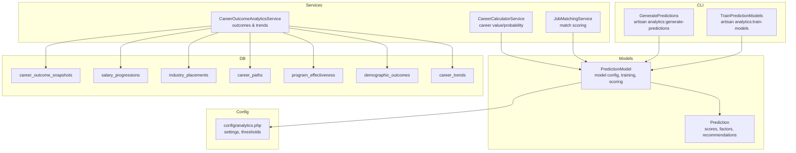
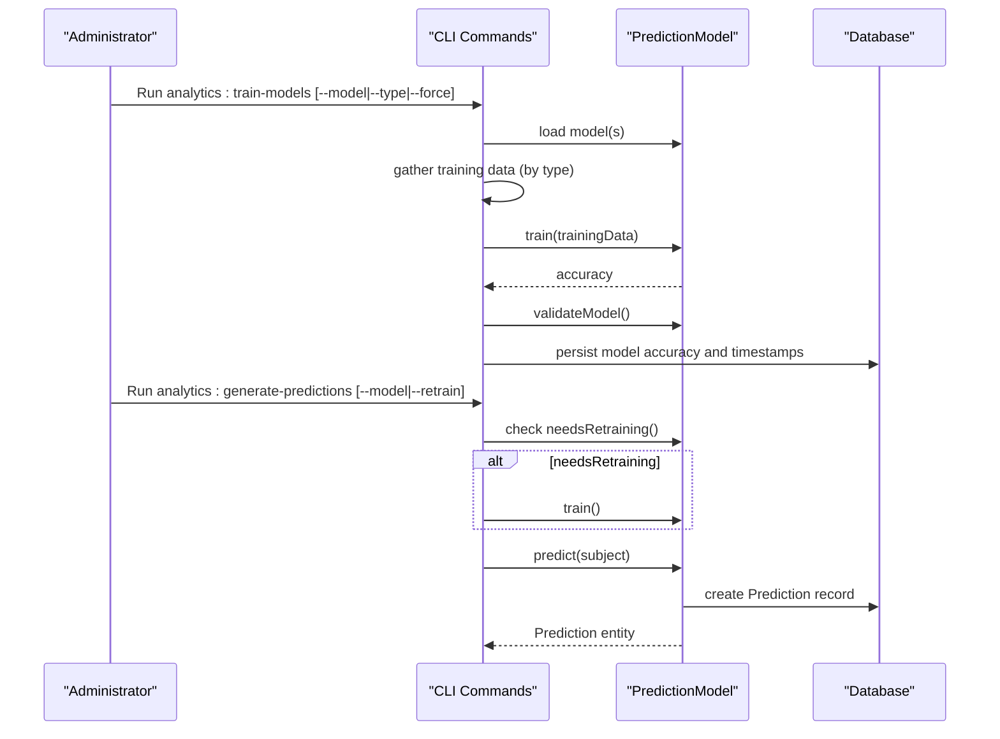
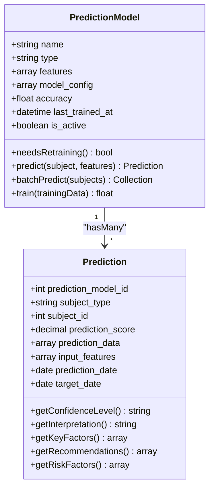
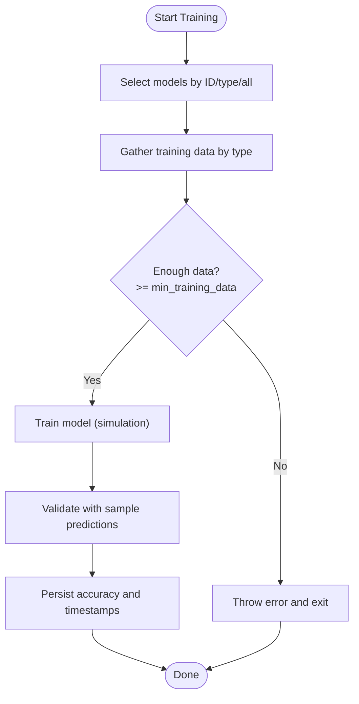
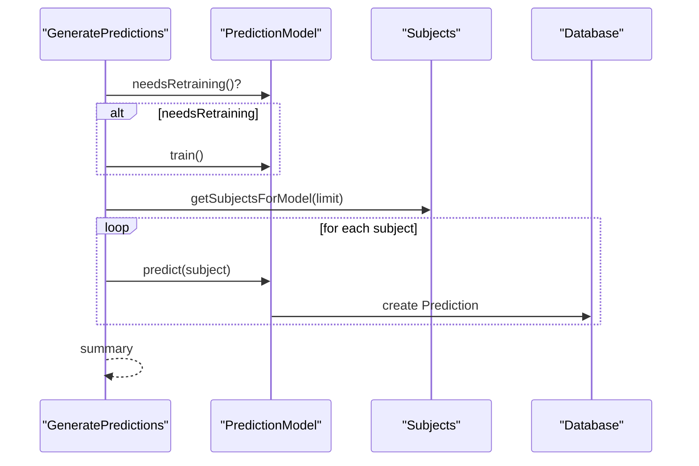
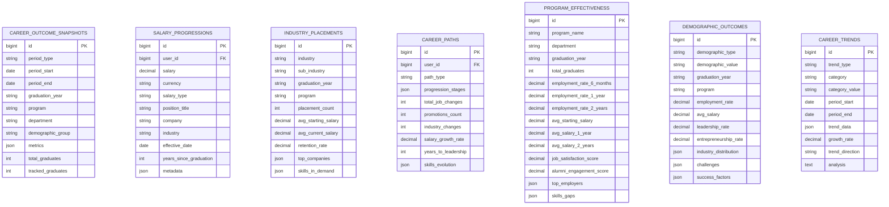
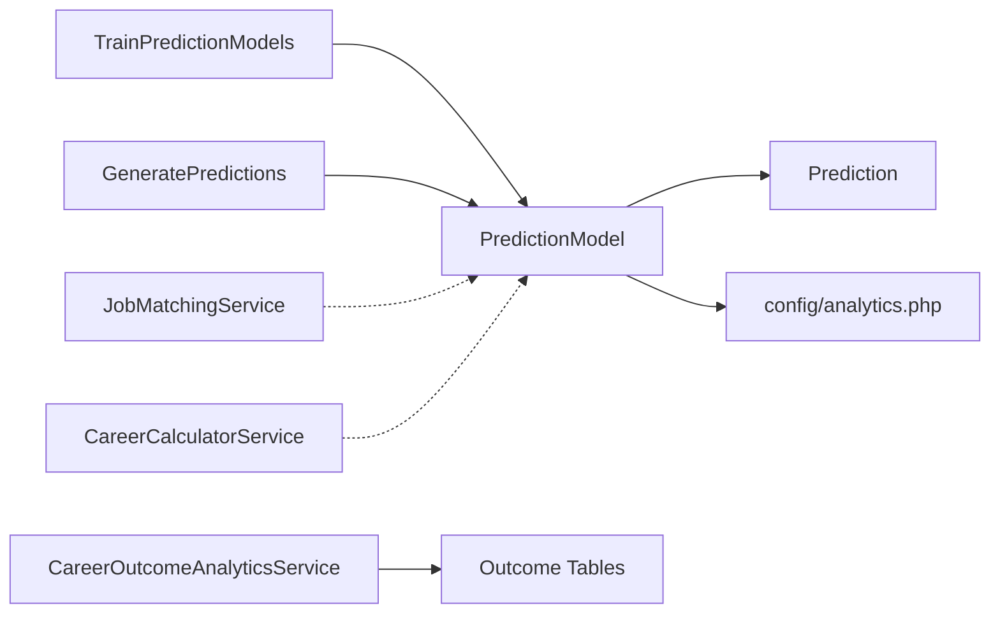

# Predictive Analytics

<cite>
**Referenced Files in This Document**
- [TrainPredictionModels.php](file://app/Console/Commands/TrainPredictionModels.php)
- [GeneratePredictions.php](file://app/Console/Commands/GeneratePredictions.php)
- [PredictionModel.php](file://app/Models/PredictionModel.php)
- [Prediction.php](file://app/Models/Prediction.php)
- [analytics.php](file://config/analytics.php)
- [CareerCalculatorService.php](file://app/Services/CareerCalculatorService.php)
- [JobMatchingService.php](file://app/Services/JobMatchingService.php)
- [CareerOutcomeAnalyticsService.php](file://app/Services/CareerOutcomeAnalyticsService.php)
- [2025_01_13_000001_create_career_outcome_analytics_tables.php](file://database/migrations/2025_01_13_000001_create_career_outcome_analytics_tables.php)
</cite>

## Table of Contents
1. [Introduction](#introduction)
2. [Project Structure](#project-structure)
3. [Core Components](#core-components)
4. [Architecture Overview](#architecture-overview)
5. [Detailed Component Analysis](#detailed-component-analysis)
6. [Dependency Analysis](#dependency-analysis)
7. [Performance Considerations](#performance-considerations)
8. [Troubleshooting Guide](#troubleshooting-guide)
9. [Conclusion](#conclusion)
10. [Appendices](#appendices)

## Introduction
This document describes the predictive analytics system for career predictions, job placement forecasting, and employment probability calculations. It explains model architecture, training and inference workflows, feature engineering, data preprocessing, evaluation, and operational aspects such as retraining schedules and performance monitoring. It also documents integrations with job matching and career calculation services, real-time prediction scoring, and explainability features.

## Project Structure
The predictive analytics system is implemented as a Laravel application with:
- Console commands for training and generating predictions
- Eloquent models for storing prediction metadata and model configurations
- Services for job matching and career outcome analytics
- Configuration for analytics behavior and thresholds
- Database migrations for outcome analytics tables

**Diagram sources**
- [TrainPredictionModels.php:1-436](file://app/Console/Commands/TrainPredictionModels.php#L1-L436)
- [GeneratePredictions.php:1-161](file://app/Console/Commands/GeneratePredictions.php#L1-L161)
- [PredictionModel.php:1-380](file://app/Models/PredictionModel.php#L1-L380)
- [Prediction.php:1-239](file://app/Models/Prediction.php#L1-L239)
- [analytics.php:1-242](file://config/analytics.php#L1-L242)
- [2025_01_13_000001_create_career_outcome_analytics_tables.php:1-161](file://database/migrations/2025_01_13_000001_create_career_outcome_analytics_tables.php#L1-L161)

**Section sources**
- [TrainPredictionModels.php:1-436](file://app/Console/Commands/TrainPredictionModels.php#L1-L436)
- [GeneratePredictions.php:1-161](file://app/Console/Commands/GeneratePredictions.php#L1-L161)
- [PredictionModel.php:1-380](file://app/Models/PredictionModel.php#L1-L380)
- [Prediction.php:1-239](file://app/Models/Prediction.php#L1-L239)
- [analytics.php:1-242](file://config/analytics.php#L1-L242)
- [2025_01_13_000001_create_career_outcome_analytics_tables.php:1-161](file://database/migrations/2025_01_13_000001_create_career_outcome_analytics_tables.php#L1-L161)

## Core Components
- PredictionModel: Defines model types, feature sets, training logic, scoring, and explainability. Stores model configuration, accuracy, and last-train timestamp.
- Prediction: Stores scored predictions, input features, derived factors, recommendations, risk factors, and interpretation.
- TrainPredictionModels: CLI command to train models by type or ID, fetch training data, validate minimum data thresholds, and perform validation checks.
- GeneratePredictions: CLI command to generate predictions for subjects, optionally retraining models first, and avoiding redundant predictions.
- analytics.php: Central configuration for predictive analytics behavior, thresholds, and scheduling.
- CareerOutcomeAnalyticsService: Aggregates career outcomes and trends into structured tables for reporting and dashboards.
- JobMatchingService and CareerCalculatorService: Provide complementary signals and integration points for predictions.

**Section sources**
- [PredictionModel.php:1-380](file://app/Models/PredictionModel.php#L1-L380)
- [Prediction.php:1-239](file://app/Models/Prediction.php#L1-L239)
- [TrainPredictionModels.php:1-436](file://app/Console/Commands/TrainPredictionModels.php#L1-L436)
- [GeneratePredictions.php:1-161](file://app/Console/Commands/GeneratePredictions.php#L1-L161)
- [analytics.php:1-242](file://config/analytics.php#L1-L242)
- [CareerOutcomeAnalyticsService.php:1-511](file://app/Services/CareerOutcomeAnalyticsService.php#L1-L511)
- [JobMatchingService.php:1-362](file://app/Services/JobMatchingService.php#L1-L362)
- [CareerCalculatorService.php:1-549](file://app/Services/CareerCalculatorService.php#L1-L549)

## Architecture Overview
The system separates concerns across training, inference, and analytics:
- Training pipeline: CLI collects historical data, validates sample sizes, trains models, and validates outputs.
- Inference pipeline: CLI generates predictions for subjects, deduplicates recent predictions, and persists explainable outputs.
- Analytics pipeline: Dedicated services and migrations aggregate outcomes for dashboards and reports.

**Diagram sources**
- [TrainPredictionModels.php:17-168](file://app/Console/Commands/TrainPredictionModels.php#L17-L168)
- [GeneratePredictions.php:20-116](file://app/Console/Commands/GeneratePredictions.php#L20-L116)
- [PredictionModel.php:71-126](file://app/Models/PredictionModel.php#L71-L126)
- [Prediction.php:15-43](file://app/Models/Prediction.php#L15-L43)

## Detailed Component Analysis

### PredictionModel: Model Definition, Training, and Scoring
- Responsibilities:
  - Define model types (job_placement, employment_success, course_demand)
  - Manage feature sets and model configuration (feature weights, horizon, refresh, retraining interval)
  - Extract features from subjects, compute prediction scores, and persist explainable outputs
  - Provide training simulation and accuracy updates
- Notable behaviors:
  - Feature extraction supports multiple subject types
  - Scoring aggregates weighted features and normalizes to [0,1]
  - Explainability includes top factors, recommendations, and risk factors
  - Retraining gate based on last_trained_at and configured interval

**Diagram sources**
- [PredictionModel.php:13-42](file://app/Models/PredictionModel.php#L13-L42)
- [PredictionModel.php:71-126](file://app/Models/PredictionModel.php#L71-L126)
- [Prediction.php:15-43](file://app/Models/Prediction.php#L15-L43)
- [Prediction.php:69-136](file://app/Models/Prediction.php#L69-L136)

**Section sources**
- [PredictionModel.php:1-380](file://app/Models/PredictionModel.php#L1-L380)
- [Prediction.php:1-239](file://app/Models/Prediction.php#L1-L239)

### Training Pipeline: TrainPredictionModels
- Functionality:
  - Train a specific model, a set by type, or all active models
  - Fetch training data based on model type (job_placement, employment_success, course_demand)
  - Enforce minimum training data threshold from configuration
  - Validate model outputs via sample predictions
- Data sources:
  - Graduates for job placement
  - Job applications for employment success
  - Courses for demand forecasting

**Diagram sources**
- [TrainPredictionModels.php:17-168](file://app/Console/Commands/TrainPredictionModels.php#L17-L168)
- [TrainPredictionModels.php:170-234](file://app/Console/Commands/TrainPredictionModels.php#L170-L234)
- [analytics.php:81-87](file://config/analytics.php#L81-L87)

**Section sources**
- [TrainPredictionModels.php:1-436](file://app/Console/Commands/TrainPredictionModels.php#L1-L436)
- [analytics.php:1-242](file://config/analytics.php#L1-L242)

### Inference Pipeline: GeneratePredictions
- Functionality:
  - Determine subjects to predict based on model type
  - Optionally retrain models that need it
  - Deduplicate recent predictions and avoid unnecessary recomputation
  - Persist predictions with confidence interpretation and explainability
- Subject selection:
  - Job placement: recent unemployed graduates
  - Employment success: recent job applicants
  - Course demand: active courses ordered by enrollment

**Diagram sources**
- [GeneratePredictions.php:20-116](file://app/Console/Commands/GeneratePredictions.php#L20-L116)
- [GeneratePredictions.php:118-159](file://app/Console/Commands/GeneratePredictions.php#L118-L159)
- [PredictionModel.php:71-108](file://app/Models/PredictionModel.php#L71-L108)

**Section sources**
- [GeneratePredictions.php:1-161](file://app/Console/Commands/GeneratePredictions.php#L1-L161)
- [PredictionModel.php:1-380](file://app/Models/PredictionModel.php#L1-L380)

### Feature Engineering and Data Preprocessing
- Job Placement Features:
  - Graduation year, course employment rate, GPA, skills count, certifications count, profile completion, location job market score
- Employment Success Features:
  - Application counts, interview counts, skills match score, profile completion, course employment rate, application timing
- Course Demand Features:
  - Historical enrollment, employment rate, job postings trend, industry growth rate, salary trends, skills demand
- Preprocessing:
  - Location scoring via job count normalization
  - Skills match score computed as intersection over required skills
  - Application timing penalizes late applications
  - Trends computed via month-over-month comparisons

**Section sources**
- [TrainPredictionModels.php:236-384](file://app/Console/Commands/TrainPredictionModels.php#L236-L384)
- [TrainPredictionModels.php:386-434](file://app/Console/Commands/TrainPredictionModels.php#L386-L434)
- [PredictionModel.php:128-153](file://app/Models/PredictionModel.php#L128-L153)

### Model Evaluation and Explainability
- Evaluation:
  - Training accuracy simulated based on data quantity and capped improvement
  - Validation checks ensure generated predictions fall within [0,1]
- Explainability:
  - Top contributing factors ranked by feature impact
  - Recommendations tailored to low-score cases
  - Risk factors surfaced for intervention
  - Interpretation mapped to model type

**Section sources**
- [PredictionModel.php:307-322](file://app/Models/PredictionModel.php#L307-L322)
- [PredictionModel.php:184-241](file://app/Models/PredictionModel.php#L184-L241)
- [Prediction.php:187-237](file://app/Models/Prediction.php#L187-L237)

### Integration with Job Matching and Career Calculator
- Job Matching Service:
  - Provides match scores and reasons; complements prediction confidence with explicit reasons
- Career Calculator Service:
  - Computes success probability and ROI estimates; can inform model feature weighting or interpretability
- Real-time Prediction Scoring:
  - PredictionModel::predict returns a Prediction entity with confidence and explanation suitable for dashboards and notifications

**Section sources**
- [JobMatchingService.php:26-41](file://app/Services/JobMatchingService.php#L26-L41)
- [JobMatchingService.php:175-233](file://app/Services/JobMatchingService.php#L175-L233)
- [CareerCalculatorService.php:252-296](file://app/Services/CareerCalculatorService.php#L252-L296)
- [PredictionModel.php:71-92](file://app/Models/PredictionModel.php#L71-L92)

### Career Outcome Analytics Tables
- Purpose:
  - Aggregate longitudinal outcomes for reporting and dashboards
- Tables:
  - career_outcome_snapshots, salary_progressions, industry_placements, career_paths, program_effectiveness, demographic_outcomes, career_trends

**Diagram sources**
- [2025_01_13_000001_create_career_outcome_analytics_tables.php:11-147](file://database/migrations/2025_01_13_000001_create_career_outcome_analytics_tables.php#L11-L147)

**Section sources**
- [2025_01_13_000001_create_career_outcome_analytics_tables.php:1-161](file://database/migrations/2025_01_13_000001_create_career_outcome_analytics_tables.php#L1-L161)
- [CareerOutcomeAnalyticsService.php:20-31](file://app/Services/CareerOutcomeAnalyticsService.php#L20-L31)

## Dependency Analysis
- CLI commands depend on PredictionModel for training and inference
- PredictionModel depends on configuration for thresholds and horizons
- PredictionModel persists to Prediction, which belongs to PredictionModel
- CareerOutcomeAnalyticsService reads from outcome tables for reporting
- JobMatchingService and CareerCalculatorService provide complementary signals

**Diagram sources**
- [TrainPredictionModels.php:17-42](file://app/Console/Commands/TrainPredictionModels.php#L17-L42)
- [GeneratePredictions.php:20-66](file://app/Console/Commands/GeneratePredictions.php#L20-L66)
- [PredictionModel.php:33-36](file://app/Models/PredictionModel.php#L33-L36)
- [Prediction.php:35-43](file://app/Models/Prediction.php#L35-L43)
- [analytics.php:81-87](file://config/analytics.php#L81-L87)
- [CareerOutcomeAnalyticsService.php:20-31](file://app/Services/CareerOutcomeAnalyticsService.php#L20-L31)

**Section sources**
- [TrainPredictionModels.php:1-436](file://app/Console/Commands/TrainPredictionModels.php#L1-L436)
- [GeneratePredictions.php:1-161](file://app/Console/Commands/GeneratePredictions.php#L1-L161)
- [PredictionModel.php:1-380](file://app/Models/PredictionModel.php#L1-L380)
- [Prediction.php:1-239](file://app/Models/Prediction.php#L1-L239)
- [analytics.php:1-242](file://config/analytics.php#L1-L242)
- [CareerOutcomeAnalyticsService.php:1-511](file://app/Services/CareerOutcomeAnalyticsService.php#L1-L511)
- [JobMatchingService.php:1-362](file://app/Services/JobMatchingService.php#L1-L362)
- [CareerCalculatorService.php:1-549](file://app/Services/CareerCalculatorService.php#L1-L549)

## Performance Considerations
- Batch processing: CLI commands use progress bars and limit per-run to manage throughput
- Caching and thresholds: Configuration controls cache TTL, minimum training data, and prediction horizons
- Deduplication: Inference avoids regenerating predictions within a refresh window
- Indexing: Outcome analytics tables include strategic indexes for filtering and aggregation

[No sources needed since this section provides general guidance]

## Troubleshooting Guide
- Training fails due to insufficient data:
  - Verify minimum training data threshold and data freshness
  - Rerun with --force to override gating
- Model validation warnings:
  - Indicates zero valid predictions; inspect feature extraction and model configuration
- Prediction generation errors:
  - Logs failures per subject; review logs for specific errors and retry
- Retraining schedule:
  - Auto-retrain controlled by configuration; adjust schedule or force manual runs

**Section sources**
- [TrainPredictionModels.php:150-153](file://app/Console/Commands/TrainPredictionModels.php#L150-L153)
- [TrainPredictionModels.php:416-423](file://app/Console/Commands/TrainPredictionModels.php#L416-L423)
- [GeneratePredictions.php:100-103](file://app/Console/Commands/GeneratePredictions.php#L100-L103)
- [analytics.php:81-87](file://config/analytics.php#L81-L87)

## Conclusion
The predictive analytics system provides a modular, configurable framework for training and deploying simple yet interpretable prediction models. It integrates with job matching and career calculation services, persists explainable outputs, and leverages dedicated analytics tables for reporting. Operational controls enable scheduled retraining, validation, and performance monitoring aligned with configuration.

## Appendices

### Example Prediction Workflows
- Retrain a specific model:
  - Run analytics:train-models --model=<id> [--force]
- Retrain by type:
  - Run analytics:train-models --type=job_placement [--force]
- Generate predictions:
  - Run analytics:generate-predictions [--model=employment_success] [--retrain] [--limit=100]

**Section sources**
- [TrainPredictionModels.php:10-13](file://app/Console/Commands/TrainPredictionModels.php#L10-L13)
- [GeneratePredictions.php:13-16](file://app/Console/Commands/GeneratePredictions.php#L13-L16)

### Model Retraining Schedules and Monitoring
- Retraining interval:
  - Controlled per model via model_config.retraining_interval
- Auto-retrain:
  - Enabled by configuration flag for predictive analytics
- Monitoring:
  - Accuracy stored on model and retrievable via helpers
  - Prediction confidence levels and interpretations available for dashboards

**Section sources**
- [PredictionModel.php:50-59](file://app/Models/PredictionModel.php#L50-L59)
- [analytics.php:82-86](file://config/analytics.php#L82-L86)
- [Prediction.php:69-102](file://app/Models/Prediction.php#L69-L102)

### Bias Detection and Explainability
- Explainability:
  - Top factors, recommendations, and risk factors embedded in prediction data
- Bias considerations:
  - Feature composition and weights should be reviewed periodically
  - Demographic outcomes and industry placements help surface disparities

**Section sources**
- [PredictionModel.php:184-241](file://app/Models/PredictionModel.php#L184-L241)
- [CareerOutcomeAnalyticsService.php:243-256](file://app/Services/CareerOutcomeAnalyticsService.php#L243-L256)