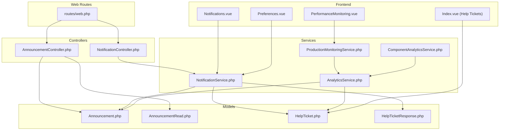
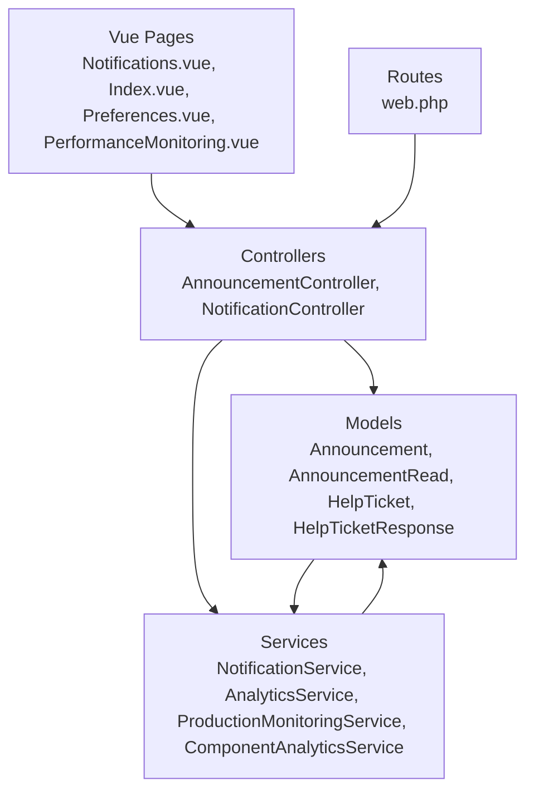
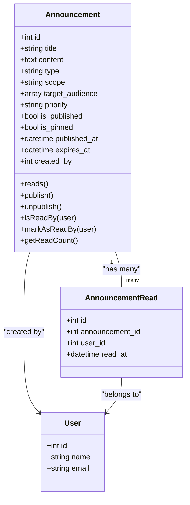
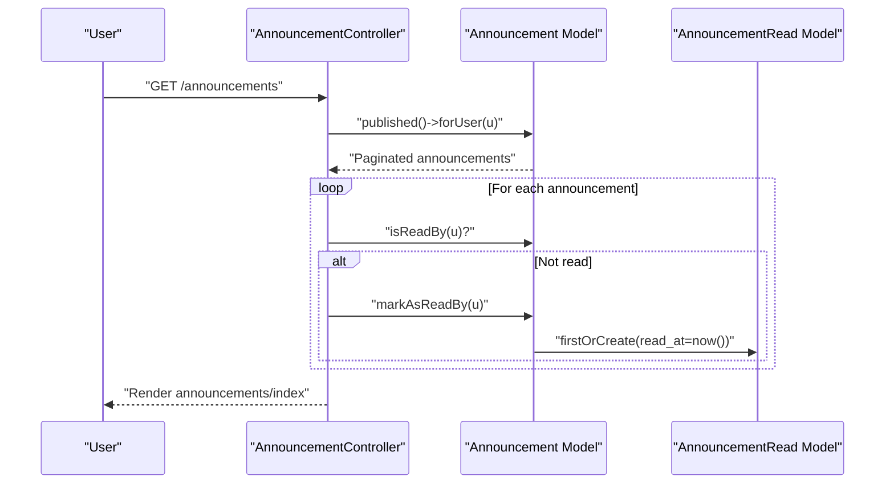
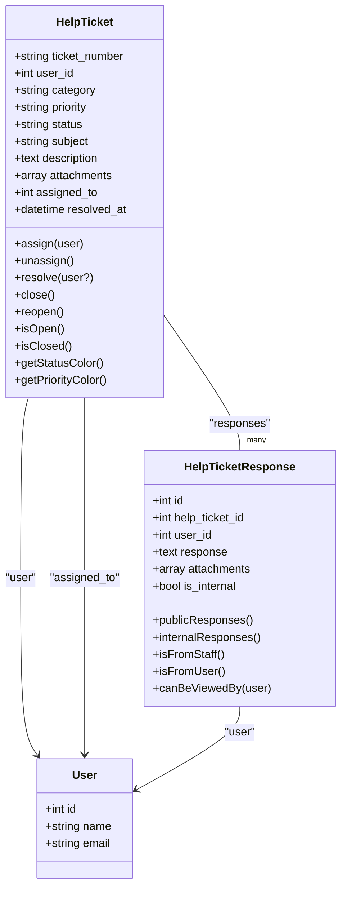
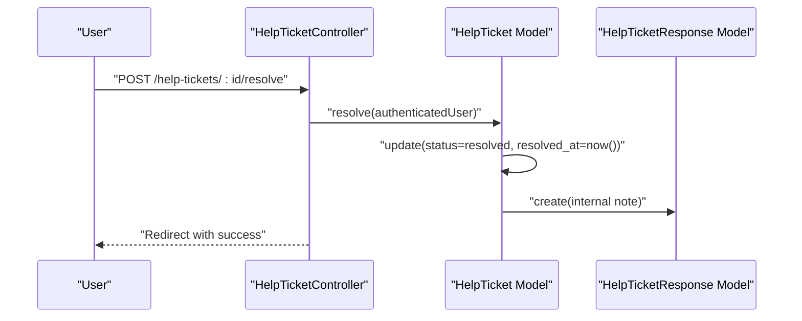
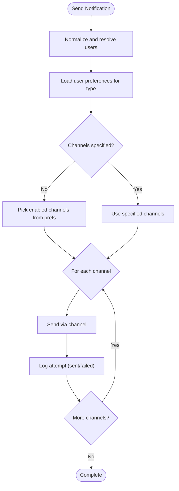
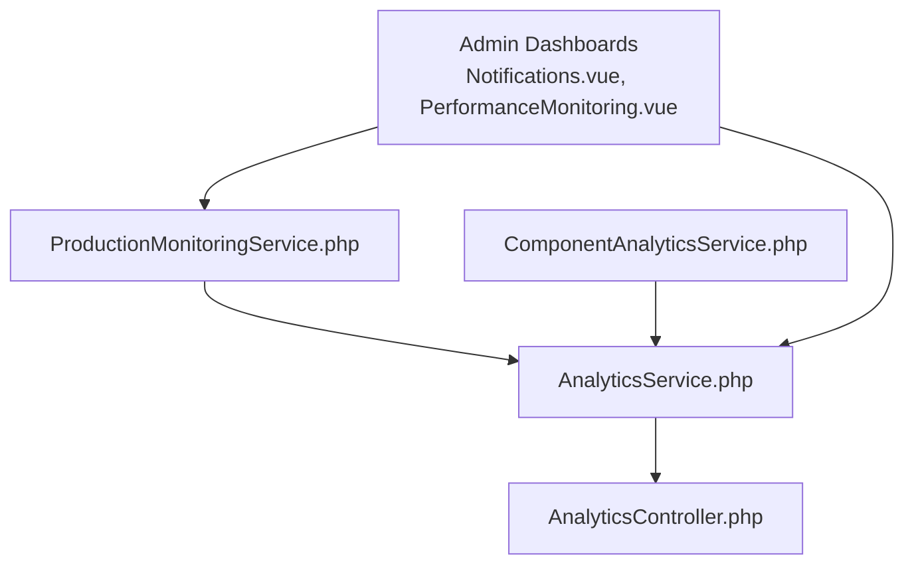
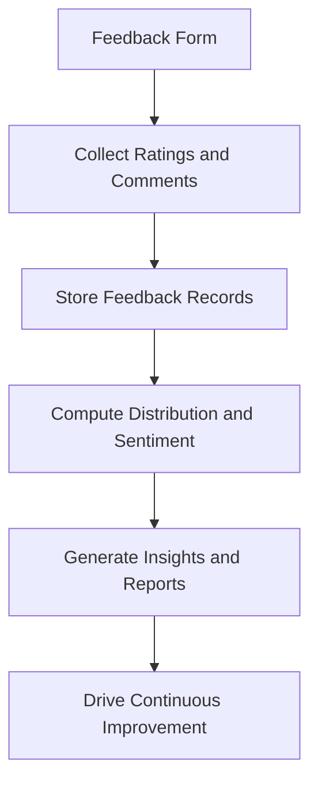
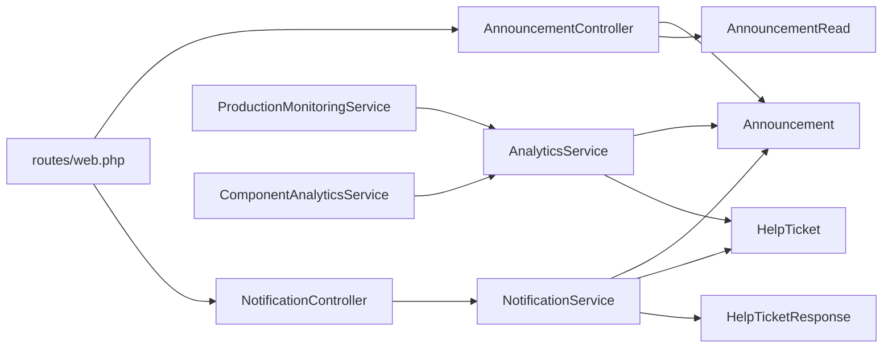

# Announcements & Help Desk

<cite>
**Referenced Files in This Document**
- [Announcement.php](file://app/Models/Announcement.php)
- [AnnouncementRead.php](file://app/Models/AnnouncementRead.php)
- [AnnouncementController.php](file://app/Http/Controllers/AnnouncementController.php)
- [HelpTicket.php](file://app/Models/HelpTicket.php)
- [HelpTicketResponse.php](file://app/Models/HelpTicketResponse.php)
- [NotificationService.php](file://app/Services/NotificationService.php)
- [web.php](file://routes/web.php)
- [task-09-notification-system-recap.md](file://docs/task-09-notification-system-recap.md)
- [task-10-communication-messaging-recap.md](file://docs/task-10-communication-messaging-recap.md)
- [AnalyticsController.php](file://app/Http/Controllers/Api/AnalyticsController.php)
- [Notifications.vue](file://resources/js/Pages/SuperAdmin/Notifications.vue)
- [Index.vue](file://resources/js/Pages/HelpTickets/Index.vue)
- [Preferences.vue](file://resources/js/Pages/Notifications/Preferences.vue)
- [PerformanceMonitoring.vue](file://resources/js/Pages/Admin/PerformanceMonitoring.vue)
- [AnalyticsService.php](file://app/Services/AnalyticsService.php)
- [ProductionMonitoringService.php](file://app/Services/ProductionMonitoringService.php)
- [ComponentAnalyticsService.php](file://app/Services/ComponentAnalyticsService.php)
- [feedback-form.blade.php](file://resources/views/testing/feedback-form.blade.php)
- [EventFollowUpService.php](file://app/Services/EventFollowUpService.php)
- [NotificationController.php](file://app/Http/Controllers/Api/NotificationController.php)
</cite>

## Table of Contents
1. [Introduction](#introduction)
2. [Project Structure](#project-structure)
3. [Core Components](#core-components)
4. [Architecture Overview](#architecture-overview)
5. [Detailed Component Analysis](#detailed-component-analysis)
6. [Dependency Analysis](#dependency-analysis)
7. [Performance Considerations](#performance-considerations)
8. [Troubleshooting Guide](#troubleshooting-guide)
9. [Conclusion](#conclusion)
10. [Appendices](#appendices)

## Introduction
This document explains the announcements and help desk systems, focusing on:
- Announcement lifecycle: creation, targeting, scheduling, publishing, and user engagement tracking
- Distribution channels and notification integration
- Help ticket management: assignment, status tracking, resolution workflows, and satisfaction metrics
- Automation, SLA tracking, and analytics
- Integration with user roles, notification preferences, and administrative dashboards
- Feedback collection and continuous improvement workflows

## Project Structure
The announcements and help desk features span models, controllers, services, routes, and frontend pages:
- Models define domain entities and relationships
- Controllers orchestrate user-facing flows and API endpoints
- Services encapsulate cross-cutting concerns like notifications and analytics
- Routes expose both web and API endpoints
- Frontend pages provide dashboards and user interfaces for admins and users

**Diagram sources**
- [web.php:117-133](file://routes/web.php#L117-L133)
- [AnnouncementController.php:10-207](file://app/Http/Controllers/AnnouncementController.php#L10-L207)
- [NotificationController.php:20-48](file://app/Http/Controllers/Api/NotificationController.php#L20-L48)
- [Announcement.php:8-127](file://app/Models/Announcement.php#L8-L127)
- [AnnouncementRead.php:8-33](file://app/Models/AnnouncementRead.php#L8-L33)
- [HelpTicket.php:9-204](file://app/Models/HelpTicket.php#L9-L204)
- [HelpTicketResponse.php:8-80](file://app/Models/HelpTicketResponse.php#L8-L80)
- [NotificationService.php:21-386](file://app/Services/NotificationService.php#L21-L386)
- [AnalyticsService.php:80-116](file://app/Services/AnalyticsService.php#L80-L116)
- [ProductionMonitoringService.php:676-720](file://app/Services/ProductionMonitoringService.php#L676-L720)
- [ComponentAnalyticsService.php:449-490](file://app/Services/ComponentAnalyticsService.php#L449-L490)
- [Notifications.vue:1-116](file://resources/js/Pages/SuperAdmin/Notifications.vue#L1-L116)
- [Index.vue:40-118](file://resources/js/Pages/HelpTickets/Index.vue#L40-L118)
- [Preferences.vue:176-197](file://resources/js/Pages/Notifications/Preferences.vue#L176-L197)
- [PerformanceMonitoring.vue:1-60](file://resources/js/Pages/Admin/PerformanceMonitoring.vue#L1-L60)

**Section sources**
- [web.php:117-133](file://routes/web.php#L117-L133)
- [AnnouncementController.php:10-207](file://app/Http/Controllers/AnnouncementController.php#L10-L207)
- [NotificationController.php:20-48](file://app/Http/Controllers/Api/NotificationController.php#L20-L48)
- [Announcement.php:8-127](file://app/Models/Announcement.php#L8-L127)
- [AnnouncementRead.php:8-33](file://app/Models/AnnouncementRead.php#L8-L33)
- [HelpTicket.php:9-204](file://app/Models/HelpTicket.php#L9-L204)
- [HelpTicketResponse.php:8-80](file://app/Models/HelpTicketResponse.php#L8-L80)
- [NotificationService.php:21-386](file://app/Services/NotificationService.php#L21-L386)
- [AnalyticsService.php:80-116](file://app/Services/AnalyticsService.php#L80-L116)
- [ProductionMonitoringService.php:676-720](file://app/Services/ProductionMonitoringService.php#L676-L720)
- [ComponentAnalyticsService.php:449-490](file://app/Services/ComponentAnalyticsService.php#L449-L490)
- [Notifications.vue:1-116](file://resources/js/Pages/SuperAdmin/Notifications.vue#L1-L116)
- [Index.vue:40-118](file://resources/js/Pages/HelpTickets/Index.vue#L40-L118)
- [Preferences.vue:176-197](file://resources/js/Pages/Notifications/Preferences.vue#L176-L197)
- [PerformanceMonitoring.vue:1-60](file://resources/js/Pages/Admin/PerformanceMonitoring.vue#L1-L60)

## Core Components
- Announcement model and controller handle creation, targeting, scheduling, publishing, and read tracking
- Help ticket model and response model manage lifecycle, assignment, and visibility controls
- Notification service integrates multi-channel delivery, preferences, and logging
- Analytics services aggregate platform usage and conversion metrics for dashboards
- Frontend dashboards provide admin monitoring, user preferences, and ticket listings

**Section sources**
- [Announcement.php:8-127](file://app/Models/Announcement.php#L8-L127)
- [AnnouncementController.php:10-207](file://app/Http/Controllers/AnnouncementController.php#L10-L207)
- [HelpTicket.php:9-204](file://app/Models/HelpTicket.php#L9-L204)
- [HelpTicketResponse.php:8-80](file://app/Models/HelpTicketResponse.php#L8-L80)
- [NotificationService.php:21-386](file://app/Services/NotificationService.php#L21-L386)
- [AnalyticsService.php:80-116](file://app/Services/AnalyticsService.php#L80-L116)

## Architecture Overview
The system follows a layered architecture:
- Presentation: Inertia/Vue pages for user and admin interfaces
- Application: Controllers coordinate requests and delegate to services/models
- Domain: Eloquent models encapsulate business rules and relationships
- Infrastructure: Services handle cross-cutting concerns (notifications, analytics, monitoring)

**Diagram sources**
- [web.php:117-133](file://routes/web.php#L117-L133)
- [AnnouncementController.php:10-207](file://app/Http/Controllers/AnnouncementController.php#L10-L207)
- [NotificationController.php:20-48](file://app/Http/Controllers/Api/NotificationController.php#L20-L48)
- [Announcement.php:8-127](file://app/Models/Announcement.php#L8-L127)
- [AnnouncementRead.php:8-33](file://app/Models/AnnouncementRead.php#L8-L33)
- [HelpTicket.php:9-204](file://app/Models/HelpTicket.php#L9-L204)
- [HelpTicketResponse.php:8-80](file://app/Models/HelpTicketResponse.php#L8-L80)
- [NotificationService.php:21-386](file://app/Services/NotificationService.php#L21-L386)
- [AnalyticsService.php:80-116](file://app/Services/AnalyticsService.php#L80-L116)
- [ProductionMonitoringService.php:676-720](file://app/Services/ProductionMonitoringService.php#L676-L720)
- [ComponentAnalyticsService.php:449-490](file://app/Services/ComponentAnalyticsService.php#L449-L490)
- [Notifications.vue:1-116](file://resources/js/Pages/SuperAdmin/Notifications.vue#L1-L116)
- [Index.vue:40-118](file://resources/js/Pages/HelpTickets/Index.vue#L40-L118)
- [Preferences.vue:176-197](file://resources/js/Pages/Notifications/Preferences.vue#L176-L197)
- [PerformanceMonitoring.vue:1-60](file://resources/js/Pages/Admin/PerformanceMonitoring.vue#L1-L60)

## Detailed Component Analysis

### Announcement System
- Targeting and scoping: announcements can target all users, institution-specific, or role-based audiences
- Scheduling and publishing: announcements can be scheduled for future publication and expire after a set date
- Engagement tracking: read receipts per user enable reach and completion analytics
- Admin and user flows: create, update, publish/unpublish, filter by type/priority, and mark as read

**Diagram sources**
- [Announcement.php:8-127](file://app/Models/Announcement.php#L8-L127)
- [AnnouncementRead.php:8-33](file://app/Models/AnnouncementRead.php#L8-L33)

**Diagram sources**
- [AnnouncementController.php:12-45](file://app/Http/Controllers/AnnouncementController.php#L12-L45)
- [Announcement.php:92-109](file://app/Models/Announcement.php#L92-L109)
- [AnnouncementRead.php:12-20](file://app/Models/AnnouncementRead.php#L12-L20)

Key implementation highlights:
- Targeting scopes and audience filtering are enforced via JSON queries and role checks
- Publishing toggles set timestamps and visibility
- Read tracking prevents duplicate marking and supports analytics

**Section sources**
- [Announcement.php:46-84](file://app/Models/Announcement.php#L46-L84)
- [Announcement.php:111-125](file://app/Models/Announcement.php#L111-L125)
- [Announcement.php:92-109](file://app/Models/Announcement.php#L92-L109)
- [AnnouncementController.php:12-45](file://app/Http/Controllers/AnnouncementController.php#L12-L45)
- [AnnouncementController.php:161-177](file://app/Http/Controllers/AnnouncementController.php#L161-L177)
- [AnnouncementController.php:179-185](file://app/Http/Controllers/AnnouncementController.php#L179-L185)
- [AnnouncementController.php:187-205](file://app/Http/Controllers/AnnouncementController.php#L187-L205)

### Help Ticket System
- Lifecycle: open → in_progress → resolved → closed; reopen resets timestamps
- Assignment: assign/unassign transitions status; helpers enforce state changes
- Responses: public/internal separation; visibility controlled by roles and ownership
- Status and priority coloring for UI

**Diagram sources**
- [HelpTicket.php:9-204](file://app/Models/HelpTicket.php#L9-L204)
- [HelpTicketResponse.php:8-80](file://app/Models/HelpTicketResponse.php#L8-L80)

**Diagram sources**
- [HelpTicket.php:120-134](file://app/Models/HelpTicket.php#L120-L134)

Operational notes:
- Priority and status are mapped to UI badges for quick scanning
- Internal vs public responses restrict visibility to authorized roles and owners
- Scopes enable filtering by category, priority, assignment, and user

**Section sources**
- [HelpTicket.php:58-101](file://app/Models/HelpTicket.php#L58-L101)
- [HelpTicket.php:104-147](file://app/Models/HelpTicket.php#L104-L147)
- [HelpTicket.php:159-181](file://app/Models/HelpTicket.php#L159-L181)
- [HelpTicketResponse.php:37-55](file://app/Models/HelpTicketResponse.php#L37-L55)
- [HelpTicketResponse.php:58-79](file://app/Models/HelpTicketResponse.php#L58-L79)

### Notification System and Channels
- Multi-channel delivery: email, SMS, in-app, push
- Preference-aware routing: enabled channels per user/type
- Bulk operations and scheduling
- Logging and error handling for delivery attempts

**Diagram sources**
- [NotificationService.php:34-94](file://app/Services/NotificationService.php#L34-L94)
- [NotificationService.php:99-123](file://app/Services/NotificationService.php#L99-L123)
- [NotificationService.php:199-249](file://app/Services/NotificationService.php#L199-L249)
- [NotificationService.php:269-279](file://app/Services/NotificationService.php#L269-L279)

Administrative dashboards surface delivery performance and notification types for oversight.

**Section sources**
- [NotificationService.php:21-386](file://app/Services/NotificationService.php#L21-L386)
- [Notifications.vue:44-91](file://resources/js/Pages/SuperAdmin/Notifications.vue#L44-L91)
- [Preferences.vue:176-197](file://resources/js/Pages/Notifications/Preferences.vue#L176-L197)
- [NotificationController.php:26-48](file://app/Http/Controllers/Api/NotificationController.php#L26-L48)

### Analytics and Monitoring
- Platform usage metrics: page views, session duration, bounce rate, device/browser breakdown
- Custom report generation by metric and date range
- Production monitoring charts for user activity, error rates, and security incidents
- Component analytics for views, clicks, conversions, and conversion rates

**Diagram sources**
- [AnalyticsService.php:80-116](file://app/Services/AnalyticsService.php#L80-L116)
- [ProductionMonitoringService.php:676-720](file://app/Services/ProductionMonitoringService.php#L676-L720)
- [ComponentAnalyticsService.php:449-490](file://app/Services/ComponentAnalyticsService.php#L449-L490)
- [AnalyticsController.php:386-426](file://app/Http/Controllers/Api/AnalyticsController.php#L386-L426)
- [Notifications.vue:16-42](file://resources/js/Pages/SuperAdmin/Notifications.vue#L16-L42)
- [PerformanceMonitoring.vue:1-60](file://resources/js/Pages/Admin/PerformanceMonitoring.vue#L1-60)

**Section sources**
- [AnalyticsService.php:80-116](file://app/Services/AnalyticsService.php#L80-L116)
- [ProductionMonitoringService.php:676-720](file://app/Services/ProductionMonitoringService.php#L676-L720)
- [ComponentAnalyticsService.php:449-490](file://app/Services/ComponentAnalyticsService.php#L449-L490)
- [AnalyticsController.php:386-426](file://app/Http/Controllers/Api/AnalyticsController.php#L386-L426)

### Feedback and Continuous Improvement
- Feedback forms collect satisfaction and response time ratings
- Event follow-up service computes rating distributions and sentiment analysis
- Reports and dashboards guide continuous improvement

**Diagram sources**
- [feedback-form.blade.php:279-462](file://resources/views/testing/feedback-form.blade.php#L279-L462)
- [EventFollowUpService.php:409-438](file://app/Services/EventFollowUpService.php#L409-L438)

**Section sources**
- [feedback-form.blade.php:279-462](file://resources/views/testing/feedback-form.blade.php#L279-L462)
- [EventFollowUpService.php:409-438](file://app/Services/EventFollowUpService.php#L409-L438)

## Dependency Analysis
- Controllers depend on models and services for business logic
- Models encapsulate relationships and scopes; they are reused across controllers and services
- Services depend on models and external integrations (email/SMS/push) and leverage caching/logging
- Routes connect UI pages to controllers and APIs

**Diagram sources**
- [web.php:117-133](file://routes/web.php#L117-L133)
- [AnnouncementController.php:10-207](file://app/Http/Controllers/AnnouncementController.php#L10-L207)
- [NotificationController.php:20-48](file://app/Http/Controllers/Api/NotificationController.php#L20-L48)
- [Announcement.php:8-127](file://app/Models/Announcement.php#L8-L127)
- [AnnouncementRead.php:8-33](file://app/Models/AnnouncementRead.php#L8-L33)
- [HelpTicket.php:9-204](file://app/Models/HelpTicket.php#L9-L204)
- [HelpTicketResponse.php:8-80](file://app/Models/HelpTicketResponse.php#L8-L80)
- [NotificationService.php:21-386](file://app/Services/NotificationService.php#L21-L386)
- [AnalyticsService.php:80-116](file://app/Services/AnalyticsService.php#L80-L116)
- [ProductionMonitoringService.php:676-720](file://app/Services/ProductionMonitoringService.php#L676-L720)
- [ComponentAnalyticsService.php:449-490](file://app/Services/ComponentAnalyticsService.php#L449-L490)

**Section sources**
- [web.php:117-133](file://routes/web.php#L117-L133)
- [AnnouncementController.php:10-207](file://app/Http/Controllers/AnnouncementController.php#L10-L207)
- [NotificationController.php:20-48](file://app/Http/Controllers/Api/NotificationController.php#L20-L48)
- [NotificationService.php:21-386](file://app/Services/NotificationService.php#L21-L386)

## Performance Considerations
- Caching: Notification preferences and templates are cached to reduce repeated lookups
- Pagination: Announcement listing paginates results to limit payload sizes
- Conditional reads: Announcement read tracking avoids redundant writes
- Batch operations: Bulk notification sending minimizes per-user overhead
- Monitoring: Production monitoring services provide chart datasets for user activity and error rates

[No sources needed since this section provides general guidance]

## Troubleshooting Guide
Common areas to check:
- Notification delivery failures: inspect logs and notification attempts; verify channel preferences and template availability
- Announcement visibility: confirm scope/target_audience and publication/expiry conditions
- Help ticket visibility: ensure internal/public response visibility rules align with user roles and ownership
- Admin dashboards: validate metrics and charts against underlying analytics services

**Section sources**
- [NotificationService.php:113-122](file://app/Services/NotificationService.php#L113-L122)
- [NotificationService.php:269-279](file://app/Services/NotificationService.php#L269-L279)
- [Announcement.php:46-84](file://app/Models/Announcement.php#L46-L84)
- [HelpTicketResponse.php:68-79](file://app/Models/HelpTicketResponse.php#L68-L79)
- [ProductionMonitoringService.php:676-720](file://app/Services/ProductionMonitoringService.php#L676-L720)

## Conclusion
The announcements and help desk systems combine robust domain models, flexible controllers, and cross-cutting services to deliver targeted communications, efficient support workflows, and insightful analytics. Administrators benefit from dashboards and monitoring, while users enjoy timely, relevant notifications and streamlined ticket resolution.

[No sources needed since this section summarizes without analyzing specific files]

## Appendices

### Example Workflows

- Announcement campaign
  - Create announcement with type, scope, priority, optional expiry
  - Publish immediately or schedule for future
  - Observe read counts and delivery stats via admin dashboard

  **Section sources**
  - [AnnouncementController.php:78-110](file://app/Http/Controllers/AnnouncementController.php#L78-L110)
  - [AnnouncementController.php:161-177](file://app/Http/Controllers/AnnouncementController.php#L161-L177)
  - [Notifications.vue:16-42](file://resources/js/Pages/SuperAdmin/Notifications.vue#L16-L42)

- Help ticket resolution
  - Assign ticket to agent; update status to in_progress
  - Add internal or public responses; mark as resolved with timestamp
  - Close ticket; optionally reopen if needed

  **Section sources**
  - [HelpTicket.php:104-118](file://app/Models/HelpTicket.php#L104-L118)
  - [HelpTicket.php:120-134](file://app/Models/HelpTicket.php#L120-L134)
  - [HelpTicket.php:136-147](file://app/Models/HelpTicket.php#L136-L147)
  - [Index.vue:40-118](file://resources/js/Pages/HelpTickets/Index.vue#L40-L118)

- Support analytics
  - Use platform usage metrics and custom reports
  - Review production monitoring charts for system health
  - Analyze component analytics for engagement and conversion

  **Section sources**
  - [AnalyticsService.php:80-116](file://app/Services/AnalyticsService.php#L80-L116)
  - [ProductionMonitoringService.php:676-720](file://app/Services/ProductionMonitoringService.php#L676-L720)
  - [ComponentAnalyticsService.php:449-490](file://app/Services/ComponentAnalyticsService.php#L449-L490)

### References
- Notification system recap and features
  - [task-09-notification-system-recap.md:313-497](file://docs/task-09-notification-system-recap.md#L313-L497)
  - [task-10-communication-messaging-recap.md:292-422](file://docs/task-10-communication-messaging-recap.md#L292-L422)