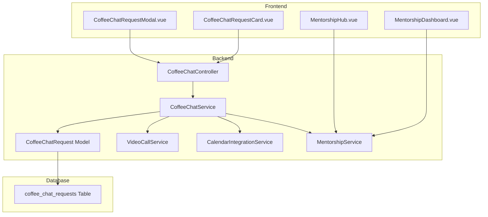
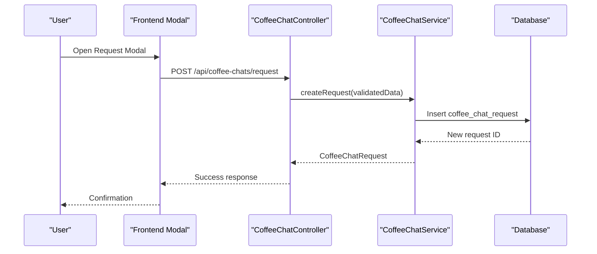
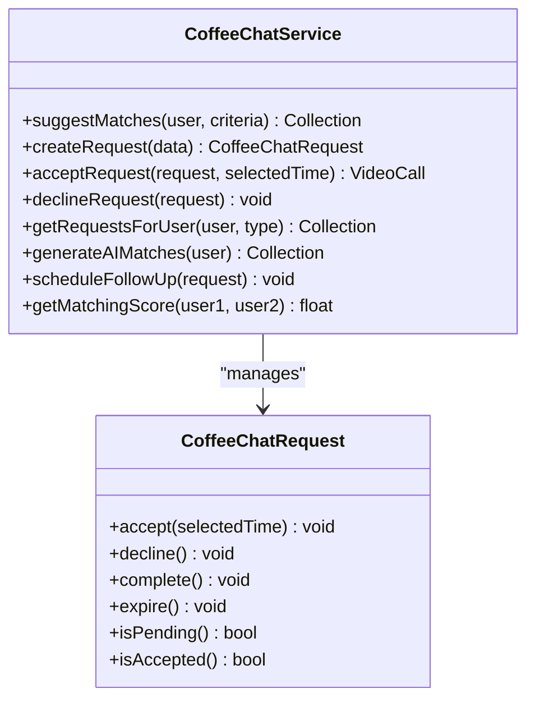
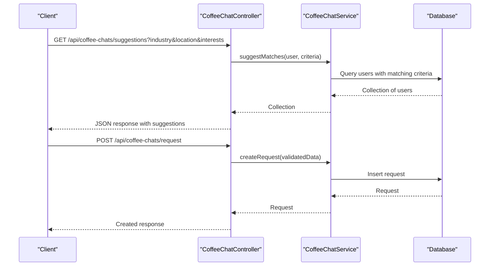
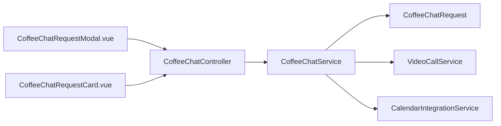
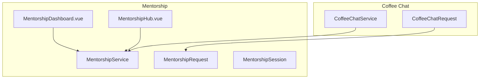

# Coffee Chat System

<cite>
**Referenced Files in This Document**
- [CoffeeChatService.php](file://app/Services/CoffeeChatService.php)
- [CoffeeChatRequest.php](file://app/Models/CoffeeChatRequest.php)
- [CoffeeChatController.php](file://app/Http/Controllers/Api/CoffeeChatController.php)
- [2025_08_14_213604_create_coffee_chat_requests_table.php](file://database/migrations/2025_08_14_213604_create_coffee_chat_requests_table.php)
- [CoffeeChatRequestModal.vue](file://resources/js/components/CoffeeChat/CoffeeChatRequestModal.vue)
- [CoffeeChatRequestCard.vue](file://resources/js/components/VideoCall/CoffeeChatRequestCard.vue)
- [CalendarIntegrationService.php](file://app/Services/CalendarIntegrationService.php)
- [VideoCallService.php](file://app/Services/VideoCallService.php)
- [MentorshipService.php](file://app/Services/MentorshipService.php)
- [MentorshipRequest.php](file://app/Models/MentorshipRequest.php)
- [MentorshipSession.php](file://app/Models/MentorshipSession.php)
- [MentorshipHub.vue](file://resources/js/Pages/Career/MentorshipHub.vue)
- [MentorshipDashboard.vue](file://resources/js/components/MentorshipDashboard.vue)
- [api.php](file://routes/api.php)
</cite>

## Table of Contents
1. [Introduction](#introduction)
2. [Project Structure](#project-structure)
3. [Core Components](#core-components)
4. [Architecture Overview](#architecture-overview)
5. [Detailed Component Analysis](#detailed-component-analysis)
6. [Dependency Analysis](#dependency-analysis)
7. [Performance Considerations](#performance-considerations)
8. [Troubleshooting Guide](#troubleshooting-guide)
9. [Privacy and Preferences](#privacy-and-preferences)
10. [Mentorship Integration](#mentorship-integration)
11. [Examples and Workflows](#examples-and-workflows)
12. [Conclusion](#conclusion)

## Introduction
The Coffee Chat System enables alumni to discover networking opportunities, propose meeting times, and coordinate virtual coffee chats through integrated scheduling and matching capabilities. It supports user-driven requests, AI-powered suggestions, and seamless calendar integration for scheduling. The system also provides mentorship program alignment and professional networking pathways.

## Project Structure
The Coffee Chat System spans backend services, models, controllers, database migrations, and frontend components. It integrates with video calling infrastructure and calendar services for scheduling and reminders.

**Diagram sources**
- [CoffeeChatController.php:12-204](file://app/Http/Controllers/Api/CoffeeChatController.php#L12-L204)
- [CoffeeChatService.php:10-142](file://app/Services/CoffeeChatService.php#L10-L142)
- [CoffeeChatRequest.php:8-99](file://app/Models/CoffeeChatRequest.php#L8-L99)
- [2025_08_14_213604_create_coffee_chat_requests_table.php:14-30](file://database/migrations/2025_08_14_213604_create_coffee_chat_requests_table.php#L14-L30)
- [CoffeeChatRequestModal.vue:1-237](file://resources/js/components/CoffeeChat/CoffeeChatRequestModal.vue#L1-L237)
- [CoffeeChatRequestCard.vue:92-161](file://resources/js/components/VideoCall/CoffeeChatRequestCard.vue#L92-L161)
- [MentorshipHub.vue:1-23](file://resources/js/Pages/Career/MentorshipHub.vue#L1-L23)
- [MentorshipDashboard.vue:274-286](file://resources/js/components/MentorshipDashboard.vue#L274-L286)

**Section sources**
- [CoffeeChatController.php:12-204](file://app/Http/Controllers/Api/CoffeeChatController.php#L12-L204)
- [CoffeeChatService.php:10-142](file://app/Services/CoffeeChatService.php#L10-L142)
- [CoffeeChatRequest.php:8-99](file://app/Models/CoffeeChatRequest.php#L8-L99)
- [2025_08_14_213604_create_coffee_chat_requests_table.php:14-30](file://database/migrations/2025_08_14_213604_create_coffee_chat_requests_table.php#L14-L30)
- [CoffeeChatRequestModal.vue:1-237](file://resources/js/components/CoffeeChat/CoffeeChatRequestModal.vue#L1-L237)
- [CoffeeChatRequestCard.vue:92-161](file://resources/js/components/VideoCall/CoffeeChatRequestCard.vue#L92-L161)
- [MentorshipHub.vue:1-23](file://resources/js/Pages/Career/MentorshipHub.vue#L1-L23)
- [MentorshipDashboard.vue:274-286](file://resources/js/components/MentorshipDashboard.vue#L274-L286)

## Core Components
- CoffeeChatController: Handles API endpoints for suggestions, request creation, responses, and request listings.
- CoffeeChatService: Implements matching logic, request lifecycle, and integration with video calls and calendar services.
- CoffeeChatRequest Model: Manages request records, relationships, and scopes for filtering.
- Database Migration: Defines the coffee_chat_requests table schema with indexes and foreign keys.
- Frontend Components: Vue components for requesting coffee chats and displaying request cards.

**Section sources**
- [CoffeeChatController.php:12-204](file://app/Http/Controllers/Api/CoffeeChatController.php#L12-L204)
- [CoffeeChatService.php:10-142](file://app/Services/CoffeeChatService.php#L10-L142)
- [CoffeeChatRequest.php:8-99](file://app/Models/CoffeeChatRequest.php#L8-L99)
- [2025_08_14_213604_create_coffee_chat_requests_table.php:14-30](file://database/migrations/2025_08_14_213604_create_coffee_chat_requests_table.php#L14-L30)
- [CoffeeChatRequestModal.vue:1-237](file://resources/js/components/CoffeeChat/CoffeeChatRequestModal.vue#L1-L237)
- [CoffeeChatRequestCard.vue:92-161](file://resources/js/components/VideoCall/CoffeeChatRequestCard.vue#L92-L161)

## Architecture Overview
The system follows a layered architecture:
- Presentation Layer: Vue components for user interaction.
- API Layer: Laravel controller handling HTTP requests/responses.
- Service Layer: Business logic for matching, scheduling, and integrations.
- Persistence Layer: Eloquent model backed by the coffee_chat_requests table.
- Integration Layer: Video call and calendar services for scheduling and notifications.

**Diagram sources**
- [CoffeeChatRequestModal.vue:192-226](file://resources/js/components/CoffeeChat/CoffeeChatRequestModal.vue#L192-L226)
- [CoffeeChatController.php:53-88](file://app/Http/Controllers/Api/CoffeeChatController.php#L53-L88)
- [CoffeeChatService.php:43-53](file://app/Services/CoffeeChatService.php#L43-L53)
- [2025_08_14_213604_create_coffee_chat_requests_table.php:14-30](file://database/migrations/2025_08_14_213604_create_coffee_chat_requests_table.php#L14-L30)

## Detailed Component Analysis

### CoffeeChatService
Implements matching, request lifecycle, and scheduling integration:
- Matching: Suggests users based on industry, geographic proximity, and completion history.
- Request Creation: Persists request data including proposed times and matching criteria.
- Accept/Decline: Updates request status and coordinates video call creation.
- Request Retrieval: Filters requests by type (sent, received, pending).
- AI Matching: Generates suggestions using profile data and interests.
- Follow-up: Placeholder for future scheduling of reminders or surveys.
- Matching Score: Computes compatibility score across industry, location, connections, and activity.

**Diagram sources**
- [CoffeeChatService.php:16-142](file://app/Services/CoffeeChatService.php#L16-L142)
- [CoffeeChatRequest.php:66-98](file://app/Models/CoffeeChatRequest.php#L66-L98)

**Section sources**
- [CoffeeChatService.php:16-142](file://app/Services/CoffeeChatService.php#L16-L142)
- [CoffeeChatRequest.php:66-98](file://app/Models/CoffeeChatRequest.php#L66-L98)

### CoffeeChatController
Provides API endpoints for:
- Suggestions: Returns matched users based on criteria.
- Request Creation: Validates and persists requests, preventing duplicates.
- Response Handling: Accepts or declines requests with time validation.
- Request Listings: Retrieves sent, received, and pending requests.
- AI Matches: Returns AI-generated matches with placeholder scores.

**Diagram sources**
- [CoffeeChatController.php:21-88](file://app/Http/Controllers/Api/CoffeeChatController.php#L21-L88)
- [CoffeeChatService.php:16-53](file://app/Services/CoffeeChatService.php#L16-L53)

**Section sources**
- [CoffeeChatController.php:21-202](file://app/Http/Controllers/Api/CoffeeChatController.php#L21-L202)

### CoffeeChatRequest Model
Defines fillable attributes, JSON casts, and relationships:
- Belongs to requester and recipient users.
- Belongs to associated video call.
- Scopes for pending, accepted, user-specific, and type-based filtering.
- Status transitions via accept/decline/complete/expire helpers.

**Section sources**
- [CoffeeChatRequest.php:8-99](file://app/Models/CoffeeChatRequest.php#L8-L99)

### Database Migration
Creates the coffee_chat_requests table with:
- Foreign keys to users and video_calls.
- Enumerations for type and status.
- JSON fields for proposed times and matching criteria.
- Indexes on status, requester, and recipient for performance.

**Section sources**
- [2025_08_14_213604_create_coffee_chat_requests_table.php:14-30](file://database/migrations/2025_08_14_213604_create_coffee_chat_requests_table.php#L14-L30)

### Frontend Components
- CoffeeChatRequestModal.vue: Allows users to compose messages, propose 2–5 time slots, choose request type, and submit requests.
- CoffeeChatRequestCard.vue: Displays request details, status, and actions (accept/decline/view call).

**Section sources**
- [CoffeeChatRequestModal.vue:1-237](file://resources/js/components/CoffeeChat/CoffeeChatRequestModal.vue#L1-L237)
- [CoffeeChatRequestCard.vue:92-161](file://resources/js/components/VideoCall/CoffeeChatRequestCard.vue#L92-L161)

## Dependency Analysis
The system exhibits clear separation of concerns:
- CoffeeChatController depends on CoffeeChatService for business logic.
- CoffeeChatService depends on VideoCallService for scheduling and CalendarIntegrationService for calendar operations.
- CoffeeChatRequest Model encapsulates persistence and relationships.
- Frontend components communicate with backend via API endpoints.

**Diagram sources**
- [CoffeeChatController.php:14-16](file://app/Http/Controllers/Api/CoffeeChatController.php#L14-L16)
- [CoffeeChatService.php:12-14](file://app/Services/CoffeeChatService.php#L12-L14)
- [CoffeeChatRequest.php:28-41](file://app/Models/CoffeeChatRequest.php#L28-L41)
- [CoffeeChatRequestModal.vue:147-208](file://resources/js/components/CoffeeChat/CoffeeChatRequestModal.vue#L147-L208)
- [CoffeeChatRequestCard.vue:117-161](file://resources/js/components/VideoCall/CoffeeChatRequestCard.vue#L117-L161)

**Section sources**
- [CoffeeChatController.php:14-16](file://app/Http/Controllers/Api/CoffeeChatController.php#L14-L16)
- [CoffeeChatService.php:12-14](file://app/Services/CoffeeChatService.php#L12-L14)
- [CoffeeChatRequest.php:28-41](file://app/Models/CoffeeChatRequest.php#L28-L41)
- [CoffeeChatRequestModal.vue:147-208](file://resources/js/components/CoffeeChat/CoffeeChatRequestModal.vue#L147-L208)
- [CoffeeChatRequestCard.vue:117-161](file://resources/js/components/VideoCall/CoffeeChatRequestCard.vue#L117-L161)

## Performance Considerations
- Indexes on status, requester_id, and recipient_id improve query performance for request retrieval and filtering.
- Matching prioritizes users with fewer completed chats to distribute opportunities fairly.
- Geo-spatial queries use distance thresholds to limit result sets efficiently.
- Frontend components validate inputs locally to reduce invalid submissions.

[No sources needed since this section provides general guidance]

## Troubleshooting Guide
Common issues and resolutions:
- Duplicate Pending Requests: The controller prevents overlapping pending requests between the same pair of users.
- Invalid Selected Time: When accepting a request, the selected time must match one of the proposed times.
- Unauthorized Response: Only the intended recipient can respond to a request.
- Request Already Resolved: Attempting to respond to an already accepted or declined request is rejected.

**Section sources**
- [CoffeeChatController.php:65-79](file://app/Http/Controllers/Api/CoffeeChatController.php#L65-L79)
- [CoffeeChatController.php:117-124](file://app/Http/Controllers/Api/CoffeeChatController.php#L117-L124)
- [CoffeeChatController.php:97-109](file://app/Http/Controllers/Api/CoffeeChatController.php#L97-L109)
- [CoffeeChatRequest.php:66-98](file://app/Models/CoffeeChatRequest.php#L66-L98)

## Privacy and Preferences
- Matching Criteria: Users can refine suggestions by industry, location, and interests.
- Request Visibility: Requests are filtered per user; sent/received/pending views are supported.
- Calendar Integration: Scheduling leverages calendar services for reminders and synchronization.
- Opt-out Options: While not explicitly implemented in the referenced files, privacy controls can be extended via user preferences and matching criteria toggles.

[No sources needed since this section provides general guidance]

## Mentorship Integration
The Coffee Chat System complements mentorship programs:
- Mentorship Matching: AI-driven suggestions align with mentorship goals.
- Dashboard Integration: Mentorship hub and dashboard provide scheduling and progress tracking.
- Video Call Alignment: Coffee chats can be scheduled via the same video call infrastructure used by mentorship sessions.

**Diagram sources**
- [MentorshipHub.vue:1-23](file://resources/js/Pages/Career/MentorshipHub.vue#L1-L23)
- [MentorshipDashboard.vue:274-286](file://resources/js/components/MentorshipDashboard.vue#L274-L286)
- [CoffeeChatService.php:89-99](file://app/Services/CoffeeChatService.php#L89-L99)

**Section sources**
- [MentorshipHub.vue:1-23](file://resources/js/Pages/Career/MentorshipHub.vue#L1-L23)
- [MentorshipDashboard.vue:274-286](file://resources/js/components/MentorshipDashboard.vue#L274-L286)
- [CoffeeChatService.php:89-99](file://app/Services/CoffeeChatService.php#L89-L99)

## Examples and Workflows

### Matching Scenarios
- Industry Match: Users in the same industry are suggested with higher compatibility.
- Geographic Proximity: Within a predefined distance threshold to facilitate local meetups.
- Activity Level: Prefer users with balanced participation history to encourage engagement.

**Section sources**
- [CoffeeChatService.php:16-41](file://app/Services/CoffeeChatService.php#L16-L41)
- [CoffeeChatService.php:110-140](file://app/Services/CoffeeChatService.php#L110-L140)

### Successful Networking Outcomes
- Direct Request Flow: One user proposes multiple time slots; the other accepts and a video call is scheduled.
- AI-Matched Connection: System suggests compatible profiles based on interests and background; users coordinate via proposed times.
- Mentorship Pathway: Initial coffee chat leads to structured mentorship sessions with dedicated scheduling and progress tracking.

**Section sources**
- [CoffeeChatController.php:93-145](file://app/Http/Controllers/Api/CoffeeChatController.php#L93-L145)
- [CoffeeChatRequestModal.vue:192-226](file://resources/js/components/CoffeeChat/CoffeeChatRequestModal.vue#L192-L226)
- [MentorshipDashboard.vue:274-286](file://resources/js/components/MentorshipDashboard.vue#L274-L286)

## Conclusion
The Coffee Chat System provides a robust foundation for alumni networking through intelligent matching, flexible request workflows, and integrated scheduling. Its modular design supports extension for advanced features like AI-driven scoring, calendar reminders, and mentorship alignment, enabling meaningful professional connections and long-term career growth.