# Communication & Collaboration

<cite>
**Referenced Files in This Document**
- [Message.php](file://app/Models/Message.php)
- [Conversation.php](file://app/Models/Conversation.php)
- [ConversationParticipant.php](file://app/Models/ConversationParticipant.php)
- [MessagingService.php](file://app/Services/MessagingService.php)
- [Forum.php](file://app/Models/Forum.php)
- [ForumPost.php](file://app/Models/ForumPost.php)
- [ForumTopic.php](file://app/Models/ForumTopic.php)
- [ForumTopicSubscription.php](file://app/Models/ForumTopicSubscription.php)
- [ForumService.php](file://app/Services/ForumService.php)
- [VideoCall.php](file://app/Models/VideoCall.php)
- [VideoCallParticipant.php](file://app/Models/VideoCallParticipant.php)
- [VideoCallService.php](file://app/Services/VideoCallService.php)
- [CoffeeChatRequest.php](file://app/Models/CoffeeChatRequest.php)
- [CoffeeChatService.php](file://app/Services/CoffeeChatService.php)
- [Announcement.php](file://app/Models/Announcement.php)
- [AnnouncementRead.php](file://app/Models/AnnouncementRead.php)
- [HelpTicket.php](file://app/Models/HelpTicket.php)
- [HelpTicketResponse.php](file://app/Models/HelpTicketResponse.php)
- [UserFeedback.php](file://app/Models/UserFeedback.php)
- [NotificationPreference.php](file://app/Models/NotificationPreference.php)
- [NotificationService.php](file://app/Services/NotificationService.php)
- [MessageSent.php](file://app/Events/MessageSent.php)
- [MessageRead.php](file://app/Events/MessageRead.php)
- [UserTyping.php](file://app/Events/UserTyping.php)
- [PostCreated.php](file://app/Events/PostCreated.php)
- [PostCommentAdded.php](file://app/Events/PostCommentAdded.php)
- [PostEngagement.php](file://app/Events/PostEngagement.php)
- [ConnectionAccepted.php](file://app/Events/ConnectionAccepted.php)
- [ConnectionRequest.php](file://app/Events/ConnectionRequest.php)
- [SendNotificationDigestJob.php](file://app/Jobs/SendNotificationDigestJob.php)
- [SendNotificationDigest.php](file://app/Http/Controllers/SendNotificationDigest.php)
- [api.php](file://routes/api.php)
- [web.php](file://routes/web.php)
- [channels.php](file://routes/channels.php)
- [broadcasting.php](file://config/broadcasting.php)
- [task-10-communication-messaging-recap.md](file://docs/task-10-communication-messaging-recap.md)
- [video-calling-implementation.md](file://docs/video-calling-implementation.md)
- [video-calling-implementation-summary.md](file://docs/video-calling-implementation-summary.md)
- [user-experience-flows.md](file://docs/user-experience-flows.md)
</cite>

## Table of Contents
1. [Introduction](#introduction)
2. [Project Structure](#project-structure)
3. [Core Components](#core-components)
4. [Architecture Overview](#architecture-overview)
5. [Detailed Component Analysis](#detailed-component-analysis)
6. [Dependency Analysis](#dependency-analysis)
7. [Performance Considerations](#performance-considerations)
8. [Troubleshooting Guide](#troubleshooting-guide)
9. [Conclusion](#conclusion)
10. [Appendices](#appendices)

## Introduction
This document explains the communication and collaboration features implemented in the platform. It covers integrated messaging, discussion forums, video calling, coffee chat scheduling, announcements, help desk integration, feedback collection, and a centralized notification center. It also documents real-time communication features, notification preferences, collaboration workflows, and user engagement tools. Examples illustrate messaging workflows, video call setup, and community-building features.

## Project Structure
The communication and collaboration features span models, services, controllers, jobs, events, and configuration. The primary areas include:
- Messaging: models for conversations and messages, service layer, and event-driven updates
- Forums: models for topics, posts, subscriptions, and a dedicated service
- Video Calling: models for calls and participants, service layer, and integration
- Coffee Chat: models and service for scheduling and matching
- Announcements, Help Desk, Feedback: domain models and related workflows
- Notifications: models, service, and digest job for centralized notifications

```mermaid
graph TB
subgraph "Messaging"
MConv["Conversation<br/>(Conversation.php)"]
MPart["ConversationParticipant<br/>(ConversationParticipant.php)"]
MMsg["Message<br/>(Message.php)"]
MSvc["MessagingService<br/>(MessagingService.php)"]
end
subgraph "Forums"
FForum["Forum<br/>(Forum.php)"]
FTopic["ForumTopic<br/>(ForumTopic.php)"]
FPost["ForumPost<br/>(ForumPost.php)"]
FSub["ForumTopicSubscription<br/>(ForumTopicSubscription.php)"]
FSvc["ForumService<br/>(ForumService.php)"]
end
subgraph "Video Calling"
VCall["VideoCall<br/>(VideoCall.php)"]
VPart["VideoCallParticipant<br/>(VideoCallParticipant.php)"]
VSvc["VideoCallService<br/>(VideoCallService.php)"]
end
subgraph "Coffee Chat"
CCReq["CoffeeChatRequest<br/>(CoffeeChatRequest.php)"]
CCSvc["CoffeeChatService<br/>(CoffeeChatService.php)"]
end
subgraph "Announcements"
Ann["Announcement<br/>(Announcement.php)"]
AnnRead["AnnouncementRead<br/>(AnnouncementRead.php)"]
end
subgraph "Help Desk & Feedback"
HT["HelpTicket<br/>(HelpTicket.php)"]
HTR["HelpTicketResponse<br/>(HelpTicketResponse.php)"]
UF["UserFeedback<br/>(UserFeedback.php)"]
end
subgraph "Notifications"
NPref["NotificationPreference<br/>(NotificationPreference.php)"]
NSvc["NotificationService<br/>(NotificationService.php)"]
DigestJob["SendNotificationDigestJob<br/>(SendNotificationDigestJob.php)"]
end
MConv --> MPart
MConv --> MMsg
MSvc --> MConv
MSvc --> MMsg
FSvc --> FForum
FSvc --> FTopic
FSvc --> FPost
FSvc --> FSub
VSvc --> VCall
VSvc --> VPart
CCSvc --> CCReq
NSvc --> NPref
NSvc --> DigestJob
```

**Diagram sources**
- [Conversation.php](file://app/Models/Conversation.php)
- [ConversationParticipant.php](file://app/Models/ConversationParticipant.php)
- [Message.php](file://app/Models/Message.php)
- [MessagingService.php](file://app/Services/MessagingService.php)
- [Forum.php](file://app/Models/Forum.php)
- [ForumTopic.php](file://app/Models/ForumTopic.php)
- [ForumPost.php](file://app/Models/ForumPost.php)
- [ForumTopicSubscription.php](file://app/Models/ForumTopicSubscription.php)
- [ForumService.php](file://app/Services/ForumService.php)
- [VideoCall.php](file://app/Models/VideoCall.php)
- [VideoCallParticipant.php](file://app/Models/VideoCallParticipant.php)
- [VideoCallService.php](file://app/Services/VideoCallService.php)
- [CoffeeChatRequest.php](file://app/Models/CoffeeChatRequest.php)
- [CoffeeChatService.php](file://app/Services/CoffeeChatService.php)
- [Announcement.php](file://app/Models/Announcement.php)
- [AnnouncementRead.php](file://app/Models/AnnouncementRead.php)
- [HelpTicket.php](file://app/Models/HelpTicket.php)
- [HelpTicketResponse.php](file://app/Models/HelpTicketResponse.php)
- [UserFeedback.php](file://app/Models/UserFeedback.php)
- [NotificationPreference.php](file://app/Models/NotificationPreference.php)
- [NotificationService.php](file://app/Services/NotificationService.php)
- [SendNotificationDigestJob.php](file://app/Jobs/SendNotificationDigestJob.php)

**Section sources**
- [task-10-communication-messaging-recap.md](file://docs/task-10-communication-messaging-recap.md)
- [video-calling-implementation.md](file://docs/video-calling-implementation.md)
- [video-calling-implementation-summary.md](file://docs/video-calling-implementation-summary.md)

## Core Components
- Integrated Messaging System: persistent conversations, direct messages, typing indicators, read receipts, and event-driven updates
- Discussion Forums: categorized topics, threaded posts, subscriptions, and engagement metrics
- Video Calling: scheduled calls with participants, integration via service layer, and room/session management
- Coffee Chat Scheduling: request creation, matching logic, and scheduling workflows
- Announcements: broadcast messages with read tracking
- Help Desk Integration: tickets and responses with workflows
- Feedback Collection: structured user feedback submissions
- Centralized Notification Center: preferences, templates, digests, and delivery

**Section sources**
- [MessagingService.php](file://app/Services/MessagingService.php)
- [ForumService.php](file://app/Services/ForumService.php)
- [VideoCallService.php](file://app/Services/VideoCallService.php)
- [CoffeeChatService.php](file://app/Services/CoffeeChatService.php)
- [NotificationService.php](file://app/Services/NotificationService.php)

## Architecture Overview
The system combines domain models with service layers, event-driven updates, and asynchronous jobs. Real-time features leverage Laravel broadcasting configuration and channels. Controllers expose REST endpoints for clients.

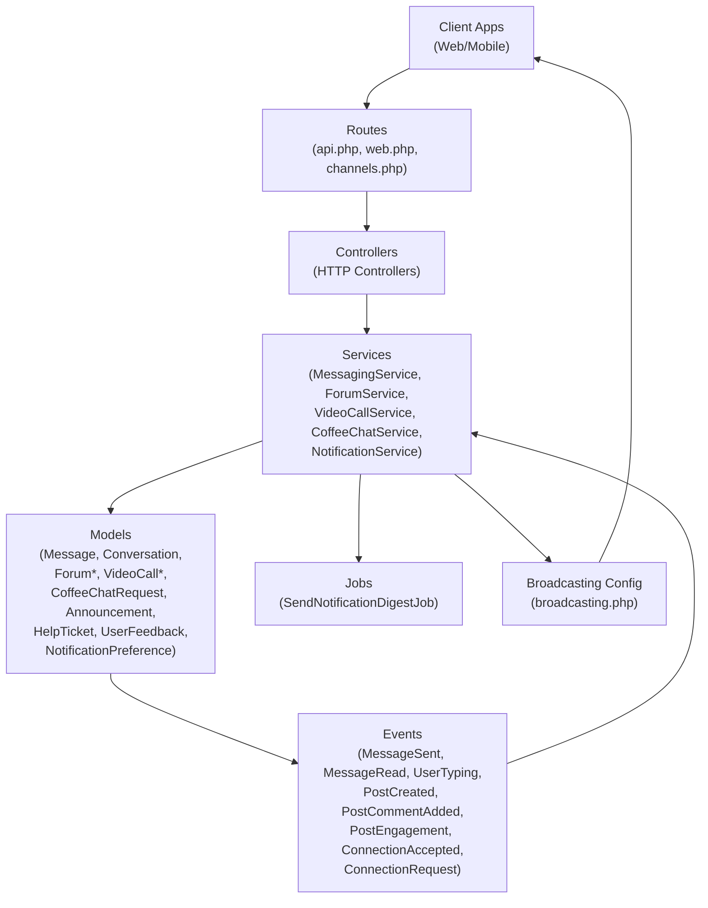

**Diagram sources**
- [api.php](file://routes/api.php)
- [web.php](file://routes/web.php)
- [channels.php](file://routes/channels.php)
- [broadcasting.php](file://config/broadcasting.php)
- [MessagingService.php](file://app/Services/MessagingService.php)
- [ForumService.php](file://app/Services/ForumService.php)
- [VideoCallService.php](file://app/Services/VideoCallService.php)
- [CoffeeChatService.php](file://app/Services/CoffeeChatService.php)
- [NotificationService.php](file://app/Services/NotificationService.php)
- [SendNotificationDigestJob.php](file://app/Jobs/SendNotificationDigestJob.php)
- [MessageSent.php](file://app/Events/MessageSent.php)
- [MessageRead.php](file://app/Events/MessageRead.php)
- [UserTyping.php](file://app/Events/UserTyping.php)
- [PostCreated.php](file://app/Events/PostCreated.php)
- [PostCommentAdded.php](file://app/Events/PostCommentAdded.php)
- [PostEngagement.php](file://app/Events/PostEngagement.php)
- [ConnectionAccepted.php](file://app/Events/ConnectionAccepted.php)
- [ConnectionRequest.php](file://app/Events/ConnectionRequest.php)

## Detailed Component Analysis

### Integrated Messaging System
The messaging system supports persistent conversations, direct communication, typing indicators, read receipts, and event-driven updates.

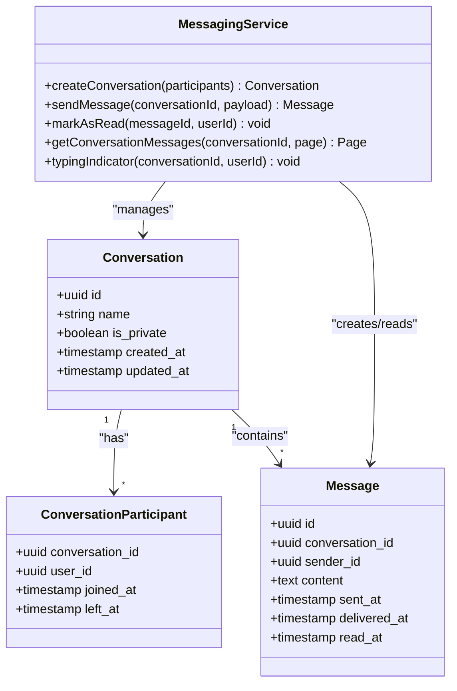

**Diagram sources**
- [Conversation.php](file://app/Models/Conversation.php)
- [ConversationParticipant.php](file://app/Models/ConversationParticipant.php)
- [Message.php](file://app/Models/Message.php)
- [MessagingService.php](file://app/Services/MessagingService.php)

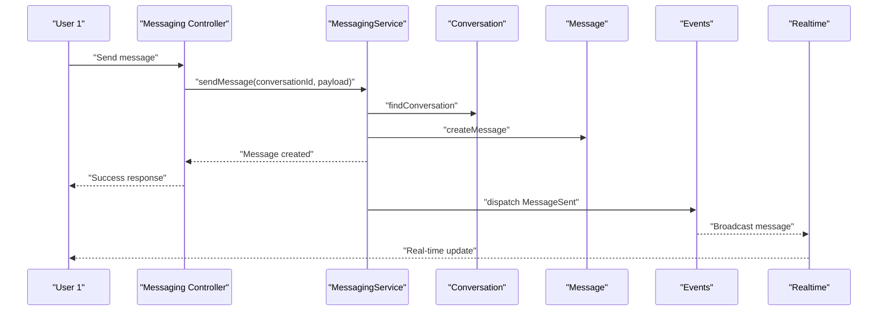

**Diagram sources**
- [MessagingService.php](file://app/Services/MessagingService.php)
- [MessageSent.php](file://app/Events/MessageSent.php)
- [broadcasting.php](file://config/broadcasting.php)
- [channels.php](file://routes/channels.php)

Key workflows:
- Creating a conversation and adding participants
- Sending and receiving messages with read receipts
- Typing indicators and real-time updates
- Pagination and filtering for large histories

**Section sources**
- [MessagingService.php](file://app/Services/MessagingService.php)
- [Message.php](file://app/Models/Message.php)
- [Conversation.php](file://app/Models/Conversation.php)
- [ConversationParticipant.php](file://app/Models/ConversationParticipant.php)
- [MessageSent.php](file://app/Events/MessageSent.php)
- [MessageRead.php](file://app/Events/MessageRead.php)
- [UserTyping.php](file://app/Events/UserTyping.php)

### Discussion Forums
The forum system organizes content into forums, topics, and posts with subscriptions and engagement.

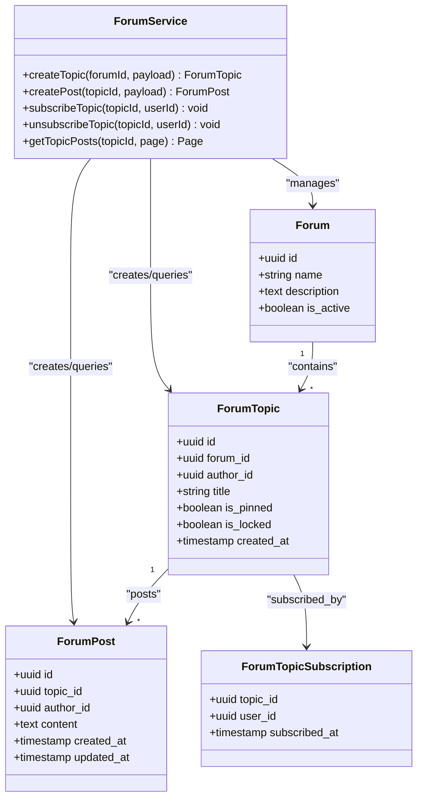

**Diagram sources**
- [Forum.php](file://app/Models/Forum.php)
- [ForumTopic.php](file://app/Models/ForumTopic.php)
- [ForumPost.php](file://app/Models/ForumPost.php)
- [ForumTopicSubscription.php](file://app/Models/ForumTopicSubscription.php)
- [ForumService.php](file://app/Services/ForumService.php)

Community building features:
- Topic subscriptions for activity alerts
- Engagement events for posts and comments
- Networking through shared interests and discussions

**Section sources**
- [ForumService.php](file://app/Services/ForumService.php)
- [Forum.php](file://app/Models/Forum.php)
- [ForumTopic.php](file://app/Models/ForumTopic.php)
- [ForumPost.php](file://app/Models/ForumPost.php)
- [ForumTopicSubscription.php](file://app/Models/ForumTopicSubscription.php)
- [PostCreated.php](file://app/Events/PostCreated.php)
- [PostCommentAdded.php](file://app/Events/PostCommentAdded.php)
- [PostEngagement.php](file://app/Events/PostEngagement.php)

### Video Calling Capabilities
Video calling integrates scheduled sessions with participants and a service layer for room/session management.

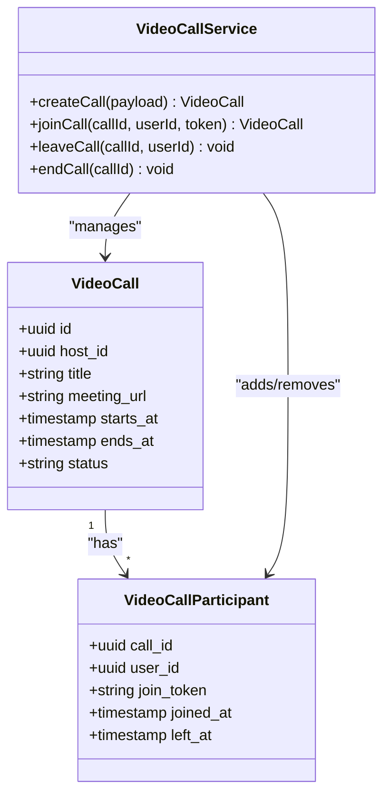

**Diagram sources**
- [VideoCall.php](file://app/Models/VideoCall.php)
- [VideoCallParticipant.php](file://app/Models/VideoCallParticipant.php)
- [VideoCallService.php](file://app/Services/VideoCallService.php)

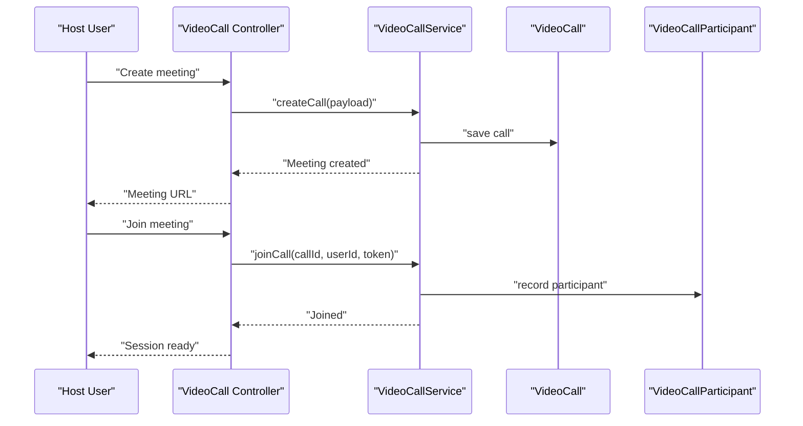

**Diagram sources**
- [VideoCallService.php](file://app/Services/VideoCallService.php)
- [VideoCall.php](file://app/Models/VideoCall.php)
- [VideoCallParticipant.php](file://app/Models/VideoCallParticipant.php)

**Section sources**
- [VideoCallService.php](file://app/Services/VideoCallService.php)
- [VideoCall.php](file://app/Models/VideoCall.php)
- [VideoCallParticipant.php](file://app/Models/VideoCallParticipant.php)
- [video-calling-implementation.md](file://docs/video-calling-implementation.md)
- [video-calling-implementation-summary.md](file://docs/video-calling-implementation-summary.md)

### Coffee Chat Scheduling
Coffee chats enable informal networking through request creation and matching.

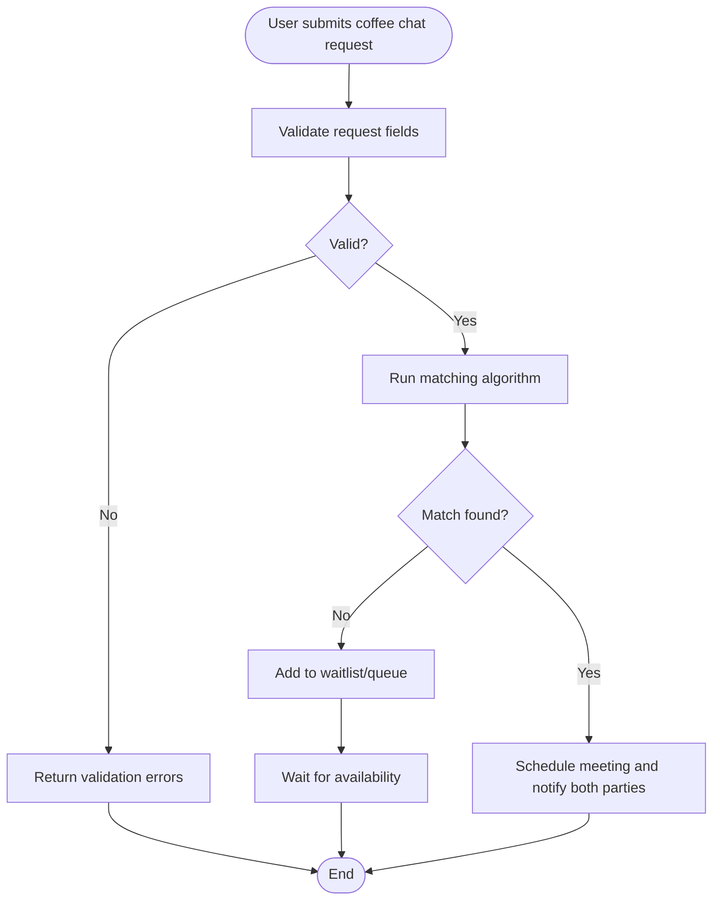

**Diagram sources**
- [CoffeeChatRequest.php](file://app/Models/CoffeeChatRequest.php)
- [CoffeeChatService.php](file://app/Services/CoffeeChatService.php)

**Section sources**
- [CoffeeChatService.php](file://app/Services/CoffeeChatService.php)
- [CoffeeChatRequest.php](file://app/Models/CoffeeChatRequest.php)

### Announcements
Announcements broadcast updates to users with read tracking.

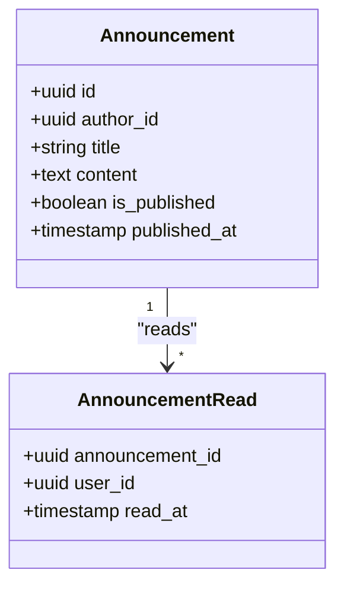

**Diagram sources**
- [Announcement.php](file://app/Models/Announcement.php)
- [AnnouncementRead.php](file://app/Models/AnnouncementRead.php)

**Section sources**
- [Announcement.php](file://app/Models/Announcement.php)
- [AnnouncementRead.php](file://app/Models/AnnouncementRead.php)

### Help Desk Integration
Help tickets and responses manage support workflows.

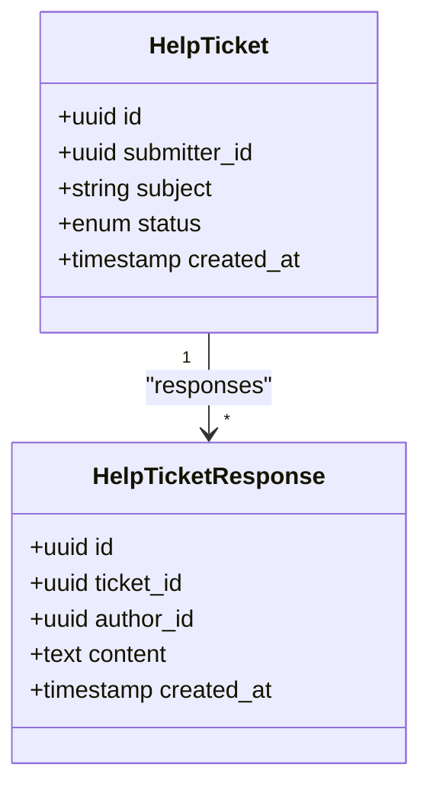

**Diagram sources**
- [HelpTicket.php](file://app/Models/HelpTicket.php)
- [HelpTicketResponse.php](file://app/Models/HelpTicketResponse.php)

**Section sources**
- [HelpTicket.php](file://app/Models/HelpTicket.php)
- [HelpTicketResponse.php](file://app/Models/HelpTicketResponse.php)

### Feedback Collection
Structured feedback submissions capture user insights.

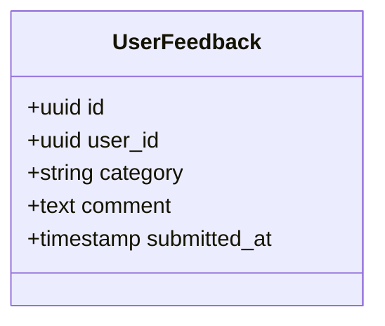

**Diagram sources**
- [UserFeedback.php](file://app/Models/UserFeedback.php)

**Section sources**
- [UserFeedback.php](file://app/Models/UserFeedback.php)

### Centralized Notification Center
Notifications unify communication preferences, templates, and digests.

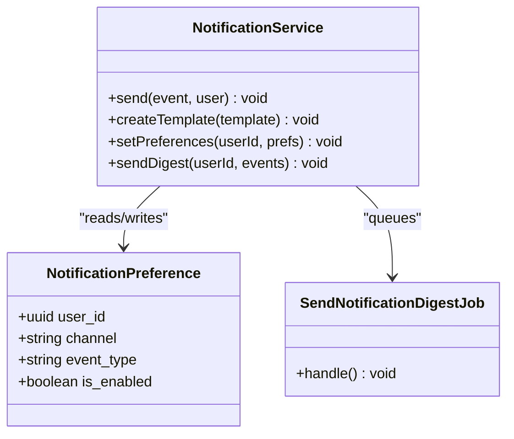

**Diagram sources**
- [NotificationPreference.php](file://app/Models/NotificationPreference.php)
- [NotificationService.php](file://app/Services/NotificationService.php)
- [SendNotificationDigestJob.php](file://app/Jobs/SendNotificationDigestJob.php)

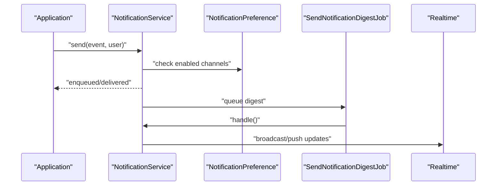

**Diagram sources**
- [NotificationService.php](file://app/Services/NotificationService.php)
- [NotificationPreference.php](file://app/Models/NotificationPreference.php)
- [SendNotificationDigestJob.php](file://app/Jobs/SendNotificationDigestJob.php)
- [broadcasting.php](file://config/broadcasting.php)
- [channels.php](file://routes/channels.php)

**Section sources**
- [NotificationService.php](file://app/Services/NotificationService.php)
- [NotificationPreference.php](file://app/Models/NotificationPreference.php)
- [SendNotificationDigestJob.php](file://app/Jobs/SendNotificationDigestJob.php)

## Dependency Analysis
The components exhibit clear separation of concerns:
- Controllers depend on Services
- Services depend on Models and Jobs
- Models trigger Events
- Events integrate with Realtime Broadcasting
- Jobs handle background processing for digests

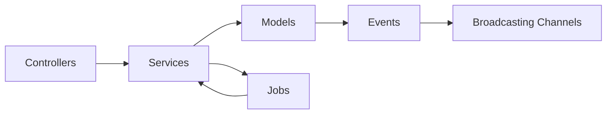

**Diagram sources**
- [api.php](file://routes/api.php)
- [web.php](file://routes/web.php)
- [channels.php](file://routes/channels.php)
- [broadcasting.php](file://config/broadcasting.php)
- [MessagingService.php](file://app/Services/MessagingService.php)
- [ForumService.php](file://app/Services/ForumService.php)
- [VideoCallService.php](file://app/Services/VideoCallService.php)
- [CoffeeChatService.php](file://app/Services/CoffeeChatService.php)
- [NotificationService.php](file://app/Services/NotificationService.php)
- [SendNotificationDigestJob.php](file://app/Jobs/SendNotificationDigestJob.php)

**Section sources**
- [api.php](file://routes/api.php)
- [web.php](file://routes/web.php)
- [channels.php](file://routes/channels.php)
- [broadcasting.php](file://config/broadcasting.php)

## Performance Considerations
- Use pagination for conversations and forum posts to limit payload sizes
- Batch read receipts and typing indicators to reduce event frequency
- Index foreign keys on messages, posts, and participants for fast queries
- Offload heavy notification processing to queued jobs
- Cache frequently accessed forum topics and recent announcements
- Limit concurrent video call participants per room to maintain quality

[No sources needed since this section provides general guidance]

## Troubleshooting Guide
Common issues and resolutions:
- Messages not appearing in real-time: verify broadcasting configuration and channel permissions
- Notification digests not sending: check job queue worker and schedule
- Video call join failures: confirm meeting URLs and tokens, validate participant records
- Forum subscriptions not triggering emails: review preference settings and template rendering
- Coffee chat matching delays: adjust matching algorithm thresholds and queue processing

**Section sources**
- [broadcasting.php](file://config/broadcasting.php)
- [channels.php](file://routes/channels.php)
- [SendNotificationDigestJob.php](file://app/Jobs/SendNotificationDigestJob.php)
- [NotificationService.php](file://app/Services/NotificationService.php)
- [VideoCallService.php](file://app/Services/VideoCallService.php)
- [ForumService.php](file://app/Services/ForumService.php)
- [CoffeeChatService.php](file://app/Services/CoffeeChatService.php)

## Conclusion
The platform’s communication and collaboration features combine robust domain models, service layers, and event-driven workflows. Real-time updates, notification preferences, and asynchronous processing ensure scalability and responsiveness. The modular design supports future enhancements such as advanced video features, expanded forum categories, and richer engagement tools.

[No sources needed since this section summarizes without analyzing specific files]

## Appendices
- Example messaging workflow: see [MessagingService.php](file://app/Services/MessagingService.php)
- Video call setup: see [VideoCallService.php](file://app/Services/VideoCallService.php)
- Community building features: see [ForumService.php](file://app/Services/ForumService.php)
- User experience flows: see [user-experience-flows.md](file://docs/user-experience-flows.md)

**Section sources**
- [task-10-communication-messaging-recap.md](file://docs/task-10-communication-messaging-recap.md)
- [video-calling-implementation.md](file://docs/video-calling-implementation.md)
- [video-calling-implementation-summary.md](file://docs/video-calling-implementation-summary.md)
- [user-experience-flows.md](file://docs/user-experience-flows.md)