# Discussion Forums

<cite>
**Referenced Files in This Document**
- [ForumService.php](file://app/Services/ForumService.php)
- [ForumController.php](file://app/Http/Controllers/Api/ForumController.php)
- [ForumTopicController.php](file://app/Http/Controllers/Api/ForumTopicController.php)
- [ForumPostController.php](file://app/Http/Controllers/Api/ForumPostController.php)
- [ForumSearchController.php](file://app/Http/Controllers/Api/ForumSearchController.php)
- [ForumAnalyticsController.php](file://app/Http/Controllers/Api/ForumAnalyticsController.php)
- [ForumModerationController.php](file://app/Http/Controllers/Api/ForumModerationController.php)
- [Forum.php](file://app/Models/Forum.php)
- [ForumTopic.php](file://app/Models/ForumTopic.php)
- [ForumPost.php](file://app/Models/ForumPost.php)
- [ForumTag.php](file://app/Models/ForumTag.php)
- [ForumPostLike.php](file://app/Models/ForumPostLike.php)
- [ForumTopicSubscription.php](file://app/Models/ForumTopicSubscription.php)
</cite>

## Table of Contents
1. [Introduction](#introduction)
2. [Project Structure](#project-structure)
3. [Core Components](#core-components)
4. [Architecture Overview](#architecture-overview)
5. [Detailed Component Analysis](#detailed-component-analysis)
6. [Dependency Analysis](#dependency-analysis)
7. [Performance Considerations](#performance-considerations)
8. [Troubleshooting Guide](#troubleshooting-guide)
9. [Conclusion](#conclusion)
10. [Appendices](#appendices)

## Introduction
This document describes the discussion forum system, covering categories (forums), topic creation and management, thread replies, moderation workflows, user participation (likes, subscriptions), search and tagging, administration and analytics, and integrations with user profiles. It also outlines real-time-like behaviors via notifications and subscription tracking, and provides practical workflows and moderation scenarios.

## Project Structure
The forum system is implemented as a cohesive set of models, controllers, and a service layer:
- Controllers handle HTTP requests for forums, topics, posts, search, analytics, and moderation.
- Models define the domain entities: Forum, ForumTopic, ForumPost, ForumTag, ForumPostLike, ForumTopicSubscription.
- ForumService encapsulates cross-cutting logic such as search, moderation, and analytics.

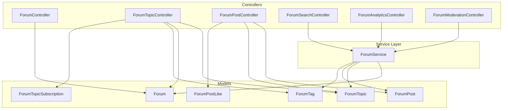

**Diagram sources**
- [ForumController.php:12-196](file://app/Http/Controllers/Api/ForumController.php#L12-L196)
- [ForumTopicController.php:15-383](file://app/Http/Controllers/Api/ForumTopicController.php#L15-L383)
- [ForumPostController.php:13-254](file://app/Http/Controllers/Api/ForumPostController.php#L13-L254)
- [ForumSearchController.php:12-154](file://app/Http/Controllers/Api/ForumSearchController.php#L12-L154)
- [ForumAnalyticsController.php:10-39](file://app/Http/Controllers/Api/ForumAnalyticsController.php#L10-L39)
- [ForumModerationController.php:11-128](file://app/Http/Controllers/Api/ForumModerationController.php#L11-L128)
- [ForumService.php:12-274](file://app/Services/ForumService.php#L12-L274)
- [Forum.php:10-101](file://app/Models/Forum.php#L10-L101)
- [ForumTopic.php:11-142](file://app/Models/ForumTopic.php#L11-L142)
- [ForumPost.php:9-151](file://app/Models/ForumPost.php#L9-L151)
- [ForumTag.php:9-66](file://app/Models/ForumTag.php#L9-L66)
- [ForumPostLike.php:8-39](file://app/Models/ForumPostLike.php#L8-L39)
- [ForumTopicSubscription.php:8-49](file://app/Models/ForumTopicSubscription.php#L8-L49)

**Section sources**
- [ForumController.php:12-196](file://app/Http/Controllers/Api/ForumController.php#L12-L196)
- [ForumTopicController.php:15-383](file://app/Http/Controllers/Api/ForumTopicController.php#L15-L383)
- [ForumPostController.php:13-254](file://app/Http/Controllers/Api/ForumPostController.php#L13-L254)
- [ForumSearchController.php:12-154](file://app/Http/Controllers/Api/ForumSearchController.php#L12-L154)
- [ForumAnalyticsController.php:10-39](file://app/Http/Controllers/Api/ForumAnalyticsController.php#L10-L39)
- [ForumModerationController.php:11-128](file://app/Http/Controllers/Api/ForumModerationController.php#L11-L128)
- [ForumService.php:12-274](file://app/Services/ForumService.php#L12-L274)

## Core Components
- Forum: Category with visibility, grouping, counters, and access control.
- ForumTopic: Thread with lifecycle (active, locked, archived), sticky/announcement flags, approvals, and tags.
- ForumPost: Reply/comment with nesting (thread_path/depth), approvals, likes, and solution marking.
- ForumTag: Tagging taxonomy with popularity and feature flags.
- ForumPostLike: User-to-post relationship for likes.
- ForumTopicSubscription: Topic subscriptions with read/unread tracking and email preferences.
- ForumService: Cross-cutting operations for search, moderation, analytics, and statistics.

**Section sources**
- [Forum.php:10-101](file://app/Models/Forum.php#L10-L101)
- [ForumTopic.php:11-142](file://app/Models/ForumTopic.php#L11-L142)
- [ForumPost.php:9-151](file://app/Models/ForumPost.php#L9-L151)
- [ForumTag.php:9-66](file://app/Models/ForumTag.php#L9-L66)
- [ForumPostLike.php:8-39](file://app/Models/ForumPostLike.php#L8-L39)
- [ForumTopicSubscription.php:8-49](file://app/Models/ForumTopicSubscription.php#L8-L49)
- [ForumService.php:12-274](file://app/Services/ForumService.php#L12-L274)

## Architecture Overview
The system follows a layered architecture:
- Presentation: Controllers expose REST endpoints for CRUD and operations on forums, topics, posts, search, analytics, and moderation.
- Business Logic: ForumService centralizes search, moderation, and analytics.
- Persistence: Eloquent models manage relations, scopes, and event hooks for counters and approvals.

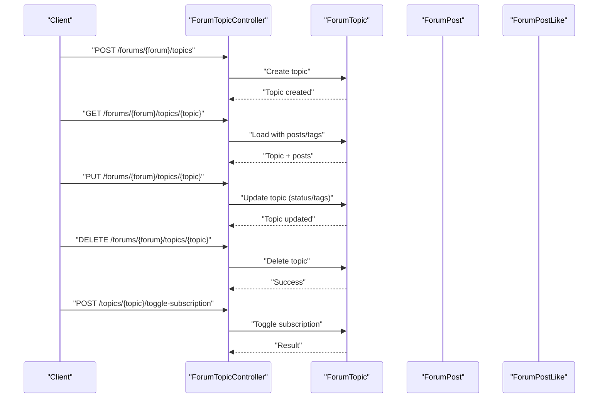

**Diagram sources**
- [ForumTopicController.php:15-383](file://app/Http/Controllers/Api/ForumTopicController.php#L15-L383)
- [ForumTopic.php:11-142](file://app/Models/ForumTopic.php#L11-L142)
- [ForumPost.php:9-151](file://app/Models/ForumPost.php#L9-L151)
- [ForumTopicSubscription.php:8-49](file://app/Models/ForumTopicSubscription.php#L8-L49)

## Detailed Component Analysis

### Forum Categories and Access Control
- Forums support three visibility modes: public, private, and group_only. Access checks are enforced per-request and via model helpers.
- Controllers filter forums by group or by user access when group_id is not specified.
- Statistics include counts for topics and posts, and last activity timestamps.

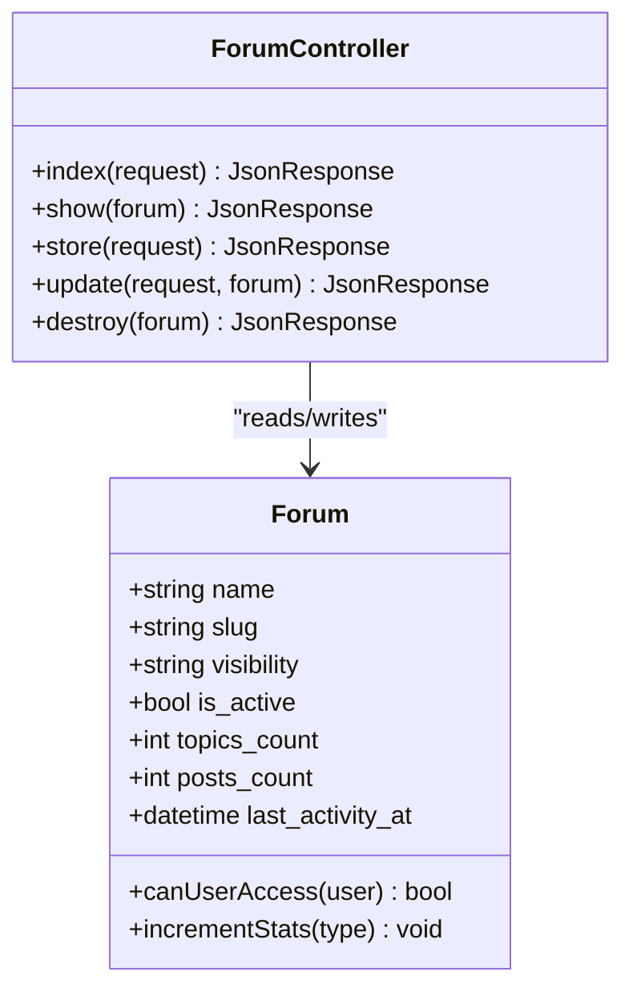

**Diagram sources**
- [Forum.php:10-101](file://app/Models/Forum.php#L10-L101)
- [ForumController.php:12-196](file://app/Http/Controllers/Api/ForumController.php#L12-L196)

**Section sources**
- [Forum.php:81-93](file://app/Models/Forum.php#L81-L93)
- [ForumController.php:17-64](file://app/Http/Controllers/Api/ForumController.php#L17-L64)

### Topic Creation, Editing, Locking, and Deletion
- Topics require approval based on forum settings; creators auto-subscribe.
- Status supports active, locked, archived; sticky and announcement flags are supported.
- Tags are normalized and tracked via usage counts.

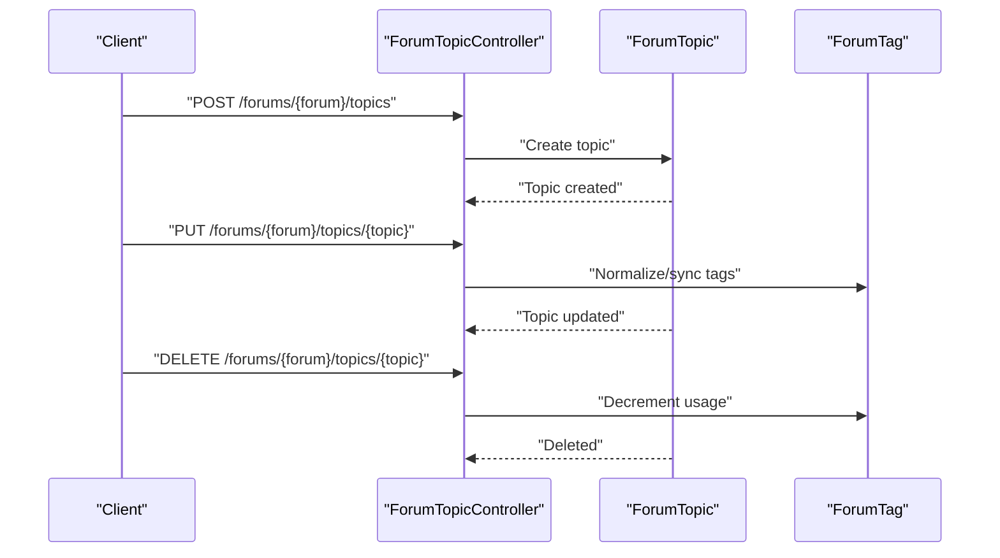

**Diagram sources**
- [ForumTopicController.php:86-150](file://app/Http/Controllers/Api/ForumTopicController.php#L86-L150)
- [ForumTopic.php:11-142](file://app/Models/ForumTopic.php#L11-L142)
- [ForumTag.php:9-66](file://app/Models/ForumTag.php#L9-L66)

**Section sources**
- [ForumTopicController.php:86-150](file://app/Http/Controllers/Api/ForumTopicController.php#L86-L150)
- [ForumTopic.php:100-135](file://app/Models/ForumTopic.php#L100-L135)

### Thread Management and Replies
- Posts are created under a topic; optional parent_id enables nested replies with thread_path and depth.
- Approvals depend on forum settings; posts update topic and forum counters upon creation/deletion.
- Users can load a post with replies and check if they liked it.

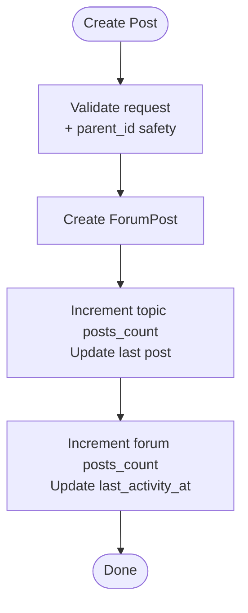

**Diagram sources**
- [ForumPostController.php:18-79](file://app/Http/Controllers/Api/ForumPostController.php#L18-L79)
- [ForumPost.php:36-65](file://app/Models/ForumPost.php#L36-L65)
- [ForumTopic.php:127-135](file://app/Models/ForumTopic.php#L127-L135)
- [Forum.php:95-99](file://app/Models/Forum.php#L95-L99)

**Section sources**
- [ForumPostController.php:18-79](file://app/Http/Controllers/Api/ForumPostController.php#L18-L79)
- [ForumPost.php:36-65](file://app/Models/ForumPost.php#L36-L65)

### User Participation: Likes and Subscriptions
- Users can like/unlike posts; like events update post likes_count.
- Users can subscribe/unsubscribe to topics; read/unread detection tracks last_read_at.

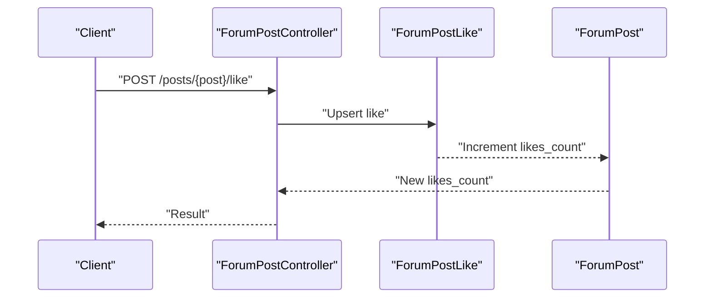

**Diagram sources**
- [ForumPostController.php:191-228](file://app/Http/Controllers/Api/ForumPostController.php#L191-L228)
- [ForumPostLike.php:16-27](file://app/Models/ForumPostLike.php#L16-L27)
- [ForumPost.php:146-149](file://app/Models/ForumPost.php#L146-L149)

**Section sources**
- [ForumPostLike.php:20-26](file://app/Models/ForumPostLike.php#L20-L26)
- [ForumTopicSubscription.php:32-47](file://app/Models/ForumTopicSubscription.php#L32-L47)

### Moderation Tools and Workflows
- Moderators can approve, reject, or delete topics and posts within accessible forums.
- Pending moderation lists are scoped to forums the moderator can access.
- Approval timestamps and approver tracking are maintained.

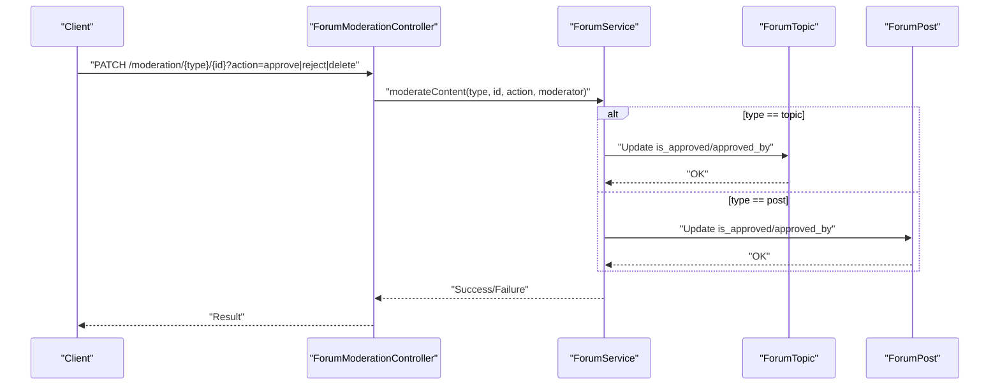

**Diagram sources**
- [ForumModerationController.php:20-61](file://app/Http/Controllers/Api/ForumModerationController.php#L20-L61)
- [ForumService.php:203-242](file://app/Services/ForumService.php#L203-L242)
- [ForumTopic.php:13-38](file://app/Models/ForumTopic.php#L13-L38)
- [ForumPost.php:11-27](file://app/Models/ForumPost.php#L11-L27)

**Section sources**
- [ForumModerationController.php:20-61](file://app/Http/Controllers/Api/ForumModerationController.php#L20-L61)
- [ForumService.php:203-242](file://app/Services/ForumService.php#L203-L242)

### Search, Tagging, and Categorization
- Full-text search across topics by title/content; filtering by forum, tag, and author.
- Sorting by relevance, newest, oldest, popular, or activity.
- Popular tags and featured tags endpoints; tag-scoped topic listings.

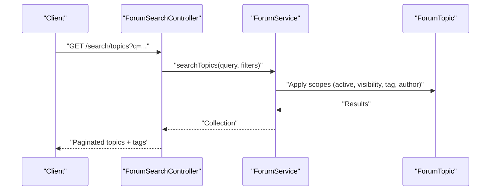

**Diagram sources**
- [ForumSearchController.php:21-74](file://app/Http/Controllers/Api/ForumSearchController.php#L21-L74)
- [ForumService.php:45-108](file://app/Services/ForumService.php#L45-L108)
- [ForumTopic.php:100-120](file://app/Models/ForumTopic.php#L100-L120)

**Section sources**
- [ForumSearchController.php:21-74](file://app/Http/Controllers/Api/ForumSearchController.php#L21-L74)
- [ForumService.php:45-108](file://app/Services/ForumService.php#L45-L108)

### Administration and Analytics
- Admins and moderators can view forum statistics including totals, popular forums, recent activity, and active users.
- Permissions gate analytics access.

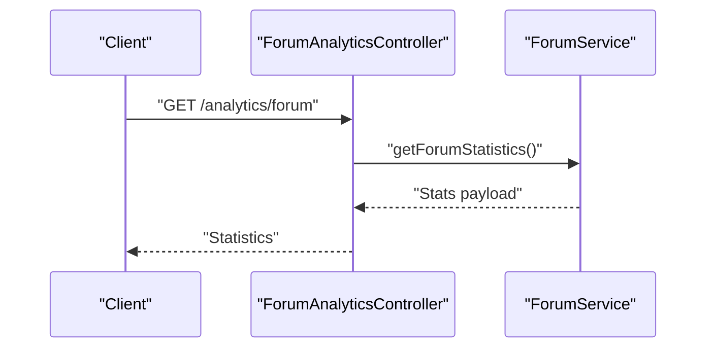

**Diagram sources**
- [ForumAnalyticsController.php:19-37](file://app/Http/Controllers/Api/ForumAnalyticsController.php#L19-L37)
- [ForumService.php:132-198](file://app/Services/ForumService.php#L132-L198)

**Section sources**
- [ForumAnalyticsController.php:19-37](file://app/Http/Controllers/Api/ForumAnalyticsController.php#L19-L37)
- [ForumService.php:132-198](file://app/Services/ForumService.php#L132-L198)

### Real-Time Updates and Notifications
- Subscription read/unread tracking: last_read_at is updated when viewing a topic; unread detection compares post timestamps to last_read_at.
- Email notification preference exists on subscriptions; integration with notification service is implied by presence of subscription model and notification-related events elsewhere in the system.

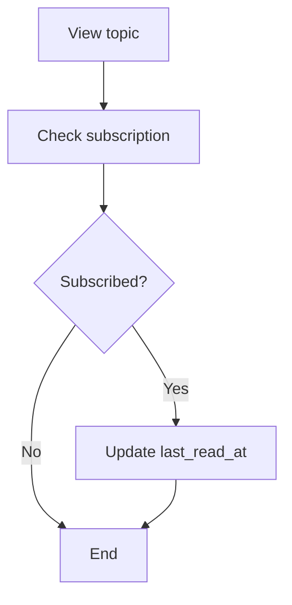

**Diagram sources**
- [ForumTopicController.php:180-188](file://app/Http/Controllers/Api/ForumTopicController.php#L180-L188)
- [ForumTopicSubscription.php:32-47](file://app/Models/ForumTopicSubscription.php#L32-L47)

**Section sources**
- [ForumTopicSubscription.php:32-47](file://app/Models/ForumTopicSubscription.php#L32-L47)

## Dependency Analysis
- Controllers depend on models and the service layer for cross-cutting logic.
- Models encapsulate relations, scopes, and event hooks for counters and approvals.
- ForumService depends on models to implement search, moderation, and analytics.

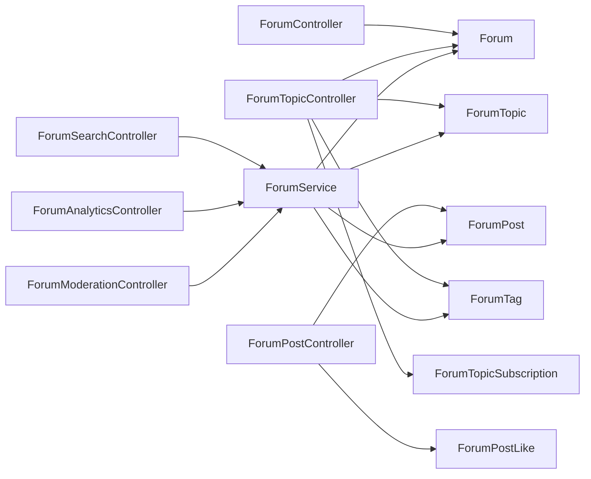

**Diagram sources**
- [ForumController.php:12-196](file://app/Http/Controllers/Api/ForumController.php#L12-L196)
- [ForumTopicController.php:15-383](file://app/Http/Controllers/Api/ForumTopicController.php#L15-L383)
- [ForumPostController.php:13-254](file://app/Http/Controllers/Api/ForumPostController.php#L13-L254)
- [ForumSearchController.php:12-154](file://app/Http/Controllers/Api/ForumSearchController.php#L12-L154)
- [ForumAnalyticsController.php:10-39](file://app/Http/Controllers/Api/ForumAnalyticsController.php#L10-L39)
- [ForumModerationController.php:11-128](file://app/Http/Controllers/Api/ForumModerationController.php#L11-L128)
- [ForumService.php:12-274](file://app/Services/ForumService.php#L12-L274)

**Section sources**
- [ForumService.php:12-274](file://app/Services/ForumService.php#L12-L274)

## Performance Considerations
- Indexing: Add database indexes on frequently filtered/sorted columns such as forum_id, is_approved, created_at, last_post_at, slug, and tag junction table columns to optimize search and listing queries.
- Pagination: Controllers already paginate results; keep per_page reasonable defaults and enforce upper bounds.
- Aggregation caching: Cache popular tags and recent activity for analytics to reduce repeated heavy queries.
- Denormalized counters: Keep topics_count/posts_count updated via model events to avoid expensive COUNT queries in listings.
- Search relevance: Consider full-text indexes or external search (e.g., Elasticsearch) for large-scale relevance ranking.

## Troubleshooting Guide
- Access Denied to Forum/Topic: Ensure the current user satisfies the forum’s visibility rules or holds admin/moderator role.
- Topic Locked: Posting attempts to locked topics are rejected; unlock the topic or adjust status.
- Invalid Parent Post: When replying, parent_id must belong to the same topic; otherwise, validation fails.
- Insufficient Permissions for Moderation: Only admin or moderator roles can moderate content; verify user roles.
- Unauthorized Edit/Delete: Non-owners can only edit/delete if they are admin/moderator.
- Subscription Toggle Failures: Ensure the user is accessing a forum they can see; otherwise, access is denied.

**Section sources**
- [ForumController.php:96-105](file://app/Http/Controllers/Api/ForumController.php#L96-L105)
- [ForumTopicController.php:255-264](file://app/Http/Controllers/Api/ForumTopicController.php#L255-L264)
- [ForumPostController.php:134-143](file://app/Http/Controllers/Api/ForumPostController.php#L134-L143)
- [ForumPostController.php:169-178](file://app/Http/Controllers/Api/ForumPostController.php#L169-L178)
- [ForumModerationController.php:24-30](file://app/Http/Controllers/Api/ForumModerationController.php#L24-L30)

## Conclusion
The forum system provides a robust foundation for categorized discussions, threaded conversations, tagging, moderation, and analytics. Its layered design separates concerns cleanly, enabling maintainability and extensibility. By adding targeted indexing, pagination safeguards, and caching, the system can scale effectively while preserving a strong user experience.

## Appendices

### Example Workflows

- Creating a Topic and Initial Post
  - POST to create a topic under a forum; if the forum requires approval, the topic remains pending until approved.
  - POST to create the first post under the topic; the post inherits approval status from the forum setting.

- Replying to a Thread
  - POST to create a reply with parent_id set to the originating post; thread_path and depth are computed automatically.
  - Replies are approved based on forum settings; users can view nested replies under the original post.

- Tagging and Discovery
  - During topic creation/update, tags are normalized and synchronized; popular tags are surfaced via dedicated endpoint.
  - Users can browse topics by tag, filtered by forum visibility.

- Moderation Scenario
  - A moderator reviews pending topics and posts; they can approve, reject, or delete content.
  - Approved items update counters and timestamps; rejected items remain visible but flagged as unapproved.

- Community Engagement Pattern
  - Users subscribe to topics to receive updates; read/unread state is tracked via last_read_at.
  - Users can like posts to express appreciation; likes increment post counters.

[No sources needed since this section provides conceptual workflows]