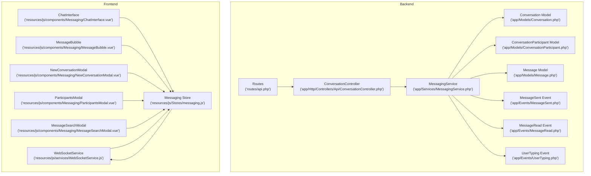
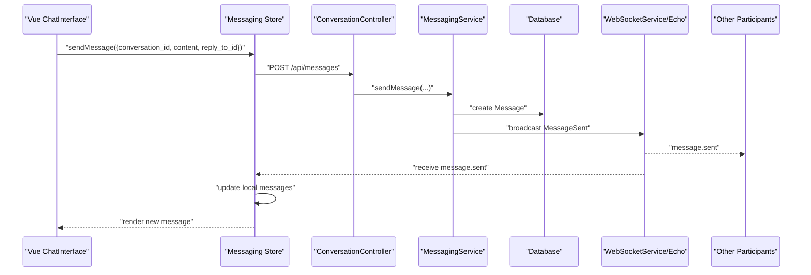
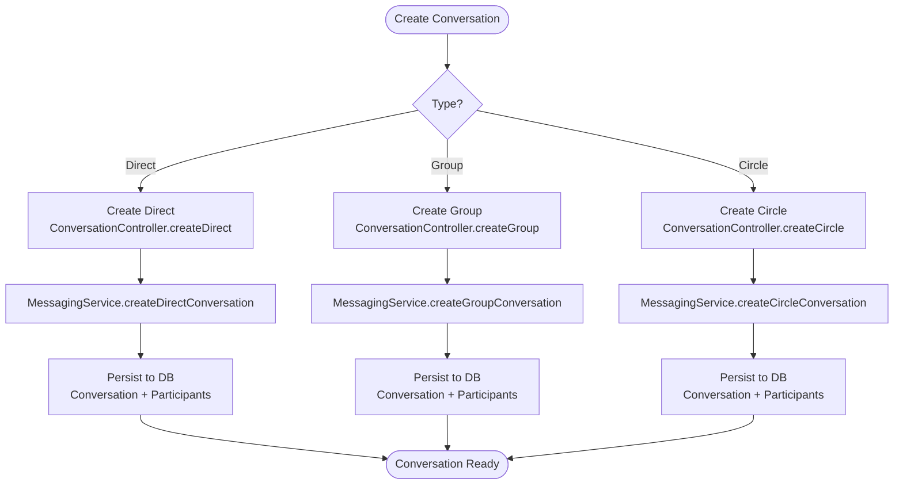
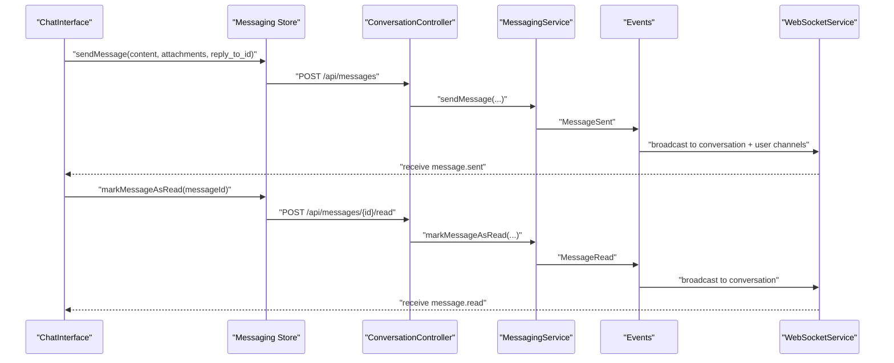
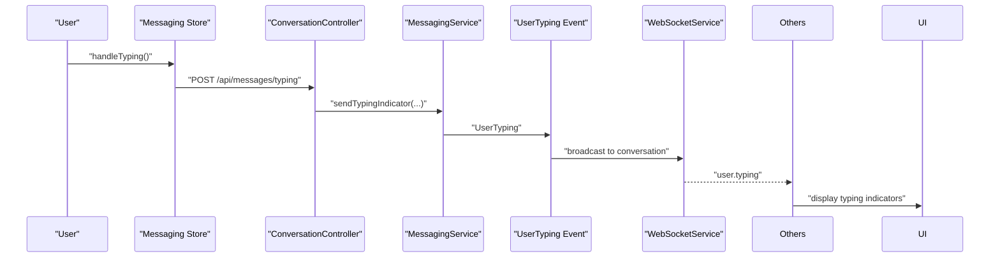
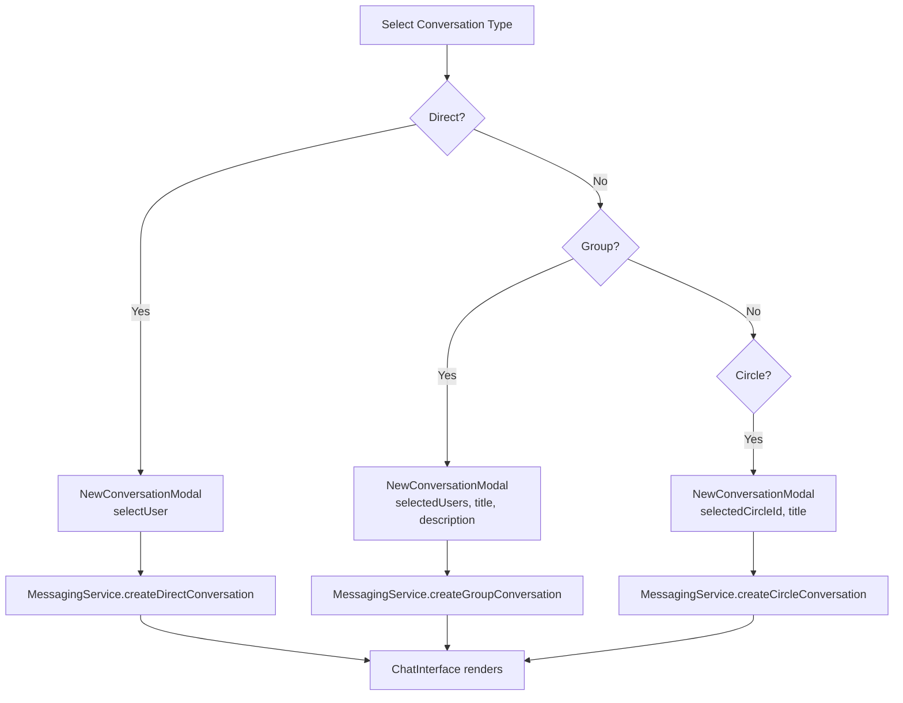
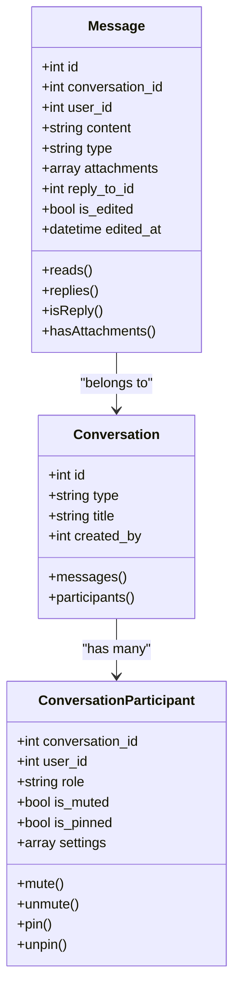
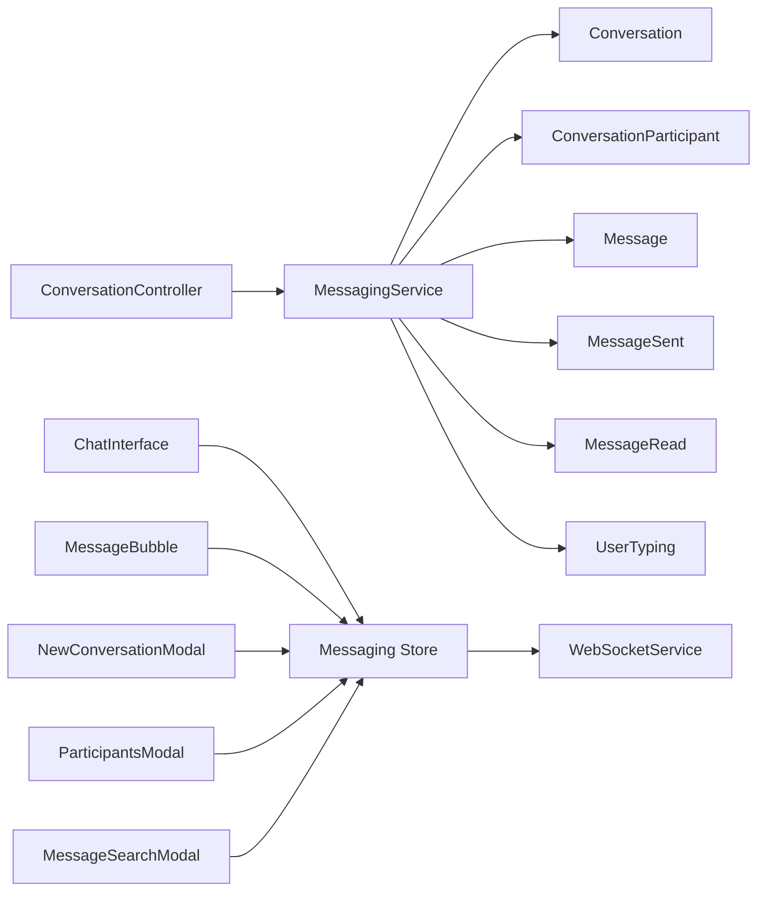

# Messaging System

<cite>
**Referenced Files in This Document**
- [api.php](file://routes/api.php)
- [ConversationController.php](file://app/Http/Controllers/Api/ConversationController.php)
- [MessagingService.php](file://app/Services/MessagingService.php)
- [Conversation.php](file://app/Models/Conversation.php)
- [ConversationParticipant.php](file://app/Models/ConversationParticipant.php)
- [Message.php](file://app/Models/Message.php)
- [MessageSent.php](file://app/Events/MessageSent.php)
- [MessageRead.php](file://app/Events/MessageRead.php)
- [UserTyping.php](file://app/Events/UserTyping.php)
- [WebSocketService.js](file://resources/js/services/WebSocketService.js)
- [messaging.js](file://resources/js/Stores/messaging.js)
- [ChatInterface.vue](file://resources/js/components/Messaging/ChatInterface.vue)
- [MessageBubble.vue](file://resources/js/components/Messaging/MessageBubble.vue)
- [NewConversationModal.vue](file://resources/js/components/Messaging/NewConversationModal.vue)
- [ParticipantsModal.vue](file://resources/js/components/Messaging/ParticipantsModal.vue)
- [MessageSearchModal.vue](file://resources/js/components/Messaging/MessageSearchModal.vue)
- [task-10-communication-messaging-recap.md](file://docs/task-10-communication-messaging-recap.md)
</cite>

## Table of Contents
1. [Introduction](#introduction)
2. [Project Structure](#project-structure)
3. [Core Components](#core-components)
4. [Architecture Overview](#architecture-overview)
5. [Detailed Component Analysis](#detailed-component-analysis)
6. [Dependency Analysis](#dependency-analysis)
7. [Performance Considerations](#performance-considerations)
8. [Troubleshooting Guide](#troubleshooting-guide)
9. [Conclusion](#conclusion)

## Introduction
This document describes the integrated messaging system that supports direct messaging, group conversations, and circle-based communications. It covers real-time delivery via WebSocket, message composition, typing indicators, presence detection, conversation management (creation, participant management, pinning, muting, archiving, deletion), message editing/deletion, reply functionality, and rich media support. It also documents conversation workflows, message handling patterns, and integration with the notification system.

## Project Structure
The messaging system spans Laravel backend services and Vue frontend components:
- Backend: Controllers, Services, Models, and Events for conversations, messages, and real-time broadcasting
- Frontend: Vue components, a messaging store, and a WebSocket service for real-time updates

**Diagram sources**
- [api.php:757-772](file://routes/api.php#L757-L772)
- [ConversationController.php:1-340](file://app/Http/Controllers/Api/ConversationController.php#L1-L340)
- [MessagingService.php:1-462](file://app/Services/MessagingService.php#L1-L462)
- [Conversation.php:1-168](file://app/Models/Conversation.php#L1-L168)
- [ConversationParticipant.php:1-181](file://app/Models/ConversationParticipant.php#L1-L181)
- [Message.php:1-294](file://app/Models/Message.php#L1-L294)
- [MessageSent.php:1-91](file://app/Events/MessageSent.php#L1-L91)
- [MessageRead.php:1-67](file://app/Events/MessageRead.php#L1-L67)
- [UserTyping.php:1-69](file://app/Events/UserTyping.php#L1-L69)
- [WebSocketService.js:1-427](file://resources/js/services/WebSocketService.js#L1-L427)
- [messaging.js:89-540](file://resources/js/Stores/messaging.js#L89-L540)
- [ChatInterface.vue:13-440](file://resources/js/components/Messaging/ChatInterface.vue#L13-L440)
- [MessageBubble.vue:1-312](file://resources/js/components/Messaging/MessageBubble.vue#L1-L312)
- [NewConversationModal.vue:257-453](file://resources/js/components/Messaging/NewConversationModal.vue#L257-L453)
- [ParticipantsModal.vue:1-26](file://resources/js/components/Messaging/ParticipantsModal.vue#L1-L26)
- [MessageSearchModal.vue:1-270](file://resources/js/components/Messaging/MessageSearchModal.vue#L1-L270)

**Section sources**
- [api.php:757-772](file://routes/api.php#L757-L772)
- [ConversationController.php:1-340](file://app/Http/Controllers/Api/ConversationController.php#L1-L340)
- [MessagingService.php:1-462](file://app/Services/MessagingService.php#L1-L462)
- [WebSocketService.js:1-427](file://resources/js/services/WebSocketService.js#L1-L427)
- [messaging.js:89-540](file://resources/js/Stores/messaging.js#L89-L540)

## Core Components
- ConversationController: Exposes REST endpoints for conversations and participant management
- MessagingService: Orchestrates messaging operations, participant management, and real-time broadcasting
- Models: Conversation, ConversationParticipant, Message encapsulate persistence and relationships
- Events: MessageSent, MessageRead, UserTyping drive real-time updates
- WebSocketService: Manages Pusher/Laravel Echo connections and channel subscriptions
- Messaging Store: Centralizes state for conversations, messages, typing indicators, and unread counts
- UI Components: ChatInterface, MessageBubble, NewConversationModal, ParticipantsModal, MessageSearchModal

**Section sources**
- [ConversationController.php:20-340](file://app/Http/Controllers/Api/ConversationController.php#L20-L340)
- [MessagingService.php:15-462](file://app/Services/MessagingService.php#L15-L462)
- [Conversation.php:11-168](file://app/Models/Conversation.php#L11-L168)
- [ConversationParticipant.php:8-181](file://app/Models/ConversationParticipant.php#L8-L181)
- [Message.php:11-294](file://app/Models/Message.php#L11-L294)
- [MessageSent.php:14-91](file://app/Events/MessageSent.php#L14-L91)
- [MessageRead.php:13-67](file://app/Events/MessageRead.php#L13-L67)
- [UserTyping.php:12-69](file://app/Events/UserTyping.php#L12-L69)
- [WebSocketService.js:4-427](file://resources/js/services/WebSocketService.js#L4-L427)
- [messaging.js:89-540](file://resources/js/Stores/messaging.js#L89-L540)
- [ChatInterface.vue:13-440](file://resources/js/components/Messaging/ChatInterface.vue#L13-L440)
- [MessageBubble.vue:1-312](file://resources/js/components/Messaging/MessageBubble.vue#L1-L312)
- [NewConversationModal.vue:257-453](file://resources/js/components/Messaging/NewConversationModal.vue#L257-L453)
- [ParticipantsModal.vue:1-26](file://resources/js/components/Messaging/ParticipantsModal.vue#L1-L26)
- [MessageSearchModal.vue:1-270](file://resources/js/components/Messaging/MessageSearchModal.vue#L1-L270)

## Architecture Overview
The system integrates REST APIs with Laravel Echo/Pusher for real-time updates. Clients subscribe to conversation and user-specific channels to receive live message events, read receipts, and typing indicators.

**Diagram sources**
- [ChatInterface.vue:374-405](file://resources/js/components/Messaging/ChatInterface.vue#L374-L405)
- [messaging.js:114-140](file://resources/js/Stores/messaging.js#L114-L140)
- [ConversationController.php:54-87](file://app/Http/Controllers/Api/ConversationController.php#L54-L87)
- [MessagingService.php:98-127](file://app/Services/MessagingService.php#L98-L127)
- [MessageSent.php:36-90](file://app/Events/MessageSent.php#L36-L90)
- [WebSocketService.js:351-358](file://resources/js/services/WebSocketService.js#L351-L358)

**Section sources**
- [MessageSent.php:14-91](file://app/Events/MessageSent.php#L14-L91)
- [WebSocketService.js:348-394](file://resources/js/services/WebSocketService.js#L348-L394)
- [messaging.js:114-140](file://resources/js/Stores/messaging.js#L114-L140)

## Detailed Component Analysis

### Conversation Management
- Creation: Direct, group, and circle conversations are created through dedicated endpoints and service methods
- Participant Management: Add/remove participants with role checks; group leave restrictions
- Lifecycle: Archive, mute, pin toggles per participant settings
- Deletion: Conversation deletion is handled via soft-delete on Conversation model

**Diagram sources**
- [ConversationController.php:92-194](file://app/Http/Controllers/Api/ConversationController.php#L92-L194)
- [MessagingService.php:18-95](file://app/Services/MessagingService.php#L18-L95)
- [Conversation.php:11-67](file://app/Models/Conversation.php#L11-L67)

**Section sources**
- [ConversationController.php:92-194](file://app/Http/Controllers/Api/ConversationController.php#L92-L194)
- [MessagingService.php:18-95](file://app/Services/MessagingService.php#L18-L95)
- [Conversation.php:11-67](file://app/Models/Conversation.php#L11-L67)

### Message Composition and Delivery
- Composition: Text content, optional attachments, reply-to references
- Delivery: Optimistic UI updates, real-time broadcast, read receipts, and read-all
- Editing/Deletion: Ownership checks and time windows; moderation roles allowed

**Diagram sources**
- [ChatInterface.vue:374-405](file://resources/js/components/Messaging/ChatInterface.vue#L374-L405)
- [messaging.js:114-140](file://resources/js/Stores/messaging.js#L114-L140)
- [ConversationController.php:54-87](file://app/Http/Controllers/Api/ConversationController.php#L54-L87)
- [MessagingService.php:98-185](file://app/Services/MessagingService.php#L98-L185)
- [MessageSent.php:36-90](file://app/Events/MessageSent.php#L36-L90)
- [MessageRead.php:35-66](file://app/Events/MessageRead.php#L35-L66)
- [WebSocketService.js:351-394](file://resources/js/services/WebSocketService.js#L351-L394)

**Section sources**
- [Message.php:15-294](file://app/Models/Message.php#L15-L294)
- [MessagingService.php:98-185](file://app/Services/MessagingService.php#L98-L185)
- [MessageSent.php:14-91](file://app/Events/MessageSent.php#L14-L91)
- [MessageRead.php:13-67](file://app/Events/MessageRead.php#L13-L67)

### Typing Indicators and Presence Detection
- Typing: User sends typing indicators; others receive user.typing events
- Presence: Online indicators shown for direct chat participants

**Diagram sources**
- [ChatInterface.vue:359-372](file://resources/js/components/Messaging/ChatInterface.vue#L359-L372)
- [messaging.js:522](file://resources/js/Stores/messaging.js#L522)
- [MessagingService.php:188-200](file://app/Services/MessagingService.php#L188-L200)
- [UserTyping.php:32-68](file://app/Events/UserTyping.php#L32-L68)
- [WebSocketService.js:375-382](file://resources/js/services/WebSocketService.js#L375-L382)

**Section sources**
- [ChatInterface.vue:18-34](file://resources/js/components/Messaging/ChatInterface.vue#L18-L34)
- [UserTyping.php:12-69](file://app/Events/UserTyping.php#L12-L69)

### Conversation Workflows
- Direct messaging: One-on-one chat with participant presence
- Group conversations: Multi-participant with admin/moderator controls
- Circle-based communications: Broadcast to all circle members
- Search: Rich search across messages with filters

**Diagram sources**
- [NewConversationModal.vue:376-419](file://resources/js/components/Messaging/NewConversationModal.vue#L376-L419)
- [MessagingService.php:18-95](file://app/Services/MessagingService.php#L18-L95)
- [ChatInterface.vue:13-342](file://resources/js/components/Messaging/ChatInterface.vue#L13-L342)

**Section sources**
- [NewConversationModal.vue:257-453](file://resources/js/components/Messaging/NewConversationModal.vue#L257-L453)
- [ChatInterface.vue:13-342](file://resources/js/components/Messaging/ChatInterface.vue#L13-L342)

### Rich Media and Replies
- Attachments: Images, files, and links supported with previews and downloads
- Replies: Threaded replies with inline quoting
- Search: Full-text search with filters by date range, type, and sender

**Diagram sources**
- [Message.php:15-294](file://app/Models/Message.php#L15-L294)
- [Conversation.php:15-67](file://app/Models/Conversation.php#L15-L67)
- [ConversationParticipant.php:10-181](file://app/Models/ConversationParticipant.php#L10-L181)

**Section sources**
- [MessageBubble.vue:22-312](file://resources/js/components/Messaging/MessageBubble.vue#L22-L312)
- [MessageSearchModal.vue:199-231](file://resources/js/components/Messaging/MessageSearchModal.vue#L199-L231)

## Dependency Analysis
- Controllers depend on MessagingService for business logic
- MessagingService depends on Models for persistence and broadcasts Events
- Frontend Store depends on WebSocketService for real-time updates
- UI components coordinate with Store for state and user actions

**Diagram sources**
- [ConversationController.php:13-18](file://app/Http/Controllers/Api/ConversationController.php#L13-L18)
- [MessagingService.php:15-462](file://app/Services/MessagingService.php#L15-L462)
- [WebSocketService.js:4-427](file://resources/js/services/WebSocketService.js#L4-L427)
- [messaging.js:89-540](file://resources/js/Stores/messaging.js#L89-L540)

**Section sources**
- [ConversationController.php:13-18](file://app/Http/Controllers/Api/ConversationController.php#L13-L18)
- [MessagingService.php:15-462](file://app/Services/MessagingService.php#L15-L462)
- [WebSocketService.js:4-427](file://resources/js/services/WebSocketService.js#L4-L427)
- [messaging.js:89-540](file://resources/js/Stores/messaging.js#L89-L540)

## Performance Considerations
- Real-time optimization: WebSocket connection pooling and exponential backoff
- Pagination: Conversations and messages paginated to limit payload sizes
- Indexing: Database indexing for conversations, messages, and participant settings
- Caching: Frequently accessed metadata cached to reduce latency
- Archiving: Old messages archived to improve query performance

[No sources needed since this section provides general guidance]

## Troubleshooting Guide
- WebSocket initialization failures: Check Echo configuration, CSRF token, and auth headers
- Connection drops: Verify reconnection attempts and exponential backoff behavior
- Missing real-time updates: Confirm channel subscription and event broadcasting
- Permission errors: Ensure participant roles and ownership checks pass
- Search not returning results: Validate search endpoint and filters

**Section sources**
- [WebSocketService.js:20-48](file://resources/js/services/WebSocketService.js#L20-L48)
- [WebSocketService.js:99-124](file://resources/js/services/WebSocketService.js#L99-L124)
- [MessagingService.php:268-306](file://app/Services/MessagingService.php#L268-L306)
- [MessageSearchModal.vue:199-231](file://resources/js/components/Messaging/MessageSearchModal.vue#L199-L231)

## Conclusion
The messaging system provides a robust foundation for direct, group, and circle-based communications with strong real-time capabilities, comprehensive conversation management, and rich media support. Its layered architecture ensures maintainability and scalability, while the frontend store and WebSocket service deliver a responsive user experience.