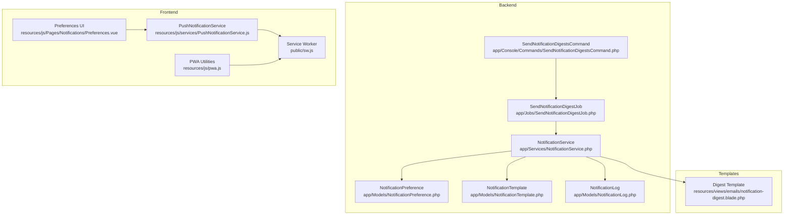
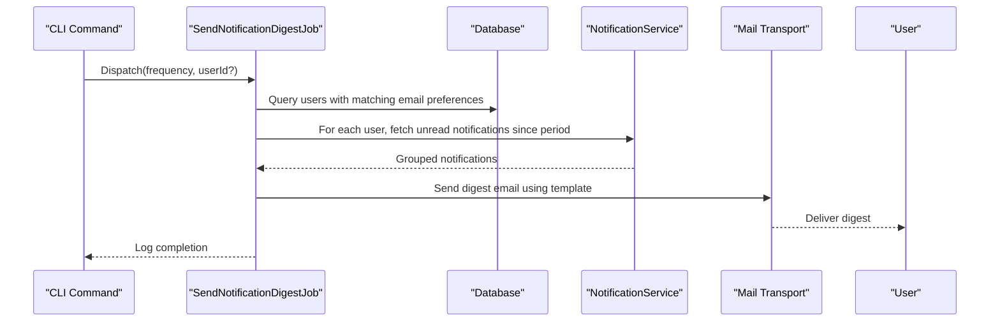
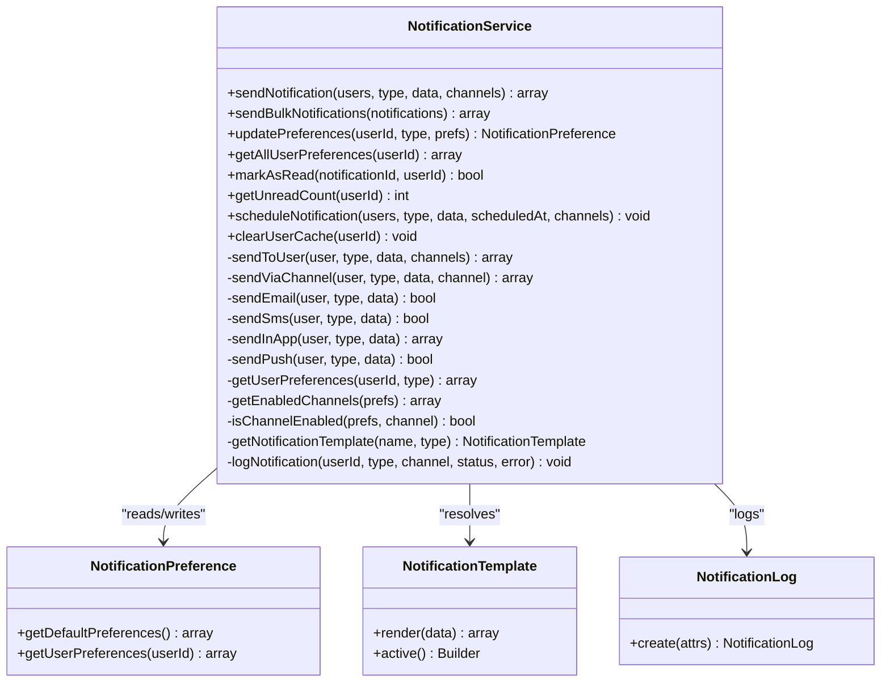
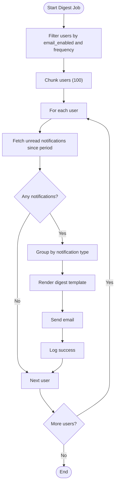
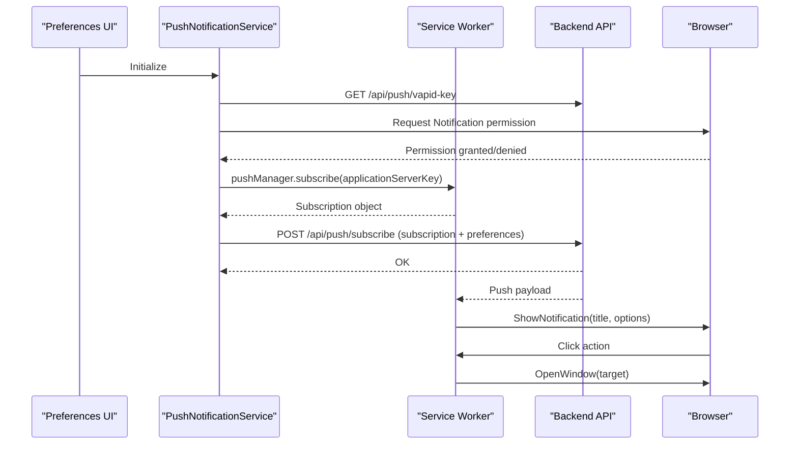
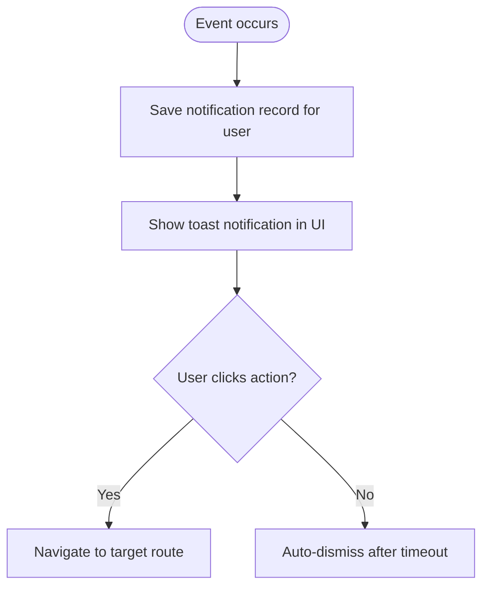
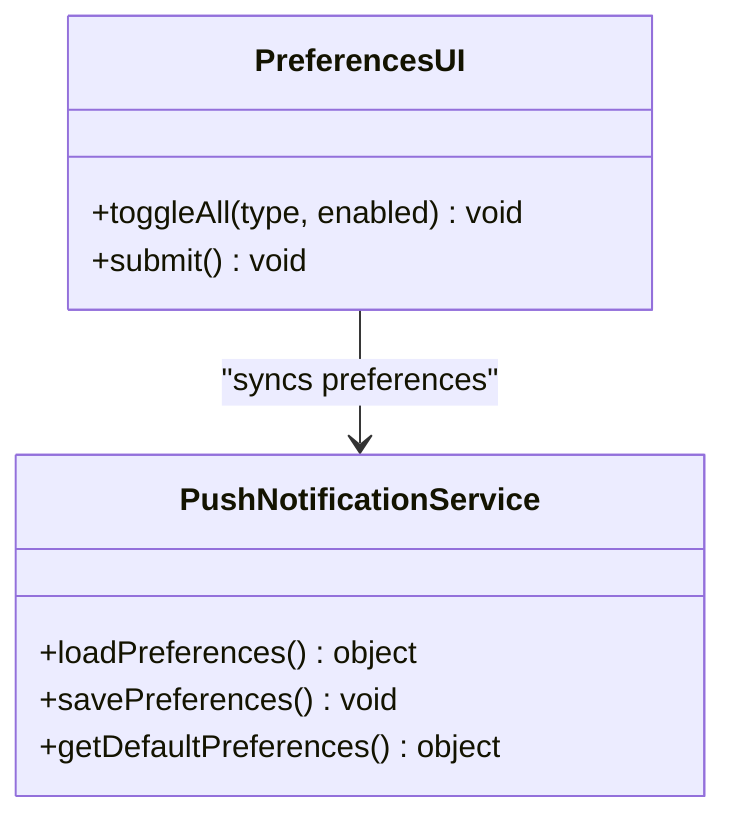
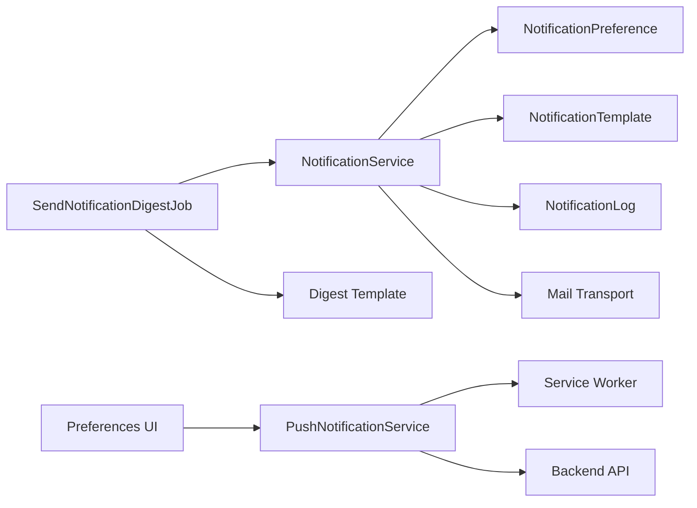

# Notification System

<cite>
**Referenced Files in This Document**
- [NotificationService.php](file://app/Services/NotificationService.php)
- [SendNotificationDigestJob.php](file://app/Jobs/SendNotificationDigestJob.php)
- [SendNotificationDigestsCommand.php](file://app/Console/Commands/SendNotificationDigestsCommand.php)
- [notification-digest.blade.php](file://resources/views/emails/notification-digest.blade.php)
- [PushNotificationService.js](file://resources/js/services/PushNotificationService.js)
- [pwa.js](file://resources/js/pwa.js)
- [sw.js](file://public/sw.js)
- [Preferences.vue](file://resources/js/Pages/Notifications/Preferences.vue)
- [NotificationPreference.php](file://app/Models/NotificationPreference.php)
- [NotificationTemplate.php](file://app/Models/NotificationTemplate.php)
- [NotificationLog.php](file://app/Models/NotificationLog.php)
- [task-09-notification-system-recap.md](file://docs/task-09-notification-system-recap.md)
</cite>

## Table of Contents
1. [Introduction](#introduction)
2. [Project Structure](#project-structure)
3. [Core Components](#core-components)
4. [Architecture Overview](#architecture-overview)
5. [Detailed Component Analysis](#detailed-component-analysis)
6. [Dependency Analysis](#dependency-analysis)
7. [Performance Considerations](#performance-considerations)
8. [Troubleshooting Guide](#troubleshooting-guide)
9. [Conclusion](#conclusion)
10. [Appendices](#appendices)

## Introduction
This document describes the comprehensive notification system that powers real-time push notifications, email digests, in-app alerts, and desktop notifications across the platform. It explains notification types, delivery channels, preference management, subscription handling, and operational workflows. It also covers template rendering, batch processing, retry mechanisms, and integration points with external providers and webhooks.

## Project Structure
The notification system spans backend services, queued jobs, frontend services, and UI components:
- Backend service orchestrates multi-channel delivery and preferences.
- Queued jobs generate and deliver email digests.
- Frontend services manage push subscriptions and in-app toast notifications.
- UI components allow users to manage notification preferences.

**Diagram sources**
- [NotificationService.php:1-386](file://app/Services/NotificationService.php#L1-L386)
- [SendNotificationDigestJob.php:1-156](file://app/Jobs/SendNotificationDigestJob.php#L1-L156)
- [SendNotificationDigestsCommand.php:46-62](file://app/Console/Commands/SendNotificationDigestsCommand.php#L46-L62)
- [PushNotificationService.js:1-415](file://resources/js/services/PushNotificationService.js#L1-L415)
- [pwa.js:119-621](file://resources/js/pwa.js#L119-L621)
- [sw.js:593-648](file://public/sw.js#L593-L648)
- [Preferences.vue:41-174](file://resources/js/Pages/Notifications/Preferences.vue#L41-L174)
- [notification-digest.blade.php:1-263](file://resources/views/emails/notification-digest.blade.php#L1-L263)

**Section sources**
- [NotificationService.php:1-386](file://app/Services/NotificationService.php#L1-L386)
- [SendNotificationDigestJob.php:1-156](file://app/Jobs/SendNotificationDigestJob.php#L1-L156)
- [SendNotificationDigestsCommand.php:46-62](file://app/Console/Commands/SendNotificationDigestsCommand.php#L46-L62)
- [PushNotificationService.js:1-415](file://resources/js/services/PushNotificationService.js#L1-L415)
- [pwa.js:119-621](file://resources/js/pwa.js#L119-L621)
- [sw.js:593-648](file://public/sw.js#L593-L648)
- [Preferences.vue:41-174](file://resources/js/Pages/Notifications/Preferences.vue#L41-L174)
- [notification-digest.blade.php:1-263](file://resources/views/emails/notification-digest.blade.php#L1-L263)

## Core Components
- NotificationService: Central orchestrator for sending notifications across channels (email, SMS, in-app, push), managing preferences, templates, and logging.
- SendNotificationDigestJob: Batch job that compiles unread notifications and sends email digests (daily/weekly) to users who opted in.
- Frontend PushNotificationService: Manages browser push subscriptions, VAPID keys, permission handling, and subscription lifecycle.
- PWA Utilities: Provides in-app toast notifications, network status notifications, and helpers for notification UI.
- Service Worker: Receives push payloads and displays browser notifications with actions.
- Preferences UI: Vue component enabling users to configure per-type channels and frequencies.
- NotificationPreference/Template/Log Models: Persist user preferences, render templates, and track delivery attempts.

**Section sources**
- [NotificationService.php:21-386](file://app/Services/NotificationService.php#L21-L386)
- [SendNotificationDigestJob.php:15-156](file://app/Jobs/SendNotificationDigestJob.php#L15-L156)
- [PushNotificationService.js:6-415](file://resources/js/services/PushNotificationService.js#L6-L415)
- [pwa.js:119-621](file://resources/js/pwa.js#L119-L621)
- [sw.js:593-648](file://public/sw.js#L593-L648)
- [Preferences.vue:41-174](file://resources/js/Pages/Notifications/Preferences.vue#L41-L174)

## Architecture Overview
The system supports four primary channels:
- Email: Rendered templates delivered via the configured mail transport.
- SMS: Placeholder for carrier integration; logs content for audit.
- In-App: Eloquent records stored per user for retrieval and display.
- Push: Web Push via VAPID; service worker displays notifications and handles actions.

**Diagram sources**
- [SendNotificationDigestsCommand.php:46-62](file://app/Console/Commands/SendNotificationDigestsCommand.php#L46-L62)
- [SendNotificationDigestJob.php:35-129](file://app/Jobs/SendNotificationDigestJob.php#L35-L129)
- [NotificationService.php:71-94](file://app/Services/NotificationService.php#L71-L94)
- [notification-digest.blade.php:1-263](file://resources/views/emails/notification-digest.blade.php#L1-L263)

## Detailed Component Analysis

### Backend Notification Orchestration
- Multi-channel routing: Based on user preferences, the service selects enabled channels and dispatches accordingly.
- Template resolution: Templates are resolved by type and name, cached for performance.
- Logging: Every send attempt is logged with status and optional error details.
- Bulk and scheduled operations: Methods support batch sending and future scheduling hooks.

**Diagram sources**
- [NotificationService.php:21-386](file://app/Services/NotificationService.php#L21-L386)
- [NotificationPreference.php](file://app/Models/NotificationPreference.php)
- [NotificationTemplate.php](file://app/Models/NotificationTemplate.php)
- [NotificationLog.php](file://app/Models/NotificationLog.php)

**Section sources**
- [NotificationService.php:34-94](file://app/Services/NotificationService.php#L34-L94)
- [NotificationService.php:102-123](file://app/Services/NotificationService.php#L102-L123)
- [NotificationService.php:128-194](file://app/Services/NotificationService.php#L128-L194)
- [NotificationService.php:199-249](file://app/Services/NotificationService.php#L199-L249)
- [NotificationService.php:254-264](file://app/Services/NotificationService.php#L254-L264)
- [NotificationService.php:269-279](file://app/Services/NotificationService.php#L269-L279)

### Email Digest Delivery
- Frequency-based batching: Daily or weekly digests are generated for users who opted in.
- Chunked processing: Users are processed in chunks to avoid memory pressure.
- Grouping and templating: Notifications are grouped by type and rendered using a Blade template with unsubscribe links.

**Diagram sources**
- [SendNotificationDigestJob.php:62-129](file://app/Jobs/SendNotificationDigestJob.php#L62-L129)
- [notification-digest.blade.php:1-263](file://resources/views/emails/notification-digest.blade.php#L1-L263)

**Section sources**
- [SendNotificationDigestJob.php:26-30](file://app/Jobs/SendNotificationDigestJob.php#L26-L30)
- [SendNotificationDigestJob.php:64-70](file://app/Jobs/SendNotificationDigestJob.php#L64-L70)
- [SendNotificationDigestJob.php:76-129](file://app/Jobs/SendNotificationDigestJob.php#L76-L129)
- [SendNotificationDigestsCommand.php:46-62](file://app/Console/Commands/SendNotificationDigestsCommand.php#L46-L62)

### Push Notifications (Browser/Web)
- VAPID key management: Frontend loads the VAPID public key from the backend.
- Subscription lifecycle: Request permission, subscribe via PushManager, persist subscription, and verify with server.
- Service worker: Receives push events, displays notifications with actions, and opens appropriate URLs.
- Preference management: Local storage persists per-category preferences and quiet hours.

**Diagram sources**
- [PushNotificationService.js:25-47](file://resources/js/services/PushNotificationService.js#L25-L47)
- [PushNotificationService.js:49-67](file://resources/js/services/PushNotificationService.js#L49-L67)
- [PushNotificationService.js:131-162](file://resources/js/services/PushNotificationService.js#L131-L162)
- [PushNotificationService.js:189-201](file://resources/js/services/PushNotificationService.js#L189-L201)
- [sw.js:617-626](file://public/sw.js#L617-L626)
- [sw.js:629-646](file://public/sw.js#L629-L646)

**Section sources**
- [PushNotificationService.js:6-47](file://resources/js/services/PushNotificationService.js#L6-L47)
- [PushNotificationService.js:131-162](file://resources/js/services/PushNotificationService.js#L131-L162)
- [PushNotificationService.js:189-201](file://resources/js/services/PushNotificationService.js#L189-L201)
- [pwa.js:128-160](file://resources/js/pwa.js#L128-L160)
- [sw.js:593-648](file://public/sw.js#L593-L648)

### In-App Alerts and Toast Notifications
- In-App: Stored as user notifications for retrieval and read/unread state.
- Toasts: Lightweight, non-intrusive notifications displayed in the UI with colors and actions.

**Diagram sources**
- [NotificationService.php:168-180](file://app/Services/NotificationService.php#L168-L180)
- [pwa.js:463-470](file://resources/js/pwa.js#L463-L470)
- [pwa.js:491-502](file://resources/js/pwa.js#L491-L502)

**Section sources**
- [NotificationService.php:168-180](file://app/Services/NotificationService.php#L168-L180)
- [pwa.js:385-415](file://resources/js/pwa.js#L385-L415)
- [pwa.js:463-502](file://resources/js/pwa.js#L463-L502)

### Notification Preferences and Opt-Out
- Per-type channel toggles: Email, SMS, In-App, Push.
- Frequency settings: Immediate, hourly, daily digests.
- Quiet hours: Do-not-disturb windows with emergency overrides.
- Opt-out: Preferences UI allows enabling/disabling channels; digest template includes unsubscribe links.

**Diagram sources**
- [Preferences.vue:41-174](file://resources/js/Pages/Notifications/Preferences.vue#L41-L174)
- [PushNotificationService.js:314-347](file://resources/js/services/PushNotificationService.js#L314-L347)

**Section sources**
- [Preferences.vue:41-174](file://resources/js/Pages/Notifications/Preferences.vue#L41-L174)
- [PushNotificationService.js:314-347](file://resources/js/services/PushNotificationService.js#L314-L347)
- [notification-digest.blade.php:244-260](file://resources/views/emails/notification-digest.blade.php#L244-L260)

### Notification Types and Workflows
- Message notifications: In-app and push for new messages.
- System alerts: Maintenance, updates, and platform-wide announcements.
- Achievement celebrations: In-app and email for milestones.
- Connection requests: In-app and email for connection invitations.
- Administrative updates: In-app and email for policy or account changes.

These workflows are driven by event listeners and job dispatches, with templates and preferences governing delivery.

**Section sources**
- [task-09-notification-system-recap.md:279-319](file://docs/task-09-notification-system-recap.md#L279-L319)

## Dependency Analysis
- NotificationService depends on:
  - NotificationPreference for user preferences and defaults.
  - NotificationTemplate for content rendering.
  - NotificationLog for audit trails.
  - Mail transport for email delivery.
- Digest job depends on:
  - NotificationService for user preference checks.
  - Blade template for digest rendering.
- Frontend services depend on:
  - Service worker for push handling.
  - Backend API for VAPID key and subscription management.

**Diagram sources**
- [NotificationService.php:6-13](file://app/Services/NotificationService.php#L6-L13)
- [SendNotificationDigestJob.php:6-13](file://app/Jobs/SendNotificationDigestJob.php#L6-L13)
- [PushNotificationService.js:1-15](file://resources/js/services/PushNotificationService.js#L1-L15)
- [Preferences.vue:41-174](file://resources/js/Pages/Notifications/Preferences.vue#L41-L174)

**Section sources**
- [NotificationService.php:6-13](file://app/Services/NotificationService.php#L6-L13)
- [SendNotificationDigestJob.php:6-13](file://app/Jobs/SendNotificationDigestJob.php#L6-L13)
- [PushNotificationService.js:1-15](file://resources/js/services/PushNotificationService.js#L1-L15)

## Performance Considerations
- Caching: Preferences and templates are cached to reduce database and template resolution overhead.
- Chunked processing: Digest job processes users in chunks to control memory and runtime.
- Asynchronous delivery: Jobs offload heavy work (email sending) from request threads.
- Template rendering: Blade templates are used for efficient HTML generation.

[No sources needed since this section provides general guidance]

## Troubleshooting Guide
- Push subscription failures:
  - Verify browser support and permission status.
  - Confirm VAPID key availability and network connectivity.
  - Check service worker registration and subscription persistence.
- Email digest not received:
  - Ensure user has email enabled and selected frequency.
  - Review job logs for exceptions during template rendering or mail transport errors.
- In-app notifications missing:
  - Confirm notification records exist for the user.
  - Check read/unread state and retrieval logic.
- Retry mechanisms:
  - Use queue retry policies for transient failures.
  - Implement idempotent operations for reprocessing.

**Section sources**
- [PushNotificationService.js:131-162](file://resources/js/services/PushNotificationService.js#L131-L162)
- [SendNotificationDigestJob.php:48-56](file://app/Jobs/SendNotificationDigestJob.php#L48-L56)
- [NotificationService.php:113-123](file://app/Services/NotificationService.php#L113-L123)

## Conclusion
The notification system provides a robust, extensible foundation for multi-channel communications. It integrates user preferences, batch processing, and real-time delivery while maintaining auditability and scalability. The documented workflows, preferences, and troubleshooting steps enable administrators and developers to maintain reliable, user-centric notifications.

[No sources needed since this section summarizes without analyzing specific files]

## Appendices

### Notification Channels and Capabilities
- Email: HTML templates, personalization, unsubscribe links.
- SMS: Text-based alerts with carrier integration hooks.
- In-App: Persistent records with read/unread state and retrieval.
- Push: Web Push with VAPID, service worker actions, and browser permissions.

**Section sources**
- [NotificationService.php:128-194](file://app/Services/NotificationService.php#L128-L194)
- [notification-digest.blade.php:1-263](file://resources/views/emails/notification-digest.blade.php#L1-L263)

### Priority Queuing and Retry
- Jobs are enqueued for digest delivery; queue workers process them asynchronously.
- Retry policies can be configured at the queue level for transient failures.
- Idempotency: Prefer idempotent handlers to safely reprocess failed deliveries.

**Section sources**
- [SendNotificationDigestJob.php:15-57](file://app/Jobs/SendNotificationDigestJob.php#L15-L57)

### Webhook Delivery
- Integration examples demonstrate webhook registration and push notification delivery patterns suitable for third-party systems.

**Section sources**
- [task-09-notification-system-recap.md:467-484](file://docs/task-09-notification-system-recap.md#L467-L484)