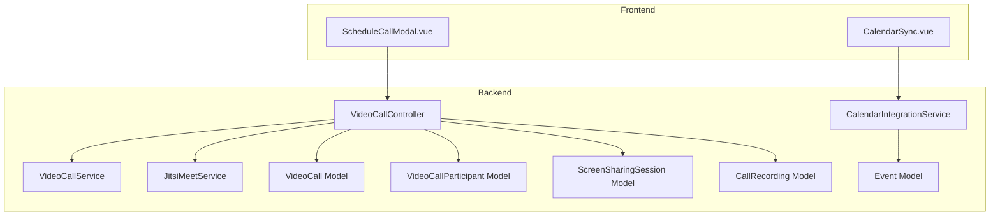
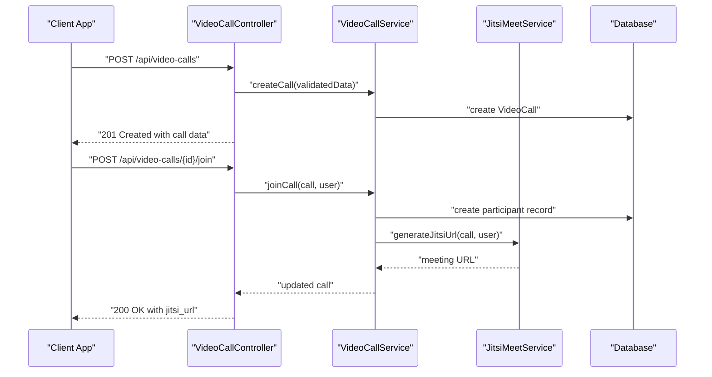
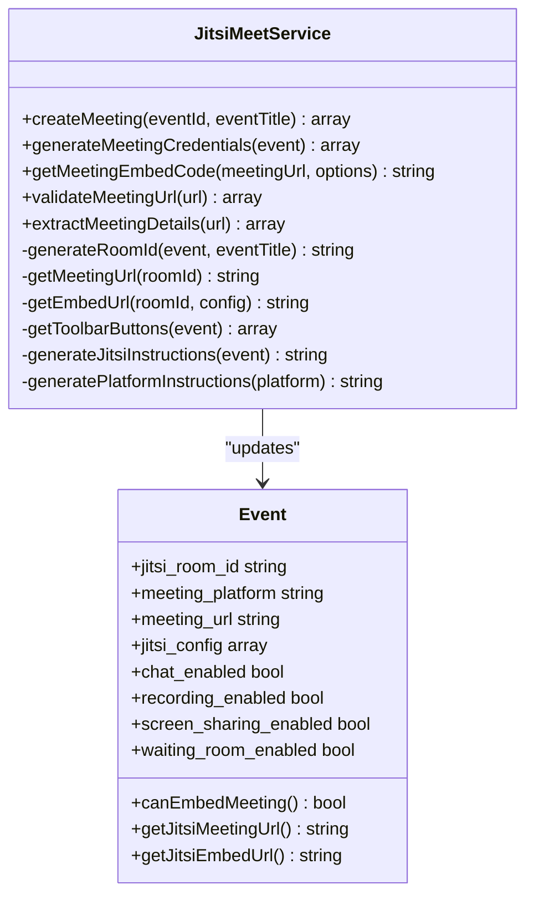
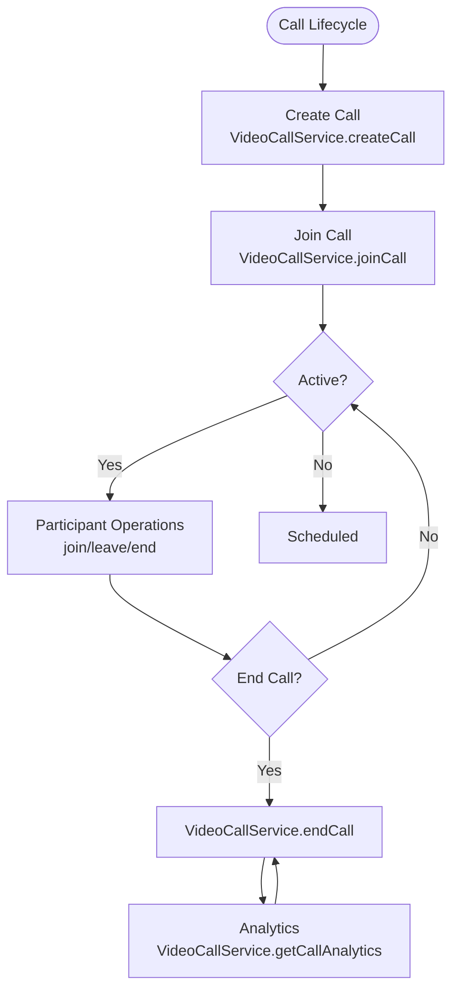
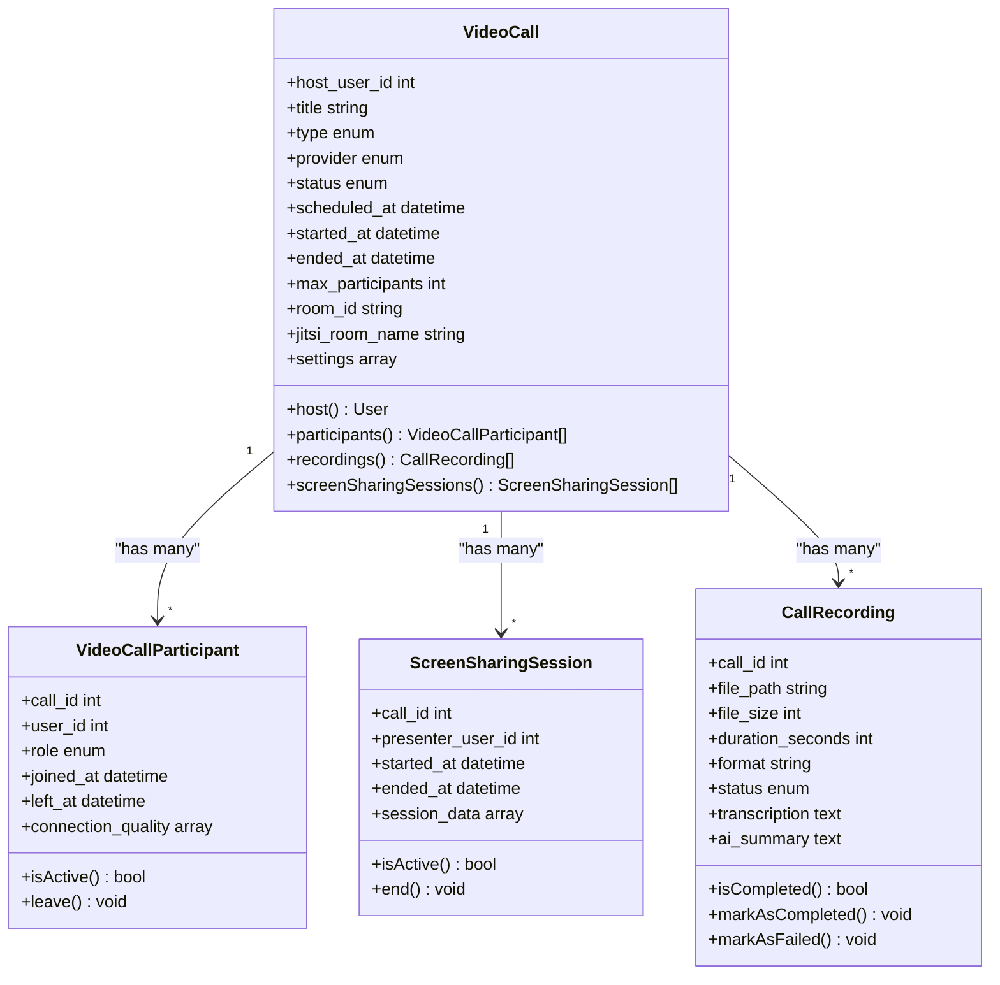
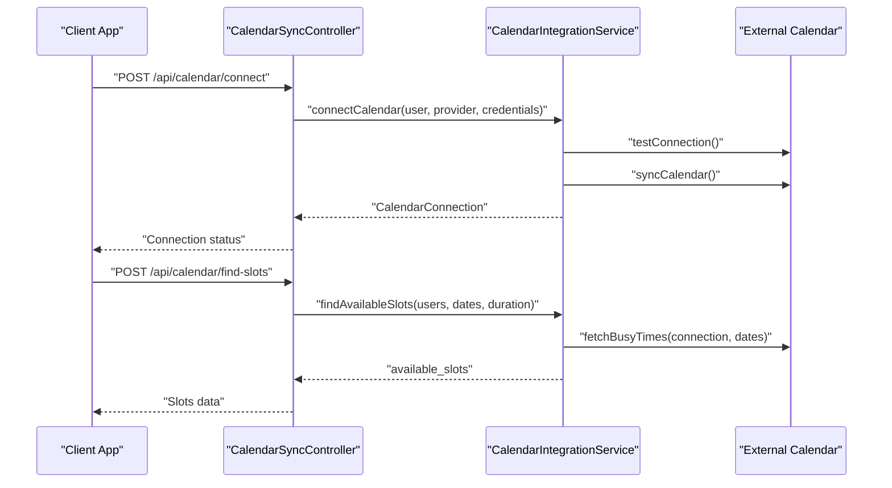
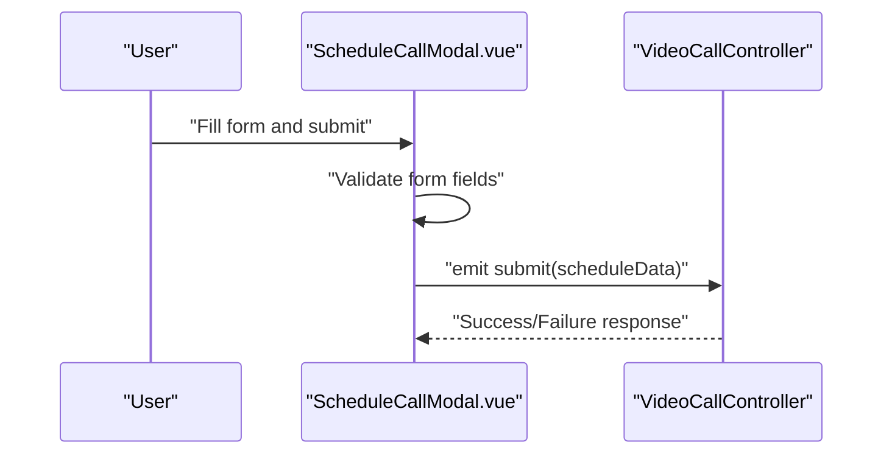
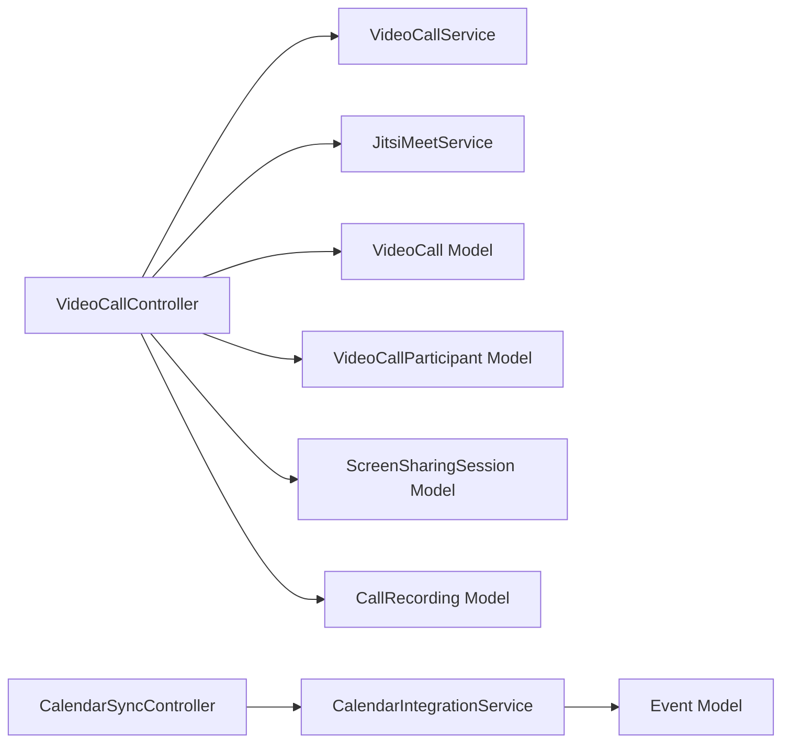

# Video Calling & Meetings

<cite>
**Referenced Files in This Document**
- [JitsiMeetService.php](file://app/Services/JitsiMeetService.php)
- [VideoCallService.php](file://app/Services/VideoCallService.php)
- [VideoCall.php](file://app/Models/VideoCall.php)
- [VideoCallParticipant.php](file://app/Models/VideoCallParticipant.php)
- [ScreenSharingSession.php](file://app/Models/ScreenSharingSession.php)
- [CallRecording.php](file://app/Models/CallRecording.php)
- [VideoCallController.php](file://app/Http/Controllers/Api/VideoCallController.php)
- [CalendarIntegrationService.php](file://app/Services/CalendarIntegrationService.php)
- [CalendarSyncController.php](file://app/Http/Controllers/Api/CalendarSyncController.php)
- [Event.php](file://app/Models/Event.php)
- [ScheduleCallModal.vue](file://resources/js/components/VideoCall/ScheduleCallModal.vue)
- [CalendarSync.vue](file://resources/js/components/Calendar/CalendarSync.vue)
- [video-calling-implementation.md](file://docs/video-calling-implementation.md)
</cite>

## Table of Contents
1. [Introduction](#introduction)
2. [Project Structure](#project-structure)
3. [Core Components](#core-components)
4. [Architecture Overview](#architecture-overview)
5. [Detailed Component Analysis](#detailed-component-analysis)
6. [Dependency Analysis](#dependency-analysis)
7. [Performance Considerations](#performance-considerations)
8. [Troubleshooting Guide](#troubleshooting-guide)
9. [Conclusion](#conclusion)
10. [Appendices](#appendices)

## Introduction
This document describes the video calling and meeting system built on Jitsi Meet with integrated calendar scheduling, meeting room management, participant controls, and advanced features such as screen sharing, recording, and analytics. It covers call lifecycle management, room configuration, participant moderation, and integration with external calendar systems for scheduling and notifications.

## Project Structure
The video calling system is implemented as a cohesive set of Laravel backend services, Eloquent models, controllers, and Vue.js frontend components. Supporting calendar integration enables scheduling, availability checks, and automated invitations.

**Diagram sources**
- [VideoCallController.php:12-276](file://app/Http/Controllers/Api/VideoCallController.php#L12-L276)
- [VideoCallService.php:9-112](file://app/Services/VideoCallService.php#L9-L112)
- [JitsiMeetService.php:8-345](file://app/Services/JitsiMeetService.php#L8-L345)
- [CalendarIntegrationService.php:16-800](file://app/Services/CalendarIntegrationService.php#L16-L800)
- [Event.php:12-633](file://app/Models/Event.php#L12-L633)
- [VideoCall.php:10-126](file://app/Models/VideoCall.php#L10-L126)
- [VideoCallParticipant.php:8-66](file://app/Models/VideoCallParticipant.php#L8-L66)
- [ScreenSharingSession.php:8-65](file://app/Models/ScreenSharingSession.php#L8-L65)
- [CallRecording.php:8-94](file://app/Models/CallRecording.php#L8-L94)
- [ScheduleCallModal.vue:161-236](file://resources/js/components/VideoCall/ScheduleCallModal.vue#L161-L236)
- [CalendarSync.vue:1-34](file://resources/js/components/Calendar/CalendarSync.vue#L1-L34)

**Section sources**
- [VideoCallController.php:12-276](file://app/Http/Controllers/Api/VideoCallController.php#L12-L276)
- [VideoCallService.php:9-112](file://app/Services/VideoCallService.php#L9-L112)
- [JitsiMeetService.php:8-345](file://app/Services/JitsiMeetService.php#L8-L345)
- [CalendarIntegrationService.php:16-800](file://app/Services/CalendarIntegrationService.php#L16-L800)
- [Event.php:12-633](file://app/Models/Event.php#L12-L633)
- [VideoCall.php:10-126](file://app/Models/VideoCall.php#L10-L126)
- [VideoCallParticipant.php:8-66](file://app/Models/VideoCallParticipant.php#L8-L66)
- [ScreenSharingSession.php:8-65](file://app/Models/ScreenSharingSession.php#L8-L65)
- [CallRecording.php:8-94](file://app/Models/CallRecording.php#L8-L94)
- [ScheduleCallModal.vue:161-236](file://resources/js/components/VideoCall/ScheduleCallModal.vue#L161-L236)
- [CalendarSync.vue:1-34](file://resources/js/components/Calendar/CalendarSync.vue#L1-L34)

## Core Components
- JitsiMeetService: Creates rooms, generates meeting URLs, validates external meeting links, and builds embed configurations.
- VideoCallService: Manages call lifecycle, participant joins/leaves/ends, and analytics aggregation.
- VideoCall/Participant/ScreenSharingSession/CallRecording Models: Define data structures and relationships for calls, participants, screen sharing sessions, and recordings.
- VideoCallController: API endpoints for listing, creating, joining, leaving, ending calls, and retrieving analytics.
- CalendarIntegrationService/CalendarSyncController: Calendar connections, event sync, availability calculation, slot finding, mentorship scheduling, and email invitations.
- Event Model: Supports virtual meeting metadata, Jitsi room generation, embedding, and meeting credentials.
- Frontend Components: Schedule modal and calendar sync UI components.

**Section sources**
- [JitsiMeetService.php:23-89](file://app/Services/JitsiMeetService.php#L23-L89)
- [VideoCallService.php:11-82](file://app/Services/VideoCallService.php#L11-L82)
- [VideoCall.php:12-125](file://app/Models/VideoCall.php#L12-L125)
- [VideoCallParticipant.php:10-64](file://app/Models/VideoCallParticipant.php#L10-L64)
- [ScreenSharingSession.php:10-64](file://app/Models/ScreenSharingSession.php#L10-L64)
- [CallRecording.php:10-93](file://app/Models/CallRecording.php#L10-L93)
- [VideoCallController.php:21-274](file://app/Http/Controllers/Api/VideoCallController.php#L21-L274)
- [CalendarIntegrationService.php:33-112](file://app/Services/CalendarIntegrationService.php#L33-L112)
- [CalendarSyncController.php:24-351](file://app/Http/Controllers/Api/CalendarSyncController.php#L24-L351)
- [Event.php:377-440](file://app/Models/Event.php#L377-L440)

## Architecture Overview
The system integrates Jitsi Meet for secure video conferencing, with Laravel backend services orchestrating call lifecycle and room configuration. Calendar integration enables scheduling and availability management. Frontend components provide scheduling and calendar sync UI.

**Diagram sources**
- [VideoCallController.php:56-108](file://app/Http/Controllers/Api/VideoCallController.php#L56-L108)
- [VideoCallService.php:11-43](file://app/Services/VideoCallService.php#L11-L43)
- [JitsiMeetService.php:30-42](file://app/Services/JitsiMeetService.php#L30-L42)

**Section sources**
- [VideoCallController.php:56-108](file://app/Http/Controllers/Api/VideoCallController.php#L56-L108)
- [VideoCallService.php:11-43](file://app/Services/VideoCallService.php#L11-L43)
- [JitsiMeetService.php:30-42](file://app/Services/JitsiMeetService.php#L30-L42)

## Detailed Component Analysis

### Jitsi Meet Integration
- Room creation and configuration: Generates unique room identifiers, sets Jitsi defaults, and stores meeting metadata on the Event model.
- Meeting URL validation and extraction: Validates URLs from Zoom, Teams, Google Meet, WebEx, and Jitsi; extracts platform-specific details.
- Embed generation: Builds iframe embed code with allowed attributes and fullscreen options.
- Toolbar customization: Enables/disables features like chat, recording, and screen sharing based on event settings.
- Instructions: Provides platform-specific joining instructions.

**Diagram sources**
- [JitsiMeetService.php:23-89](file://app/Services/JitsiMeetService.php#L23-L89)
- [Event.php:377-440](file://app/Models/Event.php#L377-L440)

**Section sources**
- [JitsiMeetService.php:23-89](file://app/Services/JitsiMeetService.php#L23-L89)
- [Event.php:377-440](file://app/Models/Event.php#L377-L440)

### Call Lifecycle and Participant Controls
- Call creation: Host schedules a call with type, provider, and settings; Jitsi room name is generated.
- Join/leave/end: Adds/removes participants, transitions call status, and ends call when host leaves or no participants remain.
- Analytics: Aggregates duration, participant counts, recordings, and screen sharing sessions.

**Diagram sources**
- [VideoCallService.php:11-82](file://app/Services/VideoCallService.php#L11-L82)
- [VideoCallController.php:175-252](file://app/Http/Controllers/Api/VideoCallController.php#L175-L252)

**Section sources**
- [VideoCallService.php:11-82](file://app/Services/VideoCallService.php#L11-L82)
- [VideoCallController.php:175-252](file://app/Http/Controllers/Api/VideoCallController.php#L175-L252)

### Meeting Room Management and Controls
- Room configuration: Provider selection (Jitsi, Jitsi Videobridge, LiveKit), settings persistence, and room ID generation.
- Access control: Host/moderator roles, participant presence tracking, and connection quality metrics.
- Screen sharing: Tracks presenter, start/end times, and session data.
- Recordings: Stores file metadata, duration, format, status, and human-readable sizes/durations.

**Diagram sources**
- [VideoCall.php:12-125](file://app/Models/VideoCall.php#L12-L125)
- [VideoCallParticipant.php:10-64](file://app/Models/VideoCallParticipant.php#L10-L64)
- [ScreenSharingSession.php:10-64](file://app/Models/ScreenSharingSession.php#L10-L64)
- [CallRecording.php:10-93](file://app/Models/CallRecording.php#L10-L93)

**Section sources**
- [VideoCall.php:12-125](file://app/Models/VideoCall.php#L12-L125)
- [VideoCallParticipant.php:10-64](file://app/Models/VideoCallParticipant.php#L10-L64)
- [ScreenSharingSession.php:10-64](file://app/Models/ScreenSharingSession.php#L10-L64)
- [CallRecording.php:10-93](file://app/Models/CallRecording.php#L10-L93)

### Calendar Integration and Scheduling
- Calendar connections: Supports Google, Outlook, Apple, and CalDAV with connection testing and token refresh.
- Event synchronization: Bidirectional sync, external calendar creation, and email invitations.
- Availability and slot finding: Computes busy times, merges overlaps, and finds available windows within working hours.
- Mentorship scheduling: Creates mentorship sessions with associated calendar events and meeting URLs.

**Diagram sources**
- [CalendarSyncController.php:38-193](file://app/Http/Controllers/Api/CalendarSyncController.php#L38-L193)
- [CalendarIntegrationService.php:33-112](file://app/Services/CalendarIntegrationService.php#L33-L112)
- [CalendarIntegrationService.php:257-375](file://app/Services/CalendarIntegrationService.php#L257-L375)

**Section sources**
- [CalendarSyncController.php:38-193](file://app/Http/Controllers/Api/CalendarSyncController.php#L38-L193)
- [CalendarIntegrationService.php:33-112](file://app/Services/CalendarIntegrationService.php#L33-L112)
- [CalendarIntegrationService.php:257-375](file://app/Services/CalendarIntegrationService.php#L257-L375)

### Frontend Components and User Flows
- Schedule Call Modal: Collects scheduling inputs (title, date/time, duration, type, agenda, timezone, reminder) and emits submission data.
- Calendar Sync UI: Allows refreshing connections and managing calendar integrations.

**Diagram sources**
- [ScheduleCallModal.vue:212-236](file://resources/js/components/VideoCall/ScheduleCallModal.vue#L212-L236)
- [VideoCallController.php:56-77](file://app/Http/Controllers/Api/VideoCallController.php#L56-L77)

**Section sources**
- [ScheduleCallModal.vue:161-236](file://resources/js/components/VideoCall/ScheduleCallModal.vue#L161-L236)
- [CalendarSync.vue:1-34](file://resources/js/components/Calendar/CalendarSync.vue#L1-L34)

## Dependency Analysis
- Controllers depend on services for business logic and on models for persistence.
- Services encapsulate provider-specific logic (Jitsi, calendar) and call management.
- Models define relationships and scopes for querying and filtering.
- Frontend components communicate with controllers via API endpoints.

**Diagram sources**
- [VideoCallController.php:14-16](file://app/Http/Controllers/Api/VideoCallController.php#L14-L16)
- [VideoCallService.php:9-11](file://app/Services/VideoCallService.php#L9-L11)
- [JitsiMeetService.php:8-18](file://app/Services/JitsiMeetService.php#L8-L18)
- [CalendarIntegrationService.php:16-28](file://app/Services/CalendarIntegrationService.php#L16-L28)
- [CalendarSyncController.php:17-19](file://app/Http/Controllers/Api/CalendarSyncController.php#L17-L19)

**Section sources**
- [VideoCallController.php:14-16](file://app/Http/Controllers/Api/VideoCallController.php#L14-L16)
- [VideoCallService.php:9-11](file://app/Services/VideoCallService.php#L9-L11)
- [JitsiMeetService.php:8-18](file://app/Services/JitsiMeetService.php#L8-L18)
- [CalendarIntegrationService.php:16-28](file://app/Services/CalendarIntegrationService.php#L16-L28)
- [CalendarSyncController.php:17-19](file://app/Http/Controllers/Api/CalendarSyncController.php#L17-L19)

## Performance Considerations
- Use pagination for listing calls and events to limit payload sizes.
- Cache busy times for calendar availability to reduce external API calls.
- Minimize database queries by eager-loading relationships (host, participants, recordings).
- For large meetings, prefer Jitsi Videobridge provider with bitrate and capacity calculations.
- Offload heavy tasks (recording post-processing, transcription) to background jobs.

## Troubleshooting Guide
Common issues and resolutions:
- Invalid meeting URL: The URL validator returns an error when format does not match supported platforms. Verify URL format and platform.
- Access denied to call: Ensure the user is the host or a registered participant; otherwise, API returns 403.
- Cannot delete active call: Active calls cannot be deleted; end the call first.
- Calendar sync failures: Review sync status and error logs; re-test connection and refresh tokens.
- Connection quality: Use participant connection_quality metrics to diagnose issues; adjust video bitrate or network conditions.

**Section sources**
- [JitsiMeetService.php:124-189](file://app/Services/JitsiMeetService.php#L124-L189)
- [VideoCallController.php:86-92](file://app/Http/Controllers/Api/VideoCallController.php#L86-L92)
- [VideoCallController.php:150-163](file://app/Http/Controllers/Api/VideoCallController.php#L150-L163)
- [CalendarSyncController.php:94-111](file://app/Http/Controllers/Api/CalendarSyncController.php#L94-L111)

## Conclusion
The video calling and meeting system provides a robust foundation for secure, scalable video conferencing with Jitsi Meet, comprehensive participant controls, and integrated calendar scheduling. The modular architecture supports future enhancements such as advanced analytics, AI features, and expanded provider integrations.

## Appendices

### API Endpoints Summary
- Video calls: list, create, show, update, delete, join, leave, end, analytics.
- Calendar: connect, disconnect, sync, availability, find slots, create event, schedule mentorship, send invites, sync status.

**Section sources**
- [VideoCallController.php:21-274](file://app/Http/Controllers/Api/VideoCallController.php#L21-L274)
- [CalendarSyncController.php:24-351](file://app/Http/Controllers/Api/CalendarSyncController.php#L24-L351)

### Database Schema Highlights
- video_calls: call metadata, provider, status, timestamps, room identifiers.
- video_call_participants: participant roles, join/leave timestamps, connection quality.
- screen_sharing_sessions: presenter, start/end times, session data.
- call_recordings: file metadata, duration, format, status, transcription, AI summary.
- events: virtual meeting fields, Jitsi room info, meeting credentials, embedding options.

**Section sources**
- [VideoCall.php:12-125](file://app/Models/VideoCall.php#L12-L125)
- [VideoCallParticipant.php:10-64](file://app/Models/VideoCallParticipant.php#L10-L64)
- [ScreenSharingSession.php:10-64](file://app/Models/ScreenSharingSession.php#L10-L64)
- [CallRecording.php:10-93](file://app/Models/CallRecording.php#L10-L93)
- [Event.php:16-121](file://app/Models/Event.php#L16-L121)