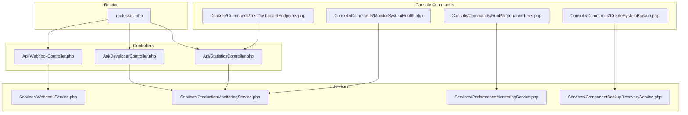
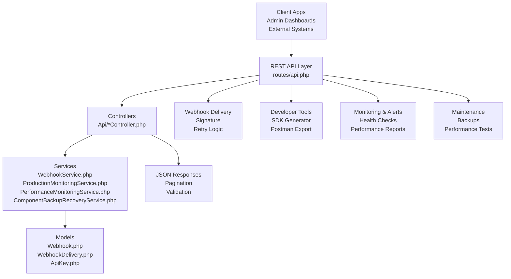
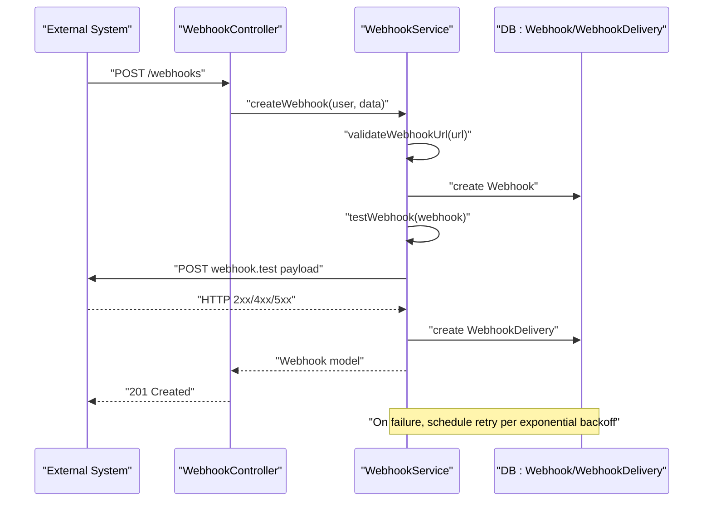
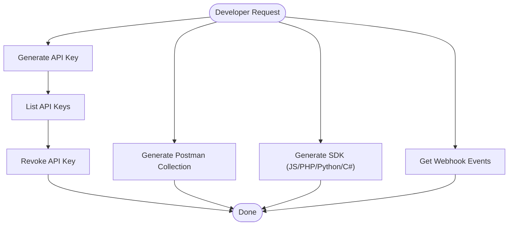
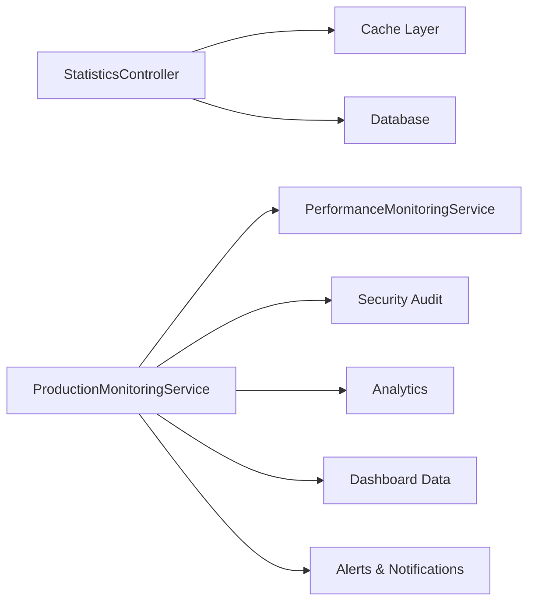
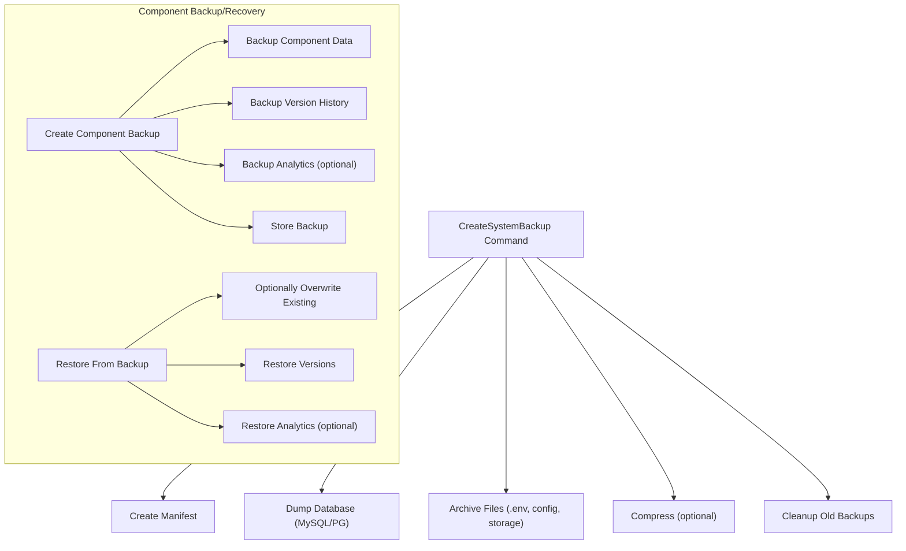
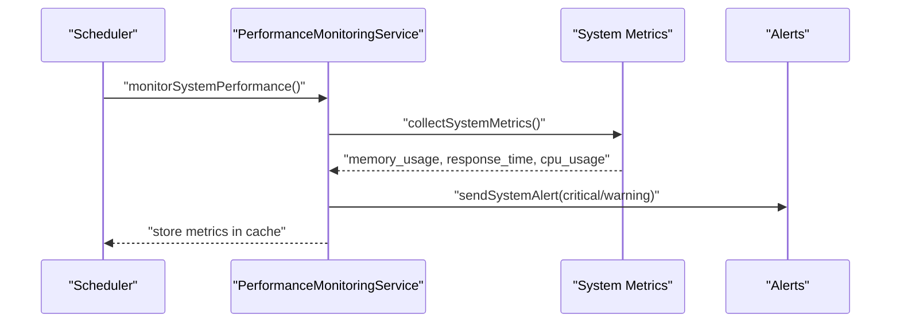
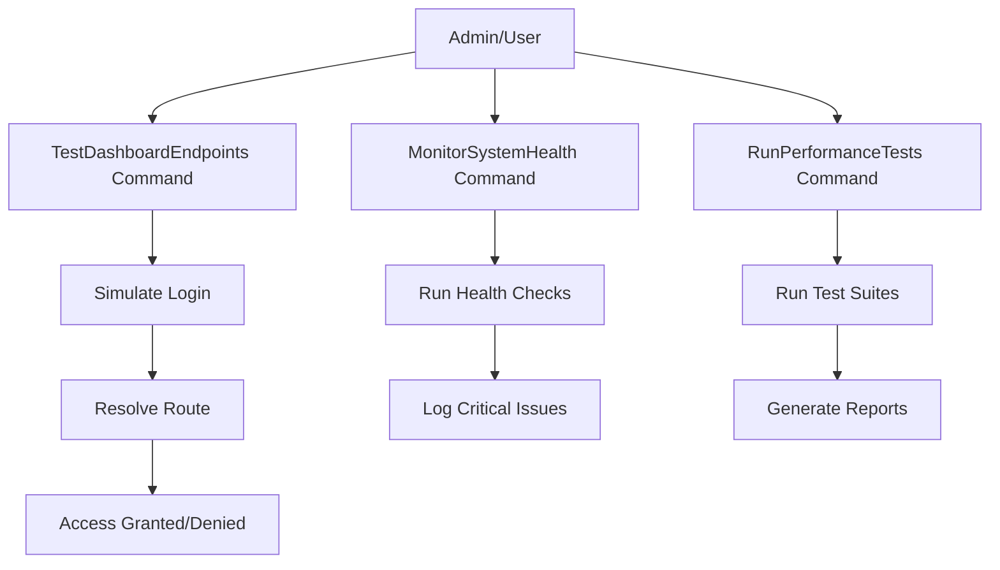
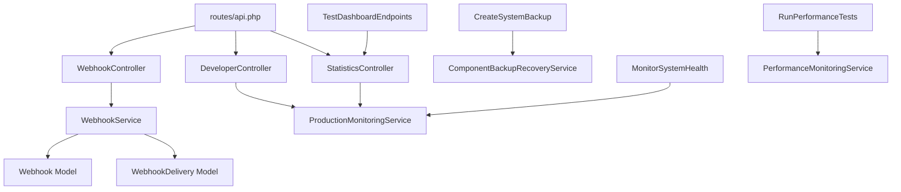

# Developer & Admin Tools

<cite>
**Referenced Files in This Document**
- [api.php](file://routes/api.php)
- [WebhookService.php](file://app/Services/WebhookService.php)
- [WebhookController.php](file://app/Http/Controllers/Api/WebhookController.php)
- [DeveloperController.php](file://app/Http/Controllers/Api/DeveloperController.php)
- [StatisticsController.php](file://app/Http/Controllers/Api/StatisticsController.php)
- [ProductionMonitoringService.php](file://app/Services/ProductionMonitoringService.php)
- [PerformanceMonitoringService.php](file://app/Services/PerformanceMonitoringService.php)
- [CreateSystemBackup.php](file://app/Console/Commands/CreateSystemBackup.php)
- [ComponentBackupRecoveryService.php](file://app/Services/ComponentBackupRecoveryService.php)
- [TestDashboardEndpoints.php](file://app/Console/Commands/TestDashboardEndpoints.php)
- [MonitorSystemHealth.php](file://app/Console/Commands/MonitorSystemHealth.php)
- [RunPerformanceTests.php](file://app/Console/Commands/RunPerformanceTests.php)
</cite>

## Table of Contents
1. [Introduction](#introduction)
2. [Project Structure](#project-structure)
3. [Core Components](#core-components)
4. [Architecture Overview](#architecture-overview)
5. [Detailed Component Analysis](#detailed-component-analysis)
6. [Dependency Analysis](#dependency-analysis)
7. [Performance Considerations](#performance-considerations)
8. [Troubleshooting Guide](#troubleshooting-guide)
9. [Conclusion](#conclusion)

## Introduction
This document provides comprehensive developer and administrative tools documentation for the Alumate platform. It covers:
- REST API endpoints organized by functional domains
- Real-time webhook support with delivery management and security
- Developer tools including API key management, SDK generation, and Postman collections
- Administrative dashboards and monitoring with system insights
- Backup and recovery mechanisms for data protection
- Performance monitoring and testing utilities
- Integration capabilities with external systems

## Project Structure
The developer and admin tooling spans routing, controllers, services, and console commands:
- Routes define API endpoints grouped by domain (statistics, webhooks, developer tools, CRM integrations, etc.)
- Controllers orchestrate requests and delegate to services
- Services encapsulate business logic for webhooks, monitoring, performance, and backup/recovery
- Console commands automate system maintenance, health checks, and performance testing

**Diagram sources**
- [api.php:1-800](file://routes/api.php#L1-L800)
- [WebhookController.php:1-264](file://app/Http/Controllers/Api/WebhookController.php#L1-L264)
- [DeveloperController.php:1-454](file://app/Http/Controllers/Api/DeveloperController.php#L1-L454)
- [StatisticsController.php:1-309](file://app/Http/Controllers/Api/StatisticsController.php#L1-L309)
- [WebhookService.php:1-517](file://app/Services/WebhookService.php#L1-L517)
- [ProductionMonitoringService.php:1-795](file://app/Services/ProductionMonitoringService.php#L1-L795)
- [PerformanceMonitoringService.php:1-433](file://app/Services/PerformanceMonitoringService.php#L1-L433)
- [ComponentBackupRecoveryService.php:1-633](file://app/Services/ComponentBackupRecoveryService.php#L1-L633)
- [CreateSystemBackup.php:1-272](file://app/Console/Commands/CreateSystemBackup.php#L1-L272)
- [MonitorSystemHealth.php:1-406](file://app/Console/Commands/MonitorSystemHealth.php#L1-L406)
- [RunPerformanceTests.php:1-497](file://app/Console/Commands/RunPerformanceTests.php#L1-L497)
- [TestDashboardEndpoints.php:1-85](file://app/Console/Commands/TestDashboardEndpoints.php#L1-L85)

**Section sources**
- [api.php:1-800](file://routes/api.php#L1-L800)

## Core Components
- REST API: Comprehensive endpoints for posts, notifications, alumni directory, events, fundraising, mentorship, skills, messaging, video calls, training, and more
- Webhook System: Full lifecycle for managing webhooks, including creation, validation, testing, delivery, retries, statistics, and pause/resume
- Developer Tools: API key management, webhook event catalog, SDK generation (JavaScript/PHP/Python/C#), and Postman collection export
- Monitoring & Analytics: System health checks, performance monitoring, security auditing, and production dashboard aggregation
- Backup & Recovery: Automated system backups, component-level backup/recovery, verification, and cleanup policies
- Administrative Utilities: Health checks, performance tests, and dashboard endpoint validation

**Section sources**
- [api.php:26-800](file://routes/api.php#L26-L800)
- [WebhookService.php:1-517](file://app/Services/WebhookService.php#L1-L517)
- [WebhookController.php:1-264](file://app/Http/Controllers/Api/WebhookController.php#L1-L264)
- [DeveloperController.php:1-454](file://app/Http/Controllers/Api/DeveloperController.php#L1-L454)
- [StatisticsController.php:1-309](file://app/Http/Controllers/Api/StatisticsController.php#L1-L309)
- [ProductionMonitoringService.php:1-795](file://app/Services/ProductionMonitoringService.php#L1-L795)
- [PerformanceMonitoringService.php:1-433](file://app/Services/PerformanceMonitoringService.php#L1-L433)
- [CreateSystemBackup.php:1-272](file://app/Console/Commands/CreateSystemBackup.php#L1-L272)
- [ComponentBackupRecoveryService.php:1-633](file://app/Services/ComponentBackupRecoveryService.php#L1-L633)
- [MonitorSystemHealth.php:1-406](file://app/Console/Commands/MonitorSystemHealth.php#L1-L406)
- [RunPerformanceTests.php:1-497](file://app/Console/Commands/RunPerformanceTests.php#L1-L497)
- [TestDashboardEndpoints.php:1-85](file://app/Console/Commands/TestDashboardEndpoints.php#L1-L85)

## Architecture Overview
The system integrates REST APIs, webhook delivery, monitoring, and maintenance utilities into a cohesive developer and admin toolkit.

**Diagram sources**
- [api.php:1-800](file://routes/api.php#L1-L800)
- [WebhookService.php:1-517](file://app/Services/WebhookService.php#L1-L517)
- [ProductionMonitoringService.php:1-795](file://app/Services/ProductionMonitoringService.php#L1-L795)
- [PerformanceMonitoringService.php:1-433](file://app/Services/PerformanceMonitoringService.php#L1-L433)
- [ComponentBackupRecoveryService.php:1-633](file://app/Services/ComponentBackupRecoveryService.php#L1-L633)
- [WebhookController.php:1-264](file://app/Http/Controllers/Api/WebhookController.php#L1-L264)
- [DeveloperController.php:1-454](file://app/Http/Controllers/Api/DeveloperController.php#L1-L454)
- [StatisticsController.php:1-309](file://app/Http/Controllers/Api/StatisticsController.php#L1-L309)

## Detailed Component Analysis

### REST API Endpoints
The API is organized by functional domains with authentication middleware applied where appropriate. Key categories include:
- Authentication and ping: user info, rate-limited social actions, PWA health check
- Statistics: health, platform metrics, batch retrieval, cache clearing
- Push notifications: VAPID key, subscribe/unsubscribe endpoints
- Posts: CRUD, drafts, scheduling, media upload with strict rate limits
- Timeline: refresh, pagination, circles/groups
- Engagement: likes, comments, shares, reactions, stats
- Notifications: listing, read/unread management, preferences, stats, test
- Alumni Directory: listings, filters, search, connections
- Map: map data, clustering, stats, nearby, privacy/location
- Recommendations: refresh, dismiss, feedback
- Search: advanced search, suggestions, saved searches, analytics
- Career Timeline: CRUD, milestones, suggestions, options
- Mentorship: profiles, discovery, requests, sessions
- Jobs: recommendations, details, applications, introductions
- Skills: user skills, endorsements, search, progression, learning resources
- Events: CRUD, registrations, check-in, attendees, analytics, follow-ups
- Reunions: CRUD, photos, memories, committee
- Fundraising: campaigns, donations, recurring donations, tax receipts, peer fundraisers, scholarships
- Success Stories: CRUD, engagement, admin analytics
- Achievements: browsing, user achievements, celebrations
- Student Profiles and Stories: student profile, stories, mentorship
- Components: CRUD, duplication, activation/deactivation, preview, usage, versions, analytics, import/export, bulk operations
- Component Themes: CRUD, GrapeJS integration, validation, bulk operations, testimonials analytics
- Developer Tools: API keys, webhook events, SDK generation, Postman collection
- Webhooks: CRUD, test, deliveries, retry, statistics, events, URL validation, pause/resume
- Email Marketing: campaigns, templates, automation, analytics
- Career Analytics: overview, program effectiveness, salary analysis, industry placement, demographic outcomes, career path analysis, trends, snapshots, filters, export
- Forums: management, topics, posts, search, moderation, analytics
- Video Calls and Coffee Chat: management, join/leave/end, upcoming/active, suggestions, requests, responses
- Onboarding and Training: state, new features, profile completion, whats new, events, user guides, tutorials, onboarding sequence, FAQs, progress, search, feedback
- Messaging: conversations, participants, messages, typing, search, unread counts

Examples of endpoint groups:
- Statistics: GET /statistics/health, GET /statistics/platform-metrics, POST /statistics/batch, GET /statistics/{id}, DELETE /statistics/cache (admin)
- Push Notifications: GET /push/vapid-key, POST /push/subscribe, POST /push/unsubscribe
- Posts: GET/POST /posts, POST /posts/drafts, GET /posts/drafts, GET /posts/scheduled, POST /posts/media (upload)
- Timeline: GET /timeline, GET /timeline/refresh, GET /timeline/load-more, GET /timeline/circles, GET /timeline/groups
- Engagement: POST /posts/{post}/like, POST /posts/{post}/comment, POST /posts/{post}/share, POST /posts/{post}/reaction, GET /posts/{post}/stats
- Notifications: GET /notifications, POST /notifications/{notification}/read, POST /notifications/mark-all-read, GET /notifications/unread-count, GET/PUT /notifications/preferences, GET /notifications/stats, DELETE /notifications/{notification}, POST /notifications/test
- Alumni Directory: GET /alumni, GET /alumni/filters, GET /alumni/search, GET /alumni/{userId}, POST /alumni/{userId}/connect
- Map: POST /alumni/map-data, POST /alumni/map-clusters, GET /alumni/map-stats, POST /alumni/nearby, POST /user/location-privacy, POST /user/location, GET /geocode/reverse
- Search: POST /search, GET /search/suggestions, POST /saved-searches, GET /saved-searches, PUT /saved-searches/{savedSearch}, DELETE /saved-searches/{savedSearch}, POST /saved-searches/{savedSearch}/run, GET /search/analytics
- Mentorship: POST /mentorships/become-mentor, GET /mentorships/profile, PUT /mentorships/profile, GET /mentorships/analytics, GET /mentorships/find-mentors, POST /mentorships/request, POST /mentorships/requests/{requestId}/accept, POST /mentorships/requests/{requestId}/decline, GET /mentorships, POST /mentorships/sessions, GET /mentorships/sessions/upcoming, POST /mentorships/sessions/{sessionId}/complete
- Jobs: GET /jobs/recommendations, GET /jobs/{jobId}, GET /jobs/{jobId}/connections, POST /jobs/{jobId}/apply, GET /applications, POST /jobs/{jobId}/request-introduction
- Skills: GET /users/{userId}/skills, POST /users/skills, POST /skills/endorse, GET /skills/search, GET /skills/suggestions, GET /skills/{skillId}/progression, GET /skills/{skillId}/recommendations, GET /skills/gap-analysis, GET /learning-resources, POST /learning-resources, POST /learning-resources/{resource}/rate
- Events: apiResource /events, POST /events/{event}/register, DELETE /events/{event}/register, POST /events/{event}/checkin, GET /events/{event}/attendees, GET /events/{event}/analytics, GET /events-upcoming, GET /events-recommended, Follow-up endpoints under /events/{event}/...
- Reunions: CRUD, photos, memories, committee
- Fundraising: apiResource /fundraising-campaigns, analytics, share; donations: apiResource /campaign-donations, campaign donations, user donations, refund; recurring donations: index/show/update, cancel/pause/resume, user donations, admin due; tax receipts: index/show, generate/download/resend, user receipts, admin generate-year
- Success Stories: index/show/featured/recommended/by-demographics, share/like, CRUD (owner/admin), admin analytics, toggle-feature
- Achievements: index/show/leaderboard, user achievements, check, toggle-featured, celebrations CRUD
- Student Profiles and Stories: GET /student/profile, POST/PUT /student/profile, GET /student/profile/completion, GET /student/profile/statistics, GET /student/courses; stories: index/show/recommended/by-demographics, share/like, CRUD, admin analytics, toggle-feature
- Components: apiResource '', duplication, activation/deactivation, preview, usage, versions, search, categories/types, instances CRUD, move/duplicate, analytics, track-view/click/conversion, bulk operations, import/export
- Component Themes: apiResource '', GrapeJS index, duplication/apply, preview/usage/cached, cache clear, import/export, validation/bulk, testimonials approve/reject/archive/setFeatured, testimonials analytics, filter options, testimonials export/import
- Developer Tools: POST /developer/api-keys, GET /developer/api-keys, DELETE /developer/api-keys/{keyId}; GET /developer/webhook-events; POST /developer/webhooks/{webhookId}/test; GET /developer/documentation; POST /developer/postman-collection; POST /developer/sdk-generator
- Webhooks: apiResource /webhooks, POST /webhooks/{webhook}/test, GET /webhooks/{webhook}/deliveries, POST /webhooks/{webhook}/deliveries/{delivery}/retry, GET /webhooks/{webhook}/statistics, GET /webhooks/events, POST /webhooks/validate-url, POST /webhooks/{webhook}/pause, POST /webhooks/{webhook}/resume
- Email Marketing: apiResource /email-campaigns, send/schedule/ab-test/preview/recipients; templates GET; automation rules GET/POST; analytics GET
- Career Analytics: index/overview/program-effectiveness/generate, salary-analysis, industry-placement/generate, demographic-outcomes, career-path-analysis, trend-analysis, generate-snapshot/snapshots, filter-options/export
- Forums: apiResource /forums, apiResource /forums.topics, apiResource /topics.posts, toggleSubscription, toggleLike, markAsSolution, search, tags, moderation, analytics
- Video Calls and Coffee Chat: apiResource /video-calls, join/leave/end, upcoming/active; suggestions, request/respond, my-received-requests, ai-matches
- Onboarding and Training: GET /onboarding/state, POST /onboarding/state, GET /onboarding/new-features, GET /onboarding/profile-completion, GET /onboarding/whats-new, POST /onboarding/events, POST /user/interests, GET /onboarding/help/{elementId}; training: GET guides/tutorials/onboarding-sequence/faqs/progress, POST mark-step-completed/search, POST faq-helpful, POST feedback
- Messaging: GET /conversations, GET /conversations/{conversationId}, POST /conversations/direct, POST /conversations/group, POST /conversations/circle; participant management, leave/archive/mute/pin; POST /messages, markAsRead/read/conversation, typing, search, edit/delete, unread-count

**Section sources**
- [api.php:26-800](file://routes/api.php#L26-L800)

### Webhook Support
The webhook system provides a complete lifecycle for external integrations:
- Creation and validation: URL validation, secret-based signing, test delivery
- Delivery: HTTP POST with headers, signature, timeout, retry attempts
- Management: pause/resume, statistics, events catalog, URL validation
- Retries: exponential backoff scheduling
- Security: HMAC-SHA256 signatures, configurable headers

**Diagram sources**
- [WebhookController.php:53-65](file://app/Http/Controllers/Api/WebhookController.php#L53-L65)
- [WebhookService.php:49-82](file://app/Services/WebhookService.php#L49-L82)
- [WebhookService.php:138-152](file://app/Services/WebhookService.php#L138-L152)
- [WebhookService.php:237-285](file://app/Services/WebhookService.php#L237-L285)
- [WebhookService.php:289-313](file://app/Services/WebhookService.php#L289-L313)

**Section sources**
- [WebhookController.php:1-264](file://app/Http/Controllers/Api/WebhookController.php#L1-L264)
- [WebhookService.php:1-517](file://app/Services/WebhookService.php#L1-L517)

### Developer Tools: API Keys, SDKs, and Postman Collections
- API Key Management: Generate, list, revoke with permissions and expiration
- Webhook Events Catalog: Discover available event types
- SDK Generation: JavaScript, PHP, Python, C# with package structure and examples
- Postman Collection Export: Configurable base URL, auth inclusion, endpoint selection

**Diagram sources**
- [DeveloperController.php:18-85](file://app/Http/Controllers/Api/DeveloperController.php#L18-L85)
- [DeveloperController.php:89-164](file://app/Http/Controllers/Api/DeveloperController.php#L89-L164)
- [DeveloperController.php:304-337](file://app/Http/Controllers/Api/DeveloperController.php#L304-L337)
- [DeveloperController.php:242-299](file://app/Http/Controllers/Api/DeveloperController.php#L242-L299)

**Section sources**
- [DeveloperController.php:1-454](file://app/Http/Controllers/Api/DeveloperController.php#L1-L454)

### Statistics and Admin Dashboard Insights
- Statistics API: Single and batch retrieval, platform metrics, health check, cache clearing
- Admin endpoints: Cache management for statistics
- Monitoring Service: Aggregates performance, security, analytics, system health, and generates reports/alerts
- Real-time Dashboard: Summaries, KPIs, charts, alerts, recent activity, health scores

**Diagram sources**
- [StatisticsController.php:90-120](file://app/Http/Controllers/Api/StatisticsController.php#L90-L120)
- [StatisticsController.php:125-177](file://app/Http/Controllers/Api/StatisticsController.php#L125-L177)
- [StatisticsController.php:182-226](file://app/Http/Controllers/Api/StatisticsController.php#L182-L226)
- [StatisticsController.php:231-249](file://app/Http/Controllers/Api/StatisticsController.php#L231-L249)
- [StatisticsController.php:254-276](file://app/Http/Controllers/Api/StatisticsController.php#L254-L276)
- [ProductionMonitoringService.php:55-97](file://app/Services/ProductionMonitoringService.php#L55-L97)
- [ProductionMonitoringService.php:203-220](file://app/Services/ProductionMonitoringService.php#L203-L220)

**Section sources**
- [StatisticsController.php:1-309](file://app/Http/Controllers/Api/StatisticsController.php#L1-L309)
- [ProductionMonitoringService.php:1-795](file://app/Services/ProductionMonitoringService.php#L1-L795)

### Backup and Recovery
- System Backup: Database dump (MySQL/PostgreSQL), files tarball, manifest, optional compression, retention cleanup
- Component Backup/Recovery: Transactional backups, version history restoration, analytics restoration, integrity verification, scheduled backups, cleanup policies
- Console Commands: Automated backup creation, health monitoring, performance testing, dashboard endpoint validation

**Diagram sources**
- [CreateSystemBackup.php:70-200](file://app/Console/Commands/CreateSystemBackup.php#L70-L200)
- [CreateSystemBackup.php:202-271](file://app/Console/Commands/CreateSystemBackup.php#L202-L271)
- [ComponentBackupRecoveryService.php:23-83](file://app/Services/ComponentBackupRecoveryService.php#L23-L83)
- [ComponentBackupRecoveryService.php:104-166](file://app/Services/ComponentBackupRecoveryService.php#L104-L166)
- [ComponentBackupRecoveryService.php:241-293](file://app/Services/ComponentBackupRecoveryService.php#L241-L293)

**Section sources**
- [CreateSystemBackup.php:1-272](file://app/Console/Commands/CreateSystemBackup.php#L1-L272)
- [ComponentBackupRecoveryService.php:1-633](file://app/Services/ComponentBackupRecoveryService.php#L1-L633)

### Performance Monitoring and Testing
- Performance Monitoring Service: System metrics, component render time budgets, alerts, recommendations, cleanup
- Production Monitoring Service: Orchestrates monitoring cycles, health checks, analytics, security, alerts, dashboard updates
- Console Commands: Health checks, performance tests (load, database, cache, accessibility, JS), optimizations, report generation

**Diagram sources**
- [PerformanceMonitoringService.php:62-82](file://app/Services/PerformanceMonitoringService.php#L62-L82)
- [PerformanceMonitoringService.php:257-273](file://app/Services/PerformanceMonitoringService.php#L257-L273)
- [PerformanceMonitoringService.php:169-183](file://app/Services/PerformanceMonitoringService.php#L169-L183)
- [ProductionMonitoringService.php:55-97](file://app/Services/ProductionMonitoringService.php#L55-L97)

**Section sources**
- [PerformanceMonitoringService.php:1-433](file://app/Services/PerformanceMonitoringService.php#L1-L433)
- [ProductionMonitoringService.php:1-795](file://app/Services/ProductionMonitoringService.php#L1-L795)
- [MonitorSystemHealth.php:1-406](file://app/Console/Commands/MonitorSystemHealth.php#L1-L406)
- [RunPerformanceTests.php:1-497](file://app/Console/Commands/RunPerformanceTests.php#L1-L497)

### Administrative Workflows and Developer Onboarding
- Dashboard Endpoint Testing: Simulates login for different user roles and validates route existence
- System Health Monitoring: Automated checks for database, cache, storage, queue, memory, disk space with alerts
- Performance Testing: Comprehensive suites with reporting and optional optimizations
- Statistics Cache Management: Admin endpoint to clear cached statistics

**Diagram sources**
- [TestDashboardEndpoints.php:29-83](file://app/Console/Commands/TestDashboardEndpoints.php#L29-L83)
- [MonitorSystemHealth.php:29-92](file://app/Console/Commands/MonitorSystemHealth.php#L29-L92)
- [RunPerformanceTests.php:43-102](file://app/Console/Commands/RunPerformanceTests.php#L43-L102)

**Section sources**
- [TestDashboardEndpoints.php:1-85](file://app/Console/Commands/TestDashboardEndpoints.php#L1-L85)
- [MonitorSystemHealth.php:1-406](file://app/Console/Commands/MonitorSystemHealth.php#L1-L406)
- [RunPerformanceTests.php:1-497](file://app/Console/Commands/RunPerformanceTests.php#L1-L497)
- [StatisticsController.php:254-276](file://app/Http/Controllers/Api/StatisticsController.php#L254-L276)

## Dependency Analysis
The following diagram highlights key dependencies among components:

**Diagram sources**
- [api.php:1-800](file://routes/api.php#L1-L800)
- [WebhookController.php:1-264](file://app/Http/Controllers/Api/WebhookController.php#L1-L264)
- [WebhookService.php:1-517](file://app/Services/WebhookService.php#L1-L517)
- [DeveloperController.php:1-454](file://app/Http/Controllers/Api/DeveloperController.php#L1-L454)
- [StatisticsController.php:1-309](file://app/Http/Controllers/Api/StatisticsController.php#L1-L309)
- [ProductionMonitoringService.php:1-795](file://app/Services/ProductionMonitoringService.php#L1-L795)
- [PerformanceMonitoringService.php:1-433](file://app/Services/PerformanceMonitoringService.php#L1-L433)
- [CreateSystemBackup.php:1-272](file://app/Console/Commands/CreateSystemBackup.php#L1-L272)
- [ComponentBackupRecoveryService.php:1-633](file://app/Services/ComponentBackupRecoveryService.php#L1-L633)
- [MonitorSystemHealth.php:1-406](file://app/Console/Commands/MonitorSystemHealth.php#L1-L406)
- [RunPerformanceTests.php:1-497](file://app/Console/Commands/RunPerformanceTests.php#L1-L497)
- [TestDashboardEndpoints.php:1-85](file://app/Console/Commands/TestDashboardEndpoints.php#L1-L85)

**Section sources**
- [api.php:1-800](file://routes/api.php#L1-L800)
- [WebhookController.php:1-264](file://app/Http/Controllers/Api/WebhookController.php#L1-L264)
- [WebhookService.php:1-517](file://app/Services/WebhookService.php#L1-L517)
- [DeveloperController.php:1-454](file://app/Http/Controllers/Api/DeveloperController.php#L1-L454)
- [StatisticsController.php:1-309](file://app/Http/Controllers/Api/StatisticsController.php#L1-L309)
- [ProductionMonitoringService.php:1-795](file://app/Services/ProductionMonitoringService.php#L1-L795)
- [PerformanceMonitoringService.php:1-433](file://app/Services/PerformanceMonitoringService.php#L1-L433)
- [CreateSystemBackup.php:1-272](file://app/Console/Commands/CreateSystemBackup.php#L1-L272)
- [ComponentBackupRecoveryService.php:1-633](file://app/Services/ComponentBackupRecoveryService.php#L1-L633)
- [MonitorSystemHealth.php:1-406](file://app/Console/Commands/MonitorSystemHealth.php#L1-L406)
- [RunPerformanceTests.php:1-497](file://app/Console/Commands/RunPerformanceTests.php#L1-L497)
- [TestDashboardEndpoints.php:1-85](file://app/Console/Commands/TestDashboardEndpoints.php#L1-L85)

## Performance Considerations
- Rate Limiting: Dedicated middleware for API, uploads, search, and webhooks to prevent abuse
- Caching: Statistics and monitoring data cached with TTLs to reduce database load
- Budgets and Alerts: PerformanceMonitoringService defines thresholds for render time, memory usage, and query time
- Optimization Commands: Automated cache warming, index creation, and configuration tuning
- Monitoring Cycles: Periodic health checks and performance reports for proactive issue detection

[No sources needed since this section provides general guidance]

## Troubleshooting Guide
Common operational issues and resolutions:
- Webhook Delivery Failures: Use retry endpoints, inspect delivery logs, validate URL, adjust timeouts and retry attempts
- API Key Access Problems: Verify permissions and expiration; regenerate keys if compromised
- Statistics Cache Stale Data: Clear cache via admin endpoint to force recalculation
- System Health Alerts: Review critical issues logged by MonitorSystemHealth command; address database, cache, storage, queue, memory, and disk space concerns
- Performance Bottlenecks: Use PerformanceMonitoringService reports and recommendations; run RunPerformanceTests to identify regressions

**Section sources**
- [WebhookController.php:168-185](file://app/Http/Controllers/Api/WebhookController.php#L168-L185)
- [WebhookService.php:237-285](file://app/Services/WebhookService.php#L237-L285)
- [DeveloperController.php:76-85](file://app/Http/Controllers/Api/DeveloperController.php#L76-L85)
- [StatisticsController.php:254-276](file://app/Http/Controllers/Api/StatisticsController.php#L254-L276)
- [MonitorSystemHealth.php:356-371](file://app/Console/Commands/MonitorSystemHealth.php#L356-L371)
- [RunPerformanceTests.php:283-306](file://app/Console/Commands/RunPerformanceTests.php#L283-L306)

## Conclusion
The Alumate platform provides a robust developer and administrative toolkit centered around:
- A comprehensive REST API spanning core platform features
- A secure, reliable webhook system with delivery guarantees and retry logic
- Developer-friendly tools for API key management, SDK generation, and Postman integration
- Rich monitoring and analytics with real-time dashboards and automated reporting
- Automated backup and recovery mechanisms for data protection
- Performance monitoring and testing utilities for continuous optimization

These components work together to enable efficient development, administration, and integration with external systems while maintaining reliability and performance.