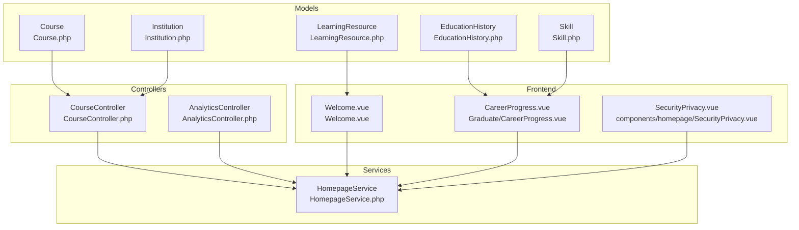
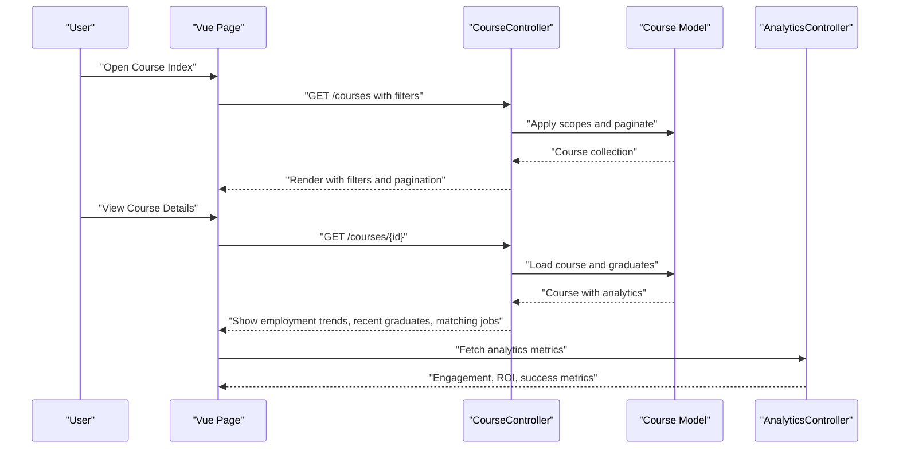
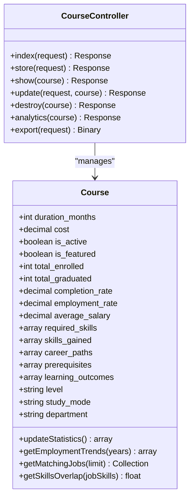
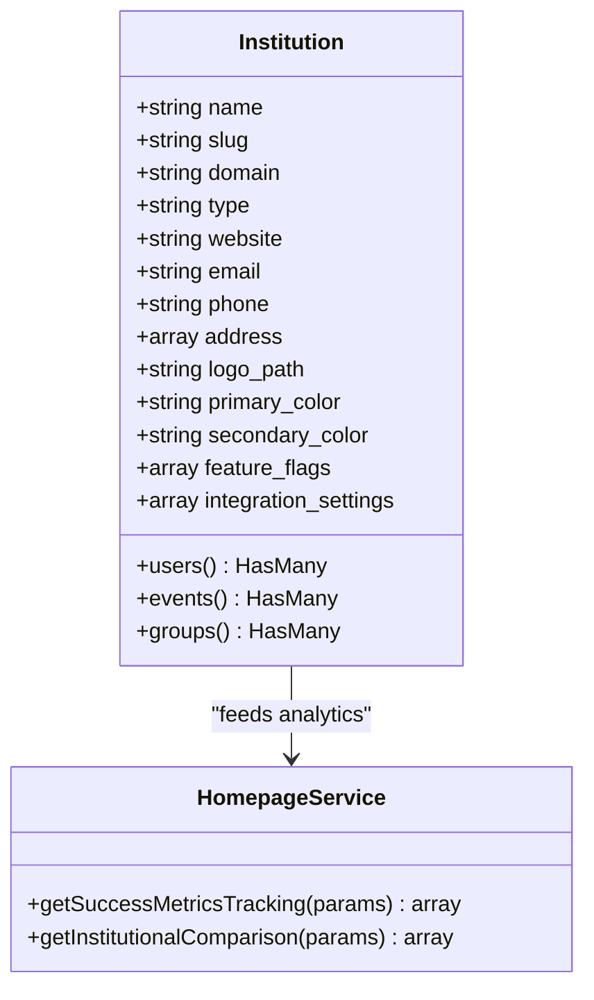
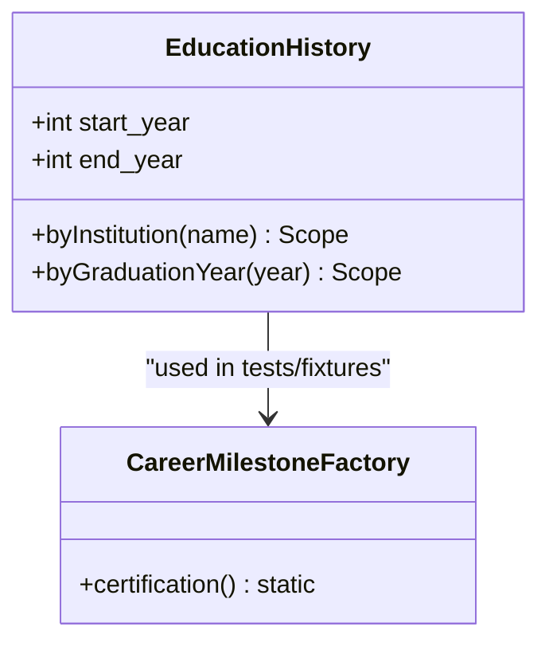
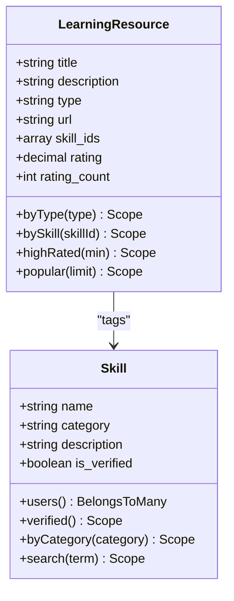
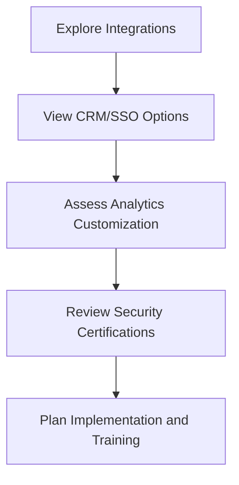
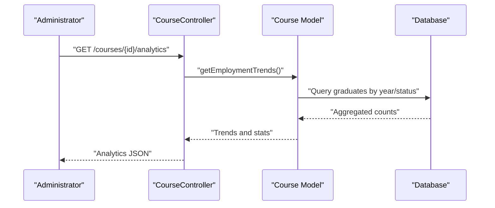
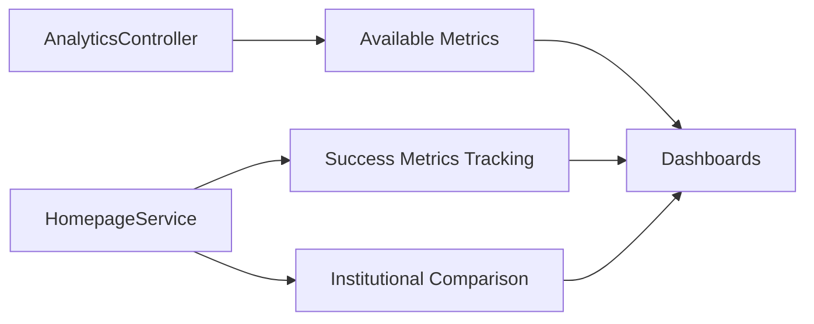
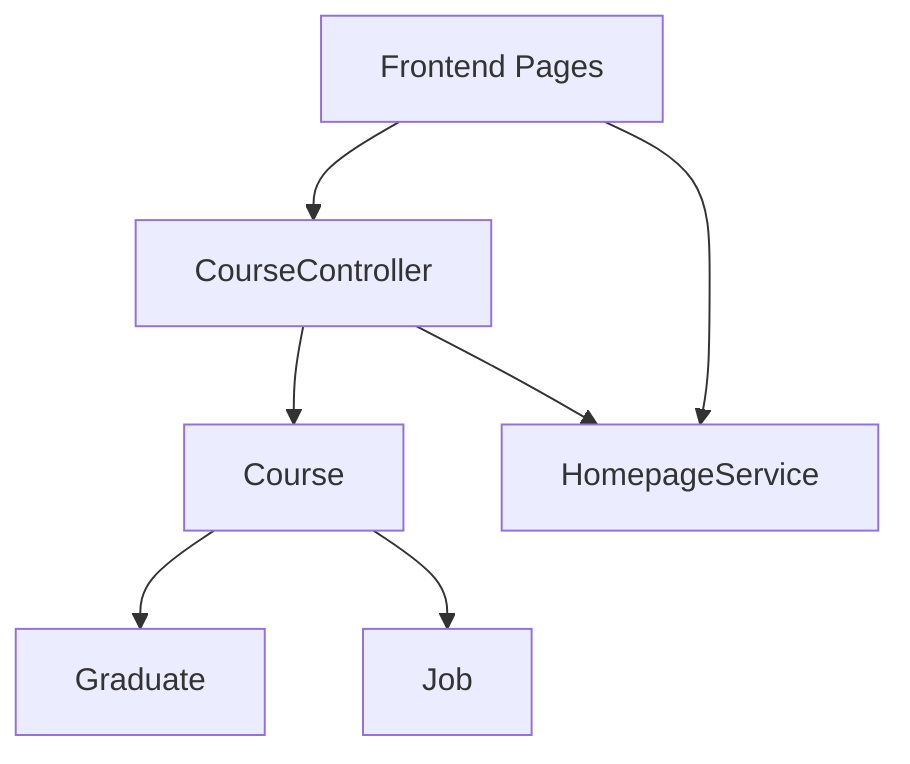

# Educational Integration

<cite>
**Referenced Files in This Document**
- [Course.php](file://app/Models/Course.php)
- [CourseController.php](file://app/Http/Controllers/CourseController.php)
- [Institution.php](file://app/Models/Institution.php)
- [EducationHistory.php](file://app/Models/EducationHistory.php)
- [LearningResource.php](file://app/Models/LearningResource.php)
- [Skill.php](file://app/Models/Skill.php)
- [HomepageService.php](file://app/Services/HomepageService.php)
- [AnalyticsController.php](file://app/Http/Controllers/Api/AnalyticsController.php)
- [CareerMilestoneFactory.php](file://database/factories/CareerMilestoneFactory.php)
- [Graduate\CareerProgress.vue](file://resources/js/Pages/Graduate/CareerProgress.vue)
- [Welcome.vue](file://resources/js/Pages/Welcome.vue)
- [SecurityPrivacy.vue](file://resources/js/components/homepage/SecurityPrivacy.vue)
- [README.md](file://README.md)
- [task-06-course-management-enhancement-recap.md](file://docs/task-06-course-management-enhancement-recap.md)
- [administrator-guide.md](file://docs/user-guides/admin/administrator-guide.md)
- [design.md](file://docs/task-06-course-management-enhancement-recap.md)
- [implementation-plan.md](file://implementation-plan.md)
- [implementation-summary.md](file://implementation-summary.md)
- [technical-specification.md](file://technical-specification.md)
- [project-roadmap.md](file://project-roadmap.md)
</cite>

## Table of Contents
1. [Introduction](#introduction)
2. [Project Structure](#project-structure)
3. [Core Components](#core-components)
4. [Architecture Overview](#architecture-overview)
5. [Detailed Component Analysis](#detailed-component-analysis)
6. [Dependency Analysis](#dependency-analysis)
7. [Performance Considerations](#performance-considerations)
8. [Troubleshooting Guide](#troubleshooting-guide)
9. [Conclusion](#conclusion)
10. [Appendices](#appendices)

## Introduction
This document describes the educational integration system that powers course management, academic program tracking, institution profiles, academic records, continuing education, skill development, certification tracking, industry credentials, partnerships, and resource integration. It explains how courses are set up and managed, how learners enroll and track progress, how institutions monitor outcomes, and how analytics and integrations support decision-making. Examples include course setup workflows, enrollment-related analytics, and academic tracking dashboards.

## Project Structure
The system is a Laravel-based application with a front-end built using Vue.js and Inertia. Key areas relevant to education include:
- Models for courses, institutions, education history, learning resources, and skills
- Controllers for course management and analytics
- Services for homepage and institutional analytics
- Front-end pages and components for course discovery, career progress, and security/privacy
- Documentation and implementation plans for course management and advanced analytics

**Diagram sources**
- [Course.php:1-200](file://app/Models/Course.php#L1-L200)
- [CourseController.php:1-373](file://app/Http/Controllers/CourseController.php#L1-L373)
- [Institution.php:1-77](file://app/Models/Institution.php#L1-L77)
- [EducationHistory.php:1-61](file://app/Models/EducationHistory.php#L1-L61)
- [LearningResource.php:1-77](file://app/Models/LearningResource.php#L1-L77)
- [Skill.php:1-52](file://app/Models/Skill.php#L1-L52)
- [HomepageService.php:382-2610](file://app/Services/HomepageService.php#L382-L2610)
- [AnalyticsController.php:225-254](file://app/Http/Controllers/Api/AnalyticsController.php#L225-L254)
- [Welcome.vue:192-220](file://resources/js/Pages/Welcome.vue#L192-L220)
- [Graduate\CareerProgress.vue:136-155](file://resources/js/Pages/Graduate/CareerProgress.vue#L136-L155)
- [SecurityPrivacy.vue:91-136](file://resources/js/components/homepage/SecurityPrivacy.vue#L91-L136)

**Section sources**
- [README.md:487-504](file://README.md#L487-L504)
- [implementation-plan.md](file://implementation-plan.md)
- [implementation-summary.md](file://implementation-summary.md)
- [technical-specification.md](file://technical-specification.md)
- [project-roadmap.md](file://project-roadmap.md)

## Core Components
- Course model and controller: define course metadata, enrollment and outcome analytics, filtering, sorting, and export capabilities.
- Institution model: holds institutional branding, settings, and relationships to users, events, and groups.
- EducationHistory: captures academic background for users/graduates without requiring a formal institution linkage.
- LearningResource and Skill: enable skill-aligned learning resources and skill verification.
- Analytics and homepage services: provide institutional analytics, success metrics, and integration options.
- Front-end pages: present course discovery, career progress with certifications, and security/privacy badges.

**Section sources**
- [Course.php:13-52](file://app/Models/Course.php#L13-L52)
- [CourseController.php:16-137](file://app/Http/Controllers/CourseController.php#L16-L137)
- [Institution.php:14-51](file://app/Models/Institution.php#L14-L51)
- [EducationHistory.php:12-24](file://app/Models/EducationHistory.php#L12-L24)
- [LearningResource.php:13-28](file://app/Models/LearningResource.php#L13-L28)
- [Skill.php:13-22](file://app/Models/Skill.php#L13-L22)
- [HomepageService.php:988-2610](file://app/Services/HomepageService.php#L988-L2610)
- [Graduate\CareerProgress.vue:136-155](file://resources/js/Pages/Graduate/CareerProgress.vue#L136-L155)
- [Welcome.vue:192-220](file://resources/js/Pages/Welcome.vue#L192-L220)
- [SecurityPrivacy.vue:91-136](file://resources/js/components/homepage/SecurityPrivacy.vue#L91-L136)

## Architecture Overview
The educational integration follows a layered architecture:
- Presentation: Vue.js + Inertia renders course listings, analytics dashboards, and career progress.
- Application: Controllers orchestrate requests, apply filters, compute analytics, and delegate to services.
- Domain: Models encapsulate business rules (course stats, skills, education history).
- Persistence: Eloquent models with JSON casts and tenant scoping for multi-institutional data.
- Analytics: Dedicated analytics controller and services expose metrics and institutional insights.

**Diagram sources**
- [CourseController.php:16-137](file://app/Http/Controllers/CourseController.php#L16-L137)
- [Course.php:123-198](file://app/Models/Course.php#L123-L198)
- [AnalyticsController.php:225-254](file://app/Http/Controllers/Api/AnalyticsController.php#L225-L254)

## Detailed Component Analysis

### Course Management and Academic Program Tracking
- Course model stores program attributes, enrollment counts, completion and employment rates, and career outcomes. It exposes scopes for filtering and helper methods for analytics.
- Course controller handles listing, filtering, sorting, creation, updates, deletion, analytics, and export. It initializes tenant context for institution-scoped operations and applies robust filters including JSON-based skills matching.

**Diagram sources**
- [Course.php:13-52](file://app/Models/Course.php#L13-L52)
- [Course.php:123-198](file://app/Models/Course.php#L123-L198)
- [CourseController.php:16-373](file://app/Http/Controllers/CourseController.php#L16-L373)

**Section sources**
- [Course.php:13-52](file://app/Models/Course.php#L13-L52)
- [Course.php:123-198](file://app/Models/Course.php#L123-L198)
- [CourseController.php:16-137](file://app/Http/Controllers/CourseController.php#L16-L137)
- [CourseController.php:144-217](file://app/Http/Controllers/CourseController.php#L144-L217)
- [CourseController.php:234-271](file://app/Http/Controllers/CourseController.php#L234-L271)
- [CourseController.php:273-319](file://app/Http/Controllers/CourseController.php#L273-L319)

### Institution Profiles and Branding
- Institution model centralizes branding and settings, including primary/secondary colors, feature flags, and integration settings. It relates to users, events, and groups for holistic institutional management.
- Homepage service aggregates institutional analytics, success metrics, and integration options, enabling administrators to assess performance and plan upgrades.

**Diagram sources**
- [Institution.php:14-51](file://app/Models/Institution.php#L14-L51)
- [HomepageService.php:2565-2610](file://app/Services/HomepageService.php#L2565-L2610)

**Section sources**
- [Institution.php:14-51](file://app/Models/Institution.php#L14-L51)
- [HomepageService.php:2565-2610](file://app/Services/HomepageService.php#L2565-L2610)
- [administrator-guide.md:109-141](file://docs/user-guides/admin/administrator-guide.md#L109-L141)

### Academic Record Management and Continuing Education
- EducationHistory captures academic background at the user/graduate level, including institution name, degree, field of study, and years, enabling cohort and trend analysis even without formal institution IDs.
- Career milestones (certifications) are modeled and surfaced in graduate career progress views, including issuer and expiry dates.

**Diagram sources**
- [EducationHistory.php:12-24](file://app/Models/EducationHistory.php#L12-L24)
- [EducationHistory.php:49-59](file://app/Models/EducationHistory.php#L49-L59)
- [CareerMilestoneFactory.php:78-100](file://database/factories/CareerMilestoneFactory.php#L78-L100)

**Section sources**
- [EducationHistory.php:12-24](file://app/Models/EducationHistory.php#L12-L24)
- [EducationHistory.php:49-59](file://app/Models/EducationHistory.php#L49-L59)
- [CareerMilestoneFactory.php:78-100](file://database/factories/CareerMilestoneFactory.php#L78-L100)
- [Graduate\CareerProgress.vue:136-155](file://resources/js/Pages/Graduate/CareerProgress.vue#L136-L155)

### Skill Development Resources and Certification Tracking
- LearningResource supports skill tagging via JSON arrays and provides popularity/rating analytics. It connects to creators and skills for discoverability.
- Skill model enables verified skills, categorization, and user-proficiency tracking, supporting certification alignment and development planning.

**Diagram sources**
- [LearningResource.php:13-28](file://app/Models/LearningResource.php#L13-L28)
- [LearningResource.php:40-58](file://app/Models/LearningResource.php#L40-L58)
- [Skill.php:13-22](file://app/Models/Skill.php#L13-L22)
- [Skill.php:24-34](file://app/Models/Skill.php#L24-L34)
- [Skill.php:36-50](file://app/Models/Skill.php#L36-L50)

**Section sources**
- [LearningResource.php:13-28](file://app/Models/LearningResource.php#L13-L28)
- [LearningResource.php:40-58](file://app/Models/LearningResource.php#L40-L58)
- [Skill.php:13-22](file://app/Models/Skill.php#L13-L22)
- [Skill.php:24-34](file://app/Models/Skill.php#L24-L34)
- [Skill.php:36-50](file://app/Models/Skill.php#L36-L50)

### Academic Partnership Features and Educational Resource Integration
- The homepage service enumerates integration options (e.g., CRM, SSO) and analytics customization, supporting institutional ecosystem integration.
- Security/privacy badges highlight compliance (e.g., FERPA), reinforcing trust for institutional partners.

**Diagram sources**
- [HomepageService.php:988-1009](file://app/Services/HomepageService.php#L988-L1009)
- [HomepageService.php:1011-1018](file://app/Services/HomepageService.php#L1011-L1018)
- [SecurityPrivacy.vue:91-136](file://resources/js/components/homepage/SecurityPrivacy.vue#L91-L136)

**Section sources**
- [HomepageService.php:988-1009](file://app/Services/HomepageService.php#L988-L1009)
- [HomepageService.php:1011-1018](file://app/Services/HomepageService.php#L1011-L1018)
- [SecurityPrivacy.vue:91-136](file://resources/js/components/homepage/SecurityPrivacy.vue#L91-L136)
- [administrator-guide.md:334-370](file://docs/user-guides/admin/administrator-guide.md#L334-L370)

### Course Enrollment Systems and Academic Progress Monitoring
- Course controller’s analytics endpoint computes employment trends, graduate counts, salary statistics, and job matching, enabling progress monitoring.
- Export functionality supports CSV/JSON exports for administrative reporting.

**Diagram sources**
- [CourseController.php:234-261](file://app/Http/Controllers/CourseController.php#L234-L261)
- [Course.php:180-198](file://app/Models/Course.php#L180-L198)

**Section sources**
- [CourseController.php:234-261](file://app/Http/Controllers/CourseController.php#L234-L261)
- [Course.php:180-198](file://app/Models/Course.php#L180-L198)
- [CourseController.php:273-319](file://app/Http/Controllers/CourseController.php#L273-L319)

### Institutional Analytics and Educational Pathway Mapping
- Analytics controller exposes available metrics for engagement, alumni activity, and community health, enabling pathway mapping and ROI analysis.
- Homepage service provides success metrics tracking and institutional comparisons, supporting strategic decisions.

**Diagram sources**
- [AnalyticsController.php:225-254](file://app/Http/Controllers/Api/AnalyticsController.php#L225-L254)
- [HomepageService.php:2565-2610](file://app/Services/HomepageService.php#L2565-L2610)
- [HomepageService.php:2265-2303](file://app/Services/HomepageService.php#L2265-L2303)

**Section sources**
- [AnalyticsController.php:225-254](file://app/Http/Controllers/Api/AnalyticsController.php#L225-L254)
- [HomepageService.php:2565-2610](file://app/Services/HomepageService.php#L2565-L2610)
- [HomepageService.php:2265-2303](file://app/Services/HomepageService.php#L2265-L2303)

## Dependency Analysis
- CourseController depends on Course model for data access and analytics computation, and on tenant initialization for multi-institution contexts.
- Course model depends on Graduate and Job models for employment and job-matching analytics.
- Front-end pages depend on backend controllers/services for data rendering and analytics.

**Diagram sources**
- [CourseController.php:16-137](file://app/Http/Controllers/CourseController.php#L16-L137)
- [Course.php:54-68](file://app/Models/Course.php#L54-L68)
- [HomepageService.php:382-2610](file://app/Services/HomepageService.php#L382-L2610)

**Section sources**
- [CourseController.php:16-137](file://app/Http/Controllers/CourseController.php#L16-L137)
- [Course.php:54-68](file://app/Models/Course.php#L54-L68)
- [HomepageService.php:382-2610](file://app/Services/HomepageService.php#L382-L2610)

## Performance Considerations
- Use scopes and filtered queries to minimize payload sizes and improve responsiveness.
- Leverage pagination and sorting on the server side to avoid heavy client-side computations.
- Offload analytics computations to background jobs where appropriate to keep UI responsive.
- Employ caching for frequently accessed metrics and dashboards.

## Troubleshooting Guide
- Course deletion fails if graduates exist: ensure graduates are transferred or removed before deleting a course.
- Tenant context issues: verify institution_id and tenant initialization in course listing flows.
- Analytics discrepancies: confirm data freshness and recalculation of course statistics.

**Section sources**
- [CourseController.php:219-232](file://app/Http/Controllers/CourseController.php#L219-L232)
- [CourseController.php:20-26](file://app/Http/Controllers/CourseController.php#L20-L26)
- [Course.php:123-146](file://app/Models/Course.php#L123-L146)

## Conclusion
The educational integration system provides a robust foundation for managing courses, tracking academic outcomes, and delivering insights to institutions. It combines strong domain models, a flexible controller layer, and comprehensive analytics to support decision-making, compliance, and continuous improvement in higher education ecosystems.

## Appendices

### Examples and Workflows

- Course setup and management
  - Create a course with name, code, level, duration, study mode, department, and attributes like required skills, skills gained, and career paths.
  - Update course details and publish changes; view analytics including employment trends and recent graduates.
  - Export course data for administrative reporting.

  **Section sources**
  - [CourseController.php:139-167](file://app/Http/Controllers/CourseController.php#L139-L167)
  - [CourseController.php:187-217](file://app/Http/Controllers/CourseController.php#L187-L217)
  - [CourseController.php:234-261](file://app/Http/Controllers/CourseController.php#L234-L261)
  - [CourseController.php:273-319](file://app/Http/Controllers/CourseController.php#L273-L319)

- Academic progress monitoring
  - Use course analytics to review employment trends, graduate statistics, salary ranges, and job matching.
  - Trigger manual statistics updates when needed.

  **Section sources**
  - [CourseController.php:234-271](file://app/Http/Controllers/CourseController.php#L234-L271)
  - [Course.php:180-198](file://app/Models/Course.php#L180-L198)
  - [Course.php:123-146](file://app/Models/Course.php#L123-L146)

- Institutional analytics and success metrics
  - Retrieve success metrics tracking and institutional comparisons for strategic planning.
  - Explore integration options and security/privacy certifications for partner onboarding.

  **Section sources**
  - [HomepageService.php:2565-2610](file://app/Services/HomepageService.php#L2565-L2610)
  - [HomepageService.php:2265-2303](file://app/Services/HomepageService.php#L2265-L2303)
  - [HomepageService.php:988-1009](file://app/Services/HomepageService.php#L988-L1009)
  - [SecurityPrivacy.vue:91-136](file://resources/js/components/homepage/SecurityPrivacy.vue#L91-L136)

- Certification tracking in career progress
  - View certifications with issuer and expiry date in graduate career progress pages.

  **Section sources**
  - [Graduate\CareerProgress.vue:136-155](file://resources/js/Pages/Graduate/CareerProgress.vue#L136-L155)
  - [CareerMilestoneFactory.php:78-100](file://database/factories/CareerMilestoneFactory.php#L78-L100)

- Learning resources aligned to skills
  - Discover learning resources by type and skill, and leverage ratings and popularity for recommendations.

  **Section sources**
  - [LearningResource.php:40-58](file://app/Models/LearningResource.php#L40-L58)
  - [Skill.php:36-50](file://app/Models/Skill.php#L36-L50)

- Overview of educational offerings
  - Explore institutional benefits and features presented on the welcome page.

  **Section sources**
  - [Welcome.vue:192-220](file://resources/js/Pages/Welcome.vue#L192-L220)