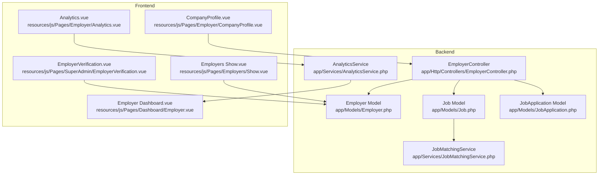
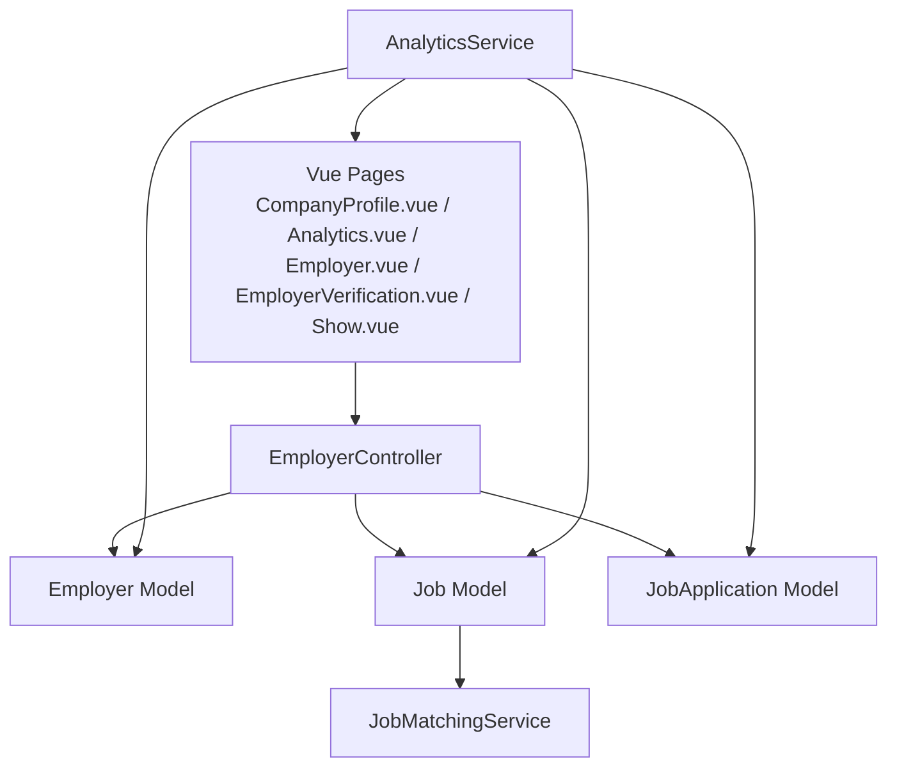
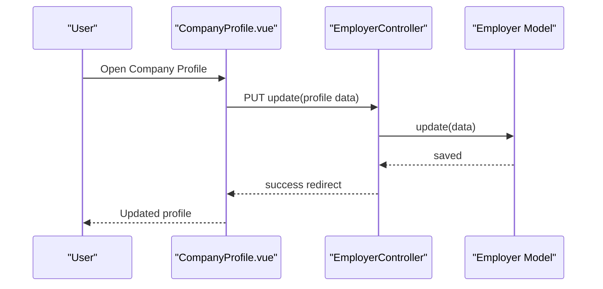
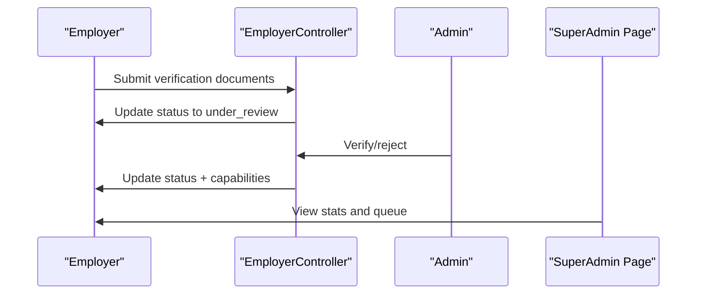
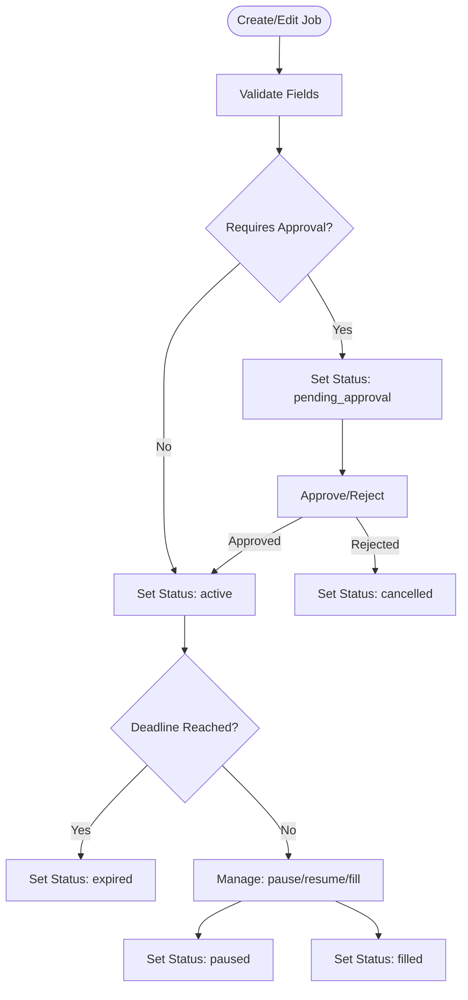
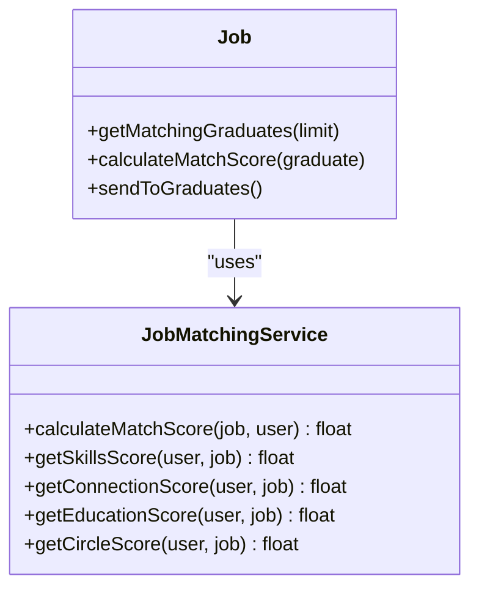
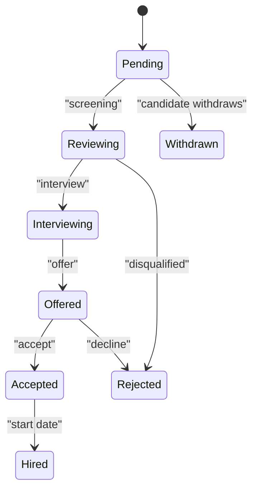
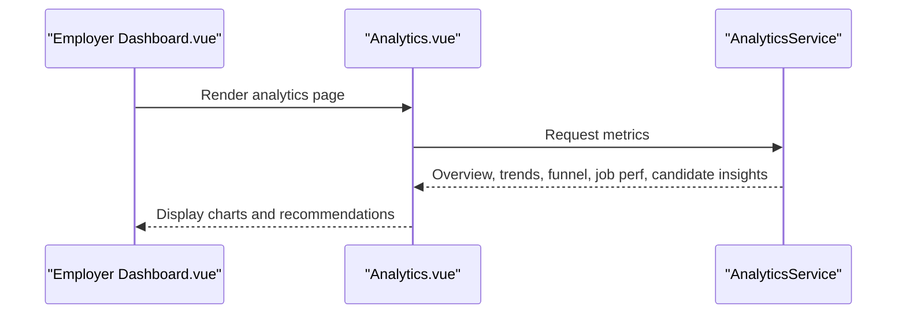
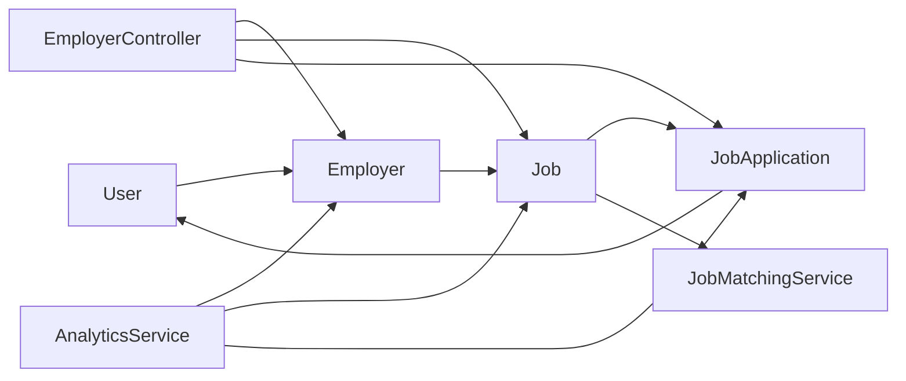

# Employer Services

<cite>
**Referenced Files in This Document**
- [Employer.php](file://app/Models/Employer.php)
- [EmployerController.php](file://app/Http/Controllers/EmployerController.php)
- [Job.php](file://app/Models/Job.php)
- [JobApplication.php](file://app/Models/JobApplication.php)
- [JobMatchingService.php](file://app/Services/JobMatchingService.php)
- [AnalyticsService.php](file://app/Services/AnalyticsService.php)
- [CompanyProfile.vue](file://resources/js/Pages/Employer/CompanyProfile.vue)
- [Analytics.vue](file://resources/js/Pages/Employer/Analytics.vue)
- [Show.vue](file://resources/js/Pages/Employers/Show.vue)
- [Employer.vue](file://resources/js/Pages/Dashboard/Employer.vue)
- [EmployerVerification.vue](file://resources/js/Pages/SuperAdmin/EmployerVerification.vue)
- [employer-user-manual.md](file://docs/user-guides/employer/employer-user-manual.md)
- [task-07-employer-registration-verification-recap.md](file://docs/task-07-employer-registration-verification-recap.md)
- [task-08-job-posting-management-recap.md](file://docs/task-08-job-posting-management-recap.md)
- [task-11-search-matching-system-recap.md](file://docs/task-11-search-matching-system-recap.md)
- [EmployerJobPostingWorkflowTest.php](file://tests/Browser/EmployerJobPostingWorkflowTest.php)
</cite>

## Table of Contents
1. [Introduction](#introduction)
2. [Project Structure](#project-structure)
3. [Core Components](#core-components)
4. [Architecture Overview](#architecture-overview)
5. [Detailed Component Analysis](#detailed-component-analysis)
6. [Dependency Analysis](#dependency-analysis)
7. [Performance Considerations](#performance-considerations)
8. [Troubleshooting Guide](#troubleshooting-guide)
9. [Conclusion](#conclusion)
10. [Appendices](#appendices)

## Introduction
This document describes the Employer Services platform, focusing on company profile management, employer branding, talent pipeline access, advanced candidate search, application management workflows, analytics and hiring insights, verification processes, job posting workflows, and success tracking. It synthesizes both front-end dashboards and back-end services to present a cohesive view of how employers interact with the platform.

## Project Structure
The Employer Services span Laravel backend models/controllers and Vue.js frontend pages:
- Backend models represent Employers, Jobs, and Applications with rich attributes and helper methods.
- Controllers orchestrate employer actions, verification, and administrative workflows.
- Services encapsulate matching and analytics computations.
- Frontend pages provide dashboards, company profile editing, analytics, and verification interfaces.

**Diagram sources**
- [Employer.php:1-397](file://app/Models/Employer.php#L1-L397)
- [EmployerController.php:1-389](file://app/Http/Controllers/EmployerController.php#L1-L389)
- [Job.php:1-573](file://app/Models/Job.php#L1-L573)
- [JobApplication.php:1-162](file://app/Models/JobApplication.php#L1-L162)
- [JobMatchingService.php:1-362](file://app/Services/JobMatchingService.php#L1-L362)
- [AnalyticsService.php:1-800](file://app/Services/AnalyticsService.php#L1-L800)
- [CompanyProfile.vue:1-371](file://resources/js/Pages/Employer/CompanyProfile.vue#L1-L371)
- [Analytics.vue:1-372](file://resources/js/Pages/Employer/Analytics.vue#L1-L372)
- [Employer.vue:319-330](file://resources/js/Pages/Dashboard/Employer.vue#L319-L330)
- [EmployerVerification.vue:1-45](file://resources/js/Pages/SuperAdmin/EmployerVerification.vue#L1-L45)
- [Show.vue:1-377](file://resources/js/Pages/Employers/Show.vue#L1-L377)

**Section sources**
- [Employer.php:1-397](file://app/Models/Employer.php#L1-L397)
- [EmployerController.php:1-389](file://app/Http/Controllers/EmployerController.php#L1-L389)
- [Job.php:1-573](file://app/Models/Job.php#L1-L573)
- [JobApplication.php:1-162](file://app/Models/JobApplication.php#L1-L162)
- [JobMatchingService.php:1-362](file://app/Services/JobMatchingService.php#L1-L362)
- [AnalyticsService.php:1-800](file://app/Services/AnalyticsService.php#L1-L800)
- [CompanyProfile.vue:1-371](file://resources/js/Pages/Employer/CompanyProfile.vue#L1-L371)
- [Analytics.vue:1-372](file://resources/js/Pages/Employer/Analytics.vue#L1-L372)
- [Employer.vue:319-330](file://resources/js/Pages/Dashboard/Employer.vue#L319-L330)
- [EmployerVerification.vue:1-45](file://resources/js/Pages/SuperAdmin/EmployerVerification.vue#L1-L45)
- [Show.vue:1-377](file://resources/js/Pages/Employers/Show.vue#L1-L377)

## Core Components
- Employer model: central entity for company profiles, verification, subscription, and hiring stats.
- Job model: job postings with lifecycle, approvals, deadlines, and performance metrics.
- JobApplication model: application statuses and graduate associations.
- EmployerController: registration, profile updates, verification submission/approval, subscription management, exports.
- JobMatchingService: weighted scoring for candidate-job fit across connections, skills, education, and circles.
- AnalyticsService: employer engagement metrics, hiring analytics, market trends, and benchmarks.
- Frontend dashboards: Company Profile editor, Employer Analytics, Employer Dashboard, Super Admin Verification, and Employers Show.

**Section sources**
- [Employer.php:1-397](file://app/Models/Employer.php#L1-L397)
- [EmployerController.php:1-389](file://app/Http/Controllers/EmployerController.php#L1-L389)
- [Job.php:1-573](file://app/Models/Job.php#L1-L573)
- [JobApplication.php:1-162](file://app/Models/JobApplication.php#L1-L162)
- [JobMatchingService.php:1-362](file://app/Services/JobMatchingService.php#L1-L362)
- [AnalyticsService.php:1-800](file://app/Services/AnalyticsService.php#L1-L800)
- [CompanyProfile.vue:1-371](file://resources/js/Pages/Employer/CompanyProfile.vue#L1-L371)
- [Analytics.vue:1-372](file://resources/js/Pages/Employer/Analytics.vue#L1-L372)
- [Employer.vue:319-330](file://resources/js/Pages/Dashboard/Employer.vue#L319-L330)
- [EmployerVerification.vue:1-45](file://resources/js/Pages/SuperAdmin/EmployerVerification.vue#L1-L45)
- [Show.vue:1-377](file://resources/js/Pages/Employers/Show.vue#L1-L377)

## Architecture Overview
The Employer Services follow a layered architecture:
- Presentation: Vue pages render dashboards and forms.
- Application: Controllers handle employer actions and orchestrate domain logic.
- Domain: Models encapsulate business rules (verification, job lifecycle, application states).
- Services: JobMatchingService and AnalyticsService encapsulate specialized algorithms and metrics.
- Data: Eloquent models map to relational tables; services compute derived insights.

**Diagram sources**
- [EmployerController.php:1-389](file://app/Http/Controllers/EmployerController.php#L1-L389)
- [Employer.php:1-397](file://app/Models/Employer.php#L1-L397)
- [Job.php:1-573](file://app/Models/Job.php#L1-L573)
- [JobApplication.php:1-162](file://app/Models/JobApplication.php#L1-L162)
- [JobMatchingService.php:1-362](file://app/Services/JobMatchingService.php#L1-L362)
- [AnalyticsService.php:1-800](file://app/Services/AnalyticsService.php#L1-L800)
- [CompanyProfile.vue:1-371](file://resources/js/Pages/Employer/CompanyProfile.vue#L1-L371)
- [Analytics.vue:1-372](file://resources/js/Pages/Employer/Analytics.vue#L1-L372)
- [Employer.vue:319-330](file://resources/js/Pages/Dashboard/Employer.vue#L319-L330)
- [EmployerVerification.vue:1-45](file://resources/js/Pages/SuperAdmin/EmployerVerification.vue#L1-L45)
- [Show.vue:1-377](file://resources/js/Pages/Employers/Show.vue#L1-L377)

## Detailed Component Analysis

### Company Profile Management and Employer Branding
- Profile editing supports company info, contact details, legal info, business locations, services/products, and benefits.
- Verification status badge and messaging guide users through verification states.
- Profile completion percentage and completion timestamp help drive completeness.

**Diagram sources**
- [CompanyProfile.vue:1-371](file://resources/js/Pages/Employer/CompanyProfile.vue#L1-L371)
- [EmployerController.php:204-235](file://app/Http/Controllers/EmployerController.php#L204-L235)
- [Employer.php:1-397](file://app/Models/Employer.php#L1-L397)

**Section sources**
- [CompanyProfile.vue:1-371](file://resources/js/Pages/Employer/CompanyProfile.vue#L1-L371)
- [EmployerController.php:204-235](file://app/Http/Controllers/EmployerController.php#L204-L235)
- [Employer.php:342-364](file://app/Models/Employer.php#L342-L364)
- [Show.vue:1-377](file://resources/js/Pages/Employers/Show.vue#L1-L377)

### Employer Verification Processes
- Employers submit verification documents via controller action, transitioning status to under review.
- Admins verify or reject, updating status and capabilities (posting/search).
- Super Admin dashboard displays verification stats and queue.

**Diagram sources**
- [EmployerController.php:254-330](file://app/Http/Controllers/EmployerController.php#L254-L330)
- [Employer.php:239-291](file://app/Models/Employer.php#L239-L291)
- [EmployerVerification.vue:1-45](file://resources/js/Pages/SuperAdmin/EmployerVerification.vue#L1-L45)

**Section sources**
- [EmployerController.php:254-330](file://app/Http/Controllers/EmployerController.php#L254-L330)
- [Employer.php:239-291](file://app/Models/Employer.php#L239-L291)
- [task-07-employer-registration-verification-recap.md:216-347](file://docs/task-07-employer-registration-verification-recap.md#L216-L347)
- [EmployerVerification.vue:1-45](file://resources/js/Pages/SuperAdmin/EmployerVerification.vue#L1-L45)

### Job Posting Management and Workflows
- Employers create/update jobs; jobs can require approval and enforce verification requirements.
- Jobs track views, applications, and performance metrics; expired/paused/filled states supported.
- Approval/rejection/pause/resume/fill helpers streamline lifecycle management.

**Diagram sources**
- [Job.php:1-573](file://app/Models/Job.php#L1-L573)
- [task-08-job-posting-management-recap.md:230-386](file://docs/task-08-job-posting-management-recap.md#L230-L386)

**Section sources**
- [Job.php:140-243](file://app/Models/Job.php#L140-L243)
- [task-08-job-posting-management-recap.md:230-386](file://docs/task-08-job-posting-management-recap.md#L230-L386)

### Candidate Search and Talent Pipeline Access
- Employers can search and filter graduates using skills, course, experience, and availability.
- Matching service computes composite scores across connections, skills, education, and shared circles.
- Saved searches and alerts enable proactive outreach.

**Diagram sources**
- [Job.php:250-337](file://app/Models/Job.php#L250-L337)
- [JobMatchingService.php:1-362](file://app/Services/JobMatchingService.php#L1-L362)
- [task-11-search-matching-system-recap.md:43-71](file://docs/task-11-search-matching-system-recap.md#L43-L71)

**Section sources**
- [Job.php:250-337](file://app/Models/Job.php#L250-L337)
- [JobMatchingService.php:1-362](file://app/Services/JobMatchingService.php#L1-L362)
- [task-11-search-matching-system-recap.md:43-71](file://docs/task-11-search-matching-system-recap.md#L43-L71)

### Application Management Workflows
- Applications progress through statuses: pending, reviewing, interviewing, offered, accepted, rejected, withdrawn, hired.
- Employers can bulk update statuses and communicate via integrated messaging.
- Application insights include status breakdowns, course distribution, and timeline analysis.

**Diagram sources**
- [JobApplication.php:1-162](file://app/Models/JobApplication.php#L1-L162)
- [task-08-job-posting-management-recap.md:230-242](file://docs/task-08-job-posting-management-recap.md#L230-L242)

**Section sources**
- [JobApplication.php:39-161](file://app/Models/JobApplication.php#L39-L161)
- [task-08-job-posting-management-recap.md:230-242](file://docs/task-08-job-posting-management-recap.md#L230-L242)

### Employer Analytics and Hiring Insights
- Analytics dashboard presents overview cards, application trends, hiring funnel, top performing jobs, and candidate insights.
- Recommendations surface based on conversion rate, pending vs reviewed counts, and candidate sourcing.
- Services compute market trends, employer engagement, and benchmarks.

**Diagram sources**
- [Employer.vue:319-330](file://resources/js/Pages/Dashboard/Employer.vue#L319-L330)
- [Analytics.vue:1-372](file://resources/js/Pages/Employer/Analytics.vue#L1-L372)
- [AnalyticsService.php:620-773](file://app/Services/AnalyticsService.php#L620-L773)

**Section sources**
- [Analytics.vue:1-372](file://resources/js/Pages/Employer/Analytics.vue#L1-L372)
- [AnalyticsService.php:620-773](file://app/Services/AnalyticsService.php#L620-L773)
- [task-08-job-posting-management-recap.md:320-333](file://docs/task-08-job-posting-management-recap.md#L320-L333)

### Employer Dashboards and User Guidance
- Employer dashboard links to analytics and lists key metrics.
- User manuals outline roles, job posting best practices, advanced search filters, and candidate pipeline management.

**Section sources**
- [Employer.vue:319-330](file://resources/js/Pages/Dashboard/Employer.vue#L319-L330)
- [employer-user-manual.md:48-207](file://docs/user-guides/employer/employer-user-manual.md#L48-L207)

## Dependency Analysis
- Employers depend on Users and Jobs; Jobs depend on Employers and Applications; Applications depend on Jobs and Users.
- Controllers depend on models and services; services encapsulate domain logic.
- Frontend pages depend on controllers for data and routes.

**Diagram sources**
- [Employer.php:96-110](file://app/Models/Employer.php#L96-L110)
- [Job.php:73-91](file://app/Models/Job.php#L73-L91)
- [JobApplication.php:58-86](file://app/Models/JobApplication.php#L58-L86)
- [EmployerController.php:1-389](file://app/Http/Controllers/EmployerController.php#L1-L389)
- [JobMatchingService.php:1-362](file://app/Services/JobMatchingService.php#L1-L362)
- [AnalyticsService.php:1-800](file://app/Services/AnalyticsService.php#L1-L800)

**Section sources**
- [Employer.php:96-110](file://app/Models/Employer.php#L96-L110)
- [Job.php:73-91](file://app/Models/Job.php#L73-L91)
- [JobApplication.php:58-86](file://app/Models/JobApplication.php#L58-L86)
- [EmployerController.php:1-389](file://app/Http/Controllers/EmployerController.php#L1-L389)
- [JobMatchingService.php:1-362](file://app/Services/JobMatchingService.php#L1-L362)
- [AnalyticsService.php:1-800](file://app/Services/AnalyticsService.php#L1-L800)

## Performance Considerations
- Job and application metrics rely on aggregated counts and computed rates; ensure proper indexing on foreign keys and timestamps.
- Matching service uses joins and collections; caching and limiting result sets can improve responsiveness.
- Analytics queries aggregate counts and groupings; consider materialized snapshots for heavy reports.
- Background jobs can handle notifications and periodic calculations.

[No sources needed since this section provides general guidance]

## Troubleshooting Guide
- Verification rejections: Employers receive rejection reasons; resubmission follows documented steps.
- Job posting limits: Employers with reached limits cannot post more until reset or upgraded.
- Application status confusion: Use status helpers and UI labels to clarify current stage.
- Dashboard data gaps: Confirm analytics service cache keys and date range filters.

**Section sources**
- [Employer.php:141-193](file://app/Models/Employer.php#L141-L193)
- [EmployerController.php:297-330](file://app/Http/Controllers/EmployerController.php#L297-L330)
- [JobApplication.php:111-140](file://app/Models/JobApplication.php#L111-L140)
- [Analytics.vue:350-368](file://resources/js/Pages/Employer/Analytics.vue#L350-L368)

## Conclusion
The Employer Services platform integrates robust employer branding, verification, job lifecycle management, advanced candidate matching, and comprehensive analytics. The layered architecture ensures maintainability, while the frontend dashboards provide actionable insights and streamlined workflows for efficient hiring.

## Appendices

### Example Workflows and Strategies
- Employer registration and verification: guided wizard, document upload, admin review, and status updates.
- Job posting best practices: detailed descriptions, compensation transparency, skills listing, and media enhancements.
- Candidate search strategies: skill-based filters, saved searches, alerts, and bulk operations.
- Hiring process optimization: funnel analysis, conversion rate monitoring, and recommendations.

**Section sources**
- [task-07-employer-registration-verification-recap.md:216-347](file://docs/task-07-employer-registration-verification-recap.md#L216-L347)
- [employer-user-manual.md:92-207](file://docs/user-guides/employer/employer-user-manual.md#L92-L207)
- [task-11-search-matching-system-recap.md:43-71](file://docs/task-11-search-matching-system-recap.md#L43-L71)
- [EmployerJobPostingWorkflowTest.php:286-330](file://tests/Browser/EmployerJobPostingWorkflowTest.php#L286-L330)