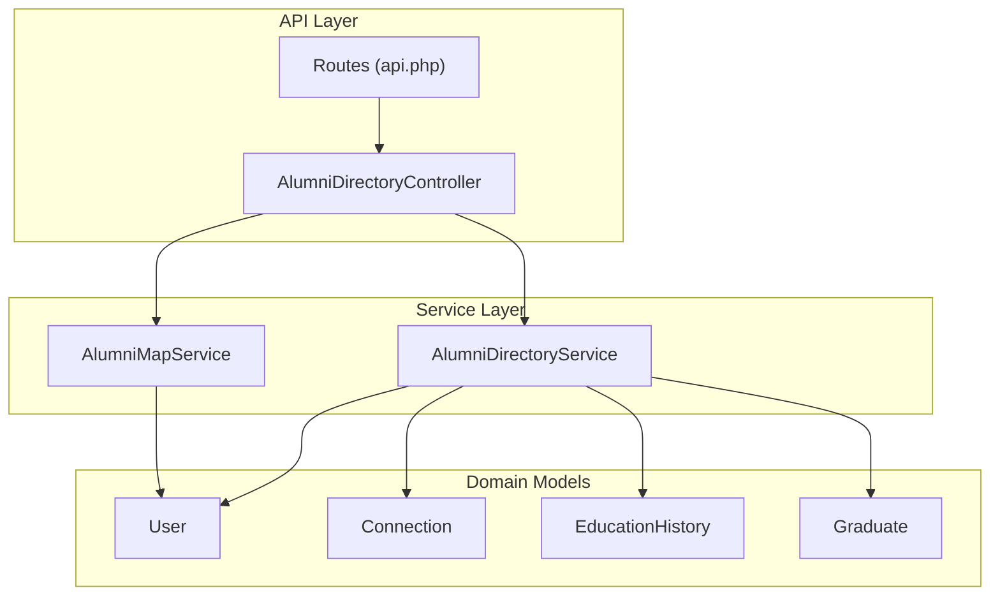
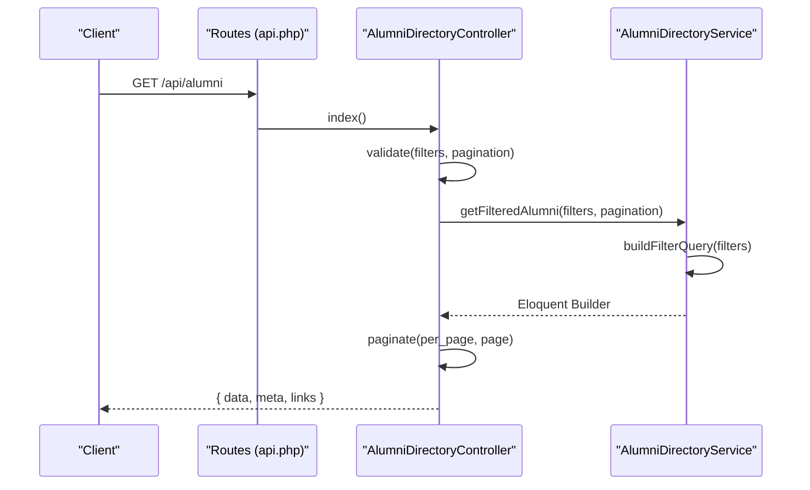
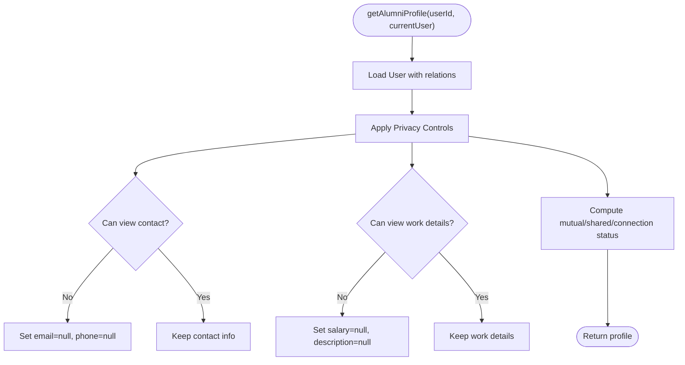
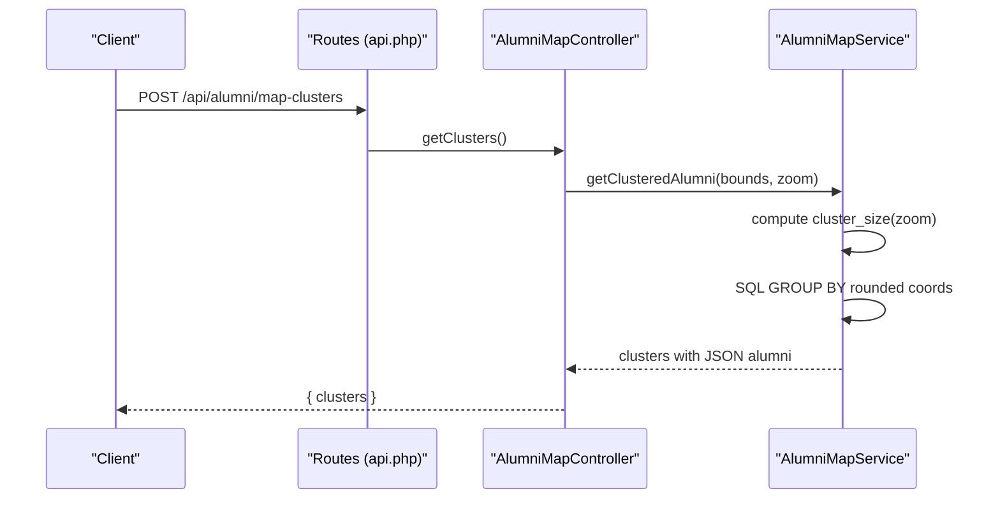
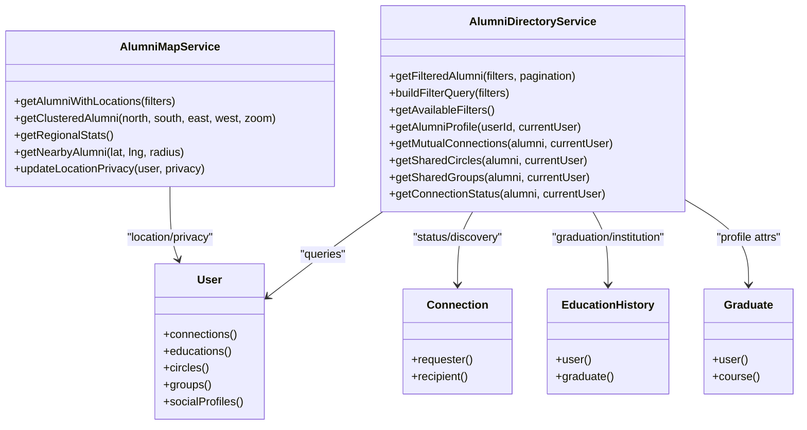

# Directory Service

<cite>
**Referenced Files in This Document**
- [AlumniDirectoryService.php](file://app/Services/AlumniDirectoryService.php)
- [AlumniDirectoryController.php](file://app/Http/Controllers/Api/AlumniDirectoryController.php)
- [AlumniMapService.php](file://app/Services/AlumniMapService.php)
- [api.php](file://routes/api.php)
- [User.php](file://app/Models/User.php)
- [Connection.php](file://app/Models/Connection.php)
- [EducationHistory.php](file://app/Models/EducationHistory.php)
- [Graduate.php](file://app/Models/Graduate.php)
</cite>

## Table of Contents
1. [Introduction](#introduction)
2. [Project Structure](#project-structure)
3. [Core Components](#core-components)
4. [Architecture Overview](#architecture-overview)
5. [Detailed Component Analysis](#detailed-component-analysis)
6. [Dependency Analysis](#dependency-analysis)
7. [Performance Considerations](#performance-considerations)
8. [Troubleshooting Guide](#troubleshooting-guide)
9. [Conclusion](#conclusion)

## Introduction
This document describes the alumni directory service, focusing on advanced filtering, sophisticated query building, privacy-aware retrieval, mapping integrations, connection status detection, and mutual connection discovery. It explains how the system supports:
- Graduation year ranges
- Location-based searches
- Industry and company filters
- Skills-based matching via JSON columns
- Institutional affiliations
- Multi-table joins and JSON searches
- Sorting, pagination, and real-time search suggestions
- Integration with mapping services and clustering
- Privacy-aware data exposure and connection discovery

## Project Structure
The directory service spans controller, service, and model layers, with routing under the API namespace. The primary runtime entry points are:
- API routes for alumni directory operations
- Controller methods for filtering, suggestions, and profile retrieval
- Service methods for building queries, computing privacy-aware profiles, and mutual connections
- Models representing users, connections, education history, and graduates

**Diagram sources**
- [api.php:142-149](file://routes/api.php#L142-L149)
- [AlumniDirectoryController.php:13-20](file://app/Http/Controllers/Api/AlumniDirectoryController.php#L13-L20)
- [AlumniDirectoryService.php:12-155](file://app/Services/AlumniDirectoryService.php#L12-L155)
- [AlumniMapService.php:9-50](file://app/Services/AlumniMapService.php#L9-L50)
- [User.php:13-279](file://app/Models/User.php#L13-L279)
- [Connection.php:8-57](file://app/Models/Connection.php#L8-L57)
- [EducationHistory.php:8-60](file://app/Models/EducationHistory.php#L8-L60)
- [Graduate.php:11-94](file://app/Models/Graduate.php#L11-L94)

**Section sources**
- [api.php:142-149](file://routes/api.php#L142-L149)
- [AlumniDirectoryController.php:13-20](file://app/Http/Controllers/Api/AlumniDirectoryController.php#L13-L20)
- [AlumniDirectoryService.php:12-155](file://app/Services/AlumniDirectoryService.php#L12-L155)
- [AlumniMapService.php:9-50](file://app/Services/AlumniMapService.php#L9-L50)
- [User.php:13-279](file://app/Models/User.php#L13-L279)
- [Connection.php:8-57](file://app/Models/Connection.php#L8-L57)
- [EducationHistory.php:8-60](file://app/Models/EducationHistory.php#L8-L60)
- [Graduate.php:11-94](file://app/Models/Graduate.php#L11-L94)

## Core Components
- AlumniDirectoryController: Validates and forwards filter parameters, returns paginated results, and exposes search suggestions and connection endpoints.
- AlumniDirectoryService: Builds Eloquent queries with multi-table joins, JSON column searches, and privacy-aware profile assembly.
- AlumniMapService: Provides location-based alumni retrieval, clustering, regional statistics, and nearby discovery.
- Models: User, Connection, EducationHistory, and Graduate define relationships and attributes leveraged by the directory service.

Key responsibilities:
- Filtering: search term, graduation year range, location, industry, company, skills, current role, institutions, circles, groups.
- Sorting: by name, graduation year, location, created_at.
- Pagination: page and per_page parameters.
- Suggestions: real-time autocomplete for names, companies, locations, and skills.
- Privacy: contact info and work details visibility controlled by connection status and user privacy settings.
- Connections: mutual connections, shared circles/groups, and connection status detection.

**Section sources**
- [AlumniDirectoryController.php:25-74](file://app/Http/Controllers/Api/AlumniDirectoryController.php#L25-L74)
- [AlumniDirectoryController.php:98-105](file://app/Http/Controllers/Api/AlumniDirectoryController.php#L98-L105)
- [AlumniDirectoryController.php:110-127](file://app/Http/Controllers/Api/AlumniDirectoryController.php#L110-L127)
- [AlumniDirectoryService.php:17-25](file://app/Services/AlumniDirectoryService.php#L17-L25)
- [AlumniDirectoryService.php:30-155](file://app/Services/AlumniDirectoryService.php#L30-L155)
- [AlumniDirectoryService.php:177-205](file://app/Services/AlumniDirectoryService.php#L177-L205)
- [AlumniDirectoryService.php:209-270](file://app/Services/AlumniDirectoryService.php#L209-L270)
- [AlumniDirectoryService.php:275-333](file://app/Services/AlumniDirectoryService.php#L275-L333)
- [AlumniMapService.php:14-50](file://app/Services/AlumniMapService.php#L14-L50)
- [AlumniMapService.php:55-96](file://app/Services/AlumniMapService.php#L55-L96)

## Architecture Overview
The directory service follows a layered architecture:
- API routes expose endpoints for listing, filtering, suggestions, and profile retrieval.
- Controllers validate inputs and delegate to services.
- Services encapsulate query construction, privacy enforcement, and computed attributes.
- Models define relationships enabling joins and JSON searches.

**Diagram sources**
- [api.php:142-149](file://routes/api.php#L142-L149)
- [AlumniDirectoryController.php:25-74](file://app/Http/Controllers/Api/AlumniDirectoryController.php#L25-L74)
- [AlumniDirectoryService.php:17-25](file://app/Services/AlumniDirectoryService.php#L17-L25)
- [AlumniDirectoryService.php:30-155](file://app/Services/AlumniDirectoryService.php#L30-L155)

## Detailed Component Analysis

### Filtering and Query Building
The service constructs a base query against the User model, eager-loading related collections, and applies filters conditionally:
- Search term across name, bio, location, work experiences (company/title), and education institution name.
- Graduation year range using whereHas on educations.
- Location substring match.
- Industry filter using whereHas on work experiences.
- Company substring match using whereHas on work experiences.
- Skills matching via JSON_contains on the skills JSON column.
- Current role filter using whereHas with is_current flag.
- Institutions filter using whereHas on educations with institution ids.
- Circles and groups filters using whereHas on pivot relationships.
- Sorting by name, graduation year (via leftJoin with educations), location, or created_at.
- Pagination via Laravel’s paginator.

```mermaid
flowchart TD
Start(["Build Filter Query"]) --> Base["Base Query: User<br/>with relations"]
Base --> Search{"Search present?"}
Search --> |Yes| ApplySearch["Apply ILIKE on name/bio/location<br/>and nested work/education"]
Search --> |No| YearRange{"Graduation year range?"}
ApplySearch --> YearRange
YearRange --> |Yes| FilterYears["whereHas educations<br/>graduation_year between"]
YearRange --> |No| Location{"Location filter?"}
FilterYears --> Location
Location --> |Yes| FilterLoc["where location ILIKE %term%"]
Location --> |No| Industry{"Industries array?"}
FilterLoc --> Industry
Industry --> |Yes| FilterInd["whereHas workExperiences<br/>industry in (...)"]
Industry --> |No| Company{"Company filter?"}
FilterInd --> Company
Company --> |Yes| FilterComp["whereHas workExperiences<br/>company ILIKE %term%"]
Company --> |No| Skills{"Skills array?"}
FilterComp --> Skills
Skills --> |Yes| FilterSkills["OR JSON_contains skills"]
Skills --> |No| Role{"Current role?"}
FilterSkills --> Role
Role --> |Yes| FilterRole["whereHas workExperiences<br/>is_current=true AND title ILIKE %term%"]
Role --> |No| Inst{"Institutions array?"}
FilterRole --> Inst
Inst --> |Yes| FilterInst["whereHas educations<br/>institution_id in (...)"]
Inst --> |No| Circles{"Circles array?"}
FilterInst --> Circles
Circles --> |Yes| FilterCircles["whereHas circles<br/>ids in (...)"]
Circles --> |No| Groups{"Groups array?"}
FilterCircles --> Groups
Groups --> |Yes| FilterGroups["whereHas groups<br/>ids in (...)"]
Groups --> |No| Sort["Sort by name/graduation_year/location/created_at"]
Sort --> Paginate["Paginate with per_page/page"]
Paginate --> End(["Return Builder"])
```

**Diagram sources**
- [AlumniDirectoryService.php:30-155](file://app/Services/AlumniDirectoryService.php#L30-L155)

**Section sources**
- [AlumniDirectoryService.php:30-155](file://app/Services/AlumniDirectoryService.php#L30-L155)

### Sorting Mechanisms
Sorting options:
- name: alphabetical order
- graduation_year: left join with educations and order by graduation_year
- location: order by location
- created_at: order by created_at

The service sets default sort_by to name and accepts asc/desc orders.

**Section sources**
- [AlumniDirectoryService.php:134-152](file://app/Services/AlumniDirectoryService.php#L134-L152)

### Pagination Handling
Pagination is handled by passing per_page and page parameters to the paginator. The controller returns:
- items()
- meta: current_page, last_page, per_page, total, from, to
- links: first, last, prev, next

**Section sources**
- [AlumniDirectoryController.php:50-73](file://app/Http/Controllers/Api/AlumniDirectoryController.php#L50-L73)
- [AlumniDirectoryService.php:17-25](file://app/Services/AlumniDirectoryService.php#L17-L25)

### Real-Time Search Suggestions
The controller provides a search endpoint that returns autocomplete suggestions for:
- Names: matches on user name
- Companies: aggregated counts from work experiences
- Locations: aggregated counts from users
- Skills: extracted from user skills JSON, filtered by substring match

The suggestions are returned as arrays with value/count pairs where applicable.

**Section sources**
- [AlumniDirectoryController.php:110-127](file://app/Http/Controllers/Api/AlumniDirectoryController.php#L110-L127)
- [AlumniDirectoryController.php:189-290](file://app/Http/Controllers/Api/AlumniDirectoryController.php#L189-L290)

### Privacy-Aware Data Retrieval
The service retrieves a detailed profile and applies privacy controls:
- Contact info (email, phone) hidden unless privacy setting permits and connection status is accepted.
- Work details (salary, detailed_description) hidden unless privacy setting permits and connection status is accepted.
Computed attributes appended:
- mutual_connections: up to 10 mutual connections
- shared_circles: circles in common
- shared_groups: groups in common
- connection_status: self, none, pending, accepted, received_request

**Diagram sources**
- [AlumniDirectoryService.php:177-205](file://app/Services/AlumniDirectoryService.php#L177-L205)
- [AlumniDirectoryService.php:275-333](file://app/Services/AlumniDirectoryService.php#L275-L333)
- [AlumniDirectoryService.php:209-270](file://app/Services/AlumniDirectoryService.php#L209-L270)

**Section sources**
- [AlumniDirectoryService.php:177-205](file://app/Services/AlumniDirectoryService.php#L177-L205)
- [AlumniDirectoryService.php:275-333](file://app/Services/AlumniDirectoryService.php#L275-L333)
- [AlumniDirectoryService.php:209-270](file://app/Services/AlumniDirectoryService.php#L209-L270)

### Connection Status Detection and Mutual Connections
- Connection status is determined by checking bidirectional connection records and statuses.
- Mutual connections are computed by intersecting current user’s and target user’s connected user ids.
- Shared circles and groups are computed by intersecting ids from both users’ memberships.

**Section sources**
- [AlumniDirectoryService.php:251-270](file://app/Services/AlumniDirectoryService.php#L251-L270)
- [AlumniDirectoryService.php:210-222](file://app/Services/AlumniDirectoryService.php#L210-L222)
- [AlumniDirectoryService.php:227-246](file://app/Services/AlumniDirectoryService.php#L227-L246)
- [Connection.php:8-57](file://app/Models/Connection.php#L8-L57)

### Mapping Integrations and Clustering
The AlumniMapService provides:
- Location-based alumni retrieval with privacy checks (excludes private location privacy).
- Clustered data using SQL grouping and JSON aggregation for performance at varying zoom levels.
- Regional statistics by country, region, and industry.
- Nearby discovery using a spherical distance calculation.
- Location privacy updates and placeholder geocoding hook.

**Diagram sources**
- [api.php:785-799](file://routes/api.php#L785-L799)
- [AlumniMapService.php:55-96](file://app/Services/AlumniMapService.php#L55-L96)

**Section sources**
- [AlumniMapService.php:14-50](file://app/Services/AlumniMapService.php#L14-L50)
- [AlumniMapService.php:55-96](file://app/Services/AlumniMapService.php#L55-L96)
- [AlumniMapService.php:101-170](file://app/Services/AlumniMapService.php#L101-L170)
- [AlumniMapService.php:214-234](file://app/Services/AlumniMapService.php#L214-L234)

### API Endpoints and Request/Response
- GET /api/alumni: returns paginated filtered results with metadata and links
- GET /api/alumni/filters: returns available filter options (top locations, industries, companies, skills, institutions, circles, groups)
- GET /api/alumni/search: returns real-time suggestions by type (name/company/location/skill)
- GET /api/alumni/{userId}: returns detailed profile with privacy controls and computed attributes
- POST /api/alumni/{userId}/connect: sends a connection request if none exists

**Section sources**
- [AlumniDirectoryController.php:25-93](file://app/Http/Controllers/Api/AlumniDirectoryController.php#L25-L93)
- [AlumniDirectoryController.php:98-127](file://app/Http/Controllers/Api/AlumniDirectoryController.php#L98-L127)
- [api.php:142-149](file://routes/api.php#L142-L149)

## Dependency Analysis
The directory service depends on:
- User model for core attributes, relationships, and privacy settings
- Connection model for connection status and mutual discovery
- EducationHistory model for institution and graduation year data
- Graduate model for profile-related attributes (used indirectly via User relationships)

**Diagram sources**
- [AlumniDirectoryService.php:12-464](file://app/Services/AlumniDirectoryService.php#L12-L464)
- [AlumniMapService.php:9-236](file://app/Services/AlumniMapService.php#L9-L236)
- [User.php:13-279](file://app/Models/User.php#L13-L279)
- [Connection.php:8-57](file://app/Models/Connection.php#L8-L57)
- [EducationHistory.php:8-60](file://app/Models/EducationHistory.php#L8-L60)
- [Graduate.php:11-94](file://app/Models/Graduate.php#L11-L94)

**Section sources**
- [AlumniDirectoryService.php:12-464](file://app/Services/AlumniDirectoryService.php#L12-L464)
- [AlumniMapService.php:9-236](file://app/Services/AlumniMapService.php#L9-L236)
- [User.php:13-279](file://app/Models/User.php#L13-L279)
- [Connection.php:8-57](file://app/Models/Connection.php#L8-L57)
- [EducationHistory.php:8-60](file://app/Models/EducationHistory.php#L8-L60)
- [Graduate.php:11-94](file://app/Models/Graduate.php#L11-L94)

## Performance Considerations
- Use of whereHas and joins ensures only relevant rows are included, reducing payload size.
- JSON_contains on skills enables flexible matching but may benefit from indexing strategies depending on scale.
- Pagination prevents large result sets; consider cursor-based pagination for very large datasets.
- Clustering in AlumniMapService aggregates points server-side to reduce client rendering overhead.
- Eager loading of relations avoids N+1 queries for profile retrieval.

## Troubleshooting Guide
Common issues and resolutions:
- Empty or unexpected results:
  - Verify filters are within allowed ranges (e.g., graduation years, per_page).
  - Confirm location privacy settings do not exclude users unexpectedly.
- Slow queries:
  - Ensure appropriate indices exist on frequently filtered columns (location, graduation_year, institution_id).
  - Consider denormalizing or adding materialized views for complex aggregations.
- Privacy violations:
  - Confirm privacy settings and connection status logic in applyPrivacyControls.
- Mutual connections or shared groups not appearing:
  - Check that both users have accepted connections and memberships.

**Section sources**
- [AlumniDirectoryController.php:27-48](file://app/Http/Controllers/Api/AlumniDirectoryController.php#L27-L48)
- [AlumniDirectoryService.php:275-333](file://app/Services/AlumniDirectoryService.php#L275-L333)
- [AlumniMapService.php:19-20](file://app/Services/AlumniMapService.php#L19-L20)

## Conclusion
The alumni directory service delivers a robust, privacy-aware platform for discovering and connecting with alumni. Its sophisticated query builder supports multi-dimensional filtering, JSON-based skills matching, and privacy-aware profile exposure. Integration with mapping services enables scalable visualization and proximity discovery. The modular design keeps concerns separated across controller, service, and model layers, facilitating maintainability and extensibility.