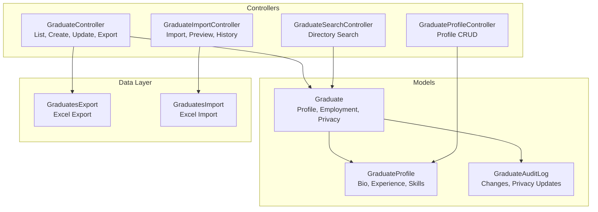
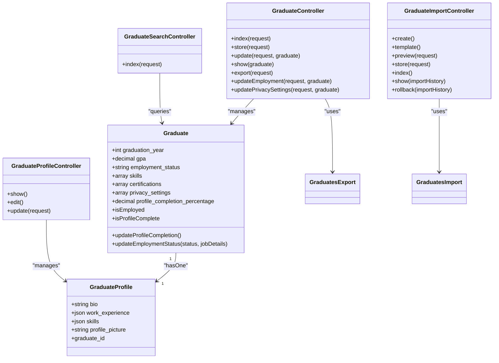
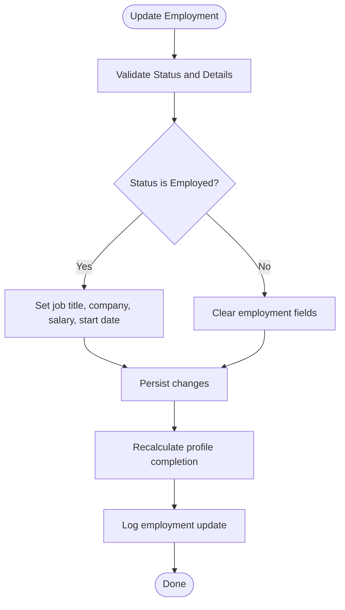
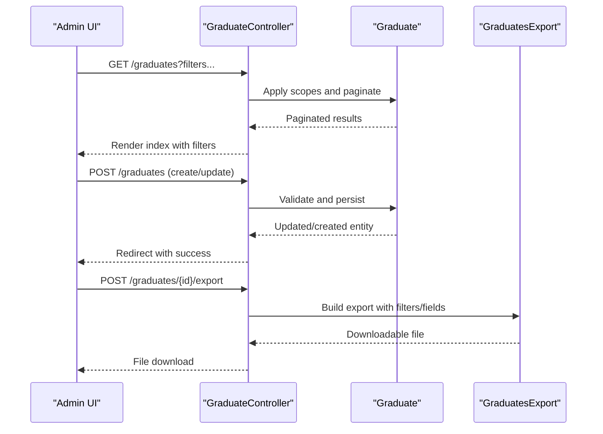
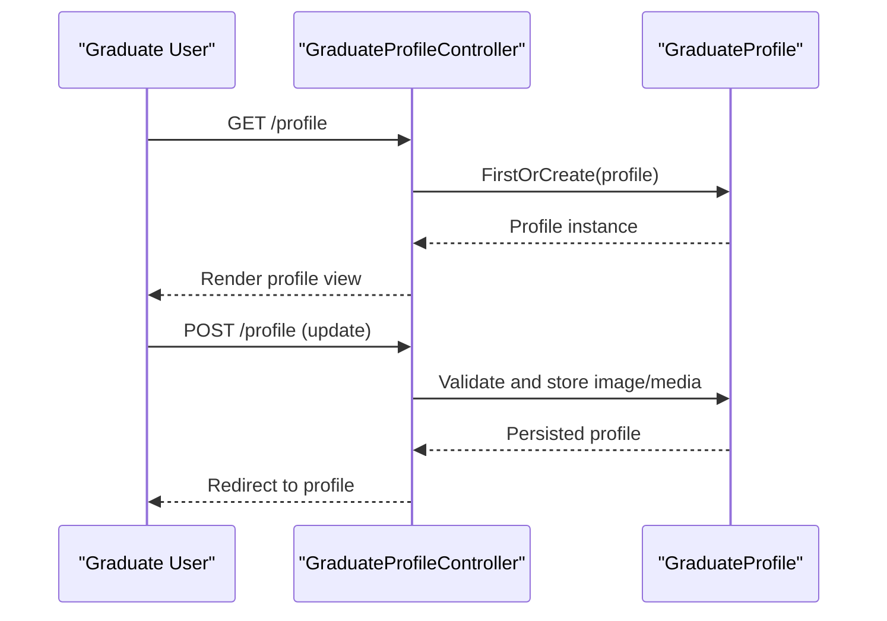
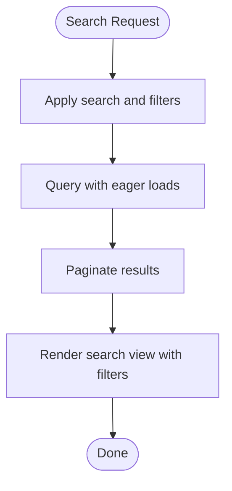
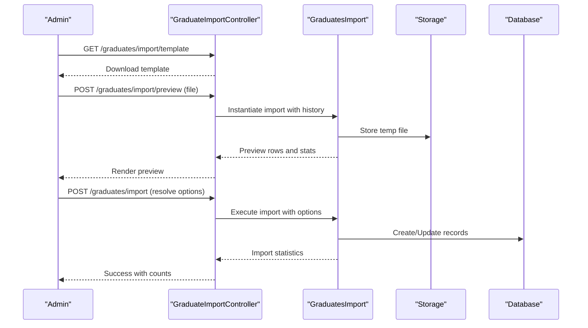
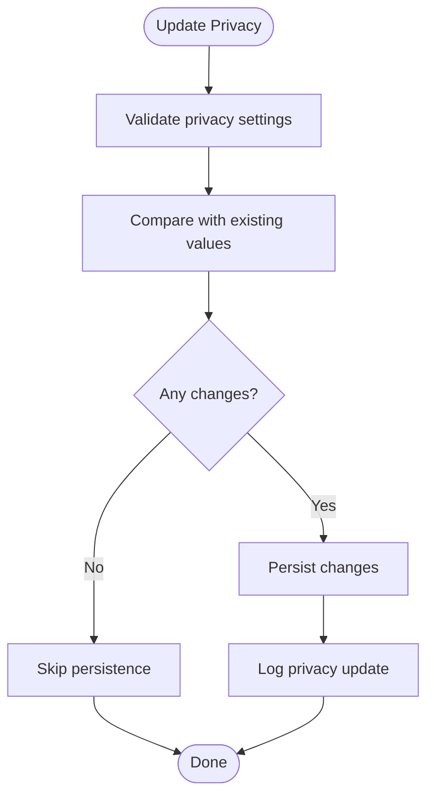
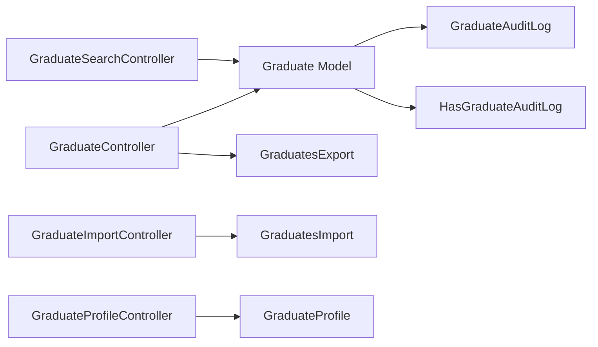

# Graduate Management

<cite>
**Referenced Files in This Document**
- [Graduate.php](file://app/Models/Graduate.php)
- [GraduateProfile.php](file://app/Models/GraduateProfile.php)
- [GraduateController.php](file://app/Http/Controllers/GraduateController.php)
- [GraduateProfileController.php](file://app/Http/Controllers/GraduateProfileController.php)
- [GraduateSearchController.php](file://app/Http/Controllers/GraduateSearchController.php)
- [GraduateImportController.php](file://app/Http/Controllers/GraduateImportController.php)
- [GraduatesExport.php](file://app/Exports/GraduatesExport.php)
- [GraduatesImport.php](file://app/Imports/GraduatesImport.php)
- [GraduateAuditLog.php](file://app/Models/GraduateAuditLog.php)
- [HasGraduateAuditLog.php](file://app/Traits/HasGraduateAuditLog.php)
- [requirements.md](file://.kiro/specs/graduate-tracking-system/requirements.md)
- [tasks.md](file://.kiro/specs/graduate-tracking-system/tasks.md)
- [task-04-graduate-profile-management-recap.md](file://docs/task-04-graduate-profile-management-recap.md)
- [task-05-graduate-import-export-enhancement-recap.md](file://docs/task-05-graduate-import-export-enhancement-recap.md)
- [workflow-2025-01-19-1430-graduate-profile-enhancement.md](file://docs/workflow-2025-01-19-1430-graduate-profile-enhancement.md)
</cite>

## Table of Contents
1. [Introduction](#introduction)
2. [Project Structure](#project-structure)
3. [Core Components](#core-components)
4. [Architecture Overview](#architecture-overview)
5. [Detailed Component Analysis](#detailed-component-analysis)
6. [Dependency Analysis](#dependency-analysis)
7. [Performance Considerations](#performance-considerations)
8. [Troubleshooting Guide](#troubleshooting-guide)
9. [Conclusion](#conclusion)

## Introduction
This document provides comprehensive documentation for the graduate management feature set. It covers graduate profiles (academic records, skills assessment, certifications, employment history, and career timeline tracking), bulk import/export with Excel-based data management, privacy controls with granular visibility settings, and profile completion tracking with progress indicators. It also outlines alumni directory functionality with advanced filtering, success story sharing, and networking capabilities, along with examples of profile enhancement workflows, data validation processes, and integration with career tracking systems.

## Project Structure
The graduate management system is implemented across models, controllers, imports/exports, traits, and supporting documentation. Key areas include:
- Data model layer: Graduate and GraduateProfile entities with related audit/logging capabilities
- API/UI controllers: GraduateController, GraduateProfileController, GraduateSearchController, and GraduateImportController
- Data import/export: GraduatesImport and GraduatesExport classes integrated with Excel
- Supporting services and traits: Audit logging and multi-tenancy integration
- Specification and task documentation: Requirements and implementation tasks

**Diagram sources**
- [Graduate.php:11-243](file://app/Models/Graduate.php#L11-L243)
- [GraduateProfile.php:8-26](file://app/Models/GraduateProfile.php#L8-L26)
- [GraduateController.php:13-389](file://app/Http/Controllers/GraduateController.php#L13-L389)
- [GraduateProfileController.php:11-60](file://app/Http/Controllers/GraduateProfileController.php#L11-L60)
- [GraduateSearchController.php:9-40](file://app/Http/Controllers/GraduateSearchController.php#L9-L40)
- [GraduateImportController.php:15-310](file://app/Http/Controllers/GraduateImportController.php#L15-L310)
- [GraduatesExport.php:16-200](file://app/Exports/GraduatesExport.php#L16-L200)
- [GraduatesImport.php:15-200](file://app/Imports/GraduatesImport.php#L15-L200)

**Section sources**
- [Graduate.php:11-243](file://app/Models/Graduate.php#L11-L243)
- [GraduateProfile.php:8-26](file://app/Models/GraduateProfile.php#L8-L26)
- [GraduateController.php:13-389](file://app/Http/Controllers/GraduateController.php#L13-L389)
- [GraduateProfileController.php:11-60](file://app/Http/Controllers/GraduateProfileController.php#L11-L60)
- [GraduateSearchController.php:9-40](file://app/Http/Controllers/GraduateSearchController.php#L9-L40)
- [GraduateImportController.php:15-310](file://app/Http/Controllers/GraduateImportController.php#L15-L310)
- [GraduatesExport.php:16-200](file://app/Exports/GraduatesExport.php#L16-L200)
- [GraduatesImport.php:15-200](file://app/Imports/GraduatesImport.php#L15-L200)

## Core Components
- Graduate entity: central profile with academic, employment, skills, certifications, privacy, and completion tracking fields; includes scopes and helpers for filtering and computation
- GraduateProfile: extended profile with bio, work experience, skills, and media assets
- Controllers: administrative listing, creation, updates, exports; graduate self-service profile; directory search; import pipeline with preview and history
- Import/Export: Excel-based templates, validation, preview, conflict resolution, and statistics; export with configurable fields and formats
- Audit and privacy logging: structured audit trails and privacy change logs

**Section sources**
- [Graduate.php:15-58](file://app/Models/Graduate.php#L15-L58)
- [Graduate.php:138-189](file://app/Models/Graduate.php#L138-L189)
- [Graduate.php:191-221](file://app/Models/Graduate.php#L191-L221)
- [GraduateProfile.php:12-25](file://app/Models/GraduateProfile.php#L12-L25)
- [GraduateController.php:17-150](file://app/Http/Controllers/GraduateController.php#L17-L150)
- [GraduateController.php:334-387](file://app/Http/Controllers/GraduateController.php#L334-L387)
- [GraduateProfileController.php:13-58](file://app/Http/Controllers/GraduateProfileController.php#L13-L58)
- [GraduateSearchController.php:11-38](file://app/Http/Controllers/GraduateSearchController.php#L11-L38)
- [GraduateImportController.php:29-44](file://app/Http/Controllers/GraduateImportController.php#L29-L44)
- [GraduateImportController.php:131-188](file://app/Http/Controllers/GraduateImportController.php#L131-L188)
- [GraduateImportController.php:190-260](file://app/Http/Controllers/GraduateImportController.php#L190-L260)
- [GraduateImportController.php:262-308](file://app/Http/Controllers/GraduateImportController.php#L262-L308)
- [GraduatesExport.php:16-200](file://app/Exports/GraduatesExport.php#L16-L200)
- [GraduatesImport.php:15-200](file://app/Imports/GraduatesImport.php#L15-L200)

## Architecture Overview
The graduate management feature follows a layered MVC pattern with dedicated controllers for administrative and self-service operations, robust data models with computed attributes and scopes, and a comprehensive import/export pipeline leveraging Excel. Privacy and auditability are enforced through model traits and controller actions.

**Diagram sources**
- [Graduate.php:11-243](file://app/Models/Graduate.php#L11-L243)
- [GraduateProfile.php:8-26](file://app/Models/GraduateProfile.php#L8-L26)
- [GraduateController.php:13-389](file://app/Http/Controllers/GraduateController.php#L13-L389)
- [GraduateProfileController.php:11-60](file://app/Http/Controllers/GraduateProfileController.php#L11-L60)
- [GraduateSearchController.php:9-40](file://app/Http/Controllers/GraduateSearchController.php#L9-L40)
- [GraduateImportController.php:15-310](file://app/Http/Controllers/GraduateImportController.php#L15-L310)
- [GraduatesExport.php:16-200](file://app/Exports/GraduatesExport.php#L16-L200)
- [GraduatesImport.php:15-200](file://app/Imports/GraduatesImport.php#L15-L200)

## Detailed Component Analysis

### Graduate Entity and Profile
The Graduate model encapsulates core profile data, computed completion metrics, and employment state transitions. It includes:
- Fillable and cast attributes for robust data typing
- Relationships to User, Course, Tenant, Applications, Profile, and Audit Logs
- Computed attributes for employment and completeness
- Scopes for filtering by employment, job search status, graduation year, and course
- Helper methods for updating profile completion and employment status

**Diagram sources**
- [Graduate.php:191-221](file://app/Models/Graduate.php#L191-L221)

**Section sources**
- [Graduate.php:15-58](file://app/Models/Graduate.php#L15-L58)
- [Graduate.php:96-109](file://app/Models/Graduate.php#L96-L109)
- [Graduate.php:111-135](file://app/Models/Graduate.php#L111-L135)
- [Graduate.php:138-189](file://app/Models/Graduate.php#L138-L189)
- [Graduate.php:191-221](file://app/Models/Graduate.php#L191-L221)
- [Graduate.php:226-241](file://app/Models/Graduate.php#L226-L241)

### Administrative Management (GraduateController)
The controller provides:
- Listing with rich filtering (search, employment status, graduation year range, course, skills, GPA bounds, academic standing, job search activity, profile completion threshold, certifications presence)
- Sorting by allowed fields
- Creation and update with validation and audit trail logging
- Employment status updates with detailed job information
- Privacy settings updates with change logging
- Export with configurable fields and formats (CSV, XLSX, PDF)
- Export field discovery endpoint

**Diagram sources**
- [GraduateController.php:17-150](file://app/Http/Controllers/GraduateController.php#L17-L150)
- [GraduateController.php:159-246](file://app/Http/Controllers/GraduateController.php#L159-L246)
- [GraduateController.php:273-315](file://app/Http/Controllers/GraduateController.php#L273-L315)
- [GraduateController.php:288-315](file://app/Http/Controllers/GraduateController.php#L288-L315)
- [GraduateController.php:334-387](file://app/Http/Controllers/GraduateController.php#L334-L387)

**Section sources**
- [GraduateController.php:17-150](file://app/Http/Controllers/GraduateController.php#L17-L150)
- [GraduateController.php:159-246](file://app/Http/Controllers/GraduateController.php#L159-L246)
- [GraduateController.php:273-315](file://app/Http/Controllers/GraduateController.php#L273-L315)
- [GraduateController.php:288-315](file://app/Http/Controllers/GraduateController.php#L288-L315)
- [GraduateController.php:334-387](file://app/Http/Controllers/GraduateController.php#L334-L387)

### Self-Service Profile (GraduateProfileController)
Graduate self-service profile management:
- Show current graduate and profile, including previous institution context
- Edit and update profile fields (bio, work experience, skills, profile picture)
- Automatic profile creation if missing

**Diagram sources**
- [GraduateProfileController.php:13-58](file://app/Http/Controllers/GraduateProfileController.php#L13-L58)

**Section sources**
- [GraduateProfileController.php:13-58](file://app/Http/Controllers/GraduateProfileController.php#L13-L58)

### Directory Search (GraduateSearchController)
Advanced directory search with:
- Authorization enforcement
- Filtering by name/email/institution/course/year/employment status
- Pagination

**Diagram sources**
- [GraduateSearchController.php:11-38](file://app/Http/Controllers/GraduateSearchController.php#L11-L38)

**Section sources**
- [GraduateSearchController.php:11-38](file://app/Http/Controllers/GraduateSearchController.php#L11-L38)

### Bulk Import/Export Pipeline (GraduateImportController, GraduatesImport, GraduatesExport)
Bulk import/export capabilities:
- Import template generation with required and optional fields
- Preview with header validation and first-rows inspection
- Conflict resolution options (skip duplicates, update existing, resolve conflicts)
- Import history tracking with statistics and rollback capability
- Export with configurable fields and formats (CSV, XLSX, PDF)

**Diagram sources**
- [GraduateImportController.php:46-129](file://app/Http/Controllers/GraduateImportController.php#L46-L129)
- [GraduateImportController.php:131-188](file://app/Http/Controllers/GraduateImportController.php#L131-L188)
- [GraduateImportController.php:190-260](file://app/Http/Controllers/GraduateImportController.php#L190-L260)
- [GraduatesImport.php:15-200](file://app/Imports/GraduatesImport.php#L15-L200)

**Section sources**
- [GraduateImportController.php:29-44](file://app/Http/Controllers/GraduateImportController.php#L29-L44)
- [GraduateImportController.php:46-129](file://app/Http/Controllers/GraduateImportController.php#L46-L129)
- [GraduateImportController.php:131-188](file://app/Http/Controllers/GraduateImportController.php#L131-L188)
- [GraduateImportController.php:190-260](file://app/Http/Controllers/GraduateImportController.php#L190-L260)
- [GraduateImportController.php:262-308](file://app/Http/Controllers/GraduateImportController.php#L262-L308)
- [GraduatesExport.php:16-200](file://app/Exports/GraduatesExport.php#L16-L200)
- [GraduatesImport.php:15-200](file://app/Imports/GraduatesImport.php#L15-L200)

### Privacy Controls and Audit Logging
Privacy and auditability:
- Privacy settings and employer contact preferences are validated and logged
- Audit trail captures significant changes with old/new values
- Privacy updates are separately logged for compliance

**Diagram sources**
- [GraduateController.php:288-315](file://app/Http/Controllers/GraduateController.php#L288-L315)
- [HasGraduateAuditLog.php:1-200](file://app/Traits/HasGraduateAuditLog.php#L1-L200)

**Section sources**
- [GraduateController.php:288-315](file://app/Http/Controllers/GraduateController.php#L288-L315)
- [HasGraduateAuditLog.php:1-200](file://app/Traits/HasGraduateAuditLog.php#L1-L200)

### Alumni Directory, Success Stories, and Networking
- Alumni directory: advanced filtering by institution, course, year, employment status, and search terms
- Success stories: can be integrated via posts or testimonials module (not detailed in referenced files)
- Networking: connections and messaging features (not detailed in referenced files)

**Section sources**
- [GraduateSearchController.php:11-38](file://app/Http/Controllers/GraduateSearchController.php#L11-L38)

### Profile Completion Tracking
- Automated calculation of profile completion percentage based on required fields
- Dynamic recomputation upon updates and employment changes
- Progress indicators surfaced in UI for user guidance

**Section sources**
- [Graduate.php:138-189](file://app/Models/Graduate.php#L138-L189)
- [Graduate.php:226-241](file://app/Models/Graduate.php#L226-L241)

### Integration with Career Tracking Systems
- Employment status and job details are captured and updated
- Integration points for career outcomes analytics and job matching (external to referenced files)

**Section sources**
- [Graduate.php:191-221](file://app/Models/Graduate.php#L191-L221)

## Dependency Analysis
The graduate management feature exhibits clear separation of concerns:
- Controllers depend on models and import/export classes
- Models encapsulate domain logic and computed attributes
- Traits provide cross-cutting concerns (audit logging)
- Import/Export leverage Excel facade and external libraries

**Diagram sources**
- [GraduateController.php:13-389](file://app/Http/Controllers/GraduateController.php#L13-L389)
- [GraduateImportController.php:15-310](file://app/Http/Controllers/GraduateImportController.php#L15-L310)
- [GraduateProfileController.php:11-60](file://app/Http/Controllers/GraduateProfileController.php#L11-L60)
- [GraduateSearchController.php:9-40](file://app/Http/Controllers/GraduateSearchController.php#L9-L40)
- [Graduate.php:11-243](file://app/Models/Graduate.php#L11-L243)
- [GraduateAuditLog.php:1-200](file://app/Models/GraduateAuditLog.php#L1-L200)
- [HasGraduateAuditLog.php:1-200](file://app/Traits/HasGraduateAuditLog.php#L1-L200)

**Section sources**
- [GraduateController.php:13-389](file://app/Http/Controllers/GraduateController.php#L13-L389)
- [GraduateImportController.php:15-310](file://app/Http/Controllers/GraduateImportController.php#L15-L310)
- [GraduateProfileController.php:11-60](file://app/Http/Controllers/GraduateProfileController.php#L11-L60)
- [GraduateSearchController.php:9-40](file://app/Http/Controllers/GraduateSearchController.php#L9-L40)
- [Graduate.php:11-243](file://app/Models/Graduate.php#L11-L243)
- [GraduateAuditLog.php:1-200](file://app/Models/GraduateAuditLog.php#L1-L200)
- [HasGraduateAuditLog.php:1-200](file://app/Traits/HasGraduateAuditLog.php#L1-L200)

## Performance Considerations
- Use pagination for listing and search endpoints to avoid large result sets
- Apply appropriate database indexing on frequently filtered fields (employment_status, graduation_year, course_id, tenant_id)
- Leverage eager loading for relationships (course, tenant, applications) to reduce N+1 queries
- Limit preview rows during import to minimize memory usage
- Batch processing for large exports and consider streaming for very large datasets

## Troubleshooting Guide
Common issues and resolutions:
- Import validation failures: verify required headers and supported formats; check preview for row-level errors
- Duplicate detection: use skip_duplicates option or resolve_conflicts during import
- Export failures: confirm format support and available fields; validate filters and institution context
- Privacy update errors: ensure proper validation of privacy settings and employer contact flags
- Audit log discrepancies: verify trait usage and controller logging paths

**Section sources**
- [GraduateImportController.php:131-188](file://app/Http/Controllers/GraduateImportController.php#L131-L188)
- [GraduateImportController.php:190-260](file://app/Http/Controllers/GraduateImportController.php#L190-L260)
- [GraduateController.php:334-387](file://app/Http/Controllers/GraduateController.php#L334-L387)
- [GraduateController.php:288-315](file://app/Http/Controllers/GraduateController.php#L288-L315)

## Conclusion
The graduate management feature provides a robust foundation for comprehensive graduate lifecycle management, including detailed profiles, advanced filtering, bulk data operations, privacy controls, and auditability. The modular design supports future enhancements such as success story sharing and networking integrations while maintaining strong data validation and export capabilities.