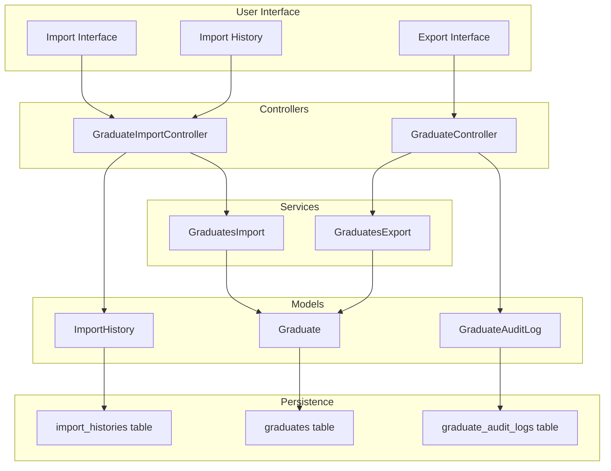
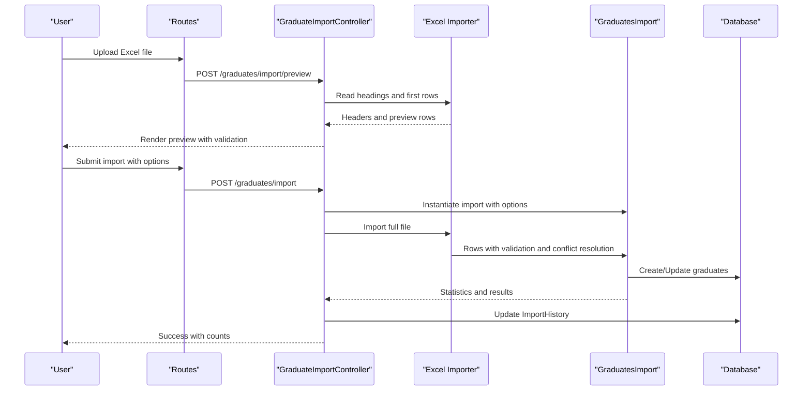
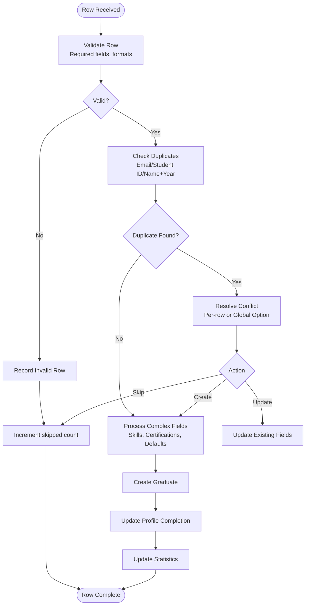
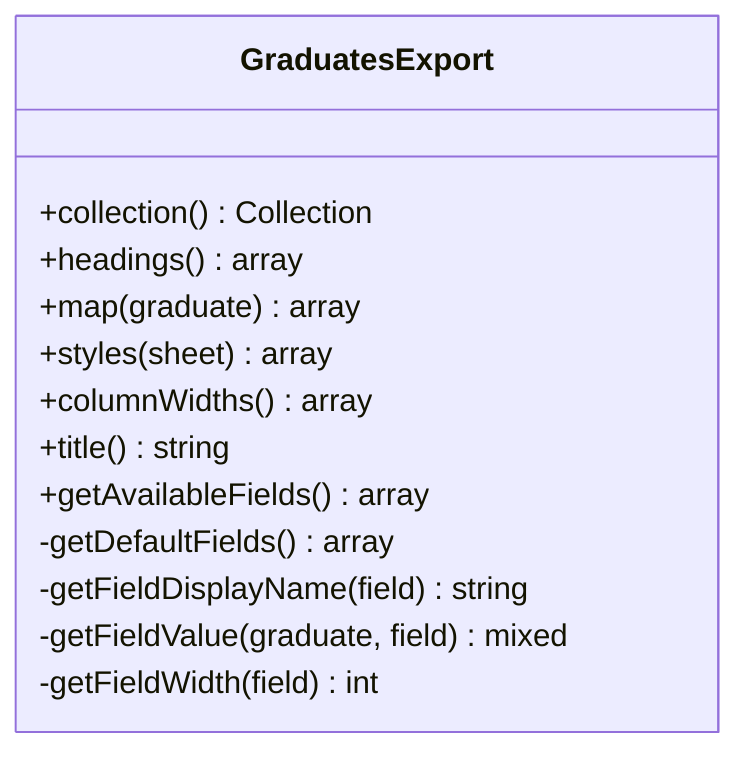
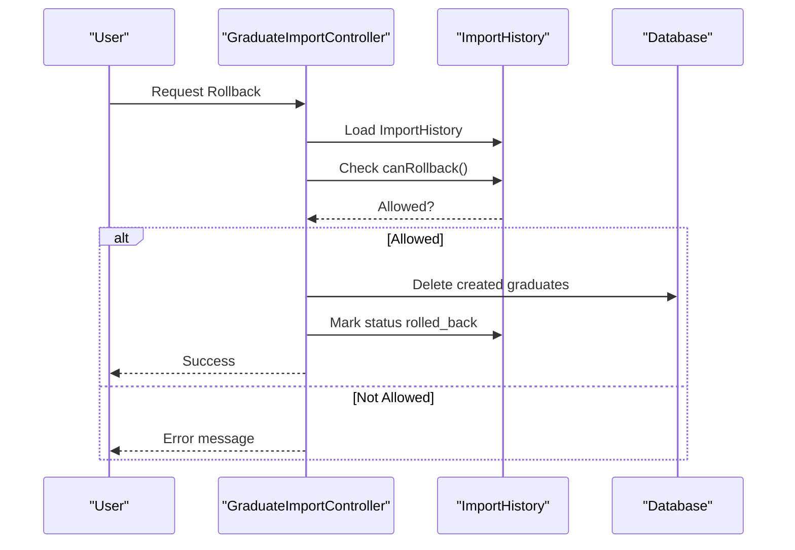
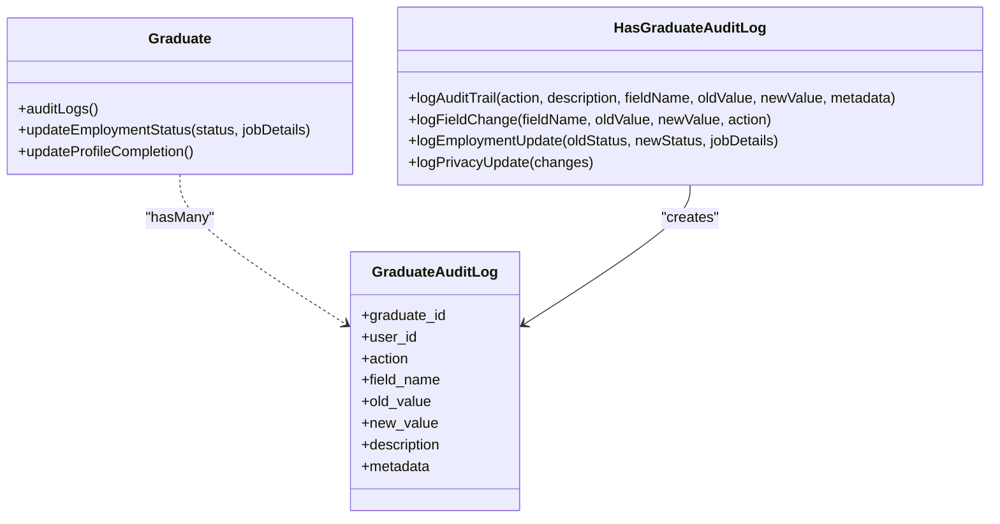
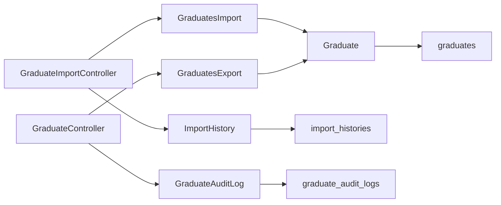

# Import & Export System

<cite>
**Referenced Files in This Document**
- [GraduatesImport.php](file://app/Imports/GraduatesImport.php)
- [GraduatesExport.php](file://app/Exports/GraduatesExport.php)
- [GraduateController.php](file://app/Http/Controllers/GraduateController.php)
- [GraduateImportController.php](file://app/Http/Controllers/GraduateImportController.php)
- [ImportHistory.php](file://app/Models/ImportHistory.php)
- [Graduate.php](file://app/Models/Graduate.php)
- [web.php](file://routes/web.php)
- [2025_01_19_143500_create_import_histories_table.php](file://database/migrations/2025_01_19_143500_create_import_histories_table.php)
- [HasGraduateAuditLog.php](file://app/Traits/HasGraduateAuditLog.php)
- [GraduateAuditLog.php](file://app/Models/GraduateAuditLog.php)
</cite>

## Table of Contents
1. [Introduction](#introduction)
2. [Project Structure](#project-structure)
3. [Core Components](#core-components)
4. [Architecture Overview](#architecture-overview)
5. [Detailed Component Analysis](#detailed-component-analysis)
6. [Dependency Analysis](#dependency-analysis)
7. [Performance Considerations](#performance-considerations)
8. [Troubleshooting Guide](#troubleshooting-guide)
9. [Conclusion](#conclusion)

## Introduction
This document describes the graduate data import and export system, focusing on Excel-based import with validation, duplicate detection, and error handling, alongside a comprehensive export system for alumni reports. It explains supported Excel formats, data mapping procedures, validation workflows, error reporting, import history tracking, audit trails, and data quality assurance processes.

## Project Structure
The import/export system spans PHP backend components, database models, routing, and Laravel Excel integration:

- Import pipeline: Excel upload → preview validation → structured import → persistence with conflict resolution → import history tracking
- Export pipeline: Filtered query → mapped fields → Excel/CSV/PDF generation
- Audit and quality: Validation rules, duplicate detection, conflict resolution, and audit logs

**Diagram sources**
- [GraduateImportController.php:15-310](file://app/Http/Controllers/GraduateImportController.php#L15-L310)
- [GraduateController.php:13-389](file://app/Http/Controllers/GraduateController.php#L13-L389)
- [GraduatesImport.php:16-402](file://app/Imports/GraduatesImport.php#L16-L402)
- [GraduatesExport.php:17-358](file://app/Exports/GraduatesExport.php#L17-L358)
- [ImportHistory.php:8-69](file://app/Models/ImportHistory.php#L8-L69)
- [Graduate.php:11-243](file://app/Models/Graduate.php#L11-L243)
- [GraduateAuditLog.php:8-37](file://app/Models/GraduateAuditLog.php#L8-L37)

**Section sources**
- [web.php:192-200](file://routes/web.php#L192-L200)
- [web.php:189-191](file://routes/web.php#L189-L191)

## Core Components
- GraduatesImport: Validates rows, detects duplicates, resolves conflicts, processes complex fields, and tracks statistics
- GraduatesExport: Filters and maps graduate data into configurable fields for Excel/CSV/PDF
- GraduateImportController: Manages import lifecycle (preview, store, rollback)
- GraduateController: Provides export endpoint and field metadata
- ImportHistory: Tracks import runs, statuses, and results
- Graduate model: Core entity with profile completion and audit logging
- Audit traits/models: Capture field changes and employment updates

**Section sources**
- [GraduatesImport.php:16-402](file://app/Imports/GraduatesImport.php#L16-L402)
- [GraduatesExport.php:17-358](file://app/Exports/GraduatesExport.php#L17-L358)
- [GraduateImportController.php:15-310](file://app/Http/Controllers/GraduateImportController.php#L15-L310)
- [GraduateController.php:13-389](file://app/Http/Controllers/GraduateController.php#L13-L389)
- [ImportHistory.php:8-69](file://app/Models/ImportHistory.php#L8-L69)
- [Graduate.php:11-243](file://app/Models/Graduate.php#L11-L243)
- [HasGraduateAuditLog.php:8-59](file://app/Traits/HasGraduateAuditLog.php#L8-L59)
- [GraduateAuditLog.php:8-37](file://app/Models/GraduateAuditLog.php#L8-L37)

## Architecture Overview
The system integrates user actions with Laravel Excel and Eloquent ORM. Import follows a staged workflow with preview and conflict resolution. Export supports filtering and customizable field selection.

**Diagram sources**
- [web.php:195-199](file://routes/web.php#L195-L199)
- [GraduateImportController.php:131-260](file://app/Http/Controllers/GraduateImportController.php#L131-L260)
- [GraduatesImport.php:52-108](file://app/Imports/GraduatesImport.php#L52-L108)

**Section sources**
- [web.php:192-200](file://routes/web.php#L192-L200)
- [GraduateImportController.php:131-260](file://app/Http/Controllers/GraduateImportController.php#L131-L260)
- [GraduatesImport.php:52-108](file://app/Imports/GraduatesImport.php#L52-L108)

## Detailed Component Analysis

### Import Pipeline: GraduatesImport
- Validation rules enforce required fields and data types; course existence is validated via foreign key constraint
- Duplicate detection includes exact matches (email/student_id) and fuzzy similarity for name/year
- Conflict resolution supports per-row overrides and global options (skip/update)
- Complex fields processed: skills as array, certifications as structured array, privacy defaults, boolean normalization
- Statistics tracked: processed, created, updated, skipped; invalid rows and conflicts recorded

**Diagram sources**
- [GraduatesImport.php:191-236](file://app/Imports/GraduatesImport.php#L191-L236)
- [GraduatesImport.php:238-270](file://app/Imports/GraduatesImport.php#L238-L270)
- [GraduatesImport.php:326-374](file://app/Imports/GraduatesImport.php#L326-L374)

**Section sources**
- [GraduatesImport.php:191-236](file://app/Imports/GraduatesImport.php#L191-L236)
- [GraduatesImport.php:238-270](file://app/Imports/GraduatesImport.php#L238-L270)
- [GraduatesImport.php:326-374](file://app/Imports/GraduatesImport.php#L326-L374)

### Export Pipeline: GraduatesExport
- Filtering: course_id, graduation_year range, employment_status, job_search_active, allow_employer_contact, gpa_min/max, created_at range, free-text search
- Field mapping: transforms nested employment and certifications into readable strings; normalizes booleans and dates
- Customizable fields: grouped categories (basic info, academic, employment, skills/certifications, preferences, system)
- Output: Excel (default), CSV, PDF via Laravel Excel

**Diagram sources**
- [GraduatesExport.php:17-358](file://app/Exports/GraduatesExport.php#L17-L358)

**Section sources**
- [GraduatesExport.php:32-99](file://app/Exports/GraduatesExport.php#L32-L99)
- [GraduatesExport.php:115-124](file://app/Exports/GraduatesExport.php#L115-L124)
- [GraduatesExport.php:161-185](file://app/Exports/GraduatesExport.php#L161-L185)
- [GraduatesExport.php:317-356](file://app/Exports/GraduatesExport.php#L317-L356)

### Import History and Rollback
- ImportHistory captures user, file metadata, counts, and detailed arrays for valid/invalid/conflict rows
- Rollback available within 24 hours for successful imports that created records
- Controller enforces ownership and status checks before rollback

**Diagram sources**
- [GraduateImportController.php:274-308](file://app/Http/Controllers/GraduateImportController.php#L274-L308)
- [ImportHistory.php:62-68](file://app/Models/ImportHistory.php#L62-L68)

**Section sources**
- [ImportHistory.php:8-69](file://app/Models/ImportHistory.php#L8-L69)
- [GraduateImportController.php:274-308](file://app/Http/Controllers/GraduateImportController.php#L274-L308)

### Audit Trail and Data Quality Assurance
- Graduate model integrates audit logging via trait for profile and employment changes
- Audit log entries include action, field, old/new values, and optional metadata
- Export includes last profile/employment update timestamps for quality tracking

**Diagram sources**
- [HasGraduateAuditLog.php:8-59](file://app/Traits/HasGraduateAuditLog.php#L8-L59)
- [GraduateAuditLog.php:8-37](file://app/Models/GraduateAuditLog.php#L8-L37)
- [Graduate.php:91-94](file://app/Models/Graduate.php#L91-L94)

**Section sources**
- [HasGraduateAuditLog.php:10-57](file://app/Traits/HasGraduateAuditLog.php#L10-L57)
- [GraduateAuditLog.php:12-25](file://app/Models/GraduateAuditLog.php#L12-L25)
- [Graduate.php:219-221](file://app/Models/Graduate.php#L219-L221)

## Dependency Analysis
- Controllers depend on Laravel Excel facades and import/export classes
- Import class depends on models for validation, persistence, and tenant scoping
- Export class queries graduates with related course/user data and applies filters
- ImportHistory persists import lifecycle and results
- Audit logging is decoupled via traits and models

**Diagram sources**
- [GraduateImportController.php:15-310](file://app/Http/Controllers/GraduateImportController.php#L15-L310)
- [GraduateController.php:13-389](file://app/Http/Controllers/GraduateController.php#L13-L389)
- [GraduatesImport.php:16-402](file://app/Imports/GraduatesImport.php#L16-L402)
- [GraduatesExport.php:17-358](file://app/Exports/GraduatesExport.php#L17-L358)
- [ImportHistory.php:8-69](file://app/Models/ImportHistory.php#L8-L69)
- [Graduate.php:11-243](file://app/Models/Graduate.php#L11-L243)
- [GraduateAuditLog.php:8-37](file://app/Models/GraduateAuditLog.php#L8-L37)

**Section sources**
- [web.php:189-191](file://routes/web.php#L189-L191)
- [web.php:195-199](file://routes/web.php#L195-L199)

## Performance Considerations
- Import processing: Use chunked reads for large files; leverage database transactions to minimize overhead
- Export filtering: Apply database-side filters to reduce memory footprint; paginate large result sets
- Indexing: Ensure indexes on frequently filtered columns (course_id, graduation_year, employment_status, created_at)
- Complexity: Similarity calculations for duplicates are O(n) per row; consider caching or pre-filtering for very large datasets

## Troubleshooting Guide
Common issues and resolutions:
- Missing required columns in Excel: The preview step validates required headers and reports missing fields
- Validation failures: Invalid rows are captured with detailed error messages; review invalid_rows in import statistics
- Duplicate records: Conflicts are detected and reported; choose skip or update behavior per row or globally
- Rollback eligibility: Rollback is only allowed within 24 hours after completion and only for imports that created records
- Export errors: Controller wraps export in try/catch and returns user-friendly error messages

**Section sources**
- [GraduateImportController.php:131-188](file://app/Http/Controllers/GraduateImportController.php#L131-L188)
- [GraduateImportController.php:190-260](file://app/Http/Controllers/GraduateImportController.php#L190-L260)
- [ImportHistory.php:62-68](file://app/Models/ImportHistory.php#L62-L68)
- [GraduateController.php:334-372](file://app/Http/Controllers/GraduateController.php#L334-L372)

## Conclusion
The graduate import/export system provides robust, auditable, and scalable capabilities for managing alumni data. It ensures data quality through validation and duplicate detection, offers flexible export options with filtering and field customization, and maintains comprehensive import history and audit trails for accountability and recovery.