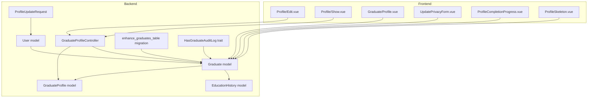
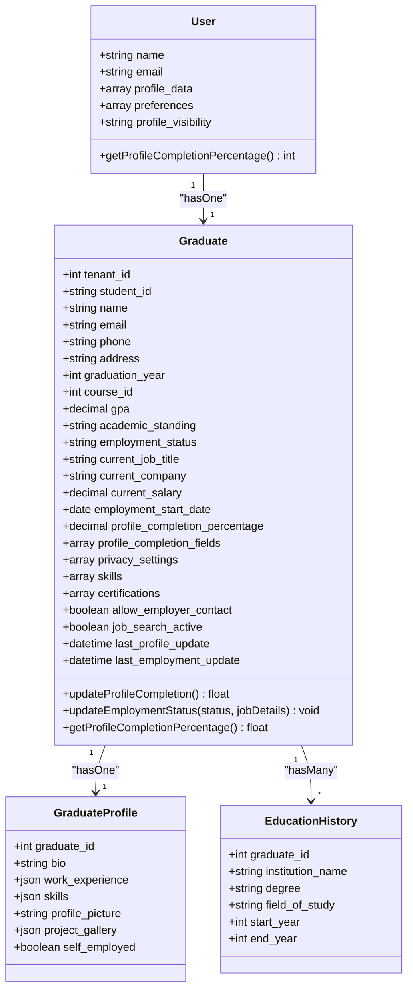
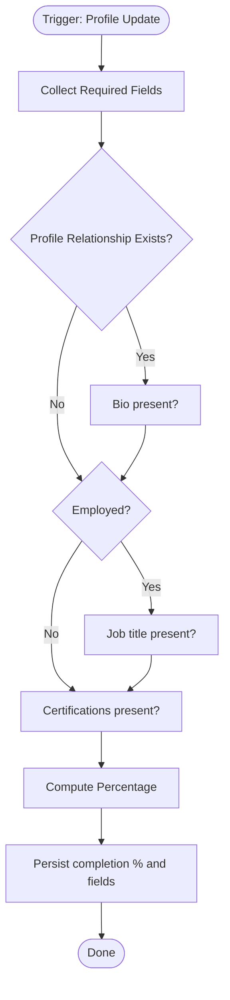
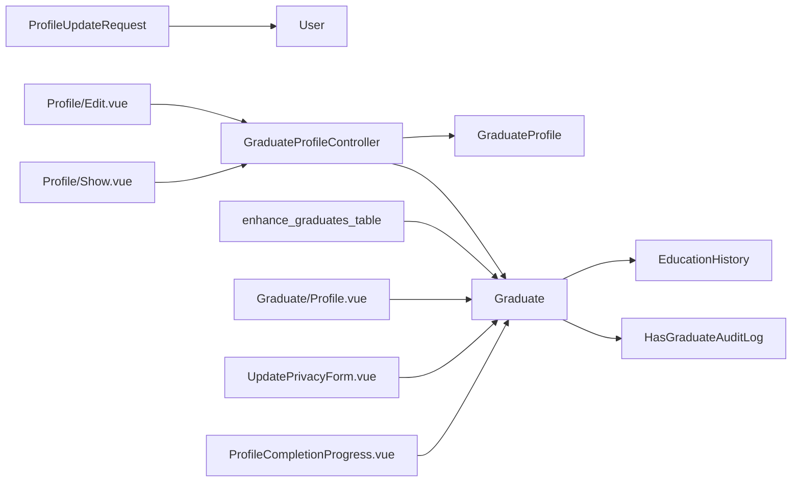
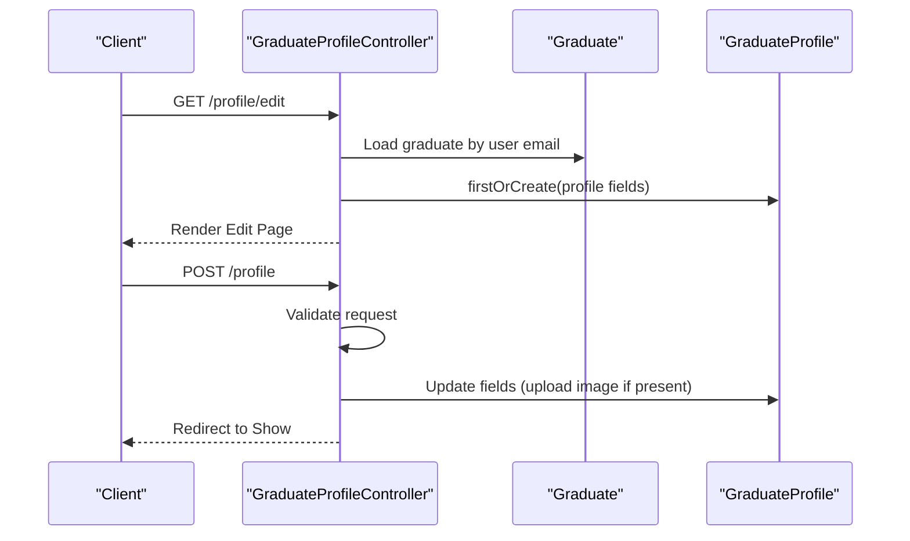

# Profile Management

<cite>
**Referenced Files in This Document**
- [GraduateProfile.php](file://app/Models/GraduateProfile.php)
- [Graduate.php](file://app/Models/Graduate.php)
- [User.php](file://app/Models/User.php)
- [EducationHistory.php](file://app/Models/EducationHistory.php)
- [GraduateProfileController.php](file://app/Http/Controllers/GraduateProfileController.php)
- [ProfileUpdateRequest.php](file://app/Http/Requests/Settings/ProfileUpdateRequest.php)
- [2025_07_15_000001_enhance_graduates_table.php](file://database/migrations/tenant/2025_07_15_000001_enhance_graduates_table.php)
- [HasGraduateAuditLog.php](file://app/Traits/HasGraduateAuditLog.php)
- [Profile.vue](file://resources/js/Pages/Graduate/Profile.vue)
- [UpdatePrivacyForm.vue](file://resources/js/Pages/Graduates/Partials/UpdatePrivacyForm.vue)
- [ProfileCompletionProgress.vue](file://resources/js/Pages/Graduates/Partials/ProfileCompletionProgress.vue)
- [Edit.vue](file://resources/js/Pages/Profile/Edit.vue)
- [Show.vue](file://resources/js/Pages/Profile/Show.vue)
- [ProfileSkeleton.vue](file://resources/js/components/Performance/Skeletons/ProfileSkeleton.vue)
- [SkillsProfile.vue](file://resources/js/components/SkillsProfile.vue)
- [WorkExperienceFactory.php](file://database/factories/WorkExperienceFactory.php)
</cite>

## Table of Contents
1. [Introduction](#introduction)
2. [Project Structure](#project-structure)
3. [Core Components](#core-components)
4. [Architecture Overview](#architecture-overview)
5. [Detailed Component Analysis](#detailed-component-analysis)
6. [Dependency Analysis](#dependency-analysis)
7. [Performance Considerations](#performance-considerations)
8. [Troubleshooting Guide](#troubleshooting-guide)
9. [Conclusion](#conclusion)
10. [Appendices](#appendices)

## Introduction
This document describes the graduate profile management functionality, covering the complete profile structure, profile completion tracking, privacy controls, and profile enhancement workflows. It explains how the User model relates to the Graduate and GraduateProfile models, how data is validated and persisted, and how the system integrates with career tracking features such as employment status updates and skills/certifications capture. The document also outlines editing interfaces, data validation processes, and privacy visibility settings.

## Project Structure
The graduate profile system spans backend Eloquent models, controllers, requests, migrations, traits, and frontend pages/components. The key backend components are:
- Models: User, Graduate, GraduateProfile, EducationHistory
- Controller: GraduateProfileController
- Request: ProfileUpdateRequest
- Migration: enhance_graduates_table
- Trait: HasGraduateAuditLog
- Frontend: Vue pages and partials for profile editing, viewing, privacy settings, and completion progress

**Diagram sources**
- [GraduateProfileController.php:1-60](file://app/Http/Controllers/GraduateProfileController.php#L1-L60)
- [Graduate.php:1-243](file://app/Models/Graduate.php#L1-L243)
- [GraduateProfile.php:1-27](file://app/Models/GraduateProfile.php#L1-L27)
- [EducationHistory.php:1-61](file://app/Models/EducationHistory.php#L1-L61)
- [User.php:1-818](file://app/Models/User.php#L1-L818)
- [2025_07_15_000001_enhance_graduates_table.php:1-115](file://database/migrations/tenant/2025_07_15_000001_enhance_graduates_table.php#L1-L115)
- [HasGraduateAuditLog.php:1-59](file://app/Traits/HasGraduateAuditLog.php#L1-L59)
- [Profile.vue](file://resources/js/Pages/Graduate/Profile.vue)
- [UpdatePrivacyForm.vue](file://resources/js/Pages/Graduates/Partials/UpdatePrivacyForm.vue)
- [ProfileCompletionProgress.vue](file://resources/js/Pages/Graduates/Partials/ProfileCompletionProgress.vue)
- [Edit.vue](file://resources/js/Pages/Profile/Edit.vue)
- [Show.vue](file://resources/js/Pages/Profile/Show.vue)
- [SkillsProfile.vue](file://resources/js/components/SkillsProfile.vue)
- [ProfileSkeleton.vue](file://resources/js/components/Performance/Skeletons/ProfileSkeleton.vue)

**Section sources**
- [GraduateProfileController.php:1-60](file://app/Http/Controllers/GraduateProfileController.php#L1-L60)
- [Graduate.php:1-243](file://app/Models/Graduate.php#L1-L243)
- [GraduateProfile.php:1-27](file://app/Models/GraduateProfile.php#L1-L27)
- [EducationHistory.php:1-61](file://app/Models/EducationHistory.php#L1-L61)
- [User.php:1-818](file://app/Models/User.php#L1-L818)
- [2025_07_15_000001_enhance_graduates_table.php:1-115](file://database/migrations/tenant/2025_07_15_000001_enhance_graduates_table.php#L1-L115)
- [HasGraduateAuditLog.php:1-59](file://app/Traits/HasGraduateAuditLog.php#L1-L59)

## Core Components
- GraduateProfile model: Stores personal profile data linked to a Graduate record (bio, work experience, skills, profile picture, project gallery, self-employed flag).
- Graduate model: Central profile entity with employment status, job details, GPA, academic standing, skills, certifications, privacy settings, profile completion tracking, and job search preferences.
- User model: Authenticatable user with profile data, location privacy, profile visibility, and profile completion calculation.
- EducationHistory model: Academic history entries linked to graduates.
- GraduateProfileController: Handles profile show/edit/update flows for authenticated graduates.
- ProfileUpdateRequest: Validates user profile updates (name, email uniqueness).
- enhance_graduates_table migration: Adds employment tracking, profile completion fields, privacy settings, skills/certifications, contact preferences, and timestamps.
- HasGraduateAuditLog trait: Provides audit logging for profile changes, employment updates, and privacy changes.

**Section sources**
- [GraduateProfile.php:12-26](file://app/Models/GraduateProfile.php#L12-L26)
- [Graduate.php:15-58](file://app/Models/Graduate.php#L15-L58)
- [User.php:20-77](file://app/Models/User.php#L20-L77)
- [EducationHistory.php:12-29](file://app/Models/EducationHistory.php#L12-L29)
- [GraduateProfileController.php:13-58](file://app/Http/Controllers/GraduateProfileController.php#L13-L58)
- [ProfileUpdateRequest.php:16-29](file://app/Http/Requests/Settings/ProfileUpdateRequest.php#L16-L29)
- [2025_07_15_000001_enhance_graduates_table.php:14-84](file://database/migrations/tenant/2025_07_15_000001_enhance_graduates_table.php#L14-L84)
- [HasGraduateAuditLog.php:10-57](file://app/Traits/HasGraduateAuditLog.php#L10-L57)

## Architecture Overview
The graduate profile architecture connects User, Graduate, and GraduateProfile entities, with controller-driven flows for editing and viewing. Employment and skills data are stored in the Graduate model, while the GraduateProfile model stores additional personal profile assets. Privacy settings and profile completion metrics are computed and persisted in the Graduate model. Audit trails capture changes for compliance and transparency.

**Diagram sources**
- [User.php:20-132](file://app/Models/User.php#L20-L132)
- [Graduate.php:15-94](file://app/Models/Graduate.php#L15-L94)
- [GraduateProfile.php:12-25](file://app/Models/GraduateProfile.php#L12-L25)
- [EducationHistory.php:12-34](file://app/Models/EducationHistory.php#L12-L34)

## Detailed Component Analysis

### Graduate Profile Structure
The graduate profile encompasses:
- Personal information: name, email, phone, address, profile picture, bio, website, location, interests.
- Education history: institution name, degree, field of study, start/end years.
- Work experience: JSON structure capturing roles, companies, dates, industry, employment type, skills used, achievements.
- Skills assessment: JSON array of skills with proficiency metadata.
- Certifications: JSON array of certifications with issuer, date obtained, expiry date.
- Professional achievements: JSON achievements captured per role.
- Privacy controls: profile visibility, contact visibility, employment visibility.
- Employment tracking: employment status, current job title/company/salary, start date, job search active flag.
- Profile completion: percentage and tracked fields, timestamps for last updates.

Implementation highlights:
- Graduate model fields and casts define the profile schema and data types.
- Migration adds and maintains all profile-related columns.
- GraduateProfile model complements Graduate with personal profile assets.
- EducationHistory captures academic timeline.

**Section sources**
- [Graduate.php:15-58](file://app/Models/Graduate.php#L15-L58)
- [2025_07_15_000001_enhance_graduates_table.php:14-84](file://database/migrations/tenant/2025_07_15_000001_enhance_graduates_table.php#L14-L84)
- [GraduateProfile.php:12-20](file://app/Models/GraduateProfile.php#L12-L20)
- [EducationHistory.php:12-24](file://app/Models/EducationHistory.php#L12-L24)

### Profile Completion Tracking
The system tracks profile completion with:
- A dedicated method that evaluates required fields and optional profile fields.
- A percentage score stored in the Graduate model.
- A list of completed fields for audit and UI progress indication.
- Automatic recalculation upon profile and employment updates.

**Diagram sources**
- [Graduate.php:138-189](file://app/Models/Graduate.php#L138-L189)

**Section sources**
- [Graduate.php:138-189](file://app/Models/Graduate.php#L138-L189)

### Privacy Controls and Visibility Settings
Privacy settings are managed per graduate and include:
- Profile visibility toggle for employer discoverability.
- Contact visibility to show email/phone to employers.
- Employment visibility to share current status and job details.
- Audit logging for privacy setting changes.

Frontend components:
- Privacy settings panel with toggles and notices.
- Real-time status badges reflecting visibility states.

**Section sources**
- [Graduate.php:31-58](file://app/Models/Graduate.php#L31-L58)
- [UpdatePrivacyForm.vue:32-112](file://resources/js/Pages/Graduates/Partials/UpdatePrivacyForm.vue#L32-L112)

### Profile Enhancement Workflows
Enhancement workflows include:
- Editing personal information and profile picture.
- Updating work experience, skills, and certifications.
- Managing employment status with job details capture.
- Updating privacy settings with audit trail.
- Viewing profile completion progress and suggestions.

Controller actions:
- Show: loads graduate and profile, determines hiring status.
- Edit: renders edit page with current data.
- Update: validates and persists profile changes, handles image upload.

**Section sources**
- [GraduateProfileController.php:13-58](file://app/Http/Controllers/GraduateProfileController.php#L13-L58)

### Data Validation Processes
Validation ensures data integrity:
- User profile updates enforce unique email constraint per user.
- Graduate profile updates validate bio, work experience JSON, skills JSON, and profile picture constraints.
- Employment status updates validate job details when applicable.

**Section sources**
- [ProfileUpdateRequest.php:16-29](file://app/Http/Requests/Settings/ProfileUpdateRequest.php#L16-L29)
- [GraduateProfileController.php:44-53](file://app/Http/Controllers/GraduateProfileController.php#L44-L53)

### Integration with Career Tracking Systems
Career tracking integrations:
- Employment status updates trigger profile completion recalculation.
- Skills and certifications are stored for matching and analytics.
- Job search active flag influences visibility and matching.
- Audit logs capture employment and privacy changes for compliance.

**Section sources**
- [Graduate.php:191-221](file://app/Models/Graduate.php#L191-L221)
- [HasGraduateAuditLog.php:34-57](file://app/Traits/HasGraduateAuditLog.php#L34-L57)

### Frontend Interfaces and UX Patterns
Frontend pages and components:
- Profile editing page with form partials for safe, incremental updates.
- Profile show page displaying personal info, education, work experience, skills, certifications, and privacy settings.
- Progress indicator component for profile completion.
- Skeleton loading for improved perceived performance.
- Skills profile component for structured skills display.

**Section sources**
- [Edit.vue](file://resources/js/Pages/Profile/Edit.vue)
- [Show.vue](file://resources/js/Pages/Profile/Show.vue)
- [Profile.vue](file://resources/js/Pages/Graduate/Profile.vue)
- [ProfileCompletionProgress.vue](file://resources/js/Pages/Graduates/Partials/ProfileCompletionProgress.vue)
- [ProfileSkeleton.vue](file://resources/js/components/Performance/Skeletons/ProfileSkeleton.vue)
- [SkillsProfile.vue](file://resources/js/components/SkillsProfile.vue)

## Dependency Analysis
The graduate profile system exhibits clear separation of concerns:
- Models encapsulate data and relationships.
- Controller mediates between models and views.
- Requests validate input.
- Migration defines schema evolution.
- Trait centralizes audit logging.
- Frontend pages consume controller-provided data.

**Diagram sources**
- [ProfileUpdateRequest.php:16-29](file://app/Http/Requests/Settings/ProfileUpdateRequest.php#L16-L29)
- [GraduateProfileController.php:13-58](file://app/Http/Controllers/GraduateProfileController.php#L13-L58)
- [Graduate.php:60-94](file://app/Models/Graduate.php#L60-L94)
- [EducationHistory.php:26-34](file://app/Models/EducationHistory.php#L26-L34)
- [HasGraduateAuditLog.php:10-57](file://app/Traits/HasGraduateAuditLog.php#L10-L57)
- [2025_07_15_000001_enhance_graduates_table.php:14-84](file://database/migrations/tenant/2025_07_15_000001_enhance_graduates_table.php#L14-L84)
- [Edit.vue](file://resources/js/Pages/Profile/Edit.vue)
- [Show.vue](file://resources/js/Pages/Profile/Show.vue)
- [Profile.vue](file://resources/js/Pages/Graduate/Profile.vue)
- [UpdatePrivacyForm.vue](file://resources/js/Pages/Graduates/Partials/UpdatePrivacyForm.vue)
- [ProfileCompletionProgress.vue](file://resources/js/Pages/Graduates/Partials/ProfileCompletionProgress.vue)

**Section sources**
- [GraduateProfileController.php:13-58](file://app/Http/Controllers/GraduateProfileController.php#L13-L58)
- [Graduate.php:60-94](file://app/Models/Graduate.php#L60-L94)
- [EducationHistory.php:26-34](file://app/Models/EducationHistory.php#L26-L34)
- [HasGraduateAuditLog.php:10-57](file://app/Traits/HasGraduateAuditLog.php#L10-L57)
- [2025_07_15_000001_enhance_graduates_table.php:14-84](file://database/migrations/tenant/2025_07_15_000001_enhance_graduates_table.php#L14-L84)

## Performance Considerations
- Use lazy loading and selective eager loading for related models to minimize N+1 queries.
- Store large JSON fields (work experience, skills, certifications) efficiently and index where appropriate.
- Cache frequently accessed profile completion percentages and privacy settings.
- Paginate long lists (e.g., audit logs) and use server-side filtering for large datasets.
- Optimize image uploads for profile pictures with resizing and CDN delivery.

## Troubleshooting Guide
Common issues and resolutions:
- Profile completion not updating after edits: verify the update triggers the completion recalculation method and that required fields are populated.
- Privacy settings not persisting: check the privacy settings payload structure and ensure the migration columns exist.
- Employment status changes not reflected: confirm the employment status update method is called and that job details are provided when applicable.
- Audit logs missing: ensure the audit trait methods are invoked on relevant changes.

**Section sources**
- [Graduate.php:138-189](file://app/Models/Graduate.php#L138-L189)
- [Graduate.php:191-221](file://app/Models/Graduate.php#L191-L221)
- [HasGraduateAuditLog.php:10-57](file://app/Traits/HasGraduateAuditLog.php#L10-L57)

## Conclusion
The graduate profile management system provides a robust foundation for storing, validating, and exposing comprehensive graduate information. It supports employment tracking, skills and certifications capture, privacy controls, and profile completion metrics. The architecture cleanly separates concerns across models, controllers, requests, migrations, traits, and frontend components, enabling scalable enhancements and integrations with career tracking systems.

## Appendices

### Data Model Definitions
- Graduate model fields include employment status, job details, GPA, academic standing, skills, certifications, privacy settings, and completion metrics.
- GraduateProfile model fields include bio, work experience, skills, profile picture, project gallery, and self-employed flag.
- EducationHistory model fields capture academic timeline details.

**Section sources**
- [Graduate.php:15-58](file://app/Models/Graduate.php#L15-L58)
- [GraduateProfile.php:12-20](file://app/Models/GraduateProfile.php#L12-L20)
- [EducationHistory.php:12-24](file://app/Models/EducationHistory.php#L12-L24)

### Controller Interaction Sequence

**Diagram sources**
- [GraduateProfileController.php:28-58](file://app/Http/Controllers/GraduateProfileController.php#L28-L58)