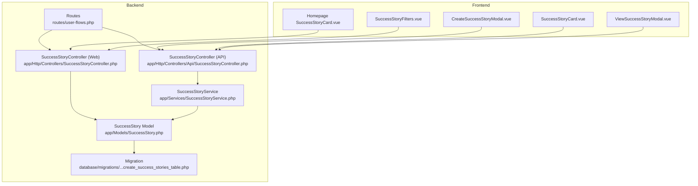
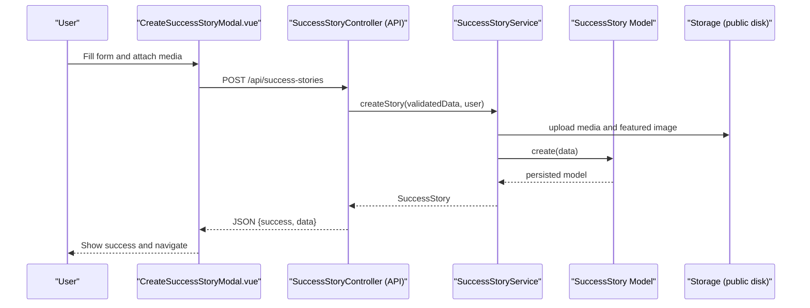
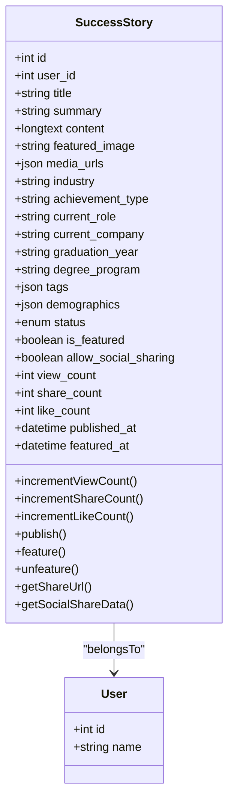
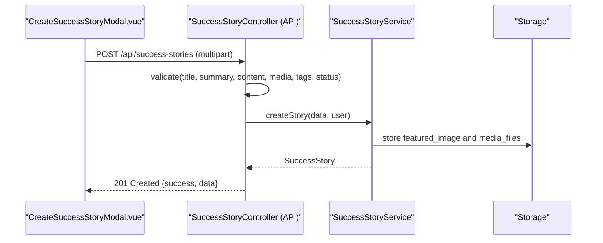
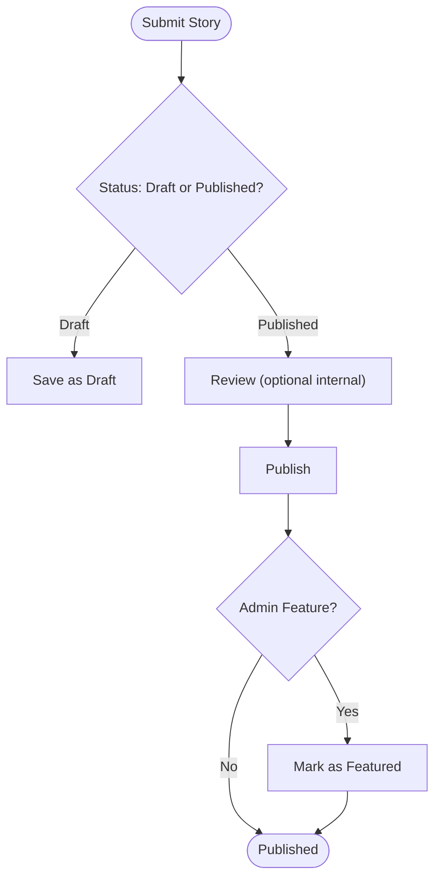
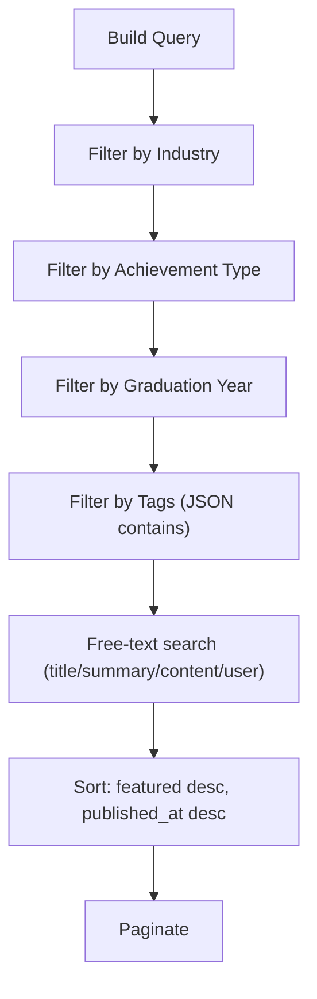
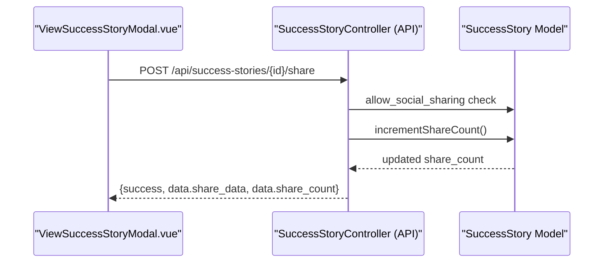
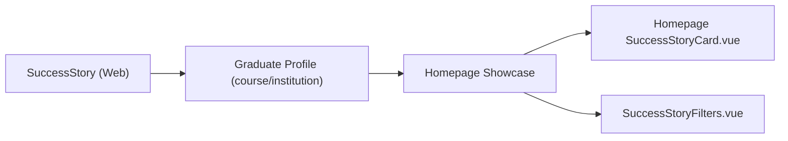
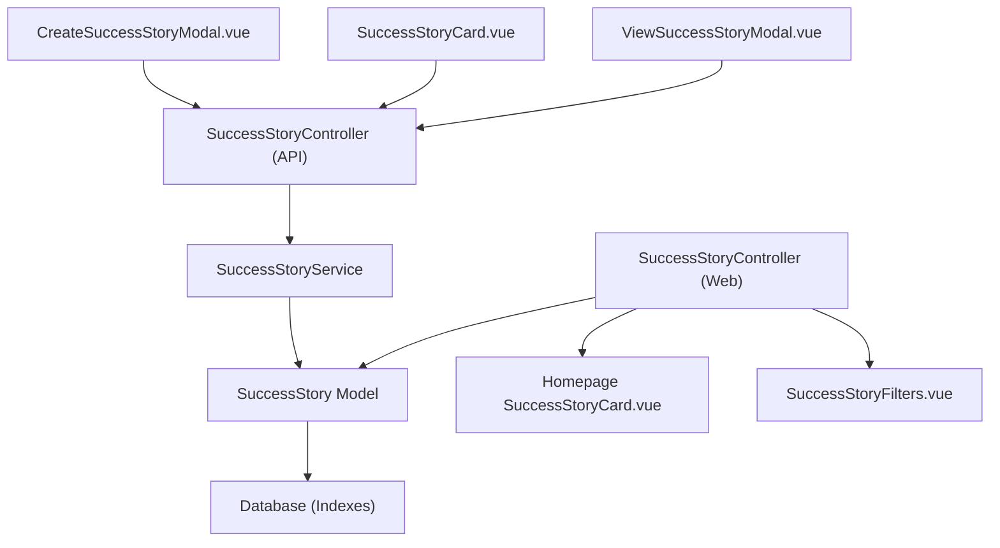

# Success Stories

<cite>
**Referenced Files in This Document**
- [SuccessStory.php](file://app/Models/SuccessStory.php)
- [SuccessStoryService.php](file://app/Services/SuccessStoryService.php)
- [SuccessStoryController.php (API)](file://app/Http/Controllers/Api/SuccessStoryController.php)
- [SuccessStoryController.php (Web)](file://app/Http/Controllers/SuccessStoryController.php)
- [create_success_stories_table.php](file://database/migrations/2025_08_01_102218_create_success_stories_table.php)
- [SuccessStoryFactory.php](file://database/factories/SuccessStoryFactory.php)
- [SuccessStorySeeder.php](file://database/seeders/SuccessStorySeeder.php)
- [SuccessStoryTest.php](file://tests/Feature/SuccessStoryTest.php)
- [CreateSuccessStoryModal.vue](file://resources/js/components/SuccessStories/CreateSuccessStoryModal.vue)
- [SuccessStoryCard.vue](file://resources/js/components/SuccessStories/SuccessStoryCard.vue)
- [ViewSuccessStoryModal.vue](file://resources/js/components/SuccessStories/ViewSuccessStoryModal.vue)
- [SuccessStoryCard.vue (Homepage)](file://resources/js/components/homepage/SuccessStoryCard.vue)
- [SuccessStoryFilters.vue](file://resources/js/components/homepage/SuccessStoryFilters.vue)
- [user-flows.php](file://routes/user-flows.php)
</cite>

## Table of Contents
1. [Introduction](#introduction)
2. [Project Structure](#project-structure)
3. [Core Components](#core-components)
4. [Architecture Overview](#architecture-overview)
5. [Detailed Component Analysis](#detailed-component-analysis)
6. [Dependency Analysis](#dependency-analysis)
7. [Performance Considerations](#performance-considerations)
8. [Troubleshooting Guide](#troubleshooting-guide)
9. [Conclusion](#conclusion)
10. [Appendices](#appendices)

## Introduction
This document explains the Success Stories feature end-to-end: submission, approval, moderation, publication, discovery, and engagement. It covers story formats, multimedia integration, social sharing, categorization and tagging, relationship to graduate profiles, impact metrics, and institutional showcase. It also documents the admin moderation controls, content guidelines enforcement, and community engagement features.

## Project Structure
The Success Stories feature spans Laravel backend models, controllers, services, and database migrations, plus Vue frontend components for creation, listing, viewing, and homepage showcase.

**Diagram sources**
- [SuccessStory.php:10-145](file://app/Models/SuccessStory.php#L10-L145)
- [SuccessStoryService.php:12-218](file://app/Services/SuccessStoryService.php#L12-L218)
- [SuccessStoryController.php (API):13-287](file://app/Http/Controllers/Api/SuccessStoryController.php#L13-L287)
- [SuccessStoryController.php (Web):12-240](file://app/Http/Controllers/SuccessStoryController.php#L12-L240)
- [create_success_stories_table.php:14-46](file://database/migrations/2025_08_01_102218_create_success_stories_table.php#L14-L46)
- [CreateSuccessStoryModal.vue:1-464](file://resources/js/components/SuccessStories/CreateSuccessStoryModal.vue#L1-L464)
- [SuccessStoryCard.vue:1-219](file://resources/js/components/SuccessStories/SuccessStoryCard.vue#L1-L219)
- [ViewSuccessStoryModal.vue:1-348](file://resources/js/components/SuccessStories/ViewSuccessStoryModal.vue#L1-L348)
- [SuccessStoryCard.vue (Homepage):1-607](file://resources/js/components/homepage/SuccessStoryCard.vue#L1-L607)
- [SuccessStoryFilters.vue:1-568](file://resources/js/components/homepage/SuccessStoryFilters.vue#L1-L568)
- [user-flows.php:95-110](file://routes/user-flows.php#L95-L110)

**Section sources**
- [SuccessStory.php:10-145](file://app/Models/SuccessStory.php#L10-L145)
- [SuccessStoryService.php:12-218](file://app/Services/SuccessStoryService.php#L12-L218)
- [SuccessStoryController.php (API):13-287](file://app/Http/Controllers/Api/SuccessStoryController.php#L13-L287)
- [SuccessStoryController.php (Web):12-240](file://app/Http/Controllers/SuccessStoryController.php#L12-L240)
- [create_success_stories_table.php:14-46](file://database/migrations/2025_08_01_102218_create_success_stories_table.php#L14-L46)
- [user-flows.php:95-110](file://routes/user-flows.php#L95-L110)

## Core Components
- SuccessStory model: Defines attributes, casts, relationships, scopes, counters, and publishing/featuring helpers.
- SuccessStoryService: Handles creation/update with media uploads, filtering, recommendations, demographics queries, and analytics.
- API controller: Validates and orchestrates CRUD, engagement actions (like/share), and admin toggles.
- Web controller: Renders public and authenticated pages, filters, and related stories.
- Frontend components: Submission modal, listing cards, detail modal, homepage showcase card, and filters.
- Database schema: Stores text content, media URLs, tags, demographics, status, counters, timestamps, and soft deletes.

**Section sources**
- [SuccessStory.php:14-145](file://app/Models/SuccessStory.php#L14-L145)
- [SuccessStoryService.php:14-218](file://app/Services/SuccessStoryService.php#L14-L218)
- [SuccessStoryController.php (API):44-287](file://app/Http/Controllers/Api/SuccessStoryController.php#L44-L287)
- [SuccessStoryController.php (Web):14-240](file://app/Http/Controllers/SuccessStoryController.php#L14-L240)
- [create_success_stories_table.php:16-39](file://database/migrations/2025_08_01_102218_create_success_stories_table.php#L16-L39)
- [CreateSuccessStoryModal.vue:19-296](file://resources/js/components/SuccessStories/CreateSuccessStoryModal.vue#L19-L296)
- [SuccessStoryCard.vue:1-219](file://resources/js/components/SuccessStories/SuccessStoryCard.vue#L1-L219)
- [ViewSuccessStoryModal.vue:1-348](file://resources/js/components/SuccessStories/ViewSuccessStoryModal.vue#L1-L348)
- [SuccessStoryCard.vue (Homepage):1-607](file://resources/js/components/homepage/SuccessStoryCard.vue#L1-L607)
- [SuccessStoryFilters.vue:1-568](file://resources/js/components/homepage/SuccessStoryFilters.vue#L1-L568)

## Architecture Overview
The feature follows a layered architecture:
- Routes define endpoints for API and web flows.
- Controllers validate requests and delegate to services.
- Services encapsulate business logic, including media handling, filtering, recommendations, and analytics.
- Models define persistence, scopes, and counters.
- Frontend components integrate with API endpoints for submission, listing, and engagement.

**Diagram sources**
- [user-flows.php:97-98](file://routes/user-flows.php#L97-L98)
- [SuccessStoryController.php (API):44-72](file://app/Http/Controllers/Api/SuccessStoryController.php#L44-L72)
- [SuccessStoryService.php:14-41](file://app/Services/SuccessStoryService.php#L14-L41)
- [SuccessStory.php:14-47](file://app/Models/SuccessStory.php#L14-L47)

## Detailed Component Analysis

### Data Model and Schema
- Attributes include title, summary, content, featured image, media URLs array, industry, achievement type, current role/company, graduation year/degree program, tags array, demographics JSON, status enum, featured flag, social sharing flag, and engagement counters.
- Scopes enable published and featured retrieval; filters support industry, achievement type, graduation year, and tags.
- Counters track views, likes, and shares; timestamps include published_at and featured_at.

**Diagram sources**
- [SuccessStory.php:14-145](file://app/Models/SuccessStory.php#L14-L145)
- [create_success_stories_table.php:16-39](file://database/migrations/2025_08_01_102218_create_success_stories_table.php#L16-L39)

**Section sources**
- [SuccessStory.php:14-145](file://app/Models/SuccessStory.php#L14-L145)
- [create_success_stories_table.php:16-39](file://database/migrations/2025_08_01_102218_create_success_stories_table.php#L16-L39)

### Submission and Creation Workflow
- Users submit stories via a modal that collects title, summary, achievement type, industry, current role/company, content, optional featured image, additional media, tags, sharing preference, and status (draft/published).
- The frontend posts multipart/form-data to the API endpoint, which validates fields and delegates to the service.
- The service handles file uploads to the public disk under dedicated folders and auto-fills user-related fields when missing.

**Diagram sources**
- [CreateSuccessStoryModal.vue:403-452](file://resources/js/components/SuccessStories/CreateSuccessStoryModal.vue#L403-L452)
- [SuccessStoryController.php (API):44-72](file://app/Http/Controllers/Api/SuccessStoryController.php#L44-L72)
- [SuccessStoryService.php:14-41](file://app/Services/SuccessStoryService.php#L14-L41)

**Section sources**
- [CreateSuccessStoryModal.vue:19-296](file://resources/js/components/SuccessStories/CreateSuccessStoryModal.vue#L19-L296)
- [SuccessStoryController.php (API):44-72](file://app/Http/Controllers/Api/SuccessStoryController.php#L44-L72)
- [SuccessStoryService.php:14-41](file://app/Services/SuccessStoryService.php#L14-L41)

### Approval, Publication, and Moderation
- Status lifecycle: draft → published (and optionally featured).
- Admin-only moderation: toggle feature/unfeature and access analytics.
- Engagement actions: like and share increment counters; share action returns structured social share data when enabled.

**Diagram sources**
- [SuccessStoryController.php (API):263-285](file://app/Http/Controllers/Api/SuccessStoryController.php#L263-L285)
- [SuccessStory.php:106-128](file://app/Models/SuccessStory.php#L106-L128)

**Section sources**
- [SuccessStoryController.php (API):243-285](file://app/Http/Controllers/Api/SuccessStoryController.php#L243-L285)
- [SuccessStory.php:106-128](file://app/Models/SuccessStory.php#L106-L128)

### Discovery, Filtering, and Recommendations
- API listing supports filters: industry, achievement_type, graduation_year, tags (JSON contains), and free-text search across title, summary, content, and author name.
- Sorting prioritizes featured stories first, then published_at descending.
- Recommended stories are personalized by industry or recent graduation year and ordered by popularity.
- Demographics-based queries enable diversity showcase.
- Web listing supports category, course, institution, and search; includes featured stories and filter options.

**Diagram sources**
- [SuccessStoryService.php:66-106](file://app/Services/SuccessStoryService.php#L66-L106)
- [SuccessStoryController.php (Web):14-69](file://app/Http/Controllers/SuccessStoryController.php#L14-L69)

**Section sources**
- [SuccessStoryService.php:66-146](file://app/Services/SuccessStoryService.php#L66-L146)
- [SuccessStoryController.php (Web):14-69](file://app/Http/Controllers/SuccessStoryController.php#L14-L69)

### Multimedia Integration and Social Sharing
- Media: featured image and additional media (images, videos, PDFs) uploaded to the public disk; stored as arrays of paths.
- Social sharing: per-story setting; when enabled, share increments share_count and returns share metadata for platforms.
- Frontend supports image/video previews, full-screen media modal, and opening documents in new tabs.

**Diagram sources**
- [ViewSuccessStoryModal.vue:1-348](file://resources/js/components/SuccessStories/ViewSuccessStoryModal.vue#L1-L348)
- [SuccessStoryController.php (API):203-222](file://app/Http/Controllers/Api/SuccessStoryController.php#L203-L222)
- [SuccessStory.php:130-143](file://app/Models/SuccessStory.php#L130-L143)

**Section sources**
- [SuccessStoryService.php:180-200](file://app/Services/SuccessStoryService.php#L180-L200)
- [SuccessStoryController.php (API):203-222](file://app/Http/Controllers/Api/SuccessStoryController.php#L203-L222)
- [ViewSuccessStoryModal.vue:86-116](file://resources/js/components/SuccessStories/ViewSuccessStoryModal.vue#L86-L116)

### Relationship to Graduate Profiles and Institutional Showcase
- Web controllers load related graduate profile data (course and institution) for display and similarity grouping.
- Homepage showcases cards enriched with alumni profile info, career progression, verified metrics, platform impact, and social sharing.
- Filters on the homepage support industry, graduation year, career stage, and success type.

**Diagram sources**
- [SuccessStoryController.php (Web):17-59](file://app/Http/Controllers/SuccessStoryController.php#L17-L59)
- [SuccessStoryCard.vue (Homepage):1-607](file://resources/js/components/homepage/SuccessStoryCard.vue#L1-L607)
- [SuccessStoryFilters.vue:1-568](file://resources/js/components/homepage/SuccessStoryFilters.vue#L1-L568)

**Section sources**
- [SuccessStoryController.php (Web):17-69](file://app/Http/Controllers/SuccessStoryController.php#L17-L69)
- [SuccessStoryCard.vue (Homepage):1-607](file://resources/js/components/homepage/SuccessStoryCard.vue#L1-L607)
- [SuccessStoryFilters.vue:1-568](file://resources/js/components/homepage/SuccessStoryFilters.vue#L1-L568)

### Content Guidelines and Community Engagement
- Validation enforces required fields, safe sizes for images and files, and acceptable status values.
- Unauthorized updates/deletes return 403; admin-only endpoints restrict feature toggles and analytics.
- Engagement counters (likes, shares, views) are incremented on demand or view.

**Section sources**
- [SuccessStoryController.php (API):91-148](file://app/Http/Controllers/Api/SuccessStoryController.php#L91-L148)
- [SuccessStoryController.php (API):243-285](file://app/Http/Controllers/Api/SuccessStoryController.php#L243-L285)
- [SuccessStoryTest.php:14-253](file://tests/Feature/SuccessStoryTest.php#L14-L253)

## Dependency Analysis
- Controllers depend on the service layer for business logic.
- Service depends on the model and storage for persistence and media handling.
- Frontend components communicate with API endpoints.
- Database schema defines indexes for performance on status/published_at, industry/achievement_type, is_featured/featured_at, and user_id/status.

**Diagram sources**
- [SuccessStoryController.php (API):22-39](file://app/Http/Controllers/Api/SuccessStoryController.php#L22-L39)
- [SuccessStoryService.php:12-218](file://app/Services/SuccessStoryService.php#L12-L218)
- [SuccessStory.php:10-145](file://app/Models/SuccessStory.php#L10-L145)
- [create_success_stories_table.php:42-46](file://database/migrations/2025_08_01_102218_create_success_stories_table.php#L42-L46)

**Section sources**
- [create_success_stories_table.php:42-46](file://database/migrations/2025_08_01_102218_create_success_stories_table.php#L42-L46)

## Performance Considerations
- Database indexes on status/published_at, industry/achievement_type, is_featured/featured_at, and user_id/status improve query performance for listings and filtering.
- Pagination limits reduce payload size; consider per_page parameter tuning.
- Media storage on public disk is suitable for web delivery; ensure CDN or optimized serving for large assets.
- JSON fields (tags, demographics) enable flexible categorization but require indexed lookups; use whereJsonContains judiciously.

[No sources needed since this section provides general guidance]

## Troubleshooting Guide
Common issues and resolutions:
- Unauthorized actions: Ensure proper authentication and roles for admin-only endpoints (feature toggle, analytics).
- Media upload failures: Verify file types and sizes; confirm public disk write permissions.
- Missing related data: Confirm graduate profile associations and course/institution joins for web listing.
- Search/filter mismatches: Validate filter keys and JSON field usage; ensure indexes exist for targeted columns.

**Section sources**
- [SuccessStoryController.php (API):91-148](file://app/Http/Controllers/Api/SuccessStoryController.php#L91-L148)
- [SuccessStoryController.php (API):243-285](file://app/Http/Controllers/Api/SuccessStoryController.php#L243-L285)
- [SuccessStoryService.php:180-200](file://app/Services/SuccessStoryService.php#L180-L200)
- [SuccessStoryController.php (Web):17-59](file://app/Http/Controllers/SuccessStoryController.php#L17-L59)

## Conclusion
The Success Stories feature integrates robust submission, moderation, discovery, and engagement capabilities. Its modular design separates concerns across controllers, services, and models, while frontend components deliver a rich user experience. The schema and indexes support scalable filtering and recommendations, and the admin endpoints enable oversight and insights.

## Appendices

### API Endpoints Summary
- POST /api/success-stories: Create story (multipart/form-data)
- PUT /api/success-stories/{story}: Update story (authorized owner or admin)
- DELETE /api/success-stories/{story}: Delete story (authorized owner or admin)
- GET /api/success-stories: List with filters and pagination
- GET /api/success-stories/featured: Featured stories
- GET /api/success-stories/recommended: Recommended stories
- POST /api/success-stories/{story}/like: Like story
- POST /api/success-stories/{story}/share: Share story (if allowed)
- POST /api/success-stories/{story}/feature: Admin toggle feature
- GET /api/success-stories/analytics: Admin analytics

**Section sources**
- [user-flows.php:97-102](file://routes/user-flows.php#L97-L102)
- [SuccessStoryController.php (API):22-287](file://app/Http/Controllers/Api/SuccessStoryController.php#L22-L287)

### Example Story Formats and Fields
- Title, Summary, Content, Industry, Achievement Type, Current Role, Current Company, Graduation Year, Degree Program, Tags, Demographics, Featured Image, Additional Media, Status, Allow Social Sharing.

**Section sources**
- [SuccessStoryController.php (API):46-63](file://app/Http/Controllers/Api/SuccessStoryController.php#L46-L63)
- [SuccessStoryService.php:14-41](file://app/Services/SuccessStoryService.php#L14-L41)

### Testing Coverage Highlights
- Creation, update, deletion, likes, shares, and analytics endpoints.
- Validation scenarios for unauthorized access and disallowed sharing.

**Section sources**
- [SuccessStoryTest.php:14-253](file://tests/Feature/SuccessStoryTest.php#L14-L253)