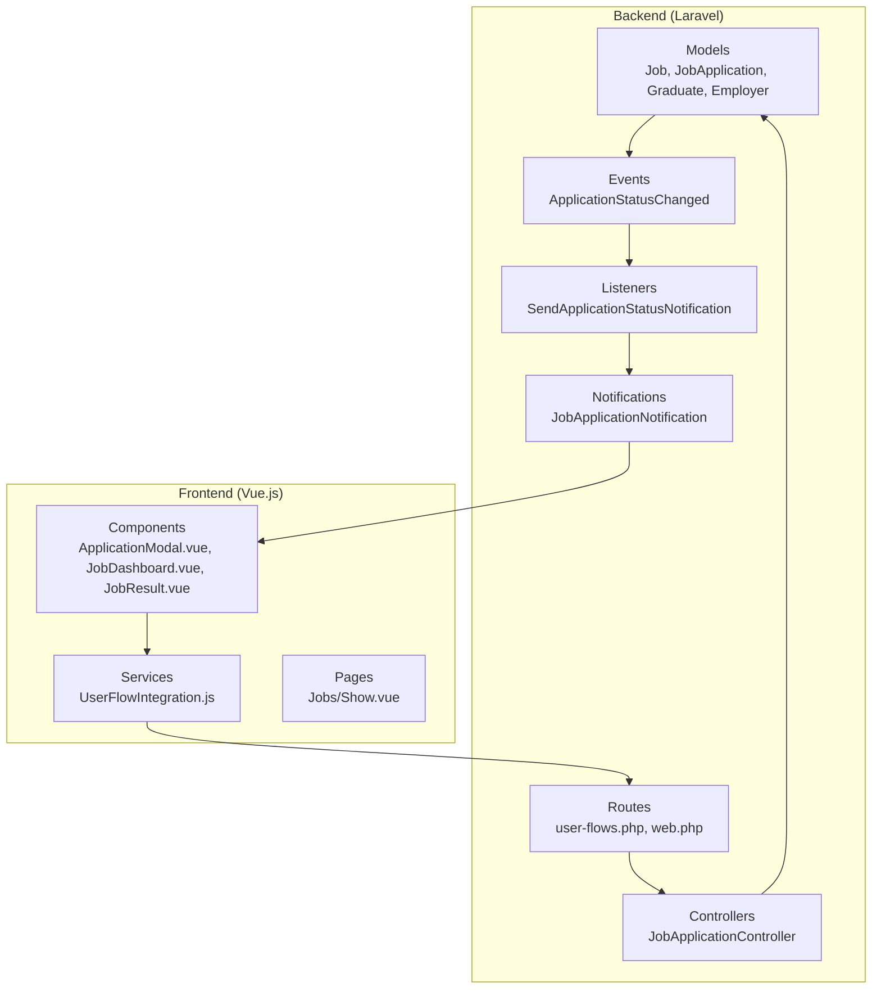
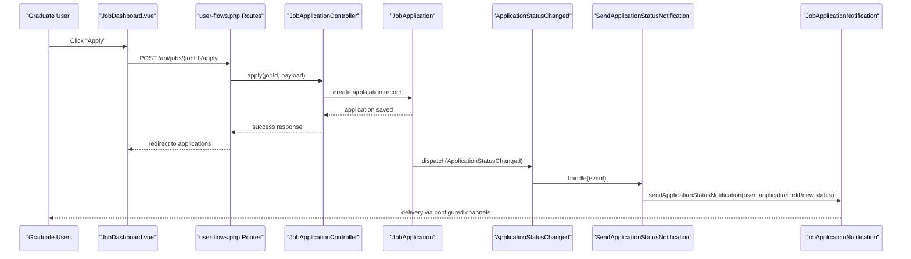
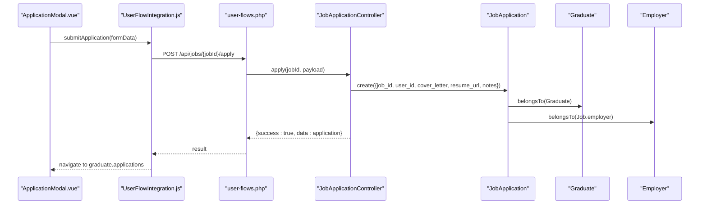
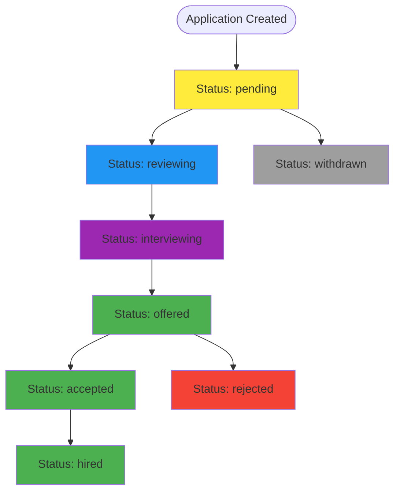
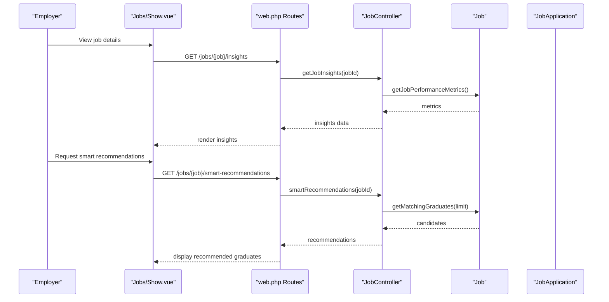
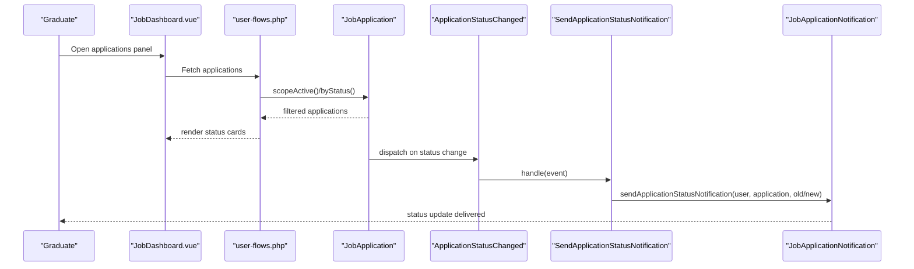
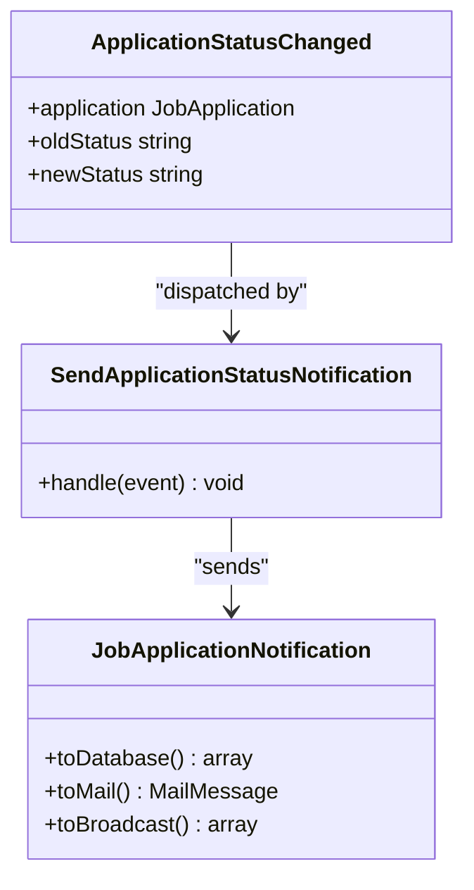
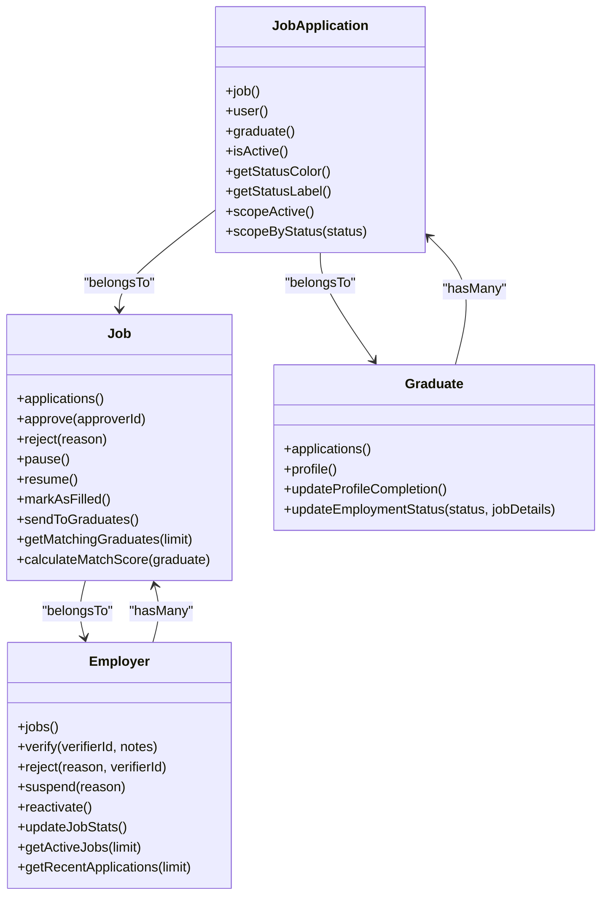

# Application Tracking System

<cite>
**Referenced Files in This Document**
- [JobApplication.php](file://app/Models/JobApplication.php)
- [Job.php](file://app/Models/Job.php)
- [Graduate.php](file://app/Models/Graduate.php)
- [Employer.php](file://app/Models/Employer.php)
- [ApplicationStatusChanged.php](file://app/Events/ApplicationStatusChanged.php)
- [SendApplicationStatusNotification.php](file://app/Listeners/SendApplicationStatusNotification.php)
- [JobApplicationController.php](file://app/Http/Controllers/JobApplicationController.php)
- [JobApplicationNotification.php](file://app/Notifications/JobApplicationNotification.php)
- [ApplicationModal.vue](file://resources/js/components/ApplicationModal.vue)
- [JobDashboard.vue](file://resources/js/components/JobDashboard.vue)
- [JobResult.vue](file://resources/js/components/SearchResults/JobResult.vue)
- [UserFlowIntegration.js](file://resources/js/services/UserFlowIntegration.js)
- [Show.vue](file://resources/js/Pages/Jobs/Show.vue)
- [user-flows.php](file://routes/user-flows.php)
- [web.php](file://routes/web.php)
</cite>

## Table of Contents
1. [Introduction](#introduction)
2. [Project Structure](#project-structure)
3. [Core Components](#core-components)
4. [Architecture Overview](#architecture-overview)
5. [Detailed Component Analysis](#detailed-component-analysis)
6. [Dependency Analysis](#dependency-analysis)
7. [Performance Considerations](#performance-considerations)
8. [Troubleshooting Guide](#troubleshooting-guide)
9. [Conclusion](#conclusion)

## Introduction
This document describes the job application tracking system that powers the graduate-to-employer hiring pipeline. It covers application submission workflows, status management, employer review processes, and graduate tracking. It also explains application forms, document uploads, status updates, and communication features, including automated notifications. Examples of application interfaces, employer dashboards, graduate tracking panels, and hiring process integration are included to help stakeholders understand the end-to-end journey from job discovery to hire.

## Project Structure
The application is built with a Laravel backend and Vue.js frontend. The backend defines models for jobs, applications, graduates, and employers, along with controllers, events, listeners, and notifications. Frontend components provide interactive interfaces for applying to jobs, viewing application status, and managing communications.

**Diagram sources**
- [JobApplication.php:1-162](file://app/Models/JobApplication.php#L1-L162)
- [Job.php:1-573](file://app/Models/Job.php#L1-L573)
- [Graduate.php:1-243](file://app/Models/Graduate.php#L1-L243)
- [Employer.php:1-397](file://app/Models/Employer.php#L1-L397)
- [ApplicationStatusChanged.php:1-27](file://app/Events/ApplicationStatusChanged.php#L1-L27)
- [SendApplicationStatusNotification.php:1-39](file://app/Listeners/SendApplicationStatusNotification.php#L1-L39)
- [JobApplicationController.php](file://app/Http/Controllers/JobApplicationController.php)
- [JobApplicationNotification.php](file://app/Notifications/JobApplicationNotification.php)
- [ApplicationModal.vue:1-190](file://resources/js/components/ApplicationModal.vue#L1-L190)
- [JobDashboard.vue:236-314](file://resources/js/components/JobDashboard.vue#L236-L314)
- [JobResult.vue:316-355](file://resources/js/components/SearchResults/JobResult.vue#L316-L355)
- [UserFlowIntegration.js:177-213](file://resources/js/services/UserFlowIntegration.js#L177-L213)
- [Show.vue:230-265](file://resources/js/Pages/Jobs/Show.vue#L230-L265)
- [user-flows.php:44-53](file://routes/user-flows.php#L44-L53)
- [web.php:201-214](file://routes/web.php#L201-L214)

**Section sources**
- [JobApplication.php:1-162](file://app/Models/JobApplication.php#L1-L162)
- [Job.php:1-573](file://app/Models/Job.php#L1-L573)
- [Graduate.php:1-243](file://app/Models/Graduate.php#L1-L243)
- [Employer.php:1-397](file://app/Models/Employer.php#L1-L397)
- [ApplicationStatusChanged.php:1-27](file://app/Events/ApplicationStatusChanged.php#L1-L27)
- [SendApplicationStatusNotification.php:1-39](file://app/Listeners/SendApplicationStatusNotification.php#L1-L39)
- [JobApplicationController.php](file://app/Http/Controllers/JobApplicationController.php)
- [JobApplicationNotification.php](file://app/Notifications/JobApplicationNotification.php)
- [ApplicationModal.vue:1-190](file://resources/js/components/ApplicationModal.vue#L1-L190)
- [JobDashboard.vue:236-314](file://resources/js/components/JobDashboard.vue#L236-L314)
- [JobResult.vue:316-355](file://resources/js/components/SearchResults/JobResult.vue#L316-L355)
- [UserFlowIntegration.js:177-213](file://resources/js/services/UserFlowIntegration.js#L177-L213)
- [Show.vue:230-265](file://resources/js/Pages/Jobs/Show.vue#L230-L265)
- [user-flows.php:44-53](file://routes/user-flows.php#L44-L53)
- [web.php:201-214](file://routes/web.php#L201-L214)

## Core Components
- Job: Represents job postings with metadata, status, deadlines, and statistics. Provides helpers to calculate match scores, update application stats, and manage lifecycle (approve, renew, pause, resume, mark filled).
- JobApplication: Tracks individual applications with status transitions, document attachments (resume_url), cover letters, introduction requests, and timestamps.
- Graduate: Holds graduate profiles, employment status, skills, certifications, and profile completion metrics. Links applications to graduates.
- Employer: Manages company verification, subscription plans, job posting limits, and analytics. Controls permissions to post jobs and search graduates.
- Events and Listeners: ApplicationStatusChanged event triggers SendApplicationStatusNotification listener, which uses NotificationService to send status updates to graduates.
- Controllers and Routes: Job application endpoints are exposed via API routes for applying, saving/unsaving jobs, requesting introductions, and retrieving insights.
- Frontend Components: ApplicationModal.vue, JobDashboard.vue, and JobResult.vue provide interactive application experiences. UserFlowIntegration.js coordinates application submission and navigation.

**Section sources**
- [Job.php:1-573](file://app/Models/Job.php#L1-L573)
- [JobApplication.php:1-162](file://app/Models/JobApplication.php#L1-L162)
- [Graduate.php:1-243](file://app/Models/Graduate.php#L1-L243)
- [Employer.php:1-397](file://app/Models/Employer.php#L1-L397)
- [ApplicationStatusChanged.php:1-27](file://app/Events/ApplicationStatusChanged.php#L1-L27)
- [SendApplicationStatusNotification.php:1-39](file://app/Listeners/SendApplicationStatusNotification.php#L1-L39)
- [user-flows.php:44-53](file://routes/user-flows.php#L44-L53)
- [web.php:201-214](file://routes/web.php#L201-L214)
- [ApplicationModal.vue:1-190](file://resources/js/components/ApplicationModal.vue#L1-L190)
- [JobDashboard.vue:236-314](file://resources/js/components/JobDashboard.vue#L236-L314)
- [JobResult.vue:316-355](file://resources/js/components/SearchResults/JobResult.vue#L316-L355)
- [UserFlowIntegration.js:177-213](file://resources/js/services/UserFlowIntegration.js#L177-L213)

## Architecture Overview
The system follows a layered architecture:
- Presentation Layer: Vue components and pages render job listings, application modals, and tracking dashboards.
- Service Layer: Controllers orchestrate requests, validate inputs, and coordinate model operations.
- Domain Layer: Models encapsulate business logic for jobs, applications, graduates, and employers.
- Communication Layer: Events and listeners trigger notifications when application statuses change.

**Diagram sources**
- [JobDashboard.vue:247-287](file://resources/js/components/JobDashboard.vue#L247-L287)
- [user-flows.php:49-49](file://routes/user-flows.php#L49-L49)
- [JobApplicationController.php](file://app/Http/Controllers/JobApplicationController.php)
- [JobApplication.php:1-162](file://app/Models/JobApplication.php#L1-L162)
- [ApplicationStatusChanged.php:1-27](file://app/Events/ApplicationStatusChanged.php#L1-L27)
- [SendApplicationStatusNotification.php:1-39](file://app/Listeners/SendApplicationStatusNotification.php#L1-L39)
- [JobApplicationNotification.php](file://app/Notifications/JobApplicationNotification.php)

## Detailed Component Analysis

### Application Submission Workflow
Graduates apply to jobs through interactive modals and forms. The workflow supports cover letters, optional resume uploads, and optional introduction requests to connections.

**Diagram sources**
- [ApplicationModal.vue:1-190](file://resources/js/components/ApplicationModal.vue#L1-L190)
- [UserFlowIntegration.js:191-213](file://resources/js/services/UserFlowIntegration.js#L191-L213)
- [user-flows.php:49-49](file://routes/user-flows.php#L49-L49)
- [JobApplicationController.php](file://app/Http/Controllers/JobApplicationController.php)
- [JobApplication.php:1-162](file://app/Models/JobApplication.php#L1-L162)
- [Graduate.php:1-243](file://app/Models/Graduate.php#L1-L243)
- [Employer.php:1-397](file://app/Models/Employer.php#L1-L397)

**Section sources**
- [ApplicationModal.vue:1-190](file://resources/js/components/ApplicationModal.vue#L1-L190)
- [UserFlowIntegration.js:191-213](file://resources/js/services/UserFlowIntegration.js#L191-L213)
- [user-flows.php:49-49](file://routes/user-flows.php#L49-L49)
- [JobApplicationController.php](file://app/Http/Controllers/JobApplicationController.php)
- [JobApplication.php:1-162](file://app/Models/JobApplication.php#L1-L162)

### Status Management and Lifecycle
Applications progress through predefined statuses with color-coded labels and UI-friendly descriptors. The system tracks whether applications are active and provides scopes for filtering.

**Diagram sources**
- [JobApplication.php:39-53](file://app/Models/JobApplication.php#L39-L53)
- [JobApplication.php:111-140](file://app/Models/JobApplication.php#L111-L140)

**Section sources**
- [JobApplication.php:39-53](file://app/Models/JobApplication.php#L39-L53)
- [JobApplication.php:89-161](file://app/Models/JobApplication.php#L89-L161)

### Employer Review Processes
Employers manage job postings and applications through dedicated dashboards. They can view recent applications, manage job lifecycle (pause/resume/renew), and leverage smart recommendations.

**Diagram sources**
- [Show.vue:230-265](file://resources/js/Pages/Jobs/Show.vue#L230-L265)
- [web.php:212-214](file://routes/web.php#L212-L214)
- [Job.php:381-400](file://app/Models/Job.php#L381-L400)
- [Job.php:250-275](file://app/Models/Job.php#L250-L275)

**Section sources**
- [Show.vue:230-265](file://resources/js/Pages/Jobs/Show.vue#L230-L265)
- [web.php:212-214](file://routes/web.php#L212-L214)
- [Job.php:381-400](file://app/Models/Job.php#L381-L400)
- [Job.php:250-275](file://app/Models/Job.php#L250-L275)

### Graduate Application Tracking Panel
Graduates can track their applications through a centralized panel that reflects status changes and provides quick actions for follow-up.

**Diagram sources**
- [JobDashboard.vue:236-314](file://resources/js/components/JobDashboard.vue#L236-L314)
- [user-flows.php:44-53](file://routes/user-flows.php#L44-L53)
- [JobApplication.php:145-160](file://app/Models/JobApplication.php#L145-L160)
- [ApplicationStatusChanged.php:1-27](file://app/Events/ApplicationStatusChanged.php#L1-L27)
- [SendApplicationStatusNotification.php:1-39](file://app/Listeners/SendApplicationStatusNotification.php#L1-L39)
- [JobApplicationNotification.php](file://app/Notifications/JobApplicationNotification.php)

**Section sources**
- [JobDashboard.vue:236-314](file://resources/js/components/JobDashboard.vue#L236-L314)
- [user-flows.php:44-53](file://routes/user-flows.php#L44-L53)
- [JobApplication.php:145-160](file://app/Models/JobApplication.php#L145-L160)
- [ApplicationStatusChanged.php:1-27](file://app/Events/ApplicationStatusChanged.php#L1-L27)
- [SendApplicationStatusNotification.php:1-39](file://app/Listeners/SendApplicationStatusNotification.php#L1-L39)
- [JobApplicationNotification.php](file://app/Notifications/JobApplicationNotification.php)

### Automated Notification System
When application statuses change, the system automatically notifies graduates via configured channels. The event-driven architecture ensures decoupled, scalable notifications.

**Diagram sources**
- [ApplicationStatusChanged.php:1-27](file://app/Events/ApplicationStatusChanged.php#L1-L27)
- [SendApplicationStatusNotification.php:1-39](file://app/Listeners/SendApplicationStatusNotification.php#L1-L39)
- [JobApplicationNotification.php](file://app/Notifications/JobApplicationNotification.php)

**Section sources**
- [ApplicationStatusChanged.php:1-27](file://app/Events/ApplicationStatusChanged.php#L1-L27)
- [SendApplicationStatusNotification.php:1-39](file://app/Listeners/SendApplicationStatusNotification.php#L1-L39)
- [JobApplicationNotification.php](file://app/Notifications/JobApplicationNotification.php)

### Interview Scheduling and Offer Management
While explicit interview scheduling and offer management endpoints are not present in the analyzed files, the system supports:
- Interviewing status for applications
- Offered/Accepted status transitions
- Introduction requests between graduates and contacts

These statuses enable integration points for calendar systems and offer workflows in downstream services.

**Section sources**
- [JobApplication.php:43-47](file://app/Models/JobApplication.php#L43-L47)
- [JobApplication.php:103-106](file://app/Models/JobApplication.php#L103-L106)

### Hiring Process Integration
The system integrates with employer analytics and recommendation engines:
- Employers can view job performance metrics and application insights.
- Smart recommendations surface qualified graduates based on course, skills, and profile completion.
- Subscription and verification controls govern employer capabilities.

**Section sources**
- [Job.php:381-571](file://app/Models/Job.php#L381-L571)
- [Employer.php:134-193](file://app/Models/Employer.php#L134-L193)
- [Show.vue:230-265](file://resources/js/Pages/Jobs/Show.vue#L230-L265)

## Dependency Analysis
The following diagram shows key dependencies among models and controllers involved in the application tracking system.

**Diagram sources**
- [Job.php:83-86](file://app/Models/Job.php#L83-L86)
- [Job.php:218-233](file://app/Models/Job.php#L218-L233)
- [Job.php:315-337](file://app/Models/Job.php#L315-L337)
- [JobApplication.php:58-86](file://app/Models/JobApplication.php#L58-L86)
- [Graduate.php:81-89](file://app/Models/Graduate.php#L81-L89)
- [Employer.php:102-105](file://app/Models/Employer.php#L102-L105)

**Section sources**
- [Job.php:1-573](file://app/Models/Job.php#L1-L573)
- [JobApplication.php:1-162](file://app/Models/JobApplication.php#L1-L162)
- [Graduate.php:1-243](file://app/Models/Graduate.php#L1-L243)
- [Employer.php:1-397](file://app/Models/Employer.php#L1-L397)

## Performance Considerations
- Index job and application queries on frequently filtered fields (status, employer_id, user_id).
- Use Eloquent eager loading for relationships (job.employer, graduate.user) to avoid N+1 queries.
- Batch update application statistics after bulk operations to reduce write contention.
- Cache recommendation lists and job insights for frequently accessed data.
- Implement pagination for large application lists and recommendation sets.

## Troubleshooting Guide
Common issues and resolutions:
- Application submission fails: Verify CSRF tokens and endpoint availability in user-flows.php. Check controller validation and model creation.
- Status update notifications not received: Confirm ApplicationStatusChanged event dispatch and SendApplicationStatusNotification listener registration. Validate NotificationService configuration.
- Job recommendations missing: Ensure Job.sendToGraduates() runs and Job.getMatchingGraduates() filters align with graduate profile data.
- Employer dashboard anomalies: Validate Employer.updateJobStats() and Job.updateApplicationStats() calls after application changes.

**Section sources**
- [user-flows.php:44-53](file://routes/user-flows.php#L44-L53)
- [web.php:201-214](file://routes/web.php#L201-L214)
- [ApplicationStatusChanged.php:1-27](file://app/Events/ApplicationStatusChanged.php#L1-L27)
- [SendApplicationStatusNotification.php:1-39](file://app/Listeners/SendApplicationStatusNotification.php#L1-L39)
- [Job.php:315-337](file://app/Models/Job.php#L315-L337)
- [Job.php:199-216](file://app/Models/Job.php#L199-L216)
- [Employer.php:293-314](file://app/Models/Employer.php#L293-L314)

## Conclusion
The application tracking system provides a robust foundation for graduate-to-employer hiring workflows. It supports seamless application submissions, comprehensive status management, employer dashboards, and automated notifications. The modular design enables extension for advanced features like interview scheduling and offer management while maintaining clean separation of concerns and scalability.