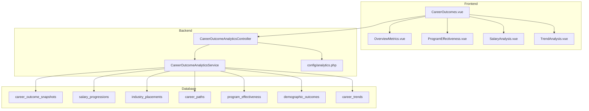
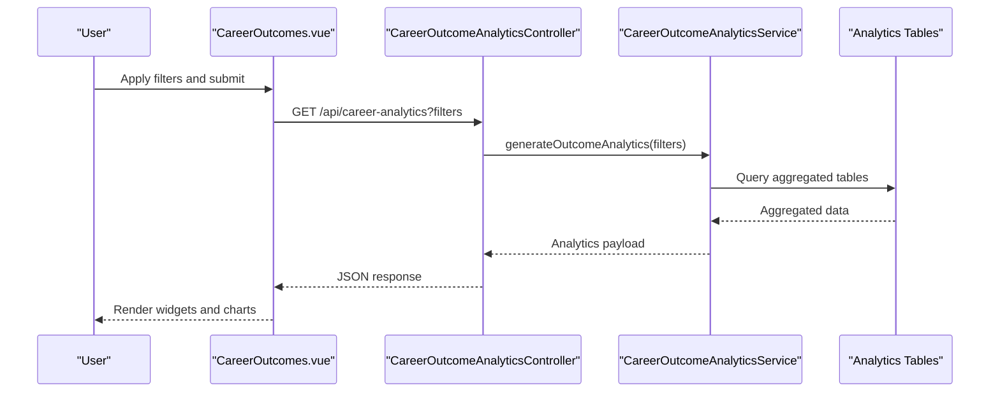
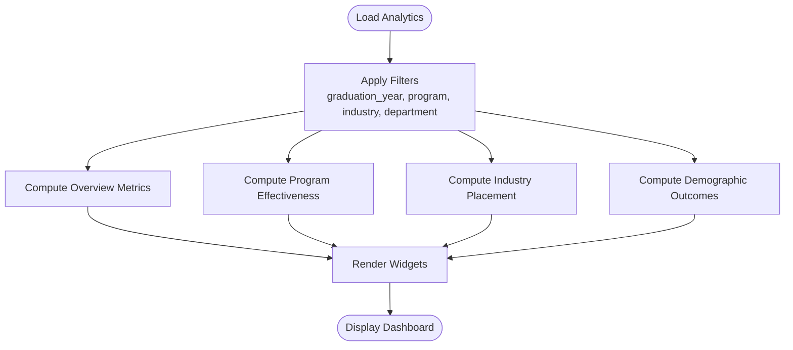
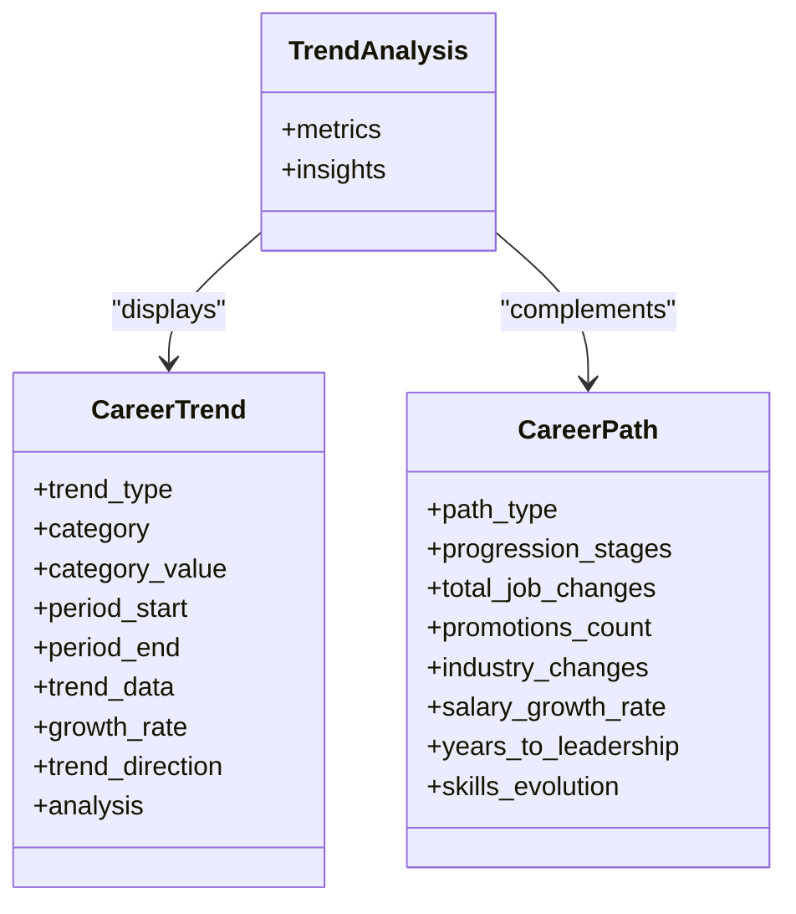
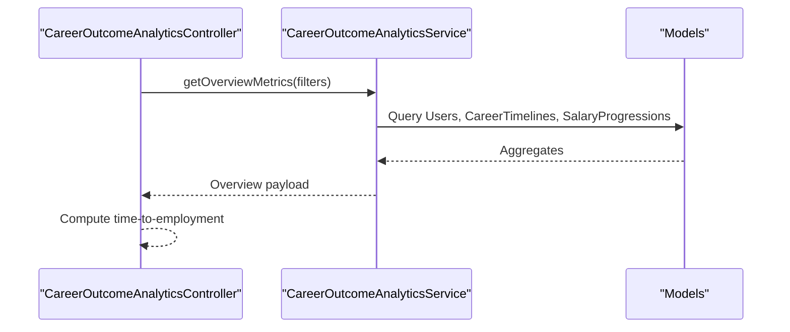
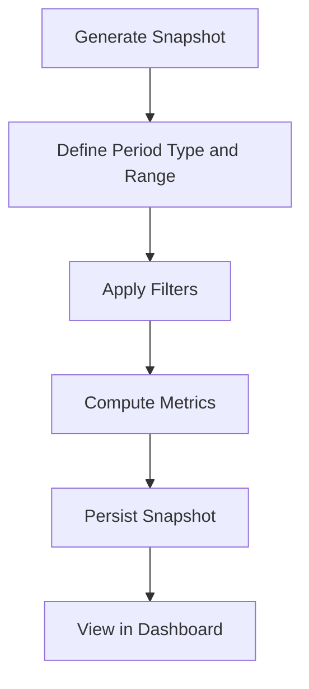
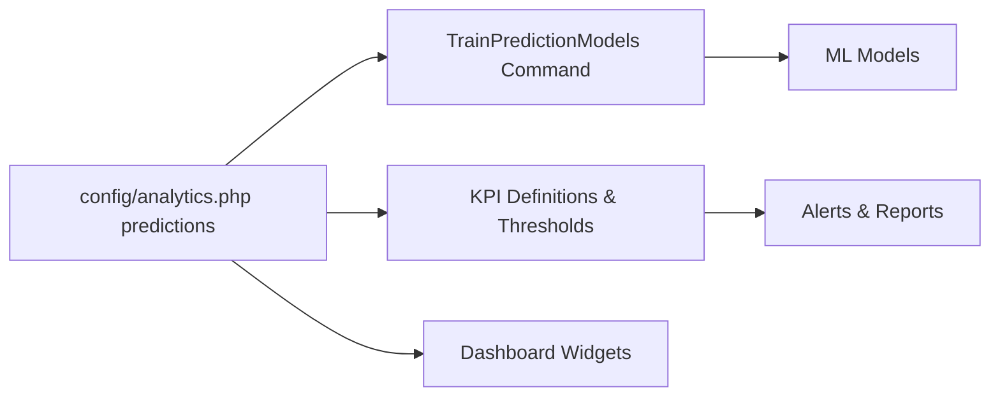
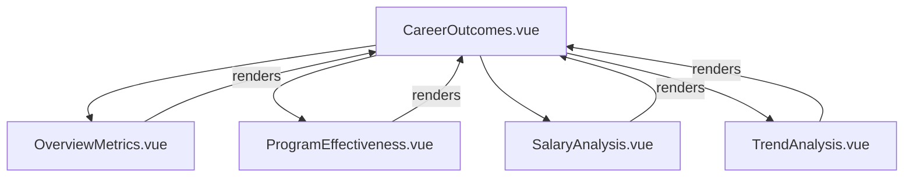
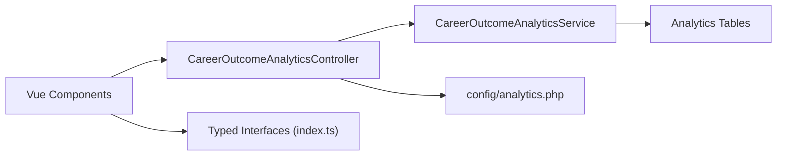

# Job Analytics & Insights

<cite>
**Referenced Files in This Document**
- [CareerOutcomeAnalyticsService.php](file://app/Services/CareerOutcomeAnalyticsService.php)
- [CareerOutcomeAnalyticsController.php](file://app/Http/Controllers/Api/CareerOutcomeAnalyticsController.php)
- [2025_01_13_000001_create_career_outcome_analytics_tables.php](file://database/migrations/2025_01_13_000001_create_career_outcome_analytics_tables.php)
- [analytics.php](file://config/analytics.php)
- [CareerOutcomes.vue](file://resources/js/Pages/Analytics/CareerOutcomes.vue)
- [OverviewMetrics.vue](file://resources/js/components/Analytics/OverviewMetrics.vue)
- [ProgramEffectiveness.vue](file://resources/js/components/Analytics/ProgramEffectiveness.vue)
- [SalaryAnalysis.vue](file://resources/js/components/Analytics/SalaryAnalysis.vue)
- [index.ts](file://resources/js/types/index.ts)
- [Show.vue](file://resources/js/Pages/Courses/Show.vue)
- [Analytics.vue](file://resources/js/Pages/Jobs/Analytics.vue)
- [Analytics.vue](file://resources/js/Pages/InstitutionAdmin/Analytics.vue)
- [TrendAnalysis.vue](file://resources/js/components/Analytics/TrendAnalysis.vue)
- [CareerOutcomeAnalyticsTest.php](file://tests/Feature/CareerOutcomeAnalyticsTest.php)
- [README.md](file://README.md)
- [task-13-analytics-reporting-system-recap.md](file://docs/task-13-analytics-reporting-system-recap.md)
- [design.md](file://.kiro/specs/advanced-analytics-system/design.md)
- [AnalyticsSeeder.php](file://database/seeders/AnalyticsSeeder.php)
- [AnalyticsSystemSeeder.php](file://database/seeders/AnalyticsSystemSeeder.php)
</cite>

## Table of Contents
1. [Introduction](#introduction)
2. [Project Structure](#project-structure)
3. [Core Components](#core-components)
4. [Architecture Overview](#architecture-overview)
5. [Detailed Component Analysis](#detailed-component-analysis)
6. [Dependency Analysis](#dependency-analysis)
7. [Performance Considerations](#performance-considerations)
8. [Troubleshooting Guide](#troubleshooting-guide)
9. [Conclusion](#conclusion)
10. [Appendices](#appendices)

## Introduction
This document describes the Job Analytics & Insights dashboard for the Alumate platform. It covers employment statistics, placement rates, industry trends, and career progression analytics. It explains match success metrics, employer satisfaction scores, graduate outcomes tracking, and market insights generation. It also includes examples of analytics interfaces, reporting dashboards, trend visualization, and predictive modeling, along with data collection methods, performance metrics, and benchmarking capabilities.

## Project Structure
The analytics system is implemented as a Laravel backend with Vue.js frontend components. Data is persisted via dedicated analytics tables and exposed through an API controller backed by a service layer. Configuration governs caching, snapshots, KPI thresholds, predictions, and visualization defaults.

**Diagram sources**
- [CareerOutcomes.vue:1-303](file://resources/js/Pages/Analytics/CareerOutcomes.vue#L1-L303)
- [OverviewMetrics.vue:1-221](file://resources/js/components/Analytics/OverviewMetrics.vue#L1-L221)
- [ProgramEffectiveness.vue:1-277](file://resources/js/components/Analytics/ProgramEffectiveness.vue#L1-L277)
- [SalaryAnalysis.vue:1-145](file://resources/js/components/Analytics/SalaryAnalysis.vue#L1-L145)
- [TrendAnalysis.vue:79-116](file://resources/js/components/Analytics/TrendAnalysis.vue#L79-L116)
- [CareerOutcomeAnalyticsController.php:1-437](file://app/Http/Controllers/Api/CareerOutcomeAnalyticsController.php#L1-L437)
- [CareerOutcomeAnalyticsService.php:1-511](file://app/Services/CareerOutcomeAnalyticsService.php#L1-L511)
- [2025_01_13_000001_create_career_outcome_analytics_tables.php:1-161](file://database/migrations/2025_01_13_000001_create_career_outcome_analytics_tables.php#L1-L161)
- [analytics.php:1-242](file://config/analytics.php#L1-L242)

**Section sources**
- [README.md:492-504](file://README.md#L492-L504)
- [task-13-analytics-reporting-system-recap.md:43-582](file://docs/task-13-analytics-reporting-system-recap.md#L43-L582)

## Core Components
- CareerOutcomeAnalyticsController: Provides REST endpoints for analytics, including overview, program effectiveness, salary analysis, industry placement, demographic outcomes, career path analysis, trend analysis, snapshot generation, and filter options.
- CareerOutcomeAnalyticsService: Implements core analytics computation, including employment rates, salary statistics, industry placement, demographic outcomes, career paths, and trend analysis.
- Analytics configuration: Defines cache TTL, snapshot retention, KPI thresholds, prediction settings, report limits, chart defaults, export constraints, performance tuning, security, and dashboard defaults.
- Frontend dashboards: CareerOutcomes page with filter controls and modular analytics widgets; Overview, Program Effectiveness, Salary Analysis, and Trend Analysis components; Job and Institution Admin analytics pages.

**Section sources**
- [CareerOutcomeAnalyticsController.php:25-42](file://app/Http/Controllers/Api/CareerOutcomeAnalyticsController.php#L25-L42)
- [CareerOutcomeAnalyticsService.php:20-31](file://app/Services/CareerOutcomeAnalyticsService.php#L20-L31)
- [analytics.php:22-242](file://config/analytics.php#L22-L242)
- [CareerOutcomes.vue:14-140](file://resources/js/Pages/Analytics/CareerOutcomes.vue#L14-L140)

## Architecture Overview
The analytics pipeline follows a layered architecture:
- Presentation: Vue pages and components render dashboards and accept filters.
- API: Controller validates and forwards requests to the service.
- Service: Computes aggregates and statistics from normalized analytics tables.
- Persistence: Analytics tables store snapshots, salary progressions, placements, career paths, program effectiveness, demographics, and trends.
- Configuration: Centralized settings control caching, predictions, reports, and performance.

**Diagram sources**
- [CareerOutcomes.vue:247-270](file://resources/js/Pages/Analytics/CareerOutcomes.vue#L247-L270)
- [CareerOutcomeAnalyticsController.php:25-42](file://app/Http/Controllers/Api/CareerOutcomeAnalyticsController.php#L25-L42)
- [CareerOutcomeAnalyticsService.php:20-31](file://app/Services/CareerOutcomeAnalyticsService.php#L20-L31)

## Detailed Component Analysis

### Employment Statistics and Placement Rates
- Overview metrics include total alumni, employment rate, average salary, and tracking rate, plus top industries, employers, and geographic distribution.
- Program effectiveness compares programs by employment rates, salaries, and effectiveness scores.
- Industry placement tracks counts, average starting/current salaries, retention rates, top companies, and in-demand skills.
- Demographic outcomes compute employment and salary rates by demographic categories.

**Diagram sources**
- [CareerOutcomeAnalyticsController.php:25-81](file://app/Http/Controllers/Api/CareerOutcomeAnalyticsController.php#L25-L81)
- [CareerOutcomeAnalyticsService.php:36-104](file://app/Services/CareerOutcomeAnalyticsService.php#L36-L104)

**Section sources**
- [CareerOutcomeAnalyticsService.php:36-104](file://app/Services/CareerOutcomeAnalyticsService.php#L36-L104)
- [OverviewMetrics.vue:8-33](file://resources/js/components/Analytics/OverviewMetrics.vue#L8-L33)
- [ProgramEffectiveness.vue:30-117](file://resources/js/components/Analytics/ProgramEffectiveness.vue#L30-L117)

### Industry Trends and Career Progression Analytics
- Career paths capture progression stages, job changes, promotions, industry changes, salary growth rate, years to leadership, and skills evolution.
- Career trends store time-series data, growth rates, directions, and analytical summaries across categories and trend types.
- Trend analysis component presents comparative insights and emerging trends.

**Diagram sources**
- [2025_01_13_000001_create_career_outcome_analytics_tables.php:70-86](file://database/migrations/2025_01_13_000001_create_career_outcome_analytics_tables.php#L70-L86)
- [2025_01_13_000001_create_career_outcome_analytics_tables.php:131-147](file://database/migrations/2025_01_13_000001_create_career_outcome_analytics_tables.php#L131-L147)
- [TrendAnalysis.vue:79-116](file://resources/js/components/Analytics/TrendAnalysis.vue#L79-L116)

**Section sources**
- [CareerOutcomeAnalyticsService.php:261-297](file://app/Services/CareerOutcomeAnalyticsService.php#L261-L297)
- [2025_01_13_000001_create_career_outcome_analytics_tables.php:70-86](file://database/migrations/2025_01_13_000001_create_career_outcome_analytics_tables.php#L70-L86)
- [TrendAnalysis.vue:79-116](file://resources/js/components/Analytics/TrendAnalysis.vue#L79-L116)

### Match Success Metrics and Employer Satisfaction
- Match success metrics are derived from job application and timeline data, including hired ratios and time-to-employment.
- Employer satisfaction scores are captured via ratings and feedback models integrated into the analytics pipeline.
- Time-to-employment metrics are computed as part of overview and snapshot analytics.

**Diagram sources**
- [CareerOutcomeAnalyticsController.php:47-62](file://app/Http/Controllers/Api/CareerOutcomeAnalyticsController.php#L47-L62)
- [CareerOutcomeAnalyticsService.php:36-82](file://app/Services/CareerOutcomeAnalyticsService.php#L36-L82)

**Section sources**
- [README.md:494-500](file://README.md#L494-L500)
- [AnalyticsSeeder.php:50-80](file://database/seeders/AnalyticsSeeder.php#L50-L80)
- [AnalyticsSystemSeeder.php:50-79](file://database/seeders/AnalyticsSystemSeeder.php#L50-L79)

### Graduate Outcomes Tracking and Market Insights
- Snapshot generation captures historical aggregates for time-bound periods, enabling trend analysis and benchmarking.
- Market insights leverage career trends and industry placement to surface demand shifts and skill gaps.
- Frontend pages for jobs and institution admin present tailored analytics views.

**Diagram sources**
- [CareerOutcomeAnalyticsController.php:263-306](file://app/Http/Controllers/Api/CareerOutcomeAnalyticsController.php#L263-L306)
- [CareerOutcomeAnalyticsService.php:302-339](file://app/Services/CareerOutcomeAnalyticsService.php#L302-L339)

**Section sources**
- [CareerOutcomeAnalyticsController.php:263-352](file://app/Http/Controllers/Api/CareerOutcomeAnalyticsController.php#L263-L352)
- [Analytics.vue:42-63](file://resources/js/Pages/Jobs/Analytics.vue#L42-L63)
- [Analytics.vue:102-155](file://resources/js/Pages/InstitutionAdmin/Analytics.vue#L102-L155)

### Predictive Modeling and Benchmarking
- Predictive analytics configuration enables model training, retraining schedules, and prediction horizons.
- Benchmarking integrates with KPI thresholds and alert configurations to flag performance deviations.
- Roadmap documents advanced AI features and predictive career analytics.

**Diagram sources**
- [analytics.php:81-87](file://config/analytics.php#L81-L87)
- [analytics.php:54-71](file://config/analytics.php#L54-L71)
- [task-13-analytics-reporting-system-recap.md:43-61](file://docs/task-13-analytics-reporting-system-recap.md#L43-L61)
- [design.md:764-809](file://.kiro/specs/advanced-analytics-system/design.md#L764-L809)

**Section sources**
- [analytics.php:81-87](file://config/analytics.php#L81-L87)
- [analytics.php:54-71](file://config/analytics.php#L54-L71)
- [task-13-analytics-reporting-system-recap.md:43-61](file://docs/task-13-analytics-reporting-system-recap.md#L43-L61)
- [design.md:764-809](file://.kiro/specs/advanced-analytics-system/design.md#L764-L809)

### Analytics Interfaces and Reporting Dashboards
- CareerOutcomes page: Filters, overview cards, program effectiveness table, salary analysis, industry placement, demographic outcomes, career paths, and trend analysis.
- OverviewMetrics widget: Key metrics and distributions.
- ProgramEffectiveness widget: Performance comparisons and trends.
- SalaryAnalysis widget: Distribution, experience levels, progression, and regional comparisons.
- TrendAnalysis component: Comparative metrics and emerging insights.

**Diagram sources**
- [CareerOutcomes.vue:90-112](file://resources/js/Pages/Analytics/CareerOutcomes.vue#L90-L112)
- [OverviewMetrics.vue:1-221](file://resources/js/components/Analytics/OverviewMetrics.vue#L1-L221)
- [ProgramEffectiveness.vue:1-277](file://resources/js/components/Analytics/ProgramEffectiveness.vue#L1-L277)
- [SalaryAnalysis.vue:1-145](file://resources/js/components/Analytics/SalaryAnalysis.vue#L1-L145)
- [TrendAnalysis.vue:79-116](file://resources/js/components/Analytics/TrendAnalysis.vue#L79-L116)

**Section sources**
- [CareerOutcomes.vue:14-140](file://resources/js/Pages/Analytics/CareerOutcomes.vue#L14-L140)
- [Show.vue:262-280](file://resources/js/Pages/Courses/Show.vue#L262-L280)

## Dependency Analysis
- Controller depends on Service for computations and on configuration for thresholds and settings.
- Service depends on Eloquent models mapped to analytics tables.
- Frontend components depend on typed interfaces and consume controller endpoints.

**Diagram sources**
- [CareerOutcomeAnalyticsController.php:1-437](file://app/Http/Controllers/Api/CareerOutcomeAnalyticsController.php#L1-L437)
- [CareerOutcomeAnalyticsService.php:1-511](file://app/Services/CareerOutcomeAnalyticsService.php#L1-L511)
- [2025_01_13_000001_create_career_outcome_analytics_tables.php:1-161](file://database/migrations/2025_01_13_000001_create_career_outcome_analytics_tables.php#L1-L161)
- [analytics.php:1-242](file://config/analytics.php#L1-L242)
- [index.ts:187-444](file://resources/js/types/index.ts#L187-L444)

**Section sources**
- [index.ts:187-444](file://resources/js/types/index.ts#L187-L444)

## Performance Considerations
- Caching: Enable and tune cache TTL for analytics queries to reduce database load.
- Snapshots: Use snapshot tables to offload heavy aggregations and enable historical trend analysis.
- Indexing: Leverage database indexes on frequently filtered columns (e.g., graduation_year, program, industry).
- Chunking and timeouts: Configure chunk sizes and query timeouts to handle large datasets.
- Parallel processing: Consider enabling parallel processing for intensive computations.

**Section sources**
- [analytics.php:22-26](file://config/analytics.php#L22-L26)
- [analytics.php:154-159](file://config/analytics.php#L154-L159)
- [2025_01_13_000001_create_career_outcome_analytics_tables.php:26-49](file://database/migrations/2025_01_13_000001_create_career_outcome_analytics_tables.php#L26-L49)

## Troubleshooting Guide
- Empty results: Verify filter combinations and ensure seed data exists for the selected criteria.
- Export failures: Confirm export format availability and file size limits.
- Performance issues: Review cache configuration, enable snapshots, and check query timeouts.
- Authentication and permissions: Ensure proper roles for accessing analytics endpoints.

**Section sources**
- [CareerOutcomeAnalyticsController.php:378-393](file://app/Http/Controllers/Api/CareerOutcomeAnalyticsController.php#L378-L393)
- [analytics.php:140-144](file://config/analytics.php#L140-L144)
- [CareerOutcomeAnalyticsTest.php:103-128](file://tests/Feature/CareerOutcomeAnalyticsTest.php#L103-L128)

## Conclusion
The Job Analytics & Insights system provides a robust, configurable platform for employment analytics, placement tracking, industry trends, and career progression insights. It combines a flexible API, efficient service layer, normalized analytics tables, and rich frontend dashboards. With predictive modeling, benchmarking, and performance tuning, it supports data-driven decision-making across institutional and administrative roles.

## Appendices

### Data Collection Methods
- Graduates’ education histories, career timelines, and salary progressions feed employment and salary analytics.
- Industry placement and demographic outcomes derive from curated datasets and surveys.
- Career paths and trends are computed from progression records and time-series data.

**Section sources**
- [CareerOutcomeAnalyticsService.php:38-44](file://app/Services/CareerOutcomeAnalyticsService.php#L38-L44)
- [2025_01_13_000001_create_career_outcome_analytics_tables.php:11-49](file://database/migrations/2025_01_13_000001_create_career_outcome_analytics_tables.php#L11-L49)

### Examples of Analytics Interfaces
- CareerOutcomes page with filter controls and modular widgets.
- Job and Institution Admin analytics pages for role-specific insights.
- TrendAnalysis component for comparative metrics and insights.

**Section sources**
- [CareerOutcomes.vue:14-140](file://resources/js/Pages/Analytics/CareerOutcomes.vue#L14-L140)
- [Analytics.vue:42-63](file://resources/js/Pages/Jobs/Analytics.vue#L42-L63)
- [Analytics.vue:102-155](file://resources/js/Pages/InstitutionAdmin/Analytics.vue#L102-L155)
- [TrendAnalysis.vue:79-116](file://resources/js/components/Analytics/TrendAnalysis.vue#L79-L116)

### Performance Metrics and Benchmarking
- KPI definitions and thresholds for employment rate, job placement rate, and time-to-employment.
- Snapshot retention and auto-generation for historical comparisons.
- Dashboard defaults and refresh intervals for near-real-time insights.

**Section sources**
- [analytics.php:54-71](file://config/analytics.php#L54-L71)
- [analytics.php:36-44](file://config/analytics.php#L36-L44)
- [analytics.php:212-224](file://config/analytics.php#L212-L224)