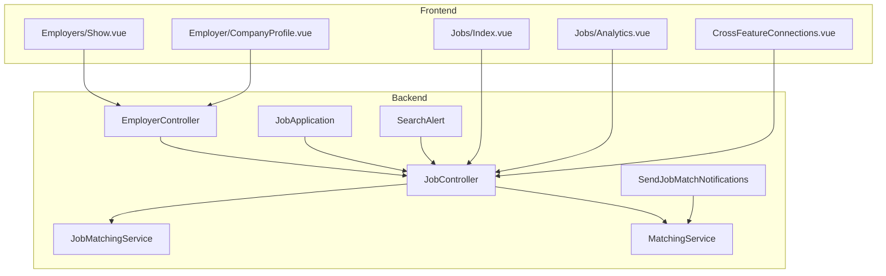
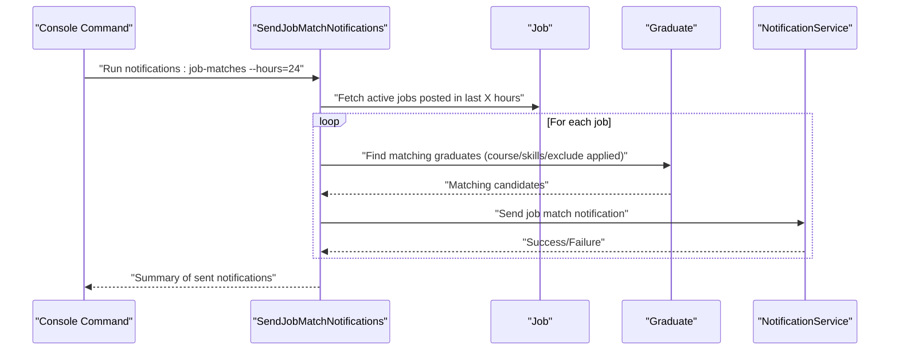
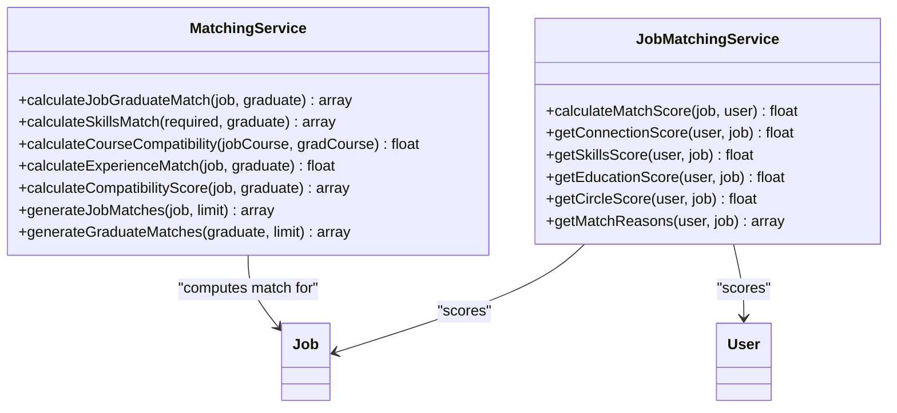
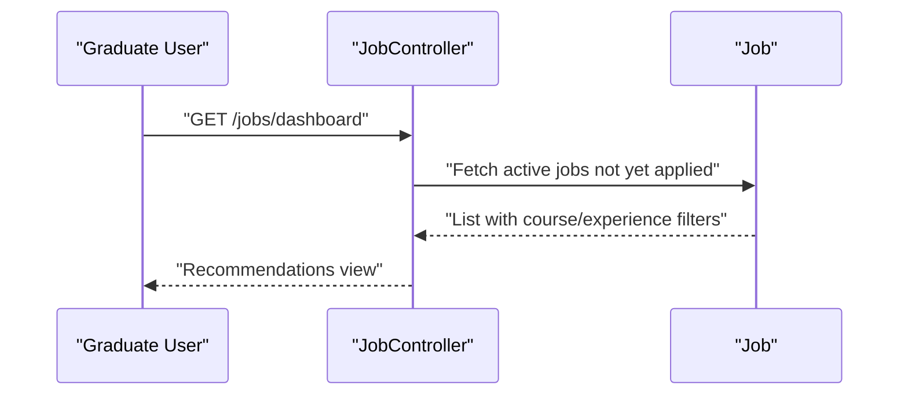
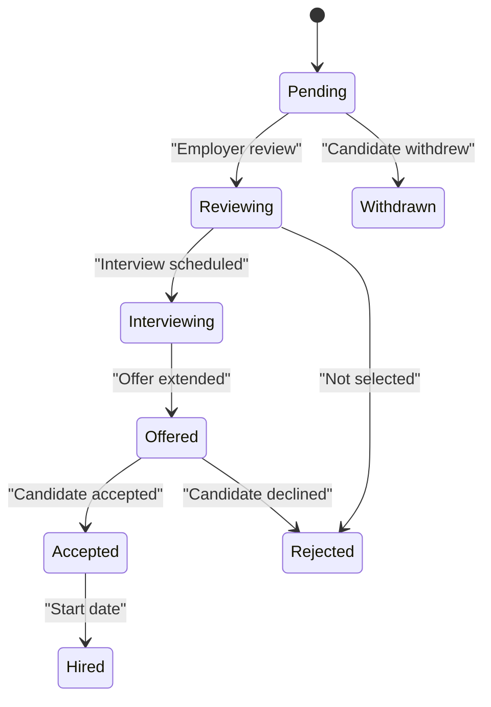
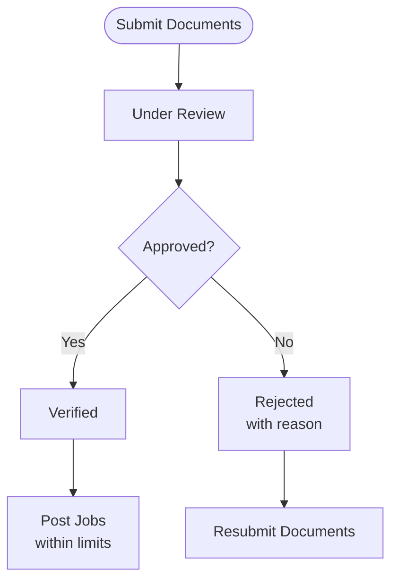
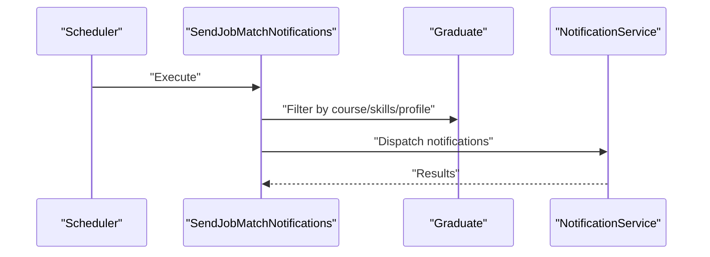
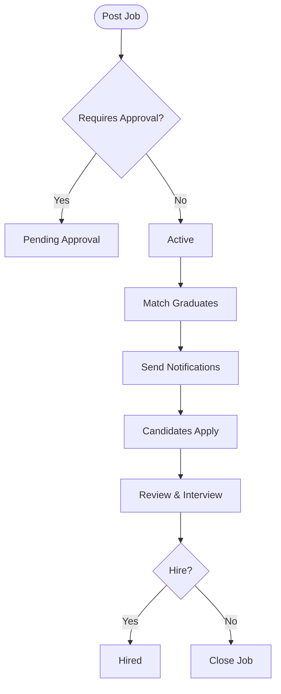
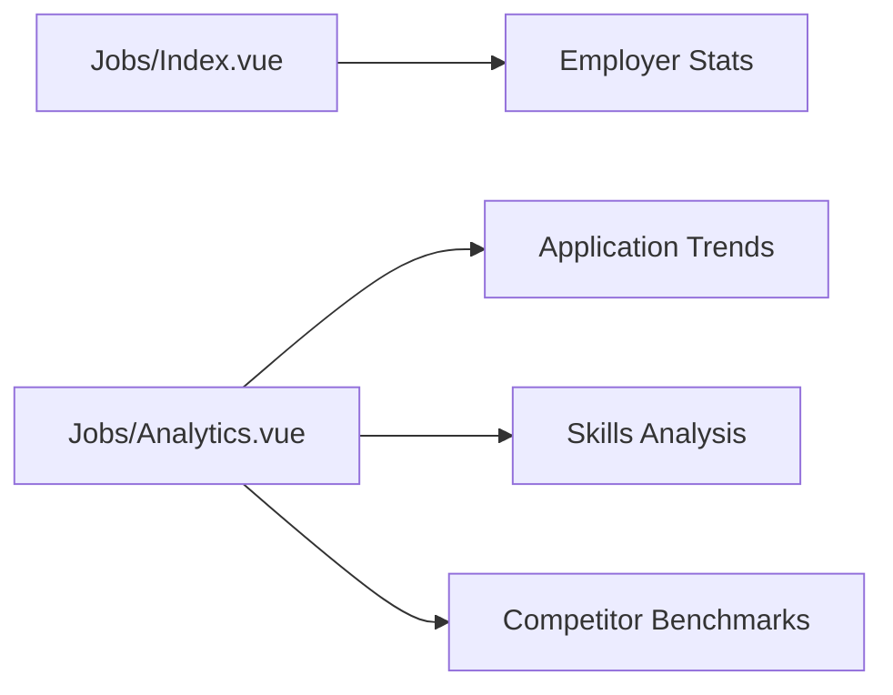
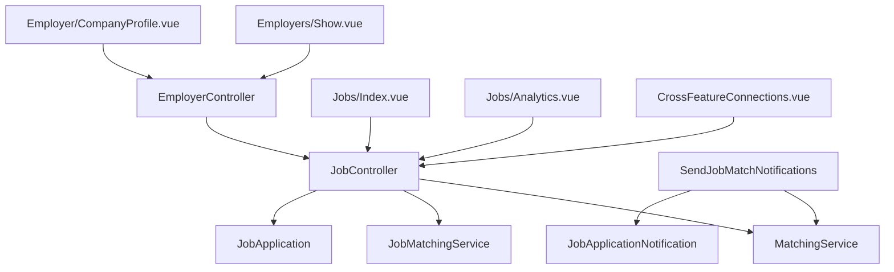

# Job Management & Placement

<cite>
**Referenced Files in This Document**
- [JobMatchingService.php](file://app/Services/JobMatchingService.php)
- [MatchingService.php](file://app/Services/MatchingService.php)
- [JobController.php](file://app/Http/Controllers/JobController.php)
- [EmployerController.php](file://app/Http/Controllers/EmployerController.php)
- [SendJobMatchNotifications.php](file://app/Console/Commands/SendJobMatchNotifications.php)
- [SearchAlert.php](file://app/Models/SearchAlert.php)
- [JobApplication.php](file://app/Models/JobApplication.php)
- [JobApplicationNotification.php](file://app/Notifications/JobApplicationNotification.php)
- [task-11-search-matching-system-recap.md](file://docs/task-11-search-matching-system-recap.md)
- [task-07-employer-registration-verification-recap.md](file://docs/task-07-employer-registration-verification-recap.md)
- [workflow-2025-01-19-1700-employer-registration-verification-enhancement.md](file://docs/workflow-2025-01-19-1700-employer-registration-verification-enhancement.md)
- [Index.vue](file://resources/js/Pages/Jobs/Index.vue)
- [Analytics.vue](file://resources/js/Pages/Jobs/Analytics.vue)
- [Show.vue](file://resources/js/Pages/Employers/Show.vue)
- [CompanyProfile.vue](file://resources/js/Pages/Employer/CompanyProfile.vue)
- [CrossFeatureConnections.vue](file://resources/js/components/CrossFeatureConnections.vue)
- [GraduateTrackingModelsTest.php](file://tests/Unit/Models/GraduateTrackingModelsTest.php)
- [JobMatchingIntegrationTest.php](file://tests/Feature/JobMatchingIntegrationTest.php)
</cite>

## Table of Contents
1. [Introduction](#introduction)
2. [Project Structure](#project-structure)
3. [Core Components](#core-components)
4. [Architecture Overview](#architecture-overview)
5. [Detailed Component Analysis](#detailed-component-analysis)
6. [Dependency Analysis](#dependency-analysis)
7. [Performance Considerations](#performance-considerations)
8. [Troubleshooting Guide](#troubleshooting-guide)
9. [Conclusion](#conclusion)
10. [Appendices](#appendices)

## Introduction
This document describes the job management and placement system, focusing on smart job matching algorithms powered by AI, application tracking workflows, employer verification processes, and job analytics capabilities. It explains job recommendation engines, automated notifications, job alerts, salary insights, and application management features. It also covers end-to-end workflows for job posting, candidate search, interview scheduling, and hiring process management, with examples of matching algorithms, employer dashboards, graduate job applications, and placement success tracking.

## Project Structure
The system is implemented in a Laravel backend with Inertia/Vue frontend components. Key areas include:
- Services for AI-powered matching (job-to-graduate and user-to-job)
- Controllers orchestrating job lifecycle, employer management, and analytics
- Models representing jobs, applications, and search alerts
- Console commands for automated notifications
- Frontend pages for dashboards, analytics, and employer profiles
- Tests validating matching logic and workflows

**Diagram sources**
- [JobController.php:13-780](file://app/Http/Controllers/JobController.php#L13-L780)
- [EmployerController.php:17-389](file://app/Http/Controllers/EmployerController.php#L17-L389)
- [JobMatchingService.php:12-362](file://app/Services/JobMatchingService.php#L12-L362)
- [MatchingService.php:12-493](file://app/Services/MatchingService.php#L12-L493)
- [SendJobMatchNotifications.php:11-127](file://app/Console/Commands/SendJobMatchNotifications.php#L11-L127)
- [JobApplication.php:9-162](file://app/Models/JobApplication.php#L9-L162)
- [SearchAlert.php:9-44](file://app/Models/SearchAlert.php#L9-L44)
- [Index.vue:169-308](file://resources/js/Pages/Jobs/Index.vue#L169-L308)
- [Analytics.vue:42-333](file://resources/js/Pages/Jobs/Analytics.vue#L42-L333)
- [Show.vue:362-422](file://resources/js/Pages/Employers/Show.vue#L362-L422)
- [CompanyProfile.vue:124-134](file://resources/js/Pages/Employer/CompanyProfile.vue#L124-L134)
- [CrossFeatureConnections.vue:326-355](file://resources/js/components/CrossFeatureConnections.vue#L326-L355)

**Section sources**
- [JobController.php:13-780](file://app/Http/Controllers/JobController.php#L13-L780)
- [EmployerController.php:17-389](file://app/Http/Controllers/EmployerController.php#L17-L389)
- [JobMatchingService.php:12-362](file://app/Services/JobMatchingService.php#L12-L362)
- [MatchingService.php:12-493](file://app/Services/MatchingService.php#L12-L493)
- [SendJobMatchNotifications.php:11-127](file://app/Console/Commands/SendJobMatchNotifications.php#L11-L127)
- [JobApplication.php:9-162](file://app/Models/JobApplication.php#L9-L162)
- [SearchAlert.php:9-44](file://app/Models/SearchAlert.php#L9-L44)
- [Index.vue:169-308](file://resources/js/Pages/Jobs/Index.vue#L169-L308)
- [Analytics.vue:42-333](file://resources/js/Pages/Jobs/Analytics.vue#L42-L333)
- [Show.vue:362-422](file://resources/js/Pages/Employers/Show.vue#L362-L422)
- [CompanyProfile.vue:124-134](file://resources/js/Pages/Employer/CompanyProfile.vue#L124-L134)
- [CrossFeatureConnections.vue:326-355](file://resources/js/components/CrossFeatureConnections.vue#L326-L355)

## Core Components
- Smart matching services:
  - Job-to-graduate matching with weighted factors (course, skills, profile completeness, GPA, experience, location, salary expectations)
  - User-to-job matching with connections, skills, education, and circles
- Job lifecycle controller managing creation, approval, renewal, analytics, recommendations, and bulk actions
- Employer management controller handling verification, subscription, and profile updates
- Automated notifications via console command and application notifications
- Application tracking model with status lifecycle and UI helpers
- Search alerts model enabling periodic job alert delivery

**Section sources**
- [MatchingService.php:14-68](file://app/Services/MatchingService.php#L14-L68)
- [JobMatchingService.php:26-41](file://app/Services/JobMatchingService.php#L26-L41)
- [JobController.php:94-149](file://app/Http/Controllers/JobController.php#L94-L149)
- [EmployerController.php:254-348](file://app/Http/Controllers/EmployerController.php#L254-L348)
- [SendJobMatchNotifications.php:25-69](file://app/Console/Commands/SendJobMatchNotifications.php#L25-L69)
- [JobApplication.php:39-161](file://app/Models/JobApplication.php#L39-L161)
- [SearchAlert.php:13-26](file://app/Models/SearchAlert.php#L13-L26)

## Architecture Overview
The system integrates AI-driven matching with robust job lifecycle management and employer verification. The backend exposes REST-like endpoints and Inertia pages, while the frontend provides dashboards and analytics. Automated jobs periodically trigger notifications to graduates based on recent job postings and matching criteria.

**Diagram sources**
- [SendJobMatchNotifications.php:25-69](file://app/Console/Commands/SendJobMatchNotifications.php#L25-L69)
- [MatchingService.php:286-342](file://app/Services/MatchingService.php#L286-L342)

**Section sources**
- [SendJobMatchNotifications.php:11-127](file://app/Console/Commands/SendJobMatchNotifications.php#L11-L127)
- [MatchingService.php:286-342](file://app/Services/MatchingService.php#L286-L342)

## Detailed Component Analysis

### Smart Job Matching Algorithms
Two complementary matching engines power the system:
- Job-to-graduate matching service computes a composite score considering course alignment, skills overlap, profile completeness, GPA, experience level, and compatibility factors (location, salary expectations, activity).
- User-to-job matching service calculates match scores across four dimensions: connections, skills, education relevance, and shared circles, with detailed reasons and bonuses for senior roles and prestigious institutions.

**Diagram sources**
- [MatchingService.php:14-68](file://app/Services/MatchingService.php#L14-L68)
- [JobMatchingService.php:26-41](file://app/Services/JobMatchingService.php#L26-L41)

**Section sources**
- [MatchingService.php:14-68](file://app/Services/MatchingService.php#L14-L68)
- [JobMatchingService.php:26-41](file://app/Services/JobMatchingService.php#L26-L41)

### Job Recommendation Engines
- Personalized graduate recommendations: the dashboard retrieves active, unapplied jobs aligned with the graduate’s course or experience level.
- Smart recommendations for employers: the job page surfaces top-matching graduates with scores and factors.
- Test coverage validates recommendation structure and sorting by match score.

**Diagram sources**
- [JobController.php:643-730](file://app/Http/Controllers/JobController.php#L643-L730)
- [JobMatchingIntegrationTest.php:146-179](file://tests/Feature/JobMatchingIntegrationTest.php#L146-L179)

**Section sources**
- [JobController.php:643-730](file://app/Http/Controllers/JobController.php#L643-L730)
- [JobMatchingIntegrationTest.php:146-179](file://tests/Feature/JobMatchingIntegrationTest.php#L146-L179)

### Application Tracking Workflows
- Application statuses: pending, reviewing, interviewing, offered, accepted, rejected, withdrawn, hired.
- UI helpers: status colors and labels for consistent display.
- Application lifecycle: tracking applied date, optional cover letter/resume, introduction requests, and notes.
- Integration with job analytics: application trends, status breakdowns, and demographic insights.

**Diagram sources**
- [JobApplication.php:39-140](file://app/Models/JobApplication.php#L39-L140)

**Section sources**
- [JobApplication.php:39-161](file://app/Models/JobApplication.php#L39-L161)
- [JobController.php:277-358](file://app/Http/Controllers/JobController.php#L277-L358)

### Employer Verification Processes
- Multi-step verification workflow: document upload, status tracking, admin approval/rejection, and subscription management.
- Verification levels: basic, document, premium, with enhanced due diligence.
- Admin tools: queue management, document review, bulk operations, and analytics.
- Employer dashboard: verification status, profile completion, job stats, recent applications, and remaining job posts.

**Diagram sources**
- [EmployerController.php:254-348](file://app/Http/Controllers/EmployerController.php#L254-L348)
- [Show.vue:362-422](file://resources/js/Pages/Employers/Show.vue#L362-L422)
- [CompanyProfile.vue:124-134](file://resources/js/Pages/Employer/CompanyProfile.vue#L124-L134)

**Section sources**
- [EmployerController.php:254-348](file://app/Http/Controllers/EmployerController.php#L254-L348)
- [task-07-employer-registration-verification-recap.md:216-235](file://docs/task-07-employer-registration-verification-recap.md#L216-L235)
- [workflow-2025-01-19-1700-employer-registration-verification-enhancement.md:184-220](file://docs/workflow-2025-01-19-1700-employer-registration-verification-enhancement.md#L184-L220)
- [Show.vue:362-422](file://resources/js/Pages/Employers/Show.vue#L362-L422)
- [CompanyProfile.vue:124-134](file://resources/js/Pages/Employer/CompanyProfile.vue#L124-L134)

### Automated Notifications and Job Alerts
- Scheduled notifications: console command sends job match notifications to matching graduates for newly posted jobs.
- Application notifications: email and database notifications when a candidate applies to an employer’s job.
- Search alerts: persisted alerts with frequency and scheduling for saved searches.

**Diagram sources**
- [SendJobMatchNotifications.php:25-69](file://app/Console/Commands/SendJobMatchNotifications.php#L25-L69)
- [JobApplicationNotification.php:42-48](file://app/Notifications/JobApplicationNotification.php#L42-L48)

**Section sources**
- [SendJobMatchNotifications.php:11-127](file://app/Console/Commands/SendJobMatchNotifications.php#L11-L127)
- [JobApplicationNotification.php:9-64](file://app/Notifications/JobApplicationNotification.php#L9-L64)
- [SearchAlert.php:13-26](file://app/Models/SearchAlert.php#L13-L26)

### Job Posting, Candidate Search, Interview Scheduling, Hiring Process
- Job posting: employer creates jobs with course alignment, skills, experience level, salary range, type, work arrangement, and deadlines; unverified employers require approval.
- Candidate search: matching graduates surfaced via services and filtered by course/skills/experience; exclude those who already applied.
- Interview scheduling: application status transitions to “interviewing” and supports introduction requests.
- Hiring process: offers, acceptance, and final “hired” status with timeline tracking.

**Diagram sources**
- [JobController.php:94-149](file://app/Http/Controllers/JobController.php#L94-L149)
- [MatchingService.php:286-342](file://app/Services/MatchingService.php#L286-L342)
- [JobApplication.php:39-140](file://app/Models/JobApplication.php#L39-L140)

**Section sources**
- [JobController.php:94-149](file://app/Http/Controllers/JobController.php#L94-L149)
- [MatchingService.php:286-342](file://app/Services/MatchingService.php#L286-L342)
- [JobApplication.php:39-161](file://app/Models/JobApplication.php#L39-L161)

### Job Analytics Capabilities
- Employer dashboards: total jobs, active/pending/expired/filled counts, total applications, average per job, expiring soon, top performer.
- Job analytics: application trends, status breakdowns, graduate demographics, skills analysis, and comparison with similar jobs.
- Optimization suggestions: based on application rate, salary competitiveness, and skills mismatch.

**Diagram sources**
- [Index.vue:169-308](file://resources/js/Pages/Jobs/Index.vue#L169-L308)
- [Analytics.vue:42-333](file://resources/js/Pages/Jobs/Analytics.vue#L42-L333)
- [JobController.php:58-75](file://app/Http/Controllers/JobController.php#L58-L75)

**Section sources**
- [Index.vue:169-308](file://resources/js/Pages/Jobs/Index.vue#L169-L308)
- [Analytics.vue:42-333](file://resources/js/Pages/Jobs/Analytics.vue#L42-L333)
- [JobController.php:58-75](file://app/Http/Controllers/JobController.php#L58-L75)

### Examples and Use Cases
- Matching algorithms:
  - Course compatibility and skill overlap for graduate-to-job matching
  - Connection, skills, education, and circle scores for user-to-job matching
- Employer dashboards:
  - Verification status, profile completion, job stats, recent applications, active jobs, remaining job posts
- Graduate job applications:
  - Dashboard with recommendations, saved jobs, application stats, and matching insights
- Placement success tracking:
  - Application status transitions, hiring outcomes, and analytics comparisons

**Section sources**
- [MatchingService.php:102-154](file://app/Services/MatchingService.php#L102-L154)
- [JobMatchingService.php:46-170](file://app/Services/JobMatchingService.php#L46-L170)
- [Show.vue:362-422](file://resources/js/Pages/Employers/Show.vue#L362-L422)
- [CompanyProfile.vue:124-134](file://resources/js/Pages/Employer/CompanyProfile.vue#L124-L134)
- [JobController.php:643-730](file://app/Http/Controllers/JobController.php#L643-L730)
- [GraduateTrackingModelsTest.php:169-203](file://tests/Unit/Models/GraduateTrackingModelsTest.php#L169-L203)

## Dependency Analysis
The following diagram highlights key dependencies among components:

**Diagram sources**
- [JobController.php:13-780](file://app/Http/Controllers/JobController.php#L13-L780)
- [EmployerController.php:17-389](file://app/Http/Controllers/EmployerController.php#L17-L389)
- [MatchingService.php:12-493](file://app/Services/MatchingService.php#L12-L493)
- [JobMatchingService.php:12-362](file://app/Services/JobMatchingService.php#L12-L362)
- [SendJobMatchNotifications.php:11-127](file://app/Console/Commands/SendJobMatchNotifications.php#L11-L127)
- [JobApplication.php:9-162](file://app/Models/JobApplication.php#L9-L162)
- [JobApplicationNotification.php:9-64](file://app/Notifications/JobApplicationNotification.php#L9-L64)
- [Index.vue:169-308](file://resources/js/Pages/Jobs/Index.vue#L169-L308)
- [Analytics.vue:42-333](file://resources/js/Pages/Jobs/Analytics.vue#L42-L333)
- [Show.vue:362-422](file://resources/js/Pages/Employers/Show.vue#L362-L422)
- [CompanyProfile.vue:124-134](file://resources/js/Pages/Employer/CompanyProfile.vue#L124-L134)
- [CrossFeatureConnections.vue:326-355](file://resources/js/components/CrossFeatureConnections.vue#L326-L355)

**Section sources**
- [JobController.php:13-780](file://app/Http/Controllers/JobController.php#L13-L780)
- [EmployerController.php:17-389](file://app/Http/Controllers/EmployerController.php#L17-L389)
- [MatchingService.php:12-493](file://app/Services/MatchingService.php#L12-L493)
- [JobMatchingService.php:12-362](file://app/Services/JobMatchingService.php#L12-L362)
- [SendJobMatchNotifications.php:11-127](file://app/Console/Commands/SendJobMatchNotifications.php#L11-L127)
- [JobApplication.php:9-162](file://app/Models/JobApplication.php#L9-L162)
- [JobApplicationNotification.php:9-64](file://app/Notifications/JobApplicationNotification.php#L9-L64)
- [Index.vue:169-308](file://resources/js/Pages/Jobs/Index.vue#L169-L308)
- [Analytics.vue:42-333](file://resources/js/Pages/Jobs/Analytics.vue#L42-L333)
- [Show.vue:362-422](file://resources/js/Pages/Employers/Show.vue#L362-L422)
- [CompanyProfile.vue:124-134](file://resources/js/Pages/Employer/CompanyProfile.vue#L124-L134)
- [CrossFeatureConnections.vue:326-355](file://resources/js/components/CrossFeatureConnections.vue#L326-L355)

## Performance Considerations
- Background processing: console command batches notifications to avoid runtime spikes.
- Caching: matching statistics cached for reduced DB load.
- Indexing and pagination: controllers paginate lists and use efficient joins for analytics.
- Batch operations: batch calculation and storage of job-graduate matches to scale matching.

[No sources needed since this section provides general guidance]

## Troubleshooting Guide
- Employer verification failures:
  - Check verification status display and rejection reasons in employer profile and admin view.
  - Ensure documents meet size/type requirements and submission timestamps are recorded.
- Job posting approvals:
  - Unverified employers’ jobs remain pending; verify employer before posting.
- Application tracking:
  - Confirm application status transitions and UI label/color mapping.
  - Validate introduction request linkage and contact assignment.
- Recommendations and alerts:
  - Verify notification preferences for job match notifications.
  - Confirm saved search alert configuration and scheduling fields.

**Section sources**
- [Show.vue:362-422](file://resources/js/Pages/Employers/Show.vue#L362-L422)
- [CompanyProfile.vue:124-134](file://resources/js/Pages/Employer/CompanyProfile.vue#L124-L134)
- [EmployerController.php:254-348](file://app/Http/Controllers/EmployerController.php#L254-L348)
- [JobApplication.php:103-140](file://app/Models/JobApplication.php#L103-L140)
- [SendJobMatchNotifications.php:110-118](file://app/Console/Commands/SendJobMatchNotifications.php#L110-L118)
- [SearchAlert.php:13-26](file://app/Models/SearchAlert.php#L13-L26)

## Conclusion
The job management and placement system combines AI-driven matching, robust job lifecycle controls, employer verification, and comprehensive analytics to streamline graduate placement. Automated notifications and job alerts keep stakeholders informed, while detailed dashboards enable data-driven decisions. The modular architecture and extensive tests support maintainability and scalability.

[No sources needed since this section summarizes without analyzing specific files]

## Appendices
- Matching algorithm references:
  - [MatchingService.php:14-68](file://app/Services/MatchingService.php#L14-L68)
  - [JobMatchingService.php:26-41](file://app/Services/JobMatchingService.php#L26-L41)
- Frontend dashboards and analytics:
  - [Index.vue:169-308](file://resources/js/Pages/Jobs/Index.vue#L169-L308)
  - [Analytics.vue:42-333](file://resources/js/Pages/Jobs/Analytics.vue#L42-L333)
- Employer profile and verification:
  - [Show.vue:362-422](file://resources/js/Pages/Employers/Show.vue#L362-L422)
  - [CompanyProfile.vue:124-134](file://resources/js/Pages/Employer/CompanyProfile.vue#L124-L134)
- Application and alert models:
  - [JobApplication.php:9-162](file://app/Models/JobApplication.php#L9-L162)
  - [SearchAlert.php:9-44](file://app/Models/SearchAlert.php#L9-L44)
- Additional documentation:
  - [task-11-search-matching-system-recap.md:363-388](file://docs/task-11-search-matching-system-recap.md#L363-L388)
  - [task-07-employer-registration-verification-recap.md:216-235](file://docs/task-07-employer-registration-verification-recap.md#L216-L235)