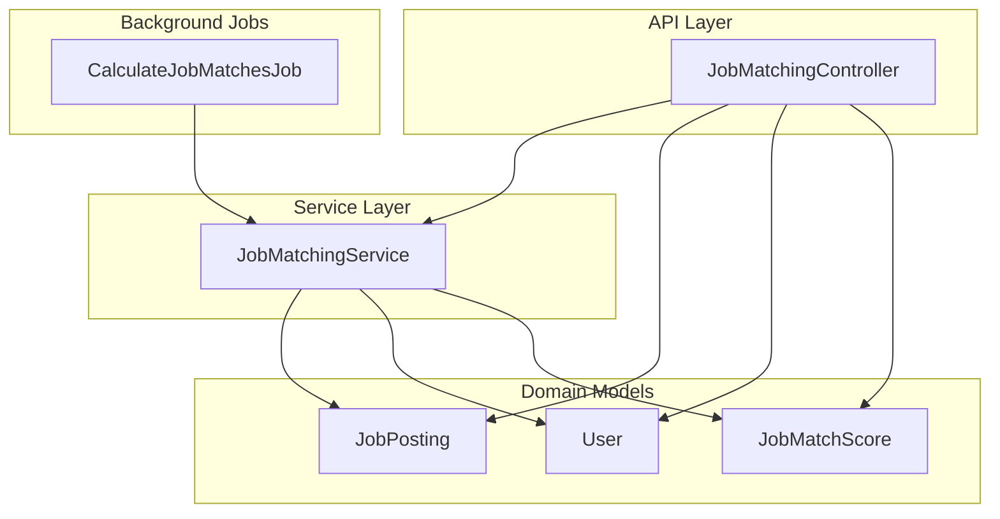
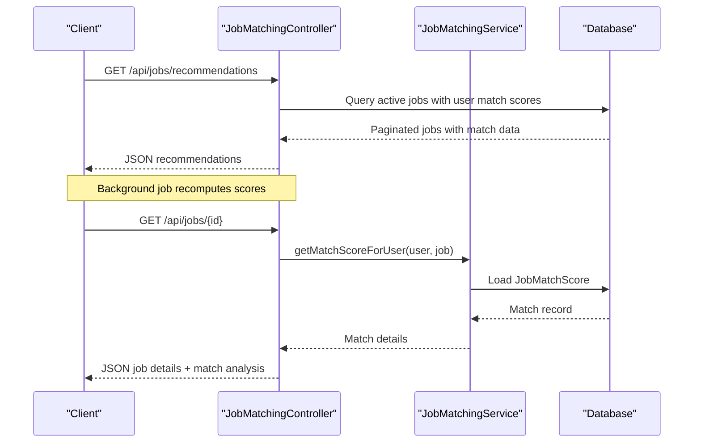
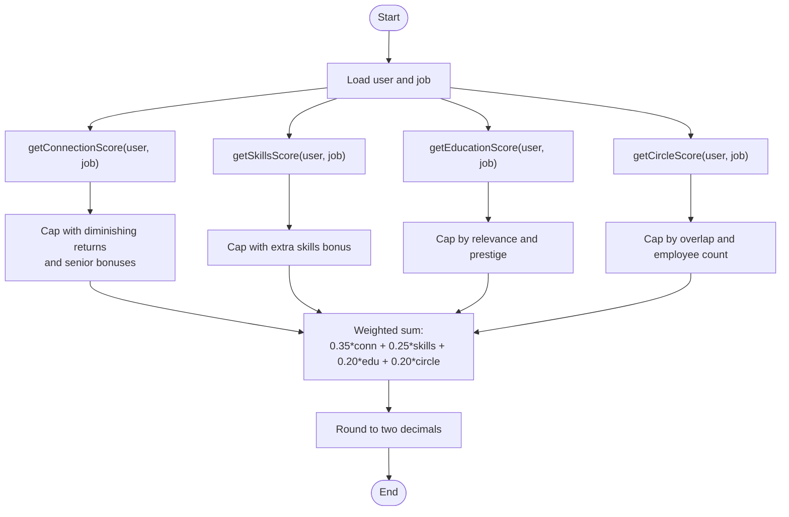
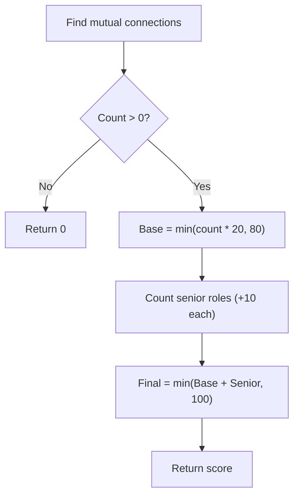
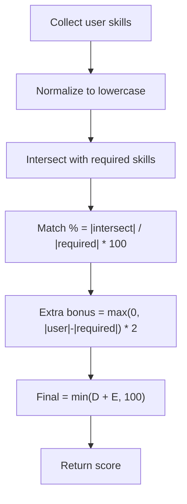
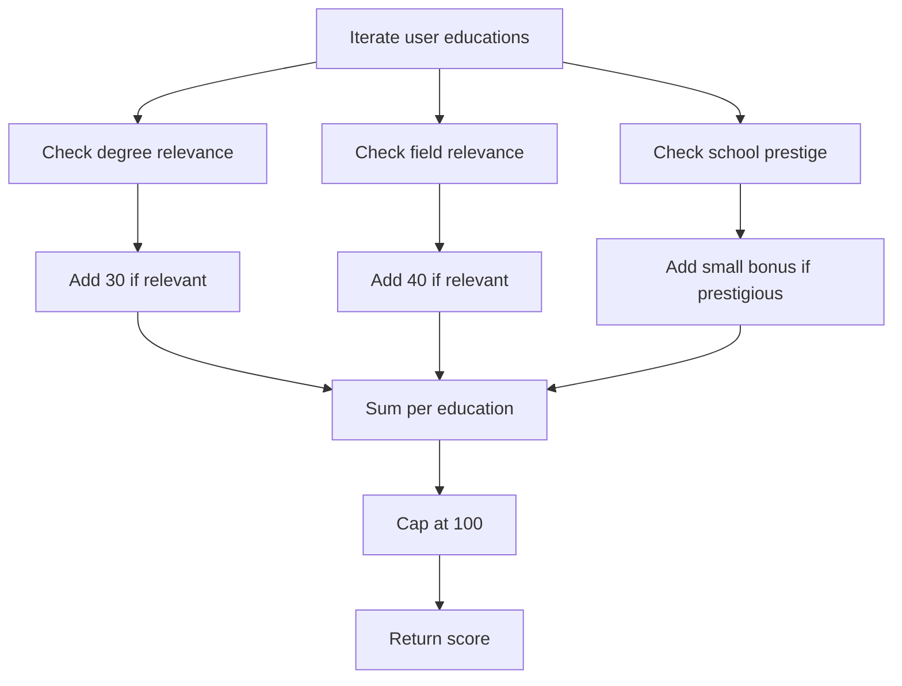
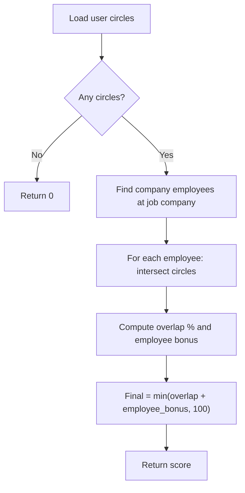
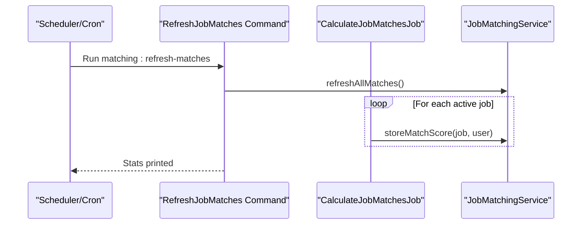
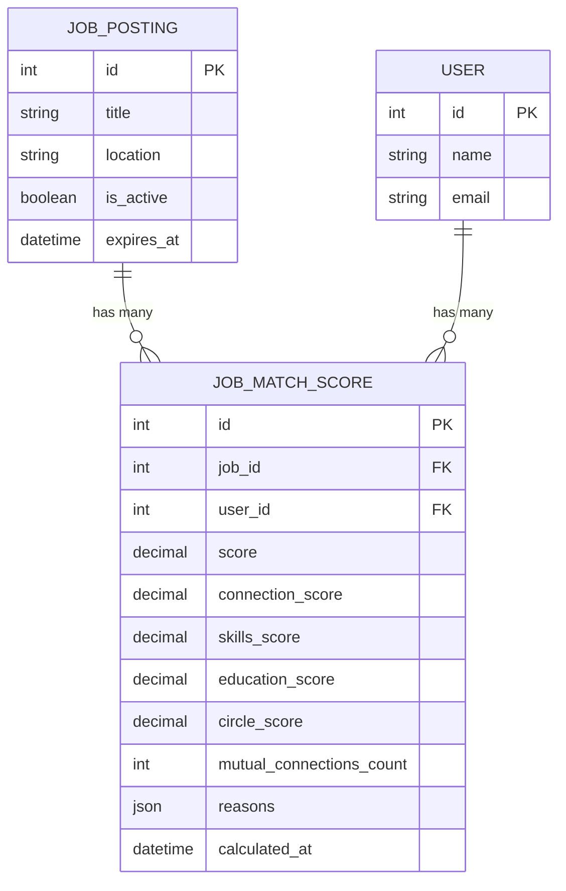
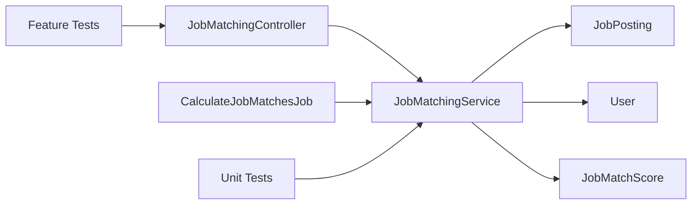

# Job Matching Algorithms

<cite>
**Referenced Files in This Document**
- [JobMatchingService.php](file://app/Services/JobMatchingService.php)
- [JobMatchingController.php](file://app/Http/Controllers/API/JobMatchingController.php)
- [CalculateJobMatchesJob.php](file://app/Jobs/CalculateJobMatchesJob.php)
- [JobMatchScore.php](file://app/Models/JobMatchScore.php)
- [JobPosting.php](file://app/Models/JobPosting.php)
- [User.php](file://app/Models/User.php)
- [JobMatchingServiceTest.php](file://tests/Unit/JobMatchingServiceTest.php)
- [JobMatchingTest.php](file://tests/Feature/JobMatchingTest.php)
- [RefreshJobMatches.php](file://app/Console/Commands/RefreshJobMatches.php)
- [SendJobMatchNotifications.php](file://app/Console/Commands/SendJobMatchNotifications.php)
- [api.php](file://routes/api.php)
</cite>

## Table of Contents
1. [Introduction](#introduction)
2. [Project Structure](#project-structure)
3. [Core Components](#core-components)
4. [Architecture Overview](#architecture-overview)
5. [Detailed Component Analysis](#detailed-component-analysis)
6. [Dependency Analysis](#dependency-analysis)
7. [Performance Considerations](#performance-considerations)
8. [Troubleshooting Guide](#troubleshooting-guide)
9. [Conclusion](#conclusion)

## Introduction
This document explains the AI-powered job matching system that computes personalized recommendations for users based on a multi-factor scoring algorithm. The system integrates connection networks, skills alignment, education relevance, and alumni circle overlap to produce a composite score and match reasons. It also documents weight distribution, scoring calculations, bonus systems for senior connections, diminishing returns logic, examples of match calculations, score interpretation, recommendation ranking, performance optimization, caching strategies, and real-time matching updates.

## Project Structure
The job matching pipeline spans services, models, controllers, jobs, and tests:
- Services encapsulate the scoring logic and orchestrate match calculations.
- Models represent domain entities and expose helpers for filtering and retrieval.
- Controllers expose REST endpoints for recommendations, job details, applications, and introductions.
- Jobs perform batch and on-demand calculations with retry and timeout controls.
- Tests validate correctness of scoring, edge cases, and API behavior.

**Diagram sources**
- [JobMatchingController.php:16-415](file://app/Http/Controllers/API/JobMatchingController.php#L16-L415)
- [JobMatchingService.php:12-362](file://app/Services/JobMatchingService.php#L12-L362)
- [JobPosting.php:11-126](file://app/Models/JobPosting.php#L11-L126)
- [User.php:13-818](file://app/Models/User.php#L13-L818)
- [JobMatchScore.php:9-146](file://app/Models/JobMatchScore.php#L9-L146)
- [CalculateJobMatchesJob.php:15-258](file://app/Jobs/CalculateJobMatchesJob.php#L15-L258)

**Section sources**
- [JobMatchingController.php:16-415](file://app/Http/Controllers/API/JobMatchingController.php#L16-L415)
- [JobMatchingService.php:12-362](file://app/Services/JobMatchingService.php#L12-L362)
- [JobPosting.php:11-126](file://app/Models/JobPosting.php#L11-L126)
- [User.php:13-818](file://app/Models/User.php#L13-L818)
- [JobMatchScore.php:9-146](file://app/Models/JobMatchScore.php#L9-L146)
- [CalculateJobMatchesJob.php:15-258](file://app/Jobs/CalculateJobMatchesJob.php#L15-L258)

## Core Components
- Weighted scoring: The composite score is a weighted sum of four factors:
  - Connections: 35%
  - Skills: 25%
  - Education: 20%
  - Circles: 20%
- Diminishing returns: Scores are capped per factor to prevent extreme inflation.
- Bonuses:
  - Senior connections: +10 per senior/hiring connection.
  - Extra skills beyond requirements: +2 per surplus skill.
  - Prestigious schools: small additive bonus.
  - Many employees in shared circles: small additive bonus.
- Match reasons: Structured explanations for why a job matches a user, sorted by impact.

**Section sources**
- [JobMatchingService.php:14-41](file://app/Services/JobMatchingService.php#L14-L41)
- [JobMatchingService.php:46-170](file://app/Services/JobMatchingService.php#L46-L170)
- [JobMatchingService.php:175-233](file://app/Services/JobMatchingService.php#L175-L233)

## Architecture Overview
The system supports real-time and batch match computation. Real-time requests use cached match scores, while background jobs compute and update scores in bulk.

**Diagram sources**
- [JobMatchingController.php:26-96](file://app/Http/Controllers/API/JobMatchingController.php#L26-L96)
- [JobMatchingController.php:101-185](file://app/Http/Controllers/API/JobMatchingController.php#L101-L185)
- [JobPosting.php:89-96](file://app/Models/JobPosting.php#L89-L96)
- [JobMatchScore.php:62-81](file://app/Models/JobMatchScore.php#L62-L81)

## Detailed Component Analysis

### Multi-Factor Scoring Engine
The scoring engine computes four per-factor scores and combines them with fixed weights.

**Diagram sources**
- [JobMatchingService.php:26-41](file://app/Services/JobMatchingService.php#L26-L41)
- [JobMatchingService.php:46-170](file://app/Services/JobMatchingService.php#L46-L170)

**Section sources**
- [JobMatchingService.php:14-41](file://app/Services/JobMatchingService.php#L14-L41)
- [JobMatchingService.php:46-170](file://app/Services/JobMatchingService.php#L46-L170)

### Connection Network Score (35% weight)
- Counts accepted connections at the target company.
- Base score: min(connections × 20, 80) to enforce diminishing returns.
- Senior connection bonus: +10 per senior/hiring title.
- Final capped at 100.

**Diagram sources**
- [JobMatchingService.php:46-64](file://app/Services/JobMatchingService.php#L46-L64)
- [JobMatchingService.php:238-253](file://app/Services/JobMatchingService.php#L238-L253)

**Section sources**
- [JobMatchingService.php:46-64](file://app/Services/JobMatchingService.php#L46-L64)
- [JobMatchingService.php:355-360](file://app/Services/JobMatchingService.php#L355-L360)

### Skills Alignment Score (25% weight)
- Normalizes matching skills to a percentage against required skills.
- Extra skills bonus: +2 per user skill beyond required.
- Final capped at 100.

**Diagram sources**
- [JobMatchingService.php:69-88](file://app/Services/JobMatchingService.php#L69-L88)
- [JobMatchingService.php:285-304](file://app/Services/JobMatchingService.php#L285-L304)

**Section sources**
- [JobMatchingService.php:69-88](file://app/Services/JobMatchingService.php#L69-L88)
- [JobMatchingService.php:285-304](file://app/Services/JobMatchingService.php#L285-L304)

### Education Relevance Score (20% weight)
- Degree relevance: checks if degree aligns with job title/description.
- Field relevance: checks if field words intersect with job title/description.
- Prestige bonus: small additive bonus for prestigious schools.
- Final capped at 100.

**Diagram sources**
- [JobMatchingService.php:93-127](file://app/Services/JobMatchingService.php#L93-L127)
- [JobMatchingService.php:309-350](file://app/Services/JobMatchingService.php#L309-L350)

**Section sources**
- [JobMatchingService.php:93-127](file://app/Services/JobMatchingService.php#L93-L127)
- [JobMatchingService.php:309-350](file://app/Services/JobMatchingService.php#L309-L350)

### Circle Overlap Score (20% weight)
- Identifies company employees who share circles with the user.
- Overlap percentage: shared circles / total user circles.
- Employee bonus: up to +20 based on number of employees in shared circles.
- Final capped at 100.

**Diagram sources**
- [JobMatchingService.php:132-170](file://app/Services/JobMatchingService.php#L132-L170)
- [JobMatchingService.php:134-168](file://app/Services/JobMatchingService.php#L134-L168)

**Section sources**
- [JobMatchingService.php:132-170](file://app/Services/JobMatchingService.php#L132-L170)

### Match Reasons Generation
The system generates human-readable reasons for the match, including:
- Number of connections at the company.
- Number of matching skills.
- Education relevance.
- Circle overlap presence.

Reasons are sorted by score descending.

**Section sources**
- [JobMatchingService.php:175-233](file://app/Services/JobMatchingService.php#L175-L233)

### API Endpoints and Usage
- GET /api/jobs/recommendations: Returns paginated jobs with match score, level, top reasons, and mutual connections count.
- GET /api/jobs/{id}: Returns job details with match breakdown and reasons.
- POST /api/jobs/{id}/apply: Submits an application with optional resume and optional introduction request.
- POST /api/jobs/{id}/request-introduction: Sends an introduction request via a mutual connection.
- GET /api/jobs/{id}/connections: Lists mutual connections at the company.

**Section sources**
- [JobMatchingController.php:26-96](file://app/Http/Controllers/API/JobMatchingController.php#L26-L96)
- [JobMatchingController.php:101-185](file://app/Http/Controllers/API/JobMatchingController.php#L101-L185)
- [JobMatchingController.php:190-278](file://app/Http/Controllers/API/JobMatchingController.php#L190-L278)
- [JobMatchingController.php:283-333](file://app/Http/Controllers/API/JobMatchingController.php#L283-L333)
- [JobMatchingController.php:338-366](file://app/Http/Controllers/API/JobMatchingController.php#L338-L366)
- [api.php:1-200](file://routes/api.php#L1-L200)

### Background Jobs and Batch Updates
- CalculateJobMatchesJob: Supports single match, job-wide, user-wide, and full recalculation with batching and retries.
- RefreshJobMatches command: Orchestrates refreshing all matches and prints statistics.

**Diagram sources**
- [RefreshJobMatches.php:8-51](file://app/Console/Commands/RefreshJobMatches.php#L8-L51)
- [CalculateJobMatchesJob.php:178-210](file://app/Jobs/CalculateJobMatchesJob.php#L178-L210)
- [JobMatchingService.php:258-280](file://app/Services/JobMatchingService.php#L258-L280)

**Section sources**
- [CalculateJobMatchesJob.php:15-258](file://app/Jobs/CalculateJobMatchesJob.php#L15-L258)
- [RefreshJobMatches.php:8-51](file://app/Console/Commands/RefreshJobMatches.php#L8-L51)

### Data Model and Persistence
- JobMatchScore persists the composite score, per-factor scores, reasons, and metadata.
- JobPosting exposes helpers to filter active jobs and fetch a user’s latest match score.
- User relationships enable retrieving connections, career timelines, and circles.

**Diagram sources**
- [JobMatchScore.php:9-35](file://app/Models/JobMatchScore.php#L9-L35)
- [JobPosting.php:11-76](file://app/Models/JobPosting.php#L11-L76)
- [User.php:13-200](file://app/Models/User.php#L13-L200)

**Section sources**
- [JobMatchScore.php:9-146](file://app/Models/JobMatchScore.php#L9-L146)
- [JobPosting.php:89-96](file://app/Models/JobPosting.php#L89-L96)
- [User.php:186-194](file://app/Models/User.php#L186-L194)

### Examples and Interpretation
- Example scenario: A user with three connections at a company, 80% skills match, relevant education, and shared circles yields a composite score derived from the weighted formula.
- Score interpretation:
  - High: ≥ 80
  - Medium: 60–79
  - Low: < 60
- Top reasons help users understand why a job is recommended.

**Section sources**
- [JobMatchingService.php:69-88](file://app/Services/JobMatchingService.php#L69-L88)
- [JobMatchingService.php:93-127](file://app/Services/JobMatchingService.php#L93-L127)
- [JobMatchScore.php:69-81](file://app/Models/JobMatchScore.php#L69-L81)

### Recommendation Ranking
- Recommendations are filtered by active status and minimum score thresholds.
- Ranking is driven by the composite score, surfaced in the API response.

**Section sources**
- [JobMatchingController.php:34-51](file://app/Http/Controllers/API/JobMatchingController.php#L34-L51)
- [JobMatchingController.php:298-306](file://app/Http/Controllers/API/JobMatchingController.php#L298-L306)

## Dependency Analysis
- Controller depends on JobMatchingService for scoring and on JobPosting/User models for data retrieval.
- JobMatchingService depends on User, JobPosting, and JobMatchScore persistence.
- CalculateJobMatchesJob orchestrates batch updates and retries.
- Tests validate scoring correctness and API behavior.

**Diagram sources**
- [JobMatchingController.php:16-415](file://app/Http/Controllers/API/JobMatchingController.php#L16-L415)
- [JobMatchingService.php:12-362](file://app/Services/JobMatchingService.php#L12-L362)
- [JobMatchScore.php:9-146](file://app/Models/JobMatchScore.php#L9-L146)
- [CalculateJobMatchesJob.php:15-258](file://app/Jobs/CalculateJobMatchesJob.php#L15-L258)
- [JobMatchingServiceTest.php:14-311](file://tests/Unit/JobMatchingServiceTest.php#L14-L311)
- [JobMatchingTest.php:15-346](file://tests/Feature/JobMatchingTest.php#L15-L346)

**Section sources**
- [JobMatchingController.php:16-415](file://app/Http/Controllers/API/JobMatchingController.php#L16-L415)
- [JobMatchingService.php:12-362](file://app/Services/JobMatchingService.php#L12-L362)
- [JobMatchScore.php:9-146](file://app/Models/JobMatchScore.php#L9-L146)
- [CalculateJobMatchesJob.php:15-258](file://app/Jobs/CalculateJobMatchesJob.php#L15-L258)
- [JobMatchingServiceTest.php:14-311](file://tests/Unit/JobMatchingServiceTest.php#L14-L311)
- [JobMatchingTest.php:15-346](file://tests/Feature/JobMatchingTest.php#L15-L346)

## Performance Considerations
- Batching: Jobs process users and jobs in chunks to limit memory usage.
- Indexing: Ensure database indexes on foreign keys and frequently queried columns (e.g., job_id, user_id, is_active, expires_at).
- Caching: While JobMatchScore stores precomputed results, consider caching high-traffic queries (e.g., top recommendations) with appropriate invalidation.
- Asynchronous updates: Use background jobs to avoid blocking API responses during recomputation.
- Rate limits: Enforce rate limits on API endpoints to protect the system under load.

[No sources needed since this section provides general guidance]

## Troubleshooting Guide
- Zero connection score: Occurs when no mutual connections exist at the target company.
- Neutral skills score: Defaults to 50 when required or user skills are missing.
- Inactive job errors: Applications and details for inactive/expired jobs are rejected.
- Job worker failures: Logs include job context and stack traces for diagnosis.

**Section sources**
- [JobMatchingService.php:289-292](file://app/Services/JobMatchingService.php#L289-L292)
- [JobMatchingService.php:294-304](file://app/Services/JobMatchingService.php#L294-L304)
- [JobMatchingController.php:108-113](file://app/Http/Controllers/API/JobMatchingController.php#L108-L113)
- [JobMatchingController.php:202-207](file://app/Http/Controllers/API/JobMatchingController.php#L202-L207)
- [CalculateJobMatchesJob.php:47-57](file://app/Jobs/CalculateJobMatchesJob.php#L47-L57)
- [CalculateJobMatchesJob.php:215-224](file://app/Jobs/CalculateJobMatchesJob.php#L215-L224)

## Conclusion
The job matching system combines network insights, skills, education, and alumni circles into a robust, interpretable scoring model with built-in bonuses and diminishing returns. It supports real-time recommendations via cached scores and batch recomputation through background jobs, ensuring scalability and responsiveness. The modular design enables future enhancements such as machine learning features, richer caching strategies, and advanced personalization.