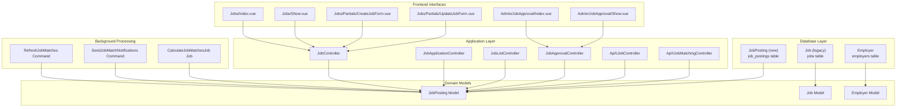
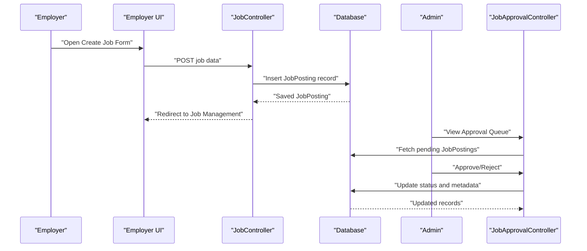
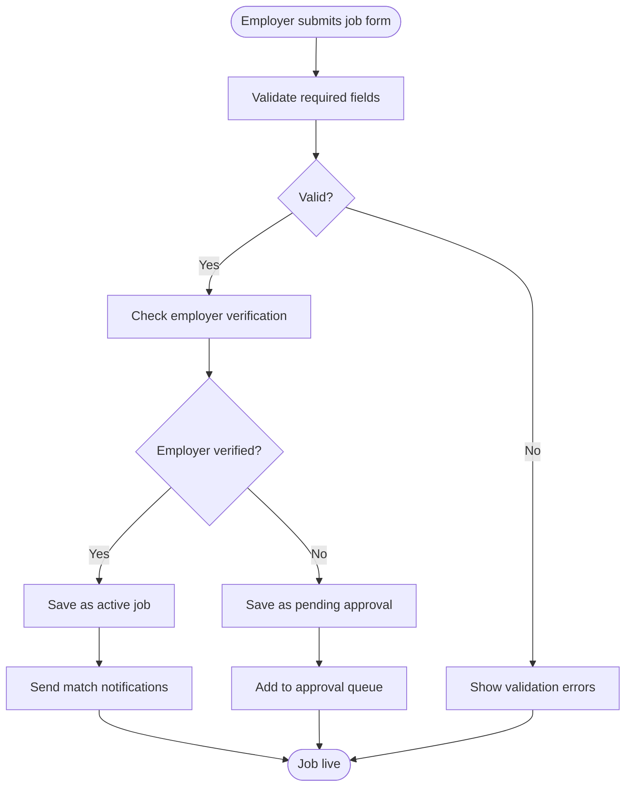
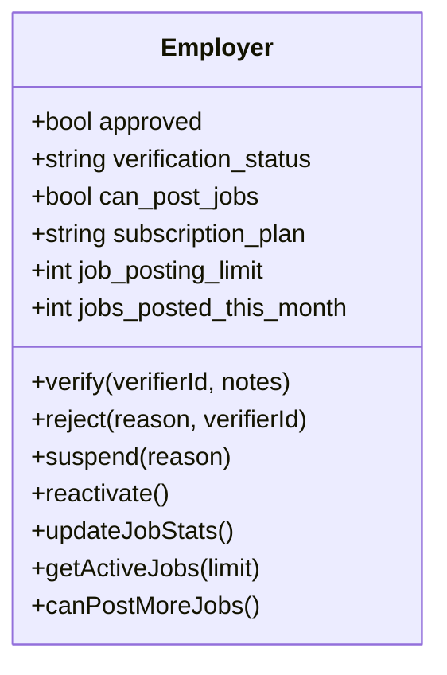
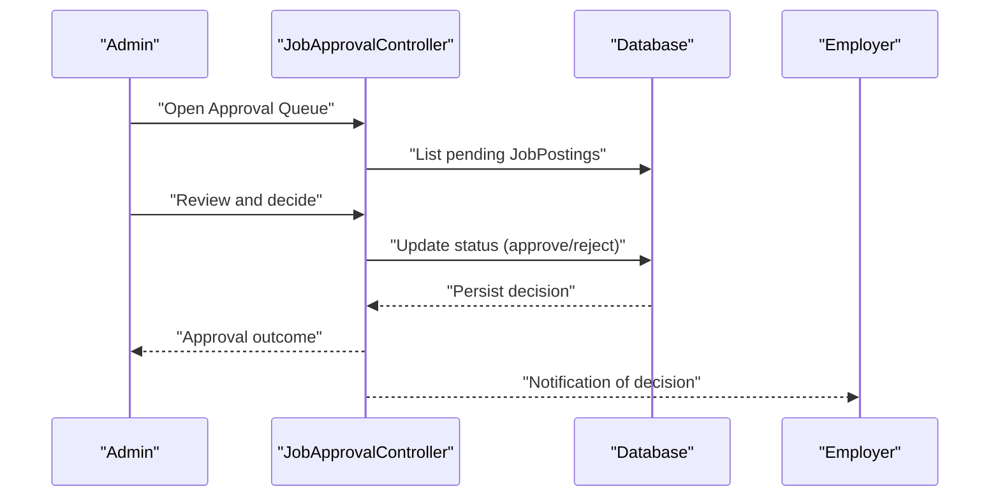
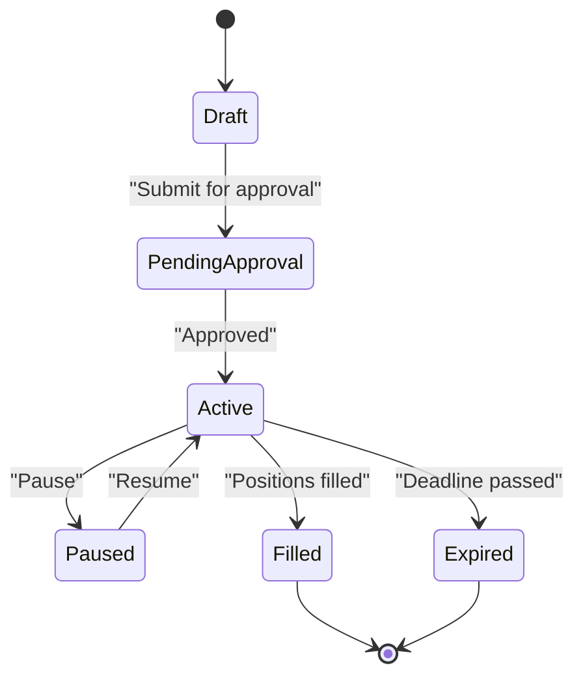
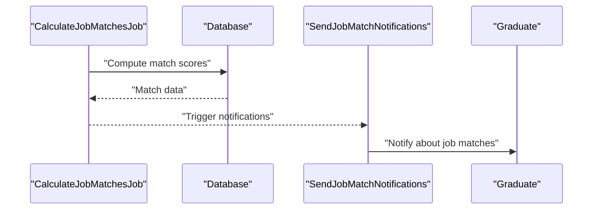
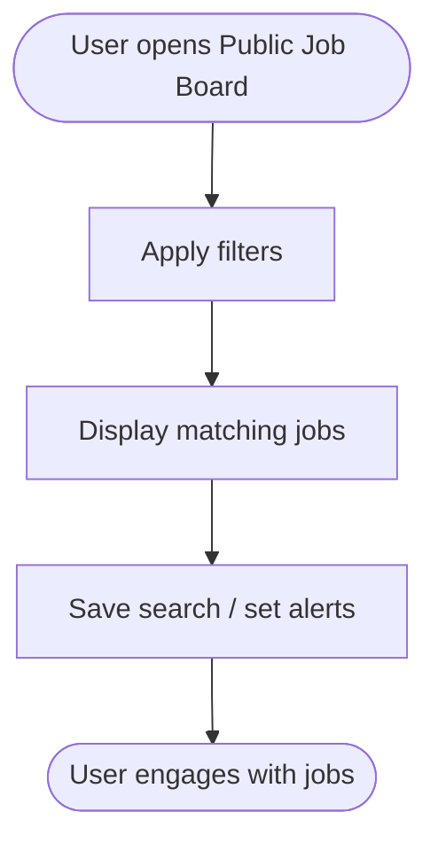
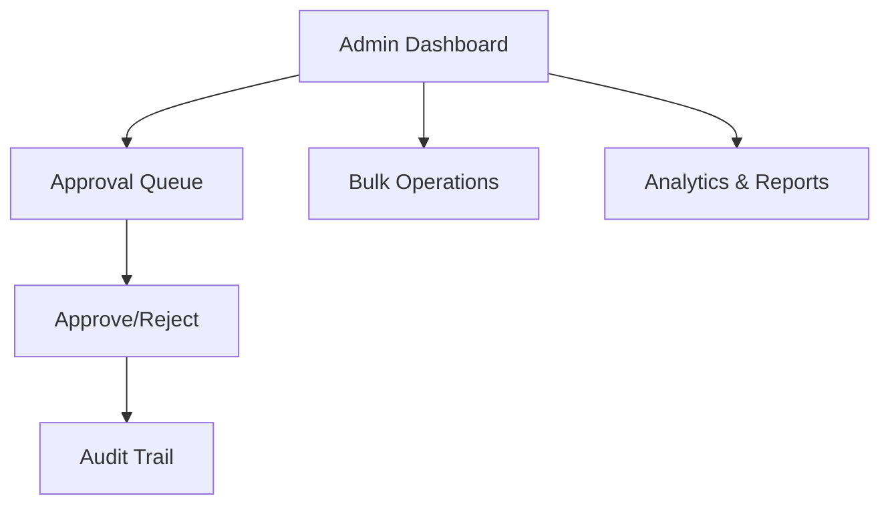
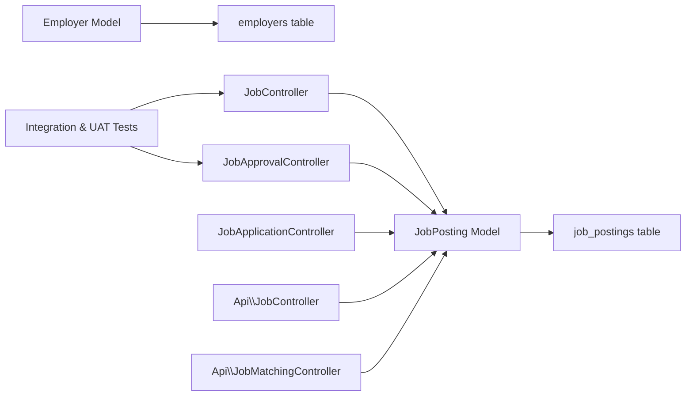

# Job Posting Management

<cite>
**Referenced Files in This Document**
- [task-08-job-posting-management-recap.md](file://docs/task-08-job-posting-management-recap.md)
- [2025_07_30_121137_create_job_postings_table.php](file://database/migrations/2025_07_30_121137_create_job_postings_table.php)
- [2024_01_01_000005_create_employers_table.php](file://database/migrations/2024_01_01_000005_create_employers_table.php)
- [2024_01_01_000006_create_jobs_table.php](file://database/migrations/2024_01_01_000006_create_jobs_table.php)
- [Job.php](file://app/Models/Job.php)
- [JobPosting.php](file://app/Models/JobPosting.php)
- [Employer.php](file://app/Models/Employer.php)
- [JobController.php](file://app/Http/Controllers/JobController.php)
- [JobApprovalController.php](file://app/Http/Controllers/JobApprovalController.php)
- [JobApplicationController.php](file://app/Http/Controllers/JobApplicationController.php)
- [JobListController.php](file://app/Http/Controllers/JobListController.php)
- [Api/JobController.php](file://app/Http/Controllers/Api/JobController.php)
- [Api/JobMatchingController.php](file://app/Http/Controllers/Api/JobMatchingController.php)
- [JobManagementIntegrationTest.php](file://tests/Integration/JobManagementIntegrationTest.php)
- [TestRunner.php](file://tests/UserAcceptance/TestRunner.php)
- [RefreshJobMatches.php](file://app/Console/Commands/RefreshJobMatches.php)
- [SendJobMatchNotifications.php](file://app/Console/Commands/SendJobMatchNotifications.php)
- [CalculateJobMatchesJob.php](file://app/Jobs/CalculateJobMatchesJob.php)
</cite>

## Table of Contents
1. [Introduction](#introduction)
2. [Project Structure](#project-structure)
3. [Core Components](#core-components)
4. [Architecture Overview](#architecture-overview)
5. [Detailed Component Analysis](#detailed-component-analysis)
6. [Dependency Analysis](#dependency-analysis)
7. [Performance Considerations](#performance-considerations)
8. [Troubleshooting Guide](#troubleshooting-guide)
9. [Conclusion](#conclusion)

## Introduction
This document describes the job posting management system implemented in the platform. It covers job creation workflows, posting approval processes, employer verification requirements, and the full job lifecycle management. The system includes job posting forms, required fields validation, company verification processes, approval workflows, status tracking, publishing workflows, and administrative oversight mechanisms. Examples of job posting interfaces, approval dashboards, and employer management panels are documented alongside the underlying models and controllers that power these features.

## Project Structure
The job posting system spans database migrations, Eloquent models, controllers, services, Vue.js frontend pages, and automated tasks/jobs. The following diagram shows the high-level structure and relationships among key components.

**Diagram sources**
- [2025_07_30_121137_create_job_postings_table.php:16-42](file://database/migrations/2025_07_30_121137_create_job_postings_table.php#L16-L42)
- [2024_01_01_000005_create_employers_table.php:16-23](file://database/migrations/2024_01_01_000005_create_employers_table.php#L16-L23)
- [2024_01_01_000006_create_jobs_table.php:16-24](file://database/migrations/2024_01_01_000006_create_jobs_table.php#L16-L24)
- [JobPosting.php:11-76](file://app/Models/JobPosting.php#L11-L76)
- [Job.php:9-86](file://app/Models/Job.php#L9-L86)
- [Employer.php:9-105](file://app/Models/Employer.php#L9-L105)
- [JobController.php](file://app/Http/Controllers/JobController.php)
- [JobApplicationController.php](file://app/Http/Controllers/JobApplicationController.php)
- [JobListController.php](file://app/Http/Controllers/JobListController.php)
- [JobApprovalController.php](file://app/Http/Controllers/JobApprovalController.php)
- [Api/JobController.php](file://app/Http/Controllers/Api/JobController.php)
- [Api/JobMatchingController.php](file://app/Http/Controllers/Api/JobMatchingController.php)
- [RefreshJobMatches.php](file://app/Console/Commands/RefreshJobMatches.php)
- [SendJobMatchNotifications.php](file://app/Console/Commands/SendJobMatchNotifications.php)
- [CalculateJobMatchesJob.php](file://app/Jobs/CalculateJobMatchesJob.php)

**Section sources**
- [task-08-job-posting-management-recap.md:1-414](file://docs/task-08-job-posting-management-recap.md#L1-L414)

## Core Components
- JobPosting (new): A modern job posting entity with rich metadata, soft deletes, and application/match scoring relationships. It supports activation/expiry, remote allowance, employment type, experience level, and skills requirements.
- Job (legacy): A simpler job model used historically; still present in migrations.
- Employer: Manages employer verification status, subscription limits, and permissions to post jobs.
- Controllers: JobController, JobApplicationController, JobListController, JobApprovalController, and API controllers handle CRUD, approvals, matching, and listing.
- Frontend Pages: Vue.js pages for job creation, management, approval queues, and public job search.
- Background Jobs/Commands: Automated refresh and notifications for job matches and lifecycle maintenance.

**Section sources**
- [JobPosting.php:11-76](file://app/Models/JobPosting.php#L11-L76)
- [Job.php:9-86](file://app/Models/Job.php#L9-L86)
- [Employer.php:9-105](file://app/Models/Employer.php#L9-L105)
- [2025_07_30_121137_create_job_postings_table.php:16-42](file://database/migrations/2025_07_30_121137_create_job_postings_table.php#L16-L42)
- [2024_01_01_000005_create_employers_table.php:16-23](file://database/migrations/2024_01_01_000005_create_employers_table.php#L16-L23)
- [2024_01_01_000006_create_jobs_table.php:16-24](file://database/migrations/2024_01_01_000006_create_jobs_table.php#L16-L24)

## Architecture Overview
The system follows a layered architecture:
- Database layer: Migrations define job_postings, jobs, and employers tables with appropriate indexes and foreign keys.
- Domain models: Eloquent models encapsulate business logic for job posting, employer verification, and application lifecycle.
- Controllers: Handle HTTP requests for job creation, approval, listing, and API endpoints for matching.
- Frontend: Vue.js pages provide job creation forms, management dashboards, and admin approval interfaces.
- Background processing: Commands and jobs automate match calculations, notifications, and lifecycle maintenance.

**Diagram sources**
- [JobController.php](file://app/Http/Controllers/JobController.php)
- [JobApprovalController.php](file://app/Http/Controllers/JobApprovalController.php)
- [JobPosting.php:11-76](file://app/Models/JobPosting.php#L11-L76)

## Detailed Component Analysis

### Job Creation and Validation
- Job creation form captures title, description, requirements, location, salary range, remote allowance, employment type, experience level, and skills.
- Required fields validation ensures essential data is present before saving.
- Employers without verification may trigger an approval workflow; verified employers can publish immediately.

**Diagram sources**
- [task-08-job-posting-management-recap.md:288-310](file://docs/task-08-job-posting-management-recap.md#L288-L310)
- [JobPosting.php:15-29](file://app/Models/JobPosting.php#L15-L29)
- [Employer.php:113-139](file://app/Models/Employer.php#L113-L139)

**Section sources**
- [task-08-job-posting-management-recap.md:223-236](file://docs/task-08-job-posting-management-recap.md#L223-L236)
- [JobPosting.php:15-29](file://app/Models/JobPosting.php#L15-L29)
- [Employer.php:113-139](file://app/Models/Employer.php#L113-L139)

### Employer Verification and Permissions
- Employer verification tracks status (pending, verified, rejected, suspended) and enforces permissions to post jobs.
- Subscription plan and monthly posting limits govern posting capacity.
- Profile completion percentage and active status influence eligibility.

**Diagram sources**
- [Employer.php:13-61](file://app/Models/Employer.php#L13-L61)
- [Employer.php:195-221](file://app/Models/Employer.php#L195-L221)

**Section sources**
- [Employer.php:13-61](file://app/Models/Employer.php#L13-L61)
- [Employer.php:195-221](file://app/Models/Employer.php#L195-L221)

### Job Approval Workflow
- Pending jobs are routed to an admin approval queue.
- Admins review content quality, legal compliance, and platform standards.
- Decisions are tracked with audit trails and feedback to employers.

**Diagram sources**
- [JobApprovalController.php](file://app/Http/Controllers/JobApprovalController.php)
- [task-08-job-posting-management-recap.md:297-302](file://docs/task-08-job-posting-management-recap.md#L297-L302)

**Section sources**
- [task-08-job-posting-management-recap.md:288-310](file://docs/task-08-job-posting-management-recap.md#L288-L310)

### Job Lifecycle Management
- Status transitions: draft → pending approval → active → paused → filled → expired.
- Automatic expiry checking and renewal options maintain accurate job states.
- Application statistics and performance metrics support employer insights.

**Diagram sources**
- [Job.php:218-248](file://app/Models/Job.php#L218-L248)
- [Job.php:355-364](file://app/Models/Job.php#L355-L364)

**Section sources**
- [Job.php:218-248](file://app/Models/Job.php#L218-L248)
- [Job.php:355-364](file://app/Models/Job.php#L355-L364)

### Job Matching and Recommendations
- Background jobs calculate match scores between job postings and users.
- Commands refresh matches and send notifications to relevant users.
- Matching considers course, skills, profile completion, and GPA.

**Diagram sources**
- [CalculateJobMatchesJob.php](file://app/Jobs/CalculateJobMatchesJob.php)
- [RefreshJobMatches.php](file://app/Console/Commands/RefreshJobMatches.php)
- [SendJobMatchNotifications.php](file://app/Console/Commands/SendJobMatchNotifications.php)
- [Job.php:250-337](file://app/Models/Job.php#L250-L337)

**Section sources**
- [Job.php:250-337](file://app/Models/Job.php#L250-L337)
- [RefreshJobMatches.php](file://app/Console/Commands/RefreshJobMatches.php)
- [SendJobMatchNotifications.php](file://app/Console/Commands/SendJobMatchNotifications.php)

### Public Job Board and Search
- Public job search supports filters by location, remote, employment type, experience level, and skills.
- Saved searches and alerts enhance discoverability.
- Mobile-responsive design ensures accessibility across devices.

**Diagram sources**
- [task-08-job-posting-management-recap.md:244-249](file://docs/task-08-job-posting-management-recap.md#L244-L249)

**Section sources**
- [task-08-job-posting-management-recap.md:244-249](file://docs/task-08-job-posting-management-recap.md#L244-L249)

### Administrative Oversight
- Admin dashboard displays job approval queue, bulk operations, and analytics.
- Content moderation and quality scoring help maintain platform standards.
- Audit trails capture all approval decisions and actions.

**Diagram sources**
- [task-08-job-posting-management-recap.md:251-256](file://docs/task-08-job-posting-management-recap.md#L251-L256)
- [JobApprovalController.php](file://app/Http/Controllers/JobApprovalController.php)

**Section sources**
- [task-08-job-posting-management-recap.md:251-256](file://docs/task-08-job-posting-management-recap.md#L251-L256)

## Dependency Analysis
The system exhibits clear separation of concerns:
- Models encapsulate domain logic and relationships.
- Controllers orchestrate requests and delegate to services or models.
- Migrations define schema and indexes for performance.
- Tests validate end-to-end workflows and data integrity.

**Diagram sources**
- [JobPosting.php:11-76](file://app/Models/JobPosting.php#L11-L76)
- [Employer.php:9-105](file://app/Models/Employer.php#L9-L105)
- [JobController.php](file://app/Http/Controllers/JobController.php)
- [JobApprovalController.php](file://app/Http/Controllers/JobApprovalController.php)
- [JobApplicationController.php](file://app/Http/Controllers/JobApplicationController.php)
- [Api/JobController.php](file://app/Http/Controllers/Api/JobController.php)
- [Api/JobMatchingController.php](file://app/Http/Controllers/Api/JobMatchingController.php)
- [JobManagementIntegrationTest.php:36-68](file://tests/Integration/JobManagementIntegrationTest.php#L36-L68)
- [TestRunner.php:410-425](file://tests/UserAcceptance/TestRunner.php#L410-L425)

**Section sources**
- [JobManagementIntegrationTest.php:36-68](file://tests/Integration/JobManagementIntegrationTest.php#L36-L68)
- [TestRunner.php:410-425](file://tests/UserAcceptance/TestRunner.php#L410-L425)

## Performance Considerations
- Database indexes on job_postings improve query performance for active/expiry filters, company lookups, and location/employment/experience searches.
- Background jobs and commands offload heavy computations (matching, notifications) from request threads.
- Pagination and lazy loading in frontend reduce payload sizes for large job datasets.

**Section sources**
- [2025_07_30_121137_create_job_postings_table.php:34-41](file://database/migrations/2025_07_30_121137_create_job_postings_table.php#L34-L41)
- [RefreshJobMatches.php](file://app/Console/Commands/RefreshJobMatches.php)
- [SendJobMatchNotifications.php](file://app/Console/Commands/SendJobMatchNotifications.php)

## Troubleshooting Guide
- Job posting validation failures: Ensure required fields (title, description) are populated; review form validation messages.
- Approval queue delays: Confirm employer verification status and subscription limits; check admin queue for pending items.
- Matching not triggered: Verify background job scheduling and logs; confirm match calculation jobs are running.
- Expiry issues: Check application deadline logic and automatic expiry updates; confirm cron/command scheduling.

**Section sources**
- [TestRunner.php:410-425](file://tests/UserAcceptance/TestRunner.php#L410-L425)
- [Job.php:355-364](file://app/Models/Job.php#L355-L364)
- [RefreshJobMatches.php](file://app/Console/Commands/RefreshJobMatches.php)
- [SendJobMatchNotifications.php](file://app/Console/Commands/SendJobMatchNotifications.php)

## Conclusion
The job posting management system provides a robust, scalable solution for job creation, approval, verification, and lifecycle management. It integrates employer dashboards, admin oversight, public job search, and automated matching to streamline recruitment workflows while ensuring quality and compliance.