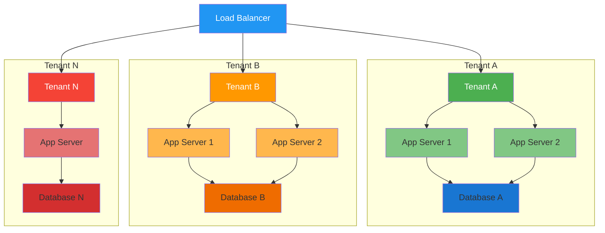
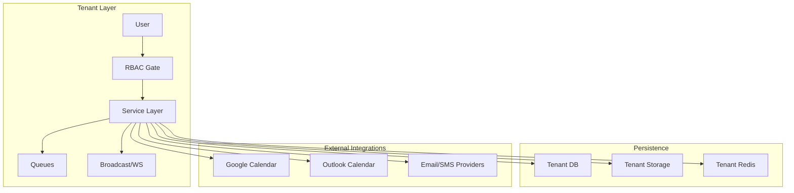
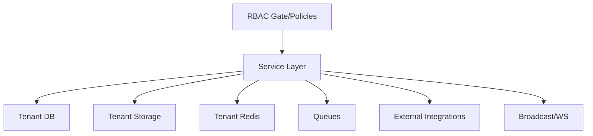

# Key Features and Capabilities

<cite>
**Referenced Files in This Document**
- [config/tenancy.php](file://config/tenancy.php)
- [app/Services/JobMatchingService.php](file://app/Services/JobMatchingService.php)
- [app/Services/SearchService.php](file://app/Services/SearchService.php)
- [app/Services/NotificationService.php](file://app/Services/NotificationService.php)
- [app/Services/MessagingService.php](file://app/Services/MessagingService.php)
- [app/Services/AlumniDirectoryService.php](file://app/Services/AlumniDirectoryService.php)
- [app/Services/CalendarIntegrationService.php](file://app/Services/CalendarIntegrationService.php)
- [app/Services/AnalyticsService.php](file://app/Services/AnalyticsService.php)
- [config/permission.php](file://config/permission.php)
- [deployment-plan.md](file://deployment-plan.md)
- [technical-specification.md](file://technical-specification.md)
- [task-03-multi-tenant-enhancement-recap.md](file://docs/task-03-multi-tenant-enhancement-recap.md)
- [task-09-notification-system-recap.md](file://docs/task-09-notification-system-recap.md)
- [task-10-communication-messaging-recap.md](file://docs/task-10-communication-messaging-recap.md)
- [task-11-search-matching-system-recap.md](file://docs/task-11-search-matching-system-recap.md)
- [task-13-analytics-reporting-system-recap.md](file://docs/task-13-analytics-reporting-system-recap.md)
- [task-08-job-posting-management-recap.md](file://docs/task-08-job-posting-management-recap.md)
- [employer-user-manual.md](file://docs/user-guides/employer/employer-user-manual.md)
</cite>

## Table of Contents
1. [Introduction](#introduction)
2. [Project Structure](#project-structure)
3. [Core Components](#core-components)
4. [Architecture Overview](#architecture-overview)
5. [Detailed Component Analysis](#detailed-component-analysis)
6. [Dependency Analysis](#dependency-analysis)
7. [Performance Considerations](#performance-considerations)
8. [Troubleshooting Guide](#troubleshooting-guide)
9. [Conclusion](#conclusion)

## Introduction
This document presents the key features and capabilities of the Alumate platform, focusing on how multi-tenant architecture, role-based access control, graduate management, job matching, analytics, communication systems, and employer services work together to deliver a cohesive, scalable, and user-centric alumni and career ecosystem. It explains implementation approaches, technology enablers, and user impact, and demonstrates how features integrate to create a seamless experience for graduates, institutions, and employers.

## Project Structure
Alumate is a Laravel-based platform with a modular service layer and tenant-aware configuration. The platform’s architecture separates concerns into specialized services (e.g., matching, messaging, notifications, analytics) while enforcing tenant isolation and role-based permissions. The deployment plan and technical specification outline horizontal scalability and multi-tenant separation across shared infrastructure.

**Diagram sources**
- [technical-specification.md:35-73](file://technical-specification.md#L35-L73)

**Section sources**
- [deployment-plan.md:19-39](file://deployment-plan.md#L19-L39)
- [technical-specification.md:35-73](file://technical-specification.md#L35-L73)
- [config/tenancy.php:12-58](file://config/tenancy.php#L12-L58)

## Core Components
- Multi-tenant architecture with tenant isolation, centralized configuration, and bootstrapped services for databases, cache, filesystem, queues, and Redis.
- Role-based access control built on a permissions model with configurable caches and granular checks.
- Graduate management with directory search, privacy-aware profiles, and connection/circle-based insights.
- Job matching powered by weighted scoring across connections, skills, education, and shared circles; complemented by advanced search and saved alerts.
- Communication and collaboration via real-time messaging, presence, typing indicators, and broadcast events.
- Notifications spanning email, SMS, in-app, and push channels with preference management and scheduling.
- Analytics and reporting for platform usage, feature adoption, and custom dashboards.
- Calendar integration supporting multiple providers and availability-based scheduling.

**Section sources**
- [config/tenancy.php:12-58](file://config/tenancy.php#L12-L58)
- [config/permission.php:5-27](file://config/permission.php#L5-L27)
- [app/Services/AlumniDirectoryService.php:12-155](file://app/Services/AlumniDirectoryService.php#L12-L155)
- [app/Services/JobMatchingService.php:12-41](file://app/Services/JobMatchingService.php#L12-L41)
- [app/Services/SearchService.php:11-83](file://app/Services/SearchService.php#L11-L83)
- [app/Services/MessagingService.php:15-95](file://app/Services/MessagingService.php#L15-L95)
- [app/Services/NotificationService.php:21-94](file://app/Services/NotificationService.php#L21-L94)
- [app/Services/AnalyticsService.php:80-116](file://app/Services/AnalyticsService.php#L80-L116)
- [app/Services/CalendarIntegrationService.php:16-55](file://app/Services/CalendarIntegrationService.php#L16-L55)

## Architecture Overview
The platform’s architecture emphasizes tenant isolation, service-oriented design, and real-time capabilities. Services encapsulate domain logic and coordinate with persistence, external integrations, and event broadcasting. RBAC ensures appropriate access to features and data, while analytics and notifications provide continuous feedback loops.

**Diagram sources**
- [config/tenancy.php:21-58](file://config/tenancy.php#L21-L58)
- [app/Services/NotificationService.php:99-194](file://app/Services/NotificationService.php#L99-L194)
- [app/Services/MessagingService.php:100-127](file://app/Services/MessagingService.php#L100-L127)
- [app/Services/CalendarIntegrationService.php:33-55](file://app/Services/CalendarIntegrationService.php#L33-L55)

## Detailed Component Analysis

### Multi-Tenant Architecture
- Tenant isolation is enforced across databases, cache, filesystem, queues, and Redis using a dedicated bootstrapper configuration.
- Centralized management of migrations, seeds, and tenant lifecycle jobs supports scalable provisioning and maintenance.
- Deployment plan illustrates shared database with tenant-specific schemas and horizontal scaling per tenant.

Implementation highlights
- Bootstrappers for database, cache, filesystem, queue, and Redis ensure tenant-aware operations.
- Migration and seeding parameters target tenant-specific paths.
- Jobs for create/delete/migrate/seed databases streamline tenant lifecycle management.

User impact
- Institutions gain complete data isolation, enabling independent customization and compliance.
- Scalability scales horizontally with load balancers and per-tenant compute/storage.

**Section sources**
- [config/tenancy.php:12-82](file://config/tenancy.php#L12-L82)
- [deployment-plan.md:19-39](file://deployment-plan.md#L19-L39)
- [task-03-multi-tenant-enhancement-recap.md:218-275](file://docs/task-03-multi-tenant-enhancement-recap.md#L218-L275)

### Role-Based Access Control (RBAC)
- RBAC integrates with Laravel gates and policies, using dedicated models for roles and permissions with configurable caching.
- Supports granular checks and optional event firing for role/permission attach/detach actions.

Implementation highlights
- Models configured for permissions and roles.
- Cache configuration with expiration intervals and store selection.
- Optional Octane reset listener for permission refresh in high-performance environments.

User impact
- Administrators can precisely control access to features, data, and administrative functions.
- Developers can enforce policy-based constraints consistently across controllers and services.

**Section sources**
- [config/permission.php:5-27](file://config/permission.php#L5-L27)
- [config/permission.php:179-201](file://config/permission.php#L179-L201)

### Graduate Management and Directory
- Directory search supports multi-field queries, filters by graduation year, location, industry, company, skills, institutions, circles, and groups.
- Privacy-aware profile rendering adjusts visibility based on connection status and user settings.
- Computed attributes include mutual connections, shared circles/groups, and connection status.

Implementation highlights
- Filter query builder constructs complex joins and JSON-based filters.
- Privacy controls applied dynamically to hide sensitive details.
- Computed attributes enrich profiles for contextual insights.

User impact
- Graduates discover peers efficiently with rich filters and privacy controls.
- Institutions and employers can surface relevant profiles while respecting privacy.

**Section sources**
- [app/Services/AlumniDirectoryService.php:30-155](file://app/Services/AlumniDirectoryService.php#L30-L155)
- [app/Services/AlumniDirectoryService.php:177-205](file://app/Services/AlumniDirectoryService.php#L177-L205)
- [app/Services/AlumniDirectoryService.php:275-333](file://app/Services/AlumniDirectoryService.php#L275-L333)

### Job Matching and Recommendations
- Matching service computes composite scores across connections, skills, education, and shared circles, with detailed reasons for each factor.
- Search service powers job and graduate discovery with advanced filters, sorting, and saved searches with alert automation.
- Recommendations combine course alignment and skills to surface relevant opportunities and candidates.

Implementation highlights
- Weighted scoring model with diminishing returns and bonuses for senior connections and prestigious schools.
- Compatibility scoring for preferences (location, salary, job type, work arrangement, experience).
- Saved searches with batch alert processing.

Technology enablers
- AI/ML-backed matching with historical application success and user feedback integration.
- Elasticsearch-backed search engine for high-performance indexing and query optimization.

User impact
- Graduates receive personalized job recommendations and match explanations.
- Employers discover aligned candidates with confidence indicators.

**Section sources**
- [app/Services/JobMatchingService.php:12-41](file://app/Services/JobMatchingService.php#L12-L41)
- [app/Services/JobMatchingService.php:175-233](file://app/Services/JobMatchingService.php#L175-L233)
- [app/Services/SearchService.php:13-83](file://app/Services/SearchService.php#L13-L83)
- [app/Services/SearchService.php:161-201](file://app/Services/SearchService.php#L161-L201)
- [task-11-search-matching-system-recap.md:339-515](file://docs/task-11-search-matching-system-recap.md#L339-L515)

### Communication Systems and Real-Time Features
- Messaging service supports direct, group, and circle-based conversations with participant management, read receipts, typing indicators, and message editing/deletion windows.
- Real-time broadcasting integrates with live messaging, presence, and system alerts.
- Calendar integration synchronizes external calendars (Google, Outlook, Apple, CalDAV), sends invites, and computes availability for scheduling.

Implementation highlights
- Transactional creation of conversations and messages with participant validation.
- Typing indicators and read receipts broadcast via events.
- Provider-specific APIs with unified event creation and syncing.

User impact
- Seamless collaboration among graduates, mentors, and institutions.
- Reduced friction in scheduling and event coordination.

**Section sources**
- [app/Services/MessagingService.php:15-95](file://app/Services/MessagingService.php#L15-L95)
- [app/Services/MessagingService.php:100-127](file://app/Services/MessagingService.php#L100-L127)
- [task-10-communication-messaging-recap.md:334-448](file://docs/task-10-communication-messaging-recap.md#L334-L448)
- [app/Services/CalendarIntegrationService.php:16-55](file://app/Services/CalendarIntegrationService.php#L16-L55)
- [app/Services/CalendarIntegrationService.php:184-210](file://app/Services/CalendarIntegrationService.php#L184-L210)

### Notifications and Multi-Channel Delivery
- Notification service orchestrates email, SMS, in-app, and push delivery with user preferences, caching, and scheduling.
- Channels are enabled/disabled per user and type, with robust logging and error handling.

Implementation highlights
- Channel dispatch logic with template resolution and caching.
- Preference management with defaults and cache invalidation.
- Scheduling and bulk operations for operational efficiency.

User impact
- Timely, personalized alerts across preferred channels.
- Reduced noise through granular preferences.

**Section sources**
- [app/Services/NotificationService.php:21-94](file://app/Services/NotificationService.php#L21-L94)
- [app/Services/NotificationService.php:198-241](file://app/Services/NotificationService.php#L198-L241)
- [task-09-notification-system-recap.md:381-495](file://docs/task-09-notification-system-recap.md#L381-L495)

### Analytics and Reporting
- Analytics service aggregates platform usage metrics, device/browser breakdowns, peak usage times, and feature adoption.
- Custom reports support flexible metric combinations and date-range filtering.
- Component analytics service calculates event counts, conversions, and rates.

Implementation highlights
- Metric aggregation with date-range scoping.
- Custom report generation with applied filters and timestamps.
- Conversion metrics including totals, averages, and breakdowns by type.

User impact
- Data-driven insights for platform growth, user engagement, and feature effectiveness.
- Self-service reporting reduces reliance on manual analysis.

**Section sources**
- [app/Services/AnalyticsService.php:80-116](file://app/Services/AnalyticsService.php#L80-L116)
- [app/Services/ComponentAnalyticsService.php:449-490](file://app/Services/ComponentAnalyticsService.php#L449-L490)
- [task-13-analytics-reporting-system-recap.md:518-550](file://docs/task-13-analytics-reporting-system-recap.md#L518-L550)

### Employer Services and Job Board
- Employer user manual outlines company profile setup, job posting management, and candidate search with advanced filters.
- Job posting management emphasizes completeness, visibility, and analytics for improved hiring outcomes.
- Performance optimizations include query optimization, caching, and background processing.

Implementation highlights
- Comprehensive job posting fields and media support.
- Advanced search filters for demographics, skills, and location.
- Employer analytics and visibility benefits tied to profile completion.

User impact
- Employers streamline recruitment with powerful search and posting tools.
- Graduates benefit from higher-quality, verified job opportunities.

**Section sources**
- [employer-user-manual.md:60-160](file://docs/user-guides/employer/employer-user-manual.md#L60-L160)
- [task-08-job-posting-management-recap.md:354-386](file://docs/task-08-job-posting-management-recap.md#L354-L386)

## Dependency Analysis
The platform’s services depend on tenant-aware persistence, external integrations, and event-driven communication. RBAC gates and policies mediate access to services and resources. Notifications and messaging rely on queues and broadcasting for scalability.

**Diagram sources**
- [config/permission.php:5-27](file://config/permission.php#L5-L27)
- [config/tenancy.php:21-58](file://config/tenancy.php#L21-L58)
- [app/Services/NotificationService.php:99-194](file://app/Services/NotificationService.php#L99-L194)
- [app/Services/MessagingService.php:100-127](file://app/Services/MessagingService.php#L100-L127)

**Section sources**
- [config/permission.php:5-27](file://config/permission.php#L5-L27)
- [config/tenancy.php:21-58](file://config/tenancy.php#L21-L58)

## Performance Considerations
- Multi-tenant bootstrapping and caching minimize cross-tenant interference and reduce latency.
- Background jobs and queues handle notifications, search alerts, and matching recalculations.
- Database optimization, pagination, and index strategies support large-scale search and recommendation engines.
- Real-time features leverage broadcasting and connection pooling for responsiveness.

[No sources needed since this section provides general guidance]

## Troubleshooting Guide
Common areas to investigate
- Tenant provisioning and migration failures: verify migration parameters and tenant lifecycle jobs.
- Notification delivery issues: check channel-specific templates, provider credentials, and logs.
- Messaging errors: confirm participant validation, read receipts, and broadcast subscriptions.
- Calendar sync problems: validate provider tokens, scopes, and CalDAV endpoints.
- Search and matching slowness: review query plans, indexes, and cache warming strategies.

Operational tools
- Health monitoring and automated alerts for tenant status and performance degradation.
- Maintenance utilities for backups, data migration, and configuration management.

**Section sources**
- [config/tenancy.php:66-82](file://config/tenancy.php#L66-L82)
- [app/Services/NotificationService.php:113-122](file://app/Services/NotificationService.php#L113-L122)
- [app/Services/MessagingService.php:132-153](file://app/Services/MessagingService.php#L132-L153)
- [app/Services/CalendarIntegrationService.php:75-87](file://app/Services/CalendarIntegrationService.php#L75-L87)
- [task-03-multi-tenant-enhancement-recap.md:218-230](file://docs/task-03-multi-tenant-enhancement-recap.md#L218-L230)

## Conclusion
Alumate’s feature set combines robust multi-tenancy, precise RBAC, intelligent matching, real-time communication, and comprehensive analytics to serve graduates, institutions, and employers. The modular service architecture, tenant isolation, and scalable infrastructure enable a seamless, privacy-conscious, and data-driven experience that differentiates the platform in the alumni and career ecosystem.