# Modern User Experience

<cite>
**Referenced Files in This Document**
- [manifest.json](file://public/manifest.json)
- [sw.js](file://public/sw.js)
- [PWA_IMPLEMENTATION.md](file://docs/PWA_IMPLEMENTATION.md)
- [tailwind.config.js](file://tailwind.config.js)
- [vite.config.ts](file://vite.config.ts)
- [postcss.config.js](file://postcss.config.js)
- [vite.php](file://config/vite.php)
- [accessibility-compliance-report.md](file://docs/accessibility-compliance-report.md)
- [accessibility-audit.md](file://docs/accessibility-audit.md)
- [user-experience-flows.md](file://docs/user-experience-flows.md)
- [PERFORMANCE_MONITORING.md](file://docs/PERFORMANCE_MONITORING.md)
- [FRONTEND_ARCHITECTURE_RECAP.md](file://docs/FRONTEND_ARCHITECTURE_RECAP.md)
</cite>

## Table of Contents
1. [Introduction](#introduction)
2. [Project Structure](#project-structure)
3. [Core Components](#core-components)
4. [Architecture Overview](#architecture-overview)
5. [Detailed Component Analysis](#detailed-component-analysis)
6. [Dependency Analysis](#dependency-analysis)
7. [Performance Considerations](#performance-considerations)
8. [Troubleshooting Guide](#troubleshooting-guide)
9. [Conclusion](#conclusion)
10. [Appendices](#appendices)

## Introduction
This document details the modern user experience features implemented in the platform, focusing on responsive design across desktop, tablet, and mobile; Progressive Web App (PWA) capabilities including offline functionality; dark mode support with theme switching; and accessibility compliance with WCAG 2.1 AA standards. It also explains intuitive navigation with guided onboarding, real-time updates with live notifications, performance optimization with lazy loading and code splitting, and user preference customization. Examples of responsive layouts, PWA features, and accessibility implementations are provided to help developers and stakeholders understand how these features are structured and delivered.

## Project Structure
The modern user experience spans frontend build configuration, styling, service worker-based PWA, and comprehensive accessibility documentation. The build tooling uses Vite with Vue 3 and TypeScript, Tailwind CSS for utility-first styling, and PostCSS for processing. The PWA is enabled through a Web App Manifest and a service worker that implements multiple caching strategies and offline support. Accessibility is documented through compliance and audit reports that outline WCAG 2.1 AA achievements and ongoing enhancements.

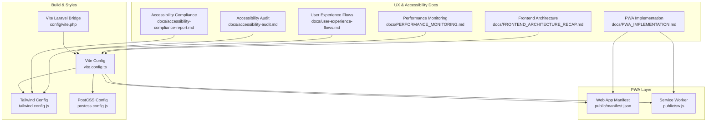

**Diagram sources**
- [vite.config.ts:1-163](file://vite.config.ts#L1-L163)
- [tailwind.config.js:1-106](file://tailwind.config.js#L1-L106)
- [postcss.config.js:1-7](file://postcss.config.js#L1-L7)
- [vite.php:1-55](file://config/vite.php#L1-L55)
- [manifest.json:1-139](file://public/manifest.json#L1-L139)
- [sw.js:1-649](file://public/sw.js#L1-L649)
- [PWA_IMPLEMENTATION.md:1-204](file://docs/PWA_IMPLEMENTATION.md#L1-L204)
- [accessibility-compliance-report.md:1-364](file://docs/accessibility-compliance-report.md#L1-L364)
- [accessibility-audit.md:1-328](file://docs/accessibility-audit.md#L1-L328)
- [user-experience-flows.md:1-265](file://docs/user-experience-flows.md#L1-L265)
- [PERFORMANCE_MONITORING.md:1-218](file://docs/PERFORMANCE_MONITORING.md#L1-L218)
- [FRONTEND_ARCHITECTURE_RECAP.md:1-264](file://docs/FRONTEND_ARCHITECTURE_RECAP.md#L1-L264)

**Section sources**
- [vite.config.ts:1-163](file://vite.config.ts#L1-L163)
- [tailwind.config.js:1-106](file://tailwind.config.js#L1-L106)
- [postcss.config.js:1-7](file://postcss.config.js#L1-L7)
- [vite.php:1-55](file://config/vite.php#L1-L55)
- [manifest.json:1-139](file://public/manifest.json#L1-L139)
- [sw.js:1-649](file://public/sw.js#L1-L649)
- [PWA_IMPLEMENTATION.md:1-204](file://docs/PWA_IMPLEMENTATION.md#L1-L204)
- [accessibility-compliance-report.md:1-364](file://docs/accessibility-compliance-report.md#L1-L364)
- [accessibility-audit.md:1-328](file://docs/accessibility-audit.md#L1-L328)
- [user-experience-flows.md:1-265](file://docs/user-experience-flows.md#L1-L265)
- [PERFORMANCE_MONITORING.md:1-218](file://docs/PERFORMANCE_MONITORING.md#L1-L218)
- [FRONTEND_ARCHITECTURE_RECAP.md:1-264](file://docs/FRONTEND_ARCHITECTURE_RECAP.md#L1-L264)

## Core Components
- Responsive design and mobile-first approach: Tailwind CSS configuration extends breakpoints and spacing, with a dedicated extra-small breakpoint and safe-area insets for modern devices. The build configuration targets modern browsers and optimizes assets for performance.
- PWA capabilities: The Web App Manifest defines installability, display modes, theme colors, and shortcuts. The service worker implements cache-first for static assets, network-first for API calls with offline fallback, stale-while-revalidate for dynamic content, and background sync for offline actions.
- Dark mode and theme switching: Tailwind’s theme system defines CSS variables for colors, borders, and rings, enabling consistent light/dark theming across components. The architecture documentation confirms theme management composables and appearance handling.
- Accessibility compliance: The platform achieves WCAG 2.1 AA compliance with comprehensive ARIA labeling, keyboard navigation, screen reader support, color contrast improvements, and reduced motion preferences. Accessibility reports detail implementation and testing methodology.
- Intuitive navigation and onboarding: The architecture documentation describes onboarding stores and guided flows, while user experience flows document cross-feature integration and real-time updates to enhance navigation.
- Real-time updates and live notifications: The user experience flows document WebSocket-based real-time updates and notification systems. The PWA implementation includes push notification handling.
- Performance optimization: The build configuration enables code splitting, chunk naming strategies, and asset optimization. Performance monitoring tracks cache hit rates, query performance, and timeline generation times.
- User preference customization: Theme management composables and appearance handling are part of the frontend architecture, supporting user preference customization for dark/light modes.

**Section sources**
- [tailwind.config.js:1-106](file://tailwind.config.js#L1-L106)
- [vite.config.ts:1-163](file://vite.config.ts#L1-L163)
- [manifest.json:1-139](file://public/manifest.json#L1-L139)
- [sw.js:1-649](file://public/sw.js#L1-L649)
- [FRONTEND_ARCHITECTURE_RECAP.md:106-130](file://docs/FRONTEND_ARCHITECTURE_RECAP.md#L106-L130)
- [accessibility-compliance-report.md:1-364](file://docs/accessibility-compliance-report.md#L1-L364)
- [accessibility-audit.md:1-328](file://docs/accessibility-audit.md#L1-L328)
- [user-experience-flows.md:138-156](file://docs/user-experience-flows.md#L138-L156)
- [PWA_IMPLEMENTATION.md:1-204](file://docs/PWA_IMPLEMENTATION.md#L1-L204)
- [PERFORMANCE_MONITORING.md:1-218](file://docs/PERFORMANCE_MONITORING.md#L1-L218)

## Architecture Overview
The modern user experience architecture integrates build-time optimizations, runtime PWA features, and accessibility-first design. The Vite build pipeline produces optimized bundles with code splitting and asset optimization. Tailwind CSS provides a responsive, mobile-first design system with theme variables. The service worker manages caching strategies and offline behavior, while the manifest enables installability. Accessibility is embedded in component design and validated through comprehensive testing and compliance reports.

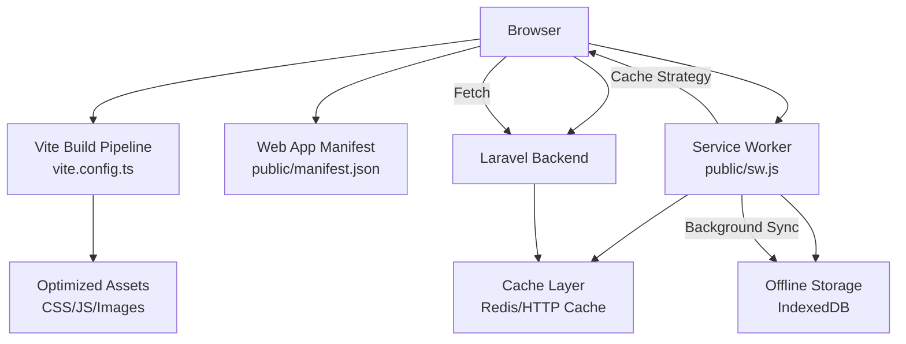

**Diagram sources**
- [vite.config.ts:1-163](file://vite.config.ts#L1-L163)
- [manifest.json:1-139](file://public/manifest.json#L1-L139)
- [sw.js:1-649](file://public/sw.js#L1-L649)
- [PERFORMANCE_MONITORING.md:126-140](file://docs/PERFORMANCE_MONITORING.md#L126-L140)

**Section sources**
- [vite.config.ts:1-163](file://vite.config.ts#L1-L163)
- [manifest.json:1-139](file://public/manifest.json#L1-L139)
- [sw.js:1-649](file://public/sw.js#L1-L649)
- [PERFORMANCE_MONITORING.md:126-140](file://docs/PERFORMANCE_MONITORING.md#L126-L140)

## Detailed Component Analysis

### Responsive Design and Mobile-First Principles
- Breakpoints and spacing: Tailwind configuration introduces an extra-small breakpoint and safe-area insets for modern devices. Typography and radius variables are defined for consistent scaling.
- Mobile touch targets: Accessibility documentation emphasizes minimum 44px touch targets and responsive design patterns.
- Asset optimization: Vite configuration organizes assets by type and enables compression and modern browser targeting.

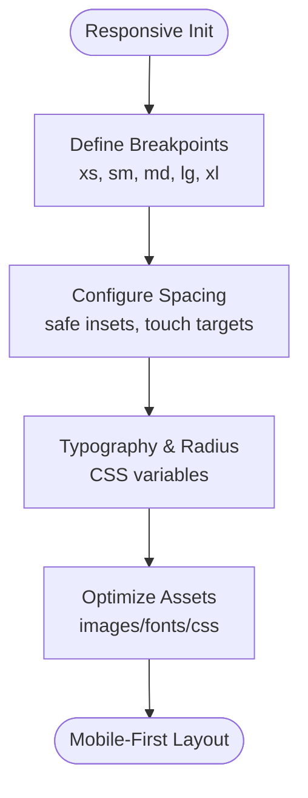

**Diagram sources**
- [tailwind.config.js:16-102](file://tailwind.config.js#L16-L102)
- [vite.config.ts:74-96](file://vite.config.ts#L74-L96)

**Section sources**
- [tailwind.config.js:16-102](file://tailwind.config.js#L16-L102)
- [vite.config.ts:74-96](file://vite.config.ts#L74-L96)
- [accessibility-audit.md:20-28](file://docs/accessibility-audit.md#L20-L28)

### Progressive Web App (PWA) Capabilities
- Manifest: Defines app identity, display mode, theme colors, icons, shortcuts, and share targets.
- Service worker: Implements cache-first for static assets, network-first for APIs with offline fallback, stale-while-revalidate for dynamic content, navigation fallback to offline page, background sync for offline actions, and push notification handling.
- Integration: PWA documentation covers JavaScript integration, offline page, push notification API endpoints, and testing checklist.

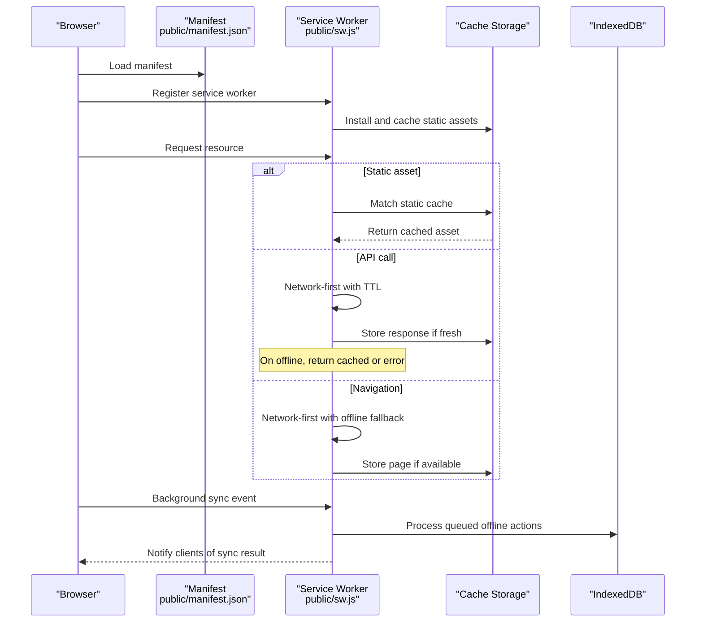

**Diagram sources**
- [manifest.json:1-139](file://public/manifest.json#L1-L139)
- [sw.js:57-139](file://public/sw.js#L57-L139)
- [sw.js:271-324](file://public/sw.js#L271-L324)
- [sw.js:440-466](file://public/sw.js#L440-L466)
- [PWA_IMPLEMENTATION.md:1-204](file://docs/PWA_IMPLEMENTATION.md#L1-L204)

**Section sources**
- [manifest.json:1-139](file://public/manifest.json#L1-L139)
- [sw.js:57-139](file://public/sw.js#L57-L139)
- [sw.js:271-324](file://public/sw.js#L271-L324)
- [sw.js:440-466](file://public/sw.js#L440-L466)
- [PWA_IMPLEMENTATION.md:1-204](file://docs/PWA_IMPLEMENTATION.md#L1-L204)

### Dark Mode Support and Theme Switching
- Theme variables: Tailwind theme defines CSS variables for background, foreground, primary, secondary, and other semantic tokens, enabling consistent light/dark theming.
- Appearance management: Frontend architecture documentation mentions appearance composables and theme management stores.
- Accessibility alignment: Compliance report highlights dark mode contrast testing and focus indicator visibility.

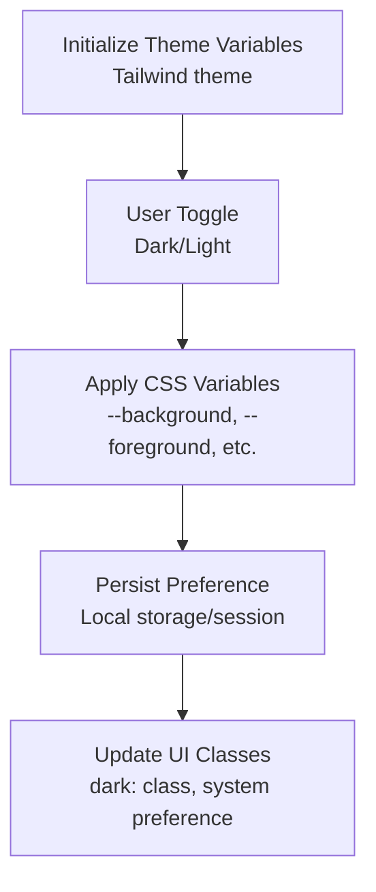

**Diagram sources**
- [tailwind.config.js:19-63](file://tailwind.config.js#L19-L63)
- [FRONTEND_ARCHITECTURE_RECAP.md:106-130](file://docs/FRONTEND_ARCHITECTURE_RECAP.md#L106-L130)
- [accessibility-compliance-report.md:166-170](file://docs/accessibility-compliance-report.md#L166-L170)

**Section sources**
- [tailwind.config.js:19-63](file://tailwind.config.js#L19-L63)
- [FRONTEND_ARCHITECTURE_RECAP.md:106-130](file://docs/FRONTEND_ARCHITECTURE_RECAP.md#L106-L130)
- [accessibility-compliance-report.md:166-170](file://docs/accessibility-compliance-report.md#L166-L170)

### Accessibility Compliance (WCAG 2.1 AA)
- Compliance status: The platform achieves WCAG 2.1 AA compliance with comprehensive ARIA implementation, keyboard navigation, screen reader support, color contrast improvements, and reduced motion preferences.
- Testing methodology: Automated tools (axe-core, Lighthouse, WAVE), manual testing (keyboard-only, screen readers), and user testing with assistive technologies.
- Ongoing maintenance: Regular audits, team training, and documentation updates ensure continued compliance.

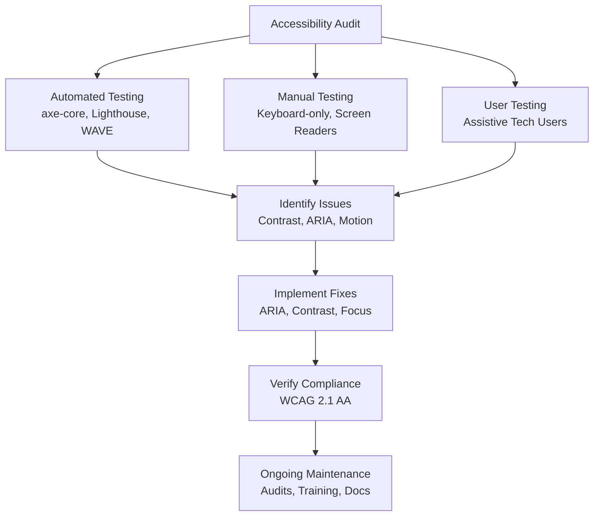

**Diagram sources**
- [accessibility-compliance-report.md:212-230](file://docs/accessibility-compliance-report.md#L212-L230)
- [accessibility-audit.md:260-276](file://docs/accessibility-audit.md#L260-L276)

**Section sources**
- [accessibility-compliance-report.md:1-364](file://docs/accessibility-compliance-report.md#L1-L364)
- [accessibility-audit.md:1-328](file://docs/accessibility-audit.md#L1-L328)

### Intuitive Navigation and Guided Onboarding
- Onboarding flows: Frontend architecture documentation describes onboarding stores and guided flows to improve user orientation.
- Cross-feature integration: User experience flows document real-time updates and cross-feature callbacks that keep navigation smooth and contextually relevant.

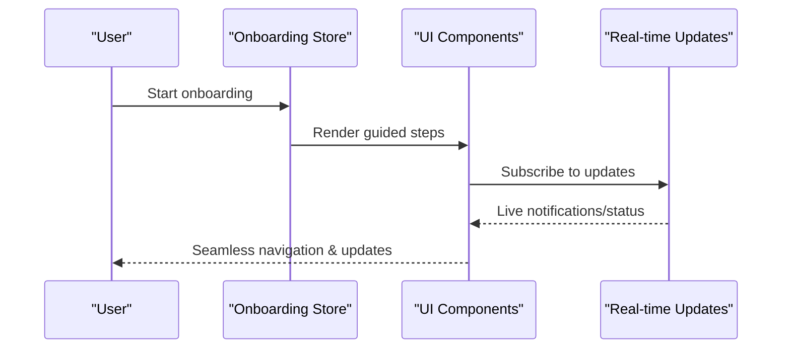

**Diagram sources**
- [FRONTEND_ARCHITECTURE_RECAP.md:106-130](file://docs/FRONTEND_ARCHITECTURE_RECAP.md#L106-L130)
- [user-experience-flows.md:138-156](file://docs/user-experience-flows.md#L138-L156)

**Section sources**
- [FRONTEND_ARCHITECTURE_RECAP.md:106-130](file://docs/FRONTEND_ARCHITECTURE_RECAP.md#L106-L130)
- [user-experience-flows.md:138-156](file://docs/user-experience-flows.md#L138-L156)

### Real-Time Updates and Live Notifications
- WebSocket integration: User experience flows describe real-time updates via composables and cross-feature notifications.
- Push notifications: PWA implementation includes push notification handling and endpoints for VAPID keys and subscriptions.

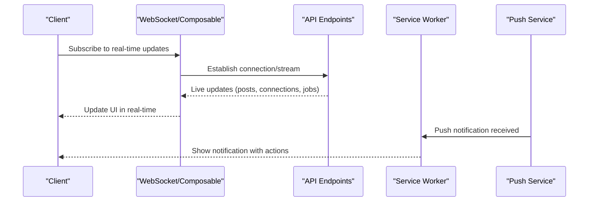

**Diagram sources**
- [user-experience-flows.md:138-156](file://docs/user-experience-flows.md#L138-L156)
- [PWA_IMPLEMENTATION.md:40-44](file://docs/PWA_IMPLEMENTATION.md#L40-L44)
- [sw.js:590-646](file://public/sw.js#L590-L646)

**Section sources**
- [user-experience-flows.md:138-156](file://docs/user-experience-flows.md#L138-L156)
- [PWA_IMPLEMENTATION.md:40-44](file://docs/PWA_IMPLEMENTATION.md#L40-L44)
- [sw.js:590-646](file://public/sw.js#L590-L646)

### Performance Optimization with Lazy Loading and Code Splitting
- Build optimization: Vite configuration enables code splitting, chunk naming strategies, and asset optimization for images and fonts.
- Performance monitoring: Dedicated endpoints and services track cache hit rates, query performance, and timeline generation times, with performance budgets and alerts.

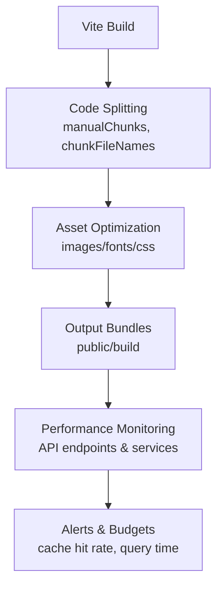

**Diagram sources**
- [vite.config.ts:25-96](file://vite.config.ts#L25-L96)
- [PERFORMANCE_MONITORING.md:33-74](file://docs/PERFORMANCE_MONITORING.md#L33-L74)
- [PERFORMANCE_MONITORING.md:117-125](file://docs/PERFORMANCE_MONITORING.md#L117-L125)

**Section sources**
- [vite.config.ts:25-96](file://vite.config.ts#L25-L96)
- [PERFORMANCE_MONITORING.md:33-74](file://docs/PERFORMANCE_MONITORING.md#L33-L74)
- [PERFORMANCE_MONITORING.md:117-125](file://docs/PERFORMANCE_MONITORING.md#L117-L125)

### User Preference Customization
- Theme management: Tailwind theme variables and frontend architecture composables enable user preference customization for dark/light modes.
- Accessibility preferences: Reduced motion support and high contrast media queries align with user needs.

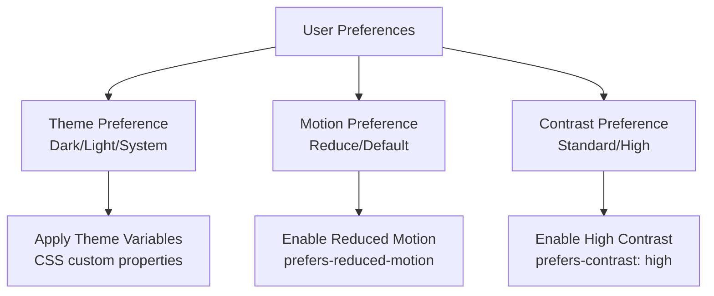

**Diagram sources**
- [tailwind.config.js:19-63](file://tailwind.config.js#L19-L63)
- [accessibility-audit.md:25-28](file://docs/accessibility-audit.md#L25-L28)
- [accessibility-compliance-report.md:166-170](file://docs/accessibility-compliance-report.md#L166-L170)

**Section sources**
- [tailwind.config.js:19-63](file://tailwind.config.js#L19-L63)
- [accessibility-audit.md:25-28](file://docs/accessibility-audit.md#L25-L28)
- [accessibility-compliance-report.md:166-170](file://docs/accessibility-compliance-report.md#L166-L170)

## Dependency Analysis
The modern user experience relies on coordinated dependencies across build configuration, styling, PWA assets, and documentation. The Vite configuration depends on Tailwind and PostCSS for styling, and integrates with the Laravel Vite bridge. The PWA depends on the manifest and service worker for caching and offline behavior. Accessibility compliance is validated through documentation and testing methodologies.

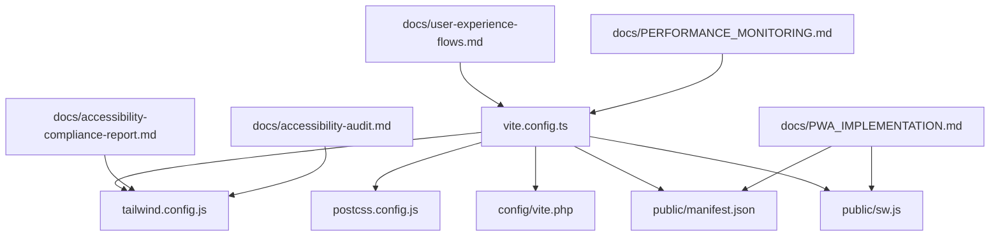

**Diagram sources**
- [vite.config.ts:1-163](file://vite.config.ts#L1-L163)
- [tailwind.config.js:1-106](file://tailwind.config.js#L1-L106)
- [postcss.config.js:1-7](file://postcss.config.js#L1-L7)
- [vite.php:1-55](file://config/vite.php#L1-L55)
- [manifest.json:1-139](file://public/manifest.json#L1-L139)
- [sw.js:1-649](file://public/sw.js#L1-L649)
- [accessibility-compliance-report.md:1-364](file://docs/accessibility-compliance-report.md#L1-L364)
- [accessibility-audit.md:1-328](file://docs/accessibility-audit.md#L1-L328)
- [PWA_IMPLEMENTATION.md:1-204](file://docs/PWA_IMPLEMENTATION.md#L1-L204)
- [user-experience-flows.md:1-265](file://docs/user-experience-flows.md#L1-L265)
- [PERFORMANCE_MONITORING.md:1-218](file://docs/PERFORMANCE_MONITORING.md#L1-L218)

**Section sources**
- [vite.config.ts:1-163](file://vite.config.ts#L1-L163)
- [tailwind.config.js:1-106](file://tailwind.config.js#L1-L106)
- [postcss.config.js:1-7](file://postcss.config.js#L1-L7)
- [vite.php:1-55](file://config/vite.php#L1-L55)
- [manifest.json:1-139](file://public/manifest.json#L1-L139)
- [sw.js:1-649](file://public/sw.js#L1-L649)
- [accessibility-compliance-report.md:1-364](file://docs/accessibility-compliance-report.md#L1-L364)
- [accessibility-audit.md:1-328](file://docs/accessibility-audit.md#L1-L328)
- [PWA_IMPLEMENTATION.md:1-204](file://docs/PWA_IMPLEMENTATION.md#L1-L204)
- [user-experience-flows.md:1-265](file://docs/user-experience-flows.md#L1-L265)
- [PERFORMANCE_MONITORING.md:1-218](file://docs/PERFORMANCE_MONITORING.md#L1-L218)

## Performance Considerations
- Bundle size and chunking: Vite’s manual chunking separates vendor libraries, utilities, UI components, and performance monitoring to optimize loading.
- Asset optimization: Images and fonts are organized and compressed; CSS minification is enabled.
- Runtime performance: Service worker caching reduces network latency; performance monitoring tracks key metrics and enforces budgets.
- Cross-platform compatibility: Modern browser targets with graceful degradation for unsupported features.

[No sources needed since this section provides general guidance]

## Troubleshooting Guide
- PWA registration and caching: Verify manifest loading, service worker registration, offline page routing, and push notification endpoints. Use browser devtools to inspect Application, Network, and Console tabs.
- Accessibility issues: Address ARIA labeling, keyboard navigation, color contrast, and reduced motion preferences. Use automated tools and manual testing to validate fixes.
- Performance regressions: Monitor cache hit rates, query times, and timeline generation times. Use performance monitoring endpoints and alerts to identify bottlenecks.
- Build and asset issues: Confirm Vite configuration, Laravel Vite bridge settings, and asset paths. Validate chunk naming and output directories.

**Section sources**
- [PWA_IMPLEMENTATION.md:127-142](file://docs/PWA_IMPLEMENTATION.md#L127-L142)
- [accessibility-compliance-report.md:212-230](file://docs/accessibility-compliance-report.md#L212-L230)
- [PERFORMANCE_MONITORING.md:141-153](file://docs/PERFORMANCE_MONITORING.md#L141-L153)
- [vite.php:13-54](file://config/vite.php#L13-L54)

## Conclusion
The platform delivers a modern user experience through responsive design, PWA capabilities, dark mode support, and WCAG 2.1 AA accessibility. Real-time updates, performance monitoring, and user preference customization further enhance usability. The documented architecture and implementation provide a clear foundation for maintaining and extending these features across desktop, tablet, and mobile environments.

[No sources needed since this section summarizes without analyzing specific files]

## Appendices
- Examples of responsive layouts: Tailwind configuration with xs breakpoint and safe-area insets.
- PWA features: Manifest and service worker caching strategies, offline fallback, background sync, and push notifications.
- Accessibility implementations: ARIA patterns, keyboard navigation, color contrast, and reduced motion support.

[No sources needed since this section provides general guidance]