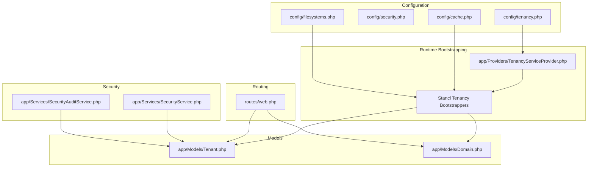
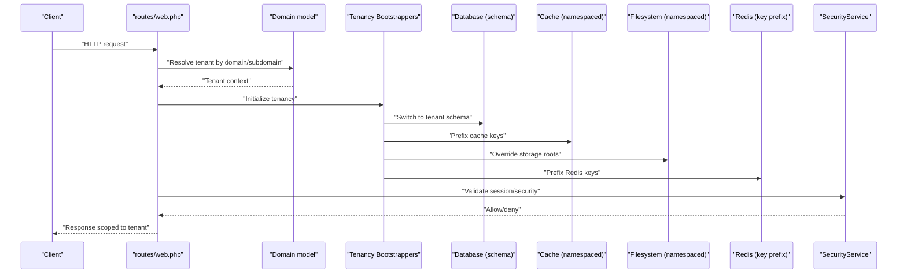
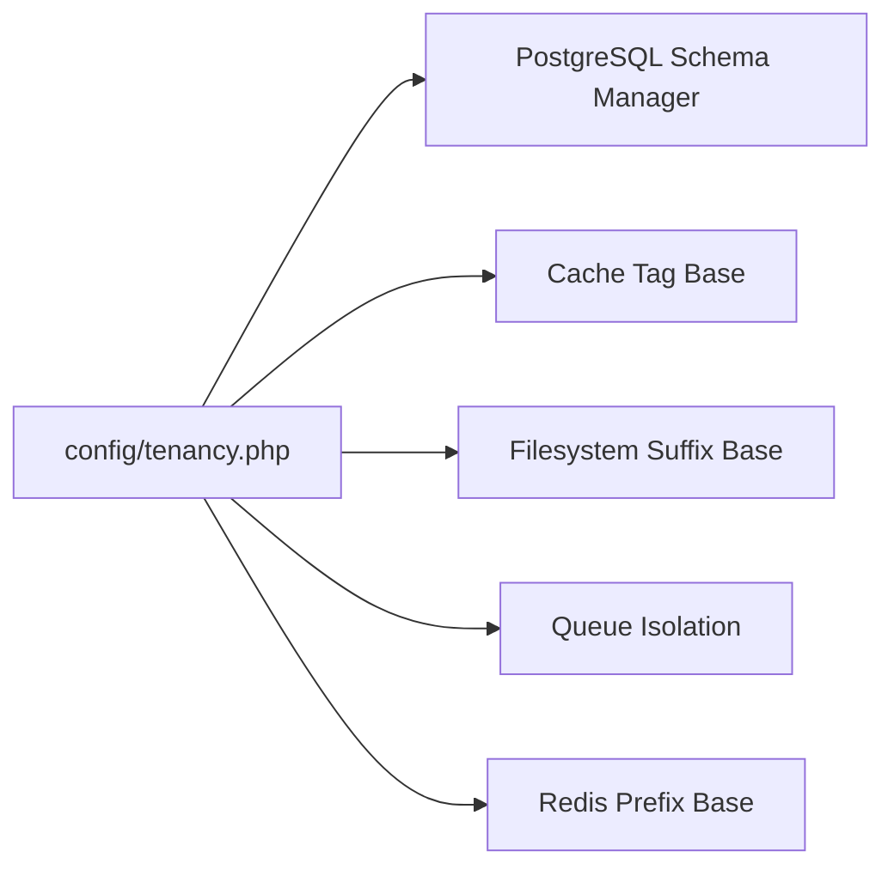
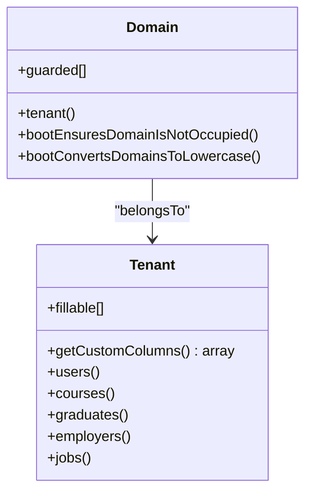
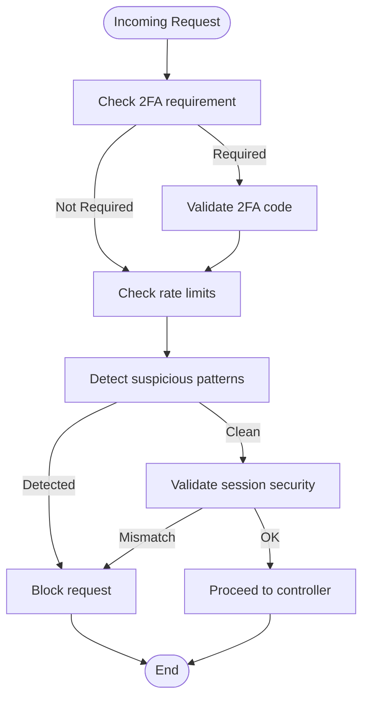
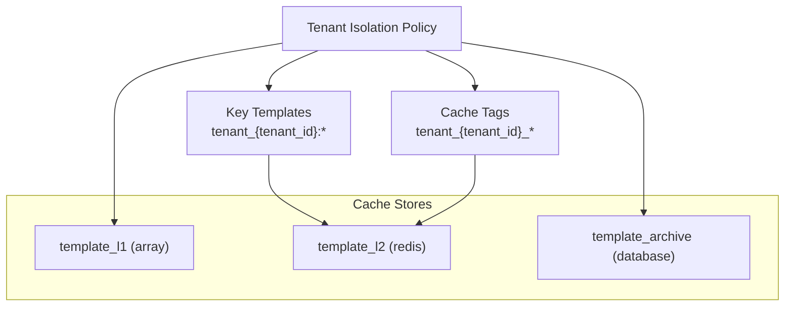
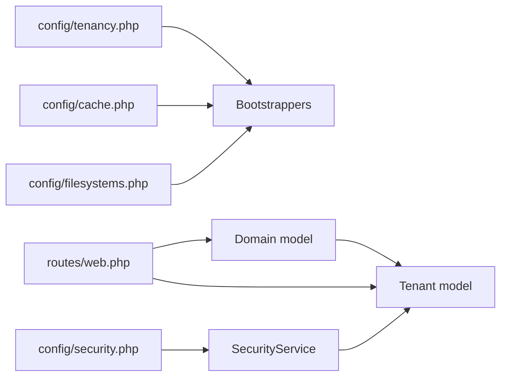

# Data Isolation & Security

<cite>
**Referenced Files in This Document**
- [config/tenancy.php](file://config/tenancy.php)
- [config/security.php](file://config/security.php)
- [config/cache.php](file://config/cache.php)
- [config/filesystems.php](file://config/filesystems.php)
- [app/Providers/TenancyServiceProvider.php](file://app/Providers/TenancyServiceProvider.php)
- [app/Models/Tenant.php](file://app/Models/Tenant.php)
- [app/Models/Domain.php](file://app/Models/Domain.php)
- [app/Services/SecurityService.php](file://app/Services/SecurityService.php)
- [app/Services/SecurityAuditService.php](file://app/Services/SecurityAuditService.php)
- [routes/web.php](file://routes/web.php)
</cite>

## Table of Contents
1. [Introduction](#introduction)
2. [Project Structure](#project-structure)
3. [Core Components](#core-components)
4. [Architecture Overview](#architecture-overview)
5. [Detailed Component Analysis](#detailed-component-analysis)
6. [Dependency Analysis](#dependency-analysis)
7. [Performance Considerations](#performance-considerations)
8. [Troubleshooting Guide](#troubleshooting-guide)
9. [Conclusion](#conclusion)
10. [Appendices](#appendices)

## Introduction
This document explains how the platform enforces data isolation and security across tenants. It covers database schema segregation, filesystem and cache namespaces, Redis key prefixes, and the bootstrapping pipeline that ensures cross-tenant separation. It also documents security controls, auditing, compliance posture, and practical guidance for secure multi-tenant development.

## Project Structure
The multi-tenancy and security mechanisms are implemented via:
- Configuration-driven bootstrapping for database, cache, filesystem, queue, and Redis
- Tenant and domain models that bind subdomains to tenant contexts
- Security services for authentication, rate limiting, session validation, and threat detection
- Audit and compliance services for ongoing governance
- Routing that separates central/admin routes from tenant routes

**Diagram sources**
- [config/tenancy.php:12-82](file://config/tenancy.php#L12-L82)
- [app/Providers/TenancyServiceProvider.php:24-40](file://app/Providers/TenancyServiceProvider.php#L24-L40)
- [app/Models/Tenant.php:11-86](file://app/Models/Tenant.php#L11-L86)
- [app/Models/Domain.php:12-59](file://app/Models/Domain.php#L12-L59)
- [app/Services/SecurityService.php:19-526](file://app/Services/SecurityService.php#L19-L526)
- [app/Services/SecurityAuditService.php:7-347](file://app/Services/SecurityAuditService.php#L7-L347)
- [routes/web.php:114-147](file://routes/web.php#L114-L147)

**Section sources**
- [config/tenancy.php:12-82](file://config/tenancy.php#L12-L82)
- [app/Providers/TenancyServiceProvider.php:24-40](file://app/Providers/TenancyServiceProvider.php#L24-L40)
- [routes/web.php:114-147](file://routes/web.php#L114-L147)

## Core Components
- Multi-tenant bootstrapping pipeline: database, cache, filesystem, queue, Redis
- Tenant and domain models with domain uniqueness and lifecycle events
- Security controls: login limits, rate limiting, 2FA, session validation, malicious request detection
- Audit and compliance reporting
- Routing that isolates central/admin routes from tenant routes

**Section sources**
- [config/tenancy.php:21-27](file://config/tenancy.php#L21-L27)
- [app/Models/Tenant.php:11-86](file://app/Models/Tenant.php#L11-L86)
- [app/Models/Domain.php:12-59](file://app/Models/Domain.php#L12-L59)
- [app/Services/SecurityService.php:29-320](file://app/Services/SecurityService.php#L29-L320)
- [app/Services/SecurityAuditService.php:12-72](file://app/Services/SecurityAuditService.php#L12-L72)
- [routes/web.php:114-147](file://routes/web.php#L114-L147)

## Architecture Overview
The system initializes tenancy based on incoming host/domain, then applies isolation across all shared resources. The following sequence illustrates the end-to-end flow for a tenant request.

**Diagram sources**
- [routes/web.php:114-147](file://routes/web.php#L114-L147)
- [app/Models/Domain.php:19-33](file://app/Models/Domain.php#L19-L33)
- [config/tenancy.php:21-27](file://config/tenancy.php#L21-L27)
- [config/cache.php:140-144](file://config/cache.php#L140-L144)
- [config/filesystems.php:31-63](file://config/filesystems.php#L31-L63)
- [app/Services/SecurityService.php:324-354](file://app/Services/SecurityService.php#L324-L354)

## Detailed Component Analysis

### Multi-Tenant Bootstrapping Pipeline
- Database: PostgreSQL schema manager with tenant prefixing
- Cache: tag-based tagging and tenant isolation policies
- Filesystem: suffix-based disk roots and explicit root overrides
- Queue: isolated per-tenant queues
- Redis: key prefixing for tenant-scoped keys

**Diagram sources**
- [config/tenancy.php:28-58](file://config/tenancy.php#L28-L58)

**Section sources**
- [config/tenancy.php:28-58](file://config/tenancy.php#L28-L58)

### Tenant and Domain Models
- Tenant model defines fillable attributes and relationships scoped to institution and tenant context
- Domain model binds hostnames to tenants, enforces uniqueness, and dispatches lifecycle events

**Diagram sources**
- [app/Models/Tenant.php:15-86](file://app/Models/Tenant.php#L15-L86)
- [app/Models/Domain.php:17-59](file://app/Models/Domain.php#L17-L59)

**Section sources**
- [app/Models/Tenant.php:15-86](file://app/Models/Tenant.php#L15-L86)
- [app/Models/Domain.php:19-47](file://app/Models/Domain.php#L19-L47)

### Security Controls and Threat Detection
- Login security: max attempts and lockout duration
- Rate limiting: authenticated and unauthenticated thresholds
- Session security: timeout, suspicious session tracking, IP consistency checks
- 2FA: role-based requirement and recovery codes
- Malicious request detection: pattern-based scanning
- Data access logging and security event logging

**Diagram sources**
- [config/security.php:9-26](file://config/security.php#L9-L26)
- [app/Services/SecurityService.php:29-320](file://app/Services/SecurityService.php#L29-L320)

**Section sources**
- [config/security.php:9-26](file://config/security.php#L9-L26)
- [app/Services/SecurityService.php:100-145](file://app/Services/SecurityService.php#L100-L145)
- [app/Services/SecurityService.php:293-305](file://app/Services/SecurityService.php#L293-L305)
- [app/Services/SecurityService.php:324-354](file://app/Services/SecurityService.php#L324-L354)

### Cache Namespace Isolation
- Tenant-aware cache policies with key prefix templates and tag-based invalidation
- Multi-layer cache stores (L1/L2/L3) with tenant isolation enabled
- Cross-tenant access blocked and cache invalidation cascades

**Diagram sources**
- [config/cache.php:59-113](file://config/cache.php#L59-L113)
- [config/cache.php:229-234](file://config/cache.php#L229-L234)
- [config/cache.php:316-325](file://config/cache.php#L316-L325)

**Section sources**
- [config/cache.php:229-234](file://config/cache.php#L229-L234)
- [config/cache.php:316-325](file://config/cache.php#L316-L325)

### Filesystem Path Overrides
- Local and public disks are suffixed and their roots overridden after storage_path() is suffixed
- Ensures tenant-specific storage paths

**Section sources**
- [config/tenancy.php:47-51](file://config/tenancy.php#L47-L51)
- [config/filesystems.php:31-63](file://config/filesystems.php#L31-L63)

### Redis Key Prefixes
- Redis prefix base is configured for tenant-scoped keys
- Specific connections can be marked for prefixed access

**Section sources**
- [config/tenancy.php:53-57](file://config/tenancy.php#L53-L57)

### Routing and Cross-Tenant Access Prevention
- Central/admin routes are isolated from tenant routes
- Tenancy middleware is intentionally applied only to tenant routes, not central routes
- Security dashboard routes are restricted to super-admin

**Section sources**
- [app/Providers/TenancyServiceProvider.php:34-39](file://app/Providers/TenancyServiceProvider.php#L34-L39)
- [routes/web.php:114-147](file://routes/web.php#L114-L147)

### Security Auditing and Compliance
- Comprehensive audit categories: authentication, authorization, data privacy, social graph, API, infrastructure, compliance, vulnerability scan
- Privacy violation scanning and compliance report generation
- Data integrity checks and checksum verification

**Section sources**
- [app/Services/SecurityAuditService.php:12-72](file://app/Services/SecurityAuditService.php#L12-L72)
- [app/Services/SecurityAuditService.php:77-103](file://app/Services/SecurityAuditService.php#L77-L103)
- [app/Services/SecurityAuditService.php:207-225](file://app/Services/SecurityAuditService.php#L207-L225)

## Dependency Analysis
- Tenancy bootstrappers depend on configuration for database, cache, filesystem, queue, and Redis
- Domain model depends on tenant model and triggers lifecycle events
- SecurityService depends on models for login attempts, sessions, and security events
- Cache configuration depends on environment variables for store selection and TTLs
- Routing depends on middleware groups to separate central and tenant contexts

**Diagram sources**
- [config/tenancy.php:21-27](file://config/tenancy.php#L21-L27)
- [app/Models/Tenant.php:11-86](file://app/Models/Tenant.php#L11-L86)
- [app/Models/Domain.php:12-59](file://app/Models/Domain.php#L12-L59)
- [app/Services/SecurityService.php:19-526](file://app/Services/SecurityService.php#L19-L526)
- [routes/web.php:114-147](file://routes/web.php#L114-L147)

**Section sources**
- [config/tenancy.php:21-27](file://config/tenancy.php#L21-L27)
- [app/Models/Domain.php:19-33](file://app/Models/Domain.php#L19-L33)
- [app/Services/SecurityService.php:29-320](file://app/Services/SecurityService.php#L29-L320)
- [routes/web.php:114-147](file://routes/web.php#L114-L147)

## Performance Considerations
- Use dedicated cache stores for template performance with multi-layer caching and tenant isolation
- Configure appropriate TTLs and compression thresholds to balance memory usage and throughput
- Monitor cache hit rates and slow operations to tune invalidation and alert thresholds

[No sources needed since this section provides general guidance]

## Troubleshooting Guide
- If cross-tenant data leaks occur, verify that:
  - Tenancy bootstrappers are active and configured
  - Cache keys are tenant-prefixed
  - Filesystem roots are overridden per tenant
  - Redis keys are prefixed
- If users see each other’s data:
  - Confirm routing groups apply tenancy middleware only to tenant routes
  - Review domain resolution and tenant binding
- If rate limiting or 2FA blocks legitimate traffic:
  - Adjust thresholds in security configuration
  - Review SecurityService rate limit and 2FA enforcement logic

**Section sources**
- [config/tenancy.php:21-27](file://config/tenancy.php#L21-L27)
- [config/cache.php:229-234](file://config/cache.php#L229-L234)
- [config/filesystems.php:31-63](file://config/filesystems.php#L31-L63)
- [config/security.php:9-26](file://config/security.php#L9-L26)
- [app/Services/SecurityService.php:293-305](file://app/Services/SecurityService.php#L293-L305)

## Conclusion
The platform achieves strong tenant isolation through a configurable bootstrapping pipeline, tenant-aware cache and filesystem namespaces, and strict routing separation. Security controls and auditing services provide continuous monitoring and compliance readiness. Adhering to the recommended practices below will help maintain robust isolation and security.

## Appendices

### Secure Multi-Tenant Development Practices
- Always resolve tenant context before accessing tenant data
- Use tenant-aware cache keys and tags
- Enforce 2FA for privileged roles
- Apply rate limiting to sensitive endpoints
- Log and alert on suspicious activity
- Regularly audit cache invalidation and filesystem overrides

### Common Security Pitfalls to Avoid
- Accessing shared resources outside tenant context
- Hardcoding global cache keys or Redis keys
- Sharing sessions across tenants
- Using generic cache stores without tenant isolation
- Overlooking filesystem root overrides for tenant disks