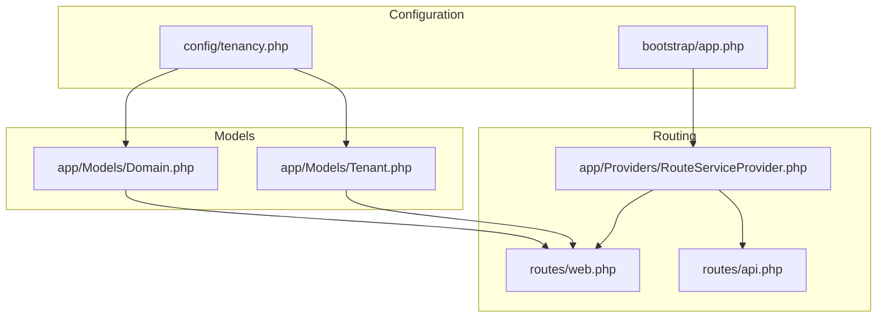
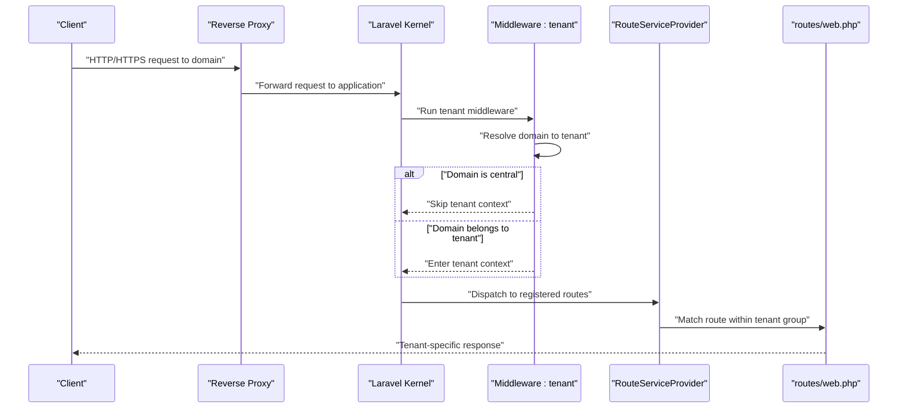
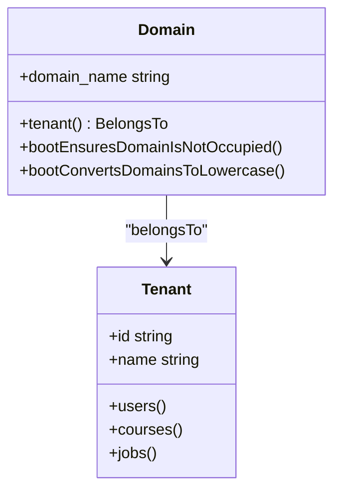
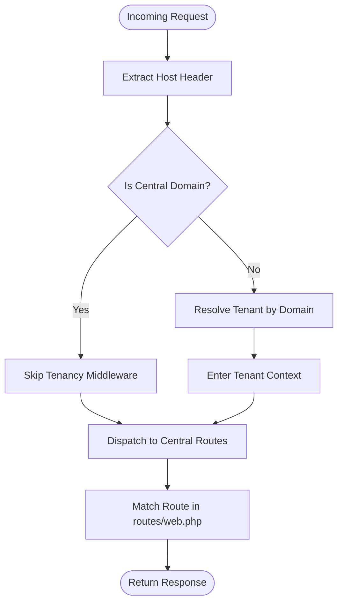
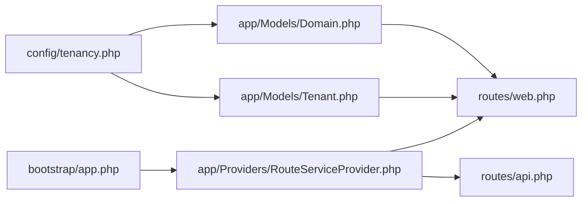

# Domain Resolution & Routing

<cite>
**Referenced Files in This Document**
- [Domain.php](file://app/Models/Domain.php)
- [Tenant.php](file://app/Models/Tenant.php)
- [tenancy.php](file://config/tenancy.php)
- [RouteServiceProvider.php](file://app/Providers/RouteServiceProvider.php)
- [TenancyServiceProvider.php](file://app/Providers/TenancyServiceProvider.php)
- [app.php](file://bootstrap/app.php)
- [web.php](file://routes/web.php)
- [api.php](file://routes/api.php)
- [EmailDomainValidation.php](file://app/Rules/EmailDomainValidation.php)
- [InstitutionalDomain.php](file://app/Rules/InstitutionalDomain.php)
</cite>

## Table of Contents
1. [Introduction](#introduction)
2. [Project Structure](#project-structure)
3. [Core Components](#core-components)
4. [Architecture Overview](#architecture-overview)
5. [Detailed Component Analysis](#detailed-component-analysis)
6. [Dependency Analysis](#dependency-analysis)
7. [Performance Considerations](#performance-considerations)
8. [Troubleshooting Guide](#troubleshooting-guide)
9. [Conclusion](#conclusion)

## Introduction
This document explains how the platform resolves domains to tenants, routes tenant-specific traffic, and manages multi-domain environments. It covers the domain model, validation rules, routing priorities, tenant-aware middleware chains, and operational concerns such as reverse proxy and SSL handling. Practical examples demonstrate domain configuration, multi-domain setups, redirects, and DNS requirements.

## Project Structure
The domain resolution and routing system spans three primary areas:
- Domain and tenant models define the mapping between hostnames and tenant contexts.
- Configuration files establish central vs. tenant domains and bootstrappers.
- Route registration and middleware orchestrate tenant-aware routing.

**Diagram sources**
- [tenancy.php:12-82](file://config/tenancy.php#L12-L82)
- [app.php:30-37](file://bootstrap/app.php#L30-L37)
- [Domain.php:12-33](file://app/Models/Domain.php#L12-L33)
- [Tenant.php:11-22](file://app/Models/Tenant.php#L11-L22)
- [RouteServiceProvider.php:25-39](file://app/Providers/RouteServiceProvider.php#L25-L39)
- [web.php:1-20](file://routes/web.php#L1-L20)
- [api.php:1-20](file://routes/api.php#L1-L20)

**Section sources**
- [tenancy.php:12-82](file://config/tenancy.php#L12-L82)
- [app.php:30-37](file://bootstrap/app.php#L30-L37)
- [Domain.php:12-33](file://app/Models/Domain.php#L12-L33)
- [Tenant.php:11-22](file://app/Models/Tenant.php#L11-L22)
- [RouteServiceProvider.php:25-39](file://app/Providers/RouteServiceProvider.php#L25-L39)
- [web.php:1-20](file://routes/web.php#L1-L20)
- [api.php:1-20](file://routes/api.php#L1-L20)

## Core Components
- Domain model: Represents hostname-to-tenant mapping with domain normalization and uniqueness enforcement.
- Tenant model: Encapsulates tenant identity and relationships, including domain associations.
- Tenancy configuration: Declares central domains, bootstrappers, and tenant model bindings.
- Route provider: Registers web and API routes with appropriate middleware groups.
- Middleware aliases: Include tenant initialization middleware and rate-limiting middlewares.

Key behaviors:
- Domains are normalized to lowercase and validated for uniqueness.
- Central domains bypass tenant resolution; tenant domains trigger tenancy bootstrapping.
- Route groups apply tenant middleware selectively to tenant-facing routes.

**Section sources**
- [Domain.php:19-33](file://app/Models/Domain.php#L19-L33)
- [Domain.php:38-57](file://app/Models/Domain.php#L38-L57)
- [Tenant.php:11-22](file://app/Models/Tenant.php#L11-L22)
- [tenancy.php:15-27](file://config/tenancy.php#L15-L27)
- [RouteServiceProvider.php:31-38](file://app/Providers/RouteServiceProvider.php#L31-L38)
- [app.php:30-37](file://bootstrap/app.php#L30-L37)

## Architecture Overview
The routing pipeline initializes tenancy based on the incoming Host header, then dispatches to tenant-scoped routes. Central domains skip tenancy middleware and serve central routes.

**Diagram sources**
- [app.php:34](file://bootstrap/app.php#L34)
- [RouteServiceProvider.php:25-39](file://app/Providers/RouteServiceProvider.php#L25-L39)
- [web.php:1-20](file://routes/web.php#L1-L20)

## Detailed Component Analysis

### Domain Model and Validation
The Domain model enforces:
- Lowercase normalization on save.
- Uniqueness constraint to prevent overlapping domains across tenants.
- Event hooks for lifecycle management.

**Diagram sources**
- [Domain.php:19-33](file://app/Models/Domain.php#L19-L33)
- [Domain.php:38-57](file://app/Models/Domain.php#L38-L57)
- [Tenant.php:48-84](file://app/Models/Tenant.php#L48-L84)

**Section sources**
- [Domain.php:19-33](file://app/Models/Domain.php#L19-L33)
- [Domain.php:38-57](file://app/Models/Domain.php#L38-L57)
- [Tenant.php:48-84](file://app/Models/Tenant.php#L48-L84)

### Tenant Model and Relationships
The Tenant model defines tenant identity and relationships. It integrates with the tenancy system via base traits and supports tenant-specific collections.

**Section sources**
- [Tenant.php:11-22](file://app/Models/Tenant.php#L11-L22)
- [Tenant.php:48-84](file://app/Models/Tenant.php#L48-L84)

### Tenancy Configuration and Bootstrapping
The tenancy configuration binds:
- Tenant and domain models.
- Central domains list.
- Bootstrappers for database, cache, filesystem, queue, and Redis per tenant.

The TenancyServiceProvider ensures middleware priority is aligned with tenancy routing.

**Section sources**
- [tenancy.php:13-27](file://config/tenancy.php#L13-L27)
- [tenancy.php:21-27](file://config/tenancy.php#L21-L27)
- [TenancyServiceProvider.php:24-39](file://app/Providers/TenancyServiceProvider.php#L24-L39)

### Route Registration and Middleware Groups
The RouteServiceProvider registers:
- API routes under a dedicated prefix and middleware.
- Web routes grouped by middleware layers.

Middleware aliases include:
- tenant: Initializes tenancy by domain.
- role, permission: Authorization helpers.
- api.rate_limit, social.rate_limit: Rate limiting for API and social actions.

These aliases enable selective application of tenancy to tenant routes while keeping central domains unaffected.

**Section sources**
- [RouteServiceProvider.php:31-38](file://app/Providers/RouteServiceProvider.php#L31-L38)
- [app.php:30-37](file://bootstrap/app.php#L30-L37)

### Domain Resolution Flow

**Diagram sources**
- [app.php:34](file://bootstrap/app.php#L34)
- [web.php:1-20](file://routes/web.php#L1-L20)

## Dependency Analysis
- Domain depends on the Tenant model via a foreign key relationship.
- RouteServiceProvider depends on route files for web and API.
- Middleware aliases depend on the tenancy middleware for domain-based tenant initialization.
- Tenancy configuration binds models and bootstrappers.

**Diagram sources**
- [tenancy.php:13-27](file://config/tenancy.php#L13-L27)
- [app.php:30-37](file://bootstrap/app.php#L30-L37)
- [RouteServiceProvider.php:31-38](file://app/Providers/RouteServiceProvider.php#L31-L38)
- [web.php:1-20](file://routes/web.php#L1-L20)
- [api.php:1-20](file://routes/api.php#L1-L20)

**Section sources**
- [tenancy.php:13-27](file://config/tenancy.php#L13-L27)
- [app.php:30-37](file://bootstrap/app.php#L30-L37)
- [RouteServiceProvider.php:31-38](file://app/Providers/RouteServiceProvider.php#L31-L38)
- [web.php:1-20](file://routes/web.php#L1-L20)
- [api.php:1-20](file://routes/api.php#L1-L20)

## Performance Considerations
- Domain resolution cache: Consider caching domain-to-tenant lookups to reduce database queries during high traffic.
- Middleware ordering: Keep tenant middleware early to minimize unnecessary processing for central domains.
- Bootstrapper scope: Limit bootstrappers to only what is needed per tenant to reduce overhead.

## Troubleshooting Guide
Common issues and resolutions:
- Duplicate domain entries: The Domain model prevents overlapping domains by throwing an exception when saving a domain already owned by another tenant. Ensure domain uniqueness before creation.
- Case sensitivity: Domains are normalized to lowercase; ensure DNS records and database entries consistently use lowercase.
- Central vs. tenant confusion: Verify the Host header matches a central domain to bypass tenant middleware, or ensure the domain is registered to a tenant to activate tenancy.
- Rate limiting: API and social actions are rate-limited; adjust limits or middleware groups as needed for legitimate traffic spikes.

**Section sources**
- [Domain.php:38-46](file://app/Models/Domain.php#L38-L46)
- [Domain.php:52-57](file://app/Models/Domain.php#L52-L57)
- [app.php:34](file://bootstrap/app.php#L34)

## Conclusion
The platform’s domain resolution and routing system centers on a robust Domain model, a configurable tenancy setup, and tenant-aware middleware. By normalizing domains, enforcing uniqueness, and selectively applying tenancy middleware, the system reliably routes requests to tenant contexts while serving central domains without tenant bootstrapping. Proper DNS configuration, domain registration, and middleware alignment are essential for predictable behavior across multi-domain deployments.