# Infrastructure & Scaling

<cite>
**Referenced Files in This Document**
- [config/tenancy.php](file://config/tenancy.php)
- [config/database.php](file://config/database.php)
- [config/cache.php](file://config/cache.php)
- [config/queue.php](file://config/queue.php)
- [config/filesystems.php](file://config/filesystems.php)
- [config/services.php](file://config/services.php)
- [app/Providers/TenancyServiceProvider.php](file://app/Providers/TenancyServiceProvider.php)
- [infrastructure/README.md](file://infrastructure/README.md)
- [docker-compose.yml](file://docker-compose.yml)
- [app/Console/Commands/CreateSystemBackup.php](file://app/Console/Commands/CreateSystemBackup.php)
- [app/Console/Commands/ResetTenantSchemas.php](file://app/Console/Commands/ResetTenantSchemas.php)
- [app/Http/Controllers/Api/PerformanceController.php](file://app/Http/Controllers/Api/PerformanceController.php)
- [app/Http/Controllers/Api/MonitoringController.php](file://app/Http/Controllers/Api/MonitoringController.php)
- [resources/js/utils/performance-monitor.js](file://resources/js/utils/performance-monitor.js)
- [resources/js/components/monitoring/DetailedMetrics.vue](file://resources/js/components/monitoring/DetailedMetrics.vue)
- [tests/Performance/DatabasePerformanceTest.php](file://tests/Performance/DatabasePerformanceTest.php)
- [deployment-plan.md](file://deployment-plan.md)
- [technical-specification.md](file://technical-specification.md)
- [docs/task-03-multi-tenant-enhancement-recap.md](file://docs/task-03-multi-tenant-enhancement-recap.md)
</cite>

## Table of Contents
1. [Introduction](#introduction)
2. [Project Structure](#project-structure)
3. [Core Components](#core-components)
4. [Architecture Overview](#architecture-overview)
5. [Detailed Component Analysis](#detailed-component-analysis)
6. [Dependency Analysis](#dependency-analysis)
7. [Performance Considerations](#performance-considerations)
8. [Troubleshooting Guide](#troubleshooting-guide)
9. [Conclusion](#conclusion)
10. [Appendices](#appendices)

## Introduction
This document provides comprehensive guidance for multi-tenant infrastructure and scaling strategies. It covers database schema management, connection pooling, resource allocation per tenant, horizontal scaling, load distribution, performance monitoring, tenant-specific caching strategies, Redis clustering, filesystem scaling, practical provisioning and autoscaling examples, cost optimization, database migration strategies, backup and recovery procedures, and disaster recovery planning. The content is grounded in the repository’s configuration and implementation artifacts.

## Project Structure
The repository organizes multi-tenant concerns across configuration files, infrastructure documentation, console commands, and monitoring components. Key areas include:
- Multi-tenant configuration and bootstrapping
- Database and cache configuration for tenant isolation
- Queue and filesystem configuration
- Infrastructure provisioning and scaling guidance
- Backup, migration, and recovery tooling
- Frontend and backend monitoring integrations

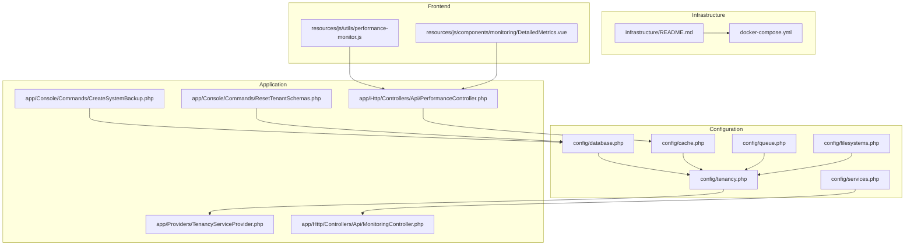

**Diagram sources**
- [config/tenancy.php:12-82](file://config/tenancy.php#L12-L82)
- [config/database.php:32-152](file://config/database.php#L32-L152)
- [config/cache.php:34-159](file://config/cache.php#L34-L159)
- [config/queue.php:31-75](file://config/queue.php#L31-L75)
- [config/filesystems.php:31-63](file://config/filesystems.php#L31-L63)
- [config/services.php:38-52](file://config/services.php#L38-L52)
- [app/Providers/TenancyServiceProvider.php:24-41](file://app/Providers/TenancyServiceProvider.php#L24-L41)
- [app/Console/Commands/CreateSystemBackup.php:18-68](file://app/Console/Commands/CreateSystemBackup.php#L18-L68)
- [app/Console/Commands/ResetTenantSchemas.php:28-49](file://app/Console/Commands/ResetTenantSchemas.php#L28-L49)
- [app/Http/Controllers/Api/PerformanceController.php:57-79](file://app/Http/Controllers/Api/PerformanceController.php#L57-L79)
- [app/Http/Controllers/Api/MonitoringController.php:86-125](file://app/Http/Controllers/Api/MonitoringController.php#L86-L125)
- [infrastructure/README.md:1-244](file://infrastructure/README.md#L1-L244)
- [docker-compose.yml:1-52](file://docker-compose.yml#L1-L52)
- [resources/js/utils/performance-monitor.js:118-621](file://resources/js/utils/performance-monitor.js#L118-L621)
- [resources/js/components/monitoring/DetailedMetrics.vue:190-234](file://resources/js/components/monitoring/DetailedMetrics.vue#L190-L234)

**Section sources**
- [config/tenancy.php:12-82](file://config/tenancy.php#L12-L82)
- [config/database.php:32-152](file://config/database.php#L32-L152)
- [config/cache.php:34-159](file://config/cache.php#L34-L159)
- [config/queue.php:31-75](file://config/queue.php#L31-L75)
- [config/filesystems.php:31-63](file://config/filesystems.php#L31-L63)
- [config/services.php:38-52](file://config/services.php#L38-L52)
- [app/Providers/TenancyServiceProvider.php:24-41](file://app/Providers/TenancyServiceProvider.php#L24-L41)
- [infrastructure/README.md:1-244](file://infrastructure/README.md#L1-L244)
- [docker-compose.yml:1-52](file://docker-compose.yml#L1-L52)

## Core Components
- Multi-tenant bootstrapping and isolation:
  - Central and tenant database connections
  - Schema manager for tenant isolation
  - Cache, filesystem, queue, and Redis bootstrappers
- Database configuration:
  - Default, central, and tenant connections
  - Redis client and cluster options
- Cache configuration:
  - Multi-layer template cache stores (L1/L2/L3)
  - Tenant isolation and invalidation policies
  - Performance monitoring and alerting thresholds
- Queue configuration:
  - Drivers and retry settings
  - Failed job handling
- Filesystems:
  - Local and S3 disks
  - Root overrides for tenant isolation
- Infrastructure:
  - Docker-based production stack
  - Zero-downtime deployment and monitoring
- Monitoring and alerting:
  - Backend performance metrics ingestion
  - Frontend performance monitoring utilities
  - Slack and Sentry integration for alerts

**Section sources**
- [config/tenancy.php:12-82](file://config/tenancy.php#L12-L82)
- [config/database.php:107-135](file://config/database.php#L107-L135)
- [config/cache.php:34-159](file://config/cache.php#L34-L159)
- [config/queue.php:31-75](file://config/queue.php#L31-L75)
- [config/filesystems.php:31-63](file://config/filesystems.php#L31-L63)
- [config/services.php:38-52](file://config/services.php#L38-L52)
- [infrastructure/README.md:1-244](file://infrastructure/README.md#L1-L244)

## Architecture Overview
The system employs a multi-tenant architecture with tenant-specific schemas and shared application resources. The infrastructure supports zero-downtime deployments, horizontal scaling, and centralized monitoring.

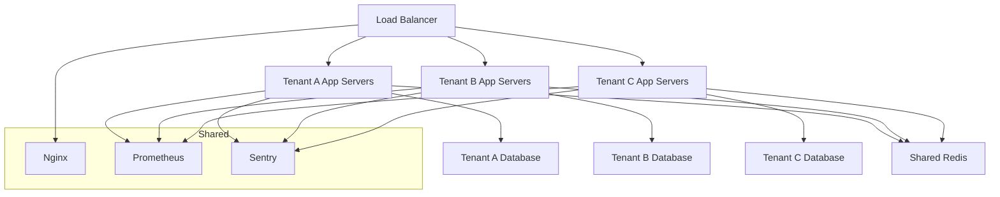

**Diagram sources**
- [technical-specification.md:35-73](file://technical-specification.md#L35-L73)
- [deployment-plan.md:19-39](file://deployment-plan.md#L19-L39)
- [infrastructure/README.md:74-119](file://infrastructure/README.md#L74-L119)
- [config/database.php:181-209](file://config/database.php#L181-L209)
- [config/services.php:38-52](file://config/services.php#L38-L52)

## Detailed Component Analysis

### Database Schema Management and Connection Pooling
- Central and tenant database connections are defined for multi-tenant isolation.
- PostgreSQL schema manager is configured for tenant schema management.
- Tenant bootstrapper ensures database isolation per tenant.
- Connection pooling and retries are handled by the underlying drivers and environment configuration.

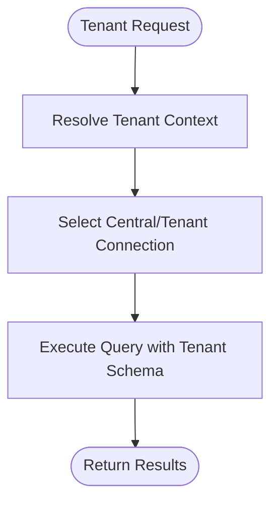

**Diagram sources**
- [config/tenancy.php:28-36](file://config/tenancy.php#L28-L36)
- [config/database.php:107-135](file://config/database.php#L107-L135)
- [app/Providers/TenancyServiceProvider.php:24-41](file://app/Providers/TenancyServiceProvider.php#L24-L41)

**Section sources**
- [config/tenancy.php:28-36](file://config/tenancy.php#L28-L36)
- [config/database.php:107-135](file://config/database.php#L107-L135)
- [app/Providers/TenancyServiceProvider.php:24-41](file://app/Providers/TenancyServiceProvider.php#L24-L41)

### Resource Allocation Per Tenant
- Tenant isolation is achieved via dedicated schemas and filesystem roots.
- Bootstrappers for cache, filesystem, queue, and Redis ensure tenant-aware operations.
- Filesystem root overrides prevent cross-tenant file leakage.

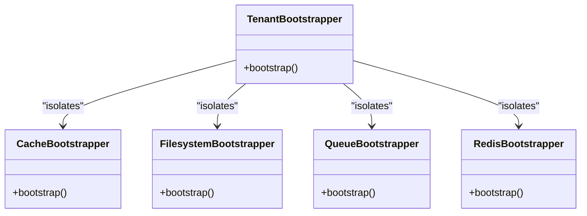

**Diagram sources**
- [config/tenancy.php:21-27](file://config/tenancy.php#L21-L27)

**Section sources**
- [config/tenancy.php:40-52](file://config/tenancy.php#L40-L52)
- [config/tenancy.php:53-58](file://config/tenancy.php#L53-L58)

### Horizontal Scaling and Load Distribution
- Multi-tenant deployment pattern shows load balancer distributing traffic to tenant-specific app servers.
- Production infrastructure supports zero-downtime deployments and containerized services.

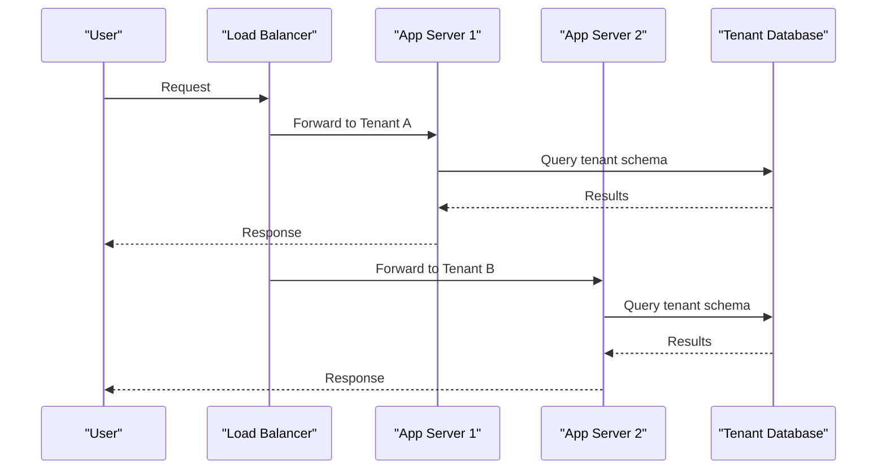

**Diagram sources**
- [deployment-plan.md:19-39](file://deployment-plan.md#L19-L39)
- [technical-specification.md:35-73](file://technical-specification.md#L35-L73)

**Section sources**
- [deployment-plan.md:19-39](file://deployment-plan.md#L19-L39)
- [technical-specification.md:35-73](file://technical-specification.md#L35-L73)
- [infrastructure/README.md:100-119](file://infrastructure/README.md#L100-L119)

### Performance Monitoring and Alerting
- Backend collects performance metrics and stores them for analytics.
- Frontend performance monitor records navigation and resource timing metrics.
- Threshold-based alerts are logged and can integrate with external services.

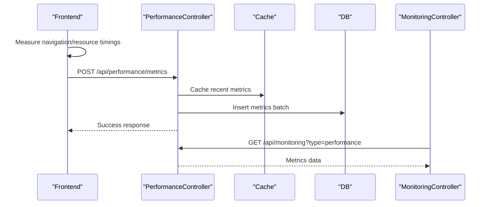

**Diagram sources**
- [app/Http/Controllers/Api/PerformanceController.php:57-79](file://app/Http/Controllers/Api/PerformanceController.php#L57-L79)
- [app/Http/Controllers/Api/PerformanceController.php:385-406](file://app/Http/Controllers/Api/PerformanceController.php#L385-L406)
- [app/Http/Controllers/Api/MonitoringController.php:86-125](file://app/Http/Controllers/Api/MonitoringController.php#L86-L125)
- [resources/js/utils/performance-monitor.js:118-148](file://resources/js/utils/performance-monitor.js#L118-L148)

**Section sources**
- [app/Http/Controllers/Api/PerformanceController.php:57-79](file://app/Http/Controllers/Api/PerformanceController.php#L57-L79)
- [app/Http/Controllers/Api/PerformanceController.php:411-439](file://app/Http/Controllers/Api/PerformanceController.php#L411-L439)
- [resources/js/utils/performance-monitor.js:327-369](file://resources/js/utils/performance-monitor.js#L327-L369)
- [resources/js/components/monitoring/DetailedMetrics.vue:190-234](file://resources/js/components/monitoring/DetailedMetrics.vue#L190-L234)
- [config/services.php:38-52](file://config/services.php#L38-L52)

### Tenant-Specific Caching Strategies
- Multi-layer cache stores (L1/L2/L3) with tenant isolation and tagging.
- Invalidation policies target tenant and template categories.
- Compression and TTL tuning optimize performance and storage.

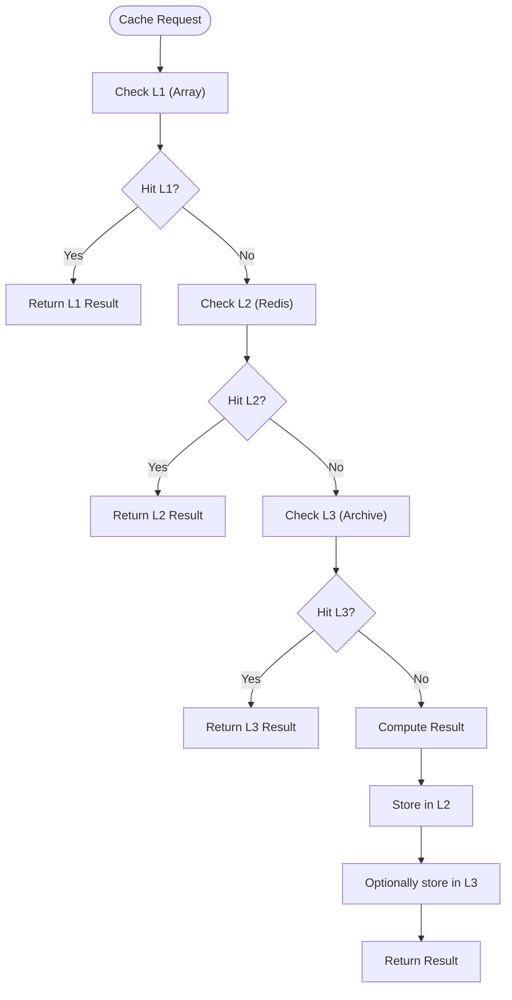

**Diagram sources**
- [config/cache.php:195-217](file://config/cache.php#L195-L217)
- [config/cache.php:246-263](file://config/cache.php#L246-L263)
- [config/cache.php:275-282](file://config/cache.php#L275-L282)

**Section sources**
- [config/cache.php:59-113](file://config/cache.php#L59-L113)
- [config/cache.php:195-217](file://config/cache.php#L195-L217)
- [config/cache.php:229-234](file://config/cache.php#L229-L234)
- [config/cache.php:246-263](file://config/cache.php#L246-L263)
- [config/cache.php:294-304](file://config/cache.php#L294-L304)

### Redis Clustering and Tenant Isolation
- Redis client and cluster options are configurable.
- Tenant prefix base and prefixed connections enable logical separation.
- Dedicated cache database isolates template performance caches.

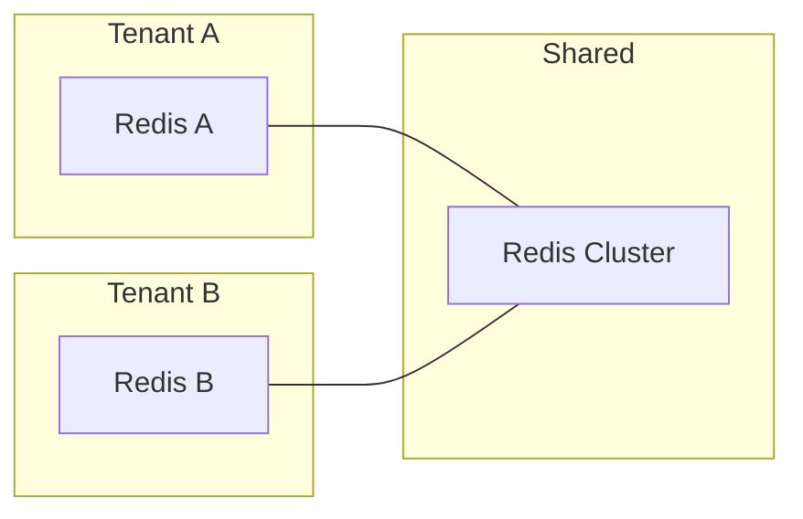

**Diagram sources**
- [config/database.php:181-209](file://config/database.php#L181-L209)
- [config/tenancy.php:53-58](file://config/tenancy.php#L53-L58)
- [config/cache.php:60-104](file://config/cache.php#L60-L104)

**Section sources**
- [config/database.php:181-209](file://config/database.php#L181-L209)
- [config/tenancy.php:53-58](file://config/tenancy.php#L53-L58)
- [config/cache.php:60-104](file://config/cache.php#L60-L104)

### Filesystem Scaling
- Local and S3 disks are supported.
- Root overrides ensure tenant-specific storage paths.
- Production README documents symlink-based deployment and scaling.

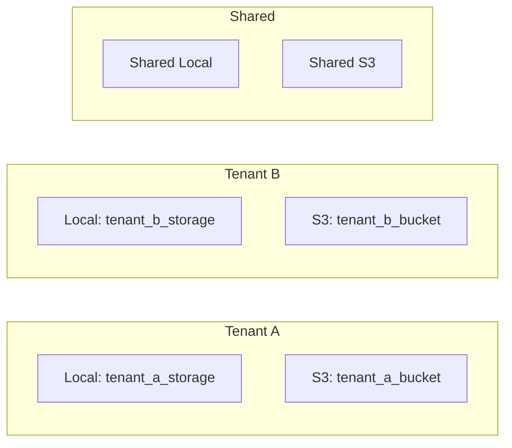

**Diagram sources**
- [config/filesystems.php:31-63](file://config/filesystems.php#L31-L63)
- [config/tenancy.php:47-51](file://config/tenancy.php#L47-L51)
- [infrastructure/README.md:100-119](file://infrastructure/README.md#L100-L119)

**Section sources**
- [config/filesystems.php:31-63](file://config/filesystems.php#L31-L63)
- [config/tenancy.php:47-51](file://config/tenancy.php#L47-L51)
- [infrastructure/README.md:100-119](file://infrastructure/README.md#L100-L119)

### Database Migration Strategies
- Migration parameters target tenant migrations path.
- Reset tenant schemas command drops and recreates schemas for all tenants.
- Central and tenant connections support isolated migrations.

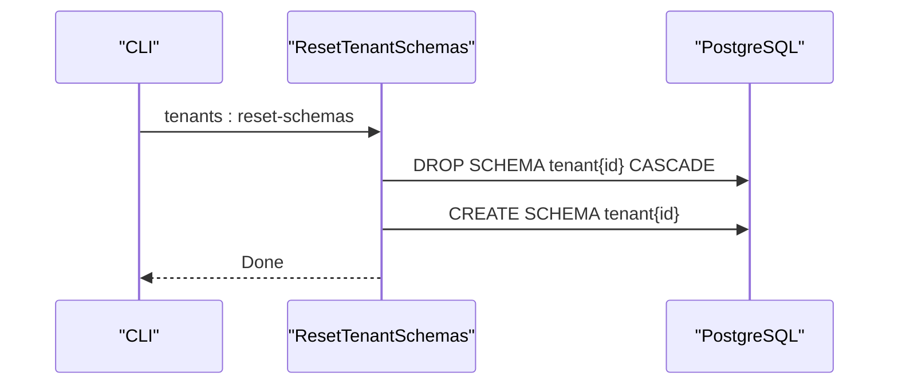

**Diagram sources**
- [app/Console/Commands/ResetTenantSchemas.php:28-49](file://app/Console/Commands/ResetTenantSchemas.php#L28-L49)
- [config/tenancy.php:66-75](file://config/tenancy.php#L66-L75)

**Section sources**
- [app/Console/Commands/ResetTenantSchemas.php:28-49](file://app/Console/Commands/ResetTenantSchemas.php#L28-L49)
- [config/tenancy.php:66-75](file://config/tenancy.php#L66-L75)

### Backup and Recovery Procedures
- System backup command creates database and files backups, manifests, and optional compression.
- Cleanup removes old backups based on retention policy.
- Disaster recovery plan outlines assessment, restoration, integrity checks, and monitoring.

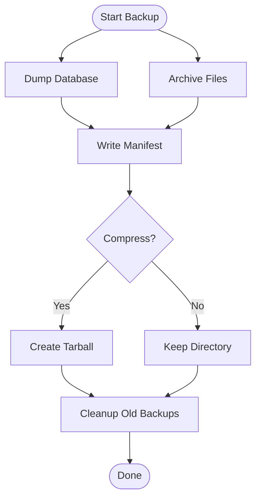

**Diagram sources**
- [app/Console/Commands/CreateSystemBackup.php:70-109](file://app/Console/Commands/CreateSystemBackup.php#L70-L109)
- [app/Console/Commands/CreateSystemBackup.php:202-218](file://app/Console/Commands/CreateSystemBackup.php#L202-L218)

**Section sources**
- [app/Console/Commands/CreateSystemBackup.php:18-68](file://app/Console/Commands/CreateSystemBackup.php#L18-L68)
- [app/Console/Commands/CreateSystemBackup.php:70-109](file://app/Console/Commands/CreateSystemBackup.php#L70-L109)
- [app/Console/Commands/CreateSystemBackup.php:202-218](file://app/Console/Commands/CreateSystemBackup.php#L202-L218)

### Disaster Recovery Planning
- Recovery steps include damage assessment, database and file restoration, integrity verification, service restart, and recovery monitoring.
- Recovery monitoring dispatches follow-up checks.

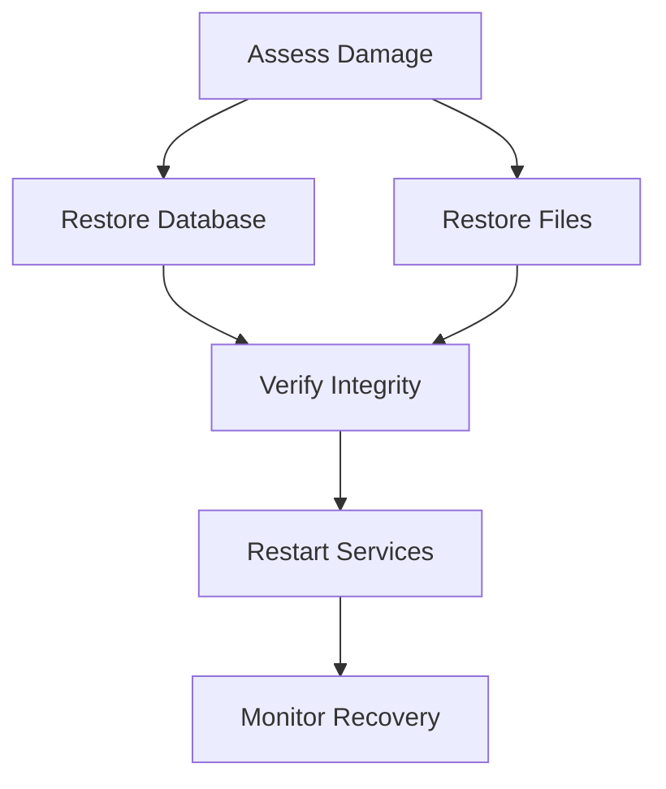

**Diagram sources**
- [deployment-plan.md:635-717](file://deployment-plan.md#L635-L717)

**Section sources**
- [deployment-plan.md:635-717](file://deployment-plan.md#L635-L717)

### Practical Provisioning and Autoscaling
- Production README describes Docker-based stack, zero-downtime deployment, and scaling queue workers.
- Docker Compose defines local development stack with app, postgres, and vite.

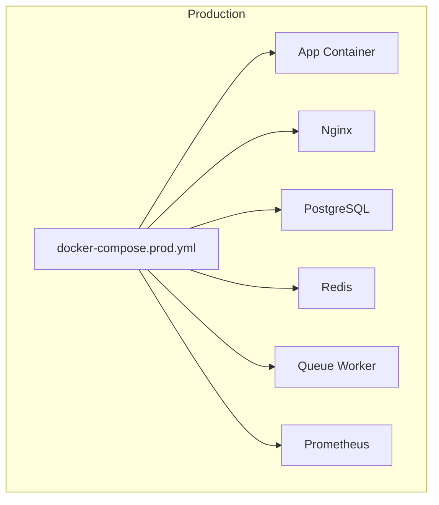

**Diagram sources**
- [infrastructure/README.md:1-244](file://infrastructure/README.md#L1-L244)
- [docker-compose.yml:1-52](file://docker-compose.yml#L1-L52)

**Section sources**
- [infrastructure/README.md:1-244](file://infrastructure/README.md#L1-L244)
- [docker-compose.yml:1-52](file://docker-compose.yml#L1-L52)

## Dependency Analysis
- Tenancy provider bootstraps tenant middleware priorities and integrates with routing groups.
- Cache and filesystem configurations depend on tenancy bootstrappers for tenant isolation.
- Monitoring relies on backend APIs and frontend utilities for comprehensive coverage.

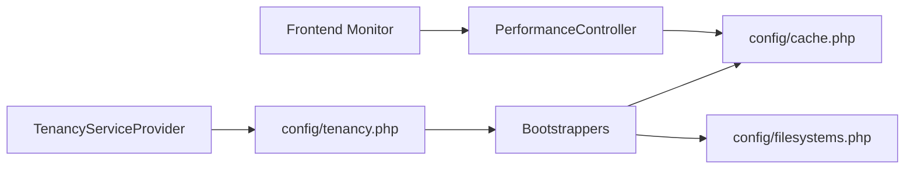

**Diagram sources**
- [app/Providers/TenancyServiceProvider.php:24-41](file://app/Providers/TenancyServiceProvider.php#L24-L41)
- [config/tenancy.php:21-27](file://config/tenancy.php#L21-L27)
- [config/cache.php:34-159](file://config/cache.php#L34-L159)
- [config/filesystems.php:31-63](file://config/filesystems.php#L31-L63)
- [app/Http/Controllers/Api/PerformanceController.php:57-79](file://app/Http/Controllers/Api/PerformanceController.php#L57-L79)
- [resources/js/utils/performance-monitor.js:118-148](file://resources/js/utils/performance-monitor.js#L118-L148)

**Section sources**
- [app/Providers/TenancyServiceProvider.php:24-41](file://app/Providers/TenancyServiceProvider.php#L24-L41)
- [config/tenancy.php:21-27](file://config/tenancy.php#L21-L27)
- [config/cache.php:34-159](file://config/cache.php#L34-L159)
- [config/filesystems.php:31-63](file://config/filesystems.php#L31-L63)
- [app/Http/Controllers/Api/PerformanceController.php:57-79](file://app/Http/Controllers/Api/PerformanceController.php#L57-L79)
- [resources/js/utils/performance-monitor.js:118-148](file://resources/js/utils/performance-monitor.js#L118-L148)

## Performance Considerations
- Database connection pool performance is validated in tests.
- Cache layers and invalidation policies balance latency and consistency.
- Frontend performance monitoring captures navigation and resource timing metrics.
- Infrastructure README highlights database optimization, queue scaling, and CDN integration.

**Section sources**
- [tests/Performance/DatabasePerformanceTest.php:338-368](file://tests/Performance/DatabasePerformanceTest.php#L338-L368)
- [config/cache.php:195-217](file://config/cache.php#L195-L217)
- [resources/js/utils/performance-monitor.js:118-148](file://resources/js/utils/performance-monitor.js#L118-L148)
- [infrastructure/README.md:213-232](file://infrastructure/README.md#L213-L232)

## Troubleshooting Guide
- Container startup failures: inspect logs, validate configuration, restart with verbose logging.
- Health check failures: verify database connectivity, Redis connection, SSL certificates, and application logs.
- Deployment failures: check script permissions, SSH keys, disk space, and backup integrity.
- Database performance: review slow queries and adjust indexing/connection settings.

**Section sources**
- [infrastructure/README.md:167-200](file://infrastructure/README.md#L167-L200)
- [tests/Performance/DatabasePerformanceTest.php:351-368](file://tests/Performance/DatabasePerformanceTest.php#L351-L368)

## Conclusion
The repository provides a robust foundation for multi-tenant infrastructure and scaling. Tenant isolation is enforced through schema management, cache, filesystem, queue, and Redis bootstrappers. The configuration supports horizontal scaling, zero-downtime deployments, comprehensive monitoring, and resilient backup/recovery procedures. Applying the outlined strategies enables efficient resource allocation, performance optimization, and operational reliability across tenants.

## Appendices
- Monitoring and maintenance highlights include tenant status monitoring, resource usage alerts, performance degradation detection, automated health checks, tenant backup and restore, and bulk maintenance operations.

**Section sources**
- [docs/task-03-multi-tenant-enhancement-recap.md:218-275](file://docs/task-03-multi-tenant-enhancement-recap.md#L218-L275)