# Multi-Tenant Architecture

<cite>
**Referenced Files in This Document**
- [config/tenancy.php](file://config/tenancy.php)
- [app/Providers/TenancyServiceProvider.php](file://app/Providers/TenancyServiceProvider.php)
- [app/Models/Tenant.php](file://app/Models/Tenant.php)
- [app/Models/Domain.php](file://app/Models/Domain.php)
- [database/migrations/2024_01_01_000001_create_domains_table.php](file://database/migrations/2024_01_01_000001_create_domains_table.php)
- [database/migrations/2025_09_05_080622_create_domains_table.php](file://database/migrations/2025_09_05_080622_create_domains_table.php)
- [routes/web.php](file://routes/web.php)
- [app/Http/Controllers/SuperAdminDashboardController.php](file://app/Http/Controllers/SuperAdminDashboardController.php)
- [app/Http/Controllers/Admin/InstitutionCustomizationController.php](file://app/Http/Controllers/Admin/InstitutionCustomizationController.php)
- [technical-specification.md](file://technical-specification.md)
- [deployment-plan.md](file://deployment-plan.md)
- [README.md](file://README.md)
- [task-03-multi-tenant-enhancement-recap.md](file://docs/task-03-multi-tenant-enhancement-recap.md)
</cite>

## Table of Contents
1. [Introduction](#introduction)
2. [Project Structure](#project-structure)
3. [Core Components](#core-components)
4. [Architecture Overview](#architecture-overview)
5. [Detailed Component Analysis](#detailed-component-analysis)
6. [Dependency Analysis](#dependency-analysis)
7. [Performance Considerations](#performance-considerations)
8. [Troubleshooting Guide](#troubleshooting-guide)
9. [Conclusion](#conclusion)
10. [Appendices](#appendices)

## Introduction
This document explains the multi-tenant architecture that enables the platform to support unlimited educational institutions with complete data isolation, domain-based tenant resolution, and scalable infrastructure. It documents the Stancl Tenancy implementation, tenant-specific database schemas, isolated file storage, and centralized super admin management. It also covers tenant creation, domain configuration, data segregation mechanisms, performance optimization strategies, practical setup examples, migration processes, administrative workflows, security considerations, monitoring capabilities, and troubleshooting guidance.

## Project Structure
The multi-tenant implementation centers around configuration, models, migrations, routing, and controller layers that integrate with Stancl Tenancy. Key areas include:
- Configuration for tenancy bootstrappers, database managers, cache and filesystem isolation, and job handlers
- Tenant and Domain models implementing tenancy contracts and relationships
- Migrations defining central tables for tenants and domains
- Routing groups isolating central/admin routes from tenant routes
- Controllers enabling super admin and institution admin dashboards and customization

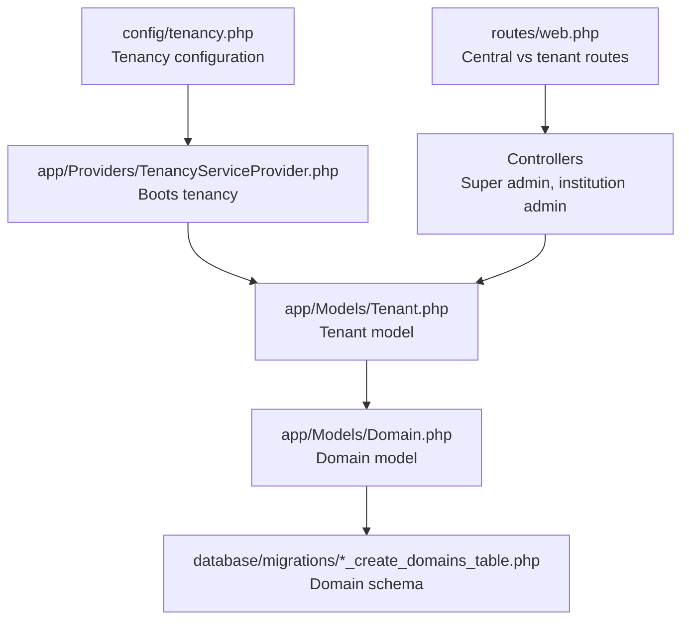

**Diagram sources**
- [config/tenancy.php:12-82](file://config/tenancy.php#L12-L82)
- [app/Providers/TenancyServiceProvider.php:24-40](file://app/Providers/TenancyServiceProvider.php#L24-L40)
- [app/Models/Tenant.php:11-85](file://app/Models/Tenant.php#L11-L85)
- [app/Models/Domain.php:12-58](file://app/Models/Domain.php#L12-L58)
- [database/migrations/2024_01_01_000001_create_domains_table.php:14-24](file://database/migrations/2024_01_01_000001_create_domains_table.php#L14-L24)
- [database/migrations/2025_09_05_080622_create_domains_table.php:12-34](file://database/migrations/2025_09_05_080622_create_domains_table.php#L12-L34)
- [routes/web.php:114-133](file://routes/web.php#L114-L133)

**Section sources**
- [config/tenancy.php:12-82](file://config/tenancy.php#L12-L82)
- [app/Providers/TenancyServiceProvider.php:24-40](file://app/Providers/TenancyServiceProvider.php#L24-L40)
- [app/Models/Tenant.php:11-85](file://app/Models/Tenant.php#L11-L85)
- [app/Models/Domain.php:12-58](file://app/Models/Domain.php#L12-L58)
- [database/migrations/2024_01_01_000001_create_domains_table.php:14-24](file://database/migrations/2024_01_01_000001_create_domains_table.php#L14-L24)
- [database/migrations/2025_09_05_080622_create_domains_table.php:12-34](file://database/migrations/2025_09_05_080622_create_domains_table.php#L12-L34)
- [routes/web.php:114-133](file://routes/web.php#L114-L133)

## Core Components
- Tenancy configuration: Defines tenant and domain models, central domains, bootstrappers for database, cache, filesystem, queue, and Redis, database manager for PostgreSQL schema, filesystem suffix base, Redis prefix base, and job handlers for create/migrate/seed/delete.
- Tenant model: Extends the base tenancy tenant, declares fillable attributes, custom columns, casts, and relationships to users, courses, graduates, employers, and jobs.
- Domain model: Implements the tenancy domain contract, defines central connection and cache invalidation traits, tenant relationship, and domain lifecycle events.
- Routing: Central-only routes for super admin and security dashboards; tenant routes are grouped under the tenant middleware group in the application’s route files.
- Controllers: Super admin dashboard aggregates institution metrics; institution customization controller manages branding, features, workflows, and integrations.

**Section sources**
- [config/tenancy.php:12-82](file://config/tenancy.php#L12-L82)
- [app/Models/Tenant.php:11-85](file://app/Models/Tenant.php#L11-L85)
- [app/Models/Domain.php:12-58](file://app/Models/Domain.php#L12-L58)
- [routes/web.php:114-133](file://routes/web.php#L114-L133)
- [app/Http/Controllers/SuperAdminDashboardController.php:84-105](file://app/Http/Controllers/SuperAdminDashboardController.php#L84-L105)
- [app/Http/Controllers/Admin/InstitutionCustomizationController.php:13-279](file://app/Http/Controllers/Admin/InstitutionCustomizationController.php#L13-L279)

## Architecture Overview
The system uses domain-based tenant resolution with automatic tenant identification via custom domains. Each tenant operates with its own database schema and isolated filesystem and cache spaces. Central domains host super admin and monitoring dashboards, while tenant routes are protected and scoped to the current tenant context.

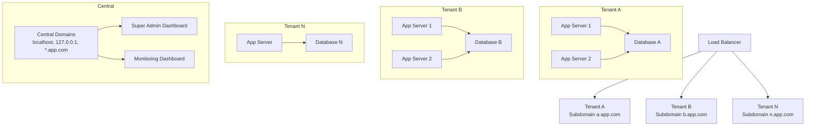

**Diagram sources**
- [technical-specification.md:35-73](file://technical-specification.md#L35-L73)
- [deployment-plan.md:19-39](file://deployment-plan.md#L19-L39)
- [config/tenancy.php:15-20](file://config/tenancy.php#L15-L20)
- [routes/web.php:114-133](file://routes/web.php#L114-L133)

**Section sources**
- [technical-specification.md:35-73](file://technical-specification.md#L35-L73)
- [deployment-plan.md:19-39](file://deployment-plan.md#L19-L39)
- [config/tenancy.php:15-20](file://config/tenancy.php#L15-L20)
- [routes/web.php:114-133](file://routes/web.php#L114-L133)

## Detailed Component Analysis

### Tenancy Configuration and Bootstrapping
- Central domains define which hostnames resolve to central/admin routes.
- Bootstrappers enable tenant-aware database, cache, filesystem, queue, and Redis contexts.
- Database manager configured for PostgreSQL schema management.
- Filesystem suffix base and Redis prefix base ensure tenant isolation.
- Migration/seeding parameters and job handlers define lifecycle operations.

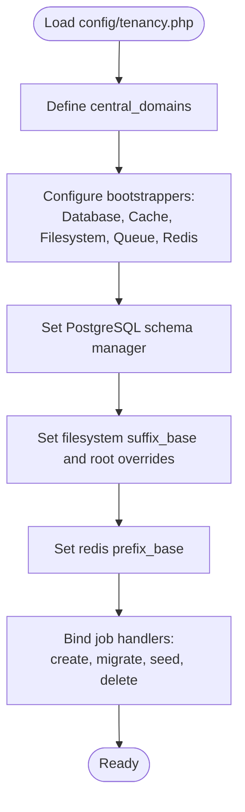

**Diagram sources**
- [config/tenancy.php:15-82](file://config/tenancy.php#L15-L82)

**Section sources**
- [config/tenancy.php:15-82](file://config/tenancy.php#L15-L82)

### Tenant Model and Relationships
- Tenant model extends the base tenancy tenant and implements the tenant-with-database contract.
- Declares fillable attributes and custom columns to preserve specific fields outside the JSON data column.
- Casts the data column as an array for flexible tenant metadata.
- Provides relationships to users, courses, graduates, employers, and jobs, leveraging tenant context.

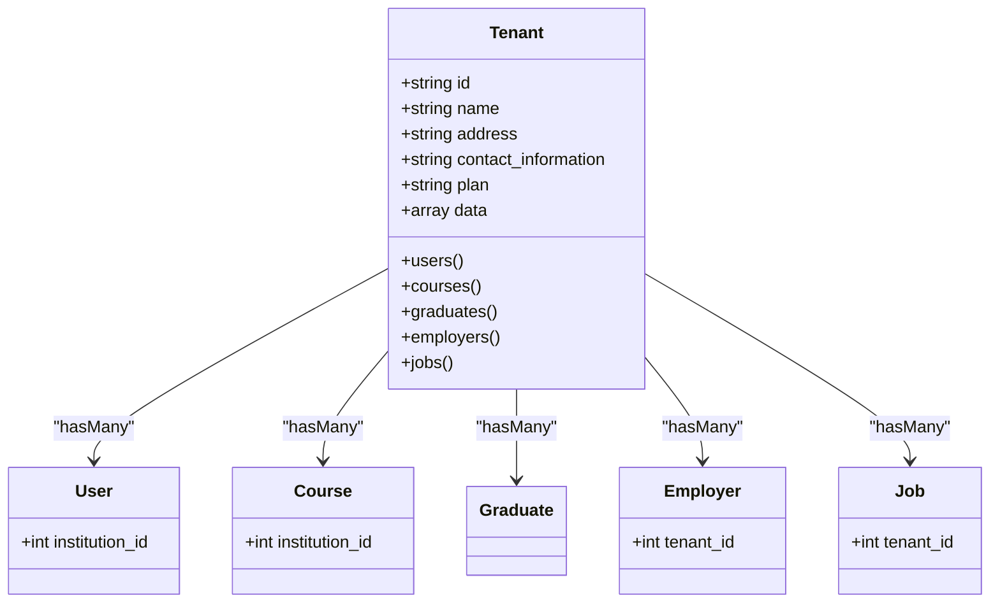

**Diagram sources**
- [app/Models/Tenant.php:11-85](file://app/Models/Tenant.php#L11-L85)

**Section sources**
- [app/Models/Tenant.php:11-85](file://app/Models/Tenant.php#L11-L85)

### Domain Model and Validation
- Domain model implements the tenancy domain contract and uses central connection and cache invalidation traits.
- Defines tenant relationship and dispatches domain lifecycle events.
- Includes domain validation helpers to prevent duplicate domains and enforce lowercase domains.

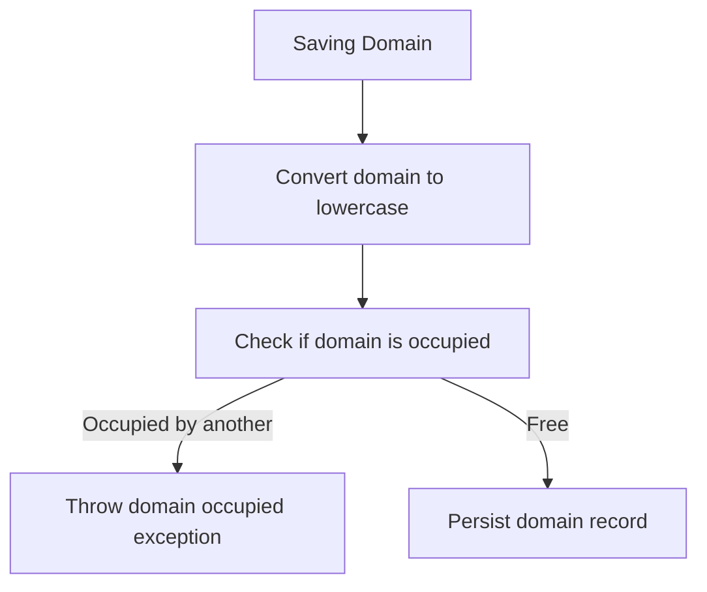

**Diagram sources**
- [app/Models/Domain.php:38-57](file://app/Models/Domain.php#L38-L57)

**Section sources**
- [app/Models/Domain.php:12-58](file://app/Models/Domain.php#L12-L58)

### Domain Schema Evolution
- Initial migration creates domains table with unique domain and foreign key to tenants.
- Subsequent migration evolves the domains table to include domain_type, status, is_primary, and ssl_enabled fields.

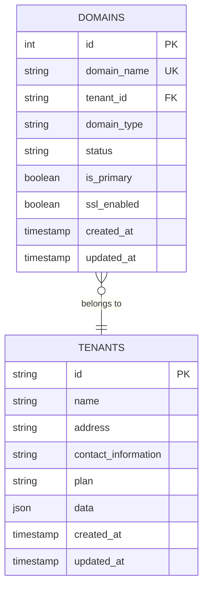

**Diagram sources**
- [database/migrations/2024_01_01_000001_create_domains_table.php:16-23](file://database/migrations/2024_01_01_000001_create_domains_table.php#L16-L23)
- [database/migrations/2025_09_05_080622_create_domains_table.php:14-34](file://database/migrations/2025_09_05_080622_create_domains_table.php#L14-L34)

**Section sources**
- [database/migrations/2024_01_01_000001_create_domains_table.php:14-34](file://database/migrations/2024_01_01_000001_create_domains_table.php#L14-L34)
- [database/migrations/2025_09_05_080622_create_domains_table.php:12-34](file://database/migrations/2025_09_05_080622_create_domains_table.php#L12-L34)

### Routing and Middleware Strategy
- Central-only routes for super admin and security dashboards are defined on central domains.
- Tenant routes are grouped under the tenant middleware group in the application’s route files, ensuring tenant context is active for tenant-facing endpoints.

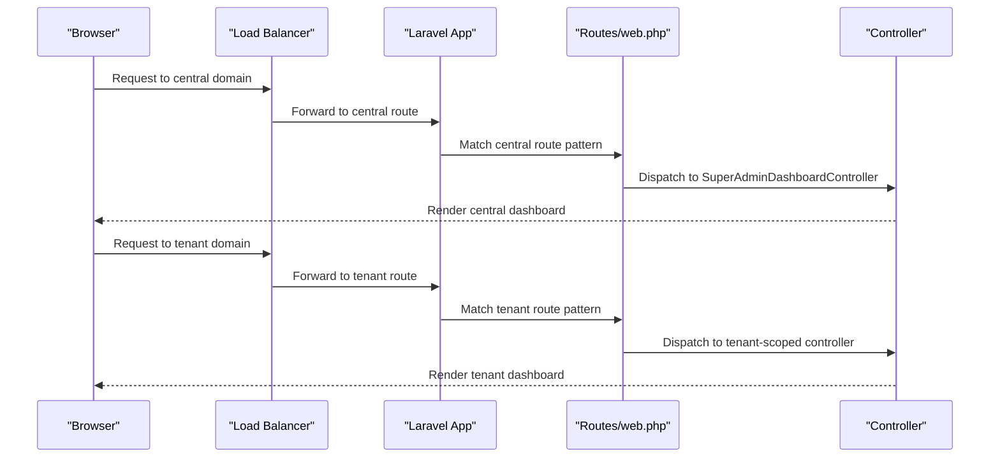

**Diagram sources**
- [routes/web.php:114-133](file://routes/web.php#L114-L133)

**Section sources**
- [routes/web.php:114-133](file://routes/web.php#L114-L133)

### Super Admin Management and Monitoring
- Super admin dashboard aggregates institution metrics including users, courses, and domains.
- Security dashboard provides event monitoring, data access logs, failed logins, sessions, and system health.
- Monitoring dashboard exposes endpoints for uptime, conversion metrics, performance metrics, error logs, and system health.

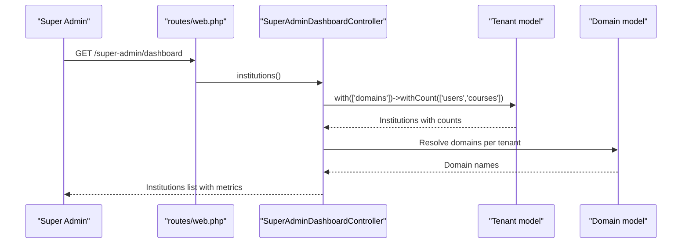

**Diagram sources**
- [routes/web.php:118-133](file://routes/web.php#L118-L133)
- [app/Http/Controllers/SuperAdminDashboardController.php:84-105](file://app/Http/Controllers/SuperAdminDashboardController.php#L84-L105)

**Section sources**
- [app/Http/Controllers/SuperAdminDashboardController.php:84-105](file://app/Http/Controllers/SuperAdminDashboardController.php#L84-L105)
- [routes/web.php:118-133](file://routes/web.php#L118-L133)

### Institution Customization and Branding
- Institution customization controller manages branding assets (logo, banner), color schemes, custom CSS, font families, theme styles, feature flags, custom fields, workflows, reporting configuration, and integrations.
- Updates are persisted to institution settings and integration settings.

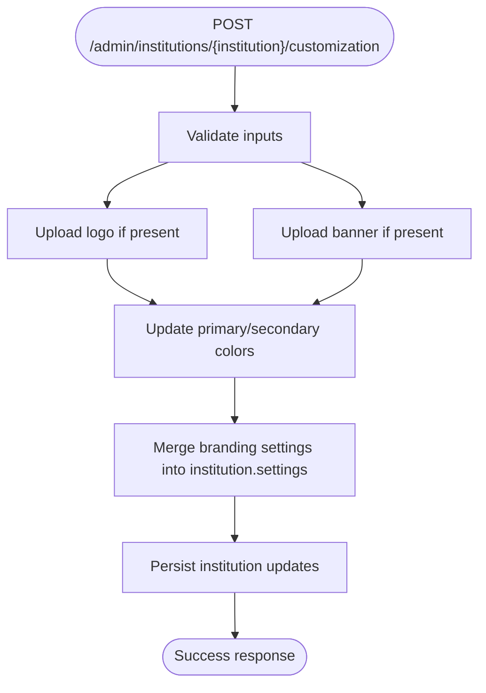

**Diagram sources**
- [app/Http/Controllers/Admin/InstitutionCustomizationController.php:28-82](file://app/Http/Controllers/Admin/InstitutionCustomizationController.php#L28-L82)
- [app/Http/Controllers/Admin/InstitutionCustomizationController.php:162-178](file://app/Http/Controllers/Admin/InstitutionCustomizationController.php#L162-L178)

**Section sources**
- [app/Http/Controllers/Admin/InstitutionCustomizationController.php:28-82](file://app/Http/Controllers/Admin/InstitutionCustomizationController.php#L28-L82)
- [app/Http/Controllers/Admin/InstitutionCustomizationController.php:162-178](file://app/Http/Controllers/Admin/InstitutionCustomizationController.php#L162-L178)

### Practical Examples

#### Tenant Creation Workflow
- Provision a new tenant record and associate a primary domain.
- Trigger database creation and schema migration using configured job handlers.
- Seed initial tenant data using the configured seeder parameters.
- Verify domain uniqueness and lowercased domain name during persistence.

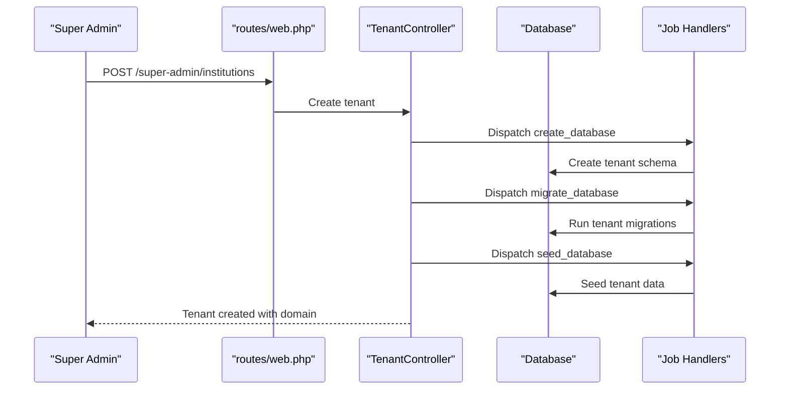

**Diagram sources**
- [config/tenancy.php:76-81](file://config/tenancy.php#L76-L81)
- [app/Models/Domain.php:38-57](file://app/Models/Domain.php#L38-L57)

**Section sources**
- [config/tenancy.php:76-81](file://config/tenancy.php#L76-L81)
- [app/Models/Domain.php:38-57](file://app/Models/Domain.php#L38-L57)

#### Domain Configuration and Verification
- Add a domain to a tenant with optional domain_type, status, is_primary, and ssl_enabled flags.
- Ensure domain uniqueness and enforce lowercase domain names.
- Invalidate tenant resolver cache upon domain changes.

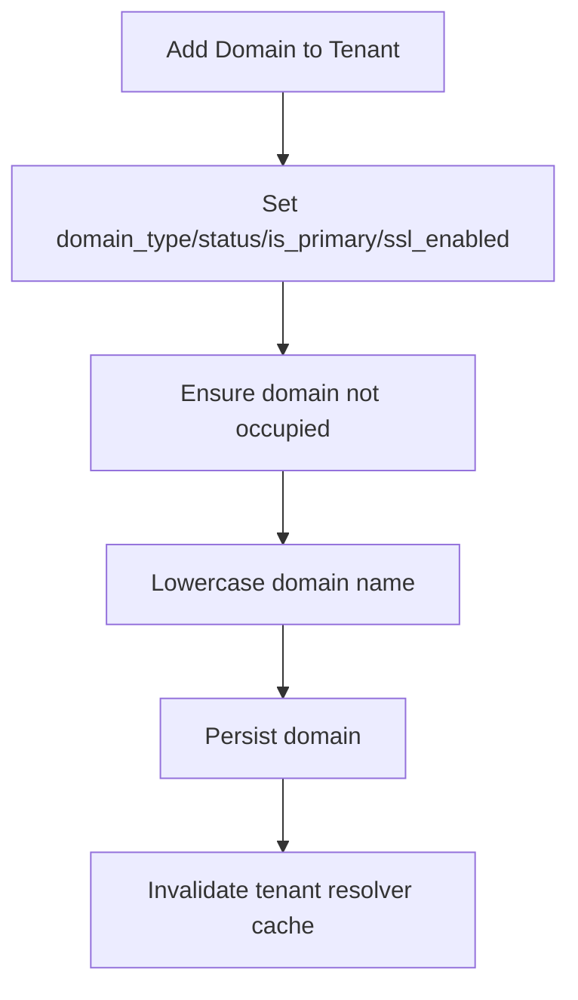

**Diagram sources**
- [database/migrations/2025_09_05_080622_create_domains_table.php:22-34](file://database/migrations/2025_09_05_080622_create_domains_table.php#L22-L34)
- [app/Models/Domain.php:38-57](file://app/Models/Domain.php#L38-L57)

**Section sources**
- [database/migrations/2025_09_05_080622_create_domains_table.php:22-34](file://database/migrations/2025_09_05_080622_create_domains_table.php#L22-L34)
- [app/Models/Domain.php:38-57](file://app/Models/Domain.php#L38-L57)

#### Administrative Workflows
- Super admin institution listing with counts of users and courses.
- Security dashboard for event monitoring, data access logs, failed logins, sessions, and system health.
- Monitoring dashboard endpoints for uptime, conversion metrics, performance metrics, error logs, and system health.

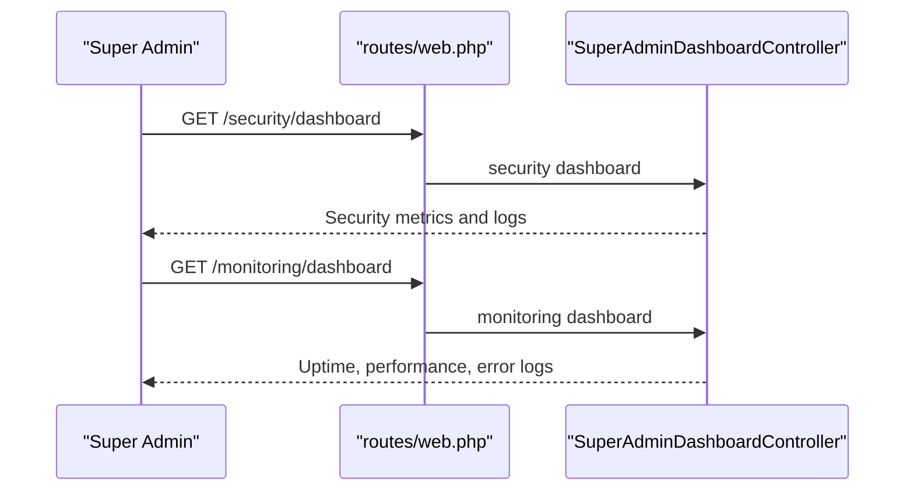

**Diagram sources**
- [routes/web.php:27-41](file://routes/web.php#L27-L41)
- [routes/web.php:135-147](file://routes/web.php#L135-L147)

**Section sources**
- [routes/web.php:27-41](file://routes/web.php#L27-L41)
- [routes/web.php:135-147](file://routes/web.php#L135-L147)

## Dependency Analysis
- Configuration depends on the Tenant and Domain models and bootstrappers.
- Tenant model depends on the base tenancy tenant and Eloquent relationships.
- Domain model depends on central connection and cache invalidation traits and domain lifecycle events.
- Routes depend on middleware groups to separate central/admin from tenant contexts.
- Controllers depend on models and policies for authorization and data aggregation.

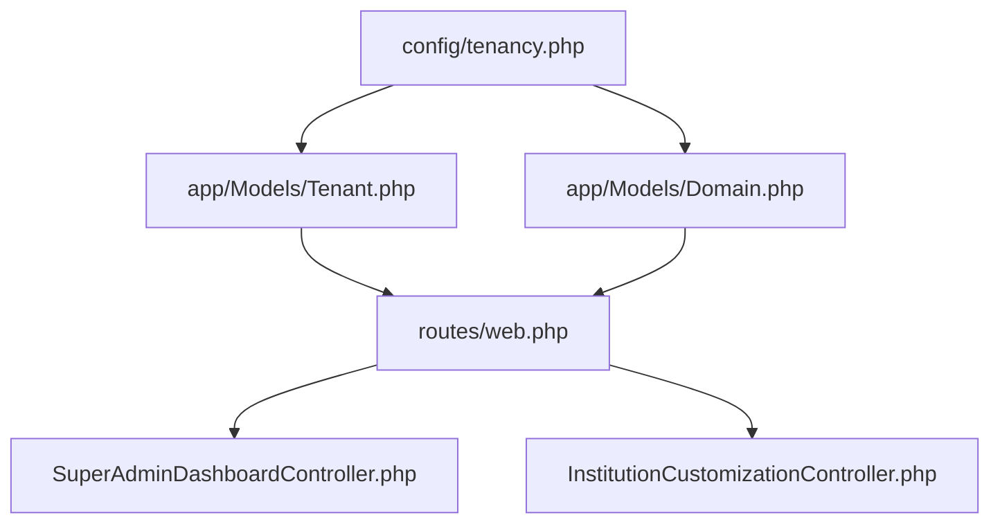

**Diagram sources**
- [config/tenancy.php:12-14](file://config/tenancy.php#L12-L14)
- [app/Models/Tenant.php:11-13](file://app/Models/Tenant.php#L11-L13)
- [app/Models/Domain.php:12-22](file://app/Models/Domain.php#L12-L22)
- [routes/web.php:114-133](file://routes/web.php#L114-L133)
- [app/Http/Controllers/SuperAdminDashboardController.php:84-105](file://app/Http/Controllers/SuperAdminDashboardController.php#L84-L105)
- [app/Http/Controllers/Admin/InstitutionCustomizationController.php:13-279](file://app/Http/Controllers/Admin/InstitutionCustomizationController.php#L13-L279)

**Section sources**
- [config/tenancy.php:12-14](file://config/tenancy.php#L12-L14)
- [app/Models/Tenant.php:11-13](file://app/Models/Tenant.php#L11-L13)
- [app/Models/Domain.php:12-22](file://app/Models/Domain.php#L12-L22)
- [routes/web.php:114-133](file://routes/web.php#L114-L133)
- [app/Http/Controllers/SuperAdminDashboardController.php:84-105](file://app/Http/Controllers/SuperAdminDashboardController.php#L84-L105)
- [app/Http/Controllers/Admin/InstitutionCustomizationController.php:13-279](file://app/Http/Controllers/Admin/InstitutionCustomizationController.php#L13-L279)

## Performance Considerations
- Database performance: Proper indexing, connection pooling, and tenant-aware query scoping.
- Application performance: Tenant context caching, optimized middleware stack, resource usage monitoring, and performance benchmarking.
- Scalability: Horizontal scaling per tenant with shared database isolation and load balancer distribution.

[No sources needed since this section provides general guidance]

## Troubleshooting Guide
- Cross-tenant access prevention: Ensure middleware-level access control and database-level query scoping are enforced.
- Domain conflicts: Validate domain uniqueness and handle domain occupied exceptions during saving.
- Tenant resolver cache: Invalidate tenant resolver cache after domain changes.
- Security tests: Verify cross-tenant access attempts, data leakage prevention, authentication isolation, and authorization boundaries.

**Section sources**
- [app/Models/Domain.php:38-57](file://app/Models/Domain.php#L38-L57)
- [task-03-multi-tenant-enhancement-recap.md:170-218](file://docs/task-03-multi-tenant-enhancement-recap.md#L170-L218)

## Conclusion
The multi-tenant architecture leverages Stancl Tenancy to deliver complete data isolation, domain-based tenant resolution, and scalable infrastructure. Configuration, models, migrations, routing, and controllers work together to support unlimited institutions with centralized super admin management, tenant-specific databases, isolated filesystems, and robust security and monitoring capabilities.

[No sources needed since this section summarizes without analyzing specific files]

## Appendices

### Security and Compliance Highlights
- Cross-tenant access prevention via middleware and database scoping
- Audit and compliance with tenant-specific logs and tracking
- Security event monitoring and session management

**Section sources**
- [task-03-multi-tenant-enhancement-recap.md:170-183](file://docs/task-03-multi-tenant-enhancement-recap.md#L170-L183)

### Monitoring and Maintenance
- Health monitoring, automated health checks, and resource usage alerts
- Maintenance tools for tenant backup, restore, and bulk operations

**Section sources**
- [task-03-multi-tenant-enhancement-recap.md:218-231](file://docs/task-03-multi-tenant-enhancement-recap.md#L218-L231)

### Platform Purpose and Capabilities
- Multi-tenant architecture supporting unlimited institutions with complete data isolation, domain-based resolution, scalable infrastructure, and centralized super admin management

**Section sources**
- [README.md:54-58](file://README.md#L54-L58)