# Tenant Management

<cite>
**Referenced Files in This Document**
- [Tenant.php](file://app/Models/Tenant.php)
- [Domain.php](file://app/Models/Domain.php)
- [tenancy.php](file://config/tenancy.php)
- [TenantIsolationVerificationTest.php](file://tests/Integration/TenantIsolationVerificationTest.php)
- [TemplateSeeder.php](file://database/seeders/TemplateSeeder.php)
- [frontend-architecture-plan.md](file://frontend-architecture-plan.md)
- [task-03-multi-tenant-enhancement-recap.md](file://docs/task-03-multi-tenant-enhancement-recap.md)
</cite>

## Table of Contents
1. [Introduction](#introduction)
2. [Project Structure](#project-structure)
3. [Core Components](#core-components)
4. [Architecture Overview](#architecture-overview)
5. [Detailed Component Analysis](#detailed-component-analysis)
6. [Dependency Analysis](#dependency-analysis)
7. [Performance Considerations](#performance-considerations)
8. [Troubleshooting Guide](#troubleshooting-guide)
9. [Conclusion](#conclusion)
10. [Appendices](#appendices)

## Introduction
This document provides comprehensive guidance for tenant management operations within the multi-tenant platform. It covers tenant creation, lifecycle management, administrative controls, and tenant-specific configurations. It explains the Tenant model structure, validation rules, and the relationship with Domains. It also documents onboarding workflows, approval processes, resource allocation, and tenant dashboard capabilities, reporting, and audit trails. Practical examples of tenant CRUD operations, bulk management, and status tracking are included to help administrators operate the system effectively.

## Project Structure
The tenant management system is built on Laravel with the Stancl tenancy package. The core components include:
- Tenant model with multi-tenant relations and custom columns
- Domain model for managing subdomains and central domains
- Configuration for tenancy bootstrapping, databases, cache, filesystem, and Redis
- Integration tests validating tenant isolation
- Seeder for initial tenant and resource creation
- Frontend architecture supporting tenant-scoped APIs

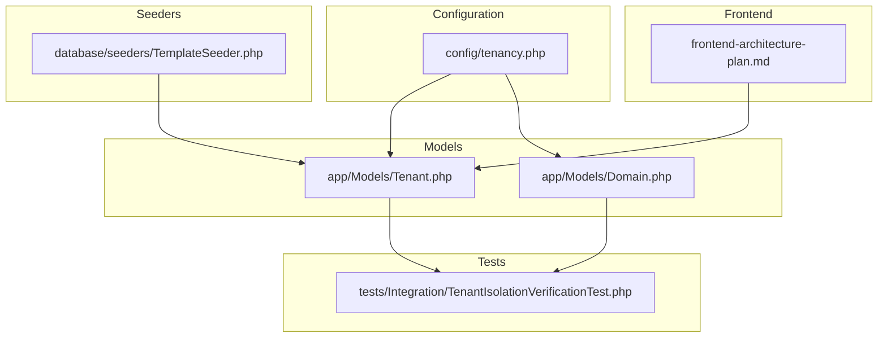

**Diagram sources**
- [tenancy.php:12-82](file://config/tenancy.php#L12-L82)
- [Tenant.php:11-85](file://app/Models/Tenant.php#L11-L85)
- [Domain.php:12-58](file://app/Models/Domain.php#L12-L58)
- [TenantIsolationVerificationTest.php:165-269](file://tests/Integration/TenantIsolationVerificationTest.php#L165-L269)
- [TemplateSeeder.php:162-207](file://database/seeders/TemplateSeeder.php#L162-L207)
- [frontend-architecture-plan.md:687-813](file://frontend-architecture-plan.md#L687-L813)

**Section sources**
- [tenancy.php:12-82](file://config/tenancy.php#L12-L82)
- [Tenant.php:11-85](file://app/Models/Tenant.php#L11-L85)
- [Domain.php:12-58](file://app/Models/Domain.php#L12-L58)
- [TenantIsolationVerificationTest.php:165-269](file://tests/Integration/TenantIsolationVerificationTest.php#L165-L269)
- [TemplateSeeder.php:162-207](file://database/seeders/TemplateSeeder.php#L162-L207)
- [frontend-architecture-plan.md:687-813](file://frontend-architecture-plan.md#L687-L813)

## Core Components
- Tenant model
  - Extends the base Stancl tenant model and implements the tenant-with-database contract
  - Defines fillable attributes including id, name, address, contact_information, plan, and data
  - Declares custom columns that should remain outside the data JSON column
  - Casts the data column as an array for flexible tenant metadata
  - Provides relationships to users, courses, graduates, employers, and jobs scoped to the tenant
- Domain model
  - Represents subdomains mapped to tenants
  - Uses central connection and invalidates tenant resolver cache on changes
  - Emits domain lifecycle events during saving/saving, creating/created, updating/updated, deleting/deleted
  - Includes two boot traits: domain availability check and lowercase conversion
- Tenancy configuration
  - Sets the tenant and domain models
  - Defines central domains for non-tenant requests
  - Configures bootstrappers for database, cache, filesystem, queue, and Redis
  - Defines database managers, cache tag base, filesystem suffix and root overrides, Redis prefix base, and migration/seeding parameters
  - Registers jobs for database creation, deletion, migration, and seeding

**Section sources**
- [Tenant.php:11-85](file://app/Models/Tenant.php#L11-L85)
- [Domain.php:12-58](file://app/Models/Domain.php#L12-L58)
- [tenancy.php:12-82](file://config/tenancy.php#L12-L82)

## Architecture Overview
The system enforces tenant isolation across databases, cache, filesystem, and Redis. Domains route traffic to specific tenants, and the Tenant model coordinates relationships with users, courses, graduates, employers, and jobs. The frontend integrates with tenant-scoped APIs to manage templates, landing pages, brand assets, analytics, and A/B tests.

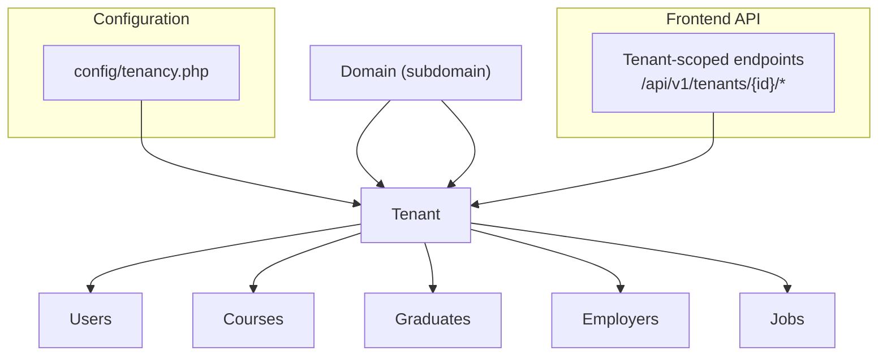

**Diagram sources**
- [Domain.php:19-22](file://app/Models/Domain.php#L19-L22)
- [Tenant.php:48-84](file://app/Models/Tenant.php#L48-L84)
- [tenancy.php:12-82](file://config/tenancy.php#L12-L82)
- [frontend-architecture-plan.md:687-813](file://frontend-architecture-plan.md#L687-L813)

## Detailed Component Analysis

### Tenant Model Analysis
The Tenant model encapsulates tenant identity, metadata, and relationships. It ensures that related entities are scoped to the tenant context and provides a flexible data column for tenant-specific configuration.

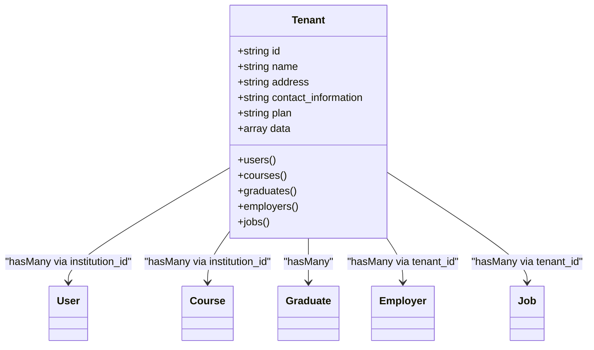

**Diagram sources**
- [Tenant.php:48-84](file://app/Models/Tenant.php#L48-L84)

**Section sources**
- [Tenant.php:11-85](file://app/Models/Tenant.php#L11-L85)

### Domain Model Analysis
The Domain model manages subdomains and ensures uniqueness and proper casing. It emits lifecycle events and invalidates tenant resolver cache to maintain consistency.

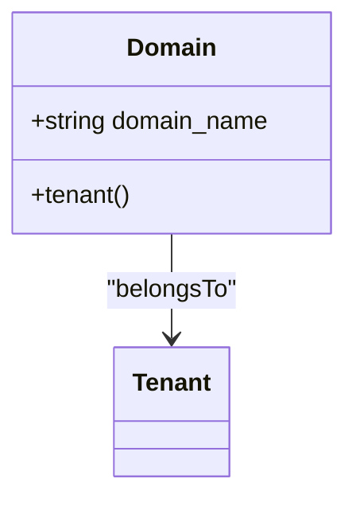

**Diagram sources**
- [Domain.php:19-22](file://app/Models/Domain.php#L19-L22)

**Section sources**
- [Domain.php:12-58](file://app/Models/Domain.php#L12-L58)

### Tenant Creation and Lifecycle Management
- Creation
  - Tenants are created via the Tenant model factory and seeded by the TemplateSeeder for demonstration environments
  - Domains are associated with tenants; the Domain model enforces uniqueness and lowercasing
- Lifecycle
  - Tenants can be updated to change metadata and plan
  - Deletion triggers database cleanup jobs configured in tenancy configuration
- Validation and constraints
  - Domain uniqueness is enforced during saving
  - Domain names are normalized to lowercase automatically

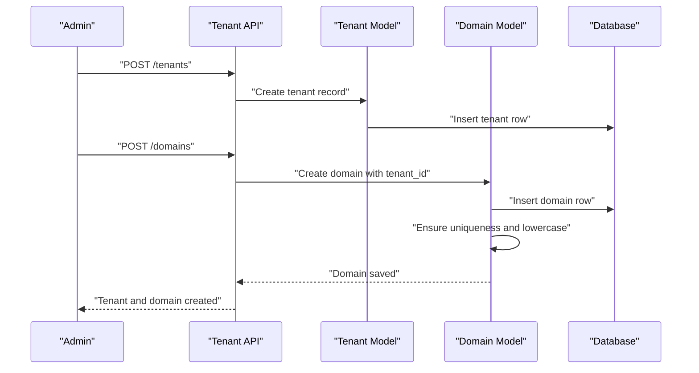

**Diagram sources**
- [Tenant.php:15-22](file://app/Models/Tenant.php#L15-L22)
- [Domain.php:38-47](file://app/Models/Domain.php#L38-L47)
- [Domain.php:52-57](file://app/Models/Domain.php#L52-L57)
- [TemplateSeeder.php:162-187](file://database/seeders/TemplateSeeder.php#L162-L187)

**Section sources**
- [Tenant.php:15-22](file://app/Models/Tenant.php#L15-L22)
- [Domain.php:38-47](file://app/Models/Domain.php#L38-L47)
- [Domain.php:52-57](file://app/Models/Domain.php#L52-L57)
- [TemplateSeeder.php:162-187](file://database/seeders/TemplateSeeder.php#L162-L187)

### Administrative Controls and Permissions
- Central domains are defined for non-tenant contexts
- Tenancy bootstrappers isolate database, cache, filesystem, queue, and Redis per tenant
- Tenant resolver cache is invalidated on domain changes to ensure routing accuracy
- Tests confirm cross-tenant access prevention and bulk operation isolation

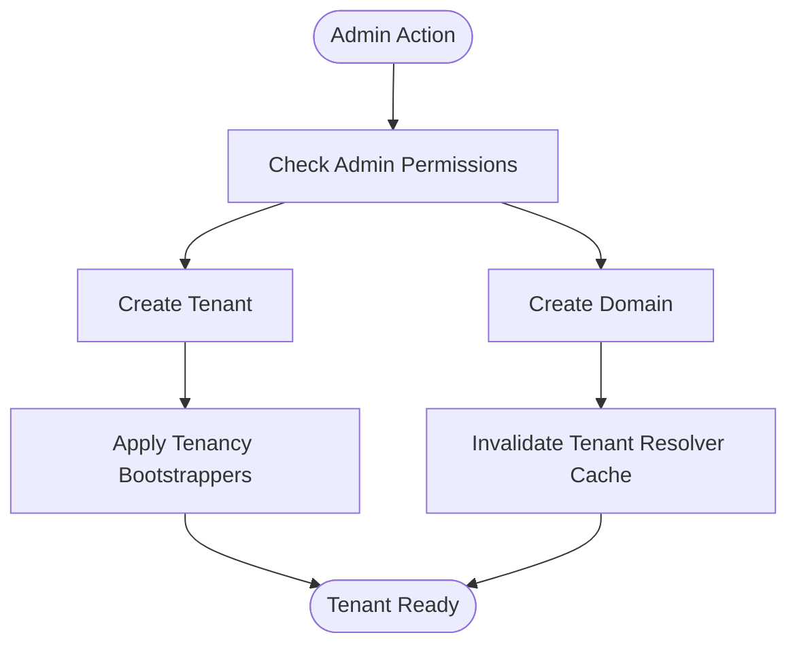

**Diagram sources**
- [tenancy.php:15-27](file://config/tenancy.php#L15-L27)
- [tenancy.php:21-27](file://config/tenancy.php#L21-L27)
- [Domain.php:14-15](file://app/Models/Domain.php#L14-L15)
- [TenantIsolationVerificationTest.php:200-250](file://tests/Integration/TenantIsolationVerificationTest.php#L200-L250)

**Section sources**
- [tenancy.php:15-27](file://config/tenancy.php#L15-L27)
- [tenancy.php:21-27](file://config/tenancy.php#L21-L27)
- [Domain.php:14-15](file://app/Models/Domain.php#L14-L15)
- [TenantIsolationVerificationTest.php:200-250](file://tests/Integration/TenantIsolationVerificationTest.php#L200-L250)

### Tenant Onboarding, Approval, and Resource Allocation
- Onboarding
  - Tenants are provisioned with a dedicated database schema and isolated resources
  - Migration and seeding parameters are configured for tenant-specific migrations
- Approval
  - Approval workflows are not explicitly modeled in the provided files; however, tenant activation and domain association imply an approval step in typical flows
- Resource allocation
  - Plan field in Tenant model indicates tier or subscription level
  - Employers and jobs are scoped to tenant_id, aligning resources with the tenant

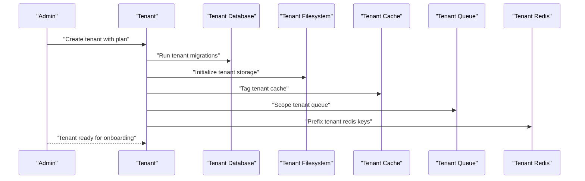

**Diagram sources**
- [tenancy.php:66-75](file://config/tenancy.php#L66-L75)
- [Tenant.php:73-84](file://app/Models/Tenant.php#L73-L84)

**Section sources**
- [tenancy.php:66-75](file://config/tenancy.php#L66-L75)
- [Tenant.php:73-84](file://app/Models/Tenant.php#L73-L84)

### Tenant CRUD Operations and Bulk Management
- CRUD
  - Create: Use Tenant factory and Domain creation
  - Read: Access tenant relationships and domain associations
  - Update: Modify tenant metadata and plan
  - Delete: Trigger database deletion jobs
- Bulk
  - Tests demonstrate bulk creation and isolation across tenants
  - Bulk operations respect tenant boundaries and do not leak data

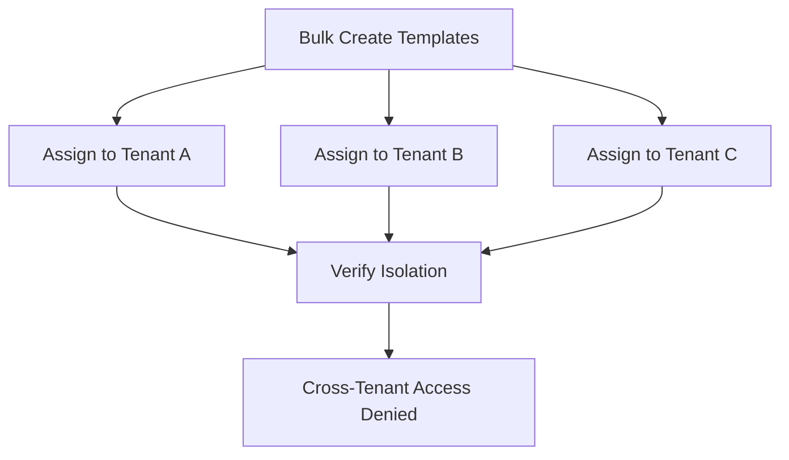

**Diagram sources**
- [TenantIsolationVerificationTest.php:252-269](file://tests/Integration/TenantIsolationVerificationTest.php#L252-L269)

**Section sources**
- [TenantIsolationVerificationTest.php:252-269](file://tests/Integration/TenantIsolationVerificationTest.php#L252-L269)

### Tenant Status Tracking and Auditing
- Domain events emit lifecycle events for tracking changes
- Central domains enable non-tenant access for administrative tasks
- Tests validate tenant isolation and cross-tenant access prevention

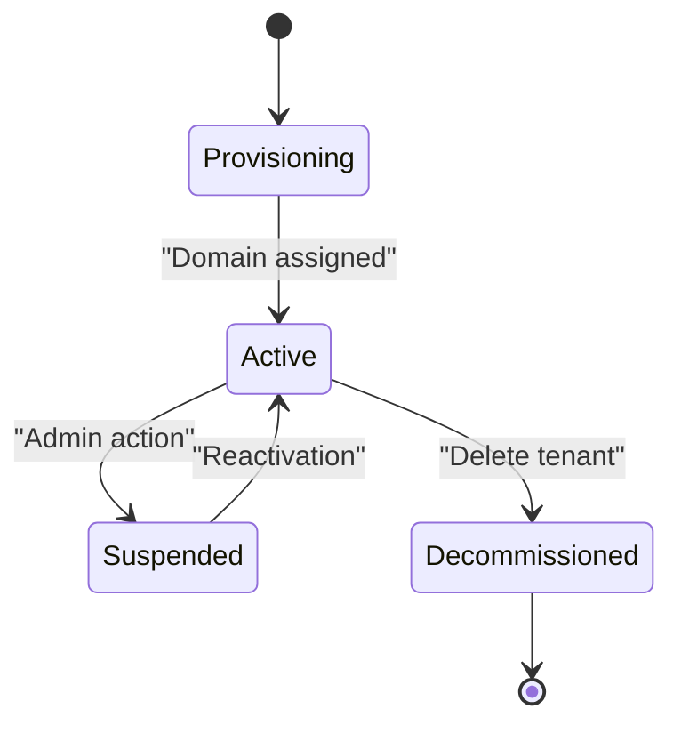

**Diagram sources**
- [Domain.php:24-33](file://app/Models/Domain.php#L24-L33)
- [tenancy.php:15-20](file://config/tenancy.php#L15-L20)

**Section sources**
- [Domain.php:24-33](file://app/Models/Domain.php#L24-L33)
- [tenancy.php:15-20](file://config/tenancy.php#L15-L20)

### Tenant Dashboard, Reporting, and Audit Trails
- Tenant dashboard
  - The frontend architecture defines tenant-scoped endpoints for templates, landing pages, brand assets, analytics, and A/B tests
- Reporting
  - Analytics endpoints are exposed for templates and landing pages per tenant
- Audit trails
  - Domain events provide a foundation for audit logging around domain changes

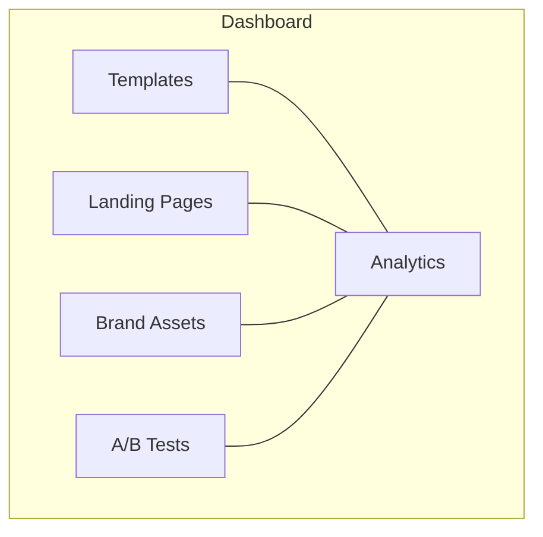

**Diagram sources**
- [frontend-architecture-plan.md:687-813](file://frontend-architecture-plan.md#L687-L813)

**Section sources**
- [frontend-architecture-plan.md:687-813](file://frontend-architecture-plan.md#L687-L813)

## Dependency Analysis
The Tenant and Domain models depend on the Stancl tenancy package and Laravel’s Eloquent ORM. The tenancy configuration ties these models to bootstrappers and job handlers for database provisioning and maintenance.

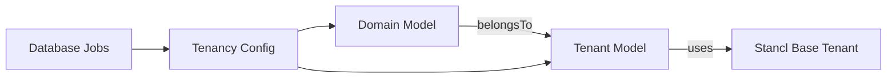

**Diagram sources**
- [Tenant.php:11-13](file://app/Models/Tenant.php#L11-L13)
- [Domain.php:19-22](file://app/Models/Domain.php#L19-L22)
- [tenancy.php:12-14](file://config/tenancy.php#L12-L14)
- [tenancy.php:76-81](file://config/tenancy.php#L76-L81)

**Section sources**
- [Tenant.php:11-13](file://app/Models/Tenant.php#L11-L13)
- [Domain.php:19-22](file://app/Models/Domain.php#L19-L22)
- [tenancy.php:12-14](file://config/tenancy.php#L12-L14)
- [tenancy.php:76-81](file://config/tenancy.php#L76-L81)

## Performance Considerations
- Tenant isolation is enforced across database, cache, filesystem, queue, and Redis to prevent contention
- Central domains allow non-tenant requests to avoid unnecessary tenant resolution overhead
- Migration and seeding parameters target tenant-specific migrations for efficient provisioning

[No sources needed since this section provides general guidance]

## Troubleshooting Guide
- Domain conflicts
  - If a domain is already taken, an exception is thrown during saving; resolve by choosing another domain or releasing the conflicting domain
- Case sensitivity
  - Domains are automatically converted to lowercase; ensure consistent casing in DNS and configuration
- Cross-tenant access denied
  - If a request returns forbidden, verify the tenant context and ensure the resource belongs to the current tenant
- Bulk operation isolation failures
  - Confirm that resources are created with the correct tenant_id and that tenant context is applied during operations

**Section sources**
- [Domain.php:38-47](file://app/Models/Domain.php#L38-L47)
- [Domain.php:52-57](file://app/Models/Domain.php#L52-L57)
- [TenantIsolationVerificationTest.php:200-250](file://tests/Integration/TenantIsolationVerificationTest.php#L200-L250)

## Conclusion
The tenant management system provides robust multi-tenancy with strong isolation, clear administrative controls, and tenant-scoped relationships. The Tenant and Domain models, combined with tenancy configuration and integration tests, ensure secure and scalable operations. The frontend architecture supports tenant dashboards, reporting, and audit-ready workflows.

[No sources needed since this section summarizes without analyzing specific files]

## Appendices
- Additional documentation highlights multi-tenant monitoring, maintenance, scalability, and security benefits

**Section sources**
- [task-03-multi-tenant-enhancement-recap.md:218-275](file://docs/task-03-multi-tenant-enhancement-recap.md#L218-L275)