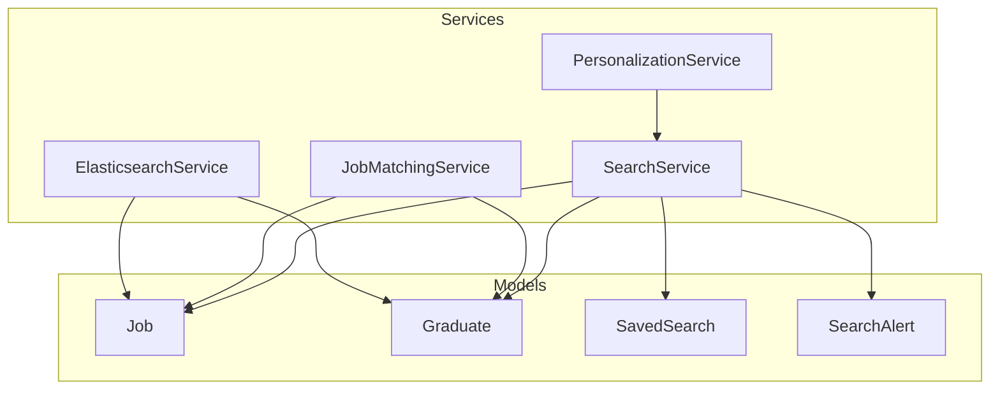
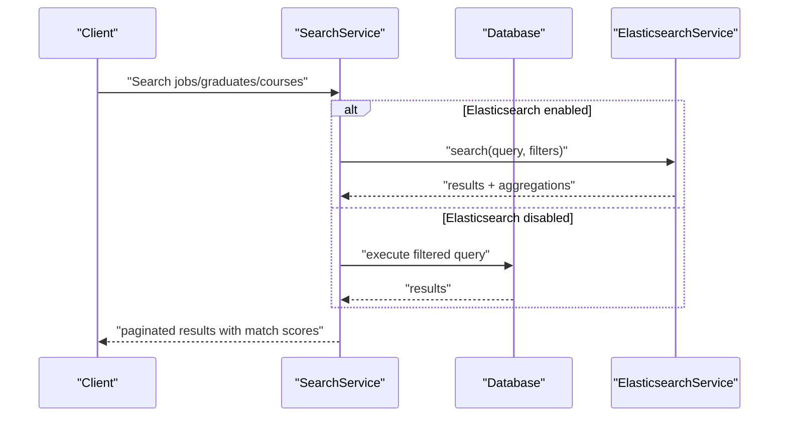
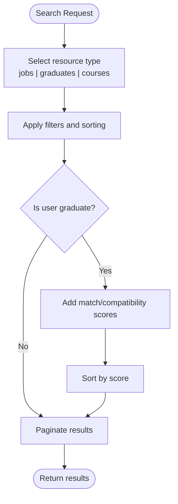
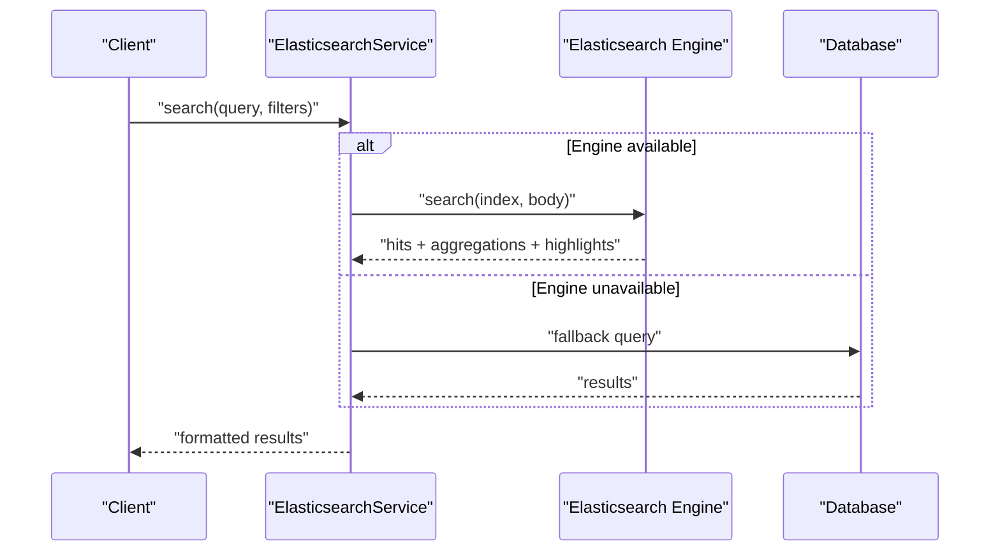
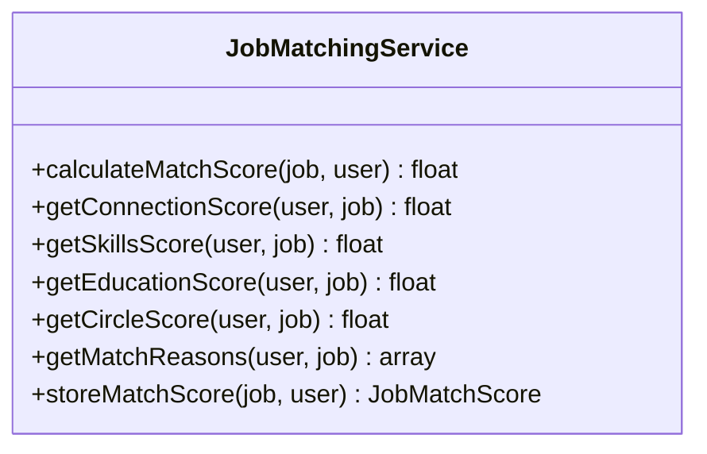
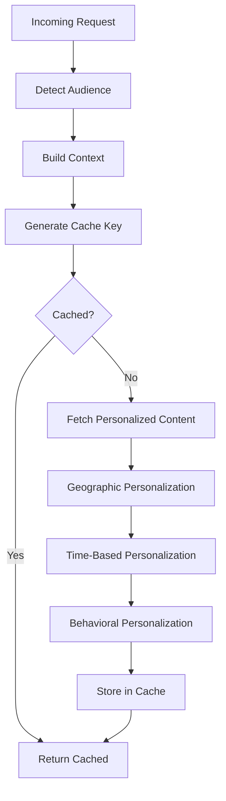
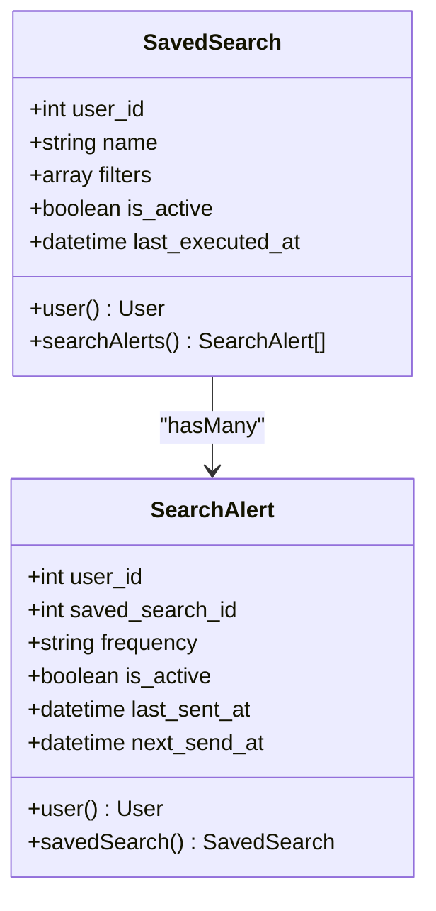
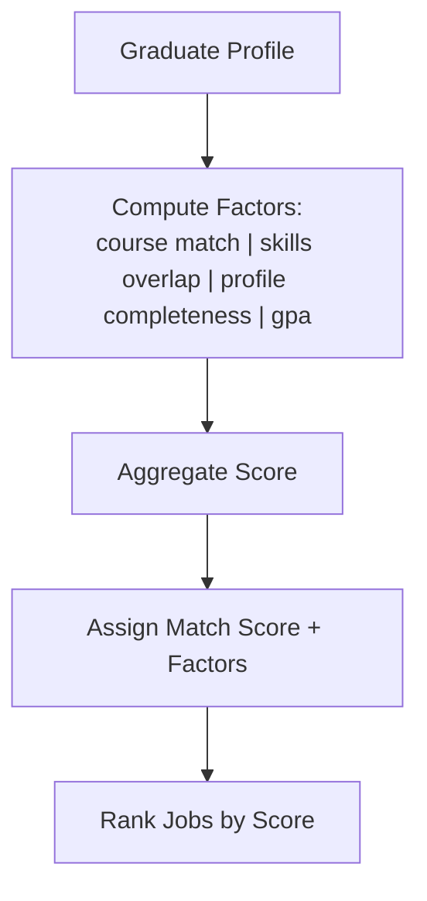
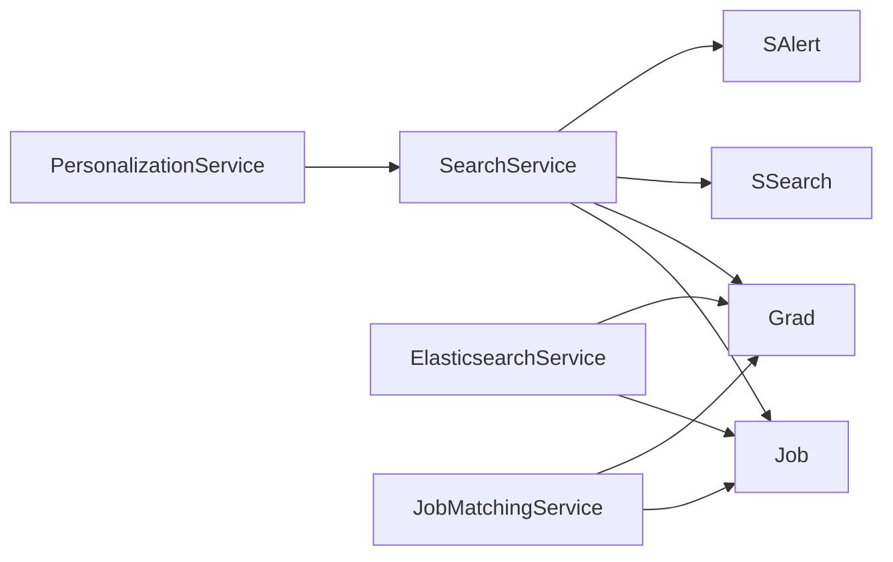

# Search & Discovery

<cite>
**Referenced Files in This Document**
- [SearchService.php](file://app/Services/SearchService.php)
- [ElasticsearchService.php](file://app/Services/ElasticsearchService.php)
- [JobMatchingService.php](file://app/Services/JobMatchingService.php)
- [PersonalizationService.php](file://app/Services/PersonalizationService.php)
- [Job.php](file://app/Models/Job.php)
- [Graduate.php](file://app/Models/Graduate.php)
- [SavedSearch.php](file://app/Models/SavedSearch.php)
- [SearchAlert.php](file://app/Models/SearchAlert.php)
- [SearchServiceTest.php](file://tests/Unit/Services/SearchServiceTest.php)
- [task-11-search-matching-system-recap.md](file://docs/task-11-search-matching-system-recap.md)
- [documentation.md](file://docs/api/v1/documentation.md)
</cite>

## Table of Contents
1. [Introduction](#introduction)
2. [Project Structure](#project-structure)
3. [Core Components](#core-components)
4. [Architecture Overview](#architecture-overview)
5. [Detailed Component Analysis](#detailed-component-analysis)
6. [Dependency Analysis](#dependency-analysis)
7. [Performance Considerations](#performance-considerations)
8. [Troubleshooting Guide](#troubleshooting-guide)
9. [Conclusion](#conclusion)
10. [Appendices](#appendices)

## Introduction
This document describes the intelligent search and discovery system for Alumate, focusing on advanced graduate search with multi-criteria filtering, a job discovery engine with relevance scoring, skill-based matching algorithms, and saved search functionality. It also covers global search capabilities, smart notifications for relevant opportunities, Elasticsearch integration, personalization algorithms, optimization strategies, filtering mechanisms, performance tuning, and user experience enhancements. Examples of search workflows, filter combinations, and result ranking algorithms are included to guide implementation and maintenance.

## Project Structure
The search and discovery system spans backend services, models, and tests:
- Services orchestrate search, matching, and personalization
- Models define domain entities and scoring logic
- Tests validate saved search, alerts, and filtering behavior
- Documentation outlines API usage and system capabilities

**Diagram sources**
- [SearchService.php:11-531](file://app/Services/SearchService.php#L11-L531)
- [ElasticsearchService.php:11-942](file://app/Services/ElasticsearchService.php#L11-L942)
- [JobMatchingService.php:12-362](file://app/Services/JobMatchingService.php#L12-L362)
- [PersonalizationService.php:9-451](file://app/Services/PersonalizationService.php#L9-L451)
- [Job.php:9-573](file://app/Models/Job.php#L9-L573)
- [Graduate.php:11-243](file://app/Models/Graduate.php#L11-L243)
- [SavedSearch.php:10-46](file://app/Models/SavedSearch.php#L10-L46)
- [SearchAlert.php:9-44](file://app/Models/SearchAlert.php#L9-L44)

**Section sources**
- [SearchService.php:11-531](file://app/Services/SearchService.php#L11-L531)
- [ElasticsearchService.php:11-942](file://app/Services/ElasticsearchService.php#L11-L942)
- [JobMatchingService.php:12-362](file://app/Services/JobMatchingService.php#L12-L362)
- [PersonalizationService.php:9-451](file://app/Services/PersonalizationService.php#L9-L451)
- [Job.php:9-573](file://app/Models/Job.php#L9-L573)
- [Graduate.php:11-243](file://app/Models/Graduate.php#L11-L243)
- [SavedSearch.php:10-46](file://app/Models/SavedSearch.php#L10-L46)
- [SearchAlert.php:9-44](file://app/Models/SearchAlert.php#L9-L44)

## Core Components
- SearchService: Implements multi-type search (jobs, graduates, courses), advanced filters, sorting, match scoring, and saved search/alerts processing.
- ElasticsearchService: Provides global search across multiple content types with faceting, aggregations, and fallback to database queries.
- JobMatchingService: Calculates composite match scores for jobs and users considering connections, skills, education, and circles.
- PersonalizationService: Determines audience segments and applies geographic, temporal, and behavioral personalization to content and recommendations.
- Models: Job and Graduate encapsulate scoring logic and domain helpers; SavedSearch and SearchAlert support persisted search configurations and notifications.

**Section sources**
- [SearchService.php:13-531](file://app/Services/SearchService.php#L13-L531)
- [ElasticsearchService.php:205-236](file://app/Services/ElasticsearchService.php#L205-L236)
- [JobMatchingService.php:26-41](file://app/Services/JobMatchingService.php#L26-L41)
- [PersonalizationService.php:138-174](file://app/Services/PersonalizationService.php#L138-L174)
- [Job.php:277-337](file://app/Models/Job.php#L277-L337)
- [Graduate.php:138-189](file://app/Models/Graduate.php#L138-L189)
- [SavedSearch.php:14-28](file://app/Models/SavedSearch.php#L14-L28)
- [SearchAlert.php:13-26](file://app/Models/SearchAlert.php#L13-L26)

## Architecture Overview
The system integrates database-backed search with optional Elasticsearch for global search and suggestions. Matching engines compute relevance scores for jobs and graduates, while personalization tailors content and recommendations. Alerts notify users of new opportunities based on saved searches.

**Diagram sources**
- [SearchService.php:13-83](file://app/Services/SearchService.php#L13-L83)
- [ElasticsearchService.php:205-236](file://app/Services/ElasticsearchService.php#L205-L236)

## Detailed Component Analysis

### SearchService: Advanced Multi-Criteria Search and Saved Alerts
- Multi-type search:
  - Jobs: keyword, location, course, job type, experience level, salary range, skills, work arrangement, employer verification; supports sort by date, salary, deadline, applications.
  - Graduates: keyword, course, graduation year range, employment status, skills, GPA bounds, location, profile completeness; sorts by profile completion.
  - Courses: keyword, level, duration range, skills gained, minimum employment rate, featured flag; sorts by employment rate.
- Match scoring:
  - For authenticated graduates, job listings receive match scores and factors; results sorted by score.
  - For searches targeting a specific job, graduate listings receive match scores.
- Recommendations:
  - Job recommendations by course and skills; candidate recommendations by course and skills.
  - Advanced matching with compatibility scoring based on preferences (location, salary, job type, work arrangement, experience).
- Saved search and alerts:
  - Persist search criteria and enable periodic alerts; process alerts via scheduled command.

**Diagram sources**
- [SearchService.php:13-83](file://app/Services/SearchService.php#L13-L83)
- [SearchService.php:272-346](file://app/Services/SearchService.php#L272-L346)
- [SearchService.php:404-446](file://app/Services/SearchService.php#L404-L446)

**Section sources**
- [SearchService.php:13-83](file://app/Services/SearchService.php#L13-L83)
- [SearchService.php:85-159](file://app/Services/SearchService.php#L85-L159)
- [SearchService.php:161-201](file://app/Services/SearchService.php#L161-L201)
- [SearchService.php:272-346](file://app/Services/SearchService.php#L272-L346)
- [SearchService.php:404-446](file://app/Services/SearchService.php#L404-L446)
- [SearchService.php:493-531](file://app/Services/SearchService.php#L493-L531)
- [SearchServiceTest.php:140-204](file://tests/Unit/Services/SearchServiceTest.php#L140-L204)

### ElasticsearchService: Global Search and Suggestions
- Global search across users, posts, jobs, events with weighted fields, fuzziness, and highlighting.
- Aggregations for facets (locations, graduation years, industries, skills, schools).
- Completion suggesters for names and skills.
- Fallback to database queries when Elasticsearch is unavailable.
- Index creation with appropriate mappings.

**Diagram sources**
- [ElasticsearchService.php:205-236](file://app/Services/ElasticsearchService.php#L205-L236)
- [ElasticsearchService.php:656-679](file://app/Services/ElasticsearchService.php#L656-L679)

**Section sources**
- [ElasticsearchService.php:205-236](file://app/Services/ElasticsearchService.php#L205-L236)
- [ElasticsearchService.php:388-449](file://app/Services/ElasticsearchService.php#L388-L449)
- [ElasticsearchService.php:557-590](file://app/Services/ElasticsearchService.php#L557-L590)
- [ElasticsearchService.php:656-679](file://app/Services/ElasticsearchService.php#L656-L679)

### JobMatchingService: Composite Matching for Jobs and Users
- Weights: connections (35%), skills (25%), education (20%), circles (20%).
- Connection score: based on mutual connections at the company, with seniority bonuses.
- Skills score: intersection of user and job skills, plus extra skill bonus.
- Education score: checks degree relevance, field relevance, and school prestige.
- Circle score: overlap of user’s circles with company employees.
- Match reasons and detailed scoring stored for transparency.

**Diagram sources**
- [JobMatchingService.php:26-41](file://app/Services/JobMatchingService.php#L26-L41)
- [JobMatchingService.php:46-64](file://app/Services/JobMatchingService.php#L46-L64)
- [JobMatchingService.php:69-88](file://app/Services/JobMatchingService.php#L69-L88)
- [JobMatchingService.php:93-127](file://app/Services/JobMatchingService.php#L93-L127)
- [JobMatchingService.php:132-170](file://app/Services/JobMatchingService.php#L132-L170)
- [JobMatchingService.php:175-233](file://app/Services/JobMatchingService.php#L175-L233)
- [JobMatchingService.php:258-280](file://app/Services/JobMatchingService.php#L258-L280)

**Section sources**
- [JobMatchingService.php:14-38](file://app/Services/JobMatchingService.php#L14-L38)
- [JobMatchingService.php:46-64](file://app/Services/JobMatchingService.php#L46-L64)
- [JobMatchingService.php:69-88](file://app/Services/JobMatchingService.php#L69-L88)
- [JobMatchingService.php:93-127](file://app/Services/JobMatchingService.php#L93-L127)
- [JobMatchingService.php:132-170](file://app/Services/JobMatchingService.php#L132-L170)
- [JobMatchingService.php:175-233](file://app/Services/JobMatchingService.php#L175-L233)
- [JobMatchingService.php:258-280](file://app/Services/JobMatchingService.php#L258-L280)

### PersonalizationService: Audience Detection and Content Tailoring
- Detects audience (individual vs institutional) using URL params, referrer domains, user agent, and UTM sources.
- Builds context and caches personalized content with time-based variations.
- Applies geographic, time-of-day, and behavioral personalization.
- Supports A/B testing variant assignment and conversion tracking.

**Diagram sources**
- [PersonalizationService.php:21-133](file://app/Services/PersonalizationService.php#L21-L133)
- [PersonalizationService.php:153-174](file://app/Services/PersonalizationService.php#L153-L174)
- [PersonalizationService.php:246-338](file://app/Services/PersonalizationService.php#L246-L338)

**Section sources**
- [PersonalizationService.php:21-133](file://app/Services/PersonalizationService.php#L21-L133)
- [PersonalizationService.php:153-174](file://app/Services/PersonalizationService.php#L153-L174)
- [PersonalizationService.php:246-338](file://app/Services/PersonalizationService.php#L246-L338)

### Saved Search and Alerts: Persistence and Automation
- SavedSearch stores user-defined search configurations with criteria and execution metadata.
- SearchAlert links saved searches to users and manages periodic alert delivery.
- SearchService provides saving and retrieval of saved searches and processing of alerts.

**Diagram sources**
- [SavedSearch.php:14-28](file://app/Models/SavedSearch.php#L14-L28)
- [SearchAlert.php:13-26](file://app/Models/SearchAlert.php#L13-L26)

**Section sources**
- [SavedSearch.php:14-28](file://app/Models/SavedSearch.php#L14-L28)
- [SearchAlert.php:13-26](file://app/Models/SearchAlert.php#L13-L26)
- [SearchService.php:493-531](file://app/Services/SearchService.php#L493-L531)
- [SearchServiceTest.php:140-181](file://tests/Unit/Services/SearchServiceTest.php#L140-L181)

### Job and Graduate Scoring: Relevance and Compatibility
- Job model computes match scores for graduates based on course alignment, skills overlap, profile completeness, and GPA.
- Graduate model exposes profile completion metrics and scopes for filtering.
- Combined with SearchService, results are ranked by match/compatibility scores.

**Diagram sources**
- [Job.php:277-313](file://app/Models/Job.php#L277-L313)
- [Graduate.php:138-189](file://app/Models/Graduate.php#L138-L189)
- [SearchService.php:27-38](file://app/Services/SearchService.php#L27-L38)

**Section sources**
- [Job.php:277-313](file://app/Models/Job.php#L277-L313)
- [Graduate.php:138-189](file://app/Models/Graduate.php#L138-L189)
- [SearchService.php:27-38](file://app/Services/SearchService.php#L27-L38)

## Dependency Analysis
- SearchService depends on Job, Graduate, SavedSearch, and SearchAlert models and orchestrates match scoring.
- ElasticsearchService provides a fallback mechanism when external indexing is unavailable.
- JobMatchingService encapsulates reusable matching logic for jobs and users.
- PersonalizationService coordinates content customization and caching.

**Diagram sources**
- [SearchService.php:11-531](file://app/Services/SearchService.php#L11-L531)
- [ElasticsearchService.php:11-942](file://app/Services/ElasticsearchService.php#L11-L942)
- [JobMatchingService.php:12-362](file://app/Services/JobMatchingService.php#L12-L362)
- [PersonalizationService.php:9-451](file://app/Services/PersonalizationService.php#L9-L451)

**Section sources**
- [SearchService.php:11-531](file://app/Services/SearchService.php#L11-L531)
- [ElasticsearchService.php:11-942](file://app/Services/ElasticsearchService.php#L11-L942)
- [JobMatchingService.php:12-362](file://app/Services/JobMatchingService.php#L12-L362)
- [PersonalizationService.php:9-451](file://app/Services/PersonalizationService.php#L9-L451)

## Performance Considerations
- Elasticsearch integration: Use weighted fields, fuzziness, and highlighting judiciously; maintain optimized mappings and indices.
- Query optimization: Prefer indexed JSON contains for skills; leverage scopes and eager loading; paginate large result sets.
- Caching: Cache frequently accessed recommendations and personalized content; invalidate on configuration changes.
- Sorting and ranking: Compute match/compatibility scores server-side; sort after pagination to reduce memory overhead.
- Background processing: Schedule alert processing and batch matching updates to avoid blocking requests.
- Monitoring: Track Elasticsearch latency, hit counts, and fallback triggers; measure search latency and throughput.

[No sources needed since this section provides general guidance]

## Troubleshooting Guide
- Elasticsearch unavailability: Verify client initialization and host configuration; confirm fallback behavior and log warnings.
- Slow search queries: Review filter usage, add missing indexes, and consider query simplification.
- Incorrect match scores: Validate factor weights and scoring thresholds; ensure data normalization (lowercase, trimming).
- Saved search failures: Confirm persistence of criteria and alert scheduling; inspect scheduled command execution logs.
- Personalization anomalies: Check audience detection logic and context building; review cache keys and TTLs.

**Section sources**
- [ElasticsearchService.php:17-33](file://app/Services/ElasticsearchService.php#L17-L33)
- [ElasticsearchService.php:63-71](file://app/Services/ElasticsearchService.php#L63-L71)
- [SearchService.php:27-38](file://app/Services/SearchService.php#L27-L38)
- [SearchService.php:517-529](file://app/Services/SearchService.php#L517-L529)
- [PersonalizationService.php:163-173](file://app/Services/PersonalizationService.php#L163-L173)

## Conclusion
The search and discovery system combines robust database-driven search with optional Elasticsearch for global capabilities, sophisticated matching algorithms for jobs and graduates, persistent saved searches with alert automation, and adaptive personalization. By leveraging multi-criteria filtering, relevance scoring, and performance optimizations, the platform delivers a scalable and user-centric discovery experience.

[No sources needed since this section summarizes without analyzing specific files]

## Appendices

### API and Workflow References
- Saved search and alert examples are validated in unit tests.
- Notifications API endpoints are documented in the API documentation.

**Section sources**
- [SearchServiceTest.php:140-204](file://tests/Unit/Services/SearchServiceTest.php#L140-L204)
- [documentation.md:355-375](file://docs/api/v1/documentation.md#L355-L375)

### Example Workflows and Filter Combinations
- Job search with keywords, skills, salary range, and location; sort by relevance or salary.
- Graduate search by course, employment status, and GPA; filter by skills and location.
- Saved search with daily/weekly alerts for job opportunities aligned with user preferences.
- Personalized recommendations combining course and skills-based filters.

**Section sources**
- [SearchService.php:272-346](file://app/Services/SearchService.php#L272-L346)
- [SearchService.php:348-402](file://app/Services/SearchService.php#L348-L402)
- [SearchService.php:493-531](file://app/Services/SearchService.php#L493-L531)
- [task-11-search-matching-system-recap.md:363-405](file://docs/task-11-search-matching-system-recap.md#L363-L405)