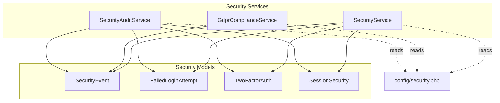
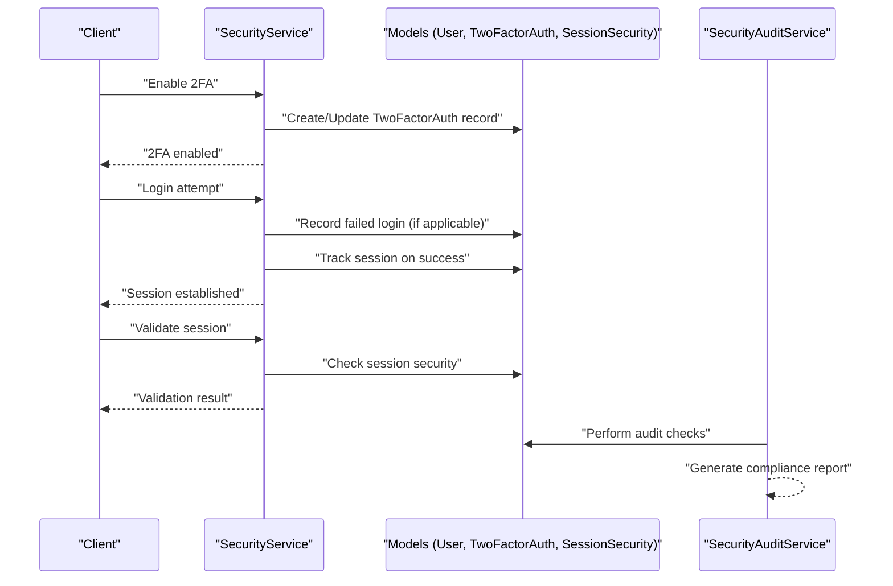
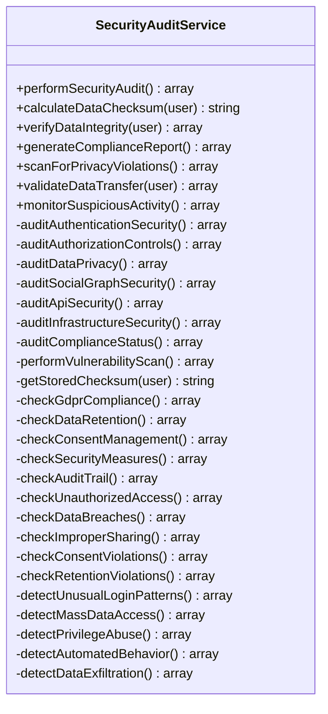
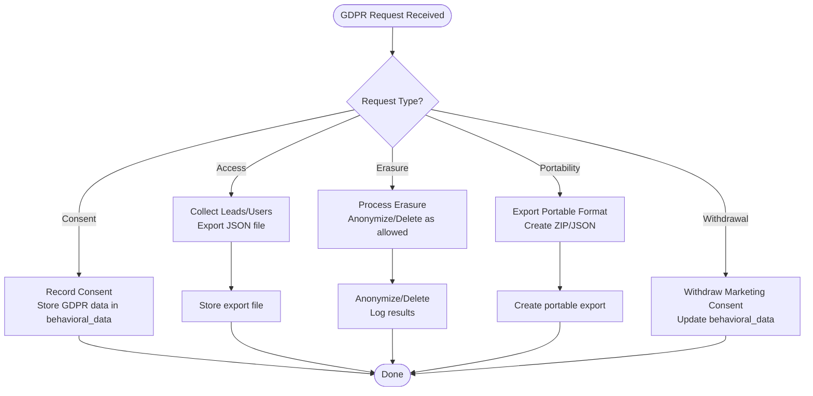
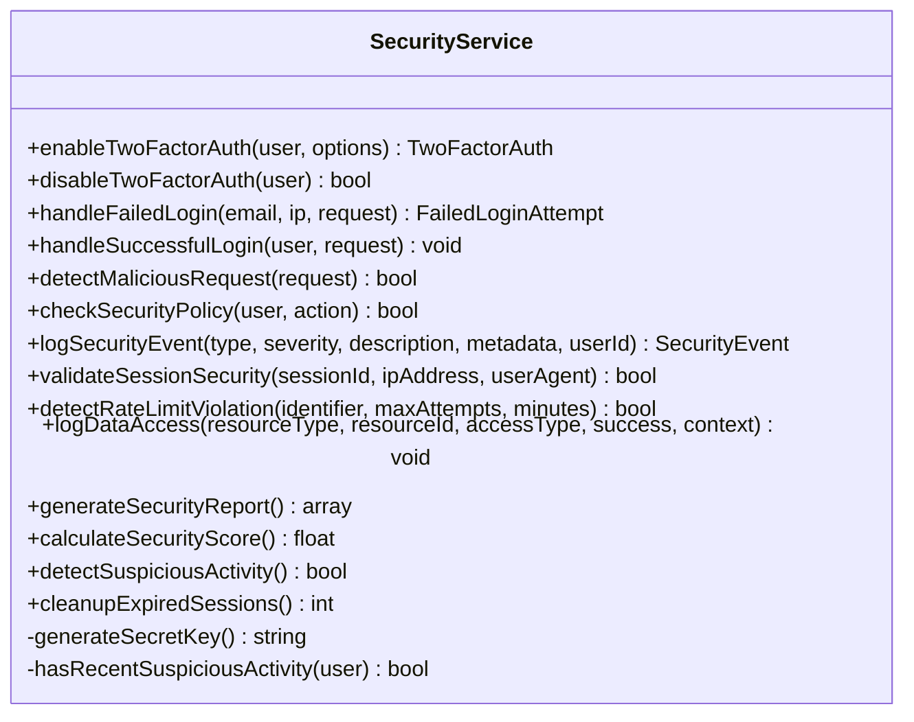
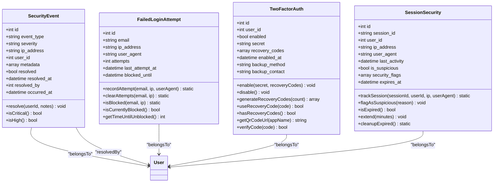
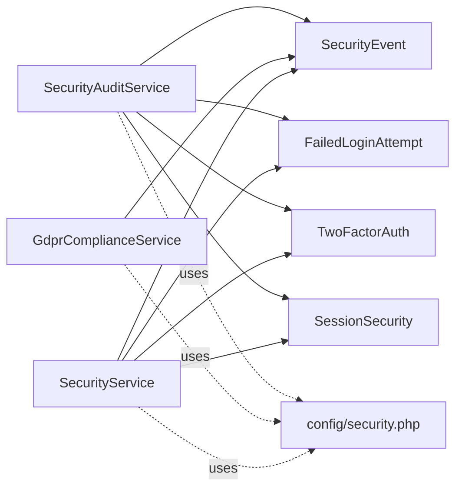

# Security & Compliance

<cite>
**Referenced Files in This Document**
- [SecurityAuditService.php](file://app/Services/SecurityAuditService.php)
- [GdprComplianceService.php](file://app/Services/GdprComplianceService.php)
- [SecurityService.php](file://app/Services/SecurityService.php)
- [security.php](file://config/security.php)
- [SecurityEvent.php](file://app/Models/SecurityEvent.php)
- [FailedLoginAttempt.php](file://app/Models/FailedLoginAttempt.php)
- [TwoFactorAuth.php](file://app/Models/TwoFactorAuth.php)
- [SessionSecurity.php](file://app/Models/SessionSecurity.php)
- [task-12-security-audit-system-recap.md](file://docs/task-12-security-audit-system-recap.md)
- [security-audit-implementation.md](file://docs/security-audit-implementation.md)
- [technical-specification.md](file://technical-specification.md)
</cite>

## Table of Contents
1. [Introduction](#introduction)
2. [Project Structure](#project-structure)
3. [Core Components](#core-components)
4. [Architecture Overview](#architecture-overview)
5. [Detailed Component Analysis](#detailed-component-analysis)
6. [Dependency Analysis](#dependency-analysis)
7. [Performance Considerations](#performance-considerations)
8. [Troubleshooting Guide](#troubleshooting-guide)
9. [Conclusion](#conclusion)
10. [Appendices](#appendices)

## Introduction
This document describes the security and compliance framework implemented in the platform. It covers data encryption and privacy controls, GDPR compliance tooling, comprehensive audit logging, secure authentication with multi-factor support, and operational procedures for regular security audits, vulnerability assessments, compliance monitoring, and incident response. It also outlines data protection measures, access control mechanisms, monitoring capabilities, and practical examples of configurations, audit trails, and compliance reporting.

## Project Structure
Security and compliance functionality is primarily implemented in dedicated services and supporting models, with configuration centralized under a dedicated security configuration file. The following diagram maps the primary components involved in security and compliance.

**Diagram sources**
- [SecurityAuditService.php:12-25](file://app/Services/SecurityAuditService.php#L12-L25)
- [GdprComplianceService.php:16-63](file://app/Services/GdprComplianceService.php#L16-L63)
- [SecurityService.php:29-65](file://app/Services/SecurityService.php#L29-L65)
- [SecurityEvent.php:12-29](file://app/Models/SecurityEvent.php#L12-L29)
- [FailedLoginAttempt.php:12-24](file://app/Models/FailedLoginAttempt.php#L12-L24)
- [TwoFactorAuth.php:15-29](file://app/Models/TwoFactorAuth.php#L15-L29)
- [SessionSecurity.php:14-23](file://app/Models/SessionSecurity.php#L14-L23)
- [security.php:9-18](file://config/security.php#L9-L18)

**Section sources**
- [SecurityAuditService.php:12-25](file://app/Services/SecurityAuditService.php#L12-L25)
- [GdprComplianceService.php:16-63](file://app/Services/GdprComplianceService.php#L16-L63)
- [SecurityService.php:29-65](file://app/Services/SecurityService.php#L29-L65)
- [SecurityEvent.php:12-29](file://app/Models/SecurityEvent.php#L12-L29)
- [FailedLoginAttempt.php:12-24](file://app/Models/FailedLoginAttempt.php#L12-L24)
- [TwoFactorAuth.php:15-29](file://app/Models/TwoFactorAuth.php#L15-L29)
- [SessionSecurity.php:14-23](file://app/Models/SessionSecurity.php#L14-L23)
- [security.php:9-18](file://config/security.php#L9-L18)

## Core Components
- SecurityAuditService: Provides comprehensive audit checks across authentication, authorization, data privacy, API, infrastructure, compliance, and vulnerability scanning. It also supports integrity verification and compliance reporting.
- GdprComplianceService: Implements GDPR consent management, data subject access and erasure requests, portability exports, marketing consent withdrawal, retention checks, and anonymization routines.
- SecurityService: Manages two-factor authentication lifecycle, failed login handling with lockout policies, malicious request detection, session security validation, rate-limiting helpers, and security event logging.
- Security configuration: Centralized security settings for login attempts, lockout duration, rate limits, session timeouts, two-factor enforcement roles, backup retention, monitoring toggles, and health thresholds.
- Security models: SecurityEvent, FailedLoginAttempt, TwoFactorAuth, and SessionSecurity persist security-relevant state and metadata.

**Section sources**
- [SecurityAuditService.php:12-72](file://app/Services/SecurityAuditService.php#L12-L72)
- [GdprComplianceService.php:16-63](file://app/Services/GdprComplianceService.php#L16-L63)
- [SecurityService.php:29-65](file://app/Services/SecurityService.php#L29-L65)
- [security.php:9-74](file://config/security.php#L9-L74)
- [SecurityEvent.php:12-29](file://app/Models/SecurityEvent.php#L12-L29)
- [FailedLoginAttempt.php:12-24](file://app/Models/FailedLoginAttempt.php#L12-L24)
- [TwoFactorAuth.php:15-29](file://app/Models/TwoFactorAuth.php#L15-L29)
- [SessionSecurity.php:14-23](file://app/Models/SessionSecurity.php#L14-L23)

## Architecture Overview
The security architecture integrates services and models to enforce authentication, authorization, and privacy controls while generating audit trails and compliance reports. The diagram below illustrates the end-to-end flow for authentication, 2FA, session validation, and audit logging.

**Diagram sources**
- [SecurityService.php:29-65](file://app/Services/SecurityService.php#L29-L65)
- [SecurityService.php:177-197](file://app/Services/SecurityService.php#L177-L197)
- [SecurityService.php:324-354](file://app/Services/SecurityService.php#L324-L354)
- [SecurityAuditService.php:12-25](file://app/Services/SecurityAuditService.php#L12-L25)

**Section sources**
- [SecurityService.php:29-65](file://app/Services/SecurityService.php#L29-L65)
- [SecurityService.php:177-197](file://app/Services/SecurityService.php#L177-L197)
- [SecurityService.php:324-354](file://app/Services/SecurityService.php#L324-L354)
- [SecurityAuditService.php:12-25](file://app/Services/SecurityAuditService.php#L12-L25)

## Detailed Component Analysis

### SecurityAuditService
- Purpose: Comprehensive security auditing, integrity verification, compliance reporting, privacy violation scanning, and suspicious activity monitoring.
- Key capabilities:
  - Authentication security checks (password policy, 2FA availability, session management, brute-force protection).
  - Authorization controls (RBAC, granularity, privilege control, access review).
  - Data privacy (classification, privacy controls, minimization, anonymization).
  - Infrastructure and API security posture.
  - Compliance status and vulnerability scan results.
  - Data integrity verification via checksum calculation and comparison.
  - Compliance report generation covering GDPR, data retention, consent, security measures, and audit trail.
  - Privacy violation scanning across unauthorized access, breaches, improper sharing, consent violations, and retention violations.
  - Suspicious activity monitoring for unusual login patterns, mass data access, privilege abuse, automated behavior, and data exfiltration.
  - Data transfer validation with country-specific safeguards and consent requirements.

**Diagram sources**
- [SecurityAuditService.php:12-347](file://app/Services/SecurityAuditService.php#L12-L347)

**Section sources**
- [SecurityAuditService.php:12-72](file://app/Services/SecurityAuditService.php#L12-L72)
- [SecurityAuditService.php:74-103](file://app/Services/SecurityAuditService.php#L74-L103)
- [SecurityAuditService.php:105-117](file://app/Services/SecurityAuditService.php#L105-L117)
- [SecurityAuditService.php:121-149](file://app/Services/SecurityAuditService.php#L121-L149)
- [SecurityAuditService.php:181-199](file://app/Services/SecurityAuditService.php#L181-L199)
- [SecurityAuditService.php:207-255](file://app/Services/SecurityAuditService.php#L207-L255)
- [SecurityAuditService.php:257-300](file://app/Services/SecurityAuditService.php#L257-L300)
- [SecurityAuditService.php:302-345](file://app/Services/SecurityAuditService.php#L302-L345)

### GdprComplianceService
- Purpose: End-to-end GDPR compliance with consent management, data subject rights processing, anonymization, and retention enforcement.
- Key capabilities:
  - Record GDPR consent with timestamps, IP, user agent, legal basis, and processing purposes.
  - Handle access requests by exporting personal data for an email across leads and users.
  - Process erasure requests with options to anonymize-only or delete when permitted.
  - Provide data portability exports in structured formats.
  - Withdraw marketing consent and update behavioral data.
  - Check retention compliance and clean up expired data with anonymization.
  - Maintain audit activity logs for GDPR-related actions.

**Diagram sources**
- [GdprComplianceService.php:16-63](file://app/Services/GdprComplianceService.php#L16-L63)
- [GdprComplianceService.php:68-131](file://app/Services/GdprComplianceService.php#L68-L131)
- [GdprComplianceService.php:136-195](file://app/Services/GdprComplianceService.php#L136-L195)
- [GdprComplianceService.php:199-232](file://app/Services/GdprComplianceService.php#L199-L232)
- [GdprComplianceService.php:237-283](file://app/Services/GdprComplianceService.php#L237-L283)
- [GdprComplianceService.php:389-437](file://app/Services/GdprComplianceService.php#L389-L437)

**Section sources**
- [GdprComplianceService.php:16-63](file://app/Services/GdprComplianceService.php#L16-L63)
- [GdprComplianceService.php:68-131](file://app/Services/GdprComplianceService.php#L68-L131)
- [GdprComplianceService.php:136-195](file://app/Services/GdprComplianceService.php#L136-L195)
- [GdprComplianceService.php:199-232](file://app/Services/GdprComplianceService.php#L199-L232)
- [GdprComplianceService.php:237-283](file://app/Services/GdprComplianceService.php#L237-L283)
- [GdprComplianceService.php:389-437](file://app/Services/GdprComplianceService.php#L389-L437)

### SecurityService
- Purpose: Manage authentication security, enforce 2FA, detect malicious requests, maintain session integrity, and log security events.
- Key capabilities:
  - Enable/disable 2FA with secret generation and recovery codes.
  - Handle failed login attempts with incrementing counts and temporary lockouts.
  - Validate session security against IP/user-agent consistency.
  - Detect malicious requests using pattern matching.
  - Enforce security policies for admin access, user management, data export, and sensitive data access.
  - Log security events with severity and metadata.
  - Generate security reports and compute a security score.
  - Detect suspicious activity and clean up expired sessions.

**Diagram sources**
- [SecurityService.php:29-65](file://app/Services/SecurityService.php#L29-L65)
- [SecurityService.php:100-145](file://app/Services/SecurityService.php#L100-L145)
- [SecurityService.php:177-197](file://app/Services/SecurityService.php#L177-L197)
- [SecurityService.php:202-244](file://app/Services/SecurityService.php#L202-L244)
- [SecurityService.php:249-270](file://app/Services/SecurityService.php#L249-L270)
- [SecurityService.php:324-354](file://app/Services/SecurityService.php#L324-L354)
- [SecurityService.php:359-387](file://app/Services/SecurityService.php#L359-L387)
- [SecurityService.php:392-422](file://app/Services/SecurityService.php#L392-L422)
- [SecurityService.php:427-464](file://app/Services/SecurityService.php#L427-L464)
- [SecurityService.php:469-484](file://app/Services/SecurityService.php#L469-L484)

**Section sources**
- [SecurityService.php:29-65](file://app/Services/SecurityService.php#L29-L65)
- [SecurityService.php:100-145](file://app/Services/SecurityService.php#L100-L145)
- [SecurityService.php:177-197](file://app/Services/SecurityService.php#L177-L197)
- [SecurityService.php:202-244](file://app/Services/SecurityService.php#L202-L244)
- [SecurityService.php:249-270](file://app/Services/SecurityService.php#L249-L270)
- [SecurityService.php:324-354](file://app/Services/SecurityService.php#L324-L354)
- [SecurityService.php:359-387](file://app/Services/SecurityService.php#L359-L387)
- [SecurityService.php:392-422](file://app/Services/SecurityService.php#L392-L422)
- [SecurityService.php:427-464](file://app/Services/SecurityService.php#L427-L464)
- [SecurityService.php:469-484](file://app/Services/SecurityService.php#L469-L484)

### Security Configuration
- Centralized security settings include:
  - Login security: maximum attempts and lockout duration.
  - Rate limiting: authenticated and unauthenticated thresholds.
  - Session security: timeout and suspicious session tracking.
  - Two-factor authentication: required roles and recovery codes count.
  - Backup retention, compression, and storage disk.
  - Monitoring toggles for data access logging, malicious request detection, and critical event alerts.
  - Health monitoring thresholds for databases, cache, storage, memory, and disk.

**Section sources**
- [security.php:9-74](file://config/security.php#L9-L74)

### Security Models
- SecurityEvent: Stores security events with type, severity, IP, user association, metadata, resolution state, and timestamps. Includes scopes and helper methods for resolution and severity checks.
- FailedLoginAttempt: Tracks failed login attempts per email/IP with counters, timestamps, and block-until logic.
- TwoFactorAuth: Encrypted storage of TOTP secrets and recovery codes, with helper methods for enabling/disabling and QR code generation placeholders.
- SessionSecurity: Tracks session state, IP/user-agent consistency, suspicious flags, and expiration.

**Diagram sources**
- [SecurityEvent.php:12-29](file://app/Models/SecurityEvent.php#L12-L29)
- [FailedLoginAttempt.php:12-24](file://app/Models/FailedLoginAttempt.php#L12-L24)
- [TwoFactorAuth.php:15-29](file://app/Models/TwoFactorAuth.php#L15-L29)
- [SessionSecurity.php:14-23](file://app/Models/SessionSecurity.php#L14-L23)

**Section sources**
- [SecurityEvent.php:12-29](file://app/Models/SecurityEvent.php#L12-L29)
- [FailedLoginAttempt.php:12-24](file://app/Models/FailedLoginAttempt.php#L12-L24)
- [TwoFactorAuth.php:15-29](file://app/Models/TwoFactorAuth.php#L15-L29)
- [SessionSecurity.php:14-23](file://app/Models/SessionSecurity.php#L14-L23)

## Dependency Analysis
The security services depend on models to persist and query security-relevant data. The configuration file influences runtime behavior across services.

**Diagram sources**
- [SecurityAuditService.php:12-25](file://app/Services/SecurityAuditService.php#L12-L25)
- [GdprComplianceService.php:16-63](file://app/Services/GdprComplianceService.php#L16-L63)
- [SecurityService.php:29-65](file://app/Services/SecurityService.php#L29-L65)
- [SecurityEvent.php:12-29](file://app/Models/SecurityEvent.php#L12-L29)
- [FailedLoginAttempt.php:12-24](file://app/Models/FailedLoginAttempt.php#L12-L24)
- [TwoFactorAuth.php:15-29](file://app/Models/TwoFactorAuth.php#L15-L29)
- [SessionSecurity.php:14-23](file://app/Models/SessionSecurity.php#L14-L23)
- [security.php:9-18](file://config/security.php#L9-L18)

**Section sources**
- [SecurityAuditService.php:12-25](file://app/Services/SecurityAuditService.php#L12-L25)
- [GdprComplianceService.php:16-63](file://app/Services/GdprComplianceService.php#L16-L63)
- [SecurityService.php:29-65](file://app/Services/SecurityService.php#L29-L65)
- [SecurityEvent.php:12-29](file://app/Models/SecurityEvent.php#L12-L29)
- [FailedLoginAttempt.php:12-24](file://app/Models/FailedLoginAttempt.php#L12-L24)
- [TwoFactorAuth.php:15-29](file://app/Models/TwoFactorAuth.php#L15-L29)
- [SessionSecurity.php:14-23](file://app/Models/SessionSecurity.php#L14-L23)
- [security.php:9-18](file://config/security.php#L9-L18)

## Performance Considerations
- Asynchronous and efficient logging: SecurityAuditService and SecurityService generate logs and events; ensure non-blocking writes and log aggregation for scalability.
- Caching and rate-limiting: Use cache-backed rate-limiting helpers to avoid repeated database queries during high traffic.
- Indexing and queries: Ensure proper indexing on SecurityEvent, FailedLoginAttempt, SessionSecurity, and TwoFactorAuth to support frequent lookups and scans.
- Background jobs: Offload heavy tasks like compliance exports and large-scale anonymizations to queued jobs.
- Monitoring overhead: Keep monitoring toggles configurable to reduce overhead in low-risk environments.

[No sources needed since this section provides general guidance]

## Troubleshooting Guide
Common issues and resolutions:
- 2FA not working:
  - Verify secret encryption/decryption and recovery codes handling in TwoFactorAuth.
  - Confirm 2FA is enabled for the user and session security validation passes.
- Excessive lockouts:
  - Review login attempt thresholds and lockout duration in configuration.
  - Inspect FailedLoginAttempt records for recent spikes and adjust policies.
- Session IP mismatch:
  - Investigate SessionSecurity flags and ensure IP/user-agent consistency checks are functioning.
- Missing audit events:
  - Confirm SecurityEvent logging and scopes are active and not filtered out.
- Compliance export failures:
  - Check storage disk permissions and export file naming conventions in GdprComplianceService.

**Section sources**
- [TwoFactorAuth.php:43-51](file://app/Models/TwoFactorAuth.php#L43-L51)
- [TwoFactorAuth.php:66-79](file://app/Models/TwoFactorAuth.php#L66-L79)
- [security.php:9-10](file://config/security.php#L9-L10)
- [FailedLoginAttempt.php:72-76](file://app/Models/FailedLoginAttempt.php#L72-L76)
- [SessionSecurity.php:66-87](file://app/Models/SessionSecurity.php#L66-L87)
- [SecurityEvent.php:64-72](file://app/Models/SecurityEvent.php#L64-L72)
- [GdprComplianceService.php:102-110](file://app/Services/GdprComplianceService.php#L102-L110)

## Conclusion
The platform implements a robust security and compliance framework with comprehensive audit logging, GDPR-ready tooling, strong authentication and session controls, and operational procedures for continuous monitoring and incident response. Configuration-driven settings enable flexible enforcement of security policies, while modular services and models provide clear separation of concerns and extensibility.

[No sources needed since this section summarizes without analyzing specific files]

## Appendices

### Security Configurations Examples
- Login security:
  - Maximum login attempts and lockout duration are configurable via environment variables.
- Rate limiting:
  - Separate authenticated and unauthenticated rate limits to protect APIs and endpoints.
- Session security:
  - Session timeout and suspicious session tracking toggle.
- Two-factor authentication:
  - Roles requiring 2FA and number of recovery codes generated.
- Monitoring:
  - Toggle for data access logging, malicious request detection, and critical event alerts.
- Health monitoring:
  - Thresholds for database, cache, storage, memory, and disk utilization.

**Section sources**
- [security.php:9-74](file://config/security.php#L9-L74)

### Audit Trails and Compliance Reporting
- Audit trail:
  - SecurityEvent captures all security-relevant activities with metadata and resolution state.
  - SecurityAuditService generates consolidated audit reports and compliance summaries.
- Compliance reporting:
  - GDPR compliance checks, data retention status, consent management, and security measures.
  - Privacy violation scanning and suspicious activity monitoring results.

**Section sources**
- [SecurityEvent.php:12-29](file://app/Models/SecurityEvent.php#L12-L29)
- [SecurityAuditService.php:62-72](file://app/Services/SecurityAuditService.php#L62-L72)
- [SecurityAuditService.php:207-255](file://app/Services/SecurityAuditService.php#L207-L255)
- [SecurityAuditService.php:257-300](file://app/Services/SecurityAuditService.php#L257-L300)

### Security Incident Response Procedures
- Immediate actions:
  - Detect suspicious activity and escalate critical events.
  - Terminate suspicious sessions and enforce lockouts.
- Investigation:
  - Review SecurityEvent logs, FailedLoginAttempt records, and SessionSecurity flags.
- Remediation:
  - Apply policy updates, re-enforce 2FA, and clean up expired sessions.
- Reporting:
  - Generate security and compliance reports for leadership and auditors.

**Section sources**
- [SecurityService.php:427-464](file://app/Services/SecurityService.php#L427-L464)
- [SecurityService.php:469-484](file://app/Services/SecurityService.php#L469-L484)
- [SecurityAuditService.php:105-117](file://app/Services/SecurityAuditService.php#L105-L117)

### Additional Implementation Notes
- Authentication and authorization flow:
  - JWT token generation, validation, permission checks, multi-factor authentication, role-based access, and tenant isolation.
- Security monitoring and alerting:
  - Real-time monitoring of login attempts, access patterns, rate limit violations, and privacy policy violations.
  - Automated reporting cadence for daily, weekly, monthly, and quarterly insights.

**Section sources**
- [technical-specification.md:1081-1103](file://technical-specification.md#L1081-L1103)
- [task-12-security-audit-system-recap.md:359-427](file://docs/task-12-security-audit-system-recap.md#L359-L427)
- [security-audit-implementation.md:35-203](file://docs/security-audit-implementation.md#L35-L203)