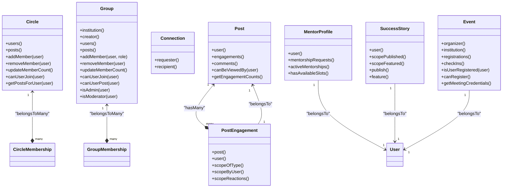
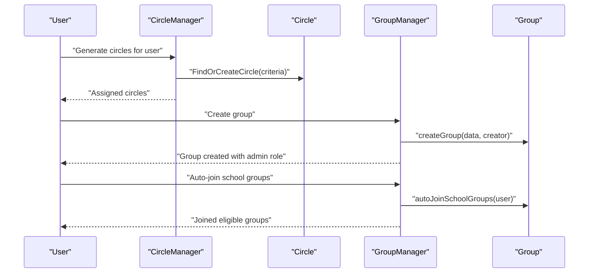
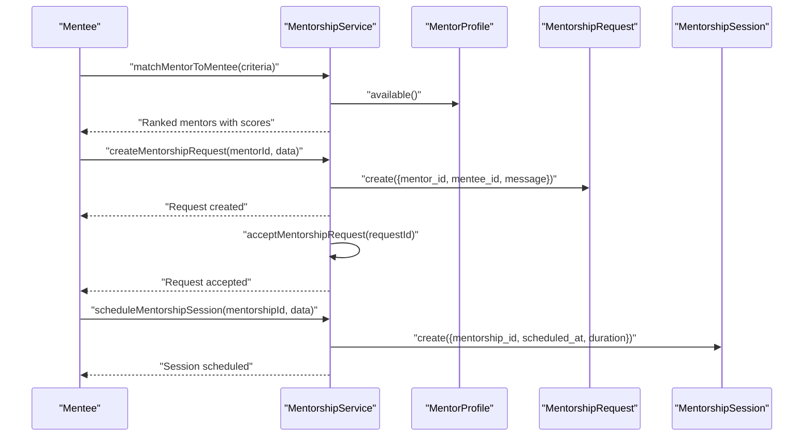
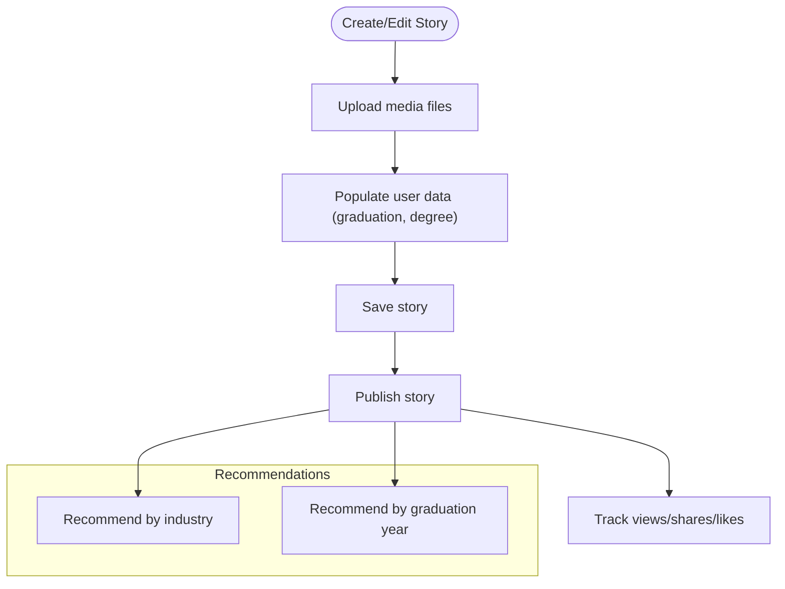
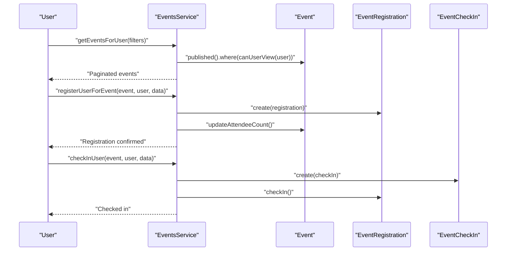
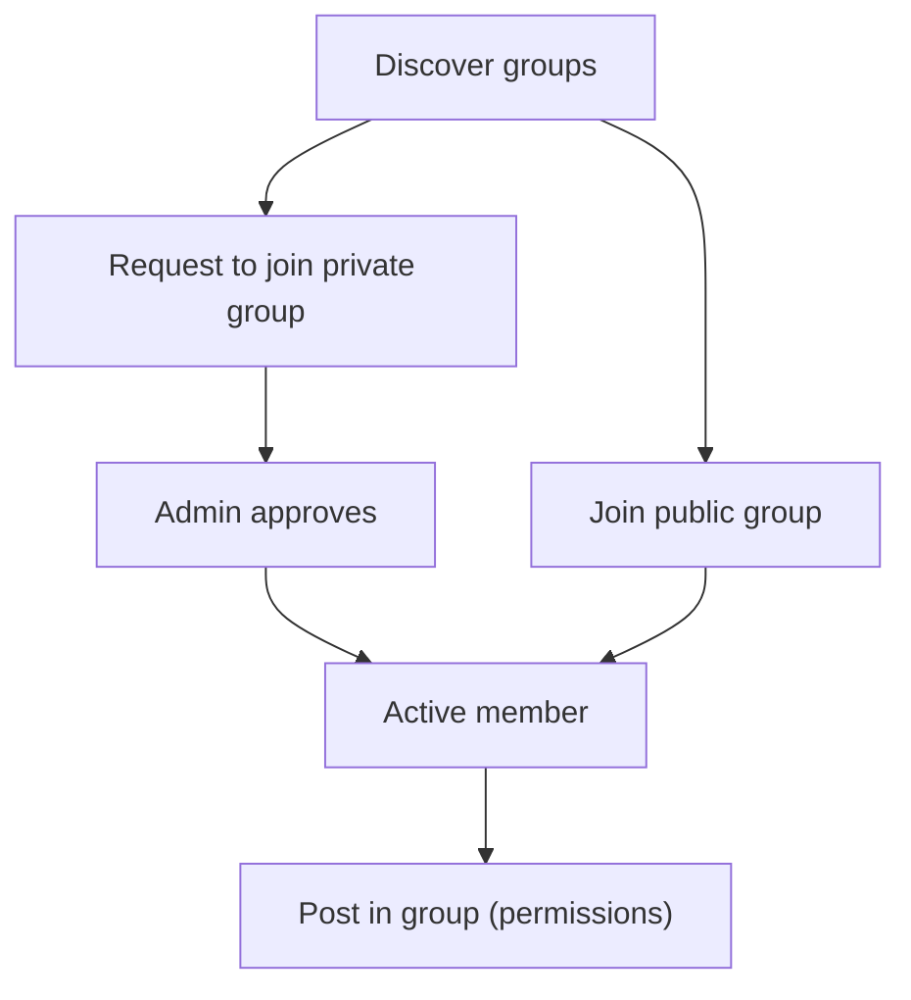
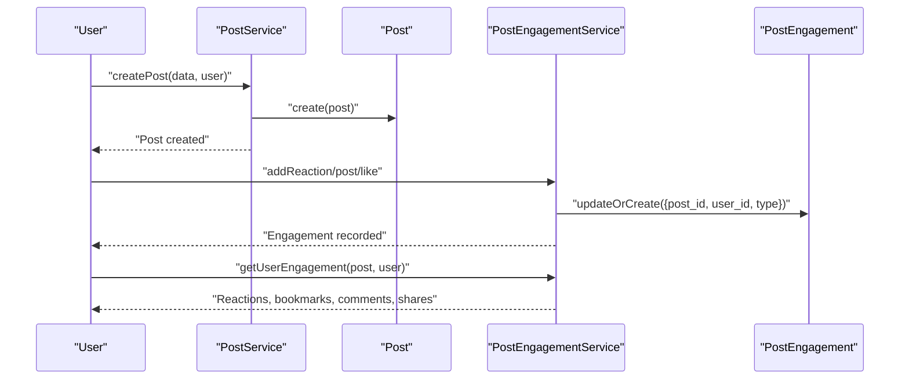
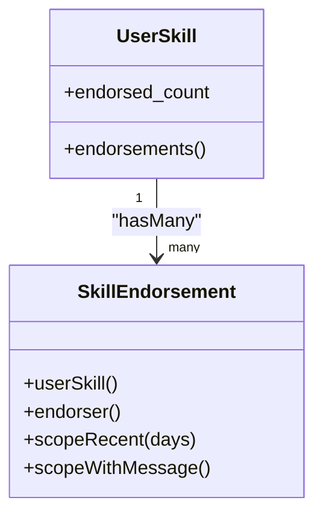
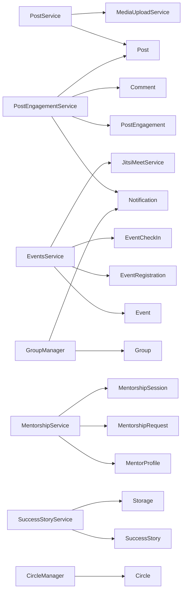

# Social Networking Features

<cite>
**Referenced Files in This Document**
- [Circle.php](file://app/Models/Circle.php)
- [Group.php](file://app/Models/Group.php)
- [Connection.php](file://app/Models/Connection.php)
- [Post.php](file://app/Models/Post.php)
- [PostEngagement.php](file://app/Models/PostEngagement.php)
- [Event.php](file://app/Models/Event.php)
- [SuccessStory.php](file://app/Models/SuccessStory.php)
- [MentorProfile.php](file://app/Models/MentorProfile.php)
- [SkillEndorsement.php](file://app/Models/SkillEndorsement.php)
- [CircleManager.php](file://app/Services/CircleManager.php)
- [GroupManager.php](file://app/Services/GroupManager.php)
- [AlumniRecommendationService.php](file://app/Services/AlumniRecommendationService.php)
- [PostEngagementService.php](file://app/Services/PostEngagementService.php)
- [PostService.php](file://app/Services/PostService.php)
- [EventsService.php](file://app/Services/EventsService.php)
- [SuccessStoryService.php](file://app/Services/SuccessStoryService.php)
- [MentorshipService.php](file://app/Services/MentorshipService.php)
- [circle-and-group-implementation.md](file://docs/circle-and-group-implementation.md)
- [task-20-mighty-networks-circle-features-analysis.md](file://docs/task-20-mighty-networks-circle-features-analysis.md)
- [AlumniNetworkingTest.php](file://tests/Feature/AlumniNetworkingTest.php)
- [SocialTimelineTest.php](file://tests/Feature/SocialTimelineTest.php)
- [SocialTimelineFlowTest.php](file://tests/Feature/SocialTimelineFlowTest.php)
- [UserJourneyTest.php](file://tests/EndToEnd/UserJourneyTest.php)
- [PostEngagementServiceTest.php](file://tests/Unit/PostEngagementServiceTest.php)
- [TimelineServiceTest.php](file://tests/Unit/Services/TimelineServiceTest.php)
- [PostCard.vue](file://resources/js/components/PostCard.vue)
- [apiDocumentation.js](file://resources/js/Data/apiDocumentation.js)
- [completeApiDocumentation.js](file://resources/js/Data/completeApiDocumentation.js)
</cite>

## Table of Contents
1. [Introduction](#introduction)
2. [Project Structure](#project-structure)
3. [Core Components](#core-components)
4. [Architecture Overview](#architecture-overview)
5. [Detailed Component Analysis](#detailed-component-analysis)
6. [Dependency Analysis](#dependency-analysis)
7. [Performance Considerations](#performance-considerations)
8. [Troubleshooting Guide](#troubleshooting-guide)
9. [Conclusion](#conclusion)
10. [Appendices](#appendices)

## Introduction
This document provides comprehensive coverage of the social networking capabilities implemented in the platform. It explains how alumni networks are built through circles and groups, how the mentorship program operates, how success stories are shared, how events are managed, and how content is shared and engaged with. It also documents endorsement systems, professional networking tools, community moderation features, engagement metrics, networking recommendations, and relationship-building tools. The goal is to help both technical and non-technical readers understand the system architecture, workflows, and practical usage patterns.

## Project Structure
The social networking features are implemented across models, services, controllers, jobs, and tests. The key areas include:
- Community foundations: Circle and Group models with managers
- Relationship building: Connections and recommendation services
- Content ecosystem: Posts, engagement tracking, and publishing
- Professional development: Mentorship profiles and matching
- Success storytelling: Story creation, curation, and analytics
- Event orchestration: Event lifecycle, registration, and virtual meetings
- Moderation and governance: Group roles, permissions, and visibility controls

```mermaid
graph TB
subgraph "Community Foundations"
Circle["Circle Model<br/>app/Models/Circle.php"]
Group["Group Model<br/>app/Models/Group.php"]
CircleManager["CircleManager Service<br/>app/Services/CircleManager.php"]
GroupManager["GroupManager Service<br/>app/Services/GroupManager.php"]
end
subgraph "Relationships"
Connection["Connection Model<br/>app/Models/Connection.php"]
Recommendations["AlumniRecommendationService<br/>app/Services/AlumniRecommendationService.php"]
end
subgraph "Content & Engagement"
Post["Post Model<br/>app/Models/Post.php"]
PostEngagement["PostEngagement Model<br/>app/Models/PostEngagement.php"]
PostService["PostService<br/>app/Services/PostService.php"]
PostEngagementService["PostEngagementService<br/>app/Services/PostEngagementService.php"]
PostCard["PostCard Component<br/>resources/js/components/PostCard.vue"]
end
subgraph "Professional Networking"
MentorProfile["MentorProfile Model<br/>app/Models/MentorProfile.php"]
MentorshipService["MentorshipService<br/>app/Services/MentorshipService.php"]
SkillEndorsement["SkillEndorsement Model<br/>app/Models/SkillEndorsement.php"]
end
subgraph "Success Stories"
SuccessStory["SuccessStory Model<br/>app/Models/SuccessStory.php"]
SuccessStoryService["SuccessStoryService<br/>app/Services/SuccessStoryService.php"]
end
subgraph "Events"
Event["Event Model<br/>app/Models/Event.php"]
EventsService["EventsService<br/>app/Services/EventsService.php"]
end
CircleManager --> Circle
GroupManager --> Group
Recommendations --> Connection
PostService --> Post
PostEngagementService --> PostEngagement
PostCard --> Post
MentorshipService --> MentorProfile
SuccessStoryService --> SuccessStory
EventsService --> Event
```

**Diagram sources**
- [Circle.php:1-182](file://app/Models/Circle.php#L1-L182)
- [Group.php:1-290](file://app/Models/Group.php#L1-L290)
- [Connection.php:1-58](file://app/Models/Connection.php#L1-L58)
- [Post.php:1-226](file://app/Models/Post.php#L1-L226)
- [PostEngagement.php:1-65](file://app/Models/PostEngagement.php#L1-L65)
- [PostService.php:1-264](file://app/Services/PostService.php#L1-L264)
- [PostEngagementService.php:1-231](file://app/Services/PostEngagementService.php#L1-L231)
- [PostCard.vue:32-65](file://resources/js/components/PostCard.vue#L32-L65)
- [MentorProfile.php:1-81](file://app/Models/MentorProfile.php#L1-L81)
- [MentorshipService.php:1-308](file://app/Services/MentorshipService.php#L1-L308)
- [SkillEndorsement.php:1-52](file://app/Models/SkillEndorsement.php#L1-L52)
- [SuccessStory.php:1-145](file://app/Models/SuccessStory.php#L1-L145)
- [SuccessStoryService.php:1-218](file://app/Services/SuccessStoryService.php#L1-L218)
- [Event.php:1-633](file://app/Models/Event.php#L1-L633)
- [EventsService.php:1-428](file://app/Services/EventsService.php#L1-L428)

**Section sources**
- [circle-and-group-implementation.md:1-205](file://docs/circle-and-group-implementation.md#L1-L205)

## Core Components
This section outlines the primary building blocks of the social networking system and their responsibilities.

- Circle and Group models define community structures with membership, roles, and visibility rules.
- Post and PostEngagement models manage content creation, visibility targeting, and engagement tracking.
- MentorProfile and MentorshipService power the mentorship program with matching, requests, and analytics.
- SuccessStory and SuccessStoryService enable storytelling with curation, filtering, and analytics.
- Event and EventsService handle event lifecycle, registration, check-in, and virtual meeting integration.
- AlumniRecommendationService and Connection model support relationship building and networking recommendations.
- SkillEndorsement supports professional networking through endorsements.

**Section sources**
- [Circle.php:1-182](file://app/Models/Circle.php#L1-L182)
- [Group.php:1-290](file://app/Models/Group.php#L1-L290)
- [Post.php:1-226](file://app/Models/Post.php#L1-L226)
- [PostEngagement.php:1-65](file://app/Models/PostEngagement.php#L1-L65)
- [MentorProfile.php:1-81](file://app/Models/MentorProfile.php#L1-L81)
- [MentorshipService.php:1-308](file://app/Services/MentorshipService.php#L1-L308)
- [SuccessStory.php:1-145](file://app/Models/SuccessStory.php#L1-L145)
- [SuccessStoryService.php:1-218](file://app/Services/SuccessStoryService.php#L1-L218)
- [Event.php:1-633](file://app/Models/Event.php#L1-L633)
- [EventsService.php:1-428](file://app/Services/EventsService.php#L1-L428)
- [Connection.php:1-58](file://app/Models/Connection.php#L1-L58)
- [AlumniRecommendationService.php:1-433](file://app/Services/AlumniRecommendationService.php#L1-L433)
- [SkillEndorsement.php:1-52](file://app/Models/SkillEndorsement.php#L1-L52)

## Architecture Overview
The social networking system follows a layered architecture:
- Models encapsulate domain logic and relationships.
- Services orchestrate business workflows and coordinate cross-cutting concerns.
- Controllers expose REST endpoints for clients.
- Jobs handle asynchronous tasks (e.g., scheduled posts, circle updates).
- Tests validate behavior across unit, feature, and end-to-end scenarios.

**Diagram sources**
- [Circle.php:1-182](file://app/Models/Circle.php#L1-L182)
- [Group.php:1-290](file://app/Models/Group.php#L1-L290)
- [Connection.php:1-58](file://app/Models/Connection.php#L1-L58)
- [Post.php:1-226](file://app/Models/Post.php#L1-L226)
- [PostEngagement.php:1-65](file://app/Models/PostEngagement.php#L1-L65)
- [MentorProfile.php:1-81](file://app/Models/MentorProfile.php#L1-L81)
- [SuccessStory.php:1-145](file://app/Models/SuccessStory.php#L1-L145)
- [Event.php:1-633](file://app/Models/Event.php#L1-L633)

## Detailed Component Analysis

### Alumni Network Building: Circles and Groups
Circles automatically form around shared educational backgrounds, while Groups represent structured communities with roles and permissions. Membership is governed by privacy and criteria, and both support targeted content visibility.

**Diagram sources**
- [CircleManager.php:1-392](file://app/Services/CircleManager.php#L1-L392)
- [GroupManager.php:1-392](file://app/Services/GroupManager.php#L1-L392)
- [Circle.php:1-182](file://app/Models/Circle.php#L1-L182)
- [Group.php:1-290](file://app/Models/Group.php#L1-L290)

**Section sources**
- [Circle.php:114-166](file://app/Models/Circle.php#L114-L166)
- [Group.php:146-226](file://app/Models/Group.php#L146-L226)
- [circle-and-group-implementation.md:146-173](file://docs/circle-and-group-implementation.md#L146-L173)

### Mentorship Program Structure
The mentorship system includes mentor profiles, matching algorithms, requests, acceptance, session scheduling, and analytics.

**Diagram sources**
- [MentorshipService.php:1-308](file://app/Services/MentorshipService.php#L1-L308)
- [MentorProfile.php:1-81](file://app/Models/MentorProfile.php#L1-L81)

**Section sources**
- [MentorshipService.php:17-50](file://app/Services/MentorshipService.php#L17-L50)
- [MentorshipService.php:162-187](file://app/Services/MentorshipService.php#L162-L187)
- [MentorshipService.php:189-207](file://app/Services/MentorshipService.php#L189-L207)
- [MentorshipService.php:209-229](file://app/Services/MentorshipService.php#L209-L229)
- [MentorshipService.php:231-275](file://app/Services/MentorshipService.php#L231-L275)

### Success Story Sharing Platform
Success stories capture achievements with media, demographics, and analytics. Stories can be filtered, recommended, and curated.

**Diagram sources**
- [SuccessStoryService.php:14-41](file://app/Services/SuccessStoryService.php#L14-L41)
- [SuccessStoryService.php:43-64](file://app/Services/SuccessStoryService.php#L43-L64)
- [SuccessStoryService.php:108-133](file://app/Services/SuccessStoryService.php#L108-L133)
- [SuccessStory.php:106-133](file://app/Models/SuccessStory.php#L106-L133)

**Section sources**
- [SuccessStoryService.php:66-106](file://app/Services/SuccessStoryService.php#L66-L106)
- [SuccessStoryService.php:117-133](file://app/Services/SuccessStoryService.php#L117-L133)
- [SuccessStoryService.php:148-178](file://app/Services/SuccessStoryService.php#L148-L178)
- [SuccessStory.php:62-88](file://app/Models/SuccessStory.php#L62-L88)

### Event Management System
Events support registration, check-in, virtual meeting integration, and analytics. Visibility and permissions are enforced per user role and institution.

**Diagram sources**
- [EventsService.php:22-80](file://app/Services/EventsService.php#L22-L80)
- [EventsService.php:112-145](file://app/Services/EventsService.php#L112-L145)
- [EventsService.php:163-187](file://app/Services/EventsService.php#L163-L187)
- [Event.php:354-375](file://app/Models/Event.php#L354-L375)

**Section sources**
- [EventsService.php:82-110](file://app/Services/EventsService.php#L82-L110)
- [EventsService.php:200-220](file://app/Services/EventsService.php#L200-L220)
- [EventsService.php:222-263](file://app/Services/EventsService.php#L222-L263)
- [Event.php:139-182](file://app/Models/Event.php#L139-L182)
- [Event.php:293-313](file://app/Models/Event.php#L293-L313)

### Interest-Based Communities
Interest-based communities are modeled via Groups with types such as "interest" and "professional". Membership workflows include auto-join for school groups and invitation/join-request processes for other groups.

**Diagram sources**
- [GroupManager.php:147-183](file://app/Services/GroupManager.php#L147-L183)
- [GroupManager.php:188-207](file://app/Services/GroupManager.php#L188-L207)
- [Group.php:176-202](file://app/Models/Group.php#L176-L202)

**Section sources**
- [GroupManager.php:354-390](file://app/Services/GroupManager.php#L354-L390)
- [Group.php:149-171](file://app/Models/Group.php#L149-L171)

### Content Sharing Mechanisms and Engagement
Posts support multiple visibility targets (public, circles, groups), media attachments, and engagement types (like, love, celebrate, comment, share, bookmark). Engagement metrics and user engagement states are tracked and cached.

**Diagram sources**
- [PostService.php:22-62](file://app/Services/PostService.php#L22-L62)
- [PostEngagementService.php:21-42](file://app/Services/PostEngagementService.php#L21-L42)
- [PostEngagementService.php:218-231](file://app/Services/PostEngagementService.php#L218-L231)
- [Post.php:58-78](file://app/Models/Post.php#L58-L78)

**Section sources**
- [PostService.php:206-237](file://app/Services/PostService.php#L206-L237)
- [PostService.php:239-249](file://app/Services/PostService.php#L239-L249)
- [PostEngagementService.php:16-42](file://app/Services/PostEngagementService.php#L16-L42)
- [PostEngagementService.php:203-213](file://app/Services/PostEngagementService.php#L203-L213)
- [PostEngagementService.php:218-231](file://app/Services/PostEngagementService.php#L218-L231)
- [PostEngagement.php:46-65](file://app/Models/PostEngagement.php#L46-L65)

### Endorsement Systems
Professional networking includes skills and endorsements. Endorsements increment counters and can include messages.

**Diagram sources**
- [SkillEndorsement.php:1-52](file://app/Models/SkillEndorsement.php#L1-L52)

**Section sources**
- [SkillEndorsement.php:29-50](file://app/Models/SkillEndorsement.php#L29-L50)

### Community Moderation Features
Groups support role-based moderation (admin, moderator, member) with posting restrictions and member approval workflows.

**Section sources**
- [Group.php:74-87](file://app/Models/Group.php#L74-L87)
- [Group.php:176-202](file://app/Models/Group.php#L176-L202)
- [Group.php:231-256](file://app/Models/Group.php#L231-L256)

### Engagement Metrics
Engagement metrics include counts per type, user-specific engagement states, and timeline scoring. Tests validate metric computation and scoring logic.

**Section sources**
- [PostEngagementService.php:203-213](file://app/Services/PostEngagementService.php#L203-L213)
- [PostEngagementService.php:218-231](file://app/Services/PostEngagementService.php#L218-L231)
- [PostEngagementServiceTest.php:126-201](file://tests/Unit/PostEngagementServiceTest.php#L126-L201)
- [TimelineServiceTest.php:130-168](file://tests/Unit/Services/TimelineServiceTest.php#L130-L168)

### Networking Recommendations
Recommendations combine shared circles, mutual connections, interest similarity, and geographic proximity. Dismissal caching prevents repeated suggestions.

**Section sources**
- [AlumniRecommendationService.php:28-57](file://app/Services/AlumniRecommendationService.php#L28-L57)
- [AlumniRecommendationService.php:62-76](file://app/Services/AlumniRecommendationService.php#L62-L76)
- [AlumniRecommendationService.php:128-155](file://app/Services/AlumniRecommendationService.php#L128-L155)
- [AlumniRecommendationService.php:388-400](file://app/Services/AlumniRecommendationService.php#L388-L400)

### Relationship Building Tools
Connections support friend/request flows with acceptance and visibility controls. Tests demonstrate shared groups/circles exposure and recommendation workflows.

**Section sources**
- [Connection.php:26-56](file://app/Models/Connection.php#L26-L56)
- [AlumniNetworkingTest.php:308-321](file://tests/Feature/AlumniNetworkingTest.php#L308-L321)
- [AlumniNetworkingTest.php:323-338](file://tests/Feature/AlumniNetworkingTest.php#L323-L338)

### Examples of Community Setup and Social Interaction Patterns
- Community setup: Creating circles via education history, auto-joining school groups, and creating custom groups with roles and permissions.
- Social interaction: Posting with visibility targeting, engaging with posts, cross-user commenting/liking, and scheduled posts.

**Section sources**
- [circle-and-group-implementation.md:148-173](file://docs/circle-and-group-implementation.md#L148-L173)
- [UserJourneyTest.php:475-505](file://tests/EndToEnd/UserJourneyTest.php#L475-L505)
- [SocialTimelineFlowTest.php:82-121](file://tests/Feature/SocialTimelineFlowTest.php#L82-L121)

## Dependency Analysis
The following diagram shows key dependencies among components:

**Diagram sources**
- [PostService.php:1-264](file://app/Services/PostService.php#L1-L264)
- [PostEngagementService.php:1-231](file://app/Services/PostEngagementService.php#L1-L231)
- [EventsService.php:1-428](file://app/Services/EventsService.php#L1-L428)
- [MentorshipService.php:1-308](file://app/Services/MentorshipService.php#L1-L308)
- [SuccessStoryService.php:1-218](file://app/Services/SuccessStoryService.php#L1-L218)
- [GroupManager.php:1-392](file://app/Services/GroupManager.php#L1-L392)
- [CircleManager.php:1-392](file://app/Services/CircleManager.php#L1-L392)

**Section sources**
- [PostService.php:15-20](file://app/Services/PostService.php#L15-L20)
- [EventsService.php:15-20](file://app/Services/EventsService.php#L15-L20)

## Performance Considerations
- Caching: Recommendation and engagement stats are cached to reduce recomputation overhead.
- JSON-based targeting: Post visibility uses JSON fields and overlap checks for efficient filtering.
- Asynchronous processing: Scheduled posts and background jobs offload heavy tasks.
- Pagination: Event listings and story feeds use pagination to limit payload sizes.
- Indexing: Consider adding database indexes on frequently queried fields (e.g., visibility, timestamps, foreign keys).

[No sources needed since this section provides general guidance]

## Troubleshooting Guide
Common issues and resolutions:
- Engagement not updating: Verify cache clearing after reactions and ensure correct engagement types are used.
- Post visibility mismatch: Confirm visibility determination logic and user membership in target circles/groups.
- Event registration errors: Check capacity limits, registration deadlines, and waitlist promotion logic.
- Mentorship slot conflicts: Ensure mentor availability and max mentees constraints are respected.
- Group membership permissions: Validate role-based posting and removal rules.

**Section sources**
- [PostEngagementService.php:42-43](file://app/Services/PostEngagementService.php#L42-L43)
- [PostService.php:206-237](file://app/Services/PostService.php#L206-L237)
- [EventsService.php:119-127](file://app/Services/EventsService.php#L119-L127)
- [MentorshipService.php:193-197](file://app/Services/MentorshipService.php#L193-L197)
- [Group.php:176-202](file://app/Models/Group.php#L176-L202)

## Conclusion
The platform provides a robust foundation for social networking with automatic community formation (circles), structured communities (groups), content sharing with engagement metrics, mentorship matching and management, success story curation, comprehensive event management, and professional networking through endorsements. The architecture balances modularity, scalability, and maintainability, with clear separation of concerns across models, services, and tests.

[No sources needed since this section summarizes without analyzing specific files]

## Appendices

### API Endpoints Overview
- Mentors: GET mentors with filtering and response examples.
- Events: GET events with filtering options (type, location, date range, status).

**Section sources**
- [apiDocumentation.js:342-371](file://resources/js/Data/apiDocumentation.js#L342-L371)
- [completeApiDocumentation.js:340-380](file://resources/js/Data/completeApiDocumentation.js#L340-L380)

### Frontend Integration Notes
- Post interactions (like, comment, share) are handled via component events and service calls.

**Section sources**
- [PostCard.vue:32-65](file://resources/js/components/PostCard.vue#L32-L65)