# Student Services

<cite>
**Referenced Files in This Document**
- [CareerTimelineService.php](file://app/Services/CareerTimelineService.php)
- [MentorshipService.php](file://app/Services/MentorshipService.php)
- [UserTrainingService.php](file://app/Services/UserTrainingService.php)
- [CareerTimelineController.php](file://app/Http/Controllers/Api/CareerTimelineController.php)
- [CareerController.php](file://app/Http/Controllers/CareerController.php)
- [StudentController.php](file://app/Http/Controllers/StudentController.php)
- [SuccessStory.php](file://app/Models/SuccessStory.php)
- [LearningResource.php](file://app/Models/LearningResource.php)
- [LearningResourceFactory.php](file://database/factories/LearningResourceFactory.php)
- [2025_01_31_000004_create_learning_resources_table.php](file://database/migrations/2025_01_31_000004_create_learning_resources_table.php)
- [CareerGuidance.vue](file://resources/js/Pages/Students/CareerGuidance.vue)
- [MentorCard.vue](file://resources/js/components/MentorCard.vue)
- [LearningResources.vue](file://resources/js/components/LearningResources.vue)
- [navigation.ts](file://resources/js/Lib/navigation.ts)
- [ProfileCompletionPrompt.vue](file://resources/js/components/onboarding/ProfileCompletionPrompt.vue)
- [RegionalInsights.vue](file://resources/js/components/RegionalInsights.vue)
- [HomepageService.php](file://app/Services/HomepageService.php)
- [README.md](file://README.md)
- [requirements.md](file://.kiro/specs/modern-alumni-platform/requirements.md)
- [task-11-search-matching-system-recap.md](file://docs/task-11-search-matching-system-recap.md)
- [graduate-user-manual.md](file://docs/user-guides/graduate/graduate-user-manual.md)
- [AlumniWorkflowTest.php](file://tests/UserAcceptance/AlumniWorkflowTest.php)
- [SkillsTest.php](file://tests/Feature/SkillsTest.php)
- [SuccessStories.test.ts](file://tests/Js/Components/Homepage/SuccessStories.test.ts)
- [CompleteUserJourneyTest.php](file://tests/EndToEnd/CompleteUserJourneyTest.php)
</cite>

## Table of Contents
1. [Introduction](#introduction)
2. [Project Structure](#project-structure)
3. [Core Components](#core-components)
4. [Architecture Overview](#architecture-overview)
5. [Detailed Component Analysis](#detailed-component-analysis)
6. [Dependency Analysis](#dependency-analysis)
7. [Performance Considerations](#performance-considerations)
8. [Troubleshooting Guide](#troubleshooting-guide)
9. [Conclusion](#conclusion)
10. [Appendices](#appendices)

## Introduction
This document describes the student services platform with a focus on career guidance, mentorship, opportunities, skill development, alumni inspiration, networking events, career resources, and academic pathways. It explains onboarding workflows, mentor matching algorithms, opportunity discovery, and career development tracking. It also provides examples of student dashboards, mentorship workflows, and career planning tools.

## Project Structure
The platform is a Laravel-based backend with a Vue.js frontend. Key areas relevant to student services include:
- Backend services for career timelines, mentorship, training, and learning resources
- Frontend pages and components for career guidance, mentorship discovery, and learning resource curation
- Models for success stories and learning resources
- Tests and documentation supporting user workflows and feature capabilities

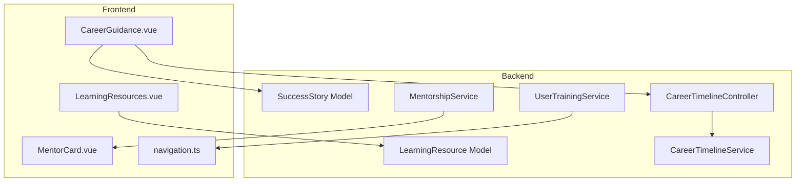

**Diagram sources**
- [CareerTimelineController.php:1-34](file://app/Http/Controllers/Api/CareerTimelineController.php#L1-L34)
- [CareerTimelineService.php:1-363](file://app/Services/CareerTimelineService.php#L1-L363)
- [MentorshipService.php:1-308](file://app/Services/MentorshipService.php#L1-L308)
- [UserTrainingService.php:1-945](file://app/Services/UserTrainingService.php#L1-L945)
- [SuccessStory.php:1-145](file://app/Models/SuccessStory.php#L1-L145)
- [LearningResource.php:1-77](file://app/Models/LearningResource.php#L1-L77)
- [CareerGuidance.vue:1-28](file://resources/js/Pages/Students/CareerGuidance.vue#L1-L28)
- [MentorCard.vue:75-90](file://resources/js/components/MentorCard.vue#L75-L90)
- [LearningResources.vue:1-307](file://resources/js/components/LearningResources.vue#L1-L307)
- [navigation.ts:11-20](file://resources/js/Lib/navigation.ts#L11-L20)

**Section sources**
- [CareerTimelineService.php:1-363](file://app/Services/CareerTimelineService.php#L1-L363)
- [MentorshipService.php:1-308](file://app/Services/MentorshipService.php#L1-L308)
- [UserTrainingService.php:1-945](file://app/Services/UserTrainingService.php#L1-L945)
- [CareerTimelineController.php:1-34](file://app/Http/Controllers/Api/CareerTimelineController.php#L1-L34)
- [CareerGuidance.vue:1-28](file://resources/js/Pages/Students/CareerGuidance.vue#L1-L28)
- [MentorCard.vue:75-90](file://resources/js/components/MentorCard.vue#L75-L90)
- [LearningResources.vue:1-307](file://resources/js/components/LearningResources.vue#L1-L307)
- [navigation.ts:11-20](file://resources/js/Lib/navigation.ts#L11-L20)

## Core Components
- Career Timeline Service: Builds timelines, milestones, progression metrics, and goal suggestions for career development.
- Mentorship Service: Matches mentees to mentors using weighted scoring across industry alignment, career stage compatibility, location, and availability.
- User Training Service: Provides onboarding sequences, guides, tutorials, and training progress tracking for different user roles.
- Learning Resources: Curates and filters learning materials by type and skills, supports ratings and popularity.
- Success Stories: Enables inspirational alumni stories with filtering and publishing workflows.
- Frontend Career Guidance: Provides a landing experience for career assessments and personalized guidance.
- Navigation: Exposes menu items for career-related features such as Career Timeline, Mentorship Hub, and Events.

**Section sources**
- [CareerTimelineService.php:11-363](file://app/Services/CareerTimelineService.php#L11-L363)
- [MentorshipService.php:15-308](file://app/Services/MentorshipService.php#L15-L308)
- [UserTrainingService.php:72-945](file://app/Services/UserTrainingService.php#L72-L945)
- [LearningResource.php:1-77](file://app/Models/LearningResource.php#L1-L77)
- [SuccessStory.php:1-145](file://app/Models/SuccessStory.php#L1-L145)
- [CareerGuidance.vue:1-28](file://resources/js/Pages/Students/CareerGuidance.vue#L1-L28)
- [navigation.ts:11-20](file://resources/js/Lib/navigation.ts#L11-L20)

## Architecture Overview
The system integrates backend services with frontend pages and components. Career guidance and timeline features are exposed via API controllers backed by service layers. Mentorship workflows are handled by dedicated services with notifications and analytics. Learning resources and success stories are modeled and filtered for discovery.

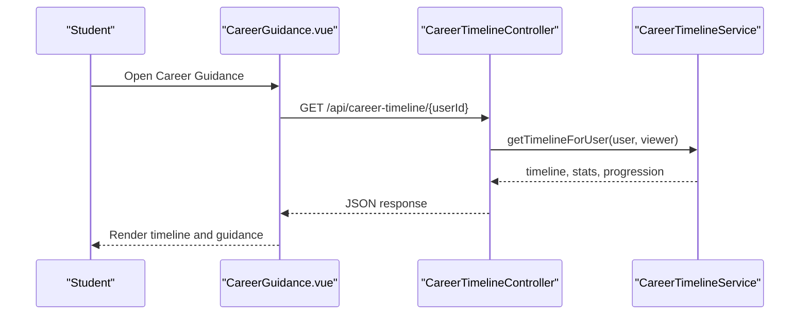

**Diagram sources**
- [CareerGuidance.vue:1-28](file://resources/js/Pages/Students/CareerGuidance.vue#L1-L28)
- [CareerTimelineController.php:14-34](file://app/Http/Controllers/Api/CareerTimelineController.php#L14-L34)
- [CareerTimelineService.php:16-40](file://app/Services/CareerTimelineService.php#L16-L40)

**Section sources**
- [CareerTimelineController.php:1-34](file://app/Http/Controllers/Api/CareerTimelineController.php#L1-L34)
- [CareerTimelineService.php:11-40](file://app/Services/CareerTimelineService.php#L11-L40)

## Detailed Component Analysis

### Career Timeline and Development Tracking
- Timeline assembly combines career entries and milestones, sorted chronologically.
- Progression metrics include total experience, companies count, promotions, average tenure, and industries.
- Goal suggestions are generated based on experience and current position tenure.
- Auto-milestone detection creates promotion or job-change milestones upon new career entry.

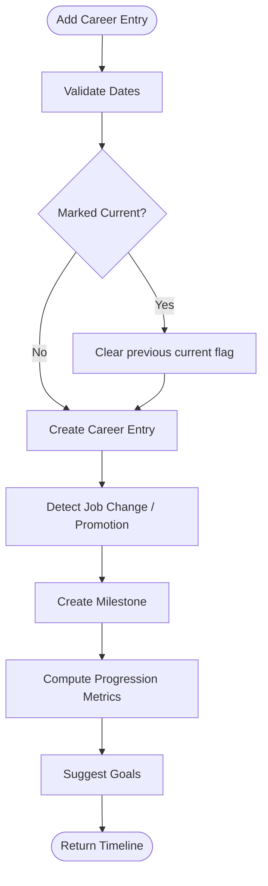

**Diagram sources**
- [CareerTimelineService.php:45-120](file://app/Services/CareerTimelineService.php#L45-L120)
- [CareerTimelineService.php:239-273](file://app/Services/CareerTimelineService.php#L239-L273)
- [CareerTimelineService.php:125-157](file://app/Services/CareerTimelineService.php#L125-L157)
- [CareerTimelineService.php:162-214](file://app/Services/CareerTimelineService.php#L162-L214)
- [CareerTimelineService.php:337-361](file://app/Services/CareerTimelineService.php#L337-L361)

**Section sources**
- [CareerTimelineService.php:11-363](file://app/Services/CareerTimelineService.php#L11-L363)
- [CareerTimelineController.php:14-34](file://app/Http/Controllers/Api/CareerTimelineController.php#L14-L34)

### Mentorship Matching and Workflow
- Matching algorithm computes a composite score from:
  - Industry/role alignment (40%)
  - Career stage compatibility (30%)
  - Geographic proximity (15%)
  - Availability match (15%)
- Requests and sessions are managed with notifications and analytics.

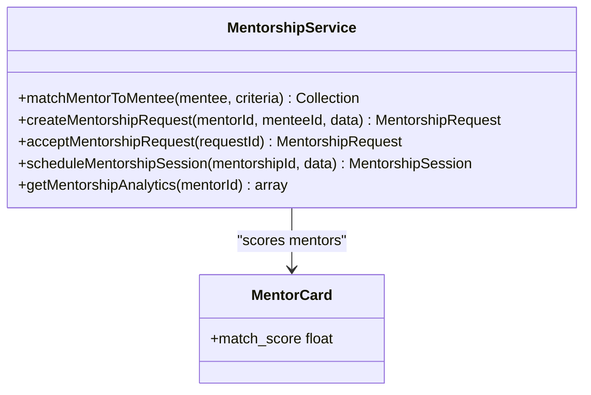

**Diagram sources**
- [MentorshipService.php:17-50](file://app/Services/MentorshipService.php#L17-L50)
- [MentorshipService.php:52-160](file://app/Services/MentorshipService.php#L52-L160)
- [MentorCard.vue:75-90](file://resources/js/components/MentorCard.vue#L75-L90)

**Section sources**
- [MentorshipService.php:15-308](file://app/Services/MentorshipService.php#L15-L308)
- [MentorCard.vue:75-90](file://resources/js/components/MentorCard.vue#L75-L90)

### Student Onboarding and Training
- Role-specific onboarding sequences with guided steps, interactive forms, and tips.
- Training progress tracks completion percentage, current step, and recommended actions.
- Guides and video tutorials categorized by role and topic.

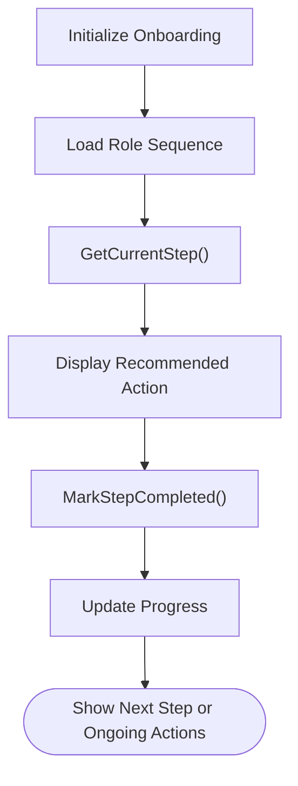

**Diagram sources**
- [UserTrainingService.php:72-138](file://app/Services/UserTrainingService.php#L72-L138)
- [UserTrainingService.php:505-600](file://app/Services/UserTrainingService.php#L505-L600)
- [AlumniWorkflowTest.php:44-74](file://tests/UserAcceptance/AlumniWorkflowTest.php#L44-L74)

**Section sources**
- [UserTrainingService.php:72-138](file://app/Services/UserTrainingService.php#L72-L138)
- [AlumniWorkflowTest.php:44-74](file://tests/UserAcceptance/AlumniWorkflowTest.php#L44-L74)

### Learning Resources Discovery
- Learning resources are stored with type, skill associations, rating, and rating count.
- Filtering by type and skill, popularity ranking, and high-rated selection.
- Frontend component supports adding, rating, and browsing resources.

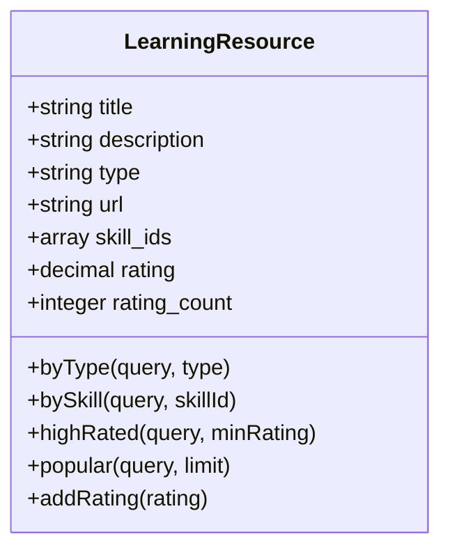

**Diagram sources**
- [LearningResource.php:1-77](file://app/Models/LearningResource.php#L1-L77)
- [2025_01_31_000004_create_learning_resources_table.php:11-25](file://database/migrations/2025_01_31_000004_create_learning_resources_table.php#L11-L25)
- [LearningResources.vue:1-307](file://resources/js/components/LearningResources.vue#L1-L307)

**Section sources**
- [LearningResource.php:1-77](file://app/Models/LearningResource.php#L1-L77)
- [LearningResources.vue:1-307](file://resources/js/components/LearningResources.vue#L1-L307)
- [SkillsTest.php:172-215](file://tests/Feature/SkillsTest.php#L172-L215)

### Success Stories and Inspiration
- Success stories include metadata for industry, achievement type, demographics, and engagement counters.
- Publishing and featuring workflows, along with social sharing support.

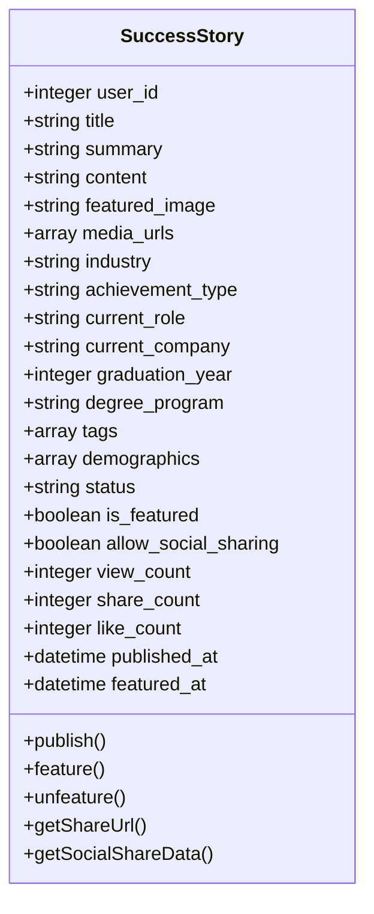

**Diagram sources**
- [SuccessStory.php:1-145](file://app/Models/SuccessStory.php#L1-L145)

**Section sources**
- [SuccessStory.php:1-145](file://app/Models/SuccessStory.php#L1-L145)
- [SuccessStories.test.ts:9-52](file://tests/Js/Components/Homepage/SuccessStories.test.ts#L9-L52)

### Networking Events and Regional Insights
- Events are promoted with personalized recommendations and networking tools.
- Regional insights surface networking opportunities such as meetups, industry groups, and mentorship programs.

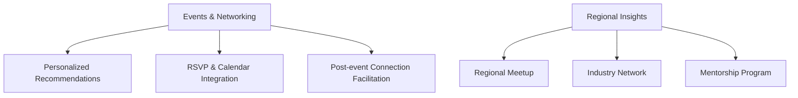

**Diagram sources**
- [HomepageService.php:295-325](file://app/Services/HomepageService.php#L295-L325)
- [RegionalInsights.vue:142-183](file://resources/js/components/RegionalInsights.vue#L142-L183)

**Section sources**
- [HomepageService.php:295-325](file://app/Services/HomepageService.php#L295-L325)
- [RegionalInsights.vue:142-183](file://resources/js/components/RegionalInsights.vue#L142-L183)

### Opportunity Discovery and Career Resources
- Intelligent search and discovery features enable job recommendations and content relevance.
- Career resources include resume builders, interview simulators, salary calculators, and networking trackers.

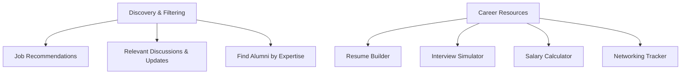

**Diagram sources**
- [requirements.md:126-150](file://.kiro/specs/modern-alumni-platform/requirements.md#L126-L150)
- [task-11-search-matching-system-recap.md:43-71](file://docs/task-11-search-matching-system-recap.md#L43-L71)
- [CareerController.php:297-337](file://app/Http/Controllers/CareerController.php#L297-L337)
- [StudentController.php:276-314](file://app/Http/Controllers/StudentController.php#L276-L314)

**Section sources**
- [requirements.md:126-150](file://.kiro/specs/modern-alumni-platform/requirements.md#L126-L150)
- [task-11-search-matching-system-recap.md:43-71](file://docs/task-11-search-matching-system-recap.md#L43-L71)
- [CareerController.php:297-337](file://app/Http/Controllers/CareerController.php#L297-L337)
- [StudentController.php:276-314](file://app/Http/Controllers/StudentController.php#L276-L314)

### Student Dashboards and Navigation
- Navigation exposes career-centric menus such as Career Timeline, Mentorship Hub, Events, and Scholarships.
- Career Guidance page provides a banner prompting career assessment and links to assessment flow.

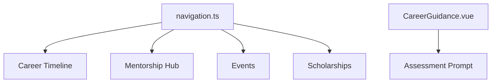

**Diagram sources**
- [navigation.ts:11-20](file://resources/js/Lib/navigation.ts#L11-L20)
- [CareerGuidance.vue:14-28](file://resources/js/Pages/Students/CareerGuidance.vue#L14-L28)

**Section sources**
- [navigation.ts:11-20](file://resources/js/Lib/navigation.ts#L11-L20)
- [CareerGuidance.vue:1-28](file://resources/js/Pages/Students/CareerGuidance.vue#L1-L28)

## Dependency Analysis
- CareerTimelineController depends on CareerTimelineService for timeline composition and analytics.
- MentorshipService encapsulates matching, requests, sessions, and analytics.
- UserTrainingService orchestrates onboarding, guides, and training progress.
- LearningResources.vue interacts with LearningResource model and backend APIs.
- SuccessStory model supports publishing and sharing workflows.

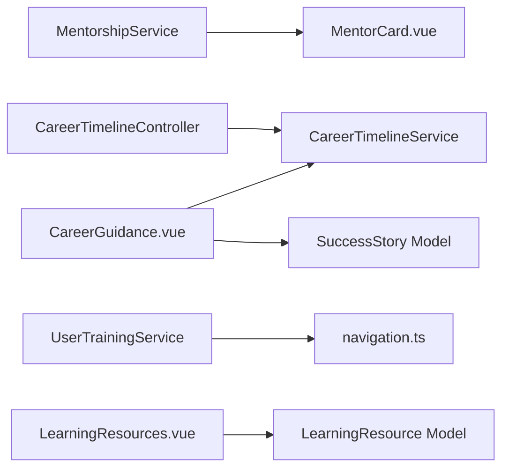

**Diagram sources**
- [CareerTimelineController.php:14-34](file://app/Http/Controllers/Api/CareerTimelineController.php#L14-L34)
- [CareerTimelineService.php:11-40](file://app/Services/CareerTimelineService.php#L11-L40)
- [MentorshipService.php:15-50](file://app/Services/MentorshipService.php#L15-L50)
- [MentorCard.vue:75-90](file://resources/js/components/MentorCard.vue#L75-L90)
- [UserTrainingService.php:72-138](file://app/Services/UserTrainingService.php#L72-L138)
- [navigation.ts:11-20](file://resources/js/Lib/navigation.ts#L11-L20)
- [LearningResources.vue:1-307](file://resources/js/components/LearningResources.vue#L1-L307)
- [LearningResource.php:1-77](file://app/Models/LearningResource.php#L1-L77)
- [CareerGuidance.vue:1-28](file://resources/js/Pages/Students/CareerGuidance.vue#L1-L28)
- [SuccessStory.php:1-145](file://app/Models/SuccessStory.php#L1-L145)

**Section sources**
- [CareerTimelineController.php:1-34](file://app/Http/Controllers/Api/CareerTimelineController.php#L1-L34)
- [CareerTimelineService.php:11-40](file://app/Services/CareerTimelineService.php#L11-L40)
- [MentorshipService.php:15-50](file://app/Services/MentorshipService.php#L15-L50)
- [UserTrainingService.php:72-138](file://app/Services/UserTrainingService.php#L72-L138)
- [LearningResources.vue:1-307](file://resources/js/components/LearningResources.vue#L1-L307)
- [LearningResource.php:1-77](file://app/Models/LearningResource.php#L1-L77)
- [CareerGuidance.vue:1-28](file://resources/js/Pages/Students/CareerGuidance.vue#L1-L28)
- [SuccessStory.php:1-145](file://app/Models/SuccessStory.php#L1-L145)

## Performance Considerations
- Use of scopes and indexed columns for learning resources improves filtering performance.
- Caching role-specific user guides and onboarding sequences reduces repeated computation.
- Asynchronous processing for analytics and notifications prevents blocking user actions.

## Troubleshooting Guide
- Career Timeline Validation: Ensure start dates are not in the future and end dates are not before start dates.
- Mentorship Availability: Confirm mentor slots are available before accepting requests.
- Learning Resource Ratings: Validate rating updates and counts to prevent inconsistencies.
- Onboarding Progress: Verify step completion timestamps and recommendations are updated.

**Section sources**
- [CareerTimelineService.php:278-293](file://app/Services/CareerTimelineService.php#L278-L293)
- [MentorshipService.php:193-197](file://app/Services/MentorshipService.php#L193-L197)
- [LearningResource.php:69-75](file://app/Models/LearningResource.php#L69-L75)
- [UserTrainingService.php:143-154](file://app/Services/UserTrainingService.php#L143-L154)

## Conclusion
The platform provides a robust foundation for student services through integrated career guidance, mentorship matching, learning resources, success stories, and networking events. The backend services and frontend components work together to deliver personalized experiences, track development, and facilitate meaningful connections.

## Appendices
- Additional feature highlights and user manual references are available in the project documentation and tests.

**Section sources**
- [README.md:101-126](file://README.md#L101-L126)
- [graduate-user-manual.md:203-231](file://docs/user-guides/graduate/graduate-user-manual.md#L203-L231)
- [CompleteUserJourneyTest.php:324-360](file://tests/EndToEnd/CompleteUserJourneyTest.php#L324-L360)