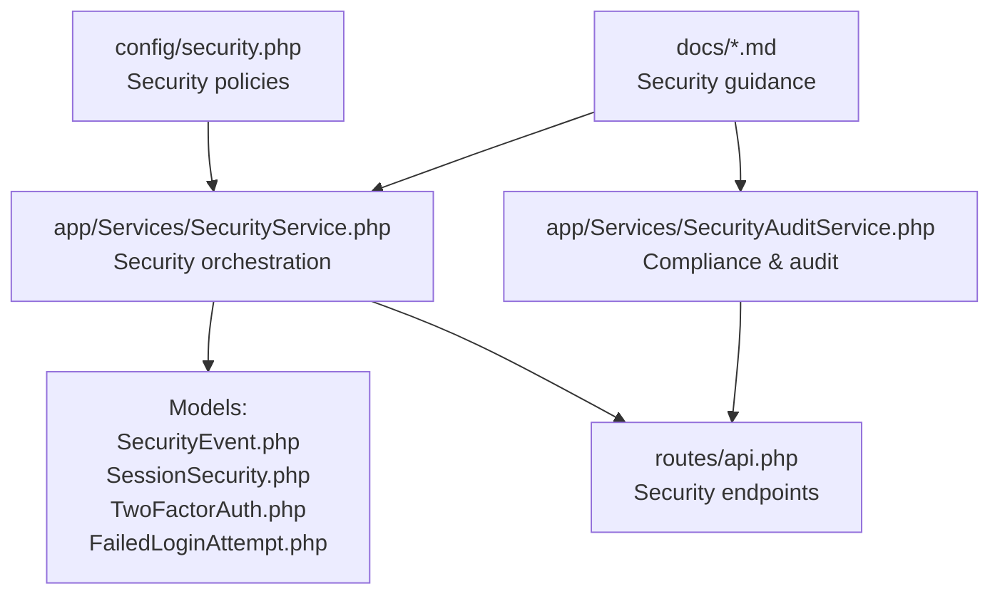
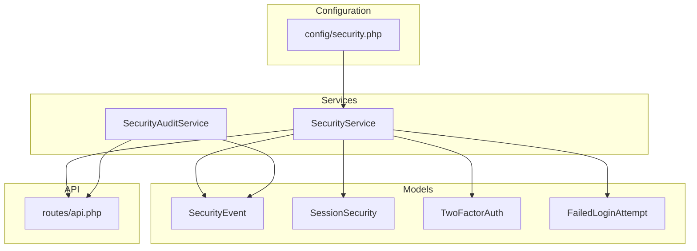
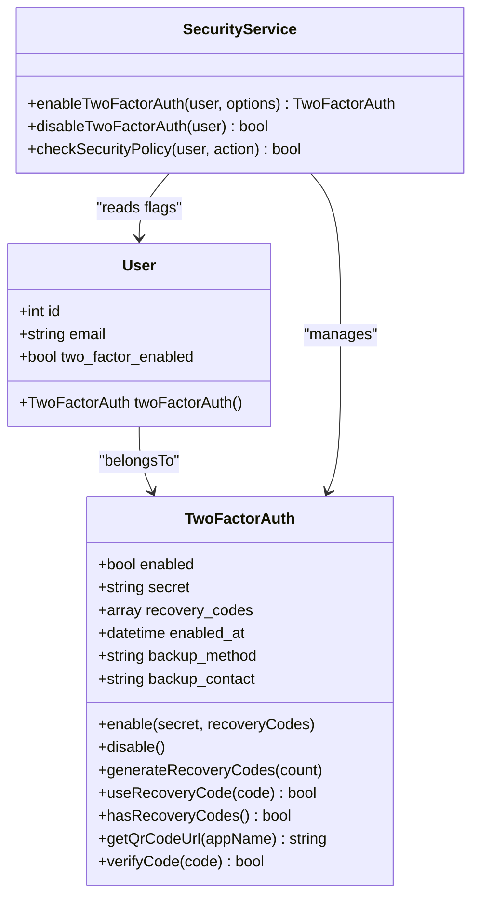
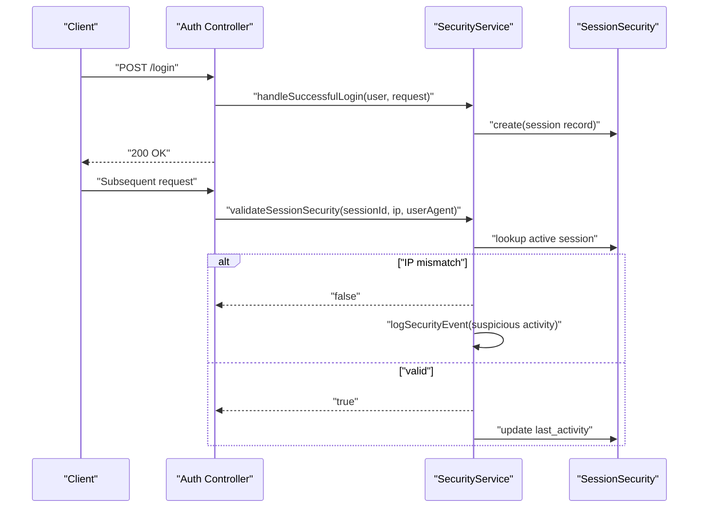
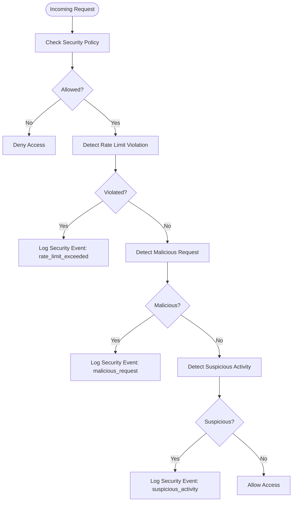
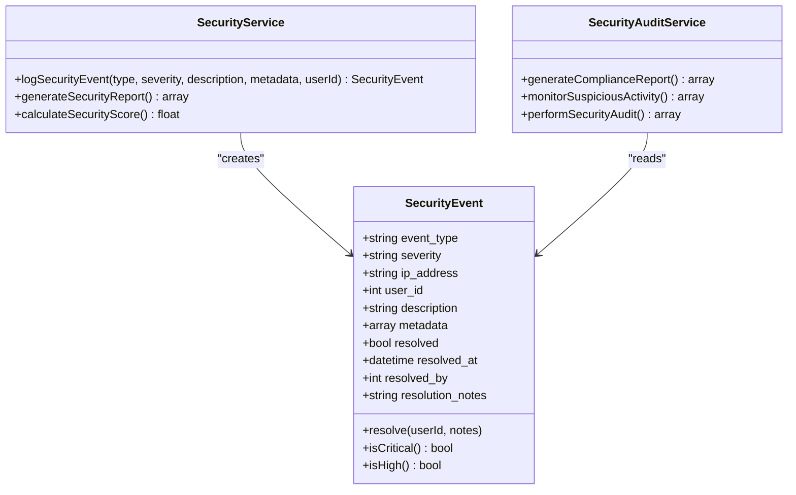
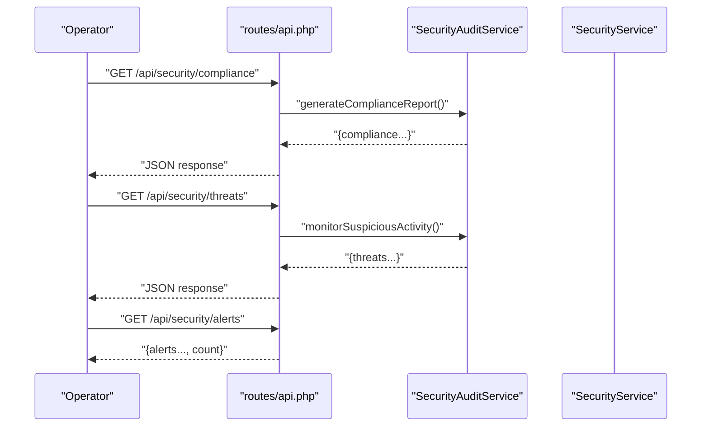
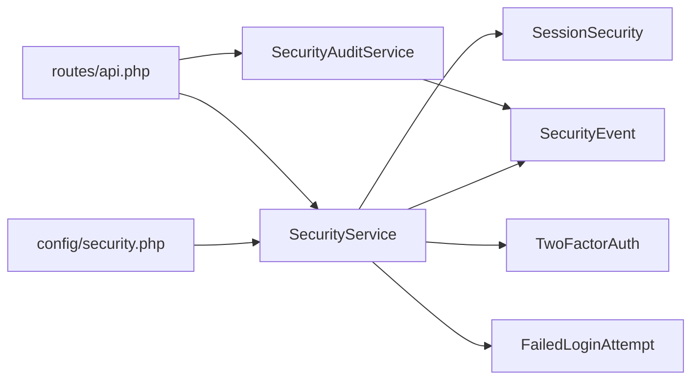

# Account Security & Compliance

<cite>
**Referenced Files in This Document**
- [config/security.php](file://config/security.php)
- [app/Services/SecurityService.php](file://app/Services/SecurityService.php)
- [app/Services/SecurityAuditService.php](file://app/Services/SecurityAuditService.php)
- [app/Models/SecurityEvent.php](file://app/Models/SecurityEvent.php)
- [app/Models/SessionSecurity.php](file://app/Models/SessionSecurity.php)
- [app/Models/TwoFactorAuth.php](file://app/Models/TwoFactorAuth.php)
- [app/Models/FailedLoginAttempt.php](file://app/Models/FailedLoginAttempt.php)
- [routes/api.php](file://routes/api.php)
- [docs/security-audit-implementation.md](file://docs/security-audit-implementation.md)
- [docs/task-12-security-audit-system-recap.md](file://docs/task-12-security-audit-system-recap.md)
</cite>

## Table of Contents
1. [Introduction](#introduction)
2. [Project Structure](#project-structure)
3. [Core Components](#core-components)
4. [Architecture Overview](#architecture-overview)
5. [Detailed Component Analysis](#detailed-component-analysis)
6. [Dependency Analysis](#dependency-analysis)
7. [Performance Considerations](#performance-considerations)
8. [Troubleshooting Guide](#troubleshooting-guide)
9. [Conclusion](#conclusion)
10. [Appendices](#appendices)

## Introduction
This document describes the account security system, covering two-factor authentication, session security monitoring, threat detection, and compliance features. It documents the security middleware implementation, session hijacking prevention, IP address tracking, and device fingerprinting. It also explains security event logging, audit trails, and compliance reporting capabilities, including examples of security policy enforcement, suspicious activity detection, and automated security responses. Data encryption, secure password handling, session management, and security headers configuration are addressed along with integration points for security monitoring tools and incident response procedures.

## Project Structure
The security system spans configuration, services, models, and routes:
- Configuration defines global security policies (login limits, rate limits, session timeouts, 2FA roles, monitoring toggles).
- Services encapsulate security logic: 2FA lifecycle, brute-force protection, session validation, malicious request detection, and reporting.
- Models persist security-relevant state: security events, session security records, failed login attempts, and 2FA credentials.
- Routes expose endpoints for compliance reporting, threat monitoring, and alert status.

**Diagram sources**
- [config/security.php:1-76](file://config/security.php#L1-L76)
- [app/Services/SecurityService.php:1-526](file://app/Services/SecurityService.php#L1-L526)
- [app/Models/SecurityEvent.php:1-114](file://app/Models/SecurityEvent.php#L1-L114)
- [app/Models/SessionSecurity.php:1-62](file://app/Models/SessionSecurity.php#L1-L62)
- [app/Models/TwoFactorAuth.php:1-164](file://app/Models/TwoFactorAuth.php#L1-L164)
- [app/Models/FailedLoginAttempt.php:1-110](file://app/Models/FailedLoginAttempt.php#L1-L110)
- [routes/api.php:1304-1335](file://routes/api.php#L1304-L1335)
- [docs/security-audit-implementation.md:155-203](file://docs/security-audit-implementation.md#L155-L203)
- [docs/task-12-security-audit-system-recap.md:359-427](file://docs/task-12-security-audit-system-recap.md#L359-L427)

**Section sources**
- [config/security.php:1-76](file://config/security.php#L1-L76)
- [app/Services/SecurityService.php:1-526](file://app/Services/SecurityService.php#L1-L526)
- [app/Models/SecurityEvent.php:1-114](file://app/Models/SecurityEvent.php#L1-L114)
- [app/Models/SessionSecurity.php:1-62](file://app/Models/SessionSecurity.php#L1-L62)
- [app/Models/TwoFactorAuth.php:1-164](file://app/Models/TwoFactorAuth.php#L1-L164)
- [app/Models/FailedLoginAttempt.php:1-110](file://app/Models/FailedLoginAttempt.php#L1-L110)
- [routes/api.php:1304-1335](file://routes/api.php#L1304-L1335)
- [docs/security-audit-implementation.md:155-203](file://docs/security-audit-implementation.md#L155-L203)
- [docs/task-12-security-audit-system-recap.md:359-427](file://docs/task-12-security-audit-system-recap.md#L359-L427)

## Core Components
- Security configuration: centralizes login attempt thresholds, lockout duration, rate limits, session timeout, 2FA role requirements, backup retention, and monitoring toggles.
- Security service: orchestrates 2FA enable/disable, failed/successful login handling, malicious request detection, session validation, rate-limit checks, security event logging, suspicious activity detection, and reporting.
- Security audit service: performs audits, generates compliance reports, monitors suspicious activity, validates data transfers, and calculates integrity checksums.
- Models: persist security events, session security metadata, failed login attempts, and encrypted 2FA secrets and recovery codes.
- Routes: expose compliance, threat, and alert endpoints backed by security services.

**Section sources**
- [config/security.php:1-76](file://config/security.php#L1-L76)
- [app/Services/SecurityService.php:19-526](file://app/Services/SecurityService.php#L19-L526)
- [app/Services/SecurityAuditService.php:1-347](file://app/Services/SecurityAuditService.php#L1-L347)
- [app/Models/SecurityEvent.php:8-114](file://app/Models/SecurityEvent.php#L8-L114)
- [app/Models/SessionSecurity.php:8-62](file://app/Models/SessionSecurity.php#L8-L62)
- [app/Models/TwoFactorAuth.php:9-164](file://app/Models/TwoFactorAuth.php#L9-L164)
- [app/Models/FailedLoginAttempt.php:8-110](file://app/Models/FailedLoginAttempt.php#L8-L110)
- [routes/api.php:1304-1335](file://routes/api.php#L1304-L1335)

## Architecture Overview
The security system integrates configuration-driven policies with service-layer logic and persistent models. Security events are logged centrally and surfaced via API endpoints for compliance and threat monitoring.

**Diagram sources**
- [config/security.php:1-76](file://config/security.php#L1-L76)
- [app/Services/SecurityService.php:19-526](file://app/Services/SecurityService.php#L19-L526)
- [app/Services/SecurityAuditService.php:1-347](file://app/Services/SecurityAuditService.php#L1-L347)
- [app/Models/SecurityEvent.php:8-114](file://app/Models/SecurityEvent.php#L8-L114)
- [app/Models/SessionSecurity.php:8-62](file://app/Models/SessionSecurity.php#L8-L62)
- [app/Models/TwoFactorAuth.php:9-164](file://app/Models/TwoFactorAuth.php#L9-L164)
- [app/Models/FailedLoginAttempt.php:8-110](file://app/Models/FailedLoginAttempt.php#L8-L110)
- [routes/api.php:1304-1335](file://routes/api.php#L1304-L1335)

## Detailed Component Analysis

### Two-Factor Authentication (2FA)
- Lifecycle: enable 2FA with secret generation and recovery codes; disable 2FA; QR code provisioning URL; recovery code usage.
- Encryption: secrets and recovery codes are stored encrypted and decrypted transparently via model accessors/mutators.
- Policy enforcement: 2FA requirement applies to selected roles; policy checks enforce 2FA for sensitive operations.

**Diagram sources**
- [app/Models/TwoFactorAuth.php:9-164](file://app/Models/TwoFactorAuth.php#L9-L164)
- [app/Models/User.php:13-818](file://app/Models/User.php#L13-L818)
- [app/Services/SecurityService.php:29-95](file://app/Services/SecurityService.php#L29-L95)

**Section sources**
- [app/Models/TwoFactorAuth.php:9-164](file://app/Models/TwoFactorAuth.php#L9-L164)
- [app/Services/SecurityService.php:29-95](file://app/Services/SecurityService.php#L29-L95)

### Session Security Monitoring and Hijacking Prevention
- Session tracking: records session ID, user ID, IP, user agent, last activity, expiration, and suspicious flags.
- Validation: ensures IP consistency and updates last activity; logs suspicious mismatches.
- Cleanup: removes expired sessions periodically and logs cleanup events.

**Diagram sources**
- [app/Services/SecurityService.php:177-197](file://app/Services/SecurityService.php#L177-L197)
- [app/Services/SecurityService.php:324-354](file://app/Services/SecurityService.php#L324-L354)
- [app/Models/SessionSecurity.php:60-62](file://app/Models/SessionSecurity.php#L60-L62)

**Section sources**
- [app/Models/SessionSecurity.php:8-62](file://app/Models/SessionSecurity.php#L8-L62)
- [app/Services/SecurityService.php:177-197](file://app/Services/SecurityService.php#L177-L197)
- [app/Services/SecurityService.php:324-354](file://app/Services/SecurityService.php#L324-L354)

### Threat Detection and Suspicious Activity Monitoring
- Suspicious activity detection: scans for multiple failed logins from the same IP, high-volume security events, and logs suspicious activity events.
- Malicious request detection: inspects inputs and headers for common attack patterns and logs critical events.
- Compliance monitoring: exposes endpoints for alerts, compliance status, and threats.

**Diagram sources**
- [app/Services/SecurityService.php:150-172](file://app/Services/SecurityService.php#L150-L172)
- [app/Services/SecurityService.php:293-305](file://app/Services/SecurityService.php#L293-L305)
- [app/Services/SecurityService.php:202-244](file://app/Services/SecurityService.php#L202-L244)
- [app/Services/SecurityService.php:427-464](file://app/Services/SecurityService.php#L427-L464)

**Section sources**
- [app/Services/SecurityService.php:150-172](file://app/Services/SecurityService.php#L150-L172)
- [app/Services/SecurityService.php:293-305](file://app/Services/SecurityService.php#L293-L305)
- [app/Services/SecurityService.php:202-244](file://app/Services/SecurityService.php#L202-L244)
- [app/Services/SecurityService.php:427-464](file://app/Services/SecurityService.php#L427-L464)

### Security Event Logging and Audit Trails
- SecurityEvent model captures type, severity, IP, user agent, metadata, resolution state, and timestamps.
- SecurityService logs events for failed logins, malicious requests, suspicious activity, 2FA changes, and session cleanup.
- SecurityAuditService generates compliance reports and monitors suspicious activity categories.

**Diagram sources**
- [app/Models/SecurityEvent.php:8-114](file://app/Models/SecurityEvent.php#L8-L114)
- [app/Services/SecurityService.php:249-270](file://app/Services/SecurityService.php#L249-L270)
- [app/Services/SecurityService.php:359-422](file://app/Services/SecurityService.php#L359-L422)
- [app/Services/SecurityAuditService.php:62-72](file://app/Services/SecurityAuditService.php#L62-L72)
- [app/Services/SecurityAuditService.php:108-117](file://app/Services/SecurityAuditService.php#L108-L117)

**Section sources**
- [app/Models/SecurityEvent.php:8-114](file://app/Models/SecurityEvent.php#L8-L114)
- [app/Services/SecurityService.php:249-270](file://app/Services/SecurityService.php#L249-L270)
- [app/Services/SecurityService.php:359-422](file://app/Services/SecurityService.php#L359-L422)
- [app/Services/SecurityAuditService.php:62-72](file://app/Services/SecurityAuditService.php#L62-L72)
- [app/Services/SecurityAuditService.php:108-117](file://app/Services/SecurityAuditService.php#L108-L117)

### Compliance Reporting and Monitoring
- Compliance report: includes GDPR, data retention, consent management, security measures, and audit trail status.
- Threat monitoring: detects unusual login patterns, mass data access, privilege abuse, automated behavior, and data exfiltration.
- API endpoints: expose compliance, threats, and alerts for operational dashboards.

**Diagram sources**
- [routes/api.php:1304-1335](file://routes/api.php#L1304-L1335)
- [app/Services/SecurityAuditService.php:62-72](file://app/Services/SecurityAuditService.php#L62-L72)
- [app/Services/SecurityAuditService.php:108-117](file://app/Services/SecurityAuditService.php#L108-L117)

**Section sources**
- [routes/api.php:1304-1335](file://routes/api.php#L1304-L1335)
- [app/Services/SecurityAuditService.php:62-72](file://app/Services/SecurityAuditService.php#L62-L72)
- [app/Services/SecurityAuditService.php:108-117](file://app/Services/SecurityAuditService.php#L108-L117)
- [docs/security-audit-implementation.md:155-203](file://docs/security-audit-implementation.md#L155-L203)
- [docs/task-12-security-audit-system-recap.md:359-427](file://docs/task-12-security-audit-system-recap.md#L359-L427)

### Security Policy Enforcement Examples
- Login policy: denies login for suspended users.
- Admin access: restricted to super-admin or institution-admin roles.
- User management: requires appropriate permissions.
- Data export and sensitive data access: enforced with 2FA and recent suspicious activity checks.

**Section sources**
- [app/Services/SecurityService.php:150-172](file://app/Services/SecurityService.php#L150-L172)

### Automated Security Responses
- Account lockout: blocks repeated failed login attempts from the same email/IP pair.
- Suspicious activity logging: triggers high/medium severity events for anomaly detection.
- Session cleanup: removes expired sessions and logs cleanup events.
- Endpoint exposure: compliance, threat, and alert endpoints support automated dashboards.

**Section sources**
- [app/Models/FailedLoginAttempt.php:49-99](file://app/Models/FailedLoginAttempt.php#L49-L99)
- [app/Services/SecurityService.php:427-464](file://app/Services/SecurityService.php#L427-L464)
- [app/Services/SecurityService.php:469-484](file://app/Services/SecurityService.php#L469-L484)
- [routes/api.php:1304-1335](file://routes/api.php#L1304-L1335)

### Data Encryption and Secure Password Handling
- 2FA secrets and recovery codes are encrypted at rest and decrypted transparently via model accessors.
- Password hashing: handled by framework casting for the password attribute.
- Encrypted storage: leverages Laravel encryption helpers for sensitive fields.

**Section sources**
- [app/Models/TwoFactorAuth.php:43-79](file://app/Models/TwoFactorAuth.php#L43-L79)
- [app/Models/User.php:110](file://app/Models/User.php#L110)

### Session Management and Security Headers
- Session timeout: configured via security settings and applied when creating session records.
- Session validation: IP consistency checks and last activity updates prevent hijacking.
- Security headers: while not explicitly shown here, recommended practices include HSTS, CSP, X-Frame-Options, X-Content-Type-Options, and CSRF protections at the framework level.

**Section sources**
- [config/security.php:25](file://config/security.php#L25)
- [app/Services/SecurityService.php:186-193](file://app/Services/SecurityService.php#L186-L193)
- [app/Services/SecurityService.php:324-354](file://app/Services/SecurityService.php#L324-L354)

## Dependency Analysis
The security system exhibits low coupling and high cohesion:
- SecurityService depends on models for persistence and configuration for policy enforcement.
- SecurityAuditService depends on SecurityEvent for reporting and on external integrations for compliance checks.
- Routes depend on services for runtime security operations.

**Diagram sources**
- [config/security.php:1-76](file://config/security.php#L1-L76)
- [app/Services/SecurityService.php:19-526](file://app/Services/SecurityService.php#L19-L526)
- [app/Services/SecurityAuditService.php:1-347](file://app/Services/SecurityAuditService.php#L1-L347)
- [app/Models/SecurityEvent.php:8-114](file://app/Models/SecurityEvent.php#L8-L114)
- [app/Models/SessionSecurity.php:8-62](file://app/Models/SessionSecurity.php#L8-L62)
- [app/Models/TwoFactorAuth.php:9-164](file://app/Models/TwoFactorAuth.php#L9-L164)
- [app/Models/FailedLoginAttempt.php:8-110](file://app/Models/FailedLoginAttempt.php#L8-L110)
- [routes/api.php:1304-1335](file://routes/api.php#L1304-L1335)

**Section sources**
- [config/security.php:1-76](file://config/security.php#L1-L76)
- [app/Services/SecurityService.php:19-526](file://app/Services/SecurityService.php#L19-L526)
- [app/Services/SecurityAuditService.php:1-347](file://app/Services/SecurityAuditService.php#L1-L347)
- [app/Models/SecurityEvent.php:8-114](file://app/Models/SecurityEvent.php#L8-L114)
- [app/Models/SessionSecurity.php:8-62](file://app/Models/SessionSecurity.php#L8-L62)
- [app/Models/TwoFactorAuth.php:9-164](file://app/Models/TwoFactorAuth.php#L9-L164)
- [app/Models/FailedLoginAttempt.php:8-110](file://app/Models/FailedLoginAttempt.php#L8-L110)
- [routes/api.php:1304-1335](file://routes/api.php#L1304-L1335)

## Performance Considerations
- Asynchronous logging and caching: leverage cache for rate-limit counters and non-blocking log writes to minimize latency.
- Indexing: ensure database indexes on frequently queried fields (e.g., session_id, expires_at, user_id, occurred_at).
- Background cleanup: periodic cleanup of expired sessions reduces table bloat.
- Monitoring overhead: real-time stream processing and distributed monitoring improve scalability.

[No sources needed since this section provides general guidance]

## Troubleshooting Guide
- Failed login attempts: inspect FailedLoginAttempt records for recent attempts and block windows; verify lockout logic.
- Suspicious activity: review SecurityEvent entries for recent high/medium severity events; correlate with IP/user-agent.
- Session validation failures: confirm IP consistency and session expiration; investigate mismatch logs.
- Compliance gaps: use SecurityAuditService reports to identify missing controls and remediate accordingly.

**Section sources**
- [app/Models/FailedLoginAttempt.php:49-99](file://app/Models/FailedLoginAttempt.php#L49-L99)
- [app/Models/SecurityEvent.php:43-61](file://app/Models/SecurityEvent.php#L43-L61)
- [app/Services/SecurityService.php:324-354](file://app/Services/SecurityService.php#L324-L354)
- [app/Services/SecurityAuditService.php:62-72](file://app/Services/SecurityAuditService.php#L62-L72)

## Conclusion
The security system integrates configuration-driven policies, robust service-layer logic, and persistent models to deliver comprehensive account security. It supports 2FA, session validation, threat detection, and compliance reporting, with clear extension points for monitoring and incident response.

[No sources needed since this section summarizes without analyzing specific files]

## Appendices
- Recommended security headers: HSTS, CSP, X-Frame-Options, X-Content-Type-Options, CSRF tokens.
- Incident response: define escalation procedures for critical events, remediation actions, and communication protocols.

[No sources needed since this section provides general guidance]