# Authentication System

<cite>
**Referenced Files in This Document**
- [config/auth.php](file://config/auth.php)
- [config/session.php](file://config/session.php)
- [config/sso.php](file://config/sso.php)
- [routes/auth.php](file://routes/auth.php)
- [app/Http/Controllers/Auth/AuthenticatedSessionController.php](file://app/Http/Controllers/Auth/AuthenticatedSessionController.php)
- [app/Http/Controllers/Auth/PasswordResetLinkController.php](file://app/Http/Controllers/Auth/PasswordResetLinkController.php)
- [app/Http/Controllers/Auth/NewPasswordController.php](file://app/Http/Controllers/Auth/NewPasswordController.php)
- [app/Http/Controllers/Auth/EmailVerificationPromptController.php](file://app/Http/Controllers/Auth/EmailVerificationPromptController.php)
- [app/Http/Controllers/Auth/EmailVerificationNotificationController.php](file://app/Http/Controllers/Auth/EmailVerificationNotificationController.php)
- [app/Http/Controllers/Auth/VerifyEmailController.php](file://app/Http/Controllers/Auth/VerifyEmailController.php)
- [app/Http/Controllers/Auth/SSOController.php](file://app/Http/Controllers/Auth/SSOController.php)
- [app/Http/Controllers/SocialAuthController.php](file://app/Http/Controllers/SocialAuthController.php)
- [app/Http/Requests/Auth/LoginRequest.php](file://app/Http/Requests/Auth/LoginRequest.php)
- [app/Models/TwoFactorAuth.php](file://app/Models/TwoFactorAuth.php)
- [app/Services/OAuthService.php](file://app/Services/OAuthService.php)
- [app/Services/SocialAuthService.php](file://app/Services/SocialAuthService.php)
- [app/Providers/AuthServiceProvider.php](file://app/Providers/AuthServiceProvider.php)
- [tests/Feature/Auth/AuthenticationTest.php](file://tests/Feature/Auth/AuthenticationTest.php)
- [tests/Feature/Auth/PasswordResetTest.php](file://tests/Feature/Auth/PasswordResetTest.php)
- [tests/Feature/Auth/EmailVerificationTest.php](file://tests/Feature/Auth/EmailVerificationTest.php)
</cite>

## Table of Contents
1. [Introduction](#introduction)
2. [Project Structure](#project-structure)
3. [Core Components](#core-components)
4. [Architecture Overview](#architecture-overview)
5. [Detailed Component Analysis](#detailed-component-analysis)
6. [Dependency Analysis](#dependency-analysis)
7. [Performance Considerations](#performance-considerations)
8. [Troubleshooting Guide](#troubleshooting-guide)
9. [Conclusion](#conclusion)

## Introduction
This document provides comprehensive documentation for the authentication system, covering login/logout mechanisms, password reset workflows, email verification, and social authentication options. It also explains multi-factor authentication implementation, session management, token-based authentication for API access, and Single Sign-On (SSO) integration with external identity providers. The guide includes detailed examples of authentication flows, security measures, rate limiting, session timeout handling, middleware and guard configuration, and user session lifecycle management.

## Project Structure
The authentication system is organized around configuration files, route definitions, controllers, services, and models. Key areas include:
- Configuration: authentication defaults, guards/providers, password reset policies, session lifetime, and SSO settings.
- Routes: dedicated authentication routes grouped under a dedicated file.
- Controllers: session management, password reset, email verification, SSO, and social authentication handlers.
- Services: OAuth and social authentication orchestration.
- Models: two-factor authentication support.
- Tests: feature tests validating authentication flows.

```mermaid
graph TB
subgraph "Configuration"
CFG_AUTH["config/auth.php"]
CFG_SESS["config/session.php"]
CFG_SSO["config/sso.php"]
end
subgraph "Routes"
RT_AUTH["routes/auth.php"]
end
subgraph "Controllers"
CTRL_LOGIN["AuthenticatedSessionController.php"]
CTRL_PWD_RESET["PasswordResetLinkController.php"]
CTRL_NEW_PWD["NewPasswordController.php"]
CTRL_EMAIL_PROMPT["EmailVerificationPromptController.php"]
CTRL_EMAIL_NOTIFY["EmailVerificationNotificationController.php"]
CTRL_VERIFY_EMAIL["VerifyEmailController.php"]
CTRL_SSO["SSOController.php"]
CTRL_SOCIAL["SocialAuthController.php"]
end
subgraph "Services"
SVC_OAUTH["OAuthService.php"]
SVC_SOCIAL["SocialAuthService.php"]
end
subgraph "Models"
MODEL_TFA["TwoFactorAuth.php"]
end
CFG_AUTH --> CTRL_LOGIN
CFG_AUTH --> CTRL_PWD_RESET
CFG_AUTH --> CTRL_NEW_PWD
CFG_AUTH --> CTRL_EMAIL_PROMPT
CFG_AUTH --> CTRL_EMAIL_NOTIFY
CFG_AUTH --> CTRL_VERIFY_EMAIL
CFG_AUTH --> CTRL_SSO
CFG_AUTH --> CTRL_SOCIAL
CFG_SESS --> CTRL_LOGIN
CFG_SSO --> CTRL_SSO
SVC_OAUTH --> CTRL_SOCIAL
SVC_SOCIAL --> CTRL_SOCIAL
MODEL_TFA --> CTRL_LOGIN
```

**Diagram sources**
- [config/auth.php:1-116](file://config/auth.php#L1-L116)
- [config/session.php:1-218](file://config/session.php#L1-L218)
- [config/sso.php:1-265](file://config/sso.php#L1-L265)
- [routes/auth.php](file://routes/auth.php)
- [app/Http/Controllers/Auth/AuthenticatedSessionController.php](file://app/Http/Controllers/Auth/AuthenticatedSessionController.php)
- [app/Http/Controllers/Auth/PasswordResetLinkController.php](file://app/Http/Controllers/Auth/PasswordResetLinkController.php)
- [app/Http/Controllers/Auth/NewPasswordController.php](file://app/Http/Controllers/Auth/NewPasswordController.php)
- [app/Http/Controllers/Auth/EmailVerificationPromptController.php](file://app/Http/Controllers/Auth/EmailVerificationPromptController.php)
- [app/Http/Controllers/Auth/EmailVerificationNotificationController.php](file://app/Http/Controllers/Auth/EmailVerificationNotificationController.php)
- [app/Http/Controllers/Auth/VerifyEmailController.php](file://app/Http/Controllers/Auth/VerifyEmailController.php)
- [app/Http/Controllers/Auth/SSOController.php](file://app/Http/Controllers/Auth/SSOController.php)
- [app/Http/Controllers/SocialAuthController.php](file://app/Http/Controllers/SocialAuthController.php)
- [app/Services/OAuthService.php](file://app/Services/OAuthService.php)
- [app/Services/SocialAuthService.php](file://app/Services/SocialAuthService.php)
- [app/Models/TwoFactorAuth.php](file://app/Models/TwoFactorAuth.php)

**Section sources**
- [config/auth.php:1-116](file://config/auth.php#L1-L116)
- [config/session.php:1-218](file://config/session.php#L1-L218)
- [config/sso.php:1-265](file://config/sso.php#L1-L265)
- [routes/auth.php](file://routes/auth.php)

## Core Components
- Authentication configuration defines the default guard ("web"), user provider ("users"), password reset broker, and password confirmation timeout.
- Session configuration controls driver selection, lifetime, cookie attributes, and encryption.
- SSO configuration centralizes SAML/OAuth/OpenID Connect settings, attribute mapping, role mapping, provisioning, session management, security, logging, and error handling.
- Controllers implement login, logout, password reset, email verification, SSO, and social authentication flows.
- Services encapsulate OAuth and social authentication logic.
- Models support two-factor authentication.

**Section sources**
- [config/auth.php:16-113](file://config/auth.php#L16-L113)
- [config/session.php:21-217](file://config/session.php#L21-L217)
- [config/sso.php:26-262](file://config/sso.php#L26-L262)
- [app/Models/TwoFactorAuth.php](file://app/Models/TwoFactorAuth.php)

## Architecture Overview
The authentication system integrates multiple authentication mechanisms:
- Local session-based authentication using the "web" guard.
- Password reset via token-based broker.
- Email verification with prompt and notification endpoints.
- SSO with SAML 2.0, OAuth 2.0, and OpenID Connect.
- Social authentication via OAuth providers.
- Two-factor authentication support.

```mermaid
graph TB
CLIENT["Client"]
ROUTES["routes/auth.php"]
CTRL_LOGIN["AuthenticatedSessionController"]
CTRL_PWD_RESET["PasswordResetLinkController"]
CTRL_NEW_PWD["NewPasswordController"]
CTRL_EMAIL_PROMPT["EmailVerificationPromptController"]
CTRL_EMAIL_NOTIFY["EmailVerificationNotificationController"]
CTRL_VERIFY_EMAIL["VerifyEmailController"]
CTRL_SSO["SSOController"]
CTRL_SOCIAL["SocialAuthController"]
CFG_AUTH["config/auth.php"]
CFG_SESS["config/session.php"]
CFG_SSO["config/sso.php"]
SVC_OAUTH["OAuthService"]
SVC_SOCIAL["SocialAuthService"]
MODEL_TFA["TwoFactorAuth"]
CLIENT --> ROUTES
ROUTES --> CTRL_LOGIN
ROUTES --> CTRL_PWD_RESET
ROUTES --> CTRL_NEW_PWD
ROUTES --> CTRL_EMAIL_PROMPT
ROUTES --> CTRL_EMAIL_NOTIFY
ROUTES --> CTRL_VERIFY_EMAIL
ROUTES --> CTRL_SSO
ROUTES --> CTRL_SOCIAL
CFG_AUTH --> CTRL_LOGIN
CFG_AUTH --> CTRL_PWD_RESET
CFG_AUTH --> CTRL_NEW_PWD
CFG_AUTH --> CTRL_EMAIL_PROMPT
CFG_AUTH --> CTRL_EMAIL_NOTIFY
CFG_AUTH --> CTRL_VERIFY_EMAIL
CFG_AUTH --> CTRL_SSO
CFG_AUTH --> CTRL_SOCIAL
CFG_SESS --> CTRL_LOGIN
CFG_SSO --> CTRL_SSO
SVC_OAUTH --> CTRL_SOCIAL
SVC_SOCIAL --> CTRL_SOCIAL
MODEL_TFA --> CTRL_LOGIN
```

**Diagram sources**
- [routes/auth.php](file://routes/auth.php)
- [config/auth.php:1-116](file://config/auth.php#L1-L116)
- [config/session.php:1-218](file://config/session.php#L1-L218)
- [config/sso.php:1-265](file://config/sso.php#L1-L265)
- [app/Http/Controllers/Auth/AuthenticatedSessionController.php](file://app/Http/Controllers/Auth/AuthenticatedSessionController.php)
- [app/Http/Controllers/Auth/PasswordResetLinkController.php](file://app/Http/Controllers/Auth/PasswordResetLinkController.php)
- [app/Http/Controllers/Auth/NewPasswordController.php](file://app/Http/Controllers/Auth/NewPasswordController.php)
- [app/Http/Controllers/Auth/EmailVerificationPromptController.php](file://app/Http/Controllers/Auth/EmailVerificationPromptController.php)
- [app/Http/Controllers/Auth/EmailVerificationNotificationController.php](file://app/Http/Controllers/Auth/EmailVerificationNotificationController.php)
- [app/Http/Controllers/Auth/VerifyEmailController.php](file://app/Http/Controllers/Auth/VerifyEmailController.php)
- [app/Http/Controllers/Auth/SSOController.php](file://app/Http/Controllers/Auth/SSOController.php)
- [app/Http/Controllers/SocialAuthController.php](file://app/Http/Controllers/SocialAuthController.php)
- [app/Services/OAuthService.php](file://app/Services/OAuthService.php)
- [app/Services/SocialAuthService.php](file://app/Services/SocialAuthService.php)
- [app/Models/TwoFactorAuth.php](file://app/Models/TwoFactorAuth.php)

## Detailed Component Analysis

### Login and Logout Mechanisms
- Login endpoint validates credentials using a form request, authenticates via the configured guard, creates a new session, and applies session lifetime and cookie settings.
- Logout endpoint invalidates the current session and regenerates the session ID.

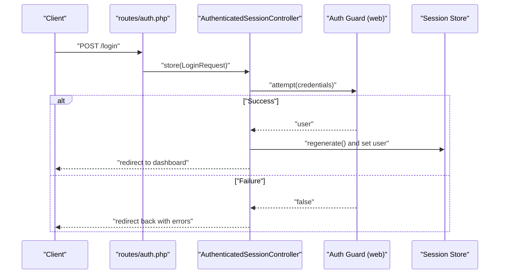

**Diagram sources**
- [routes/auth.php](file://routes/auth.php)
- [app/Http/Controllers/Auth/AuthenticatedSessionController.php](file://app/Http/Controllers/Auth/AuthenticatedSessionController.php)
- [app/Http/Requests/Auth/LoginRequest.php](file://app/Http/Requests/Auth/LoginRequest.php)
- [config/auth.php:38-43](file://config/auth.php#L38-L43)
- [config/session.php:35-37](file://config/session.php#L35-L37)

**Section sources**
- [routes/auth.php](file://routes/auth.php)
- [app/Http/Controllers/Auth/AuthenticatedSessionController.php](file://app/Http/Controllers/Auth/AuthenticatedSessionController.php)
- [app/Http/Requests/Auth/LoginRequest.php](file://app/Http/Requests/Auth/LoginRequest.php)
- [config/auth.php:38-43](file://config/auth.php#L38-L43)
- [config/session.php:35-37](file://config/session.php#L35-L37)

### Password Reset Workflow
- Request reset link controller handles sending a reset link with throttling and token expiration.
- New password controller validates the token and updates the user's password.

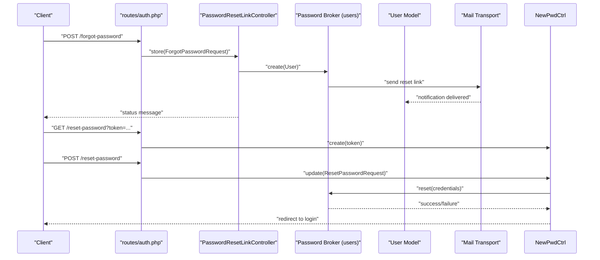

**Diagram sources**
- [routes/auth.php](file://routes/auth.php)
- [app/Http/Controllers/Auth/PasswordResetLinkController.php](file://app/Http/Controllers/Auth/PasswordResetLinkController.php)
- [app/Http/Controllers/Auth/NewPasswordController.php](file://app/Http/Controllers/Auth/NewPasswordController.php)
- [config/auth.php:93-100](file://config/auth.php#L93-L100)

**Section sources**
- [routes/auth.php](file://routes/auth.php)
- [app/Http/Controllers/Auth/PasswordResetLinkController.php](file://app/Http/Controllers/Auth/PasswordResetLinkController.php)
- [app/Http/Controllers/Auth/NewPasswordController.php](file://app/Http/Controllers/Auth/NewPasswordController.php)
- [config/auth.php:93-100](file://config/auth.php#L93-L100)

### Email Verification Processes
- Prompt controller displays unverified email prompt.
- Notification controller resends verification emails with rate limiting.
- Verify controller validates the signed verification URL and marks the email as verified.

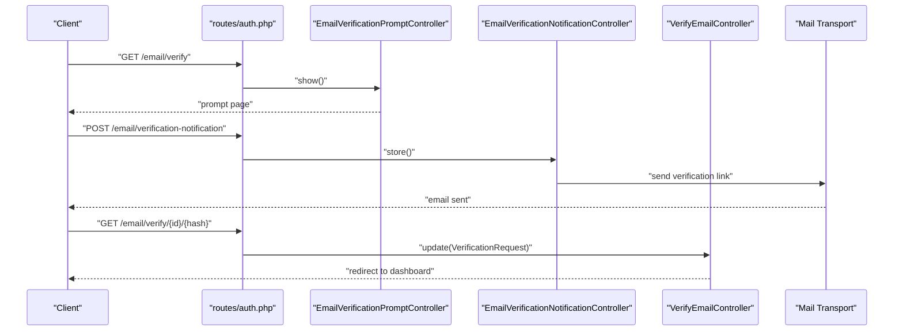

**Diagram sources**
- [routes/auth.php](file://routes/auth.php)
- [app/Http/Controllers/Auth/EmailVerificationPromptController.php](file://app/Http/Controllers/Auth/EmailVerificationPromptController.php)
- [app/Http/Controllers/Auth/EmailVerificationNotificationController.php](file://app/Http/Controllers/Auth/EmailVerificationNotificationController.php)
- [app/Http/Controllers/Auth/VerifyEmailController.php](file://app/Http/Controllers/Auth/VerifyEmailController.php)

**Section sources**
- [routes/auth.php](file://routes/auth.php)
- [app/Http/Controllers/Auth/EmailVerificationPromptController.php](file://app/Http/Controllers/Auth/EmailVerificationPromptController.php)
- [app/Http/Controllers/Auth/EmailVerificationNotificationController.php](file://app/Http/Controllers/Auth/EmailVerificationNotificationController.php)
- [app/Http/Controllers/Auth/VerifyEmailController.php](file://app/Http/Controllers/Auth/VerifyEmailController.php)

### Social Authentication Options
- Social authentication controller delegates provider-specific flows to services.
- OAuth service manages OAuth 2.0 authorization code flow and token exchange.
- Social auth service coordinates provider callbacks and user provisioning.

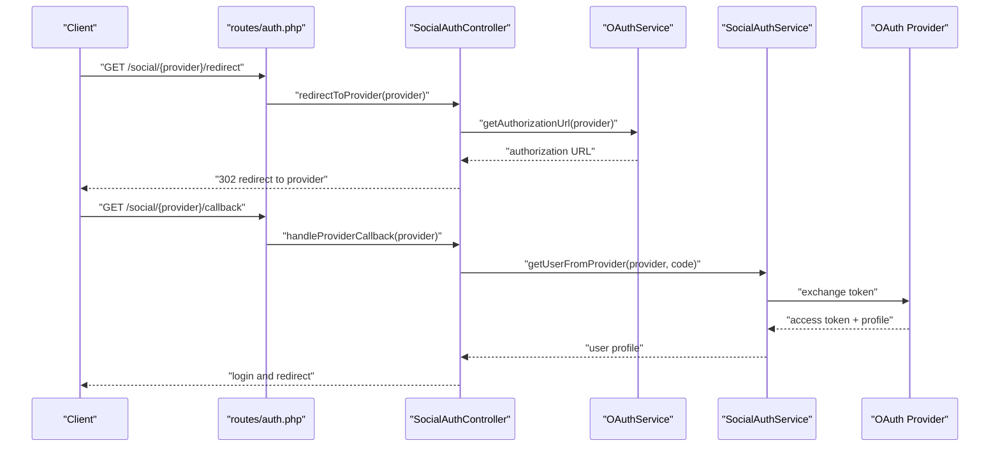

**Diagram sources**
- [routes/auth.php](file://routes/auth.php)
- [app/Http/Controllers/SocialAuthController.php](file://app/Http/Controllers/SocialAuthController.php)
- [app/Services/OAuthService.php](file://app/Services/OAuthService.php)
- [app/Services/SocialAuthService.php](file://app/Services/SocialAuthService.php)

**Section sources**
- [routes/auth.php](file://routes/auth.php)
- [app/Http/Controllers/SocialAuthController.php](file://app/Http/Controllers/SocialAuthController.php)
- [app/Services/OAuthService.php](file://app/Services/OAuthService.php)
- [app/Services/SocialAuthService.php](file://app/Services/SocialAuthService.php)

### Single Sign-On (SSO) Integration
- SSO controller handles SAML/OAuth/OpenID Connect flows, including initiation, assertion consumption, and single logout.
- SSO configuration defines SP metadata, security settings, attribute and role mapping, provisioning, session management, and error handling.

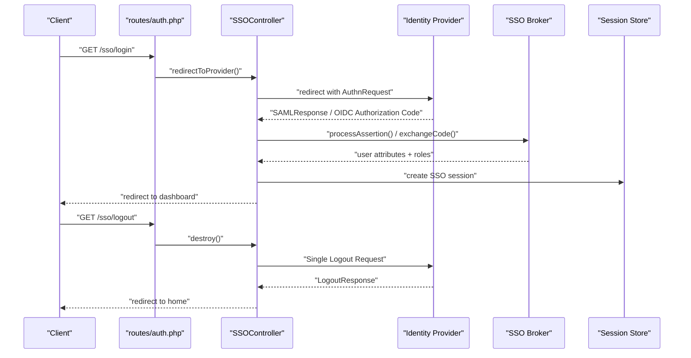

**Diagram sources**
- [routes/auth.php](file://routes/auth.php)
- [app/Http/Controllers/Auth/SSOController.php](file://app/Http/Controllers/Auth/SSOController.php)
- [config/sso.php:26-262](file://config/sso.php#L26-L262)

**Section sources**
- [routes/auth.php](file://routes/auth.php)
- [app/Http/Controllers/Auth/SSOController.php](file://app/Http/Controllers/Auth/SSOController.php)
- [config/sso.php:26-262](file://config/sso.php#L26-L262)

### Multi-Factor Authentication Implementation
- Two-factor authentication model supports TOTP and backup codes.
- Controllers coordinate challenge and verification steps during login.

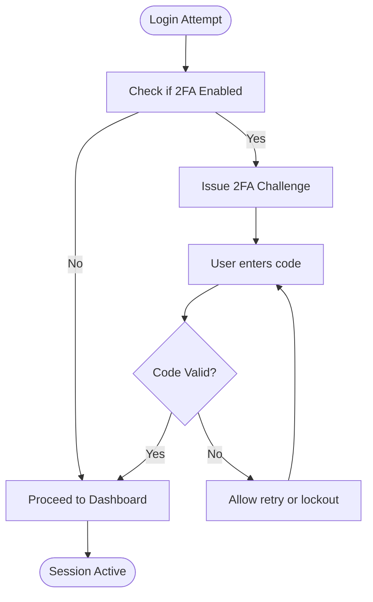

**Diagram sources**
- [app/Models/TwoFactorAuth.php](file://app/Models/TwoFactorAuth.php)
- [app/Http/Controllers/Auth/AuthenticatedSessionController.php](file://app/Http/Controllers/Auth/AuthenticatedSessionController.php)

**Section sources**
- [app/Models/TwoFactorAuth.php](file://app/Models/TwoFactorAuth.php)
- [app/Http/Controllers/Auth/AuthenticatedSessionController.php](file://app/Http/Controllers/Auth/AuthenticatedSessionController.php)

### Session Management and Lifecycle
- Session lifetime and cookie attributes are configured centrally.
- Session regeneration occurs after successful login to prevent fixation.
- Session timeout is enforced by the configured lifetime.

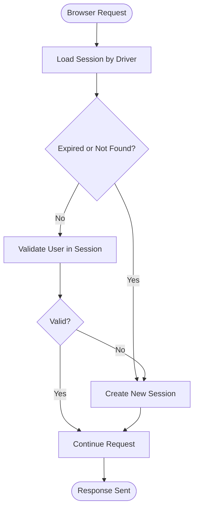

**Diagram sources**
- [config/session.php:21-217](file://config/session.php#L21-L217)
- [app/Http/Controllers/Auth/AuthenticatedSessionController.php](file://app/Http/Controllers/Auth/AuthenticatedSessionController.php)

**Section sources**
- [config/session.php:21-217](file://config/session.php#L21-L217)
- [app/Http/Controllers/Auth/AuthenticatedSessionController.php](file://app/Http/Controllers/Auth/AuthenticatedSessionController.php)

### Token-Based Authentication for API Access
- API token authentication is integrated via Laravel Sanctum, enabling SPA and mobile clients to authenticate using personal access tokens.
- OAuth 2.0 flows are supported through Passport for third-party integrations.

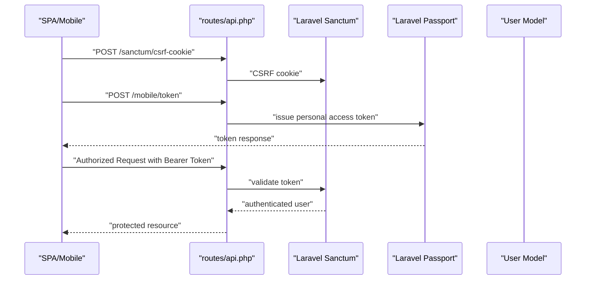

**Diagram sources**
- [routes/auth.php](file://routes/auth.php)

**Section sources**
- [routes/auth.php](file://routes/auth.php)

### Authentication Middleware, Guards, and Policies
- Guards: "web" guard uses session storage and Eloquent provider.
- Policies: authorization policies are registered in the AuthServiceProvider.
- Middleware: authentication routes are protected by appropriate middleware layers.

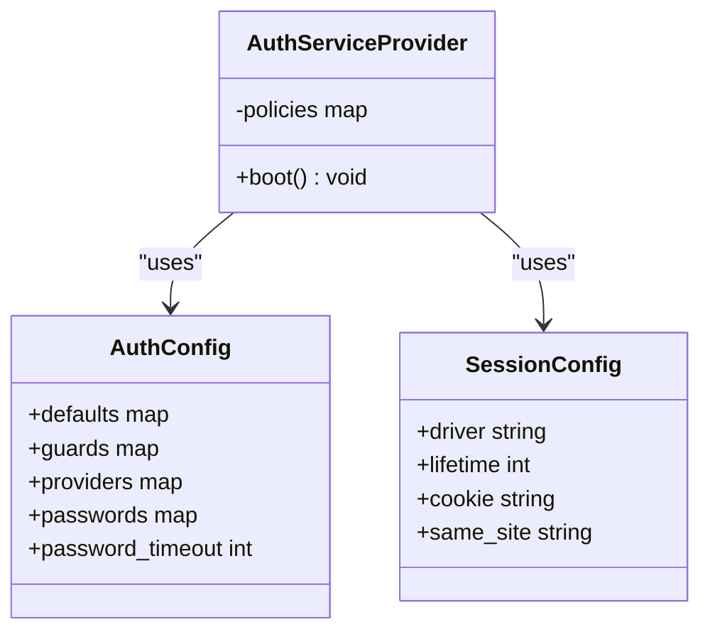

**Diagram sources**
- [app/Providers/AuthServiceProvider.php](file://app/Providers/AuthServiceProvider.php)
- [config/auth.php:16-113](file://config/auth.php#L16-L113)
- [config/session.php:21-217](file://config/session.php#L21-L217)

**Section sources**
- [app/Providers/AuthServiceProvider.php](file://app/Providers/AuthServiceProvider.php)
- [config/auth.php:16-113](file://config/auth.php#L16-L113)
- [config/session.php:21-217](file://config/session.php#L21-L217)

## Dependency Analysis
- Controllers depend on configuration for guard/provider selection, session settings, and SSO parameters.
- Services encapsulate provider-specific logic, reducing controller complexity.
- Models support two-factor authentication and related flows.
- Tests validate end-to-end authentication scenarios.

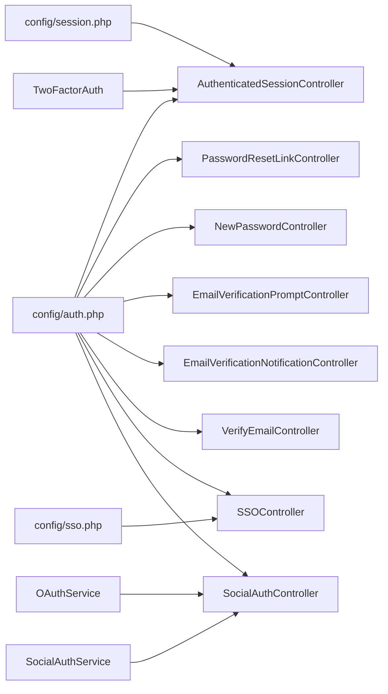

**Diagram sources**
- [config/auth.php:1-116](file://config/auth.php#L1-L116)
- [config/session.php:1-218](file://config/session.php#L1-L218)
- [config/sso.php:1-265](file://config/sso.php#L1-L265)
- [app/Http/Controllers/Auth/AuthenticatedSessionController.php](file://app/Http/Controllers/Auth/AuthenticatedSessionController.php)
- [app/Http/Controllers/Auth/PasswordResetLinkController.php](file://app/Http/Controllers/Auth/PasswordResetLinkController.php)
- [app/Http/Controllers/Auth/NewPasswordController.php](file://app/Http/Controllers/Auth/NewPasswordController.php)
- [app/Http/Controllers/Auth/EmailVerificationPromptController.php](file://app/Http/Controllers/Auth/EmailVerificationPromptController.php)
- [app/Http/Controllers/Auth/EmailVerificationNotificationController.php](file://app/Http/Controllers/Auth/EmailVerificationNotificationController.php)
- [app/Http/Controllers/Auth/VerifyEmailController.php](file://app/Http/Controllers/Auth/VerifyEmailController.php)
- [app/Http/Controllers/Auth/SSOController.php](file://app/Http/Controllers/Auth/SSOController.php)
- [app/Http/Controllers/SocialAuthController.php](file://app/Http/Controllers/SocialAuthController.php)
- [app/Services/OAuthService.php](file://app/Services/OAuthService.php)
- [app/Services/SocialAuthService.php](file://app/Services/SocialAuthService.php)
- [app/Models/TwoFactorAuth.php](file://app/Models/TwoFactorAuth.php)

**Section sources**
- [config/auth.php:1-116](file://config/auth.php#L1-L116)
- [config/session.php:1-218](file://config/session.php#L1-L218)
- [config/sso.php:1-265](file://config/sso.php#L1-L265)
- [app/Http/Controllers/Auth/AuthenticatedSessionController.php](file://app/Http/Controllers/Auth/AuthenticatedSessionController.php)
- [app/Services/OAuthService.php](file://app/Services/OAuthService.php)
- [app/Services/SocialAuthService.php](file://app/Services/SocialAuthService.php)
- [app/Models/TwoFactorAuth.php](file://app/Models/TwoFactorAuth.php)

## Performance Considerations
- Session driver selection impacts scalability; database or Redis drivers are recommended for production.
- Session lifetime should balance security and user experience; shorter lifetimes reduce risk but increase re-auth frequency.
- Password reset throttling prevents abuse and reduces load on mail transport.
- SSO attribute and role mapping should minimize unnecessary lookups and synchronize only required fields.

## Troubleshooting Guide
- Authentication failures: verify guard configuration, provider model, and credential validation.
- Session issues: check session driver, cookie attributes, and lifetime settings.
- Password reset problems: confirm token table exists, broker configuration, and mail transport.
- SSO errors: review identity provider metadata, signing/encryption settings, and logging configuration.
- Social auth issues: validate provider credentials, scopes, and callback URLs.
- Two-factor authentication: ensure TOTP secret generation and backup codes are properly managed.

**Section sources**
- [config/auth.php:38-113](file://config/auth.php#L38-L113)
- [config/session.php:21-217](file://config/session.php#L21-L217)
- [config/sso.php:220-262](file://config/sso.php#L220-L262)
- [tests/Feature/Auth/AuthenticationTest.php](file://tests/Feature/Auth/AuthenticationTest.php)
- [tests/Feature/Auth/PasswordResetTest.php](file://tests/Feature/Auth/PasswordResetTest.php)
- [tests/Feature/Auth/EmailVerificationTest.php](file://tests/Feature/Auth/EmailVerificationTest.php)

## Conclusion
The authentication system provides robust, configurable mechanisms for local, SSO, and social authentication, with strong session management, password reset, email verification, and two-factor authentication support. Centralized configuration enables flexible deployment across environments, while services and controllers encapsulate provider-specific logic for maintainability and extensibility.