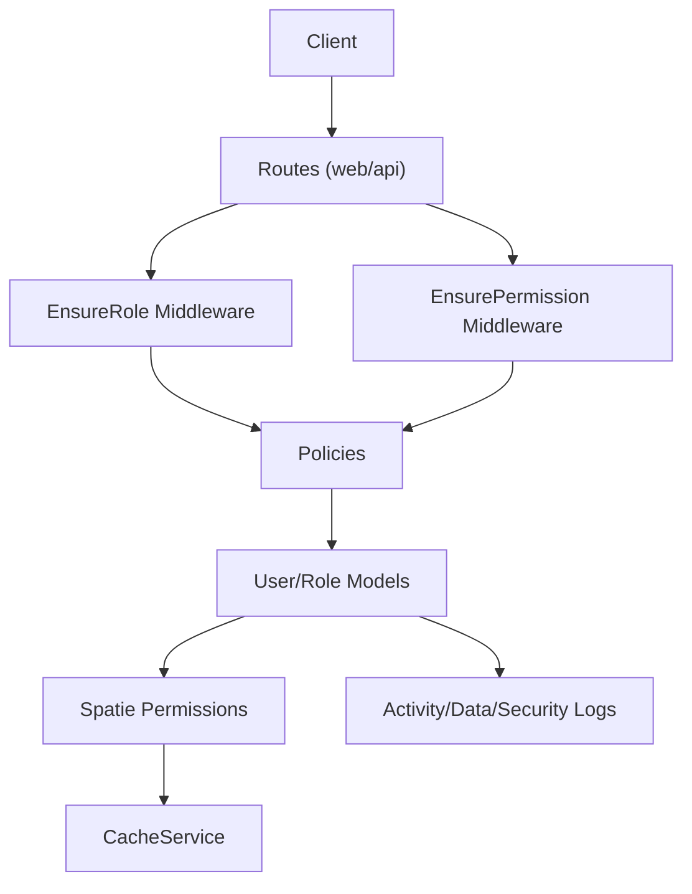
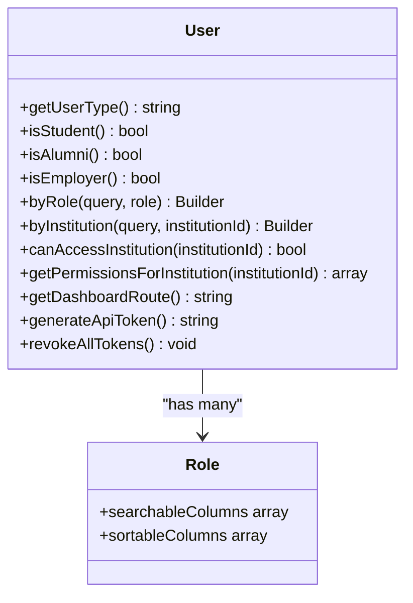
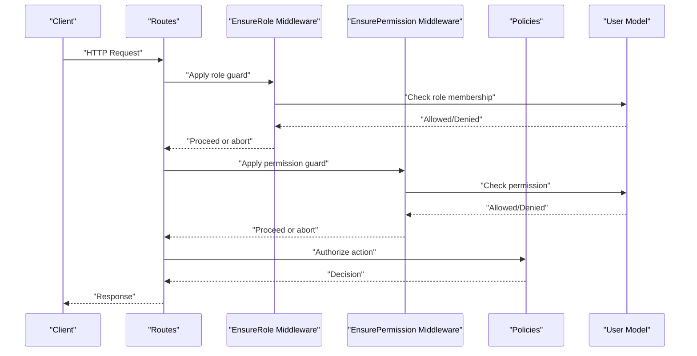
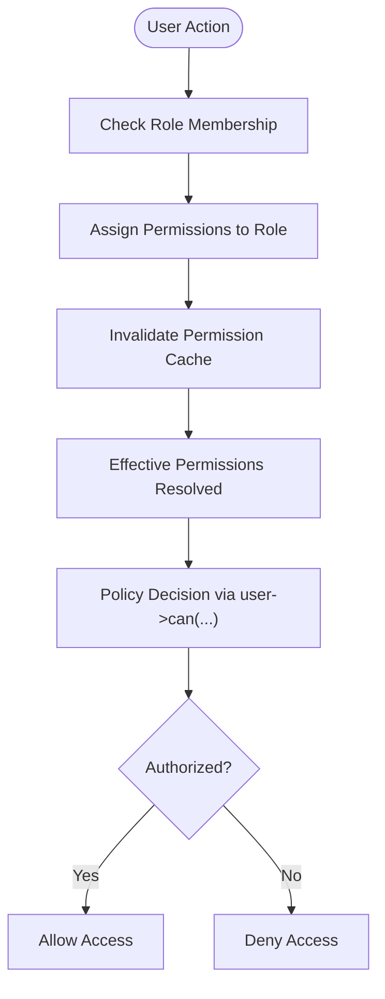
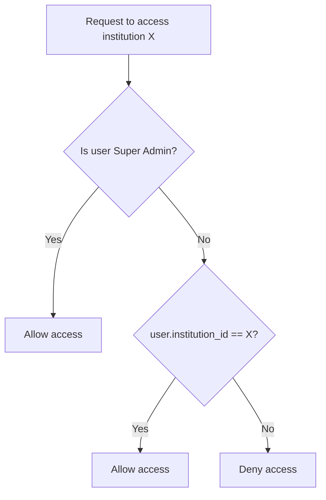
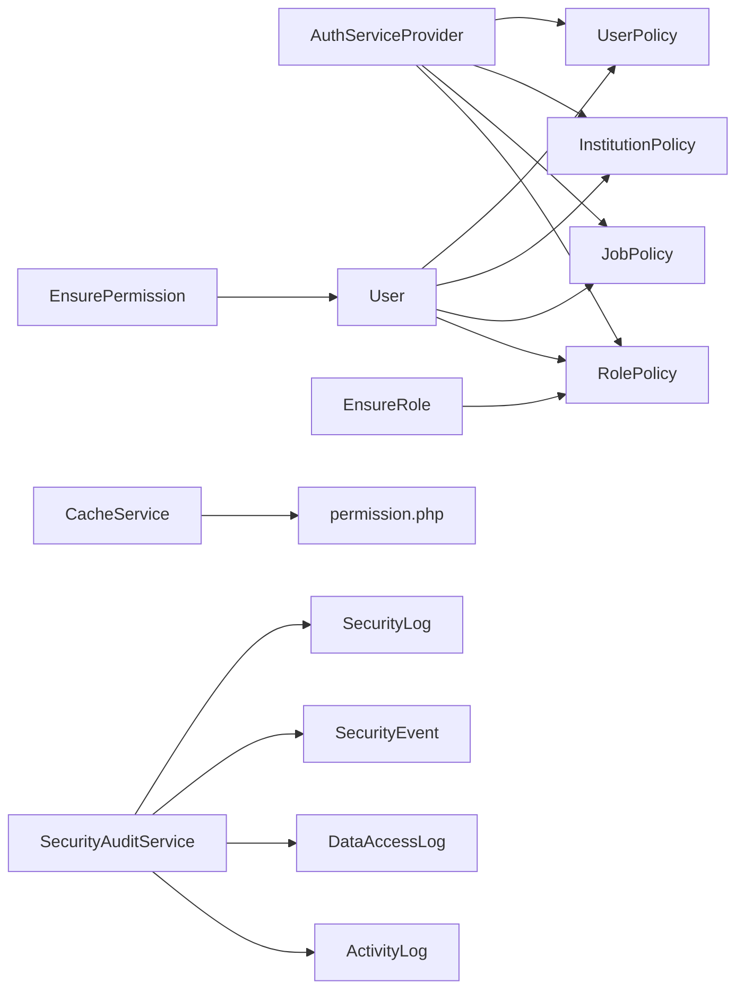

# Authorization & Role-Based Access Control

<cite>
**Referenced Files in This Document**
- [config/permission.php](file://config/permission.php)
- [app/Providers/AuthServiceProvider.php](file://app/Providers/AuthServiceProvider.php)
- [app/Models/User.php](file://app/Models/User.php)
- [app/Models/Role.php](file://app/Models/Role.php)
- [app/Policies/RolePolicy.php](file://app/Policies/RolePolicy.php)
- [app/Services/SecurityAuditService.php](file://app/Services/SecurityAuditService.php)
- [app/Services/CacheService.php](file://app/Services/CacheService.php)
- [app/Http/Middleware/EnsureRole.php](file://app/Http/Middleware/EnsureRole.php)
- [app/Http/Middleware/EnsurePermission.php](file://app/Http/Middleware/EnsurePermission.php)
- [routes/web.php](file://routes/web.php)
- [routes/api.php](file://routes/api.php)
- [app/Console/Commands/CheckUserRoles.php](file://app/Console/Commands/CheckUserRoles.php)
- [app/Exceptions/BrandConfigValidationException.php](file://app/Exceptions/BrandConfigValidationException.php)
- [app/Exceptions/CalendarSyncException.php](file://app/Exceptions/CalendarSyncException.php)
- [app/Exceptions/TemplateSecurityException.php](file://app/Exceptions/TemplateSecurityException.php)
- [app/Exceptions/TokenRefreshException.php](file://app/Exceptions/TokenRefreshException.php)
- [app/Models/ActivityLog.php](file://app/Models/ActivityLog.php)
- [app/Models/DataAccessLog.php](file://app/Models/DataAccessLog.php)
- [app/Models/SecurityEvent.php](file://app/Models/SecurityEvent.php)
- [app/Models/SecurityLog.php](file://app/Models/SecurityLog.php)
- [app/Models/Tenant.php](file://app/Models/Tenant.php)
- [app/Models/Institution.php](file://app/Models/Institution.php)
- [app/Models/Graduate.php](file://app/Models/Graduate.php)
- [app/Models/Employer.php](file://app/Models/Employer.php)
- [app/Models/Job.php](file://app/Models/Job.php)
- [app/Policies/JobPolicy.php](file://app/Policies/JobPolicy.php)
- [app/Policies/InstitutionPolicy.php](file://app/Policies/InstitutionPolicy.php)
- [app/Policies/UserPolicy.php](file://app/Policies/UserPolicy.php)
- [app/Policies/EmailCampaignPolicy.php](file://app/Policies/EmailCampaignPolicy.php)
- [app/Policies/CampaignDonationPolicy.php](file://app/Policies/CampaignDonationPolicy.php)
- [app/Policies/FundraisingCampaignPolicy.php](file://app/Policies/FundraisingCampaignPolicy.php)
- [app/Policies/IntegrationConfigurationPolicy.php](file://app/Policies/IntegrationConfigurationPolicy.php)
- [app/Policies/SavedSearchPolicy.php](file://app/Policies/SavedSearchPolicy.php)
- [app/Policies/TaxReceiptPolicy.php](file://app/Policies/TaxReceiptPolicy.php)
- [app/Policies/TestimonialPolicy.php](file://app/Policies/TestimonialPolicy.php)
- [app/Policies/WebhookPolicy.php](file://app/Policies/WebhookPolicy.php)
- [app/Policies/CalendarConnectionPolicy.php](file://app/Policies/CalendarConnectionPolicy.php)
- [app/Policies/PeerFundraiserPolicy.php](file://app/Policies/PeerFundraiserPolicy.php)
- [app/Policies/RecurringDonationPolicy.php](file://app/Policies/RecurringDonationPolicy.php)
</cite>

## Table of Contents
1. [Introduction](#introduction)
2. [Project Structure](#project-structure)
3. [Core Components](#core-components)
4. [Architecture Overview](#architecture-overview)
5. [Detailed Component Analysis](#detailed-component-analysis)
6. [Dependency Analysis](#dependency-analysis)
7. [Performance Considerations](#performance-considerations)
8. [Troubleshooting Guide](#troubleshooting-guide)
9. [Conclusion](#conclusion)
10. [Appendices](#appendices)

## Introduction
This document describes the comprehensive role-based access control (RBAC) system built on Spatie Permissions. It documents the four main user roles (Super Admin, Institution Admin, Employer, Graduate), their permissions and capabilities, the permission inheritance model, policy-based authorization, and dynamic permission assignment. It also covers tenant-aware permission scoping, caching, audit logging, and security best practices for RBAC implementation.

## Project Structure
The RBAC system spans configuration, models, policies, middleware, routes, services, and logging models. The Spatie Permissions package is configured via the permission configuration file, while the application’s User and Role models extend Spatie’s base models. Policies enforce resource-level authorization, and middleware secures routes. Services support caching and security auditing. Logging models capture activity and security events.

```mermaid
graph TB
subgraph "Configuration"
CFG["config/permission.php"]
end
subgraph "Models"
U["app/Models/User.php"]
R["app/Models/Role.php"]
T["app/Models/Tenant.php"]
INST["app/Models/Institution.php"]
GRAD["app/Models/Graduate.php"]
EMPL["app/Models/Employer.php"]
JOB["app/Models/Job.php"]
end
subgraph "Policies"
RP["app/Policies/RolePolicy.php"]
IP["app/Policies/InstitutionPolicy.php"]
UP["app/Policies/UserPolicy.php"]
JP["app/Policies/JobPolicy.php"]
EC["app/Policies/EmailCampaignPolicy.php"]
CDC["app/Policies/CampaignDonationPolicy.php"]
FCP["app/Policies/FundraisingCampaignPolicy.php"]
ICP["app/Policies/IntegrationConfigurationPolicy.php"]
SSP["app/Policies/SavedSearchPolicy.php"]
TRP["app/Policies/TaxReceiptPolicy.php"]
TTP["app/Policies/TestimonialPolicy.php"]
WHP["app/Policies/WebhookPolicy.php"]
CCP["app/Policies/CalendarConnectionPolicy.php"]
PFP["app/Policies/PeerFundraiserPolicy.php"]
RDP["app/Policies/RecurringDonationPolicy.php"]
end
subgraph "Middleware"
ER["app/Http/Middleware/EnsureRole.php"]
EP["app/Http/Middleware/EnsurePermission.php"]
end
subgraph "Routes"
RW["routes/web.php"]
RA["routes/api.php"]
end
subgraph "Services"
CAS["app/Services/CacheService.php"]
SAS["app/Services/SecurityAuditService.php"]
end
subgraph "Logging"
AL["app/Models/ActivityLog.php"]
DAL["app/Models/DataAccessLog.php"]
SE["app/Models/SecurityEvent.php"]
SL["app/Models/SecurityLog.php"]
end
CFG --> U
CFG --> R
U --> RP
U --> IP
U --> UP
U --> JP
U --> EC
U --> CDC
U --> FCP
U --> ICP
U --> SSP
U --> TRP
U --> TTP
U --> WHP
U --> CCP
U --> PFP
U --> RDP
RW --> ER
RA --> EP
CAS --> CFG
SAS --> AL
SAS --> DAL
SAS --> SE
SAS --> SL
```

**Diagram sources**
- [config/permission.php:1-203](file://config/permission.php#L1-L203)
- [app/Models/User.php:1-818](file://app/Models/User.php#L1-L818)
- [app/Models/Role.php:1-22](file://app/Models/Role.php#L1-L22)
- [app/Policies/RolePolicy.php:1-66](file://app/Policies/RolePolicy.php#L1-L66)
- [app/Http/Middleware/EnsureRole.php](file://app/Http/Middleware/EnsureRole.php)
- [app/Http/Middleware/EnsurePermission.php](file://app/Http/Middleware/EnsurePermission.php)
- [routes/web.php](file://routes/web.php)
- [routes/api.php](file://routes/api.php)
- [app/Services/CacheService.php](file://app/Services/CacheService.php)
- [app/Services/SecurityAuditService.php](file://app/Services/SecurityAuditService.php)
- [app/Models/ActivityLog.php](file://app/Models/ActivityLog.php)
- [app/Models/DataAccessLog.php](file://app/Models/DataAccessLog.php)
- [app/Models/SecurityEvent.php](file://app/Models/SecurityEvent.php)
- [app/Models/SecurityLog.php](file://app/Models/SecurityLog.php)

**Section sources**
- [config/permission.php:1-203](file://config/permission.php#L1-L203)
- [app/Providers/AuthServiceProvider.php:1-26](file://app/Providers/AuthServiceProvider.php#L1-L26)
- [app/Models/User.php:1-818](file://app/Models/User.php#L1-L818)
- [app/Models/Role.php:1-22](file://app/Models/Role.php#L1-L22)

## Core Components
- Spatie Permissions configuration defines models, table names, cache settings, and security-related toggles.
- User model integrates Spatie’s HasRoles trait and adds helper methods for role checks, institution-scoped permissions, and dashboard routing.
- Role model extends Spatie’s Role and adds searchable and sortable columns.
- Policies define authorization rules per resource and per action.
- Middleware enforces role and permission checks at the route level.
- Services support caching and security auditing.
- Logging models capture activity, data access, and security events.

**Section sources**
- [config/permission.php:1-203](file://config/permission.php#L1-L203)
- [app/Models/User.php:1-818](file://app/Models/User.php#L1-L818)
- [app/Models/Role.php:1-22](file://app/Models/Role.php#L1-L22)
- [app/Policies/RolePolicy.php:1-66](file://app/Policies/RolePolicy.php#L1-L66)

## Architecture Overview
The RBAC architecture combines:
- Configuration-driven permission and role storage
- Model-level helpers for role and permission checks
- Policy-based authorization for resources
- Middleware for route-level enforcement
- Tenant-aware scoping for institution boundaries
- Caching for performance
- Audit logging for compliance and security

**Diagram sources**
- [app/Http/Middleware/EnsureRole.php](file://app/Http/Middleware/EnsureRole.php)
- [app/Http/Middleware/EnsurePermission.php](file://app/Http/Middleware/EnsurePermission.php)
- [routes/web.php](file://routes/web.php)
- [routes/api.php](file://routes/api.php)
- [app/Policies/RolePolicy.php:1-66](file://app/Policies/RolePolicy.php#L1-L66)
- [app/Models/User.php:1-818](file://app/Models/User.php#L1-L818)
- [config/permission.php:1-203](file://config/permission.php#L1-L203)
- [app/Services/CacheService.php](file://app/Services/CacheService.php)
- [app/Models/ActivityLog.php](file://app/Models/ActivityLog.php)
- [app/Models/DataAccessLog.php](file://app/Models/DataAccessLog.php)
- [app/Models/SecurityEvent.php](file://app/Models/SecurityEvent.php)
- [app/Models/SecurityLog.php](file://app/Models/SecurityLog.php)

## Detailed Component Analysis

### Spatie Permissions Configuration
- Defines the Permission and Role models, table names for roles, permissions, and pivot tables, column names, and cache settings.
- Controls whether wildcard permissions are enabled, whether Passport client credentials are used, and whether permission/role names are included in exceptions.
- Configures cache expiration, cache key, and cache store for permissions and roles.

**Section sources**
- [config/permission.php:1-203](file://config/permission.php#L1-L203)

### User Model and Role Helpers
- Integrates HasRoles trait and exposes helpers:
  - Role detection helpers (isStudent, isAlumni, isEmployer)
  - getUserType for role-based routing
  - Scope helpers (byRole, byInstitution)
  - Institution-scoped permission checks (canAccessInstitution, getPermissionsForInstitution)
  - Dashboard route selection based on primary role
- Provides helper methods for API token generation and revocation.

**Diagram sources**
- [app/Models/User.php:1-818](file://app/Models/User.php#L1-L818)
- [app/Models/Role.php:1-22](file://app/Models/Role.php#L1-L22)

**Section sources**
- [app/Models/User.php:1-818](file://app/Models/User.php#L1-L818)

### Role Model Extension
- Extends Spatie’s Role model and adds searchable and sortable columns for admin UI integration.

**Section sources**
- [app/Models/Role.php:1-22](file://app/Models/Role.php#L1-L22)

### Policies and Resource Authorization
- Policies are mapped in the AuthServiceProvider and enforce authorization per action (viewAny, view, create, update, delete, etc.) using the user’s permissions.
- Example: RolePolicy delegates to user->can('verb roles') for each action.
- Additional resource policies exist for Job, Institution, User, EmailCampaign, CampaignDonation, FundraisingCampaign, IntegrationConfiguration, SavedSearch, TaxReceipt, Testimonial, Webhook, CalendarConnection, PeerFundraiser, and RecurringDonation.

```mermaid
classDiagram
class RolePolicy {
+viewAny(user) bool
+view(user, role) bool
+create(user) bool
+update(user, role) bool
+delete(user, role) bool
+restore(user, role) bool
+forceDelete(user, role) bool
}
class JobPolicy {
+viewAny(user) bool
+view(user, job) bool
+create(user) bool
+update(user, job) bool
+delete(user, job) bool
+restore(user, job) bool
+forceDelete(user, job) bool
}
class InstitutionPolicy {
+viewAny(user) bool
+view(user, institution) bool
+create(user) bool
+update(user, institution) bool
+delete(user, institution) bool
+restore(user, institution) bool
+forceDelete(user, institution) bool
}
class UserPolicy {
+viewAny(user) bool
+view(user, target) bool
+create(user) bool
+update(user, target) bool
+delete(user, target) bool
+restore(user, target) bool
+forceDelete(user, target) bool
}
class EmailCampaignPolicy {
+viewAny(user) bool
+view(user, campaign) bool
+create(user) bool
+update(user, campaign) bool
+delete(user, campaign) bool
+restore(user, campaign) bool
+forceDelete(user, campaign) bool
}
class CampaignDonationPolicy {
+viewAny(user) bool
+view(user, donation) bool
+create(user) bool
+update(user, donation) bool
+delete(user, donation) bool
+restore(user, donation) bool
+forceDelete(user, donation) bool
}
class FundraisingCampaignPolicy {
+viewAny(user) bool
+view(user, campaign) bool
+create(user) bool
+update(user, campaign) bool
+delete(user, campaign) bool
+restore(user, campaign) bool
+forceDelete(user, campaign) bool
}
class IntegrationConfigurationPolicy {
+viewAny(user) bool
+view(user, config) bool
+create(user) bool
+update(user, config) bool
+delete(user, config) bool
+restore(user, config) bool
+forceDelete(user, config) bool
}
class SavedSearchPolicy {
+viewAny(user) bool
+view(user, search) bool
+create(user) bool
+update(user, search) bool
+delete(user, search) bool
+restore(user, search) bool
+forceDelete(user, search) bool
}
class TaxReceiptPolicy {
+viewAny(user) bool
+view(user, receipt) bool
+create(user) bool
+update(user, receipt) bool
+delete(user, receipt) bool
+restore(user, receipt) bool
+forceDelete(user, receipt) bool
}
class TestimonialPolicy {
+viewAny(user) bool
+view(user, testimonial) bool
+create(user) bool
+update(user, testimonial) bool
+delete(user, testimonial) bool
+restore(user, testimonial) bool
+forceDelete(user, testimonial) bool
}
class WebhookPolicy {
+viewAny(user) bool
+view(user, webhook) bool
+create(user) bool
+update(user, webhook) bool
+delete(user, webhook) bool
+restore(user, webhook) bool
+forceDelete(user, webhook) bool
}
class CalendarConnectionPolicy {
+viewAny(user) bool
+view(user, connection) bool
+create(user) bool
+update(user, connection) bool
+delete(user, connection) bool
+restore(user, connection) bool
+forceDelete(user, connection) bool
}
class PeerFundraiserPolicy {
+viewAny(user) bool
+view(user, fundraiser) bool
+create(user) bool
+update(user, fundraiser) bool
+delete(user, fundraiser) bool
+restore(user, fundraiser) bool
+forceDelete(user, fundraiser) bool
}
class RecurringDonationPolicy {
+viewAny(user) bool
+view(user, donation) bool
+create(user) bool
+update(user, donation) bool
+delete(user, donation) bool
+restore(user, donation) bool
+forceDelete(user, donation) bool
}
```

**Diagram sources**
- [app/Policies/RolePolicy.php:1-66](file://app/Policies/RolePolicy.php#L1-L66)
- [app/Policies/JobPolicy.php](file://app/Policies/JobPolicy.php)
- [app/Policies/InstitutionPolicy.php](file://app/Policies/InstitutionPolicy.php)
- [app/Policies/UserPolicy.php](file://app/Policies/UserPolicy.php)
- [app/Policies/EmailCampaignPolicy.php](file://app/Policies/EmailCampaignPolicy.php)
- [app/Policies/CampaignDonationPolicy.php](file://app/Policies/CampaignDonationPolicy.php)
- [app/Policies/FundraisingCampaignPolicy.php](file://app/Policies/FundraisingCampaignPolicy.php)
- [app/Policies/IntegrationConfigurationPolicy.php](file://app/Policies/IntegrationConfigurationPolicy.php)
- [app/Policies/SavedSearchPolicy.php](file://app/Policies/SavedSearchPolicy.php)
- [app/Policies/TaxReceiptPolicy.php](file://app/Policies/TaxReceiptPolicy.php)
- [app/Policies/TestimonialPolicy.php](file://app/Policies/TestimonialPolicy.php)
- [app/Policies/WebhookPolicy.php](file://app/Policies/WebhookPolicy.php)
- [app/Policies/CalendarConnectionPolicy.php](file://app/Policies/CalendarConnectionPolicy.php)
- [app/Policies/PeerFundraiserPolicy.php](file://app/Policies/PeerFundraiserPolicy.php)
- [app/Policies/RecurringDonationPolicy.php](file://app/Policies/RecurringDonationPolicy.php)

**Section sources**
- [app/Providers/AuthServiceProvider.php:1-26](file://app/Providers/AuthServiceProvider.php#L1-L26)
- [app/Policies/RolePolicy.php:1-66](file://app/Policies/RolePolicy.php#L1-L66)

### Middleware for Role and Permission Enforcement
- EnsureRole middleware validates that the current user has a specific role before allowing access to a route.
- EnsurePermission middleware validates that the current user has a specific permission before allowing access to a route.
- These middlewares are applied in routes to protect both web and API endpoints.

**Diagram sources**
- [app/Http/Middleware/EnsureRole.php](file://app/Http/Middleware/EnsureRole.php)
- [app/Http/Middleware/EnsurePermission.php](file://app/Http/Middleware/EnsurePermission.php)
- [app/Policies/RolePolicy.php:1-66](file://app/Policies/RolePolicy.php#L1-L66)
- [app/Models/User.php:1-818](file://app/Models/User.php#L1-L818)

**Section sources**
- [app/Http/Middleware/EnsureRole.php](file://app/Http/Middleware/EnsureRole.php)
- [app/Http/Middleware/EnsurePermission.php](file://app/Http/Middleware/EnsurePermission.php)
- [routes/web.php](file://routes/web.php)
- [routes/api.php](file://routes/api.php)

### Roles and Capabilities
- Super Admin: Full system control; can access all institutions and resources.
- Institution Admin: Manages a single institution; can manage users, content, and data within that institution boundary.
- Employer: Can manage job postings, applications, and employer-related resources.
- Graduate: Can manage personal profile, applications, and related activities.

These roles are reflected in the User model’s helper methods and dashboard routing.

**Section sources**
- [app/Models/User.php:1-818](file://app/Models/User.php#L1-L818)

### Permission Inheritance and Dynamic Assignment
- Permissions are inherited through roles; a user inherits all permissions assigned to their roles.
- Dynamic assignment is supported via Spatie’s APIs (assignRole, givePermissionTo, etc.), which are integrated into the User model through HasRoles.
- Policies delegate authorization checks to user->can('...'), which resolves against the user’s effective permissions.

**Diagram sources**
- [config/permission.php:177-201](file://config/permission.php#L177-L201)
- [app/Models/User.php:1-818](file://app/Models/User.php#L1-L818)

**Section sources**
- [config/permission.php:177-201](file://config/permission.php#L177-L201)
- [app/Models/User.php:1-818](file://app/Models/User.php#L1-L818)

### Tenant-Specific Permission Scoping
- The User model includes helpers to scope permissions to a specific institution and to verify access to an institution.
- canAccessInstitution returns true for Super Admins or when the user belongs to the requested institution.
- getPermissionsForInstitution returns the user’s permissions filtered to the given institution.

**Diagram sources**
- [app/Models/User.php:458-476](file://app/Models/User.php#L458-L476)

**Section sources**
- [app/Models/User.php:458-476](file://app/Models/User.php#L458-L476)

### Authorization Policies for Resources
- Policies are defined for multiple resources (Job, Institution, User, EmailCampaign, CampaignDonation, FundraisingCampaign, IntegrationConfiguration, SavedSearch, TaxReceipt, Testimonial, Webhook, CalendarConnection, PeerFundraiser, RecurringDonation).
- Each policy uses user->can('...') to authorize actions, ensuring consistent enforcement across resources.

**Section sources**
- [app/Policies/JobPolicy.php](file://app/Policies/JobPolicy.php)
- [app/Policies/InstitutionPolicy.php](file://app/Policies/InstitutionPolicy.php)
- [app/Policies/UserPolicy.php](file://app/Policies/UserPolicy.php)
- [app/Policies/EmailCampaignPolicy.php](file://app/Policies/EmailCampaignPolicy.php)
- [app/Policies/CampaignDonationPolicy.php](file://app/Policies/CampaignDonationPolicy.php)
- [app/Policies/FundraisingCampaignPolicy.php](file://app/Policies/FundraisingCampaignPolicy.php)
- [app/Policies/IntegrationConfigurationPolicy.php](file://app/Policies/IntegrationConfigurationPolicy.php)
- [app/Policies/SavedSearchPolicy.php](file://app/Policies/SavedSearchPolicy.php)
- [app/Policies/TaxReceiptPolicy.php](file://app/Policies/TaxReceiptPolicy.php)
- [app/Policies/TestimonialPolicy.php](file://app/Policies/TestimonialPolicy.php)
- [app/Policies/WebhookPolicy.php](file://app/Policies/WebhookPolicy.php)
- [app/Policies/CalendarConnectionPolicy.php](file://app/Policies/CalendarConnectionPolicy.php)
- [app/Policies/PeerFundraiserPolicy.php](file://app/Policies/PeerFundraiserPolicy.php)
- [app/Policies/RecurringDonationPolicy.php](file://app/Policies/RecurringDonationPolicy.php)

### Capability-Based Restrictions
- Capability checks are centralized in policies using user->can('...').
- Middleware can enforce capability-based restrictions at the route level.
- Exception classes exist for security-related validations and errors.

**Section sources**
- [app/Models/User.php:1-818](file://app/Models/User.php#L1-L818)
- [app/Http/Middleware/EnsurePermission.php](file://app/Http/Middleware/EnsurePermission.php)
- [app/Exceptions/BrandConfigValidationException.php](file://app/Exceptions/BrandConfigValidationException.php)
- [app/Exceptions/CalendarSyncException.php](file://app/Exceptions/CalendarSyncException.php)
- [app/Exceptions/TemplateSecurityException.php](file://app/Exceptions/TemplateSecurityException.php)
- [app/Exceptions/TokenRefreshException.php](file://app/Exceptions/TokenRefreshException.php)

### Examples: Role Creation, Permission Management, Access Control
- Role creation and permission assignment leverage Spatie’s HasRoles and Permission APIs. The User model’s helpers demonstrate how to check roles and permissions programmatically.
- Access control is enforced via:
  - Route middleware (EnsureRole, EnsurePermission)
  - Policy gates (user->can('...'))
  - Tenant scoping helpers (canAccessInstitution, getPermissionsForInstitution)

**Section sources**
- [app/Models/User.php:1-818](file://app/Models/User.php#L1-L818)
- [app/Http/Middleware/EnsureRole.php](file://app/Http/Middleware/EnsureRole.php)
- [app/Http/Middleware/EnsurePermission.php](file://app/Http/Middleware/EnsurePermission.php)
- [app/Policies/RolePolicy.php:1-66](file://app/Policies/RolePolicy.php#L1-L66)

## Dependency Analysis
- AuthServiceProvider maps policies to models.
- User model depends on Spatie’s Role and Permission models via configuration.
- Policies depend on User model’s permission checks.
- Middleware depends on policies and route definitions.
- Services (CacheService, SecurityAuditService) integrate with logging models.

**Diagram sources**
- [app/Providers/AuthServiceProvider.php:1-26](file://app/Providers/AuthServiceProvider.php#L1-L26)
- [app/Policies/RolePolicy.php:1-66](file://app/Policies/RolePolicy.php#L1-L66)
- [app/Models/User.php:1-818](file://app/Models/User.php#L1-L818)
- [app/Http/Middleware/EnsureRole.php](file://app/Http/Middleware/EnsureRole.php)
- [app/Http/Middleware/EnsurePermission.php](file://app/Http/Middleware/EnsurePermission.php)
- [config/permission.php:1-203](file://config/permission.php#L1-L203)
- [app/Services/CacheService.php](file://app/Services/CacheService.php)
- [app/Services/SecurityAuditService.php](file://app/Services/SecurityAuditService.php)
- [app/Models/ActivityLog.php](file://app/Models/ActivityLog.php)
- [app/Models/DataAccessLog.php](file://app/Models/DataAccessLog.php)
- [app/Models/SecurityEvent.php](file://app/Models/SecurityEvent.php)
- [app/Models/SecurityLog.php](file://app/Models/SecurityLog.php)

**Section sources**
- [app/Providers/AuthServiceProvider.php:1-26](file://app/Providers/AuthServiceProvider.php#L1-L26)
- [app/Models/User.php:1-818](file://app/Models/User.php#L1-L818)
- [config/permission.php:1-203](file://config/permission.php#L1-L203)

## Performance Considerations
- Permission caching is enabled with a default 24-hour expiration and a dedicated cache key. This reduces repeated database queries for permission resolution.
- CacheStore can be customized via the cache.store option.
- Wildcard permissions are disabled by default; enable only if required and carefully consider performance and security implications.
- Octane reset listener is disabled by default; enable only if using Octane/Vapor combinations where it is beneficial.

**Section sources**
- [config/permission.php:177-201](file://config/permission.php#L177-L201)

## Troubleshooting Guide
- Permission exceptions: The configuration allows suppressing permission/role names in exceptions for security. If debugging, temporarily enable display options to reveal missing permissions.
- Events: Events for role/permission attach/detach are disabled by default; enable and register listeners if you need to react to changes.
- Passport client credentials: Disabled by default; enable only if integrating with API clients that require it.
- Middleware not applied: Verify route registration and ensure EnsureRole/EnsurePermission middleware are bound to the intended routes.
- Policies not firing: Confirm that AuthServiceProvider has the correct model-to-policy mappings.

**Section sources**
- [config/permission.php:104-162](file://config/permission.php#L104-L162)
- [app/Providers/AuthServiceProvider.php:1-26](file://app/Providers/AuthServiceProvider.php#L1-L26)

## Conclusion
The RBAC system leverages Spatie Permissions with a clean separation of concerns: configuration, models, policies, middleware, and services. It supports role-based dashboards, tenant-aware scoping, robust caching, and comprehensive audit logging. Policies centralize authorization logic, while middleware ensures route-level protection. The design balances flexibility, security, and performance.

## Appendices

### Appendix A: Role and Permission Reference
- Roles: Super Admin, Institution Admin, Employer, Graduate
- Policies: RolePolicy, JobPolicy, InstitutionPolicy, UserPolicy, EmailCampaignPolicy, CampaignDonationPolicy, FundraisingCampaignPolicy, IntegrationConfigurationPolicy, SavedSearchPolicy, TaxReceiptPolicy, TestimonialPolicy, WebhookPolicy, CalendarConnectionPolicy, PeerFundraiserPolicy, RecurringDonationPolicy
- Middleware: EnsureRole, EnsurePermission
- Logging: ActivityLog, DataAccessLog, SecurityEvent, SecurityLog

**Section sources**
- [app/Models/User.php:1-818](file://app/Models/User.php#L1-L818)
- [app/Policies/RolePolicy.php:1-66](file://app/Policies/RolePolicy.php#L1-L66)
- [app/Http/Middleware/EnsureRole.php](file://app/Http/Middleware/EnsureRole.php)
- [app/Http/Middleware/EnsurePermission.php](file://app/Http/Middleware/EnsurePermission.php)
- [app/Models/ActivityLog.php](file://app/Models/ActivityLog.php)
- [app/Models/DataAccessLog.php](file://app/Models/DataAccessLog.php)
- [app/Models/SecurityEvent.php](file://app/Models/SecurityEvent.php)
- [app/Models/SecurityLog.php](file://app/Models/SecurityLog.php)