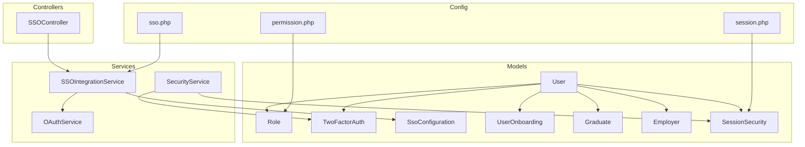
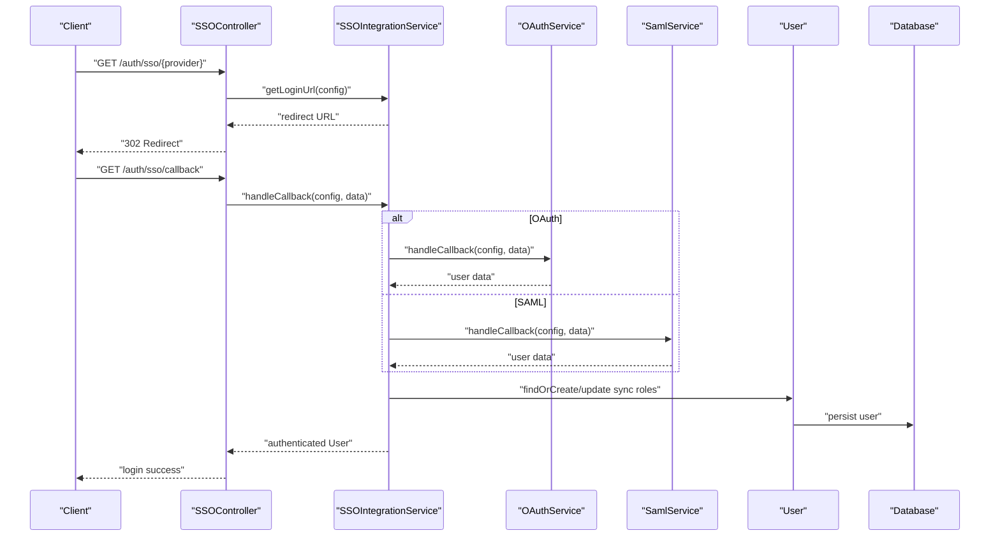
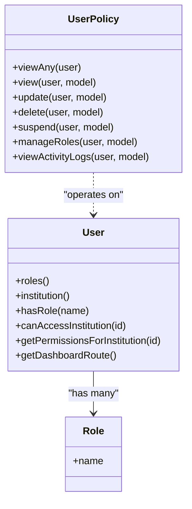
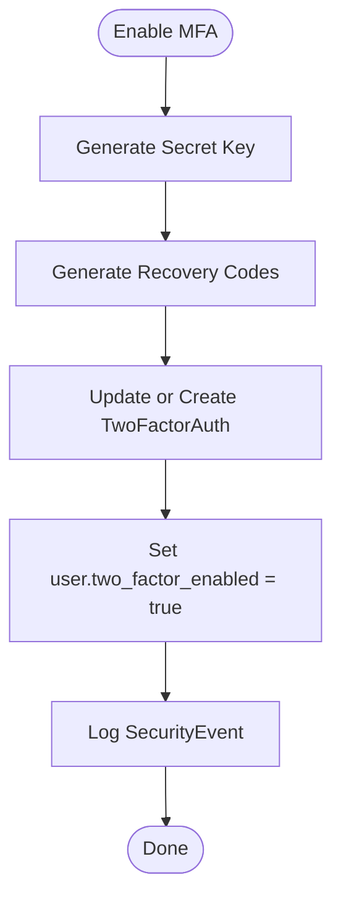
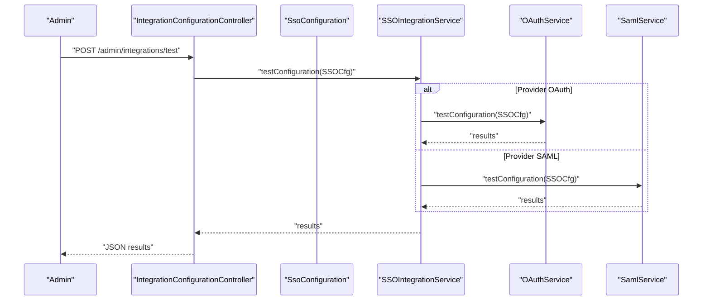
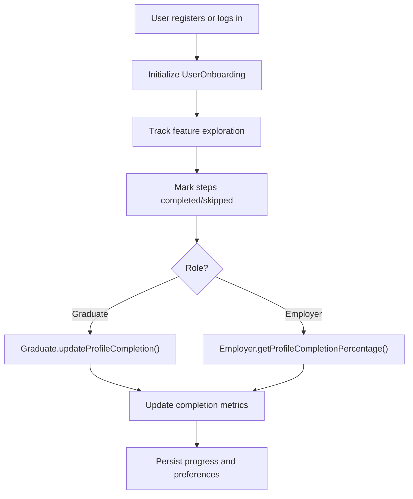
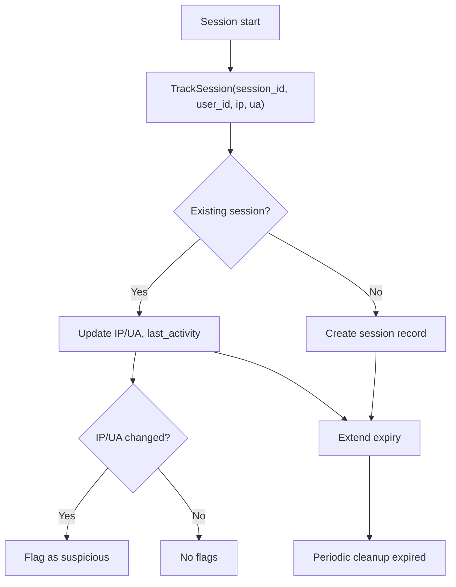
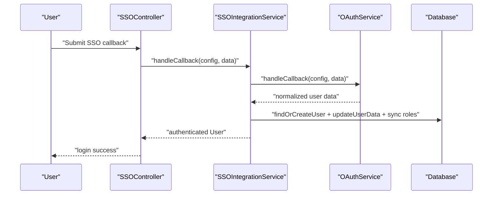
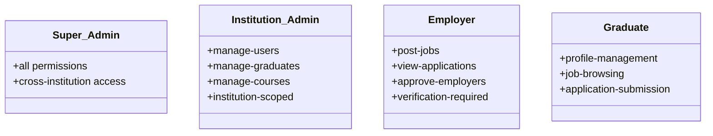
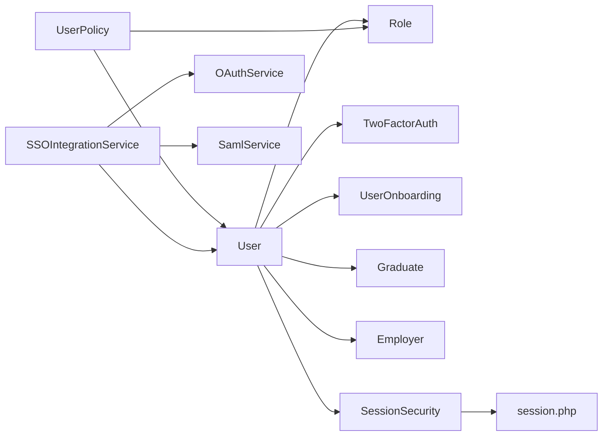

# User Management System

<cite>
**Referenced Files in This Document**
- [User.php](file://app/Models/User.php)
- [Role.php](file://app/Models/Role.php)
- [UserPolicy.php](file://app/Policies/UserPolicy.php)
- [permission.php](file://config/permission.php)
- [SecurityService.php](file://app/Services/SecurityService.php)
- [TwoFactorAuth.php](file://app/Models/TwoFactorAuth.php)
- [SSOIntegrationService.php](file://app/Services/SSOIntegrationService.php)
- [OAuthService.php](file://app/Services/OAuthService.php)
- [SSOController.php](file://app/Http/Controllers/Auth/SSOController.php)
- [sso.php](file://config/sso.php)
- [2025_08_16_022442_create_sso_configurations_table.php](file://database/migrations/2025_08_16_022442_create_sso_configurations_table.php)
- [UserOnboarding.php](file://app/Models/UserOnboarding.php)
- [Graduate.php](file://app/Models/Graduate.php)
- [Employer.php](file://app/Models/Employer.php)
- [SessionSecurity.php](file://app/Models/SessionSecurity.php)
- [session.php](file://config/session.php)
- [task-02-user-management-system-recap.md](file://docs/task-02-user-management-system-recap.md)
- [requirements.md](file://.kiro/specs/graduate-tracking-system/requirements.md)
- [design.md](file://.kiro/specs/graduate-tracking-system/design.md)
- [DEEP_DIVE_ANALYSIS_REPORT.md](file://docs/DEEP_DIVE_ANALYSIS_REPORT.md)
</cite>

## Table of Contents
1. [Introduction](#introduction)
2. [Project Structure](#project-structure)
3. [Core Components](#core-components)
4. [Architecture Overview](#architecture-overview)
5. [Detailed Component Analysis](#detailed-component-analysis)
6. [Dependency Analysis](#dependency-analysis)
7. [Performance Considerations](#performance-considerations)
8. [Troubleshooting Guide](#troubleshooting-guide)
9. [Conclusion](#conclusion)
10. [Appendices](#appendices)

## Introduction
This document describes the comprehensive user management system, focusing on role-based access control (RBAC), multi-factor authentication (MFA), single sign-on (SSO) integrations, and profile management. It explains the four main user roles (Super Admin, Institution Admin, Employer, Graduate), their permissions, and capabilities. It also covers authentication mechanisms, session management, account verification processes, privacy controls, user onboarding, profile completion tracking, and account lifecycle management.

## Project Structure
The user management system spans models, services, policies, configurations, controllers, and migrations. Key areas include:
- User model and relationships
- RBAC via Spatie Permission/Role
- Security services for MFA and failed login handling
- SSO integration (SAML/OAuth/OIDC)
- User onboarding and profile completion tracking
- Session security and lifecycle management

**Diagram sources**
- [User.php:13-177](file://app/Models/User.php#L13-L177)
- [Role.php:9-21](file://app/Models/Role.php#L9-L21)
- [TwoFactorAuth.php:9-64](file://app/Models/TwoFactorAuth.php#L9-L64)
- [UserOnboarding.php:9-46](file://app/Models/UserOnboarding.php#L9-L46)
- [Graduate.php:11-94](file://app/Models/Graduate.php#L11-L94)
- [Employer.php:9-110](file://app/Models/Employer.php#L9-L110)
- [SessionSecurity.php:8-57](file://app/Models/SessionSecurity.php#L8-L57)
- [SecurityService.php:19-95](file://app/Services/SecurityService.php#L19-L95)
- [SSOIntegrationService.php:13-443](file://app/Services/SSOIntegrationService.php#L13-L443)
- [OAuthService.php:253-313](file://app/Services/OAuthService.php#L253-L313)
- [SSOController.php:249-294](file://app/Http/Controllers/Auth/SSOController.php#L249-L294)
- [permission.php:1-203](file://config/permission.php#L1-L203)
- [sso.php:1-134](file://config/sso.php#L1-L134)
- [session.php:1-218](file://config/session.php#L1-L218)

**Section sources**
- [task-02-user-management-system-recap.md:1-311](file://docs/task-02-user-management-system-recap.md#L1-L311)
- [design.md:60-115](file://.kiro/specs/graduate-tracking-system/design.md#L60-L115)

## Core Components
- User model with extensive relationships, scopes, and helper methods for roles, activity, and onboarding.
- RBAC using Spatie Permission/Role with policies enforcing institution-scoped access.
- SecurityService for MFA enable/disable, failed login attempts, and suspicious session detection.
- TwoFactorAuth model with encrypted secret and recovery codes.
- SSOIntegrationService orchestrating SAML/OAuth/OIDC callbacks and provisioning.
- OAuthService providing provider endpoints and configuration testing.
- UserOnboarding tracking completion per role with progress arrays.
- Graduate and Employer models with profile completion calculators and verification workflows.
- SessionSecurity model and session.php configuration for session lifecycle and security flags.

**Section sources**
- [User.php:13-524](file://app/Models/User.php#L13-L524)
- [UserPolicy.php:1-185](file://app/Policies/UserPolicy.php#L1-L185)
- [SecurityService.php:19-524](file://app/Services/SecurityService.php#L19-L524)
- [TwoFactorAuth.php:9-64](file://app/Models/TwoFactorAuth.php#L9-L64)
- [SSOIntegrationService.php:13-443](file://app/Services/SSOIntegrationService.php#L13-L443)
- [OAuthService.php:253-313](file://app/Services/OAuthService.php#L253-L313)
- [UserOnboarding.php:9-181](file://app/Models/UserOnboarding.php#L9-L181)
- [Graduate.php:11-242](file://app/Models/Graduate.php#L11-L242)
- [Employer.php:9-396](file://app/Models/Employer.php#L9-L396)
- [SessionSecurity.php:8-132](file://app/Models/SessionSecurity.php#L8-L132)
- [session.php:1-218](file://config/session.php#L1-L218)

## Architecture Overview
The system integrates authentication, authorization, and user lifecycle management:
- Authentication: Local credentials plus SSO (SAML/OAuth/OIDC).
- Authorization: RBAC with institution scoping and policy checks.
- Security: MFA, failed login handling, and session security tracking.
- Profiles: Role-specific profile models with completion metrics.
- Onboarding: Role-aware onboarding progression and feature discovery.

**Diagram sources**
- [SSOController.php:249-294](file://app/Http/Controllers/Auth/SSOController.php#L249-L294)
- [SSOIntegrationService.php:13-443](file://app/Services/SSOIntegrationService.php#L13-L443)
- [OAuthService.php:253-313](file://app/Services/OAuthService.php#L253-L313)

## Detailed Component Analysis

### Role-Based Access Control (RBAC)
- Roles and permissions are managed via Spatie Permission/Role with custom Role model extending the package’s base.
- Policies enforce institution-scoped access and role-based actions (view, update, delete, suspend, manage roles).
- User model includes helpers for role checks, institution access, and dashboard routing.

**Diagram sources**
- [User.php:13-524](file://app/Models/User.php#L13-L524)
- [Role.php:9-21](file://app/Models/Role.php#L9-L21)
- [UserPolicy.php:1-185](file://app/Policies/UserPolicy.php#L1-L185)

**Section sources**
- [permission.php:1-203](file://config/permission.php#L1-L203)
- [User.php:458-489](file://app/Models/User.php#L458-L489)
- [UserPolicy.php:12-183](file://app/Policies/UserPolicy.php#L12-L183)

### Multi-Factor Authentication (MFA)
- TwoFactorAuth model stores encrypted secret and recovery codes and relates to User.
- SecurityService enables/disables MFA, generates secrets, and logs security events.
- Recovery codes are generated and stored securely; secret is encrypted at rest.

**Diagram sources**
- [SecurityService.php:29-65](file://app/Services/SecurityService.php#L29-L65)
- [TwoFactorAuth.php:9-64](file://app/Models/TwoFactorAuth.php#L9-L64)

**Section sources**
- [SecurityService.php:29-95](file://app/Services/SecurityService.php#L29-L95)
- [TwoFactorAuth.php:9-64](file://app/Models/TwoFactorAuth.php#L9-L64)

### Single Sign-On (SSO) Integrations
- SSOIntegrationService coordinates provider-specific flows (SAML vs OAuth/OIDC) and user provisioning/sync.
- OAuthService defines provider endpoints and tests configuration.
- SSOController exposes endpoints to test configuration and generate SAML metadata.
- SSO configuration schema supports SAML and OIDC/OAuth fields.

**Diagram sources**
- [SSOIntegrationService.php:13-443](file://app/Services/SSOIntegrationService.php#L13-L443)
- [OAuthService.php:253-313](file://app/Services/OAuthService.php#L253-L313)
- [SSOController.php:249-294](file://app/Http/Controllers/Auth/SSOController.php#L249-L294)
- [2025_08_16_022442_create_sso_configurations_table.php:28-51](file://database/migrations/2025_08_16_022442_create_sso_configurations_table.php#L28-L51)

**Section sources**
- [SSOIntegrationService.php:23-443](file://app/Services/SSOIntegrationService.php#L23-L443)
- [OAuthService.php:253-313](file://app/Services/OAuthService.php#L253-L313)
- [SSOController.php:249-294](file://app/Http/Controllers/Auth/SSOController.php#L249-L294)
- [sso.php:1-134](file://config/sso.php#L1-L134)

### Profile Management and Completion Tracking
- User model includes profile completion percentage calculation and onboarding state.
- Graduate model calculates profile completion percentage and employment status updates.
- Employer model tracks verification status, job posting limits, and profile completion percentage.
- UserOnboarding tracks role-specific steps, preferences, and feature exploration.

**Diagram sources**
- [User.php:491-514](file://app/Models/User.php#L491-L514)
- [UserOnboarding.php:67-95](file://app/Models/UserOnboarding.php#L67-L95)
- [Graduate.php:138-189](file://app/Models/Graduate.php#L138-L189)
- [Employer.php:342-357](file://app/Models/Employer.php#L342-L357)

**Section sources**
- [User.php:491-514](file://app/Models/User.php#L491-L514)
- [UserOnboarding.php:67-181](file://app/Models/UserOnboarding.php#L67-L181)
- [Graduate.php:138-241](file://app/Models/Graduate.php#L138-L241)
- [Employer.php:342-396](file://app/Models/Employer.php#L342-L396)

### Session Management and Security
- SessionSecurity tracks session IP, user agent, last activity, expiration, and suspicious flags.
- SessionSecurity::trackSession updates flags for IP/user-agent changes and extends expiry.
- session.php configures driver, lifetime, cookie attributes, and security flags.

**Diagram sources**
- [SessionSecurity.php:60-132](file://app/Models/SessionSecurity.php#L60-L132)
- [session.php:35-218](file://config/session.php#L35-L218)

**Section sources**
- [SessionSecurity.php:60-132](file://app/Models/SessionSecurity.php#L60-L132)
- [session.php:35-218](file://config/session.php#L35-L218)

### User Registration and Verification Workflows
- SSOIntegrationService.authenticate finds or creates users, auto-updates attributes, and synchronizes roles based on configuration.
- OAuthService provides provider endpoints and tests configuration.
- SSOController handles configuration testing and metadata generation for SAML.

**Diagram sources**
- [SSOIntegrationService.php:23-443](file://app/Services/SSOIntegrationService.php#L23-L443)
- [OAuthService.php:253-313](file://app/Services/OAuthService.php#L253-L313)
- [SSOController.php:249-294](file://app/Http/Controllers/Auth/SSOController.php#L249-L294)

**Section sources**
- [SSOIntegrationService.php:23-443](file://app/Services/SSOIntegrationService.php#L23-L443)
- [OAuthService.php:253-313](file://app/Services/OAuthService.php#L253-L313)
- [SSOController.php:249-294](file://app/Http/Controllers/Auth/SSOController.php#L249-L294)

### Roles, Permissions, and Capabilities
- Four main roles:
  - Super Admin: System-wide access and privilege elevation.
  - Institution Admin: Manages institution users and data within scope.
  - Employer: Can post jobs and search graduates after verification.
  - Graduate: Manages profile and job-related activities.
- Permissions include manage-users, manage-graduates, manage-courses, post-jobs, view-applications, approve-employers, and more.

**Diagram sources**
- [design.md:64-78](file://.kiro/specs/graduate-tracking-system/design.md#L64-L78)
- [requirements.md:25-45](file://.kiro/specs/graduate-tracking-system/requirements.md#L25-L45)

**Section sources**
- [design.md:64-78](file://.kiro/specs/graduate-tracking-system/design.md#L64-L78)
- [requirements.md:25-45](file://.kiro/specs/graduate-tracking-system/requirements.md#L25-L45)

## Dependency Analysis
- User depends on Role (RBAC), TwoFactorAuth (MFA), SessionSecurity (session tracking), and profile models (Graduate, Employer).
- Policies depend on User roles and institution IDs to enforce authorization.
- SSOIntegrationService depends on OAuthService and SamlService for provider-specific flows.
- SessionSecurity depends on session.php configuration for expiry and cookie settings.

**Diagram sources**
- [User.php:13-524](file://app/Models/User.php#L13-L524)
- [UserPolicy.php:1-185](file://app/Policies/UserPolicy.php#L1-L185)
- [SSOIntegrationService.php:13-443](file://app/Services/SSOIntegrationService.php#L13-L443)
- [OAuthService.php:253-313](file://app/Services/OAuthService.php#L253-L313)
- [SessionSecurity.php:8-132](file://app/Models/SessionSecurity.php#L8-L132)
- [session.php:1-218](file://config/session.php#L1-L218)

**Section sources**
- [User.php:13-524](file://app/Models/User.php#L13-L524)
- [UserPolicy.php:1-185](file://app/Policies/UserPolicy.php#L1-L185)
- [SSOIntegrationService.php:13-443](file://app/Services/SSOIntegrationService.php#L13-L443)
- [OAuthService.php:253-313](file://app/Services/OAuthService.php#L253-L313)
- [SessionSecurity.php:8-132](file://app/Models/SessionSecurity.php#L8-L132)
- [session.php:1-218](file://config/session.php#L1-L218)

## Performance Considerations
- Database performance: Eager loading relationships, optimized queries with proper indexing, efficient pagination.
- Application performance: Caching for user data, optimized middleware stack, efficient search algorithms, performance monitoring.
- Session cleanup: Automated cleanup of expired session security records to reduce storage overhead.

[No sources needed since this section provides general guidance]

## Troubleshooting Guide
- SSO configuration testing failures: Use SSOController test endpoint to validate discovery, endpoints, and credentials.
- Suspicious session detection: Review SessionSecurity flags and IP/user-agent changes; extend or terminate sessions accordingly.
- MFA issues: Confirm TwoFactorAuth secret encryption and recovery codes availability; re-generate if needed.
- Role and permission mismatches: Verify Spatie permission cache and role assignments; ensure institution scoping is correct.

**Section sources**
- [SSOController.php:249-266](file://app/Http/Controllers/Auth/SSOController.php#L249-L266)
- [SessionSecurity.php:60-132](file://app/Models/SessionSecurity.php#L60-L132)
- [SecurityService.php:100-130](file://app/Services/SecurityService.php#L100-L130)
- [permission.php:177-202](file://config/permission.php#L177-L202)

## Conclusion
The user management system provides a robust, secure, and extensible foundation for multi-tenant environments. It combines RBAC, MFA, SSO, and comprehensive profile/onboarding tracking to support diverse user roles and workflows. The architecture emphasizes separation of concerns, clear authorization boundaries, and operational observability.

[No sources needed since this section summarizes without analyzing specific files]

## Appendices

### User Registration and Onboarding Examples
- SSO registration: Authenticate via SSO controller and integration service; provisioning and role sync configurable.
- Profile completion: Graduate and Employer models compute completion percentages; UserOnboarding tracks role-specific steps.

**Section sources**
- [SSOController.php:249-294](file://app/Http/Controllers/Auth/SSOController.php#L249-L294)
- [SSOIntegrationService.php:23-443](file://app/Services/SSOIntegrationService.php#L23-L443)
- [Graduate.php:138-189](file://app/Models/Graduate.php#L138-L189)
- [Employer.php:342-357](file://app/Models/Employer.php#L342-L357)
- [UserOnboarding.php:67-95](file://app/Models/UserOnboarding.php#L67-L95)

### Account Lifecycle Management
- Suspension and unsuspension with activity logs.
- Institution-scoped access control and permission retrieval.
- Dashboard routing based on primary role.

**Section sources**
- [User.php:397-434](file://app/Models/User.php#L397-L434)
- [User.php:458-476](file://app/Models/User.php#L458-L476)
- [User.php:478-489](file://app/Models/User.php#L478-L489)

### Privacy Controls
- User and Graduate models include privacy settings and visibility controls.
- Profile completion tracking respects user preferences and data minimization.

**Section sources**
- [Graduate.php:44-58](file://app/Models/Graduate.php#L44-L58)
- [User.php:20-57](file://app/Models/User.php#L20-L57)