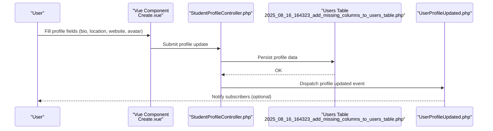
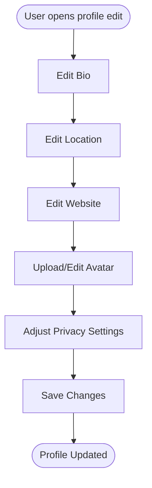
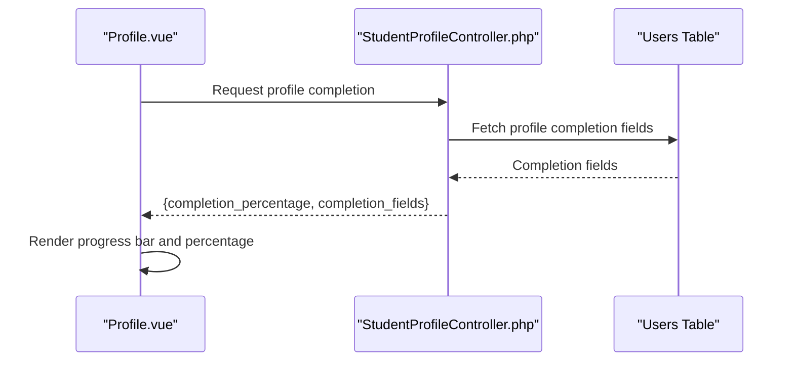
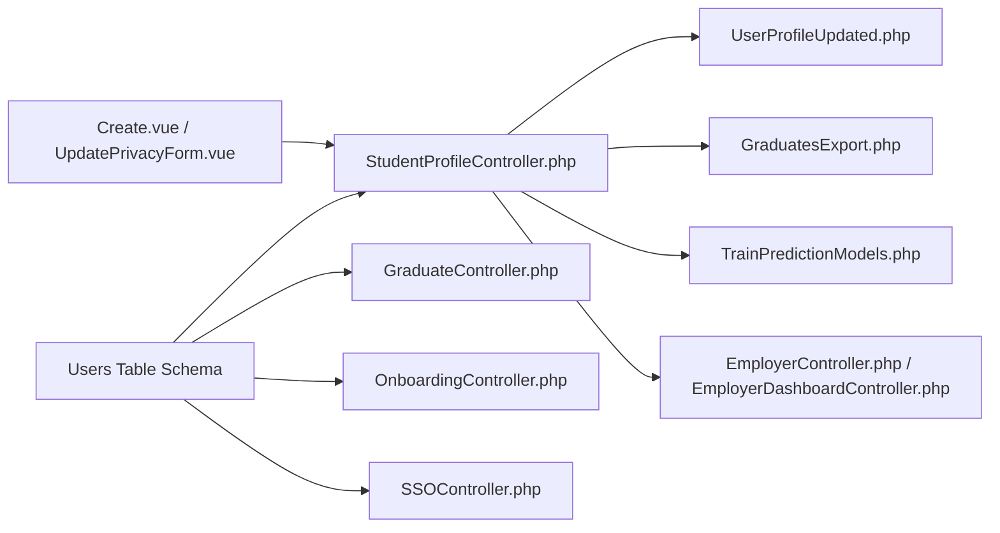

# User Profile Management

<cite>
**Referenced Files in This Document**
- [2025_08_16_164323_add_missing_columns_to_users_table.php](file://database/migrations/2025_08_16_164323_add_missing_columns_to_users_table.php)
- [Create.vue](file://resources/js/Pages/Users/Create.vue)
- [UpdatePrivacyForm.vue](file://resources/js/Pages/Graduates/Partials/UpdatePrivacyForm.vue)
- [Show.vue](file://resources/js/Pages/Graduates/Show.vue)
- [Profile.vue](file://resources/js/Pages/Graduate/Profile.vue)
- [Employer.vue](file://resources/js/Pages/Dashboard/Employer.vue)
- [StudentProfileController.php](file://app/Http/Controllers/Api/StudentProfileController.php)
- [GraduateController.php](file://app/Http/Controllers/GraduateController.php)
- [OnboardingController.php](file://app/Http/Controllers/Api/OnboardingController.php)
- [SSOController.php](file://app/Http/Controllers/Auth/SSOController.php)
- [UserProfileUpdated.php](file://app/Events/UserProfileUpdated.php)
- [GraduatesExport.php](file://app/Exports/GraduatesExport.php)
- [train_prediction_models.php](file://app/Console/Commands/TrainPredictionModels.php)
- [EmployerController.php](file://app/Http/Controllers/EmployerController.php)
- [EmployerDashboardController.php](file://app/Http/Controllers/EmployerDashboardController.php)
</cite>

## Table of Contents
1. [Introduction](#introduction)
2. [Project Structure](#project-structure)
3. [Core Components](#core-components)
4. [Architecture Overview](#architecture-overview)
5. [Detailed Component Analysis](#detailed-component-analysis)
6. [Dependency Analysis](#dependency-analysis)
7. [Performance Considerations](#performance-considerations)
8. [Troubleshooting Guide](#troubleshooting-guide)
9. [Conclusion](#conclusion)

## Introduction
This document describes the user profile management system, focusing on profile data structure, validation, privacy controls, profile completion tracking, and onboarding integration. It covers visibility settings, location privacy options, preference management, completion percentage calculations, and how the system integrates with social profiles and external data sources. Practical examples illustrate avatar management, bio editing, contact information handling, and GDPR-compliant data practices.

## Project Structure
The profile management system spans database migrations, frontend forms, API controllers, export services, and console commands. The frontend Vue components manage user-facing profile editing and privacy controls. Backend controllers handle profile updates, completion metrics, and filtering. Events track profile changes. Exports and training commands leverage profile completion data.

```mermaid
graph TB
subgraph "Frontend"
FE_Create["Create.vue<br/>Profile Creation UI"]
FE_Profile["Profile.vue<br/>Profile Completion UI"]
FE_Show["Show.vue<br/>Graduate Profile View"]
FE_Employer["Employer.vue<br/>Employer Dashboard"]
FE_UpdatePrivacy["UpdatePrivacyForm.vue<br/>Privacy Controls"]
end
subgraph "Backend"
API_StudentProfile["StudentProfileController.php<br/>Profile API"]
API_Graduate["GraduateController.php<br/>Graduate Filtering"]
API_Onboarding["OnboardingController.php<br/>Onboarding State"]
API_SSO["SSOController.php<br/>SSO Integration"]
Event_ProfileUpdated["UserProfileUpdated.php<br/>Profile Change Event"]
Export_Graduates["GraduatesExport.php<br/>Export Profile Completion"]
Cmd_TrainModels["TrainPredictionModels.php<br/>Completion Metrics"]
Ctrl_Employer["EmployerController.php<br/>Employer Views"]
Ctrl_EmployerDash["EmployerDashboardController.php<br/>Employer Dashboard"]
end
DB_Migration["2025_08_16_164323_add_missing_columns_to_users_table.php<br/>Profile Schema"]
FE_Create --> API_StudentProfile
FE_Profile --> API_StudentProfile
FE_Show --> API_StudentProfile
FE_Employer --> Ctrl_Employer
FE_UpdatePrivacy --> API_Graduate
API_StudentProfile --> DB_Migration
API_Graduate --> DB_Migration
API_Onboarding --> DB_Migration
API_SSO --> DB_Migration
Event_ProfileUpdated --> DB_Migration
Export_Graduates --> DB_Migration
Cmd_TrainModels --> DB_Migration
Ctrl_Employer --> DB_Migration
Ctrl_EmployerDash --> DB_Migration
```

**Diagram sources**
- [Create.vue:227-266](file://resources/js/Pages/Users/Create.vue#L227-L266)
- [Profile.vue:61-81](file://resources/js/Pages/Graduate/Profile.vue#L61-L81)
- [Show.vue:285-302](file://resources/js/Pages/Graduates/Show.vue#L285-L302)
- [Employer.vue:269-286](file://resources/js/Pages/Dashboard/Employer.vue#L269-L286)
- [UpdatePrivacyForm.vue:32-112](file://resources/js/Pages/Graduates/Partials/UpdatePrivacyForm.vue#L32-L112)
- [StudentProfileController.php:142-180](file://app/Http/Controllers/Api/StudentProfileController.php#L142-L180)
- [GraduateController.php:99-117](file://app/Http/Controllers/GraduateController.php#L99-L117)
- [OnboardingController.php:27-71](file://app/Http/Controllers/Api/OnboardingController.php#L27-L71)
- [SSOController.php](file://app/Http/Controllers/Auth/SSOController.php#L173)
- [UserProfileUpdated.php](file://app/Events/UserProfileUpdated.php)
- [GraduatesExport.php:180-207](file://app/Exports/GraduatesExport.php#L180-L207)
- [train_prediction_models.php:243-256](file://app/Console/Commands/TrainPredictionModels.php#L243-L256)
- [EmployerController.php](file://app/Http/Controllers/EmployerController.php#L181)
- [EmployerDashboardController.php](file://app/Http/Controllers/EmployerDashboardController.php#L237)
- [2025_08_16_164323_add_missing_columns_to_users_table.php:39-93](file://database/migrations/2025_08_16_164323_add_missing_columns_to_users_table.php#L39-L93)

**Section sources**
- [2025_08_16_164323_add_missing_columns_to_users_table.php:39-93](file://database/migrations/2025_08_16_164323_add_missing_columns_to_users_table.php#L39-L93)
- [Create.vue:227-266](file://resources/js/Pages/Users/Create.vue#L227-L266)
- [UpdatePrivacyForm.vue:32-112](file://resources/js/Pages/Graduates/Partials/UpdatePrivacyForm.vue#L32-L112)
- [Show.vue:285-302](file://resources/js/Pages/Graduates/Show.vue#L285-L302)
- [Profile.vue:61-81](file://resources/js/Pages/Graduate/Profile.vue#L61-L81)
- [Employer.vue:269-286](file://resources/js/Pages/Dashboard/Employer.vue#L269-L286)
- [StudentProfileController.php:142-180](file://app/Http/Controllers/Api/StudentProfileController.php#L142-L180)
- [GraduateController.php:99-117](file://app/Http/Controllers/GraduateController.php#L99-L117)
- [OnboardingController.php:27-71](file://app/Http/Controllers/Api/OnboardingController.php#L27-L71)
- [SSOController.php](file://app/Http/Controllers/Auth/SSOController.php#L173)
- [UserProfileUpdated.php](file://app/Events/UserProfileUpdated.php)
- [GraduatesExport.php:180-207](file://app/Exports/GraduatesExport.php#L180-L207)
- [train_prediction_models.php:243-256](file://app/Console/Commands/TrainPredictionModels.php#L243-L256)
- [EmployerController.php](file://app/Http/Controllers/EmployerController.php#L181)
- [EmployerDashboardController.php](file://app/Http/Controllers/EmployerDashboardController.php#L237)

## Core Components
- Profile data schema: The users table includes profile-related fields such as location, country, region, latitude, longitude, current employment fields, and avatar URL.
- Frontend forms: Vue components capture bio, location, website, avatar URL, and privacy preferences.
- API controllers: Handle profile updates, completion metrics, and filtering by completion percentage.
- Privacy controls: Visibility toggles for profile, contact info, and employment status.
- Completion tracking: Percentage computed from required and optional profile fields.
- Onboarding integration: Tracks dismissal of profile completion prompts.
- SSO integration: Reads SSO configuration from profile data.
- Export and analytics: Exports profile completion and feeds prediction models.

**Section sources**
- [2025_08_16_164323_add_missing_columns_to_users_table.php:39-93](file://database/migrations/2025_08_16_164323_add_missing_columns_to_users_table.php#L39-L93)
- [Create.vue:227-266](file://resources/js/Pages/Users/Create.vue#L227-L266)
- [UpdatePrivacyForm.vue:32-112](file://resources/js/Pages/Graduates/Partials/UpdatePrivacyForm.vue#L32-L112)
- [StudentProfileController.php:142-180](file://app/Http/Controllers/Api/StudentProfileController.php#L142-L180)
- [GraduateController.php:99-117](file://app/Http/Controllers/GraduateController.php#L99-L117)
- [OnboardingController.php:27-71](file://app/Http/Controllers/Api/OnboardingController.php#L27-L71)
- [SSOController.php](file://app/Http/Controllers/Auth/SSOController.php#L173)

## Architecture Overview
The profile management architecture connects frontend forms to API endpoints, which update the database and emit events. Controllers expose profile completion metrics and filtering capabilities. Exports and training commands consume completion data for reporting and analytics.

**Diagram sources**
- [Create.vue:227-266](file://resources/js/Pages/Users/Create.vue#L227-L266)
- [StudentProfileController.php:142-180](file://app/Http/Controllers/Api/StudentProfileController.php#L142-L180)
- [2025_08_16_164323_add_missing_columns_to_users_table.php:39-93](file://database/migrations/2025_08_16_164323_add_missing_columns_to_users_table.php#L39-L93)
- [UserProfileUpdated.php](file://app/Events/UserProfileUpdated.php)

## Detailed Component Analysis

### Profile Data Structure
- Database fields include location, country, region, latitude, longitude, current employment fields (title, company, industry), avatar URL, and privacy-related flags.
- These fields support location privacy, employment visibility, and avatar management.

**Section sources**
- [2025_08_16_164323_add_missing_columns_to_users_table.php:39-93](file://database/migrations/2025_08_16_164323_add_missing_columns_to_users_table.php#L39-L93)

### Frontend Profile Forms
- Additional Information form captures bio, location, and website.
- Avatar URL is stored via the same profile data structure.
- Privacy settings form exposes toggles for profile visibility, contact visibility, and employment visibility.

**Diagram sources**
- [Create.vue:227-266](file://resources/js/Pages/Users/Create.vue#L227-L266)
- [UpdatePrivacyForm.vue:32-112](file://resources/js/Pages/Graduates/Partials/UpdatePrivacyForm.vue#L32-L112)

**Section sources**
- [Create.vue:227-266](file://resources/js/Pages/Users/Create.vue#L227-L266)
- [UpdatePrivacyForm.vue:32-112](file://resources/js/Pages/Graduates/Partials/UpdatePrivacyForm.vue#L32-L112)

### Privacy Controls
- Profile visibility: Toggle to show/hide profile to employers.
- Contact visibility: Toggle to show/hide contact info to employers.
- Employment visibility: Toggle to show/hide current employment details.
- Privacy notice informs users about data sharing and institutional access.

**Section sources**
- [UpdatePrivacyForm.vue:32-112](file://resources/js/Pages/Graduates/Partials/UpdatePrivacyForm.vue#L32-L112)
- [Show.vue:285-302](file://resources/js/Pages/Graduates/Show.vue#L285-L302)

### Profile Completion Tracking
- Completion percentage is computed and surfaced in multiple places:
  - Graduate profile page: Progress bar and percentage.
  - Employer dashboard: Profile status card with percentage and progress bar.
- The API returns completion percentage and completion fields for consumption by clients.

**Diagram sources**
- [Profile.vue:61-81](file://resources/js/Pages/Graduate/Profile.vue#L61-L81)
- [Employer.vue:269-286](file://resources/js/Pages/Dashboard/Employer.vue#L269-L286)
- [StudentProfileController.php:142-180](file://app/Http/Controllers/Api/StudentProfileController.php#L142-L180)

**Section sources**
- [Profile.vue:61-81](file://resources/js/Pages/Graduate/Profile.vue#L61-L81)
- [Employer.vue:269-286](file://resources/js/Pages/Dashboard/Employer.vue#L269-L286)
- [StudentProfileController.php:142-180](file://app/Http/Controllers/Api/StudentProfileController.php#L142-L180)

### Onboarding Integration
- Onboarding controller manages dismissal of profile completion prompts.
- Validation ensures dismissal flag is boolean when present.

**Section sources**
- [OnboardingController.php:27-71](file://app/Http/Controllers/Api/OnboardingController.php#L27-L71)

### SSO and External Data Sources
- SSO configuration is read from profile data for single sign-on flows.
- This enables integration with external identity providers using stored configuration identifiers.

**Section sources**
- [SSOController.php](file://app/Http/Controllers/Auth/SSOController.php#L173)

### Filtering and Sorting by Profile Completion
- Graduate controller supports filtering by minimum profile completion percentage.
- Sorting options include profile completion percentage alongside other attributes.

**Section sources**
- [GraduateController.php:99-117](file://app/Http/Controllers/GraduateController.php#L99-L117)

### Export and Analytics
- Graduates export includes profile completion percentage and labels.
- Training commands consume profile completion data for predictive modeling.

**Section sources**
- [GraduatesExport.php:180-207](file://app/Exports/GraduatesExport.php#L180-L207)
- [train_prediction_models.php:243-256](file://app/Console/Commands/TrainPredictionModels.php#L243-L256)

### Employer Views and Completion Metrics
- Employer controller and dashboard controller surface profile completion percentages for employer-facing dashboards.

**Section sources**
- [EmployerController.php](file://app/Http/Controllers/EmployerController.php#L181)
- [EmployerDashboardController.php](file://app/Http/Controllers/EmployerDashboardController.php#L237)

## Dependency Analysis
Profile management depends on:
- Database schema for storing profile fields and privacy settings.
- Frontend components for capturing user input.
- API controllers for persistence and retrieval.
- Events for notifying downstream systems.
- Export and training components for reporting and analytics.

**Diagram sources**
- [2025_08_16_164323_add_missing_columns_to_users_table.php:39-93](file://database/migrations/2025_08_16_164323_add_missing_columns_to_users_table.php#L39-L93)
- [StudentProfileController.php:142-180](file://app/Http/Controllers/Api/StudentProfileController.php#L142-L180)
- [GraduateController.php:99-117](file://app/Http/Controllers/GraduateController.php#L99-L117)
- [OnboardingController.php:27-71](file://app/Http/Controllers/Api/OnboardingController.php#L27-L71)
- [SSOController.php](file://app/Http/Controllers/Auth/SSOController.php#L173)
- [Create.vue:227-266](file://resources/js/Pages/Users/Create.vue#L227-L266)
- [UpdatePrivacyForm.vue:32-112](file://resources/js/Pages/Graduates/Partials/UpdatePrivacyForm.vue#L32-L112)
- [UserProfileUpdated.php](file://app/Events/UserProfileUpdated.php)
- [GraduatesExport.php:180-207](file://app/Exports/GraduatesExport.php#L180-L207)
- [train_prediction_models.php:243-256](file://app/Console/Commands/TrainPredictionModels.php#L243-L256)
- [EmployerController.php](file://app/Http/Controllers/EmployerController.php#L181)
- [EmployerDashboardController.php](file://app/Http/Controllers/EmployerDashboardController.php#L237)

**Section sources**
- [2025_08_16_164323_add_missing_columns_to_users_table.php:39-93](file://database/migrations/2025_08_16_164323_add_missing_columns_to_users_table.php#L39-L93)
- [StudentProfileController.php:142-180](file://app/Http/Controllers/Api/StudentProfileController.php#L142-L180)
- [GraduateController.php:99-117](file://app/Http/Controllers/GraduateController.php#L99-L117)
- [OnboardingController.php:27-71](file://app/Http/Controllers/Api/OnboardingController.php#L27-L71)
- [SSOController.php](file://app/Http/Controllers/Auth/SSOController.php#L173)
- [Create.vue:227-266](file://resources/js/Pages/Users/Create.vue#L227-L266)
- [UpdatePrivacyForm.vue:32-112](file://resources/js/Pages/Graduates/Partials/UpdatePrivacyForm.vue#L32-L112)
- [UserProfileUpdated.php](file://app/Events/UserProfileUpdated.php)
- [GraduatesExport.php:180-207](file://app/Exports/GraduatesExport.php#L180-L207)
- [train_prediction_models.php:243-256](file://app/Console/Commands/TrainPredictionModels.php#L243-L256)
- [EmployerController.php](file://app/Http/Controllers/EmployerController.php#L181)
- [EmployerDashboardController.php](file://app/Http/Controllers/EmployerDashboardController.php#L237)

## Performance Considerations
- Keep profile completion calculations lightweight by caching frequently accessed fields.
- Use pagination and filtering (e.g., minimum completion percentage) when listing graduates to reduce payload sizes.
- Minimize re-renders in Vue components by updating only changed fields.
- Offload heavy analytics tasks to background jobs or scheduled commands.

## Troubleshooting Guide
- Profile not updating: Verify API endpoints receive required fields and that validation passes. Check database migration for missing columns.
- Privacy settings not persisting: Confirm frontend form binds to correct keys and API controller stores privacy settings.
- Completion percentage incorrect: Ensure the API returns accurate completion fields and frontend renders the percentage correctly.
- Export missing completion data: Confirm export includes the profile completion column and labels.

**Section sources**
- [2025_08_16_164323_add_missing_columns_to_users_table.php:39-93](file://database/migrations/2025_08_16_164323_add_missing_columns_to_users_table.php#L39-L93)
- [StudentProfileController.php:142-180](file://app/Http/Controllers/Api/StudentProfileController.php#L142-L180)
- [GraduateController.php:99-117](file://app/Http/Controllers/GraduateController.php#L99-L117)
- [GraduatesExport.php:180-207](file://app/Exports/GraduatesExport.php#L180-L207)

## Conclusion
The user profile management system integrates frontend forms, backend APIs, privacy controls, completion tracking, and analytics. It supports location privacy, employment visibility, avatar management, and onboarding integration. The modular design allows extensions for additional external integrations while maintaining clear separation of concerns across components.