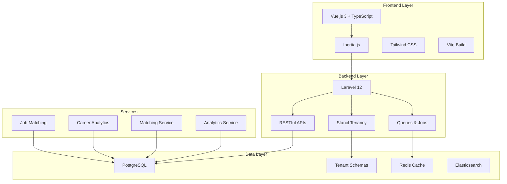
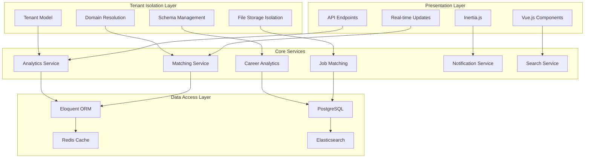
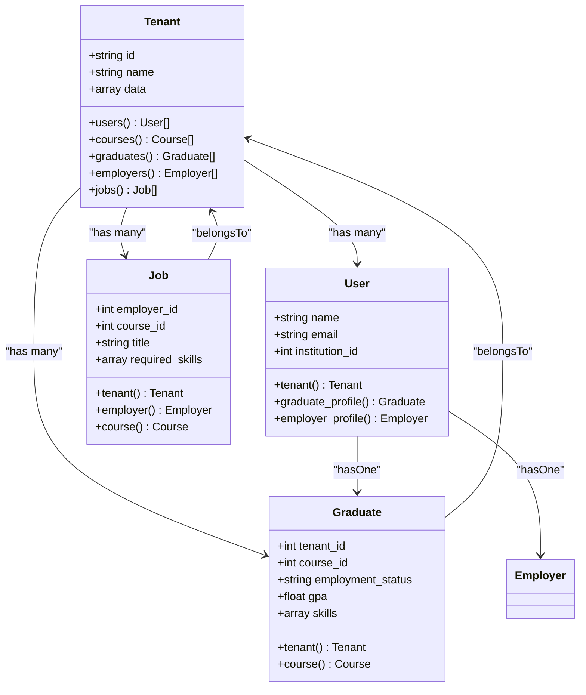
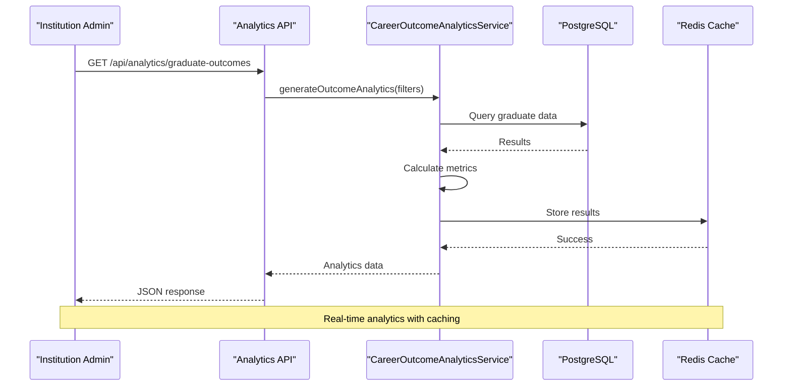
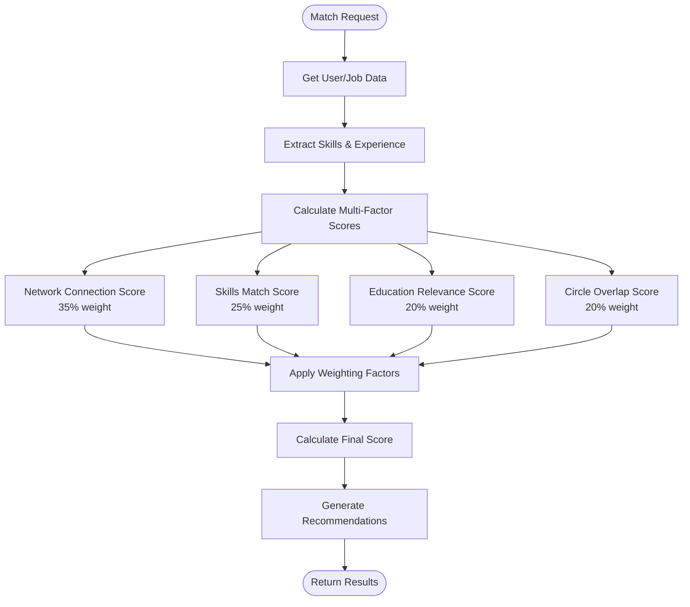
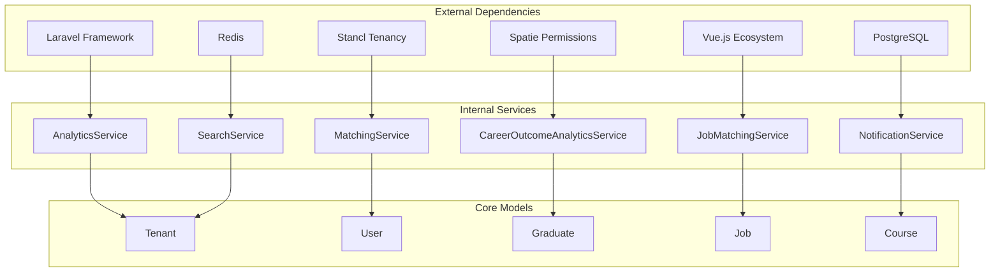

# Project Overview

<cite>
**Referenced Files in This Document**
- [README.md](file://README.md)
- [composer.json](file://composer.json)
- [package.json](file://package.json)
- [config/app.php](file://config/app.php)
- [config/tenancy.php](file://config/tenancy.php)
- [routes/web.php](file://routes/web.php)
- [app/Services/AnalyticsService.php](file://app/Services/AnalyticsService.php)
- [app/Services/MatchingService.php](file://app/Services/MatchingService.php)
- [app/Services/JobMatchingService.php](file://app/Services/JobMatchingService.php)
- [app/Services/CareerOutcomeAnalyticsService.php](file://app/Services/CareerOutcomeAnalyticsService.php)
- [app/Models/Tenant.php](file://app/Models/Tenant.php)
- [app/Models/User.php](file://app/Models/User.php)
- [app/Models/Graduate.php](file://app/Models/Graduate.php)
- [app/Models/Job.php](file://app/Models/Job.php)
</cite>

## Table of Contents
1. [Introduction](#introduction)
2. [Project Structure](#project-structure)
3. [Core Components](#core-components)
4. [Architecture Overview](#architecture-overview)
5. [Detailed Component Analysis](#detailed-component-analysis)
6. [Dependency Analysis](#dependency-analysis)
7. [Performance Considerations](#performance-considerations)
8. [Troubleshooting Guide](#troubleshooting-guide)
9. [Conclusion](#conclusion)

## Introduction
Alumate is a modern, multi-tenant alumni networking platform designed to connect educational institutions, alumni, employers, and students within a unified digital ecosystem. Its mission is to bridge the gap between education and career success by enabling meaningful connections, providing powerful analytics, and delivering intelligent matching systems that drive outcomes for all stakeholders.

Key value propositions:
- Unified ecosystem for institutions, alumni, employers, and students
- Multi-tenant architecture ensuring complete data isolation and customization per institution
- Intelligent matching systems for jobs and career opportunities
- Comprehensive career analytics and insights for institutional success tracking
- Modern, responsive user experience with progressive web app capabilities

Target audiences:
- Educational institutions seeking to track alumni success and improve program outcomes
- Graduates advancing their careers and building professional networks
- Employers discovering top talent and managing recruitment workflows
- Students accessing mentorship, networking, and career development resources

Core differentiators:
- True multi-tenant isolation with domain-based tenant resolution
- Advanced analytics and reporting with predictive capabilities
- Intelligent matching powered by AI and machine learning
- Comprehensive career lifecycle tracking from enrollment to placement
- Developer-friendly architecture with extensive APIs and integrations

## Project Structure
The platform follows a Laravel backend with Vue.js frontend architecture, organized into cohesive modules supporting multi-tenancy, analytics, and matching systems.

**Diagram sources**
- [composer.json:11-22](file://composer.json#L11-L22)
- [package.json:48-81](file://package.json#L48-L81)
- [config/tenancy.php:28-36](file://config/tenancy.php#L28-L36)

**Section sources**
- [README.md:236-264](file://README.md#L236-L264)
- [composer.json:11-22](file://composer.json#L11-L22)
- [package.json:48-81](file://package.json#L48-L81)

## Core Components
The platform consists of several interconnected components that work together to deliver the multi-tenant alumni networking experience.

### Multi-Tenant Architecture
The system implements complete tenant isolation through Stancl Tenancy, providing automatic tenant resolution, isolated databases, and centralized management capabilities.

Key tenant features:
- Domain-based tenant identification and routing
- Complete data separation between institutions
- Tenant-specific branding and customization
- Centralized super admin management
- Isolated file storage and caching per tenant

### Analytics & Insights Engine
Comprehensive analytics system providing real-time insights into platform usage, graduate outcomes, and institutional performance metrics.

Analytics capabilities include:
- Engagement metrics and community health indicators
- Graduate outcome tracking and ROI calculations
- Employer engagement and hiring analytics
- Predictive modeling for career outcomes
- Custom report generation and export capabilities

### Intelligent Matching Systems
Advanced matching algorithms connecting graduates with relevant job opportunities and employers with qualified candidates.

Matching features:
- Multi-factor scoring combining skills, experience, and network connections
- AI-powered recommendations with confidence scoring
- Course compatibility and career path alignment
- Real-time match updates and notifications
- Performance tracking and optimization

### User Management & Social Features
Comprehensive user management system supporting multiple user types with role-based access control and social networking capabilities.

User types and capabilities:
- Super Admin: System-wide management and analytics
- Institution Admin: Graduate and course management within their institution
- Employer: Job posting, candidate search, and application management
- Graduate: Profile management, job applications, and career tracking

**Section sources**
- [README.md:602-620](file://README.md#L602-L620)
- [README.md:492-517](file://README.md#L492-L517)
- [README.md:179-235](file://README.md#L179-L235)
- [app/Models/Tenant.php:11-86](file://app/Models/Tenant.php#L11-L86)

## Architecture Overview
The platform employs a modern microservices-ready architecture with clear separation of concerns and scalable infrastructure patterns.

**Diagram sources**
- [config/tenancy.php:12-82](file://config/tenancy.php#L12-L82)
- [app/Services/AnalyticsService.php:22-800](file://app/Services/AnalyticsService.php#L22-L800)
- [app/Services/MatchingService.php:12-493](file://app/Services/MatchingService.php#L12-L493)

The architecture ensures:
- Complete tenant data isolation with automatic schema management
- Scalable analytics with caching and search integration
- Real-time communication through queues and notifications
- RESTful API design supporting frontend frameworks
- Progressive web app capabilities for offline functionality

**Section sources**
- [config/tenancy.php:12-82](file://config/tenancy.php#L12-L82)
- [config/app.php:119-158](file://config/app.php#L119-L158)

## Detailed Component Analysis

### Multi-Tenant Implementation
The tenant system provides complete isolation between educational institutions while maintaining a unified platform experience.

**Diagram sources**
- [app/Models/Tenant.php:11-86](file://app/Models/Tenant.php#L11-L86)
- [app/Models/User.php:13-818](file://app/Models/User.php#L13-L818)
- [app/Models/Graduate.php:11-243](file://app/Models/Graduate.php#L11-L243)
- [app/Models/Job.php:9-573](file://app/Models/Job.php#L9-L573)

### Analytics & Career Outcome System
The analytics engine provides comprehensive insights into graduate outcomes, institutional performance, and career trends.

**Diagram sources**
- [app/Services/CareerOutcomeAnalyticsService.php:15-511](file://app/Services/CareerOutcomeAnalyticsService.php#L15-L511)
- [app/Services/AnalyticsService.php:22-800](file://app/Services/AnalyticsService.php#L22-L800)

### Intelligent Matching Engine
The matching system combines multiple factors to provide personalized recommendations for both job seekers and employers.

**Diagram sources**
- [app/Services/JobMatchingService.php:12-362](file://app/Services/JobMatchingService.php#L12-L362)
- [app/Services/MatchingService.php:12-493](file://app/Services/MatchingService.php#L12-L493)

**Section sources**
- [app/Models/Tenant.php:11-86](file://app/Models/Tenant.php#L11-L86)
- [app/Services/CareerOutcomeAnalyticsService.php:15-511](file://app/Services/CareerOutcomeAnalyticsService.php#L15-L511)
- [app/Services/JobMatchingService.php:12-362](file://app/Services/JobMatchingService.php#L12-L362)
- [app/Services/MatchingService.php:12-493](file://app/Services/MatchingService.php#L12-L493)

### Technology Stack Summary
The platform leverages modern technologies to deliver a scalable, maintainable, and performant solution.

Backend technologies:
- **Framework**: Laravel 12 with PHP 8.3+ for robust server-side development
- **Multi-Tenancy**: Stancl Tenancy package for complete tenant isolation
- **Database**: PostgreSQL with tenant-specific schemas for data separation
- **Authentication**: Laravel Breeze with Spatie Permissions for RBAC
- **API**: RESTful APIs with comprehensive validation and documentation
- **Queue System**: Redis-backed job processing for background tasks
- **Caching**: Multi-layer caching strategy for performance optimization

Frontend technologies:
- **Framework**: Vue.js 3 with Composition API for reactive user interfaces
- **Type Safety**: Full TypeScript implementation for enhanced development experience
- **UI Framework**: Tailwind CSS with Shadcn/Vue components for consistent design
- **State Management**: Pinia for complex state handling and component communication
- **Build Tool**: Vite for optimized development and production builds
- **Testing**: Vitest for unit and integration testing with comprehensive coverage

Infrastructure:
- **Containerization**: Docker support for consistent development and production environments
- **CI/CD**: Automated testing and deployment pipelines for reliable releases
- **Monitoring**: Application performance monitoring and error tracking
- **Security**: Multi-layer security with audit logging and compliance features
- **Backup**: Automated database and file backups for data protection

**Section sources**
- [README.md:236-264](file://README.md#L236-L264)
- [composer.json:11-22](file://composer.json#L11-L22)
- [package.json:48-81](file://package.json#L48-L81)

## Dependency Analysis
The platform maintains clean dependency relationships with well-defined interfaces between components.

**Diagram sources**
- [composer.json:11-22](file://composer.json#L11-L22)
- [package.json:48-81](file://package.json#L48-L81)
- [app/Services/AnalyticsService.php:5-20](file://app/Services/AnalyticsService.php#L5-L20)

The dependency structure ensures:
- Loose coupling between services and models
- Clear separation of concerns across functional areas
- Extensible architecture supporting future feature additions
- Consistent data access patterns through Eloquent ORM
- Efficient caching and search integration

**Section sources**
- [composer.json:11-22](file://composer.json#L11-L22)
- [package.json:48-81](file://package.json#L48-L81)

## Performance Considerations
The platform implements several performance optimization strategies to ensure scalability and responsiveness.

Key performance features:
- **Database Optimization**: Eager loading strategies, indexed queries, and connection pooling
- **Caching Strategy**: Multi-level caching with Redis for frequently accessed data
- **Background Processing**: Queue-based job processing for heavy computations
- **Asset Optimization**: Image compression, lazy loading, and CDN integration
- **Search Performance**: Elasticsearch integration for fast global search capabilities
- **API Efficiency**: Optimized endpoints with selective field loading and pagination

Scalability characteristics:
- **Horizontal Scaling**: Support for multiple server instances behind load balancers
- **Database Separation**: Tenant-specific schemas preventing cross-institution queries
- **Microservice Ready**: Modular architecture supporting service decomposition
- **Monitoring Integration**: Real-time performance metrics and alerting systems

**Section sources**
- [README.md:584-601](file://README.md#L584-L601)
- [app/Services/AnalyticsService.php:30-44](file://app/Services/AnalyticsService.php#L30-L44)

## Troubleshooting Guide
Common issues and their solutions:

### Multi-Tenant Issues
- **Tenant Resolution Problems**: Verify domain configuration in tenancy settings
- **Data Isolation Failures**: Check tenant initialization and schema management
- **Cross-Tenant Access**: Review tenant scoping and middleware configuration

### Performance Issues
- **Slow Analytics Queries**: Implement proper indexing and caching strategies
- **Matching Algorithm Delays**: Optimize scoring calculations and database queries
- **Search Performance**: Configure Elasticsearch properly and tune search parameters

### Integration Problems
- **API Authentication**: Verify JWT tokens and API key configurations
- **Notification Delivery**: Check queue workers and notification service configuration
- **File Upload Issues**: Validate storage permissions and disk configuration

### Development Environment
- **Database Migration**: Ensure proper tenant migrations and schema setup
- **Frontend Compilation**: Check Vite configuration and asset compilation
- **Testing Environment**: Verify test database setup and test data generation

**Section sources**
- [config/tenancy.php:12-82](file://config/tenancy.php#L12-L82)
- [routes/web.php:118-133](file://routes/web.php#L118-L133)

## Conclusion
Alumate represents a comprehensive solution for modern alumni networking, combining multi-tenant architecture with advanced analytics and intelligent matching systems. The platform successfully addresses the needs of educational institutions seeking to track graduate success while providing valuable networking and career development opportunities for alumni, employers, and students.

The technology stack ensures scalability, maintainability, and performance, while the modular architecture supports future enhancements and feature additions. The combination of real-time analytics, predictive modeling, and AI-powered matching creates a powerful ecosystem that drives meaningful connections and career outcomes across the entire educational community.

Through its commitment to data privacy, security, and institutional customization, Alumate provides a solid foundation for educational institutions to build lasting relationships with their graduates while supporting their career development journey from enrollment through professional success.