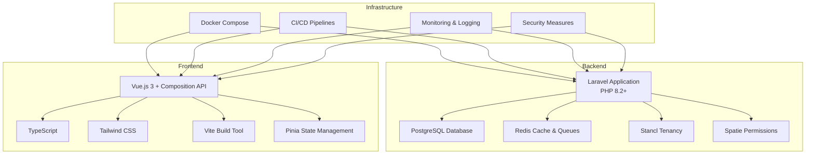
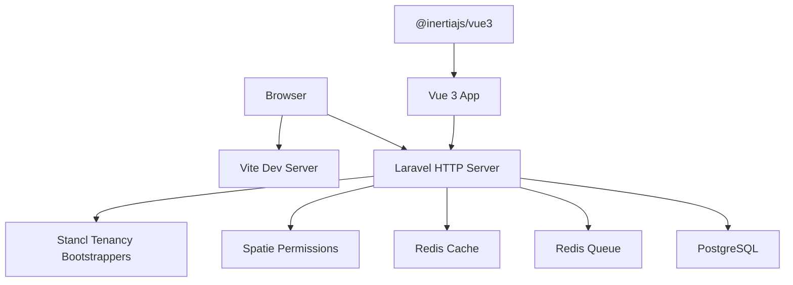
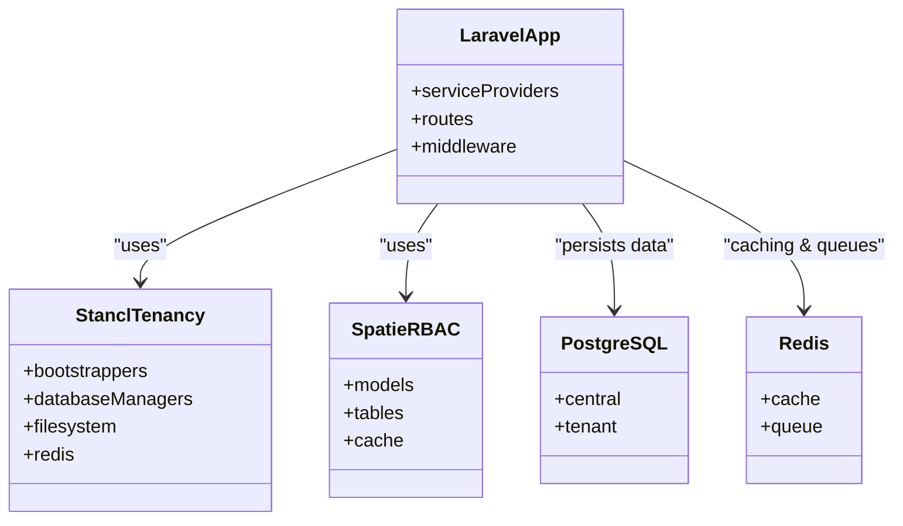
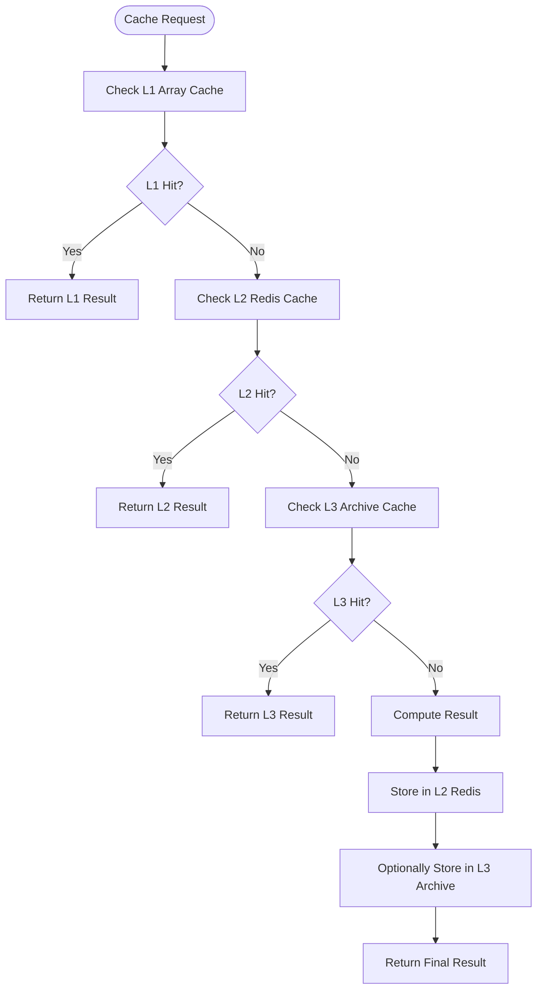
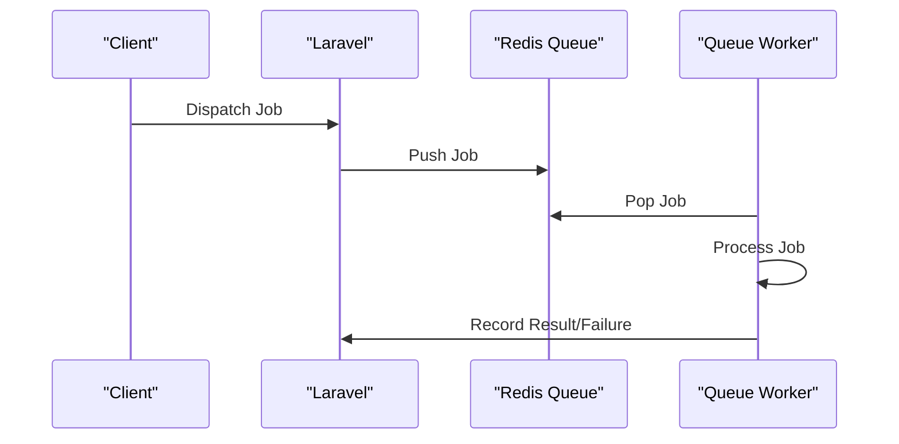
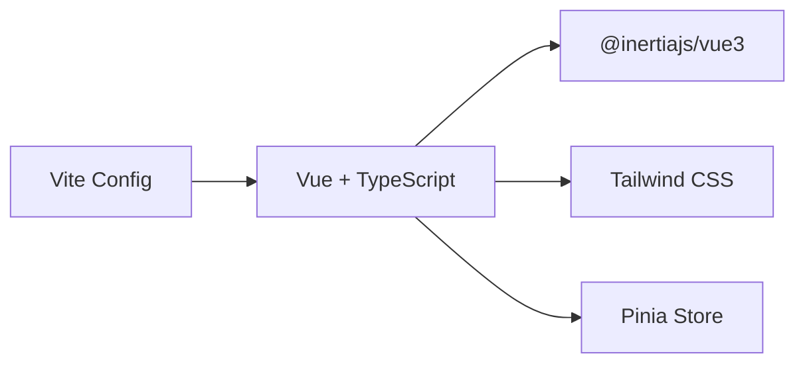
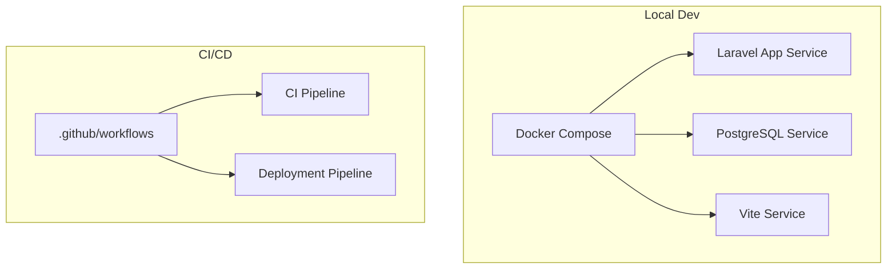
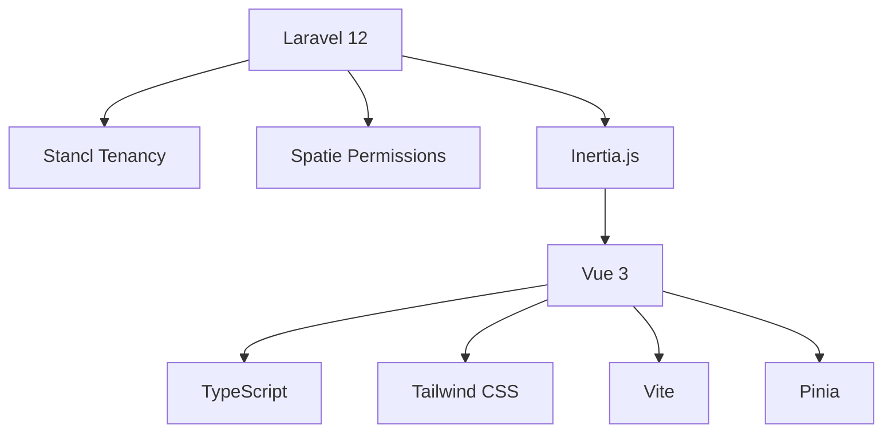

# Technology Stack Overview

<cite>
**Referenced Files in This Document**
- [composer.json](file://composer.json)
- [package.json](file://package.json)
- [docker-compose.yml](file://docker-compose.yml)
- [config/app.php](file://config/app.php)
- [config/database.php](file://config/database.php)
- [config/cache.php](file://config/cache.php)
- [config/queue.php](file://config/queue.php)
- [config/permission.php](file://config/permission.php)
- [config/tenancy.php](file://config/tenancy.php)
- [vite.config.ts](file://vite.config.ts)
- [tailwind.config.js](file://tailwind.config.js)
- [tsconfig.json](file://tsconfig.json)
- [.eslintrc-auto-import.json](file://.eslintrc-auto-import.json)
- [eslint.config.js](file://eslint.config.js)
- [postcss.config.js](file://postcss.config.js)
- [.prettierrc](file://.prettierrc)
</cite>

## Table of Contents
1. [Introduction](#introduction)
2. [Project Structure](#project-structure)
3. [Core Components](#core-components)
4. [Architecture Overview](#architecture-overview)
5. [Detailed Component Analysis](#detailed-component-analysis)
6. [Dependency Analysis](#dependency-analysis)
7. [Performance Considerations](#performance-considerations)
8. [Troubleshooting Guide](#troubleshooting-guide)
9. [Conclusion](#conclusion)

## Introduction
This document presents the complete technology foundation of the Alumate platform, detailing the backend, frontend, and infrastructure components. It explains the rationale behind each technology choice, how they integrate, and how the stack supports scalability and performance. The backend is built on Laravel 12 with PHP 8.2+ and PostgreSQL, augmented by Stancl Tenancy for multi-tenancy, Redis for caching and queues, and Spatie Permissions for role-based access control. The frontend leverages Vue.js 3 with Composition API, TypeScript for type safety, Tailwind CSS for styling, Vite for build tooling, and Pinia for state management. Infrastructure includes Docker support, CI/CD pipelines, monitoring systems, and security measures.

## Project Structure
The repository follows a layered structure:
- Backend: Laravel application under the app/ directory with extensive services, models, jobs, notifications, and policies.
- Frontend: Vue 3 application under resources/js with TypeScript, component libraries, and UI primitives.
- Configuration: Laravel configuration files under config/, Vite configuration under vite.config.ts, Tailwind under tailwind.config.js, and TypeScript under tsconfig.json.
- Infrastructure: Docker Compose under docker-compose.yml, linting and formatting under ESLint and Prettier configurations.

**Section sources**
- [composer.json:11-22](file://composer.json#L11-L22)
- [package.json:48-81](file://package.json#L48-L81)
- [docker-compose.yml:3-52](file://docker-compose.yml#L3-L52)

## Core Components
- Backend framework and runtime
  - Laravel 12 with PHP 8.2+ for robust MVC architecture, routing, middleware, and service container.
  - PostgreSQL configured as the primary relational database with central/tenant connection profiles.
  - Redis configured for cache and queue backends, enabling high-performance caching and asynchronous job processing.
  - Stancl Tenancy providing multi-tenancy bootstrapping, database schema management, cache isolation, and filesystem separation.
  - Spatie Permissions implementing role-based access control with configurable cache and table names.

- Frontend framework and toolchain
  - Vue.js 3 with Composition API for reactive UI components and modular architecture.
  - TypeScript for type safety and improved developer experience.
  - Tailwind CSS for utility-first styling and responsive design.
  - Vite for fast development server, HMR, and optimized production builds with code splitting.
  - Pinia for centralized state management.

- Infrastructure and tooling
  - Docker Compose for local development environments with app, PostgreSQL, and Vite services.
  - ESLint and Prettier for code quality and formatting.
  - CI/CD pipelines for automated testing, building, and deployment.

**Section sources**
- [composer.json:11-22](file://composer.json#L11-L22)
- [config/database.php:92-135](file://config/database.php#L92-L135)
- [config/cache.php:140-144](file://config/cache.php#L140-L144)
- [config/queue.php:66-73](file://config/queue.php#L66-L73)
- [config/tenancy.php:21-27](file://config/tenancy.php#L21-L27)
- [config/permission.php:5-28](file://config/permission.php#L5-L28)
- [package.json:48-81](file://package.json#L48-L81)
- [vite.config.ts:6-24](file://vite.config.ts#L6-L24)
- [docker-compose.yml:3-52](file://docker-compose.yml#L3-L52)

## Architecture Overview
The platform employs a multi-tenant backend with a decoupled frontend:
- Backend: Laravel handles HTTP requests, business logic, persistence, and tenant isolation. Redis powers caching and queues; PostgreSQL stores tenant and central data.
- Frontend: Vue 3 with TypeScript manages UI rendering, state, and interactions. Vite optimizes assets and enables hot module replacement during development.
- Integration: Inertia.js bridges Laravel and Vue, enabling server-driven rendering and seamless SPA-like navigation.

**Diagram sources**
- [config/tenancy.php:21-27](file://config/tenancy.php#L21-L27)
- [config/permission.php:5-28](file://config/permission.php#L5-L28)
- [config/cache.php:140-144](file://config/cache.php#L140-L144)
- [config/queue.php:66-73](file://config/queue.php#L66-L73)
- [config/database.php:92-135](file://config/database.php#L92-L135)
- [vite.config.ts:6-24](file://vite.config.ts#L6-L24)

## Detailed Component Analysis

### Backend Framework and Multi-Tenancy
- Laravel 12 with PHP 8.2+
  - Service providers include Redis, Auth, Database, and Tenancy provider, indicating integrated caching, authentication, persistence, and multi-tenancy.
- Stancl Tenancy
  - Bootstrappers for database, cache, filesystem, queue, and Redis ensure tenant isolation across services.
  - PostgreSQL schema manager configured for tenant databases.
  - Central and tenant connection profiles defined for multi-tenant deployments.
- Spatie Permissions
  - Configurable models, table names, and cache settings for roles and permissions.
  - Cache expiration and store selection for performance.

**Diagram sources**
- [config/app.php:153-157](file://config/app.php#L153-L157)
- [config/tenancy.php:21-27](file://config/tenancy.php#L21-L27)
- [config/tenancy.php:34](file://config/tenancy.php#L34)
- [config/permission.php:5-28](file://config/permission.php#L5-L28)
- [config/database.php:92-135](file://config/database.php#L92-L135)
- [config/cache.php:140-144](file://config/cache.php#L140-L144)
- [config/queue.php:66-73](file://config/queue.php#L66-L73)

**Section sources**
- [config/app.php:153-157](file://config/app.php#L153-L157)
- [config/tenancy.php:21-27](file://config/tenancy.php#L21-L27)
- [config/tenancy.php:34](file://config/tenancy.php#L34)
- [config/permission.php:5-28](file://config/permission.php#L5-L28)

### Database and Caching Strategy
- PostgreSQL
  - Default connection set to pgsql; central and tenant connection profiles defined for multi-tenant schema management.
- Redis
  - Separate cache and default connections configured; queue driver set to redis.
- Multi-Layer Template Caching
  - Dedicated stores for L1/L2/L3 cache layers with TTLs, compression, tagging, and tenant isolation policies.

**Diagram sources**
- [config/database.php:92-135](file://config/database.php#L92-L135)
- [config/cache.php:140-144](file://config/cache.php#L140-L144)
- [config/cache.php:195-217](file://config/cache.php#L195-L217)
- [config/cache.php:229-234](file://config/cache.php#L229-L234)

**Section sources**
- [config/database.php:19](file://config/database.php#L19)
- [config/database.php:92-135](file://config/database.php#L92-L135)
- [config/cache.php:140-144](file://config/cache.php#L140-L144)
- [config/cache.php:195-217](file://config/cache.php#L195-L217)
- [config/cache.php:229-234](file://config/cache.php#L229-L234)

### Queue and Background Processing
- Queue driver configured to redis with queue name, retry_after, and block_for settings.
- Failed job logging configured to database-uuids.

**Diagram sources**
- [config/queue.php:66-73](file://config/queue.php#L66-L73)
- [config/queue.php:106-110](file://config/queue.php#L106-L110)

**Section sources**
- [config/queue.php:16](file://config/queue.php#L16)
- [config/queue.php:66-73](file://config/queue.php#L66-L73)
- [config/queue.php:106-110](file://config/queue.php#L106-L110)

### Frontend Stack: Vue 3, TypeScript, Tailwind, Vite, Pinia
- Vue 3 with Composition API and Inertia.js for seamless Laravel-Vue integration.
- TypeScript configured with strict checks, ESNext target, and bundler module resolution.
- Tailwind CSS with custom theme, animations, and safe-area spacing.
- Vite configured with code splitting, aliases, proxying, and optimized asset chunking.
- Pinia for global state management.

**Diagram sources**
- [vite.config.ts:6-24](file://vite.config.ts#L6-L24)
- [vite.config.ts:110-117](file://vite.config.ts#L110-L117)
- [vite.config.ts:139-152](file://vite.config.ts#L139-L152)
- [tsconfig.json:14-47](file://tsconfig.json#L14-L47)
- [tailwind.config.js:11-102](file://tailwind.config.js#L11-L102)

**Section sources**
- [package.json:48-81](file://package.json#L48-L81)
- [vite.config.ts:6-24](file://vite.config.ts#L6-L24)
- [vite.config.ts:110-117](file://vite.config.ts#L110-L117)
- [vite.config.ts:139-152](file://vite.config.ts#L139-L152)
- [tsconfig.json:14-47](file://tsconfig.json#L14-L47)
- [tailwind.config.js:11-102](file://tailwind.config.js#L11-L102)

### Infrastructure and DevOps
- Docker Compose
  - Laravel app service with PHP Artisan server, PostgreSQL service, and Vite service.
  - Ports mapped for app (8080), database (5433), and Vite (5100).
- CI/CD
  - GitHub Actions workflows for CI, homepage deployment, and production deployment.
- Monitoring and Logging
  - Laravel Pail integrated via Composer scripts for log tailing.
- Security
  - Laravel encryption cipher AES-256-CBC, APP_KEY configuration, and timezone UTC.
  - CSRF protection via Laravel middleware and secure cookie settings.

**Diagram sources**
- [docker-compose.yml:3-52](file://docker-compose.yml#L3-L52)
- [composer.json:63-75](file://composer.json#L63-L75)

**Section sources**
- [docker-compose.yml:3-52](file://docker-compose.yml#L3-L52)
- [composer.json:63-75](file://composer.json#L63-L75)

## Dependency Analysis
- Backend dependencies
  - Laravel framework, Inertia for SSR, socialite, tinker, maatwebsite/excel, pusher, spatie/laravel-permission, stancl/tenancy, tightenco/ziggy.
- Frontend dependencies
  - Vue 3, @inertiajs/vue3, TypeScript, Tailwind CSS, Pinia, chart.js, lucide-vue-next, date-fns, ziggy-js, zod, vite, laravel-vite-plugin.

**Diagram sources**
- [composer.json:11-22](file://composer.json#L11-L22)
- [package.json:48-81](file://package.json#L48-L81)

**Section sources**
- [composer.json:11-22](file://composer.json#L11-L22)
- [package.json:48-81](file://package.json#L48-L81)

## Performance Considerations
- Multi-tenant caching
  - Tenant isolation with cache tag support and cross-tenant access blocked to prevent data leakage.
  - L1/L2/L3 cache layers with TTLs and compression to balance latency and throughput.
- Redis-backed queues
  - Asynchronous job processing with configurable retry and blocking behavior.
- Frontend optimization
  - Vite code splitting and chunk naming for large component libraries and admin/analytics pages.
  - Asset optimization with esbuild minification and Tailwind purging via content globs.
- Database tuning
  - PostgreSQL central/tenant connections with schema management for tenant isolation.

[No sources needed since this section provides general guidance]

## Troubleshooting Guide
- Laravel service providers
  - Verify Redis, Auth, Database, and Tenancy providers are loaded to ensure caching, authentication, persistence, and multi-tenancy are active.
- Redis connectivity
  - Confirm REDIS_* environment variables and connection names align with cache and queue configurations.
- PostgreSQL connections
  - Validate DB_CONNECTION and tenant/central connection settings for multi-tenant schema management.
- Frontend asset pipeline
  - Check Vite server host/port, proxy targets, and CORS origins to resolve cross-origin issues.
- TypeScript diagnostics
  - Review tsconfig strictness and bundler module resolution to avoid import resolution errors.
- Code quality
  - Use ESLint and Prettier configurations to maintain consistent formatting and catch common issues early.

**Section sources**
- [config/app.php:153-157](file://config/app.php#L153-L157)
- [config/cache.php:181-209](file://config/cache.php#L181-L209)
- [config/queue.php:66-73](file://config/queue.php#L66-L73)
- [vite.config.ts:119-138](file://vite.config.ts#L119-L138)
- [tsconfig.json:14-47](file://tsconfig.json#L14-L47)
- [eslint.config.js:6-19](file://eslint.config.js#L6-L19)
- [.prettierrc:1-19](file://.prettierrc#L1-L19)

## Conclusion
The Alumate platform combines Laravel 12 with PHP 8.2+, PostgreSQL, Stancl Tenancy, Redis, and Spatie Permissions to deliver a scalable, secure, and maintainable backend. The frontend stack—Vue 3, TypeScript, Tailwind CSS, Vite, and Pinia—provides a modern, type-safe, and efficient user interface. Docker support streamlines local development, while CI/CD pipelines, monitoring, and security measures ensure reliable operations. Together, these technologies form a cohesive foundation that supports growth, performance, and developer productivity.