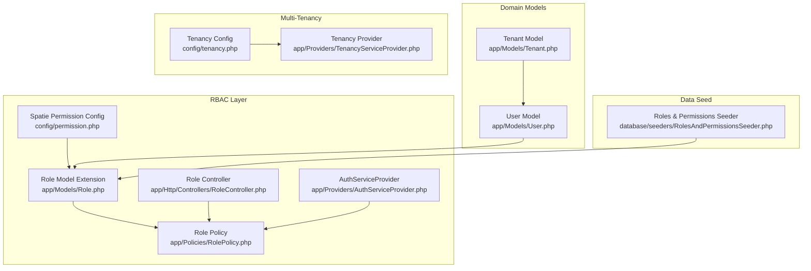
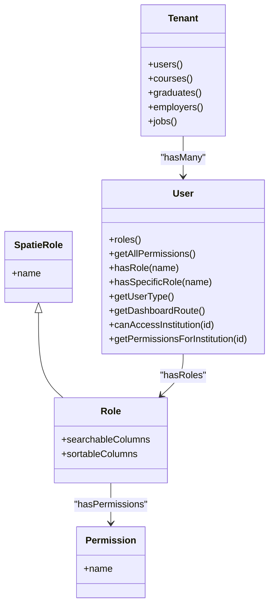
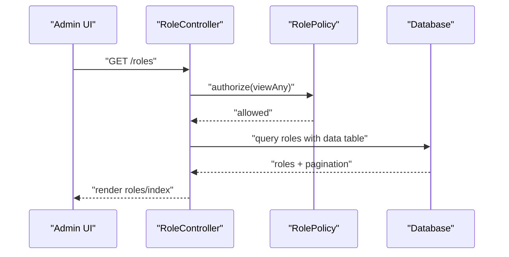
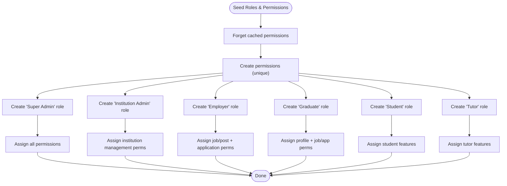
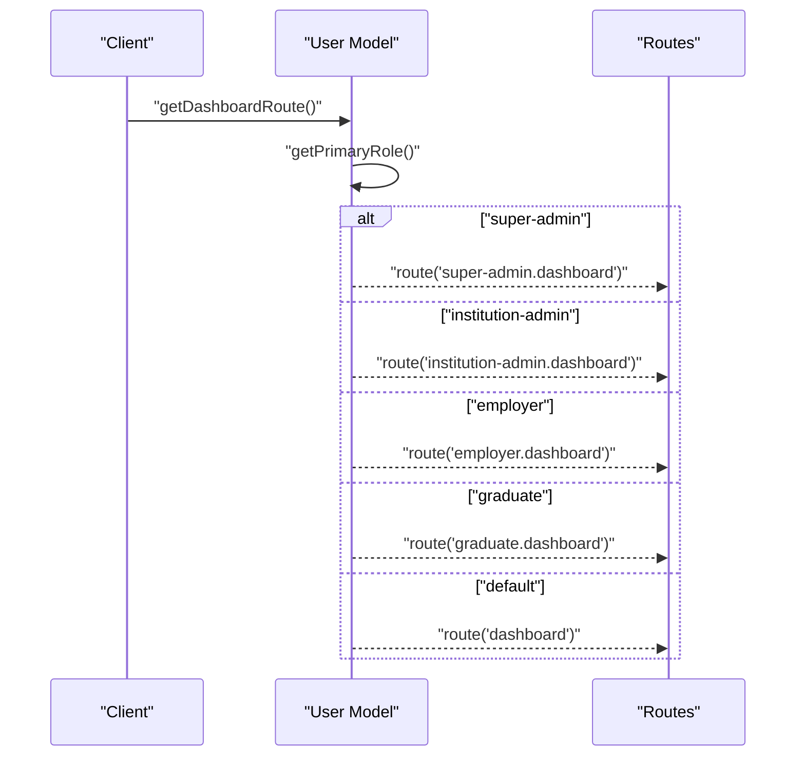
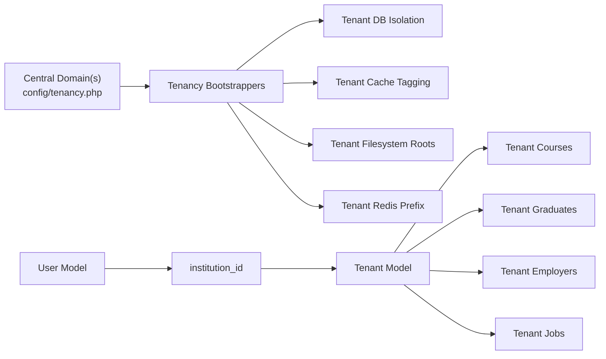
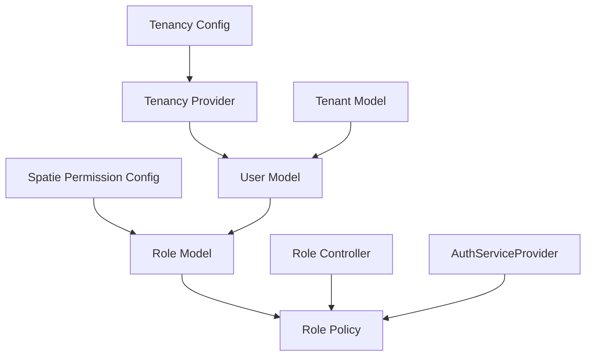
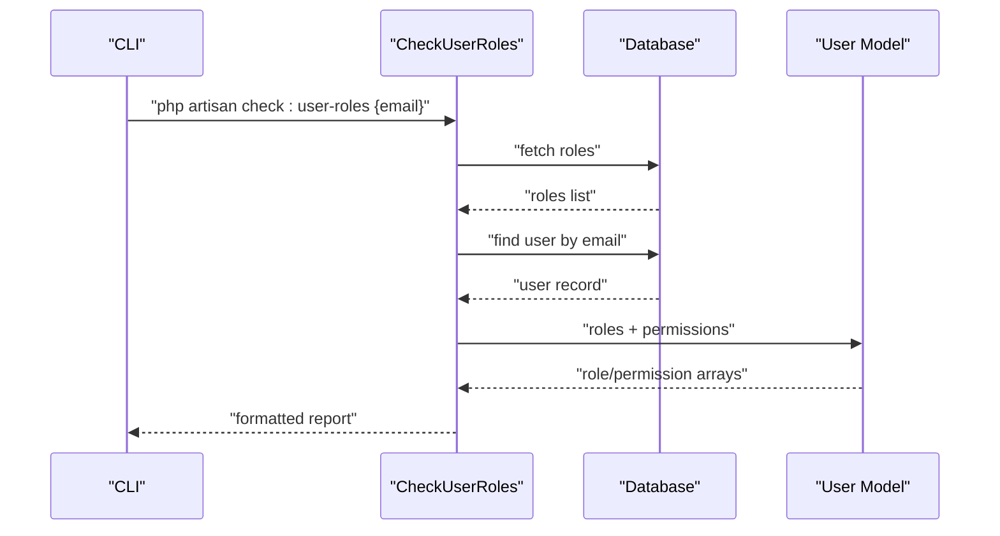

# User Roles and Access Control

<cite>
**Referenced Files in This Document**
- [Role.php](file://app/Models/Role.php)
- [permission.php](file://config/permission.php)
- [AuthServiceProvider.php](file://app/Providers/AuthServiceProvider.php)
- [RoleController.php](file://app/Http/Controllers/RoleController.php)
- [RolePolicy.php](file://app/Policies/RolePolicy.php)
- [RolesAndPermissionsSeeder.php](file://database/seeders/RolesAndPermissionsSeeder.php)
- [CheckUserRoles.php](file://app/Console/Commands/CheckUserRoles.php)
- [tenancy.php](file://config/tenancy.php)
- [User.php](file://app/Models/User.php)
- [Tenant.php](file://app/Models/Tenant.php)
- [TenancyServiceProvider.php](file://app/Providers/TenancyServiceProvider.php)
</cite>

## Table of Contents
1. [Introduction](#introduction)
2. [Project Structure](#project-structure)
3. [Core Components](#core-components)
4. [Architecture Overview](#architecture-overview)
5. [Detailed Component Analysis](#detailed-component-analysis)
6. [Dependency Analysis](#dependency-analysis)
7. [Performance Considerations](#performance-considerations)
8. [Troubleshooting Guide](#troubleshooting-guide)
9. [Conclusion](#conclusion)

## Introduction
This document explains the platform’s comprehensive Role-Based Access Control (RBAC) system built on the Spatie Permissions package. It covers the four main user roles, the permission matrix, role hierarchies, and how multi-tenancy affects role assignments and data access. It also documents role-specific workflows, dashboard customizations, and feature availability, and describes how Spatie Permissions enables granular control across tenant contexts.

## Project Structure
The RBAC system spans several core areas:
- Role and permission definitions via Spatie models and policies
- Seeding of roles and permissions during setup
- Controllers and UI surfaces for managing roles
- Multi-tenancy configuration and tenant-aware data access
- User model extensions for role checks and institution scoping

**Diagram sources**
- [permission.php:1-203](file://config/permission.php#L1-L203)
- [Role.php:1-22](file://app/Models/Role.php#L1-L22)
- [RolePolicy.php:1-66](file://app/Policies/RolePolicy.php#L1-L66)
- [RoleController.php:1-142](file://app/Http/Controllers/RoleController.php#L1-L142)
- [AuthServiceProvider.php:1-26](file://app/Providers/AuthServiceProvider.php#L1-L26)
- [User.php:1-818](file://app/Models/User.php#L1-L818)
- [Tenant.php:1-86](file://app/Models/Tenant.php#L1-L86)
- [tenancy.php:1-82](file://config/tenancy.php#L1-L82)
- [TenancyServiceProvider.php:1-41](file://app/Providers/TenancyServiceProvider.php#L1-L41)
- [RolesAndPermissionsSeeder.php:1-92](file://database/seeders/RolesAndPermissionsSeeder.php#L1-L92)

**Section sources**
- [permission.php:1-203](file://config/permission.php#L1-L203)
- [Role.php:1-22](file://app/Models/Role.php#L1-L22)
- [RolePolicy.php:1-66](file://app/Policies/RolePolicy.php#L1-L66)
- [RoleController.php:1-142](file://app/Http/Controllers/RoleController.php#L1-L142)
- [AuthServiceProvider.php:1-26](file://app/Providers/AuthServiceProvider.php#L1-L26)
- [User.php:1-818](file://app/Models/User.php#L1-L818)
- [Tenant.php:1-86](file://app/Models/Tenant.php#L1-L86)
- [tenancy.php:1-82](file://config/tenancy.php#L1-L82)
- [TenancyServiceProvider.php:1-41](file://app/Providers/TenancyServiceProvider.php#L1-L41)
- [RolesAndPermissionsSeeder.php:1-92](file://database/seeders/RolesAndPermissionsSeeder.php#L1-L92)

## Core Components
- Spatie Permission configuration defines table names, caching, and permission-check registration.
- Role model extends Spatie’s Role to add searchable and sortable columns.
- Role controller manages CRUD operations for roles and exports role data.
- Role policy enforces authorization gates for role management actions.
- User model integrates Spatie’s HasRoles trait and adds helpers for role checks, institution scoping, and dashboard routing.
- Tenant model encapsulates tenant-specific data access and relationships.
- Multi-tenancy configuration and provider ensure per-tenant isolation and middleware priority.

**Section sources**
- [permission.php:1-203](file://config/permission.php#L1-L203)
- [Role.php:1-22](file://app/Models/Role.php#L1-L22)
- [RoleController.php:1-142](file://app/Http/Controllers/RoleController.php#L1-L142)
- [RolePolicy.php:1-66](file://app/Policies/RolePolicy.php#L1-L66)
- [User.php:1-818](file://app/Models/User.php#L1-L818)
- [Tenant.php:1-86](file://app/Models/Tenant.php#L1-L86)
- [tenancy.php:1-82](file://config/tenancy.php#L1-L82)
- [TenancyServiceProvider.php:1-41](file://app/Providers/TenancyServiceProvider.php#L1-L41)

## Architecture Overview
The RBAC architecture combines Spatie Permissions with Laravel policies and the User model to enforce fine-grained access control. Multi-tenancy ensures that roles and permissions are isolated per tenant, while the User model provides helper methods to compute dashboard routes and institution-scoped permissions.

**Diagram sources**
- [Role.php:1-22](file://app/Models/Role.php#L1-L22)
- [permission.php:1-203](file://config/permission.php#L1-L203)
- [User.php:1-818](file://app/Models/User.php#L1-L818)
- [Tenant.php:1-86](file://app/Models/Tenant.php#L1-L86)

## Detailed Component Analysis

### Spatie Permissions Integration
- Configuration controls table names, cache expiration, and permission-check registration.
- The Role model extends Spatie’s Role and adds searchable/sortable columns for admin UI.
- Policies define authorization gates for role management operations.

**Diagram sources**
- [RoleController.php:20-30](file://app/Http/Controllers/RoleController.php#L20-L30)
- [RolePolicy.php:13-16](file://app/Policies/RolePolicy.php#L13-L16)

**Section sources**
- [permission.php:1-203](file://config/permission.php#L1-L203)
- [Role.php:1-22](file://app/Models/Role.php#L1-L22)
- [RoleController.php:1-142](file://app/Http/Controllers/RoleController.php#L1-L142)
- [RolePolicy.php:1-66](file://app/Policies/RolePolicy.php#L1-L66)

### Role Definitions and Permission Matrix
The seeder creates roles and assigns granular permissions. The resulting matrix supports:
- Super Admin: full access across all permissions
- Institution Admin: manage courses, tutors, graduates, upload and approve graduates, view announcements
- Employer: post jobs, manage applications, view institutions
- Graduate: view jobs, manage applications, view announcements, update profile
- Student and Tutor: additional platform features for students and tutors

**Diagram sources**
- [RolesAndPermissionsSeeder.php:16-92](file://database/seeders/RolesAndPermissionsSeeder.php#L16-L92)

**Section sources**
- [RolesAndPermissionsSeeder.php:1-92](file://database/seeders/RolesAndPermissionsSeeder.php#L1-L92)

### User Roles and Dashboard Routing
- The User model computes dashboard routes based on the user’s primary role.
- Helpers determine user type and support role-specific UI and navigation.

**Diagram sources**
- [User.php:478-489](file://app/Models/User.php#L478-L489)

**Section sources**
- [User.php:1-818](file://app/Models/User.php#L1-L818)

### Multi-Tenant Role Assignments and Data Access
- Tenancy configuration isolates databases, caches, filesystems, and Redis per tenant.
- The Tenant model defines relationships scoped to the tenant context.
- The User model includes helpers to verify institution access and compute institution-scoped permissions.

**Diagram sources**
- [tenancy.php:12-82](file://config/tenancy.php#L12-L82)
- [Tenant.php:48-84](file://app/Models/Tenant.php#L48-L84)
- [User.php:458-476](file://app/Models/User.php#L458-L476)

**Section sources**
- [tenancy.php:1-82](file://config/tenancy.php#L1-L82)
- [Tenant.php:1-86](file://app/Models/Tenant.php#L1-L86)
- [User.php:1-818](file://app/Models/User.php#L1-L818)

### Role-Specific Workflows and Feature Availability
- Super Admin: full administrative control across the platform; can manage roles and permissions via the role management UI.
- Institution Admin: manages institution-specific courses, tutors, and graduates; can upload and approve graduates; views announcements.
- Employer: posts jobs, manages applications, and can view institutional information.
- Graduate: tracks career opportunities, manages applications, updates profile, and reads announcements.
- Student and Tutor: access to student-focused features and tutor-specific capabilities.

These workflows are enforced by the permission matrix and validated through policies and gates.

**Section sources**
- [RolesAndPermissionsSeeder.php:1-92](file://database/seeders/RolesAndPermissionsSeeder.php#L1-L92)
- [RoleController.php:1-142](file://app/Http/Controllers/RoleController.php#L1-L142)
- [RolePolicy.php:1-66](file://app/Policies/RolePolicy.php#L1-L66)

## Dependency Analysis
The RBAC system depends on Spatie Permissions and Laravel policies. The User model integrates with Spatie’s traits and provides helpers for role checks and institution scoping. Multi-tenancy is configured centrally and bootstrapped via the TenancyServiceProvider.

**Diagram sources**
- [permission.php:1-203](file://config/permission.php#L1-L203)
- [Role.php:1-22](file://app/Models/Role.php#L1-L22)
- [RolePolicy.php:1-66](file://app/Policies/RolePolicy.php#L1-L66)
- [RoleController.php:1-142](file://app/Http/Controllers/RoleController.php#L1-L142)
- [AuthServiceProvider.php:1-26](file://app/Providers/AuthServiceProvider.php#L1-L26)
- [User.php:1-818](file://app/Models/User.php#L1-L818)
- [tenancy.php:1-82](file://config/tenancy.php#L1-L82)
- [TenancyServiceProvider.php:1-41](file://app/Providers/TenancyServiceProvider.php#L1-L41)
- [Tenant.php:1-86](file://app/Models/Tenant.php#L1-L86)

**Section sources**
- [permission.php:1-203](file://config/permission.php#L1-L203)
- [Role.php:1-22](file://app/Models/Role.php#L1-L22)
- [RolePolicy.php:1-66](file://app/Policies/RolePolicy.php#L1-L66)
- [RoleController.php:1-142](file://app/Http/Controllers/RoleController.php#L1-L142)
- [AuthServiceProvider.php:1-26](file://app/Providers/AuthServiceProvider.php#L1-L26)
- [User.php:1-818](file://app/Models/User.php#L1-L818)
- [tenancy.php:1-82](file://config/tenancy.php#L1-L82)
- [TenancyServiceProvider.php:1-41](file://app/Providers/TenancyServiceProvider.php#L1-L41)
- [Tenant.php:1-86](file://app/Models/Tenant.php#L1-L86)

## Performance Considerations
- Permission caching is enabled with a default 24-hour expiration; cache keys and stores are configurable.
- Wildcard permissions are disabled by default; enable only if required and understood.
- Events for role/permission attach/detach are disabled by default; enable only if you require listeners.

**Section sources**
- [permission.php:177-202](file://config/permission.php#L177-L202)

## Troubleshooting Guide
- Use the console command to inspect a user’s roles and permissions by email.
- Verify role checks for variations in role name casing.
- Confirm that the AuthServiceProvider mappings align with policies.
- Ensure multi-tenancy middleware is applied only to tenant routes.

**Diagram sources**
- [CheckUserRoles.php:27-71](file://app/Console/Commands/CheckUserRoles.php#L27-L71)

**Section sources**
- [CheckUserRoles.php:1-73](file://app/Console/Commands/CheckUserRoles.php#L1-L73)
- [AuthServiceProvider.php:14-16](file://app/Providers/AuthServiceProvider.php#L14-L16)

## Conclusion
The platform’s RBAC system leverages Spatie Permissions to provide granular, tenant-aware access control. Roles and permissions are seeded centrally, managed via a dedicated controller and policy, and enforced through the User model’s helpers and multi-tenant configuration. This foundation supports robust role-specific workflows, dashboard customization, and secure data isolation across tenants.