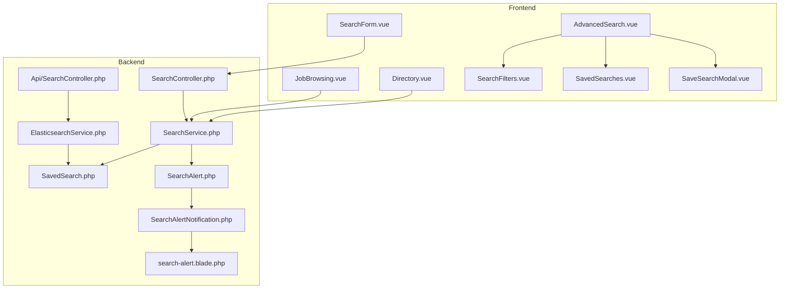
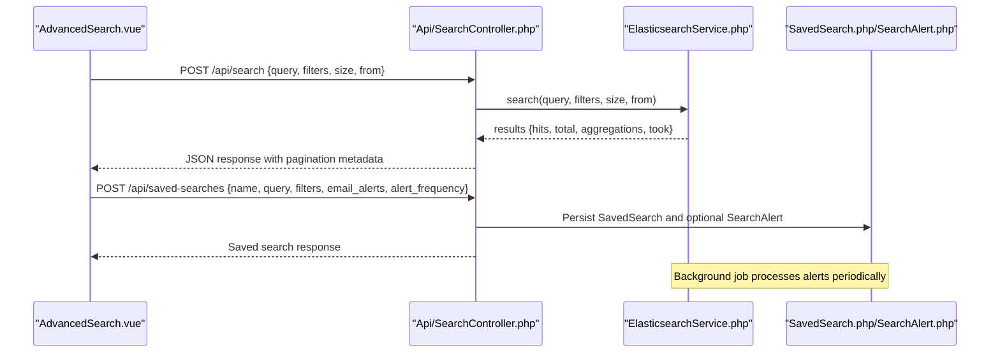
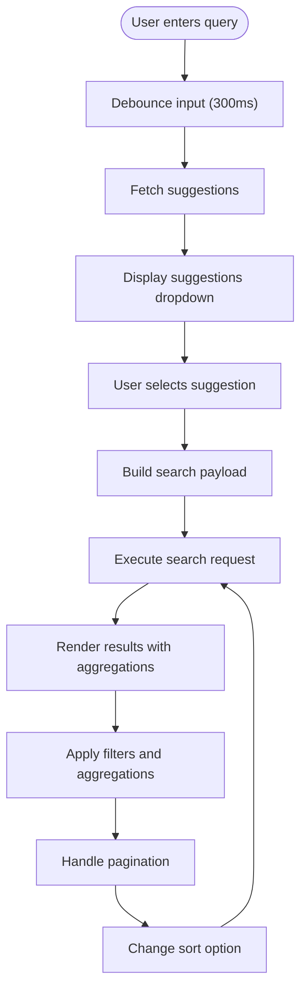
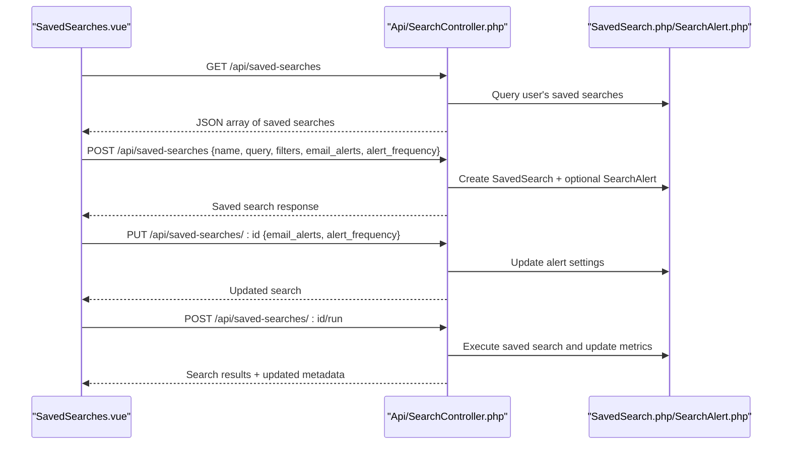
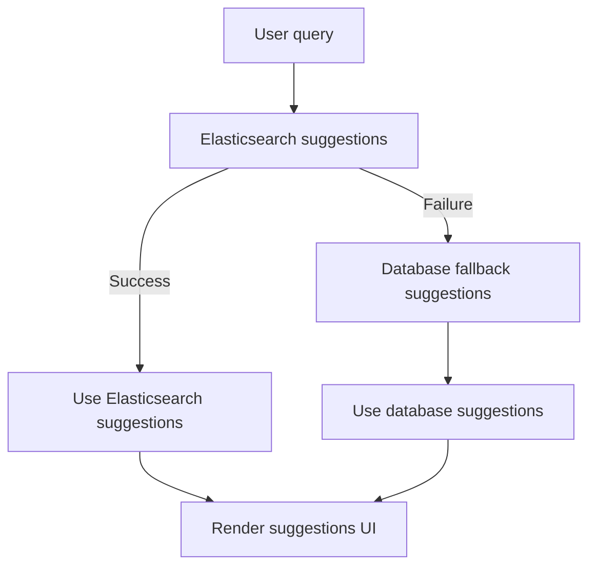
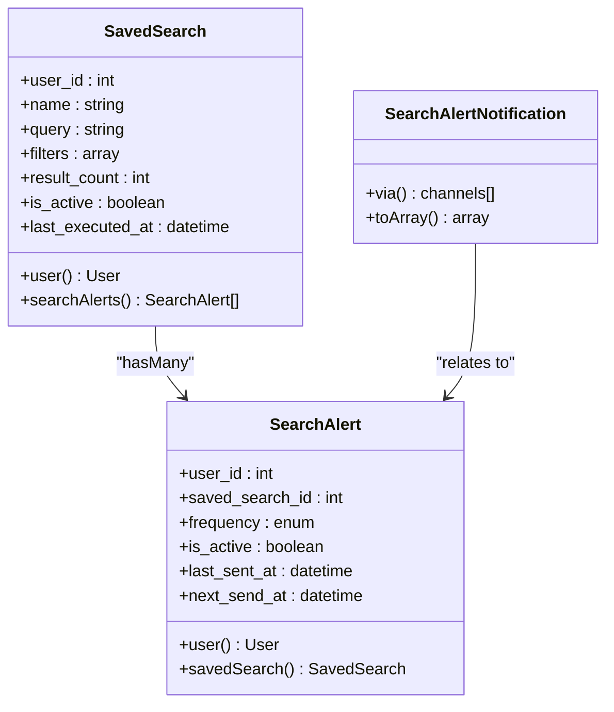
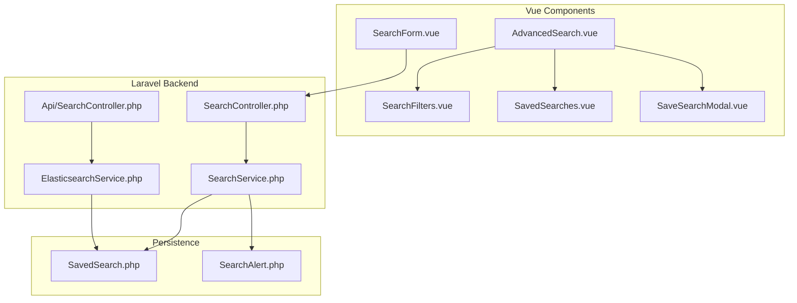
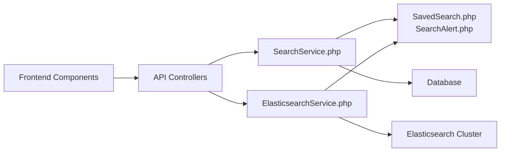

# Advanced Filtering & Saved Searches

<cite>
**Referenced Files in This Document**
- [AdvancedSearch.vue](file://resources/js/components/AdvancedSearch.vue)
- [SearchFilters.vue](file://resources/js/components/SearchFilters.vue)
- [SavedSearches.vue](file://resources/js/components/SavedSearches.vue)
- [SaveSearchModal.vue](file://resources/js/components/SaveSearchModal.vue)
- [SearchForm.vue](file://resources/js/Pages/Search/Components/SearchForm.vue)
- [JobBrowsing.vue](file://resources/js/Pages/Graduate/JobBrowsing.vue)
- [Directory.vue](file://resources/js/Pages/Alumni/Directory.vue)
- [SearchController.php](file://app/Http/Controllers/SearchController.php)
- [Api/SearchController.php](file://app/Http/Controllers/Api/SearchController.php)
- [SearchService.php](file://app/Services/SearchService.php)
- [ElasticsearchService.php](file://app/Services/ElasticsearchService.php)
- [SavedSearch.php](file://app/Models/SavedSearch.php)
- [SearchAlert.php](file://app/Models/SearchAlert.php)
- [SearchAlertNotification.php](file://app/Notifications/SearchAlertNotification.php)
- [search-alert.blade.php](file://resources/views/emails/search-alert.blade.php)
- [task-11-search-matching-system-recap.md](file://docs/task-11-search-matching-system-recap.md)
</cite>

## Table of Contents
1. [Introduction](#introduction)
2. [Project Structure](#project-structure)
3. [Core Components](#core-components)
4. [Architecture Overview](#architecture-overview)
5. [Detailed Component Analysis](#detailed-component-analysis)
6. [Dependency Analysis](#dependency-analysis)
7. [Performance Considerations](#performance-considerations)
8. [Troubleshooting Guide](#troubleshooting-guide)
9. [Conclusion](#conclusion)

## Introduction
This document provides comprehensive coverage of the advanced filtering capabilities and saved search functionality within the platform. It explains multi-criteria search implementation including keyword matching, location filters, salary ranges, and skill-based filtering. It details filter combination logic, search result pagination, and sorting mechanisms. It also documents saved search creation, management, and persistence, including alert configuration and frequency settings. Practical examples of filter UI components, search suggestion algorithms, and user preference handling are included, along with performance considerations and optimization strategies for complex queries and large datasets.

## Project Structure
The filtering and saved search system spans both frontend Vue components and backend Laravel services/controllers:

- Frontend:
  - Advanced search interface with filters, suggestions, and saved search management
  - Search form components for different content types (jobs, graduates, courses)
  - Directory and job browsing pages with integrated filters
- Backend:
  - Controllers for API and web search endpoints
  - SearchService for database-backed search and recommendations
  - ElasticsearchService for full-text search and aggregations
  - Models for persisted saved searches and alerts
  - Notifications and email templates for alert delivery



**Diagram sources**
- [AdvancedSearch.vue:1-588](file://resources/js/components/AdvancedSearch.vue#L1-L588)
- [SearchFilters.vue:1-633](file://resources/js/components/SearchFilters.vue#L1-L633)
- [SavedSearches.vue:1-686](file://resources/js/components/SavedSearches.vue#L1-L686)
- [SaveSearchModal.vue:1-404](file://resources/js/components/SaveSearchModal.vue#L1-L404)
- [SearchForm.vue:1-441](file://resources/js/Pages/Search/Components/SearchForm.vue#L1-L441)
- [JobBrowsing.vue:1-425](file://resources/js/Pages/Graduate/JobBrowsing.vue#L1-L425)
- [Directory.vue:1-313](file://resources/js/Pages/Alumni/Directory.vue#L1-L313)
- [SearchController.php:1-431](file://app/Http/Controllers/SearchController.php#L1-L431)
- [Api/SearchController.php:1-478](file://app/Http/Controllers/Api/SearchController.php#L1-L478)
- [SearchService.php:1-531](file://app/Services/SearchService.php#L1-L531)
- [ElasticsearchService.php:1-942](file://app/Services/ElasticsearchService.php#L1-L942)
- [SavedSearch.php:1-46](file://app/Models/SavedSearch.php#L1-L46)
- [SearchAlert.php:1-44](file://app/Models/SearchAlert.php#L1-L44)
- [SearchAlertNotification.php:83-102](file://app/Notifications/SearchAlertNotification.php#L83-L102)
- [search-alert.blade.php:226-252](file://resources/views/emails/search-alert.blade.php#L226-L252)

**Section sources**
- [AdvancedSearch.vue:1-588](file://resources/js/components/AdvancedSearch.vue#L1-L588)
- [SearchFilters.vue:1-633](file://resources/js/components/SearchFilters.vue#L1-L633)
- [SavedSearches.vue:1-686](file://resources/js/components/SavedSearches.vue#L1-L686)
- [SaveSearchModal.vue:1-404](file://resources/js/components/SaveSearchModal.vue#L1-L404)
- [SearchForm.vue:1-441](file://resources/js/Pages/Search/Components/SearchForm.vue#L1-L441)
- [JobBrowsing.vue:1-425](file://resources/js/Pages/Graduate/JobBrowsing.vue#L1-L425)
- [Directory.vue:1-313](file://resources/js/Pages/Alumni/Directory.vue#L1-L313)
- [SearchController.php:1-431](file://app/Http/Controllers/SearchController.php#L1-L431)
- [Api/SearchController.php:1-478](file://app/Http/Controllers/Api/SearchController.php#L1-L478)
- [SearchService.php:1-531](file://app/Services/SearchService.php#L1-L531)
- [ElasticsearchService.php:1-942](file://app/Services/ElasticsearchService.php#L1-L942)
- [SavedSearch.php:1-46](file://app/Models/SavedSearch.php#L1-L46)
- [SearchAlert.php:1-44](file://app/Models/SearchAlert.php#L1-L44)
- [SearchAlertNotification.php:83-102](file://app/Notifications/SearchAlertNotification.php#L83-L102)
- [search-alert.blade.php:226-252](file://resources/views/emails/search-alert.blade.php#L226-L252)

## Core Components
- AdvancedSearch.vue: Full-featured search interface with keyword input, suggestions, filters, pagination, sorting, and saved search integration.
- SearchFilters.vue: Multi-criteria filter panel supporting content types, location, graduation year, industries, skills, date ranges, and schools with live aggregations.
- SavedSearches.vue: Saved search management UI enabling creation, editing, deletion, toggling alerts, and running saved searches.
- SaveSearchModal.vue: Modal for saving current search with optional alert configuration and frequency selection.
- SearchForm.vue: Type-specific search forms for jobs, graduates, and courses with advanced filter sections and suggestions.
- SearchController.php and Api/SearchController.php: Backend endpoints for search, suggestions, saved search CRUD, and analytics.
- SearchService.php: Database-backed search and recommendation engine with multi-criteria filtering and sorting.
- ElasticsearchService.php: Full-text search, aggregations, suggestions, and fallback mechanisms for robust search performance.
- SavedSearch.php and SearchAlert.php: Eloquent models for persisted searches and alert configurations.
- SearchAlertNotification.php and search-alert.blade.php: Alert notification generation and email template rendering.

**Section sources**
- [AdvancedSearch.vue:1-588](file://resources/js/components/AdvancedSearch.vue#L1-L588)
- [SearchFilters.vue:1-633](file://resources/js/components/SearchFilters.vue#L1-L633)
- [SavedSearches.vue:1-686](file://resources/js/components/SavedSearches.vue#L1-L686)
- [SaveSearchModal.vue:1-404](file://resources/js/components/SaveSearchModal.vue#L1-L404)
- [SearchForm.vue:1-441](file://resources/js/Pages/Search/Components/SearchForm.vue#L1-L441)
- [SearchController.php:1-431](file://app/Http/Controllers/SearchController.php#L1-L431)
- [Api/SearchController.php:1-478](file://app/Http/Controllers/Api/SearchController.php#L1-L478)
- [SearchService.php:1-531](file://app/Services/SearchService.php#L1-L531)
- [ElasticsearchService.php:1-942](file://app/Services/ElasticsearchService.php#L1-L942)
- [SavedSearch.php:1-46](file://app/Models/SavedSearch.php#L1-L46)
- [SearchAlert.php:1-44](file://app/Models/SearchAlert.php#L1-L44)
- [SearchAlertNotification.php:83-102](file://app/Notifications/SearchAlertNotification.php#L83-L102)
- [search-alert.blade.php:226-252](file://resources/views/emails/search-alert.blade.php#L226-L252)

## Architecture Overview
The system implements a hybrid search architecture combining Elasticsearch for full-text search and aggregations with a Laravel backend for orchestration, validation, and persistence. Saved searches and alerts are persisted via Eloquent models with background processing for alert delivery.



**Diagram sources**
- [Api/SearchController.php:27-96](file://app/Http/Controllers/Api/SearchController.php#L27-L96)
- [ElasticsearchService.php:205-236](file://app/Services/ElasticsearchService.php#L205-L236)
- [SavedSearch.php:1-46](file://app/Models/SavedSearch.php#L1-L46)
- [SearchAlert.php:1-44](file://app/Models/SearchAlert.php#L1-L44)

**Section sources**
- [Api/SearchController.php:1-478](file://app/Http/Controllers/Api/SearchController.php#L1-L478)
- [ElasticsearchService.php:1-942](file://app/Services/ElasticsearchService.php#L1-L942)
- [SavedSearch.php:1-46](file://app/Models/SavedSearch.php#L1-L46)
- [SearchAlert.php:1-44](file://app/Models/SearchAlert.php#L1-L44)

## Detailed Component Analysis

### Advanced Search Interface
The AdvancedSearch component orchestrates the end-to-end search experience:
- Keyword input with debounced suggestions fetching from the API
- Dynamic filter panel with live aggregations for refinement
- Pagination controls with page size and current page tracking
- Sorting options (relevance, date, name, engagement)
- Saved search creation with optional alert configuration



**Diagram sources**
- [AdvancedSearch.vue:289-341](file://resources/js/components/AdvancedSearch.vue#L289-L341)
- [AdvancedSearch.vue:343-360](file://resources/js/components/AdvancedSearch.vue#L343-L360)
- [AdvancedSearch.vue:362-404](file://resources/js/components/AdvancedSearch.vue#L362-L404)

**Section sources**
- [AdvancedSearch.vue:1-588](file://resources/js/components/AdvancedSearch.vue#L1-L588)

### Multi-Criteria Filtering Implementation
The SearchFilters component provides comprehensive filter controls:
- Content types: user, post, job, event with counts from aggregations
- Location: free text with datalist suggestions from location buckets
- Graduation year: single year or range via aggregation buckets
- Industries: multi-select with dynamic options sorted by popularity
- Skills: searchable tag input with autocomplete from skill buckets
- Date range: preset buttons and manual date pickers
- School: optional filter with aggregation-driven options

Filter combination logic:
- Must clauses for query text matching
- Filter clauses for exact matches and ranges
- Terms filters for arrays (industries, skills)
- Aggregation-driven UI updates for counts and suggestions

```mermaid
classDiagram
class SearchFilters {
+types : string[]
+location : string
+graduation_year : string
+industry : string[]
+skills : string[]
+date_range : {from : string, to : string}
+school : string
+updateFilters()
+removeIndustry(industry)
+removeSkill(skill)
+applyDatePreset(preset)
+removeFilter(key)
}
class Aggregations {
+locations : Bucket[]
+graduation_years : Bucket[]
+industries : Bucket[]
+skills : Bucket[]
+schools : Bucket[]
}
SearchFilters --> Aggregations : "consumes"
```

**Diagram sources**
- [SearchFilters.vue:260-496](file://resources/js/components/SearchFilters.vue#L260-L496)

**Section sources**
- [SearchFilters.vue:1-633](file://resources/js/components/SearchFilters.vue#L1-L633)

### Saved Search Management
SavedSearches component enables persistent search management:
- Load, create, update, and delete saved searches
- Toggle email alerts with frequency settings (immediate, daily, weekly)
- Run saved searches and update last run metrics
- Display filters summary and result counts



**Diagram sources**
- [SavedSearches.vue:288-305](file://resources/js/components/SavedSearches.vue#L288-L305)
- [SavedSearches.vue:307-350](file://resources/js/components/SavedSearches.vue#L307-L350)
- [SavedSearches.vue:424-454](file://resources/js/components/SavedSearches.vue#L424-L454)
- [Api/SearchController.php:194-293](file://app/Http/Controllers/Api/SearchController.php#L194-L293)

**Section sources**
- [SavedSearches.vue:1-686](file://resources/js/components/SavedSearches.vue#L1-L686)
- [Api/SearchController.php:147-293](file://app/Http/Controllers/Api/SearchController.php#L147-L293)
- [SavedSearch.php:1-46](file://app/Models/SavedSearch.php#L1-L46)
- [SearchAlert.php:1-44](file://app/Models/SearchAlert.php#L1-L44)

### Search Suggestions and User Preference Handling
The system provides intelligent suggestions and preference handling:
- Elasticsearch-based completion suggestions for names and skills
- Database fallback suggestions when Elasticsearch is unavailable
- Preference-aware sorting and result scoring
- User-specific privacy filters in Elasticsearch queries



**Diagram sources**
- [Api/SearchController.php:101-142](file://app/Http/Controllers/Api/SearchController.php#L101-L142)
- [ElasticsearchService.php:163-200](file://app/Services/ElasticsearchService.php#L163-L200)
- [ElasticsearchService.php:506-555](file://app/Services/ElasticsearchService.php#L506-L555)

**Section sources**
- [Api/SearchController.php:101-142](file://app/Http/Controllers/Api/SearchController.php#L101-L142)
- [ElasticsearchService.php:163-200](file://app/Services/ElasticsearchService.php#L163-L200)
- [ElasticsearchService.php:506-555](file://app/Services/ElasticsearchService.php#L506-L555)

### Search Persistence and Alerts
Saved searches persist query and filter criteria with optional alert subscriptions:
- SavedSearch model stores user_id, name, query, filters, and result counts
- SearchAlert model manages frequency (immediate, daily, weekly) and scheduling
- Email notifications delivered via SearchAlertNotification and Blade template
- Background processing for periodic alert evaluation



**Diagram sources**
- [SavedSearch.php:1-46](file://app/Models/SavedSearch.php#L1-L46)
- [SearchAlert.php:1-44](file://app/Models/SearchAlert.php#L1-L44)
- [SearchAlertNotification.php:83-102](file://app/Notifications/SearchAlertNotification.php#L83-L102)

**Section sources**
- [SavedSearch.php:1-46](file://app/Models/SavedSearch.php#L1-L46)
- [SearchAlert.php:1-44](file://app/Models/SearchAlert.php#L1-L44)
- [SearchAlertNotification.php:83-102](file://app/Notifications/SearchAlertNotification.php#L83-L102)
- [search-alert.blade.php:226-252](file://resources/views/emails/search-alert.blade.php#L226-L252)

### Conceptual Overview
The filtering and search system integrates multiple technologies and patterns:
- Vue composition API for reactive UI components
- Laravel validation and authorization for secure endpoints
- Elasticsearch for scalable full-text search and aggregations
- Database-backed persistence for user preferences and saved searches
- Background job processing for alert delivery



[No sources needed since this diagram shows conceptual workflow, not actual code structure]

[No sources needed since this section doesn't analyze specific source files]

## Dependency Analysis
The system exhibits clear separation of concerns:
- Frontend components depend on API endpoints for data and actions
- Controllers depend on services for business logic
- Services depend on models for persistence
- ElasticsearchService depends on external Elasticsearch cluster
- Saved search alerts integrate with notification and email systems



**Diagram sources**
- [SearchController.php:1-431](file://app/Http/Controllers/SearchController.php#L1-L431)
- [Api/SearchController.php:1-478](file://app/Http/Controllers/Api/SearchController.php#L1-L478)
- [SearchService.php:1-531](file://app/Services/SearchService.php#L1-L531)
- [ElasticsearchService.php:1-942](file://app/Services/ElasticsearchService.php#L1-L942)
- [SavedSearch.php:1-46](file://app/Models/SavedSearch.php#L1-L46)
- [SearchAlert.php:1-44](file://app/Models/SearchAlert.php#L1-L44)

**Section sources**
- [SearchController.php:1-431](file://app/Http/Controllers/SearchController.php#L1-L431)
- [Api/SearchController.php:1-478](file://app/Http/Controllers/Api/SearchController.php#L1-L478)
- [SearchService.php:1-531](file://app/Services/SearchService.php#L1-L531)
- [ElasticsearchService.php:1-942](file://app/Services/ElasticsearchService.php#L1-L942)
- [SavedSearch.php:1-46](file://app/Models/SavedSearch.php#L1-L46)
- [SearchAlert.php:1-44](file://app/Models/SearchAlert.php#L1-L44)

## Performance Considerations
- Elasticsearch indexing and mapping: Ensure proper analyzers and keyword fields for precise matching and efficient aggregations.
- Query optimization: Use filter contexts for exact matches and term queries to leverage caching; avoid expensive wildcard queries.
- Pagination: Limit page sizes and use efficient sorting; consider scroll or search_after for deep pagination.
- Aggregations: Cap bucket sizes and use sampling for large datasets; precompute popular filters.
- Fallback strategies: Database fallback ensures availability when Elasticsearch is down; minimize fallback usage through monitoring and scaling.
- Caching: Cache frequently accessed suggestions and popular queries; invalidate on data changes.
- Background processing: Offload alert generation and notifications to queues to prevent blocking requests.

[No sources needed since this section provides general guidance]

## Troubleshooting Guide
Common issues and resolutions:
- Elasticsearch connectivity failures: Verify host configuration and network access; confirm fallback to database suggestions.
- Validation errors on search endpoints: Check request payload against controller validation rules for filters, query length, and sort options.
- Saved search persistence failures: Confirm user authentication and model fillable attributes; inspect database constraints.
- Alert delivery problems: Review notification channels, email templates, and background job logs; verify cron or scheduler configuration.
- Performance degradation: Monitor Elasticsearch query times, aggregation costs, and database query plans; optimize mappings and queries.

**Section sources**
- [Api/SearchController.php:29-51](file://app/Http/Controllers/Api/SearchController.php#L29-L51)
- [Api/SearchController.php:147-189](file://app/Http/Controllers/Api/SearchController.php#L147-L189)
- [Api/SearchController.php:424-453](file://app/Http/Controllers/Api/SearchController.php#L424-L453)
- [ElasticsearchService.php:17-33](file://app/Services/ElasticsearchService.php#L17-L33)

## Conclusion
The advanced filtering and saved search system combines a responsive Vue frontend with robust Laravel backend services and Elasticsearch for scalable search. It supports sophisticated multi-criteria filtering, dynamic suggestions, persistent saved searches with alerting, and comprehensive pagination and sorting. The modular architecture enables maintainability and extensibility while the hybrid search strategy ensures reliability and performance across diverse query patterns and dataset sizes.