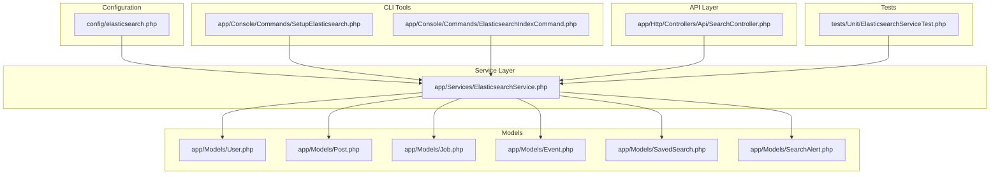
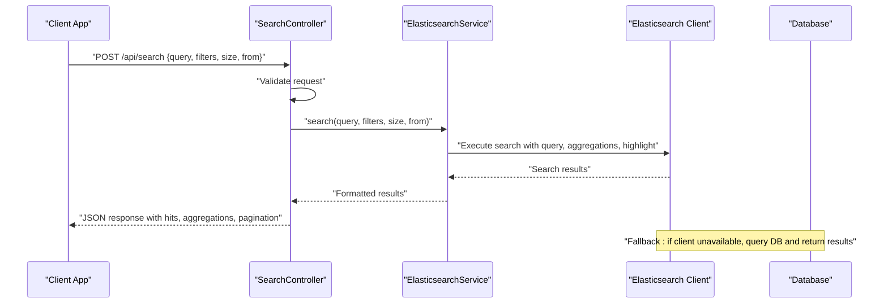
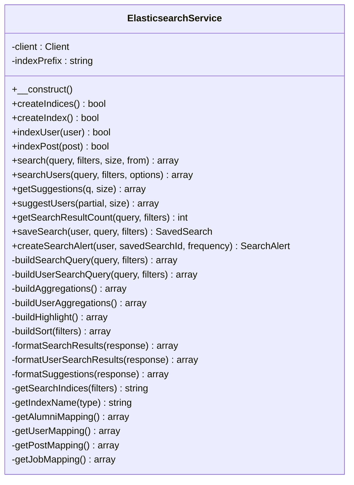
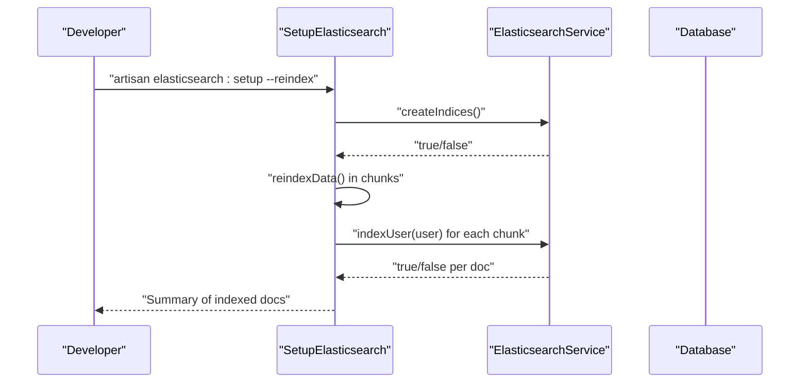
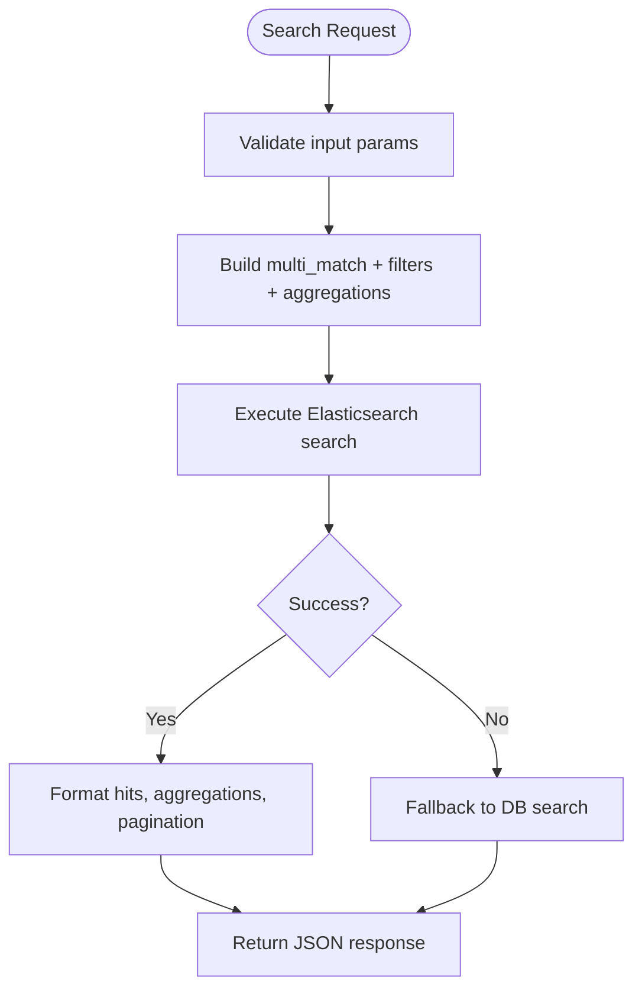
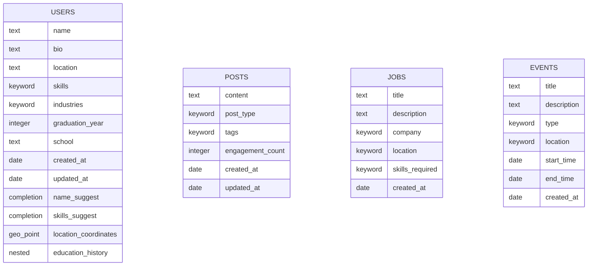
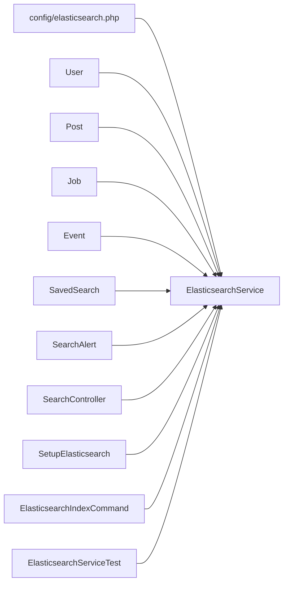

# Elasticsearch Integration

<cite>
**Referenced Files in This Document**
- [config/elasticsearch.php](file://config/elasticsearch.php)
- [app/Services/ElasticsearchService.php](file://app/Services/ElasticsearchService.php)
- [app/Console/Commands/SetupElasticsearch.php](file://app/Console/Commands/SetupElasticsearch.php)
- [app/Console/Commands/ElasticsearchIndexCommand.php](file://app/Console/Commands/ElasticsearchIndexCommand.php)
- [app/Http/Controllers/Api/SearchController.php](file://app/Http/Controllers/Api/SearchController.php)
- [tests/Unit/ElasticsearchServiceTest.php](file://tests/Unit/ElasticsearchServiceTest.php)
- [app/Models/SavedSearch.php](file://app/Models/SavedSearch.php)
- [app/Models/SearchAlert.php](file://app/Models/SearchAlert.php)
- [app/Models/User.php](file://app/Models/User.php)
- [app/Models/Post.php](file://app/Models/Post.php)
- [app/Models/Job.php](file://app/Models/Job.php)
- [app/Models/Event.php](file://app/Models/Event.php)
- [app/Services/DatabaseOptimizationService.php](file://app/Services/DatabaseOptimizationService.php)
</cite>

## Table of Contents
1. [Introduction](#introduction)
2. [Project Structure](#project-structure)
3. [Core Components](#core-components)
4. [Architecture Overview](#architecture-overview)
5. [Detailed Component Analysis](#detailed-component-analysis)
6. [Dependency Analysis](#dependency-analysis)
7. [Performance Considerations](#performance-considerations)
8. [Troubleshooting Guide](#troubleshooting-guide)
9. [Conclusion](#conclusion)
10. [Appendices](#appendices)

## Introduction
This document explains the Elasticsearch integration for the alumni platform, focusing on configuration, indexing strategies, and performance optimization. It covers cluster setup, connection configuration, index mapping for users, posts, jobs, and events, as well as real-time indexing, bulk operations, faceted search, result ranking, analytics, and troubleshooting. Guidance for development, staging, and production environments is included.

## Project Structure
The Elasticsearch integration spans configuration, a dedicated service, console commands for setup and indexing, API controllers for search and suggestions, and unit tests validating behavior. The service encapsulates client initialization, index creation, document indexing, search queries, aggregations, and suggestions.

**Diagram sources**
- [config/elasticsearch.php:1-36](file://config/elasticsearch.php#L1-L36)
- [app/Services/ElasticsearchService.php:1-942](file://app/Services/ElasticsearchService.php#L1-L942)
- [app/Console/Commands/SetupElasticsearch.php:1-147](file://app/Console/Commands/SetupElasticsearch.php#L1-L147)
- [app/Console/Commands/ElasticsearchIndexCommand.php:1-187](file://app/Console/Commands/ElasticsearchIndexCommand.php#L1-L187)
- [app/Http/Controllers/Api/SearchController.php:1-478](file://app/Http/Controllers/Api/SearchController.php#L1-L478)
- [tests/Unit/ElasticsearchServiceTest.php:1-315](file://tests/Unit/ElasticsearchServiceTest.php#L1-L315)

**Section sources**
- [config/elasticsearch.php:1-36](file://config/elasticsearch.php#L1-L36)
- [app/Services/ElasticsearchService.php:1-942](file://app/Services/ElasticsearchService.php#L1-L942)
- [app/Console/Commands/SetupElasticsearch.php:1-147](file://app/Console/Commands/SetupElasticsearch.php#L1-L147)
- [app/Console/Commands/ElasticsearchIndexCommand.php:1-187](file://app/Console/Commands/ElasticsearchIndexCommand.php#L1-L187)
- [app/Http/Controllers/Api/SearchController.php:1-478](file://app/Http/Controllers/Api/SearchController.php#L1-L478)
- [tests/Unit/ElasticsearchServiceTest.php:1-315](file://tests/Unit/ElasticsearchServiceTest.php#L1-L315)

## Core Components
- Elasticsearch configuration: host, index prefix, shard/replica defaults, search defaults, and indexing batch size.
- ElasticsearchService: client initialization, index creation, document indexing (users, posts), search with faceting and highlighting, suggestions, and analytics hooks.
- CLI commands: setup and reindex helpers for indices and data.
- API controller: request validation, search execution, suggestions, saved searches, and analytics logging.
- Tests: unit tests validating query building, mapping creation, indexing behavior, and suggestions.

**Section sources**
- [config/elasticsearch.php:15-35](file://config/elasticsearch.php#L15-L35)
- [app/Services/ElasticsearchService.php:11-33](file://app/Services/ElasticsearchService.php#L11-L33)
- [app/Console/Commands/SetupElasticsearch.php:13-73](file://app/Console/Commands/SetupElasticsearch.php#L13-L73)
- [app/Console/Commands/ElasticsearchIndexCommand.php:10-52](file://app/Console/Commands/ElasticsearchIndexCommand.php#L10-L52)
- [app/Http/Controllers/Api/SearchController.php:15-96](file://app/Http/Controllers/Api/SearchController.php#L15-L96)
- [tests/Unit/ElasticsearchServiceTest.php:14-315](file://tests/Unit/ElasticsearchServiceTest.php#L14-L315)

## Architecture Overview
The system initializes an Elasticsearch client from configuration, creates indices with appropriate mappings, and exposes search and suggestions via API endpoints. The service handles fallbacks to database queries when Elasticsearch is unavailable, ensuring resilience.

**Diagram sources**
- [app/Http/Controllers/Api/SearchController.php:27-96](file://app/Http/Controllers/Api/SearchController.php#L27-L96)
- [app/Services/ElasticsearchService.php:205-236](file://app/Services/ElasticsearchService.php#L205-L236)

**Section sources**
- [app/Http/Controllers/Api/SearchController.php:27-96](file://app/Http/Controllers/Api/SearchController.php#L27-L96)
- [app/Services/ElasticsearchService.php:205-236](file://app/Services/ElasticsearchService.php#L205-L236)

## Detailed Component Analysis

### Elasticsearch Configuration
- Host and index prefix are configurable via environment variables.
- Default shards and replicas are set for local development.
- Search defaults define page sizes, highlight fragment length, and suggestion size.
- Indexing defaults include batch size and queue connection.

Practical implications:
- Adjust shards/replicas per environment scale.
- Tune default page size and highlight fragment length for UX and payload size.

**Section sources**
- [config/elasticsearch.php:15-35](file://config/elasticsearch.php#L15-L35)

### ElasticsearchService
Responsibilities:
- Client initialization with host from config.
- Index creation for users, posts, jobs, events.
- Document indexing for users and posts.
- Search across indices with multi-field matching, fuzziness, and filters.
- Aggregations for locations, graduation years, industries, skills, schools.
- Highlighting for matched fields.
- Suggestions using completion suggesters.
- Fallback to database queries when client is unavailable.
- Saved search persistence and alert creation.

Key implementation highlights:
- Index naming uses configured prefix plus type.
- Mappings define text, keyword, integer, date, nested, and completion fields.
- Sorting supports relevance, date, name, and engagement.
- Privacy-aware filtering excludes users opting out.

**Diagram sources**
- [app/Services/ElasticsearchService.php:11-942](file://app/Services/ElasticsearchService.php#L11-L942)

**Section sources**
- [app/Services/ElasticsearchService.php:11-33](file://app/Services/ElasticsearchService.php#L11-L33)
- [app/Services/ElasticsearchService.php:277-310](file://app/Services/ElasticsearchService.php#L277-L310)
- [app/Services/ElasticsearchService.php:314-449](file://app/Services/ElasticsearchService.php#L314-L449)
- [app/Services/ElasticsearchService.php:451-611](file://app/Services/ElasticsearchService.php#L451-L611)
- [app/Services/ElasticsearchService.php:613-654](file://app/Services/ElasticsearchService.php#L613-L654)
- [app/Services/ElasticsearchService.php:681-752](file://app/Services/ElasticsearchService.php#L681-L752)
- [app/Services/ElasticsearchService.php:829-881](file://app/Services/ElasticsearchService.php#L829-L881)
- [app/Services/ElasticsearchService.php:800-824](file://app/Services/ElasticsearchService.php#L800-L824)

### Setup and Indexing Commands
- SetupElasticsearch: Creates indices and optionally reindexes existing data in chunks.
- ElasticsearchIndexCommand: Provides create/reindex/delete actions with progress feedback.

**Diagram sources**
- [app/Console/Commands/SetupElasticsearch.php:40-145](file://app/Console/Commands/SetupElasticsearch.php#L40-L145)
- [app/Console/Commands/ElasticsearchIndexCommand.php:42-154](file://app/Console/Commands/ElasticsearchIndexCommand.php#L42-L154)

**Section sources**
- [app/Console/Commands/SetupElasticsearch.php:40-145](file://app/Console/Commands/SetupElasticsearch.php#L40-L145)
- [app/Console/Commands/ElasticsearchIndexCommand.php:42-154](file://app/Console/Commands/ElasticsearchIndexCommand.php#L42-L154)

### Search API and Faceted Results
- Request validation ensures safe parameters.
- Search executes across indices with filters, sorting, highlighting, and aggregations.
- Pagination computed from from/size.
- Analytics logged for search queries and result counts.

**Diagram sources**
- [app/Http/Controllers/Api/SearchController.php:27-96](file://app/Http/Controllers/Api/SearchController.php#L27-L96)
- [app/Services/ElasticsearchService.php:205-236](file://app/Services/ElasticsearchService.php#L205-L236)

**Section sources**
- [app/Http/Controllers/Api/SearchController.php:27-96](file://app/Http/Controllers/Api/SearchController.php#L27-L96)
- [app/Services/ElasticsearchService.php:205-236](file://app/Services/ElasticsearchService.php#L205-L236)

### Index Mapping for Entity Types
Mappings define field types and analyzers for optimal search behavior:
- Users: text fields with standard analyzer, keyword sub-fields, completion suggesters, nested education history, geo-point for location coordinates.
- Posts: content, post_type, tags, engagement_count, timestamps.
- Jobs: title, description, company, location, required skills, timestamps.
- Events: modeled similarly to jobs with event-specific fields.

**Diagram sources**
- [app/Services/ElasticsearchService.php:691-752](file://app/Services/ElasticsearchService.php#L691-L752)
- [app/Services/ElasticsearchService.php:902-940](file://app/Services/ElasticsearchService.php#L902-L940)

**Section sources**
- [app/Services/ElasticsearchService.php:691-752](file://app/Services/ElasticsearchService.php#L691-L752)
- [app/Services/ElasticsearchService.php:902-940](file://app/Services/ElasticsearchService.php#L902-L940)

### Real-Time Indexing and Bulk Operations
- Real-time indexing: indexUser and indexPost methods insert documents synchronously.
- Bulk operations: SetupElasticsearch and ElasticsearchIndexCommand process records in chunks to manage memory and throughput.
- Queue integration: indexing batch size and queue connection are configurable.

Best practices:
- Use chunked processing for large datasets.
- Monitor indexing failures and retry selectively.
- Consider asynchronous indexing via queues for high-volume writes.

**Section sources**
- [app/Services/ElasticsearchService.php:77-122](file://app/Services/ElasticsearchService.php#L77-L122)
- [app/Services/ElasticsearchService.php:241-272](file://app/Services/ElasticsearchService.php#L241-L272)
- [app/Console/Commands/SetupElasticsearch.php:78-145](file://app/Console/Commands/SetupElasticsearch.php#L78-L145)
- [app/Console/Commands/ElasticsearchIndexCommand.php:119-140](file://app/Console/Commands/ElasticsearchIndexCommand.php#L119-L140)
- [config/elasticsearch.php:31-34](file://config/elasticsearch.php#L31-L34)

### Search Query Construction and Ranking
- Multi-field matching across name, bio, skills, position, company, location, school, degree with weighted fields.
- Fuzzy matching enabled for typo tolerance.
- Filters: location, graduation year range, industry, skills, date range.
- Sorting: relevance (score), date, name, engagement.
- Highlighting: mark matched terms in returned snippets.

Ranking considerations:
- Weighted fields increase relevance for primary attributes.
- Fuzziness improves recall while maintaining precision.
- Aggregations support faceted navigation.

**Section sources**
- [app/Services/ElasticsearchService.php:314-449](file://app/Services/ElasticsearchService.php#L314-L449)
- [app/Services/ElasticsearchService.php:557-576](file://app/Services/ElasticsearchService.php#L557-L576)
- [app/Services/ElasticsearchService.php:578-590](file://app/Services/ElasticsearchService.php#L578-L590)
- [app/Services/ElasticsearchService.php:592-611](file://app/Services/ElasticsearchService.php#L592-L611)

### Faceted Search and Suggestions
- Aggregations: terms aggregations for locations, graduation years, industries, skills, schools.
- Suggestions: completion suggesters for names and skills.
- Fallback suggestions: database-backed when Elasticsearch is down.

**Section sources**
- [app/Services/ElasticsearchService.php:451-470](file://app/Services/ElasticsearchService.php#L451-L470)
- [app/Services/ElasticsearchService.php:592-611](file://app/Services/ElasticsearchService.php#L592-L611)
- [app/Services/ElasticsearchService.php:163-200](file://app/Services/ElasticsearchService.php#L163-L200)
- [app/Services/ElasticsearchService.php:757-794](file://app/Services/ElasticsearchService.php#L757-L794)

### Saved Searches and Alerts
- SavedSearch model captures user queries and filters with result counts.
- SearchAlert model manages periodic notifications for saved searches.

**Section sources**
- [app/Services/ElasticsearchService.php:800-824](file://app/Services/ElasticsearchService.php#L800-L824)
- [app/Models/SavedSearch.php](file://app/Models/SavedSearch.php)
- [app/Models/SearchAlert.php](file://app/Models/SearchAlert.php)

### Search Analytics and Monitoring
- API controller logs search queries and tracks analytics.
- Unit tests validate search result counting and mapping creation.

**Section sources**
- [app/Http/Controllers/Api/SearchController.php:386-419](file://app/Http/Controllers/Api/SearchController.php#L386-L419)
- [tests/Unit/ElasticsearchServiceTest.php:200-235](file://tests/Unit/ElasticsearchServiceTest.php#L200-L235)
- [tests/Unit/ElasticsearchServiceTest.php:237-269](file://tests/Unit/ElasticsearchServiceTest.php#L237-L269)

## Dependency Analysis
- ElasticsearchService depends on configuration for host and index prefix, and on models for indexing and saved search/alerts.
- API controller depends on ElasticsearchService and validates requests.
- CLI commands depend on ElasticsearchService and models for reindexing.
- Tests mock the Elasticsearch client to validate service behavior.

**Diagram sources**
- [config/elasticsearch.php:15-35](file://config/elasticsearch.php#L15-L35)
- [app/Services/ElasticsearchService.php:11-33](file://app/Services/ElasticsearchService.php#L11-L33)
- [app/Http/Controllers/Api/SearchController.php:17-22](file://app/Http/Controllers/Api/SearchController.php#L17-L22)
- [app/Console/Commands/SetupElasticsearch.php:29-35](file://app/Console/Commands/SetupElasticsearch.php#L29-L35)
- [app/Console/Commands/ElasticsearchIndexCommand.php:28-37](file://app/Console/Commands/ElasticsearchIndexCommand.php#L28-L37)
- [tests/Unit/ElasticsearchServiceTest.php:18-34](file://tests/Unit/ElasticsearchServiceTest.php#L18-L34)

**Section sources**
- [app/Services/ElasticsearchService.php:11-33](file://app/Services/ElasticsearchService.php#L11-L33)
- [app/Http/Controllers/Api/SearchController.php:17-22](file://app/Http/Controllers/Api/SearchController.php#L17-L22)
- [app/Console/Commands/SetupElasticsearch.php:29-35](file://app/Console/Commands/SetupElasticsearch.php#L29-L35)
- [app/Console/Commands/ElasticsearchIndexCommand.php:28-37](file://app/Console/Commands/ElasticsearchIndexCommand.php#L28-L37)
- [tests/Unit/ElasticsearchServiceTest.php:18-34](file://tests/Unit/ElasticsearchServiceTest.php#L18-L34)

## Performance Considerations
- Sharding and replication: adjust number_of_shards and number_of_replicas according to cluster size and data volume.
- Field mappings: use keyword sub-fields for exact matches and aggregations; text fields with analyzers for full-text search.
- Sorting: prefer keyword fields for deterministic sorts; avoid sorting on text fields when possible.
- Highlighting: limit fragment size to reduce payload.
- Aggregations: cap bucket sizes to control memory usage.
- Batch indexing: process in chunks to balance memory and throughput.
- Fallbacks: maintain database fallbacks to ensure availability during transient ES issues.

[No sources needed since this section provides general guidance]

## Troubleshooting Guide
Common issues and resolutions:
- Client initialization failure: check host configuration and network connectivity; service logs warnings when initialization fails.
- Index creation failures: verify permissions and index name uniqueness; the service logs errors and returns false.
- Search failures: the API controller falls back to database queries and logs errors; inspect logs for query details.
- Suggestions failures: fallback to database suggestions; verify completion suggester mappings.
- Reindexing problems: use CLI commands with force flags and chunked processing; monitor progress and failures.

Operational checks:
- Validate configuration values for host, index prefix, shards, replicas.
- Confirm indices exist and mappings are correct.
- Review logs for Elasticsearch exceptions and fallback triggers.

**Section sources**
- [app/Services/ElasticsearchService.php:17-33](file://app/Services/ElasticsearchService.php#L17-L33)
- [app/Services/ElasticsearchService.php:277-310](file://app/Services/ElasticsearchService.php#L277-L310)
- [app/Http/Controllers/Api/SearchController.php:83-95](file://app/Http/Controllers/Api/SearchController.php#L83-L95)
- [app/Console/Commands/SetupElasticsearch.php:67-72](file://app/Console/Commands/SetupElasticsearch.php#L67-L72)

## Conclusion
The Elasticsearch integration provides robust search, faceted navigation, and suggestions with resilient fallbacks. Proper configuration, careful index mapping, and chunked bulk operations ensure scalability. The API layer offers comprehensive search capabilities with analytics hooks, while CLI tools streamline setup and maintenance.

[No sources needed since this section summarizes without analyzing specific files]

## Appendices

### Environment Configuration Guidelines
- Development:
  - Host: localhost:9200
  - Index prefix: alumni_platform
  - Shards: 1, Replicas: 0
  - Default page size: 20, Max size: 100
- Staging:
  - Host: internal-cluster-host:9200
  - Index prefix: alumni_platform_staging
  - Shards: 3, Replicas: 1
- Production:
  - Host: production-cluster-host:9200
  - Index prefix: alumni_platform_prod
  - Shards: 5–9, Replicas: 1–2
  - Enable monitoring and alerting for slow searches and high latency.

[No sources needed since this section provides general guidance]

### Practical Examples
- Search analytics: log and track popular queries and filters; use aggregations to surface trends.
- Query performance monitoring: capture took timings from search responses; alert on thresholds.
- Troubleshooting: enable verbose logging around search and indexing; use fallback responses to maintain user experience.

[No sources needed since this section provides general guidance]