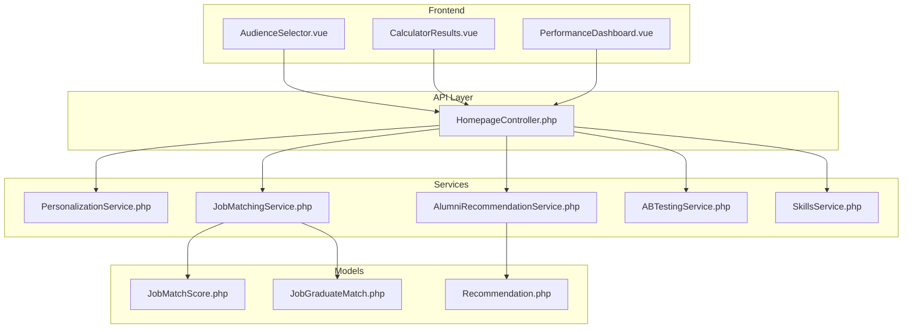
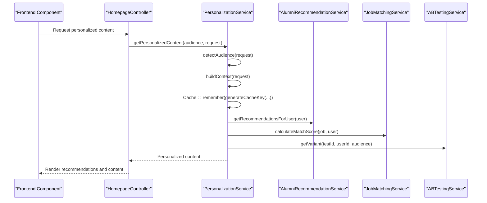
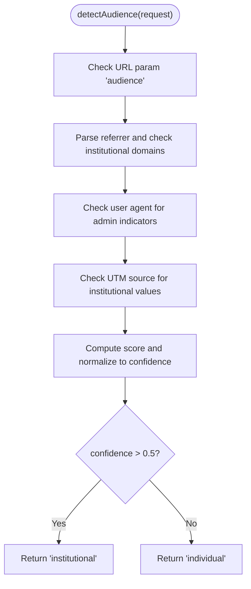
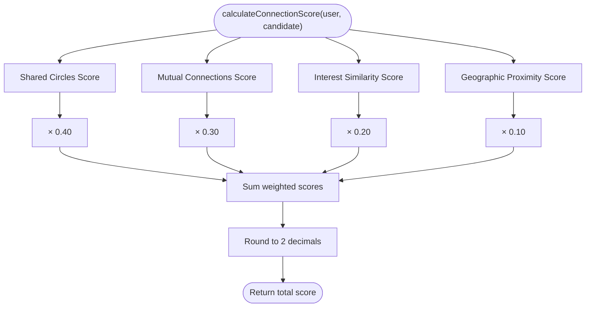
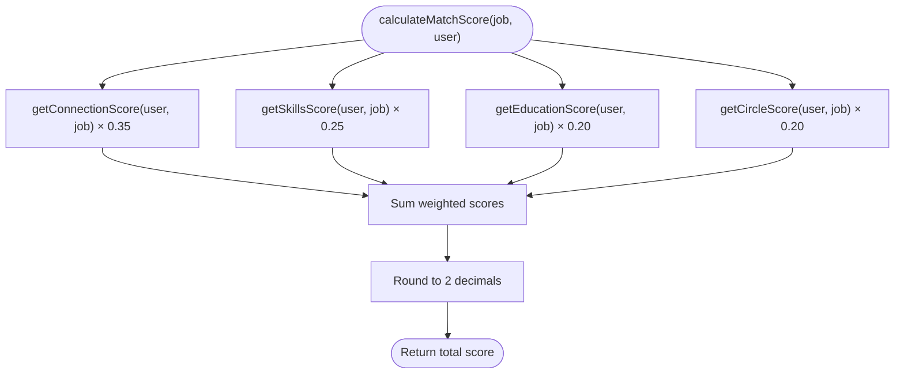
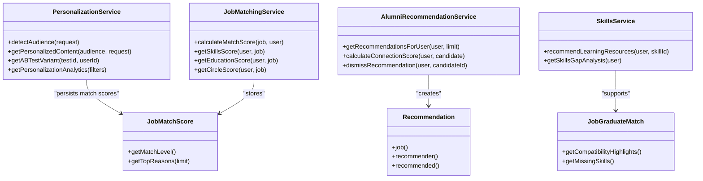

# Personalization & Recommendation Algorithms

<cite>
**Referenced Files in This Document**
- [PersonalizationService.php](file://app/Services/PersonalizationService.php)
- [AlumniRecommendationService.php](file://app/Services/AlumniRecommendationService.php)
- [JobMatchingService.php](file://app/Services/JobMatchingService.php)
- [ABTestingService.php](file://app/Services/ABTestingService.php)
- [SkillsService.php](file://app/Services/SkillsService.php)
- [JobMatchScore.php](file://app/Models/JobMatchScore.php)
- [JobGraduateMatch.php](file://app/Models/JobGraduateMatch.php)
- [Recommendation.php](file://app/Models/Recommendation.php)
- [HomepageController.php](file://app/Http/Controllers/Api/HomepageController.php)
- [AlumniRecommendationServiceTest.php](file://tests/Unit/AlumniRecommendationServiceTest.php)
- [JobMatchingServiceTest.php](file://tests/Unit/JobMatchingServiceTest.php)
- [PersonalizationServiceTest.php](file://tests/Feature/PersonalizationServiceTest.php)
- [CalculatorResults.vue](file://resources/js/components/homepage/calculator/CalculatorResults.vue)
- [AudienceSelector.vue](file://resources/js/components/homepage/AudienceSelector.vue)
- [PerformanceDashboard.vue](file://resources/js/components/Performance/PerformanceDashboard.vue)
- [task-11-search-matching-system-recap.md](file://docs/task-11-search-matching-system-recap.md)
</cite>

## Table of Contents
1. [Introduction](#introduction)
2. [Project Structure](#project-structure)
3. [Core Components](#core-components)
4. [Architecture Overview](#architecture-overview)
5. [Detailed Component Analysis](#detailed-component-analysis)
6. [Dependency Analysis](#dependency-analysis)
7. [Performance Considerations](#performance-considerations)
8. [Troubleshooting Guide](#troubleshooting-guide)
9. [Conclusion](#conclusion)
10. [Appendices](#appendices)

## Introduction
This document explains the personalization and recommendation systems powering job-graduate matching, candidate-alumni connections, and learning recommendations. It details scoring methodologies, compatibility calculations, experience and skill-based matching, course-based recommendations, engine architecture, scoring weights, optimization techniques, A/B testing, and performance metrics. Practical recommendation workflows, user preference integration, and real-time personalization are covered with concrete references to the codebase.

## Project Structure
The recommendation ecosystem spans backend services, models, controllers, and frontend components:
- Services encapsulate recommendation and matching logic
- Models persist match scores and recommendations
- Controllers expose APIs for personalization and analytics
- Frontend components render recommendations and handle user preferences

**Diagram sources**
- [PersonalizationService.php:1-451](file://app/Services/PersonalizationService.php#L1-L451)
- [AlumniRecommendationService.php:1-433](file://app/Services/AlumniRecommendationService.php#L1-L433)
- [JobMatchingService.php:1-362](file://app/Services/JobMatchingService.php#L1-L362)
- [ABTestingService.php:1-561](file://app/Services/ABTestingService.php#L1-L561)
- [SkillsService.php:1-246](file://app/Services/SkillsService.php#L1-L246)
- [JobMatchScore.php:1-146](file://app/Models/JobMatchScore.php#L1-L146)
- [JobGraduateMatch.php:1-156](file://app/Models/JobGraduateMatch.php#L1-L156)
- [Recommendation.php:1-33](file://app/Models/Recommendation.php#L1-L33)
- [HomepageController.php:303-645](file://app/Http/Controllers/Api/HomepageController.php#L303-L645)

**Section sources**
- [PersonalizationService.php:138-174](file://app/Services/PersonalizationService.php#L138-L174)
- [AlumniRecommendationService.php:29-57](file://app/Services/AlumniRecommendationService.php#L29-L57)
- [JobMatchingService.php:26-41](file://app/Services/JobMatchingService.php#L26-L41)
- [ABTestingService.php:14-51](file://app/Services/ABTestingService.php#L14-L51)
- [SkillsService.php:116-135](file://app/Services/SkillsService.php#L116-L135)

## Core Components
- PersonalizationService: Audience detection, content personalization, caching, A/B testing integration, and analytics.
- AlumniRecommendationService: Connection-based recommendations with weighted factors (shared circles, mutual connections, interest similarity, geographic proximity).
- JobMatchingService: Job-user matching with weights for connections, skills, education, and circles.
- SkillsService: Learning resource recommendations filtered by user proficiency and skill gaps.
- JobMatchScore and JobGraduateMatch: Persisted match scores and compatibility highlights.
- ABTestingService: Variant assignment, conversion tracking, and statistical summaries.
- Controllers and Vue components: Expose APIs and render recommendations with user preferences.

**Section sources**
- [PersonalizationService.php:18-133](file://app/Services/PersonalizationService.php#L18-L133)
- [AlumniRecommendationService.php:17-76](file://app/Services/AlumniRecommendationService.php#L17-L76)
- [JobMatchingService.php:14-41](file://app/Services/JobMatchingService.php#L14-L41)
- [SkillsService.php:116-135](file://app/Services/SkillsService.php#L116-L135)
- [JobMatchScore.php:13-35](file://app/Models/JobMatchScore.php#L13-L35)
- [JobGraduateMatch.php:12-34](file://app/Models/JobGraduateMatch.php#L12-L34)
- [ABTestingService.php:14-51](file://app/Services/ABTestingService.php#L14-L51)

## Architecture Overview
The system integrates frontend components, API controllers, and backend services to deliver real-time personalization and recommendations. PersonalizationService orchestrates audience detection and content customization, while specialized services compute recommendations and match scores. ABTestingService enables continuous experimentation and performance measurement.

**Diagram sources**
- [PersonalizationService.php:21-133](file://app/Services/PersonalizationService.php#L21-L133)
- [PersonalizationService.php:138-174](file://app/Services/PersonalizationService.php#L138-L174)
- [AlumniRecommendationService.php:29-57](file://app/Services/AlumniRecommendationService.php#L29-L57)
- [JobMatchingService.php:26-41](file://app/Services/JobMatchingService.php#L26-L41)
- [ABTestingService.php:14-51](file://app/Services/ABTestingService.php#L14-L51)
- [HomepageController.php:303-336](file://app/Http/Controllers/Api/HomepageController.php#L303-L336)

## Detailed Component Analysis

### PersonalizationService
- Audience detection: Uses URL parameters, referrer domain, user agent, and UTM sources to compute a confidence score and classify as individual or institutional.
- Content personalization: Applies geographic, time-based, and behavioral adjustments layered on top of base content.
- Caching: Generates cache keys based on audience, campaign, locale, and hourly variance; includes graceful degradation fallback.
- A/B testing: Provides variant assignment and conversion tracking for experiments.
- Analytics: Returns mock analytics for audience distribution, detection accuracy, conversion rates, and test results.

**Diagram sources**
- [PersonalizationService.php:21-133](file://app/Services/PersonalizationService.php#L21-L133)

**Section sources**
- [PersonalizationService.php:138-174](file://app/Services/PersonalizationService.php#L138-L174)
- [PersonalizationService.php:246-338](file://app/Services/PersonalizationService.php#L246-L338)
- [PersonalizationService.php:343-380](file://app/Services/PersonalizationService.php#L343-L380)
- [PersonalizationService.php:397-425](file://app/Services/PersonalizationService.php#L397-L425)
- [PersonalizationServiceTest.php:118-194](file://tests/Feature/PersonalizationServiceTest.php#L118-L194)

### AlumniRecommendationService
- Scoring weights: Shared circles (40%), mutual connections (30%), interest similarity (20%), geographic proximity (10%).
- Candidate generation: Excludes current connections and applies tenant scoping with limits.
- Filtering: Removes already connected users, pending requests, dismissed recommendations, and users with privacy restrictions.
- Dismissal mechanism: Stores user-dismissed recommendations in cache to prevent re-showing.

**Diagram sources**
- [AlumniRecommendationService.php:62-76](file://app/Services/AlumniRecommendationService.php#L62-L76)

**Section sources**
- [AlumniRecommendationService.php:29-57](file://app/Services/AlumniRecommendationService.php#L29-L57)
- [AlumniRecommendationService.php:128-155](file://app/Services/AlumniRecommendationService.php#L128-L155)
- [AlumniRecommendationService.php:388-400](file://app/Services/AlumniRecommendationService.php#L388-L400)
- [AlumniRecommendationServiceTest.php:271-294](file://tests/Unit/AlumniRecommendationServiceTest.php#L271-L294)

### JobMatchingService
- Weights: Connections (35%), Skills (25%), Education (20%), Circles (20%).
- Connection score: Based on mutual connections at the company, with bonuses for senior roles.
- Skills score: Percentage of matched required skills plus extra skill bonus.
- Education score: Checks degree relevance, field relevance, and school prestige.
- Circle score: Overlap with company employees sharing circles plus employee count bonus.

**Diagram sources**
- [JobMatchingService.php:26-41](file://app/Services/JobMatchingService.php#L26-L41)

**Section sources**
- [JobMatchingService.php:14-41](file://app/Services/JobMatchingService.php#L14-L41)
- [JobMatchingService.php:46-64](file://app/Services/JobMatchingService.php#L46-L64)
- [JobMatchingService.php:69-88](file://app/Services/JobMatchingService.php#L69-L88)
- [JobMatchingService.php:93-127](file://app/Services/JobMatchingService.php#L93-L127)
- [JobMatchingService.php:132-170](file://app/Services/JobMatchingService.php#L132-L170)
- [JobMatchingServiceTest.php:86-310](file://tests/Unit/JobMatchingServiceTest.php#L86-L310)

### SkillsService
- Learning resource recommendations: Filters resources by user proficiency level and skill alignment.
- Gap analysis: Compares user’s current skills with recommended skills for similar professionals.
- Endorsement tracking: Aggregates monthly endorsement counts to visualize progress.

**Section sources**
- [SkillsService.php:116-135](file://app/Services/SkillsService.php#L116-L135)
- [SkillsService.php:137-155](file://app/Services/SkillsService.php#L137-L155)
- [SkillsService.php:234-244](file://app/Services/SkillsService.php#L234-L244)

### JobMatchScore and JobGraduateMatch
- Persistence: Stores composite match scores, per-factor scores, reasons, and timestamps.
- Utilities: Provides match level categorization, recency checks, and top reasons extraction.
- Compatibility highlights: Summarizes match factors like location, salary, and profile completion.

**Section sources**
- [JobMatchScore.php:13-35](file://app/Models/JobMatchScore.php#L13-L35)
- [JobMatchScore.php:62-120](file://app/Models/JobMatchScore.php#L62-L120)
- [JobGraduateMatch.php:12-34](file://app/Models/JobGraduateMatch.php#L12-L34)
- [JobGraduateMatch.php:114-156](file://app/Models/JobGraduateMatch.php#L114-L156)

### ABTestingService
- Variant assignment: Consistent hashing by user ID and test ID; validates weights and variants.
- Conversion tracking: Logs and caches conversions and assignments; calculates conversion rates and significance.
- Test management: Creates, activates/deactivates tests; computes winners and confidence levels.

**Section sources**
- [ABTestingService.php:14-51](file://app/Services/ABTestingService.php#L14-L51)
- [ABTestingService.php:56-91](file://app/Services/ABTestingService.php#L56-L91)
- [ABTestingService.php:129-153](file://app/Services/ABTestingService.php#L129-L153)
- [ABTestingService.php:202-300](file://app/Services/ABTestingService.php#L202-L300)

### Frontend Integration and Real-time Personalization
- AudienceSelector.vue: Computes audience factors from session history and confidence; stores preference in session storage.
- CalculatorResults.vue: Renders personalized recommendations with priority and outcomes.
- PerformanceDashboard.vue: Visualizes performance metrics and generates optimization recommendations.

**Section sources**
- [AudienceSelector.vue:147-180](file://resources/js/components/homepage/AudienceSelector.vue#L147-L180)
- [CalculatorResults.vue:149-177](file://resources/js/components/homepage/calculator/CalculatorResults.vue#L149-L177)
- [PerformanceDashboard.vue:144-432](file://resources/js/components/Performance/PerformanceDashboard.vue#L144-L432)

## Dependency Analysis
- PersonalizationService depends on HomepageService for content retrieval and tracks personalization events.
- AlumniRecommendationService depends on User, Connection, Circle models and caches recommendations.
- JobMatchingService depends on User, JobPosting, JobMatchScore models and computes detailed reasons.
- SkillsService depends on LearningResource, Skill, UserSkill, SkillEndorsement models.
- Controllers orchestrate service calls and expose endpoints for preferences, analytics, and cache management.

**Diagram sources**
- [PersonalizationService.php:1-451](file://app/Services/PersonalizationService.php#L1-L451)
- [AlumniRecommendationService.php:1-433](file://app/Services/AlumniRecommendationService.php#L1-L433)
- [JobMatchingService.php:1-362](file://app/Services/JobMatchingService.php#L1-L362)
- [SkillsService.php:1-246](file://app/Services/SkillsService.php#L1-L246)
- [JobMatchScore.php:1-146](file://app/Models/JobMatchScore.php#L1-L146)
- [JobGraduateMatch.php:1-156](file://app/Models/JobGraduateMatch.php#L1-L156)
- [Recommendation.php:1-33](file://app/Models/Recommendation.php#L1-L33)

**Section sources**
- [PersonalizationService.php:138-174](file://app/Services/PersonalizationService.php#L138-L174)
- [AlumniRecommendationService.php:29-57](file://app/Services/AlumniRecommendationService.php#L29-L57)
- [JobMatchingService.php:258-280](file://app/Services/JobMatchingService.php#L258-L280)
- [SkillsService.php:116-135](file://app/Services/SkillsService.php#L116-L135)

## Performance Considerations
- Caching: PersonalizationService caches content with cache keys varying by audience, campaign, locale, and hour. AlumniRecommendationService caches recommendations per user.
- Batch processing: Background jobs can precompute matches and recommendations to reduce latency.
- Indexing and queries: Use indexed lookups for connections, circles, and skills to minimize query time.
- Progressive filtering: AlumniRecommendationService filters candidates early to limit computation.
- Incremental updates: Update match scores and recommendations on profile changes or new connections.

[No sources needed since this section provides general guidance]

## Troubleshooting Guide
- Invalid audience parameter: PersonalizationService logs warnings for malformed inputs and falls back gracefully.
- Missing or inactive A/B tests: ABTestingService falls back to control variant and logs warnings.
- Cache misses: Verify cache keys and TTL; clear caches via controller endpoints.
- Recommendation duplicates: AlumniRecommendationService filters already connected users and dismissed recommendations.

**Section sources**
- [PersonalizationService.php:40-47](file://app/Services/PersonalizationService.php#L40-L47)
- [PersonalizationService.php:164-171](file://app/Services/PersonalizationService.php#L164-L171)
- [ABTestingService.php:18-29](file://app/Services/ABTestingService.php#L18-L29)
- [ABTestingService.php:334-387](file://app/Services/ABTestingService.php#L334-L387)
- [AlumniRecommendationService.php:338-400](file://app/Services/AlumniRecommendationService.php#L338-L400)

## Conclusion
The system combines robust scoring mechanisms, caching, and A/B testing to deliver personalized recommendations. Job-graduate and candidate-alumni matching leverage weighted factors and compatibility heuristics, while SkillsService supports course-based recommendations tailored to user proficiency. The architecture balances real-time personalization with scalability through caching and batch processing.

[No sources needed since this section summarizes without analyzing specific files]

## Appendices

### Practical Recommendation Workflows
- Job recommendation pipeline:
  1. Fetch user profile and preferences.
  2. Compute match score using JobMatchingService.
  3. Persist score via JobMatchScore.
  4. Render top recommendations in CalculatorResults.vue.
- Alumni connection recommendations:
  1. Compute connection score using AlumniRecommendationService.
  2. Filter and cache recommendations.
  3. Allow dismissal and refresh recommendations.

**Section sources**
- [JobMatchingService.php:26-41](file://app/Services/JobMatchingService.php#L26-L41)
- [JobMatchScore.php:258-280](file://app/Services/JobMatchingService.php#L258-L280)
- [AlumniRecommendationService.php:29-57](file://app/Services/AlumniRecommendationService.php#L29-L57)

### A/B Testing Capabilities and Metrics
- Variant assignment: Consistent hashing by user ID and test ID.
- Conversion tracking: Tracks goals and aggregates daily conversions.
- Statistical significance: Calculates conversion rates and mock significance for winner determination.

**Section sources**
- [ABTestingService.php:14-51](file://app/Services/ABTestingService.php#L14-L51)
- [ABTestingService.php:56-91](file://app/Services/ABTestingService.php#L56-L91)
- [ABTestingService.php:129-153](file://app/Services/ABTestingService.php#L129-L153)

### Personalization Factors and Machine Learning Notes
- Personalization factors include user profile, search history, application history, profile completeness, activity level, and feedback integration.
- Machine learning integration covers click-through prediction, application prediction, match quality learning, user preference learning, and seasonal adjustments.

**Section sources**
- [task-11-search-matching-system-recap.md:373-387](file://docs/task-11-search-matching-system-recap.md#L373-L387)