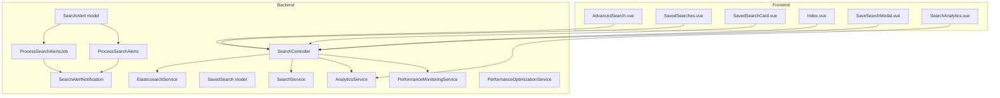
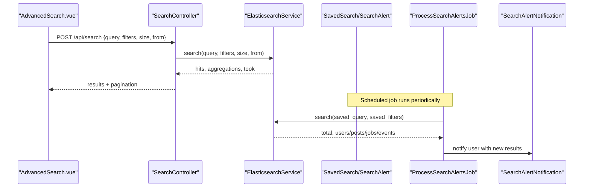
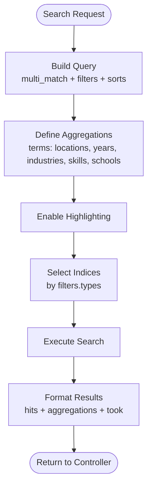
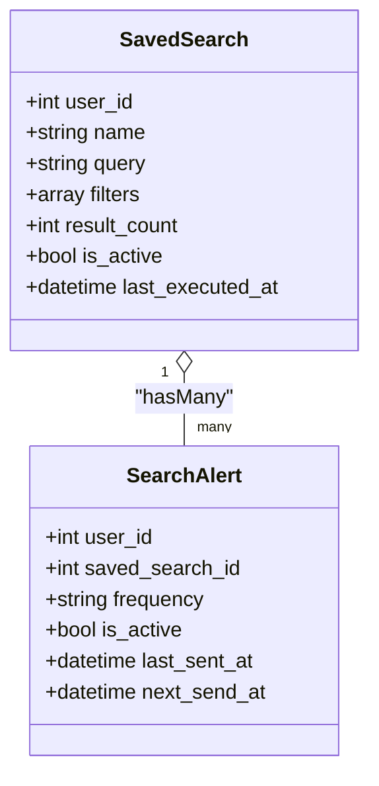
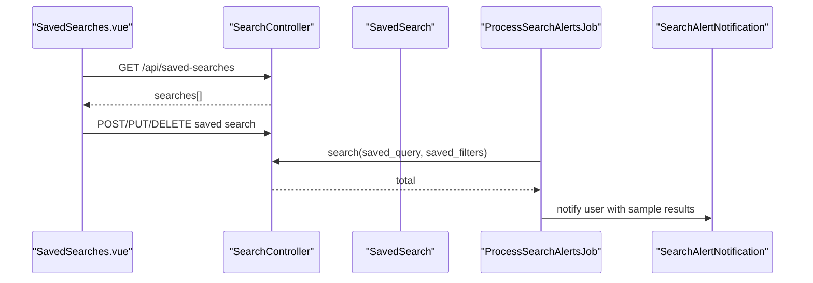
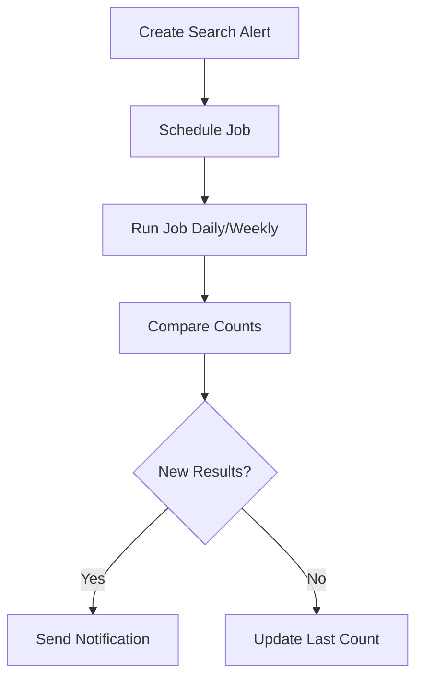
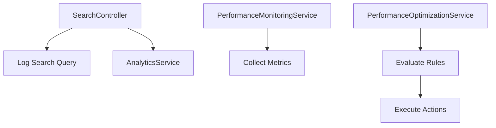
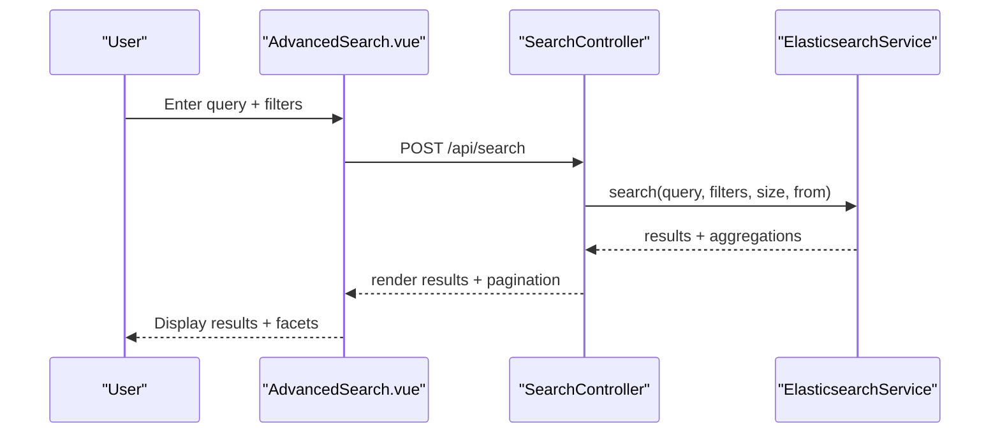
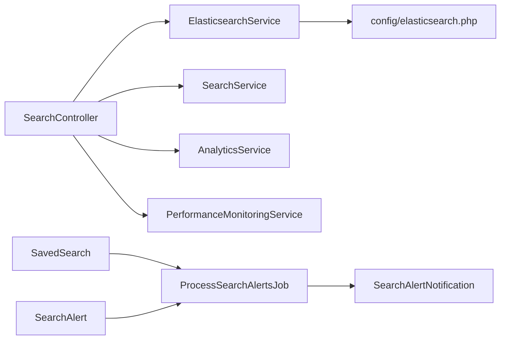

# Search & Discovery

<cite>
**Referenced Files in This Document**
- [ElasticsearchService.php](file://app/Services/ElasticsearchService.php)
- [SearchController.php](file://app/Http/Controllers/Api/SearchController.php)
- [elasticsearch.php](file://config/elasticsearch.php)
- [SearchService.php](file://app/Services/SearchService.php)
- [SavedSearch.php](file://app/Models/SavedSearch.php)
- [SearchAlert.php](file://app/Models/SearchAlert.php)
- [ProcessSearchAlerts.php](file://app/Jobs/ProcessSearchAlerts.php)
- [ProcessSearchAlertsJob.php](file://app/Jobs/ProcessSearchAlertsJob.php)
- [SearchAlertNotification.php](file://app/Notifications/SearchAlertNotification.php)
- [search-alert.blade.php](file://resources/views/emails/search-alert.blade.php)
- [AnalyticsService.php](file://app/Services/AnalyticsService.php)
- [PerformanceMonitoringService.php](file://app/Services/PerformanceMonitoringService.php)
- [PerformanceOptimizationService.php](file://app/Services/PerformanceOptimizationService.php)
- [AdvancedSearch.vue](file://resources/js/components/AdvancedSearch.vue)
- [SavedSearches.vue](file://resources/js/components/SavedSearches.vue)
- [SavedSearchCard.vue](file://resources/js/Pages/Search/Components/SavedSearchCard.vue)
- [Index.vue](file://resources/js/Pages/Search/Index.vue)
- [SaveSearchModal.vue](file://resources/js/Pages/Search/Components/SaveSearchModal.vue)
- [SearchAnalytics.vue](file://resources/js/components/SearchAnalytics.vue)
- [PersonalizationService.php](file://app/Services/PersonalizationService.php)
- [HomepageController.php](file://app/Http/Controllers/Api/HomepageController.php)
- [task-11-search-matching-system-recap.md](file://docs/task-11-search-matching-system-recap.md)
- [task-17-performance-optimization-recap.md](file://docs/task-17-performance-optimization-recap.md)
</cite>

## Table of Contents
1. [Introduction](#introduction)
2. [Project Structure](#project-structure)
3. [Core Components](#core-components)
4. [Architecture Overview](#architecture-overview)
5. [Detailed Component Analysis](#detailed-component-analysis)
6. [Dependency Analysis](#dependency-analysis)
7. [Performance Considerations](#performance-considerations)
8. [Troubleshooting Guide](#troubleshooting-guide)
9. [Conclusion](#conclusion)
10. [Appendices](#appendices)

## Introduction
This document describes the Search & Discovery system with a focus on Elasticsearch integration, advanced filtering, faceted search, saved searches, persistent preferences, search alerts, personalization, and performance monitoring. It explains configuration, indexing strategies, ranking and relevance scoring, analytics, and practical workflows for both administrators and users.

## Project Structure
The search system spans backend services, controllers, models, jobs, notifications, and frontend components:
- Backend
  - Elasticsearch integration via a dedicated service
  - API controller for search requests and suggestions
  - Saved searches and search alerts models and jobs
  - Analytics and performance monitoring services
- Frontend
  - Vue components for advanced search, saved searches, and analytics

**Diagram sources**
- [SearchController.php:58-96](file://app/Http/Controllers/Api/SearchController.php#L58-L96)
- [ElasticsearchService.php:205-236](file://app/Services/ElasticsearchService.php#L205-L236)
- [SearchService.php:1-531](file://app/Services/SearchService.php#L1-L531)
- [SavedSearch.php:1-46](file://app/Models/SavedSearch.php#L1-L46)
- [SearchAlert.php:1-44](file://app/Models/SearchAlert.php#L1-L44)
- [ProcessSearchAlertsJob.php:52-97](file://app/Jobs/ProcessSearchAlertsJob.php#L52-L97)
- [ProcessSearchAlerts.php:42-74](file://app/Jobs/ProcessSearchAlerts.php#L42-L74)
- [SearchAlertNotification.php:83-102](file://app/Notifications/SearchAlertNotification.php#L83-L102)
- [AnalyticsService.php:1-800](file://app/Services/AnalyticsService.php#L1-L800)
- [PerformanceMonitoringService.php:1-433](file://app/Services/PerformanceMonitoringService.php#L1-L433)
- [PerformanceOptimizationService.php:884-918](file://app/Services/PerformanceOptimizationService.php#L884-L918)
- [AdvancedSearch.vue:299-341](file://resources/js/components/AdvancedSearch.vue#L299-L341)
- [SavedSearches.vue:287-385](file://resources/js/components/SavedSearches.vue#L287-L385)
- [SavedSearchCard.vue:43-67](file://resources/js/Pages/Search/Components/SavedSearchCard.vue#L43-L67)
- [Index.vue:294-391](file://resources/js/Pages/Search/Index.vue#L294-L391)
- [SaveSearchModal.vue:78-129](file://resources/js/Pages/Search/Components/SaveSearchModal.vue#L78-L129)
- [SearchAnalytics.vue:1-77](file://resources/js/components/SearchAnalytics.vue#L1-L77)

**Section sources**
- [SearchController.php:58-96](file://app/Http/Controllers/Api/SearchController.php#L58-L96)
- [ElasticsearchService.php:205-236](file://app/Services/ElasticsearchService.php#L205-L236)
- [AdvancedSearch.vue:299-341](file://resources/js/components/AdvancedSearch.vue#L299-L341)

## Core Components
- ElasticsearchService: Centralized search orchestration, query building, aggregations, highlighting, fallbacks, and index helpers.
- SearchController: API entry point for search and suggestions, analytics logging, pagination, and error handling.
- SearchService: Traditional relational search and recommendations with filters and scoring.
- SavedSearch and SearchAlert models: Persistent user search definitions and alert subscriptions.
- ProcessSearchAlertsJob and ProcessSearchAlerts: Background processing to detect new results and notify users.
- AnalyticsService and PerformanceMonitoringService: Search analytics and system performance monitoring/alerting.
- Frontend components: Advanced search UI, saved searches management, and analytics dashboards.

**Section sources**
- [ElasticsearchService.php:205-236](file://app/Services/ElasticsearchService.php#L205-L236)
- [SearchController.php:58-96](file://app/Http/Controllers/Api/SearchController.php#L58-L96)
- [SearchService.php:1-531](file://app/Services/SearchService.php#L1-L531)
- [SavedSearch.php:1-46](file://app/Models/SavedSearch.php#L1-L46)
- [SearchAlert.php:1-44](file://app/Models/SearchAlert.php#L1-L44)
- [ProcessSearchAlertsJob.php:52-97](file://app/Jobs/ProcessSearchAlertsJob.php#L52-L97)
- [ProcessSearchAlerts.php:42-74](file://app/Jobs/ProcessSearchAlerts.php#L42-L74)
- [AnalyticsService.php:1-800](file://app/Services/AnalyticsService.php#L1-L800)
- [PerformanceMonitoringService.php:1-433](file://app/Services/PerformanceMonitoringService.php#L1-L433)

## Architecture Overview
The system integrates Elasticsearch for scalable, real-time search with faceted navigation and highlighting, while maintaining relational-backed saved searches and recommendations. Alerts trigger periodic checks and notifications. Frontend components provide rich UX for multi-criteria search, saved searches, and analytics.

**Diagram sources**
- [AdvancedSearch.vue:299-341](file://resources/js/components/AdvancedSearch.vue#L299-L341)
- [SearchController.php:58-96](file://app/Http/Controllers/Api/SearchController.php#L58-L96)
- [ElasticsearchService.php:205-236](file://app/Services/ElasticsearchService.php#L205-L236)
- [ProcessSearchAlertsJob.php:52-97](file://app/Jobs/ProcessSearchAlertsJob.php#L52-L97)
- [SearchAlertNotification.php:83-102](file://app/Notifications/SearchAlertNotification.php#L83-L102)

## Detailed Component Analysis

### Elasticsearch Integration and Indexing
- Configuration
  - Host, index prefix, shard/replica settings, and search/indexing defaults are configured centrally.
- Search API
  - Multi-index search across users, posts, jobs, events with dynamic index selection based on filters.
  - Query building supports multi-match text search, filters, sorting, highlighting, and aggregations.
  - Aggregations include locations, graduation years, industries, skills, schools.
  - Fallback handling ensures resilience when Elasticsearch is unavailable.
- Indexing
  - Dedicated methods to index user, post, and other content types.
  - Suggesters support completion-based autosuggest for names and skills.
- Count-only queries enable fast result counting without retrieving documents.

**Diagram sources**
- [ElasticsearchService.php:205-236](file://app/Services/ElasticsearchService.php#L205-L236)
- [ElasticsearchService.php:592-619](file://app/Services/ElasticsearchService.php#L592-L619)
- [ElasticsearchService.php:621-637](file://app/Services/ElasticsearchService.php#L621-L637)

**Section sources**
- [elasticsearch.php:1-36](file://config/elasticsearch.php#L1-L36)
- [ElasticsearchService.php:205-236](file://app/Services/ElasticsearchService.php#L205-L236)
- [ElasticsearchService.php:592-619](file://app/Services/ElasticsearchService.php#L592-L619)
- [ElasticsearchService.php:621-637](file://app/Services/ElasticsearchService.php#L621-L637)

### Advanced Filtering and Faceted Search
- Multi-criteria search
  - Filters support text, numeric ranges, arrays, and boolean conditions.
  - Sorting options per entity type (e.g., salary, deadline, applications).
- Faceted aggregations
  - Terms aggregations on location, graduation year, industry, skills, school.
  - Used to power filters and drill-down UI.
- Saved searches and preferences
  - Users can save current search criteria and optionally enable email alerts with configurable frequencies.

**Diagram sources**
- [SavedSearch.php:1-46](file://app/Models/SavedSearch.php#L1-L46)
- [SearchAlert.php:1-44](file://app/Models/SearchAlert.php#L1-L44)

**Section sources**
- [SearchService.php:272-446](file://app/Services/SearchService.php#L272-L446)
- [SavedSearch.php:1-46](file://app/Models/SavedSearch.php#L1-L46)
- [SearchAlert.php:1-44](file://app/Models/SearchAlert.php#L1-L44)

### Saved Searches and Persistent Preferences
- Users can save searches with a name, query, filters, and optional alert settings.
- Frontend components provide:
  - Save current search modal
  - List of saved searches with quick run/edit/delete
  - Toggle and configure alert frequency
- Backend jobs periodically evaluate saved searches and send notifications when new results appear.

**Diagram sources**
- [SavedSearches.vue:287-385](file://resources/js/components/SavedSearches.vue#L287-L385)
- [Index.vue:294-391](file://resources/js/Pages/Search/Index.vue#L294-L391)
- [SavedSearchCard.vue:43-67](file://resources/js/Pages/Search/Components/SavedSearchCard.vue#L43-L67)
- [ProcessSearchAlertsJob.php:52-97](file://app/Jobs/ProcessSearchAlertsJob.php#L52-L97)
- [SearchAlertNotification.php:83-102](file://app/Notifications/SearchAlertNotification.php#L83-L102)

**Section sources**
- [SavedSearches.vue:287-385](file://resources/js/components/SavedSearches.vue#L287-L385)
- [Index.vue:294-391](file://resources/js/Pages/Search/Index.vue#L294-L391)
- [SavedSearchCard.vue:43-67](file://resources/js/Pages/Search/Components/SavedSearchCard.vue#L43-L67)
- [ProcessSearchAlertsJob.php:52-97](file://app/Jobs/ProcessSearchAlertsJob.php#L52-L97)

### Search Alerts and Notifications
- Alert creation links a saved search to a user with frequency and activation flags.
- Jobs compute current result counts and compare to previous counts; if increased, a notification is sent.
- Email templates render alert summaries and sample results.

**Diagram sources**
- [ProcessSearchAlerts.php:42-74](file://app/Jobs/ProcessSearchAlerts.php#L42-L74)
- [ProcessSearchAlertsJob.php:52-97](file://app/Jobs/ProcessSearchAlertsJob.php#L52-L97)
- [SearchAlertNotification.php:83-102](file://app/Notifications/SearchAlertNotification.php#L83-L102)
- [search-alert.blade.php:1-252](file://resources/views/emails/search-alert.blade.php#L1-L252)

**Section sources**
- [ProcessSearchAlerts.php:42-74](file://app/Jobs/ProcessSearchAlerts.php#L42-L74)
- [ProcessSearchAlertsJob.php:52-97](file://app/Jobs/ProcessSearchAlertsJob.php#L52-L97)
- [SearchAlertNotification.php:83-102](file://app/Notifications/SearchAlertNotification.php#L83-L102)
- [search-alert.blade.php:1-252](file://resources/views/emails/search-alert.blade.php#L1-L252)

### Personalization Algorithms and Smart Recommendations
- Personalization service exposes analytics and cache controls for personalization features.
- The search matching system documentation outlines relevance scoring, personalization factors, and ML integration points (e.g., click-through prediction, application prediction, match quality learning).
- Frontend components surface personalized recommendations and relevance scores.

**Diagram sources**
- [PersonalizationService.php:394-425](file://app/Services/PersonalizationService.php#L394-L425)
- [task-11-search-matching-system-recap.md:363-387](file://docs/task-11-search-matching-system-recap.md#L363-L387)
- [AdvancedSearch.vue:107-146](file://resources/js/components/AdvancedSearch.vue#L107-L146)

**Section sources**
- [PersonalizationService.php:394-425](file://app/Services/PersonalizationService.php#L394-L425)
- [task-11-search-matching-system-recap.md:363-387](file://docs/task-11-search-matching-system-recap.md#L363-L387)

### Search Analytics and Query Optimization
- SearchController logs queries and tracks analytics after search execution.
- AnalyticsService provides engagement, platform usage, community health, and outcome metrics.
- PerformanceMonitoringService collects system metrics, enforces budgets, and triggers alerts.
- PerformanceOptimizationService evaluates automated optimization rules and executes actions.

**Diagram sources**
- [SearchController.php:58-96](file://app/Http/Controllers/Api/SearchController.php#L58-L96)
- [AnalyticsService.php:1-800](file://app/Services/AnalyticsService.php#L1-L800)
- [PerformanceMonitoringService.php:257-273](file://app/Services/PerformanceMonitoringService.php#L257-L273)
- [PerformanceOptimizationService.php:884-918](file://app/Services/PerformanceOptimizationService.php#L884-L918)

**Section sources**
- [SearchController.php:58-96](file://app/Http/Controllers/Api/SearchController.php#L58-L96)
- [AnalyticsService.php:1-800](file://app/Services/AnalyticsService.php#L1-L800)
- [PerformanceMonitoringService.php:1-433](file://app/Services/PerformanceMonitoringService.php#L1-L433)
- [PerformanceOptimizationService.php:884-918](file://app/Services/PerformanceOptimizationService.php#L884-L918)

### Practical Search Workflows
- Multi-criteria search
  - Enter query, apply filters, sort, and paginate results.
  - Use facets to refine and explore data.
- Save and run saved searches
  - Save current criteria, toggle alerts, and run at any time.
- Receive search alerts
  - Get emails when new results match saved searches.

**Diagram sources**
- [AdvancedSearch.vue:299-341](file://resources/js/components/AdvancedSearch.vue#L299-L341)
- [SearchController.php:58-96](file://app/Http/Controllers/Api/SearchController.php#L58-L96)
- [ElasticsearchService.php:205-236](file://app/Services/ElasticsearchService.php#L205-L236)

**Section sources**
- [AdvancedSearch.vue:299-341](file://resources/js/components/AdvancedSearch.vue#L299-L341)
- [SavedSearches.vue:287-385](file://resources/js/components/SavedSearches.vue#L287-L385)
- [Index.vue:294-391](file://resources/js/Pages/Search/Index.vue#L294-L391)

## Dependency Analysis
- ElasticsearchService depends on configuration and provides query builders, aggregations, and formatting.
- SearchController orchestrates analytics and delegates to ElasticsearchService and SearchService.
- SavedSearch and SearchAlert models encapsulate persistence and relationships.
- Jobs depend on ElasticsearchService to compute deltas and trigger notifications.
- AnalyticsService and PerformanceMonitoringService operate independently but feed dashboards and alerts.

**Diagram sources**
- [elasticsearch.php:1-36](file://config/elasticsearch.php#L1-L36)
- [SearchController.php:58-96](file://app/Http/Controllers/Api/SearchController.php#L58-L96)
- [ElasticsearchService.php:205-236](file://app/Services/ElasticsearchService.php#L205-L236)
- [SearchService.php:1-531](file://app/Services/SearchService.php#L1-L531)
- [SavedSearch.php:1-46](file://app/Models/SavedSearch.php#L1-L46)
- [SearchAlert.php:1-44](file://app/Models/SearchAlert.php#L1-L44)
- [ProcessSearchAlertsJob.php:52-97](file://app/Jobs/ProcessSearchAlertsJob.php#L52-L97)
- [SearchAlertNotification.php:83-102](file://app/Notifications/SearchAlertNotification.php#L83-L102)

**Section sources**
- [elasticsearch.php:1-36](file://config/elasticsearch.php#L1-L36)
- [SearchController.php:58-96](file://app/Http/Controllers/Api/SearchController.php#L58-L96)
- [ElasticsearchService.php:205-236](file://app/Services/ElasticsearchService.php#L205-L236)
- [SavedSearch.php:1-46](file://app/Models/SavedSearch.php#L1-L46)
- [SearchAlert.php:1-44](file://app/Models/SearchAlert.php#L1-L44)
- [ProcessSearchAlertsJob.php:52-97](file://app/Jobs/ProcessSearchAlertsJob.php#L52-L97)

## Performance Considerations
- Elasticsearch tuning
  - Shard/replica configuration, default sizes, and suggestion limits are configurable.
  - Use aggregations judiciously; cap sizes to control cardinality.
- Query optimization
  - Prefer filtered queries with term-level filters.
  - Use highlighting sparingly; adjust fragment sizes.
  - Paginate aggressively; avoid large from values.
- Caching and fallbacks
  - ElasticsearchService includes fallback logic for degraded mode.
  - Frontend caches user selections and displays suggestions progressively.
- Monitoring and alerting
  - PerformanceMonitoringService tracks render times, memory, and system metrics.
  - PerformanceOptimizationService evaluates rules and executes remediation actions.

[No sources needed since this section provides general guidance]

## Troubleshooting Guide
- Elasticsearch unavailable
  - Verify host and index prefix configuration.
  - Confirm fallback logic returns reasonable results.
- Search returns unexpected results
  - Inspect filters and sorting parameters.
  - Review aggregations and highlighting configuration.
- Saved searches not triggering alerts
  - Confirm job scheduling and saved search counts are updating.
  - Check notification delivery and email templates.
- Performance issues
  - Review component render times and system metrics.
  - Use performance monitoring and optimization services to identify bottlenecks.

**Section sources**
- [elasticsearch.php:1-36](file://config/elasticsearch.php#L1-L36)
- [ElasticsearchService.php:205-236](file://app/Services/ElasticsearchService.php#L205-L236)
- [ProcessSearchAlertsJob.php:52-97](file://app/Jobs/ProcessSearchAlertsJob.php#L52-L97)
- [PerformanceMonitoringService.php:1-433](file://app/Services/PerformanceMonitoringService.php#L1-L433)
- [PerformanceOptimizationService.php:884-918](file://app/Services/PerformanceOptimizationService.php#L884-L918)

## Conclusion
The Search & Discovery system combines Elasticsearch for high-performance, faceted search with relational persistence for saved searches and alerts. It offers robust analytics, performance monitoring, and personalization hooks. The frontend components deliver a rich, responsive experience for multi-criteria search, saved preferences, and actionable insights.

[No sources needed since this section summarizes without analyzing specific files]

## Appendices

### Configuration Reference
- Elasticsearch configuration keys: host, index prefix, shards, replicas, default search sizes, suggestion size, indexing batch size, queue connection.

**Section sources**
- [elasticsearch.php:1-36](file://config/elasticsearch.php#L1-L36)

### API Endpoints (Overview)
- POST /api/search: Execute multi-criteria search with pagination and aggregations.
- GET /api/saved-searches: List saved searches for the authenticated user.
- POST/PUT/DELETE /api/saved-searches: Manage saved searches and alert preferences.
- POST /api/saved-searches/{id}/run: Execute a saved search immediately.
- GET /api/notifications: Retrieve notifications (including search alerts).

**Section sources**
- [SearchController.php:58-96](file://app/Http/Controllers/Api/SearchController.php#L58-L96)
- [SavedSearches.vue:287-385](file://resources/js/components/SavedSearches.vue#L287-L385)
- [Index.vue:294-391](file://resources/js/Pages/Search/Index.vue#L294-L391)

### Personalization and Matching Notes
- Relevance scoring and personalization factors are documented in the search matching system recap.
- Personalization analytics and cache controls are exposed via the homepage controller.

**Section sources**
- [task-11-search-matching-system-recap.md:363-387](file://docs/task-11-search-matching-system-recap.md#L363-L387)
- [HomepageController.php:613-645](file://app/Http/Controllers/Api/HomepageController.php#L613-L645)