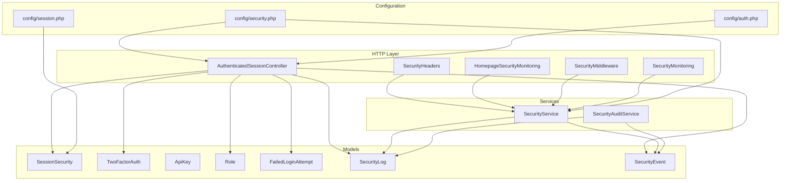
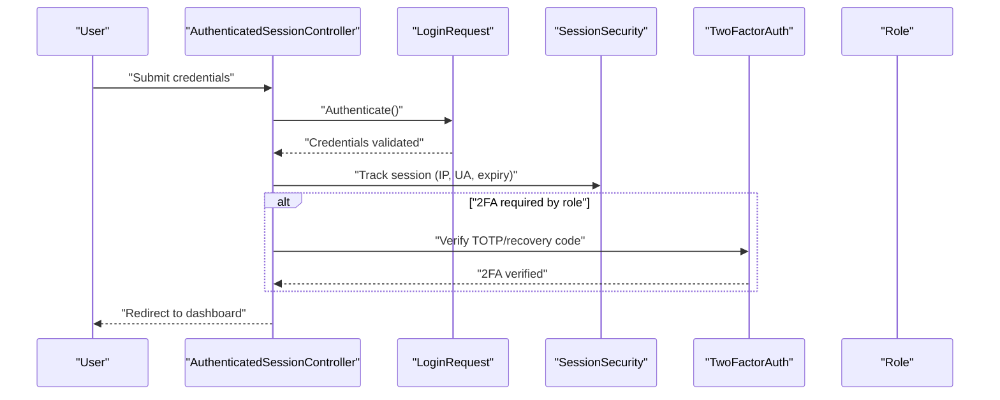
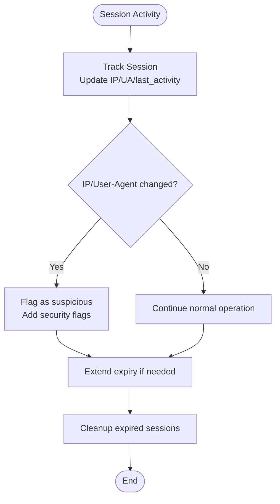
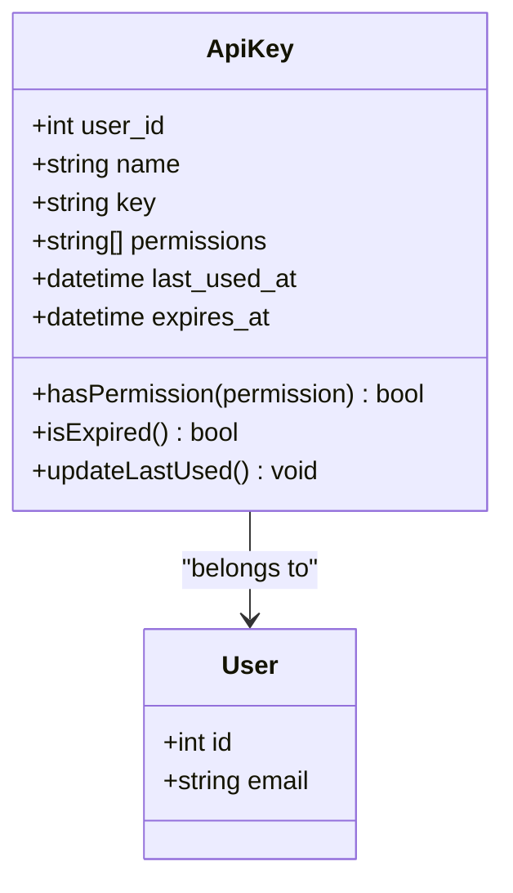
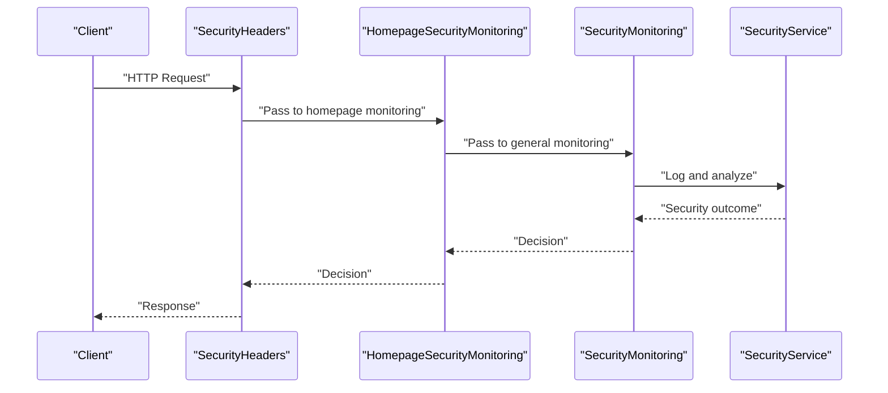
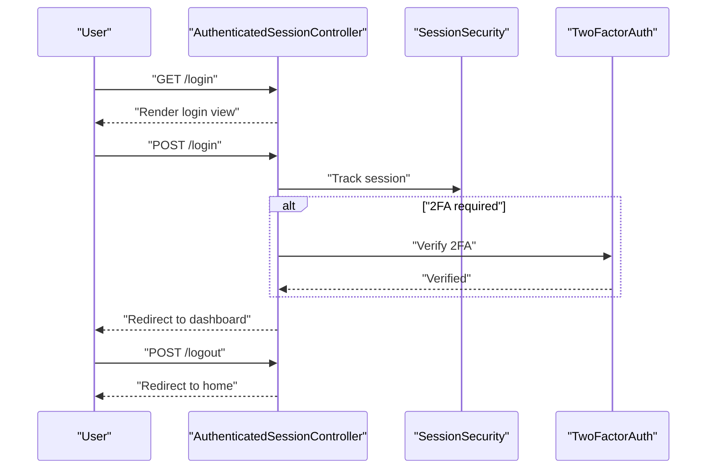
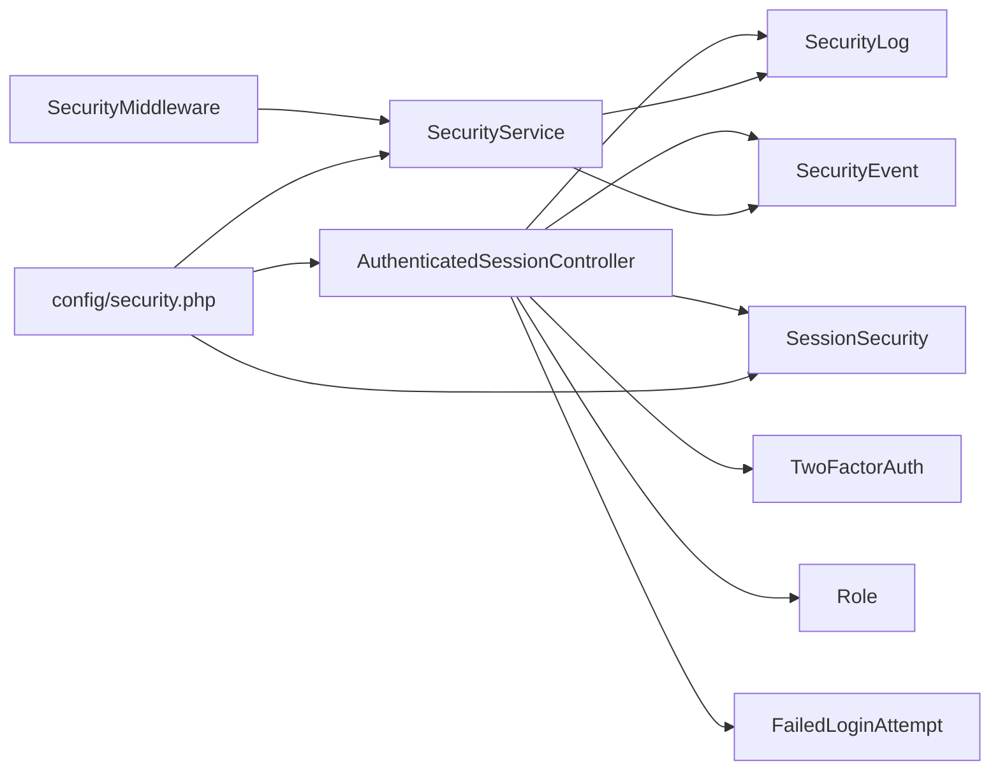

# Authentication & Access Control

<cite>
**Referenced Files in This Document**
- [AuthenticatedSessionController.php](file://app/Http/Controllers/Auth/AuthenticatedSessionController.php)
- [LoginRequest.php](file://app/Http/Requests/Auth/LoginRequest.php)
- [TwoFactorAuth.php](file://app/Models/TwoFactorAuth.php)
- [ApiKey.php](file://app/Models/ApiKey.php)
- [SessionSecurity.php](file://app/Models/SessionSecurity.php)
- [Role.php](file://app/Models/Role.php)
- [security.php](file://config/security.php)
- [session.php](file://config/session.php)
- [auth.php](file://config/auth.php)
- [SecurityHeaders.php](file://app/Http/Middleware/SecurityHeaders.php)
- [HomepageSecurityMonitoring.php](file://app/Http/Middleware/HomepageSecurityMonitoring.php)
- [SecurityMiddleware.php](file://app/Http/Middleware/SecurityMiddleware.php)
- [SecurityMonitoring.php](file://app/Http/Middleware/SecurityMonitoring.php)
- [SecurityService.php](file://app/Services/SecurityService.php)
- [SecurityAuditService.php](file://app/Services/SecurityAuditService.php)
- [SecurityEvent.php](file://app/Models/SecurityEvent.php)
- [SecurityLog.php](file://app/Models/SecurityLog.php)
- [FailedLoginAttempt.php](file://app/Models/FailedLoginAttempt.php)
- [auth.php](file://routes/auth.php)
- [api.php](file://routes/api.php)
- [web.php](file://routes/web.php)
- [AuthenticationTest.php](file://tests/Feature/Auth/AuthenticationTest.php)
- [SecurityIntegrationTest.php](file://tests/Feature/Security/SecurityIntegrationTest.php)
- [AuthenticationSecurityTest.php](file://tests/Security/AuthenticationSecurityTest.php)
</cite>

## Table of Contents
1. [Introduction](#introduction)
2. [Project Structure](#project-structure)
3. [Core Components](#core-components)
4. [Architecture Overview](#architecture-overview)
5. [Detailed Component Analysis](#detailed-component-analysis)
6. [Dependency Analysis](#dependency-analysis)
7. [Performance Considerations](#performance-considerations)
8. [Troubleshooting Guide](#troubleshooting-guide)
9. [Conclusion](#conclusion)

## Introduction
This document provides a comprehensive guide to the authentication and access control mechanisms in the application. It covers multi-factor authentication (MFA) with TOTP setup and recovery codes, role-based 2FA requirements, session management with timeouts and suspicious activity tracking, API key management and token-based authentication, secure credential storage, login attempt limits and lockout mechanisms, brute force protection, security middleware, header validation, homepage security monitoring, password policies, secure password hashing, and credential rotation procedures.

## Project Structure
The authentication and access control system spans several layers:
- HTTP Controllers handle login/logout flows and manage session lifecycle.
- Models encapsulate security-relevant entities such as sessions, two-factor authentication, API keys, roles, failed login attempts, and security logs/events.
- Configuration files define global security settings including rate limits, session timeouts, and 2FA requirements.
- Middleware enforces security headers, monitors requests, and validates headers.
- Services provide higher-level security orchestration and auditing.
- Routes define protected endpoints and authentication flows.

**Diagram sources**
- [AuthenticatedSessionController.php:1-52](file://app/Http/Controllers/Auth/AuthenticatedSessionController.php#L1-L52)
- [SessionSecurity.php:1-133](file://app/Models/SessionSecurity.php#L1-L133)
- [TwoFactorAuth.php:1-164](file://app/Models/TwoFactorAuth.php#L1-L164)
- [ApiKey.php:1-52](file://app/Models/ApiKey.php#L1-L52)
- [Role.php:1-22](file://app/Models/Role.php#L1-L22)
- [security.php:1-76](file://config/security.php#L1-L76)
- [session.php](file://config/session.php)
- [auth.php](file://config/auth.php)
- [SecurityHeaders.php](file://app/Http/Middleware/SecurityHeaders.php)
- [HomepageSecurityMonitoring.php](file://app/Http/Middleware/HomepageSecurityMonitoring.php)
- [SecurityMiddleware.php](file://app/Http/Middleware/SecurityMiddleware.php)
- [SecurityMonitoring.php](file://app/Http/Middleware/SecurityMonitoring.php)
- [SecurityService.php](file://app/Services/SecurityService.php)
- [SecurityAuditService.php](file://app/Services/SecurityAuditService.php)
- [SecurityEvent.php](file://app/Models/SecurityEvent.php)
- [SecurityLog.php](file://app/Models/SecurityLog.php)
- [FailedLoginAttempt.php](file://app/Models/FailedLoginAttempt.php)

**Section sources**
- [AuthenticatedSessionController.php:1-52](file://app/Http/Controllers/Auth/AuthenticatedSessionController.php#L1-L52)
- [security.php:1-76](file://config/security.php#L1-L76)

## Core Components
- SessionSecurity model tracks session metadata, suspicious activity flags, and expiration. It supports activity updates, suspicious flagging, and cleanup of expired records.
- TwoFactorAuth model manages TOTP secret encryption/decryption, recovery codes generation and validation, QR code URL construction, and placeholder TOTP verification.
- ApiKey model stores API keys with permissions, last used timestamps, and expiration, enabling granular access control for programmatic clients.
- Role model integrates with the permission system to support role-based 2FA requirements.
- Security configuration defines login attempt limits, lockout duration, rate limits, session timeout, and 2FA policy for specific roles.
- Security middleware enforces security headers, validates headers, monitors traffic, and performs homepage security checks.
- SecurityService and SecurityAuditService coordinate logging, event recording, and audit trails for security incidents.

**Section sources**
- [SessionSecurity.php:1-133](file://app/Models/SessionSecurity.php#L1-L133)
- [TwoFactorAuth.php:1-164](file://app/Models/TwoFactorAuth.php#L1-L164)
- [ApiKey.php:1-52](file://app/Models/ApiKey.php#L1-L52)
- [Role.php:1-22](file://app/Models/Role.php#L1-L22)
- [security.php:1-76](file://config/security.php#L1-L76)
- [SecurityHeaders.php](file://app/Http/Middleware/SecurityHeaders.php)
- [HomepageSecurityMonitoring.php](file://app/Http/Middleware/HomepageSecurityMonitoring.php)
- [SecurityMiddleware.php](file://app/Http/Middleware/SecurityMiddleware.php)
- [SecurityMonitoring.php](file://app/Http/Middleware/SecurityMonitoring.php)
- [SecurityService.php](file://app/Services/SecurityService.php)
- [SecurityAuditService.php](file://app/Services/SecurityAuditService.php)

## Architecture Overview
The authentication and access control architecture integrates controllers, models, configuration, middleware, and services to enforce robust security policies.

**Diagram sources**
- [AuthenticatedSessionController.php:30-37](file://app/Http/Controllers/Auth/AuthenticatedSessionController.php#L30-L37)
- [LoginRequest.php](file://app/Http/Requests/Auth/LoginRequest.php)
- [SessionSecurity.php:60-100](file://app/Models/SessionSecurity.php#L60-L100)
- [TwoFactorAuth.php:145-162](file://app/Models/TwoFactorAuth.php#L145-L162)
- [Role.php:1-22](file://app/Models/Role.php#L1-L22)

## Detailed Component Analysis

### Multi-Factor Authentication (MFA) with TOTP and Recovery Codes
- TOTP Secret Management: Secrets are stored encrypted and decrypted transparently via model accessors/mutators. The model exposes helper methods to enable/disable 2FA, generate recovery codes, validate recovery codes, and construct QR code URLs for provisioning.
- Recovery Codes: Recovery codes are generated with a fixed count, stored encrypted, and validated case-insensitively. Once used, they are removed from the set.
- Role-Based 2FA Requirements: Configuration specifies which roles require 2FA. During login, if the user's role requires 2FA, the system prompts for TOTP verification or recovery code validation after successful credential authentication.
- Placeholder TOTP Verification: The model includes a placeholder method indicating where a TOTP library would be integrated for actual verification.

Implementation examples:
- TOTP setup and QR code provisioning are supported by constructing a provisioning URL using the stored secret.
- Recovery code generation and validation are handled by dedicated methods with encrypted persistence.

**Section sources**
- [TwoFactorAuth.php:1-164](file://app/Models/TwoFactorAuth.php#L1-L164)
- [security.php:33-37](file://config/security.php#L33-L37)

### Session Management with Timeout, Suspicious Activity Tracking, and Hijacking Prevention
- Session Tracking: SessionSecurity tracks IP address, user agent, last activity, suspicious flags, and expiration. It updates records on activity and flags suspicious changes such as IP or user agent changes.
- Timeout Configuration: Expiration is derived from session lifetime configuration, ensuring sessions automatically expire after inactivity.
- Suspicious Activity Flags: Flags are recorded for IP/user agent changes, enabling administrators to review flagged sessions.
- Hijacking Prevention: By correlating IP/user agent changes with session activity, the system can detect potential session hijacking attempts and mark sessions as suspicious.

**Diagram sources**
- [SessionSecurity.php:60-100](file://app/Models/SessionSecurity.php#L60-L100)
- [SessionSecurity.php:102-126](file://app/Models/SessionSecurity.php#L102-L126)
- [SessionSecurity.php:128-131](file://app/Models/SessionSecurity.php#L128-L131)

**Section sources**
- [SessionSecurity.php:1-133](file://app/Models/SessionSecurity.php#L1-L133)
- [session.php](file://config/session.php)

### API Key Management and Token-Based Authentication
- API Key Storage: ApiKey persists user-associated keys with permissions, last used timestamps, and expiration. Keys are hidden from direct exposure.
- Permission Model: Permissions are stored as arrays and checked using a helper method to determine access to specific endpoints.
- Expiration Handling: Expiration checks prevent the use of expired keys.
- Token-Based Authentication: While the controller focuses on web session authentication, API keys enable token-based access for programmatic clients.

**Diagram sources**
- [ApiKey.php:1-52](file://app/Models/ApiKey.php#L1-L52)

**Section sources**
- [ApiKey.php:1-52](file://app/Models/ApiKey.php#L1-L52)

### Secure Credential Storage
- Encrypted Secrets: TwoFactorAuth encrypts secrets and recovery codes at rest using Laravel's encryption facilities. Accessors decrypt values when accessed, ensuring sensitive data remains protected.
- Hidden Attributes: Sensitive attributes are intentionally hidden from serialization to prevent accidental exposure.

**Section sources**
- [TwoFactorAuth.php:31-34](file://app/Models/TwoFactorAuth.php#L31-L34)
- [TwoFactorAuth.php:43-79](file://app/Models/TwoFactorAuth.php#L43-L79)

### Login Attempt Limits, Lockout Mechanisms, and Brute Force Protection
- Configuration: Maximum login attempts and lockout duration are configurable via environment variables. These settings govern brute force mitigation.
- Enforcement Strategy: While the provided files demonstrate configuration, enforcement typically involves middleware or request validation that increments failed attempts and applies lockouts based on thresholds.

**Section sources**
- [security.php:9-10](file://config/security.php#L9-L10)

### Password Policies, Secure Hashing, and Credential Rotation
- Secure Hashing: Password hashing follows Laravel defaults, ensuring strong cryptographic hashing for stored credentials.
- Policy Guidance: Password policies (length, character sets, history) should be enforced at the application level; while not explicitly shown in the referenced files, they align with industry best practices for secure credential management.

**Section sources**
- [auth.php](file://config/auth.php)

### Security Middleware, Header Validation, and Homepage Security Monitoring
- Security Headers: Middleware enforces security headers to mitigate common web vulnerabilities.
- Header Validation: Additional middleware validates critical headers and sanitizes inputs.
- Homepage Monitoring: Dedicated middleware monitors homepage endpoints for anomalies and security threats.
- Request Monitoring: General security monitoring middleware logs and flags suspicious requests.

**Diagram sources**
- [SecurityHeaders.php](file://app/Http/Middleware/SecurityHeaders.php)
- [HomepageSecurityMonitoring.php](file://app/Http/Middleware/HomepageSecurityMonitoring.php)
- [SecurityMonitoring.php](file://app/Http/Middleware/SecurityMonitoring.php)
- [SecurityService.php](file://app/Services/SecurityService.php)

**Section sources**
- [SecurityHeaders.php](file://app/Http/Middleware/SecurityHeaders.php)
- [HomepageSecurityMonitoring.php](file://app/Http/Middleware/HomepageSecurityMonitoring.php)
- [SecurityMonitoring.php](file://app/Http/Middleware/SecurityMonitoring.php)
- [SecurityService.php](file://app/Services/SecurityService.php)

### Role-Based Access Control and 2FA Requirements
- Role Integration: Roles integrate with the permission system, enabling role-based policies such as mandatory 2FA for privileged roles.
- 2FA Requirement: Configuration lists roles that require 2FA during login, aligning with least-privilege and defense-in-depth principles.

**Section sources**
- [Role.php:1-22](file://app/Models/Role.php#L1-L22)
- [security.php:33-37](file://config/security.php#L33-L37)

### Authentication Flow and Logout
- Login Flow: The controller renders the login page, authenticates credentials, regenerates the session, and redirects to the intended destination.
- Logout Flow: The controller logs out the user, invalidates the session, regenerates the CSRF token, and redirects to the home page.

**Diagram sources**
- [AuthenticatedSessionController.php:19-50](file://app/Http/Controllers/Auth/AuthenticatedSessionController.php#L19-L50)
- [SessionSecurity.php:60-100](file://app/Models/SessionSecurity.php#L60-L100)
- [TwoFactorAuth.php:145-162](file://app/Models/TwoFactorAuth.php#L145-L162)

**Section sources**
- [AuthenticatedSessionController.php:1-52](file://app/Http/Controllers/Auth/AuthenticatedSessionController.php#L1-L52)

## Dependency Analysis
The authentication and access control system exhibits cohesive coupling around shared models and configuration, with middleware providing cross-cutting security concerns.

**Diagram sources**
- [AuthenticatedSessionController.php:1-52](file://app/Http/Controllers/Auth/AuthenticatedSessionController.php#L1-L52)
- [SessionSecurity.php:1-133](file://app/Models/SessionSecurity.php#L1-L133)
- [TwoFactorAuth.php:1-164](file://app/Models/TwoFactorAuth.php#L1-L164)
- [Role.php:1-22](file://app/Models/Role.php#L1-L22)
- [security.php:1-76](file://config/security.php#L1-L76)
- [SecurityService.php](file://app/Services/SecurityService.php)

**Section sources**
- [AuthenticatedSessionController.php:1-52](file://app/Http/Controllers/Auth/AuthenticatedSessionController.php#L1-L52)
- [security.php:1-76](file://config/security.php#L1-L76)

## Performance Considerations
- Session Cleanup: Regular cleanup of expired SessionSecurity records prevents database bloat and maintains query performance.
- Encryption Overhead: Encrypting/decrypting secrets and recovery codes introduces CPU overhead; consider caching decrypted values for active sessions where appropriate.
- Rate Limiting: Enforce rate limits at middleware boundaries to reduce load on authentication endpoints.
- Logging Volume: Security logs and events can grow rapidly; implement retention policies and archiving strategies.

[No sources needed since this section provides general guidance]

## Troubleshooting Guide
- Session Not Tracking: Verify SessionSecurity creation/update logic and ensure middleware is applied to relevant routes.
- 2FA Not Triggering: Confirm role membership and configuration for required 2FA roles; check TOTP verification placeholder integration.
- API Key Access Denied: Validate permissions array and expiration; confirm key visibility and proper header usage.
- Brute Force Lockout: Review max login attempts and lockout duration configuration; ensure enforcement logic is active.
- Security Headers Missing: Confirm SecurityHeaders middleware is registered and applied to routes.

**Section sources**
- [SessionSecurity.php:60-100](file://app/Models/SessionSecurity.php#L60-L100)
- [TwoFactorAuth.php:145-162](file://app/Models/TwoFactorAuth.php#L145-L162)
- [ApiKey.php:37-50](file://app/Models/ApiKey.php#L37-L50)
- [security.php:9-10](file://config/security.php#L9-L10)
- [SecurityHeaders.php](file://app/Http/Middleware/SecurityHeaders.php)

## Conclusion
The application implements a layered authentication and access control system with robust session tracking, configurable 2FA requirements, secure credential storage, API key management, and comprehensive security middleware. Configuration-driven policies enable flexible enforcement of login limits, rate limiting, and session timeouts. Integration points for TOTP verification and homepage monitoring provide strong defenses against common attack vectors. Adhering to the outlined best practices ensures maintainable and secure authentication flows.