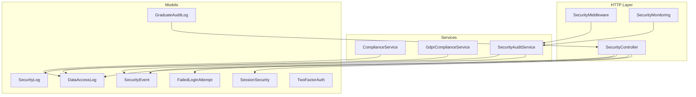
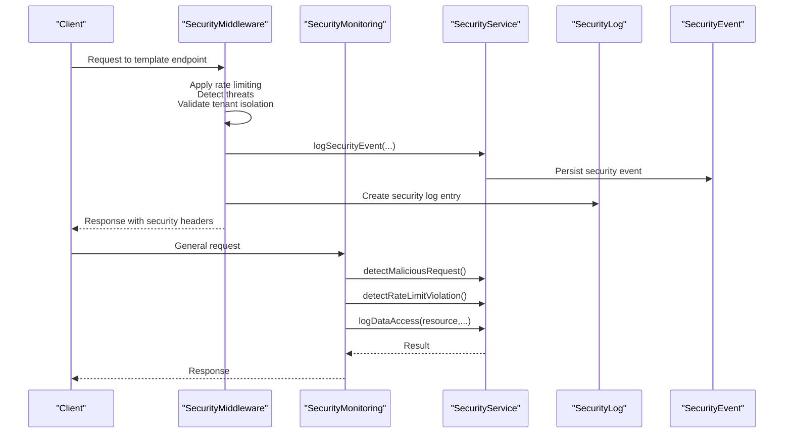
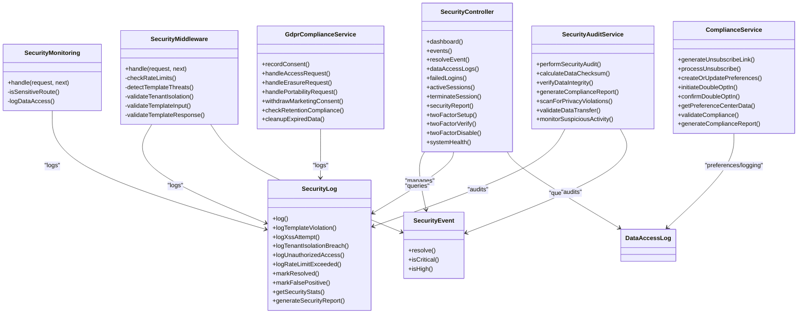

# Compliance & Audit Logging

<cite>
**Referenced Files in This Document**
- [ComplianceService.php](file://app/Services/ComplianceService.php)
- [GdprComplianceService.php](file://app/Services/GdprComplianceService.php)
- [SecurityAuditService.php](file://app/Services/SecurityAuditService.php)
- [SecurityMiddleware.php](file://app/Http/Middleware/SecurityMiddleware.php)
- [SecurityMonitoring.php](file://app/Http/Middleware/SecurityMonitoring.php)
- [SecurityController.php](file://app/Http/Controllers/SecurityController.php)
- [SecurityLog.php](file://app/Models/SecurityLog.php)
- [SecurityEvent.php](file://app/Models/SecurityEvent.php)
- [GraduateAuditLog.php](file://app/Models/GraduateAuditLog.php)
- [HasGraduateAuditLog.php](file://app/Traits/HasGraduateAuditLog.php)
- [DataAccessLog.php](file://app/Models/DataAccessLog.php)
- [FailedLoginAttempt.php](file://app/Models/FailedLoginAttempt.php)
- [SessionSecurity.php](file://app/Models/SessionSecurity.php)
- [TwoFactorAuth.php](file://app/Models/TwoFactorAuth.php)
</cite>

## Table of Contents
1. [Introduction](#introduction)
2. [Project Structure](#project-structure)
3. [Core Components](#core-components)
4. [Architecture Overview](#architecture-overview)
5. [Detailed Component Analysis](#detailed-component-analysis)
6. [Dependency Analysis](#dependency-analysis)
7. [Performance Considerations](#performance-considerations)
8. [Troubleshooting Guide](#troubleshooting-guide)
9. [Conclusion](#conclusion)
10. [Appendices](#appendices)

## Introduction
This document provides comprehensive coverage of compliance frameworks and audit logging systems implemented in the platform. It documents audit trail generation for user actions, data access logs, and security events; explains GDPR compliance requirements and data subject rights; outlines security event monitoring, threat detection, and incident response; and details compliance reporting, data governance, and retention policies. It also includes implementation examples for audit log generation, compliance dashboards, and automated compliance checks, along with secure log storage and compliance certification processes.

## Project Structure
The compliance and audit logging capabilities are implemented across services, middleware, controllers, and models:
- Services encapsulate compliance logic (email preferences, GDPR requests, security audits).
- Middleware enforces template security, rate limiting, and data access logging.
- Controllers expose security dashboards and administrative interfaces.
- Models define audit and security data structures and provide scopes and helpers.

**Diagram sources**
- [SecurityMiddleware.php:1-532](file://app/Http/Middleware/SecurityMiddleware.php#L1-L532)
- [SecurityMonitoring.php:1-149](file://app/Http/Middleware/SecurityMonitoring.php#L1-L149)
- [SecurityController.php:1-310](file://app/Http/Controllers/SecurityController.php#L1-L310)
- [ComplianceService.php:1-349](file://app/Services/ComplianceService.php#L1-L349)
- [GdprComplianceService.php:1-437](file://app/Services/GdprComplianceService.php#L1-L437)
- [SecurityAuditService.php:1-347](file://app/Services/SecurityAuditService.php#L1-L347)
- [SecurityLog.php:1-537](file://app/Models/SecurityLog.php#L1-L537)
- [SecurityEvent.php:1-114](file://app/Models/SecurityEvent.php#L1-L114)
- [DataAccessLog.php](file://app/Models/DataAccessLog.php)
- [GraduateAuditLog.php:1-37](file://app/Models/GraduateAuditLog.php#L1-L37)
- [FailedLoginAttempt.php](file://app/Models/FailedLoginAttempt.php)
- [SessionSecurity.php](file://app/Models/SessionSecurity.php)
- [TwoFactorAuth.php](file://app/Models/TwoFactorAuth.php)

**Section sources**
- [SecurityMiddleware.php:1-532](file://app/Http/Middleware/SecurityMiddleware.php#L1-L532)
- [SecurityMonitoring.php:1-149](file://app/Http/Middleware/SecurityMonitoring.php#L1-L149)
- [SecurityController.php:1-310](file://app/Http/Controllers/SecurityController.php#L1-L310)
- [ComplianceService.php:1-349](file://app/Services/ComplianceService.php#L1-L349)
- [GdprComplianceService.php:1-437](file://app/Services/GdprComplianceService.php#L1-L437)
- [SecurityAuditService.php:1-347](file://app/Services/SecurityAuditService.php#L1-L347)
- [SecurityLog.php:1-537](file://app/Models/SecurityLog.php#L1-L537)
- [SecurityEvent.php:1-114](file://app/Models/SecurityEvent.php#L1-L114)
- [DataAccessLog.php](file://app/Models/DataAccessLog.php)
- [GraduateAuditLog.php:1-37](file://app/Models/GraduateAuditLog.php#L1-L37)
- [FailedLoginAttempt.php](file://app/Models/FailedLoginAttempt.php)
- [SessionSecurity.php](file://app/Models/SessionSecurity.php)
- [TwoFactorAuth.php](file://app/Models/TwoFactorAuth.php)

## Core Components
- ComplianceService: Manages email preference compliance, double opt-in, unsubscribe processing, and compliance reporting aligned with GDPR and CAN-SPAM.
- GdprComplianceService: Implements GDPR data subject rights (access, erasure, portability), consent management, anonymization, and retention checks.
- SecurityAuditService: Performs comprehensive security audits, generates compliance reports, scans for privacy violations, and monitors suspicious activity.
- SecurityMiddleware: Enforces template security, rate limiting, tenant isolation, input validation, and logs security events.
- SecurityMonitoring: Applies global rate limiting, detects malicious requests, and logs data access for sensitive routes.
- SecurityController: Provides administrative dashboards for security events, data access logs, failed logins, sessions, and system health.
- SecurityLog: Centralized model for template and security events with categorization, severity, resolution status, and reporting helpers.
- SecurityEvent: Records security incidents with user attribution, resolution tracking, and severity levels.
- GraduateAuditLog and HasGraduateAuditLog: Provide field-level audit trails for graduate records with user attribution and metadata.
- DataAccessLog: Tracks authorized and unauthorized data access attempts for sensitive resources.

**Section sources**
- [ComplianceService.php:1-349](file://app/Services/ComplianceService.php#L1-L349)
- [GdprComplianceService.php:1-437](file://app/Services/GdprComplianceService.php#L1-L437)
- [SecurityAuditService.php:1-347](file://app/Services/SecurityAuditService.php#L1-L347)
- [SecurityMiddleware.php:1-532](file://app/Http/Middleware/SecurityMiddleware.php#L1-L532)
- [SecurityMonitoring.php:1-149](file://app/Http/Middleware/SecurityMonitoring.php#L1-L149)
- [SecurityController.php:1-310](file://app/Http/Controllers/SecurityController.php#L1-L310)
- [SecurityLog.php:1-537](file://app/Models/SecurityLog.php#L1-L537)
- [SecurityEvent.php:1-114](file://app/Models/SecurityEvent.php#L1-L114)
- [GraduateAuditLog.php:1-37](file://app/Models/GraduateAuditLog.php#L1-L37)
- [HasGraduateAuditLog.php:1-59](file://app/Traits/HasGraduateAuditLog.php#L1-L59)
- [DataAccessLog.php](file://app/Models/DataAccessLog.php)

## Architecture Overview
The system integrates middleware-driven security enforcement with centralized logging and auditing services. Controllers present dashboards and administrative interfaces for compliance and security operations.

**Diagram sources**
- [SecurityMiddleware.php:33-105](file://app/Http/Middleware/SecurityMiddleware.php#L33-L105)
- [SecurityMonitoring.php:19-48](file://app/Http/Middleware/SecurityMonitoring.php#L19-L48)
- [SecurityLog.php:194-232](file://app/Models/SecurityLog.php#L194-L232)
- [SecurityEvent.php:32-72](file://app/Models/SecurityEvent.php#L32-L72)

## Detailed Component Analysis

### ComplianceService: Email Preference and Consent Management
- Unsubscribe processing with token validation and selective category withdrawal.
- Double opt-in initiation and confirmation with audit trail updates.
- Preference center data retrieval and compliance validation (GDPR/CAN-SPAM).
- Automated compliance reporting by tenant with consent rates and unsubscribe metrics.

Implementation highlights:
- Unsubscribe link generation with signed URLs and expiration.
- Preference creation/update with IP/user-agent capture and audit trail entries.
- Compliance validation checks for consent, GDPR, and CAN-SPAM status.
- Reporting aggregates totals, percentages, and time-bound filters.

**Section sources**
- [ComplianceService.php:28-86](file://app/Services/ComplianceService.php#L28-L86)
- [ComplianceService.php:132-183](file://app/Services/ComplianceService.php#L132-L183)
- [ComplianceService.php:188-219](file://app/Services/ComplianceService.php#L188-L219)
- [ComplianceService.php:224-252](file://app/Services/ComplianceService.php#L224-L252)
- [ComplianceService.php:257-296](file://app/Services/ComplianceService.php#L257-L296)

### GdprComplianceService: Data Subject Rights and Retention
- Consent recording with legal basis, processing purposes, and retention period.
- Access requests with export generation and logging.
- Erasure requests supporting anonymization and deletion decisions based on business constraints.
- Portability requests with structured export creation.
- Marketing consent withdrawal and anonymization/anonymization helpers.
- Retention compliance checks and automated cleanup of expired data.

Implementation highlights:
- Behavioral data augmentation with GDPR metadata.
- Structured anonymization preserving system integrity while removing PII.
- CSV conversion and zipped export creation for portability.
- Retention policy enforcement with configurable periods.

**Section sources**
- [GdprComplianceService.php:16-63](file://app/Services/GdprComplianceService.php#L16-L63)
- [GdprComplianceService.php:68-131](file://app/Services/GdprComplianceService.php#L68-L131)
- [GdprComplianceService.php:136-195](file://app/Services/GdprComplianceService.php#L136-L195)
- [GdprComplianceService.php:199-232](file://app/Services/GdprComplianceService.php#L199-L232)
- [GdprComplianceService.php:237-283](file://app/Services/GdprComplianceService.php#L237-L283)
- [GdprComplianceService.php:288-329](file://app/Services/GdprComplianceService.php#L288-L329)
- [GdprComplianceService.php:347-385](file://app/Services/GdprComplianceService.php#L347-L385)
- [GdprComplianceService.php:390-436](file://app/Services/GdprComplianceService.php#L390-L436)

### SecurityAuditService: Security Audits and Privacy Violations
- Comprehensive audit covering authentication, authorization, data privacy, social graph, API, infrastructure, and compliance status.
- Vulnerability scanning outcomes and data integrity verification via checksums.
- Compliance report generation and privacy violation scanning.
- Suspicious activity monitoring including unusual login patterns, mass data access, privilege abuse, automated behavior, and data exfiltration.

Implementation highlights:
- Audit categories with standardized outcomes.
- Compliance checks for consent management, data retention, security measures, and audit trail completeness.
- Privacy violation detection counts across unauthorized access, breaches, improper sharing, consent violations, and retention violations.

**Section sources**
- [SecurityAuditService.php:12-25](file://app/Services/SecurityAuditService.php#L12-L25)
- [SecurityAuditService.php:30-57](file://app/Services/SecurityAuditService.php#L30-L57)
- [SecurityAuditService.php:62-72](file://app/Services/SecurityAuditService.php#L62-L72)
- [SecurityAuditService.php:77-86](file://app/Services/SecurityAuditService.php#L77-L86)
- [SecurityAuditService.php:108-117](file://app/Services/SecurityAuditService.php#L108-L117)
- [SecurityAuditService.php:121-189](file://app/Services/SecurityAuditService.php#L121-L189)
- [SecurityAuditService.php:207-255](file://app/Services/SecurityAuditService.php#L207-L255)
- [SecurityAuditService.php:257-300](file://app/Services/SecurityAuditService.php#L257-L300)
- [SecurityAuditService.php:302-345](file://app/Services/SecurityAuditService.php#L302-L345)

### SecurityMiddleware: Template Security Enforcement
- Rate limiting tailored to user roles for template operations.
- Threat detection against script injection, XSS, and malicious patterns.
- Tenant isolation validation to prevent cross-tenant access.
- Input validation for templates and metadata; file upload security checks.
- Response hardening and audit logging for template operations.

Implementation highlights:
- Pattern-based threat detection in request content.
- Dynamic rate limits per role and per user/tenant context.
- Validation errors mapped to structured violations for logging.

**Section sources**
- [SecurityMiddleware.php:33-105](file://app/Http/Middleware/SecurityMiddleware.php#L33-L105)
- [SecurityMiddleware.php:149-177](file://app/Http/Middleware/SecurityMiddleware.php#L149-L177)
- [SecurityMiddleware.php:182-209](file://app/Http/Middleware/SecurityMiddleware.php#L182-L209)
- [SecurityMiddleware.php:214-241](file://app/Http/Middleware/SecurityMiddleware.php#L214-L241)
- [SecurityMiddleware.php:283-318](file://app/Http/Middleware/SecurityMiddleware.php#L283-L318)
- [SecurityMiddleware.php:323-371](file://app/Http/Middleware/SecurityMiddleware.php#L323-L371)
- [SecurityMiddleware.php:443-456](file://app/Http/Middleware/SecurityMiddleware.php#L443-L456)
- [SecurityMiddleware.php:515-531](file://app/Http/Middleware/SecurityMiddleware.php#L515-L531)

### SecurityMonitoring: Global Security Checks and Data Access Logging
- Malicious request detection and rate limiting for authenticated and unauthenticated users.
- Sensitive route detection and data access logging with resource type and access type classification.
- Middleware-based audit trail for sensitive operations.

Implementation highlights:
- Sensitive route patterns mapped to resource types.
- Access type derived from HTTP method.
- Data access logging with middleware tracking context.

**Section sources**
- [SecurityMonitoring.php:19-48](file://app/Http/Middleware/SecurityMonitoring.php#L19-L48)
- [SecurityMonitoring.php:50-70](file://app/Http/Middleware/SecurityMonitoring.php#L50-L70)
- [SecurityMonitoring.php:72-92](file://app/Http/Middleware/SecurityMonitoring.php#L72-L92)
- [SecurityMonitoring.php:94-147](file://app/Http/Middleware/SecurityMonitoring.php#L94-L147)

### SecurityController: Administrative Dashboards and Incident Management
- Security dashboard rendering with aggregated security metrics.
- Security events listing with filtering, resolution, and attribution.
- Data access logs with resource and access type filters.
- Failed login attempts monitoring and IP unblocking.
- Active sessions management and termination.
- Security report generation by date range.
- Two-factor authentication setup, verification, and disable flows.
- System health checks for database, cache, storage, and queue.

Implementation highlights:
- Inertia-based UI rendering for admin views.
- Event resolution with notes and timestamps.
- Session termination with security event logging.

**Section sources**
- [SecurityController.php:25-32](file://app/Http/Controllers/SecurityController.php#L25-L32)
- [SecurityController.php:34-57](file://app/Http/Controllers/SecurityController.php#L34-L57)
- [SecurityController.php:59-68](file://app/Http/Controllers/SecurityController.php#L59-L68)
- [SecurityController.php:70-97](file://app/Http/Controllers/SecurityController.php#L70-L97)
- [SecurityController.php:99-121](file://app/Http/Controllers/SecurityController.php#L99-L121)
- [SecurityController.php:123-135](file://app/Http/Controllers/SecurityController.php#L123-L135)
- [SecurityController.php:137-157](file://app/Http/Controllers/SecurityController.php#L137-L157)
- [SecurityController.php:159-174](file://app/Http/Controllers/SecurityController.php#L159-L174)
- [SecurityController.php:176-191](file://app/Http/Controllers/SecurityController.php#L176-L191)
- [SecurityController.php:194-240](file://app/Http/Controllers/SecurityController.php#L194-L240)
- [SecurityController.php:242-309](file://app/Http/Controllers/SecurityController.php#L242-L309)

### SecurityLog: Security Event Tracking and Reporting
- Centralized event logging with tenant isolation, user attribution, and metadata.
- Event categorization (input validation, XSS prevention, access control, file security, tenant security, rate limiting, threat detection).
- Severity levels and resolution statuses with helpers to mark resolved/false-positive.
- Statistics aggregation, top threat types, unresolved events, and threat pattern extraction.
- Cleanup of old resolved events and tenant-specific reporting.

Implementation highlights:
- Static factory methods for common event types (template violations, XSS attempts, tenant isolation breaches, unauthorized access, rate limit exceeded).
- Scopes for tenant filtering, severity, date range, unresolved, critical, and recent events.
- Reporting helpers for statistics and threat patterns.

**Section sources**
- [SecurityLog.php:14-51](file://app/Models/SecurityLog.php#L14-L51)
- [SecurityLog.php:68-98](file://app/Models/SecurityLog.php#L68-L98)
- [SecurityLog.php:134-187](file://app/Models/SecurityLog.php#L134-L187)
- [SecurityLog.php:194-232](file://app/Models/SecurityLog.php#L194-L232)
- [SecurityLog.php:243-262](file://app/Models/SecurityLog.php#L243-L262)
- [SecurityLog.php:273-293](file://app/Models/SecurityLog.php#L273-L293)
- [SecurityLog.php:305-325](file://app/Models/SecurityLog.php#L305-L325)
- [SecurityLog.php:336-355](file://app/Models/SecurityLog.php#L336-L355)
- [SecurityLog.php:427-473](file://app/Models/SecurityLog.php#L427-L473)
- [SecurityLog.php:520-537](file://app/Models/SecurityLog.php#L520-L537)

### SecurityEvent: Security Incident Records
- Event types include failed login, suspicious activity, rate limit exceeded, unauthorized access, data breach attempt, malicious request, account lockout, two-factor enabled/disabled, and session cleanup.
- Severity levels (low, medium, high, critical).
- Resolution tracking with resolved flag, timestamps, and resolver attribution.
- Scopes for unresolved, by severity, by type, and recent filtering.

Implementation highlights:
- Constants for event types and severity levels.
- Helper methods to mark events as resolved or critical/high severity.

**Section sources**
- [SecurityEvent.php:12-29](file://app/Models/SecurityEvent.php#L12-L29)
- [SecurityEvent.php:31-41](file://app/Models/SecurityEvent.php#L31-L41)
- [SecurityEvent.php:43-61](file://app/Models/SecurityEvent.php#L43-L61)
- [SecurityEvent.php:64-72](file://app/Models/SecurityEvent.php#L64-L72)
- [SecurityEvent.php:74-83](file://app/Models/SecurityEvent.php#L74-L83)
- [SecurityEvent.php:85-113](file://app/Models/SecurityEvent.php#L85-L113)

### GraduateAuditLog and HasGraduateAuditLog: Field-Level Audit Trails
- Trait-based audit logging for graduate records with action, field name, old/new values, description, and metadata.
- Convenience methods for employment updates, privacy setting changes, and generic field changes.
- Model defines fillable attributes and casts for metadata.

Implementation highlights:
- Automatic user attribution from authenticated context.
- Structured descriptions for traceability.

**Section sources**
- [HasGraduateAuditLog.php:10-32](file://app/Traits/HasGraduateAuditLog.php#L10-L32)
- [HasGraduateAuditLog.php:24-32](file://app/Traits/HasGraduateAuditLog.php#L24-L32)
- [HasGraduateAuditLog.php:34-51](file://app/Traits/HasGraduateAuditLog.php#L34-L51)
- [HasGraduateAuditLog.php:53-57](file://app/Traits/HasGraduateAuditLog.php#L53-L57)
- [GraduateAuditLog.php:12-25](file://app/Models/GraduateAuditLog.php#L12-L25)
- [GraduateAuditLog.php:27-35](file://app/Models/GraduateAuditLog.php#L27-L35)

### DataAccessLog: Authorized and Unauthorized Data Access Logs
- Tracks resource access attempts with resource type, access type, authorization outcome, and metadata.
- Supports filtering and pagination for compliance reporting and investigations.

**Section sources**
- [DataAccessLog.php](file://app/Models/DataAccessLog.php)

### Supporting Models for Security Operations
- FailedLoginAttempt: Failed login tracking with blocking logic and filters.
- SessionSecurity: Active session monitoring with suspiciousness flags and termination.
- TwoFactorAuth: Two-factor authentication lifecycle for users.

**Section sources**
- [FailedLoginAttempt.php](file://app/Models/FailedLoginAttempt.php)
- [SessionSecurity.php](file://app/Models/SessionSecurity.php)
- [TwoFactorAuth.php](file://app/Models/TwoFactorAuth.php)

## Dependency Analysis
The following diagram shows key dependencies among components involved in compliance and audit logging:

**Diagram sources**
- [SecurityMiddleware.php:33-105](file://app/Http/Middleware/SecurityMiddleware.php#L33-L105)
- [SecurityMonitoring.php:19-48](file://app/Http/Middleware/SecurityMonitoring.php#L19-L48)
- [SecurityController.php:25-310](file://app/Http/Controllers/SecurityController.php#L25-L310)
- [ComplianceService.php:28-296](file://app/Services/ComplianceService.php#L28-L296)
- [GdprComplianceService.php:16-436](file://app/Services/GdprComplianceService.php#L16-L436)
- [SecurityAuditService.php:12-345](file://app/Services/SecurityAuditService.php#L12-L345)
- [SecurityLog.php:194-537](file://app/Models/SecurityLog.php#L194-L537)
- [SecurityEvent.php:64-83](file://app/Models/SecurityEvent.php#L64-L83)

**Section sources**
- [SecurityMiddleware.php:33-105](file://app/Http/Middleware/SecurityMiddleware.php#L33-L105)
- [SecurityMonitoring.php:19-48](file://app/Http/Middleware/SecurityMonitoring.php#L19-L48)
- [SecurityController.php:25-310](file://app/Http/Controllers/SecurityController.php#L25-L310)
- [ComplianceService.php:28-296](file://app/Services/ComplianceService.php#L28-L296)
- [GdprComplianceService.php:16-436](file://app/Services/GdprComplianceService.php#L16-L436)
- [SecurityAuditService.php:12-345](file://app/Services/SecurityAuditService.php#L12-L345)
- [SecurityLog.php:194-537](file://app/Models/SecurityLog.php#L194-L537)
- [SecurityEvent.php:64-83](file://app/Models/SecurityEvent.php#L64-L83)

## Performance Considerations
- Middleware rate limiting and threat detection operate on request content and patterns; keep patterns minimal and targeted to reduce overhead.
- SecurityLog and SecurityEvent queries should leverage scopes and indexes on frequently filtered columns (tenant_id, severity, occurred_at/resolved_at).
- Use pagination for dashboards and reports to avoid large result sets.
- Consider asynchronous logging for high-throughput scenarios to decouple request processing from persistence.

## Troubleshooting Guide
- Unsubscribe/Double Opt-In Failures: Review logs for invalid tokens and IP/user-agent captures; verify signed URL generation and expiration.
- GDPR Access/Erasure/Portability Failures: Inspect exception logs and ensure storage exports are written successfully; validate anonymization logic for leads/users.
- Security Events Not Appearing: Confirm middleware is attached to relevant routes and that SecurityService is invoked; verify event scopes and filters.
- Data Access Logs Missing: Ensure SecurityMonitoring middleware is applied to sensitive routes and that resource type/id resolution works as expected.
- Session Termination Issues: Verify session termination updates and associated security event logging.

**Section sources**
- [ComplianceService.php:46-56](file://app/Services/ComplianceService.php#L46-L56)
- [GdprComplianceService.php:120-130](file://app/Services/GdprComplianceService.php#L120-L130)
- [SecurityMiddleware.php:50-61](file://app/Http/Middleware/SecurityMiddleware.php#L50-L61)
- [SecurityMonitoring.php:72-92](file://app/Http/Middleware/SecurityMonitoring.php#L72-L92)
- [SecurityController.php:159-174](file://app/Http/Controllers/SecurityController.php#L159-L174)

## Conclusion
The platform implements robust compliance and audit logging capabilities across email preference management, GDPR data subject rights, security event monitoring, and administrative dashboards. The modular design ensures that middleware, services, and models work together to maintain comprehensive audit trails, enforce security controls, and support compliance reporting and incident response.

## Appendices

### Implementation Examples

#### Audit Log Generation for User Actions
- Use the graduate audit trait to log field changes and employment updates with descriptions and metadata.
- Example path: [HasGraduateAuditLog.php:10-32](file://app/Traits/HasGraduateAuditLog.php#L10-L32)

#### Compliance Dashboard
- Render security metrics and trends via the SecurityController dashboard action.
- Example path: [SecurityController.php:25-32](file://app/Http/Controllers/SecurityController.php#L25-L32)

#### Automated Compliance Checks
- Generate compliance reports for tenants and subjects using ComplianceService and SecurityAuditService.
- Example paths:
  - [ComplianceService.php:257-296](file://app/Services/ComplianceService.php#L257-L296)
  - [SecurityAuditService.php:62-72](file://app/Services/SecurityAuditService.php#L62-L72)

#### Security Event Monitoring and Incident Response
- Monitor suspicious activity and manage security events via the SecurityController events interface.
- Example paths:
  - [SecurityController.php:34-57](file://app/Http/Controllers/SecurityController.php#L34-L57)
  - [SecurityController.php:59-68](file://app/Http/Controllers/SecurityController.php#L59-L68)

#### Data Governance and Retention Policies
- Implement retention checks and cleanup using GdprComplianceService.
- Example path: [GdprComplianceService.php:390-436](file://app/Services/GdprComplianceService.php#L390-L436)

#### Secure Log Storage and Compliance Certification
- Use SecurityLog and SecurityEvent models for persistent, auditable records with scopes and resolution tracking.
- Example paths:
  - [SecurityLog.php:427-473](file://app/Models/SecurityLog.php#L427-L473)
  - [SecurityEvent.php:43-61](file://app/Models/SecurityEvent.php#L43-L61)