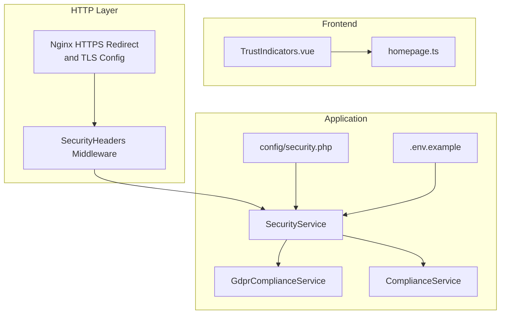
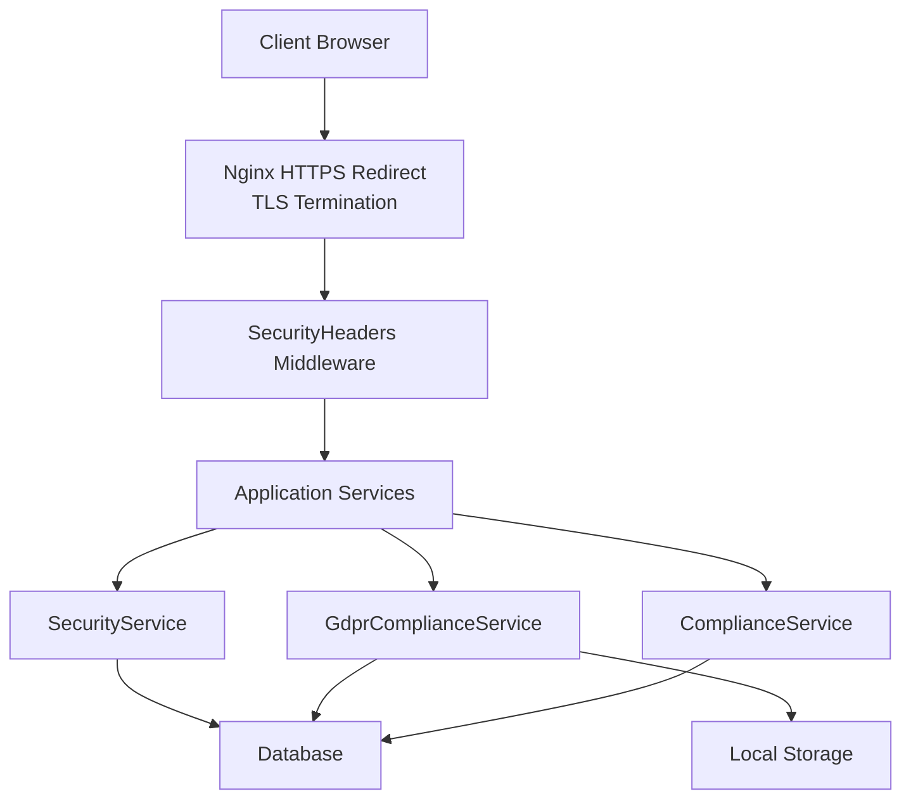
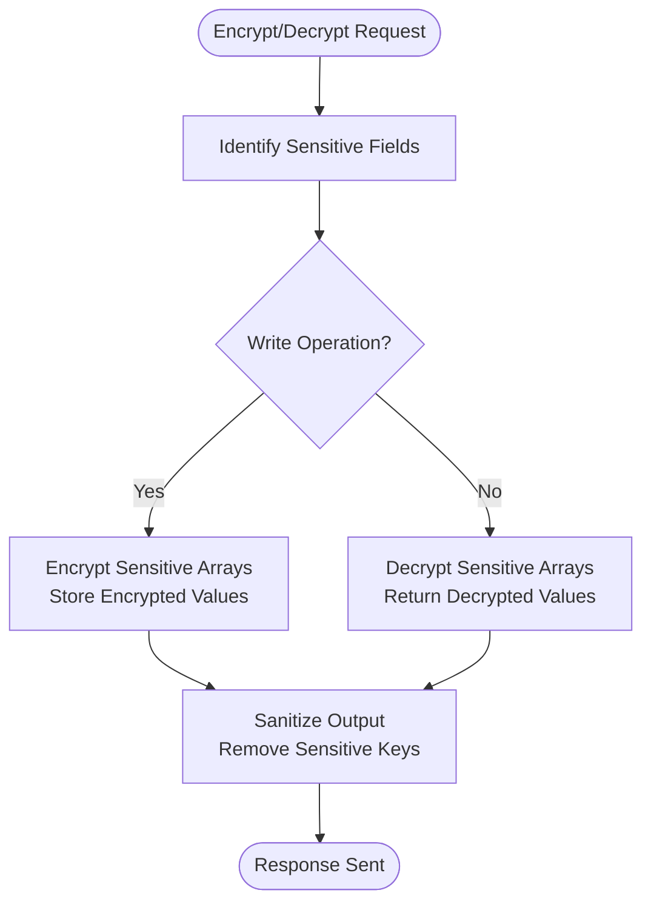
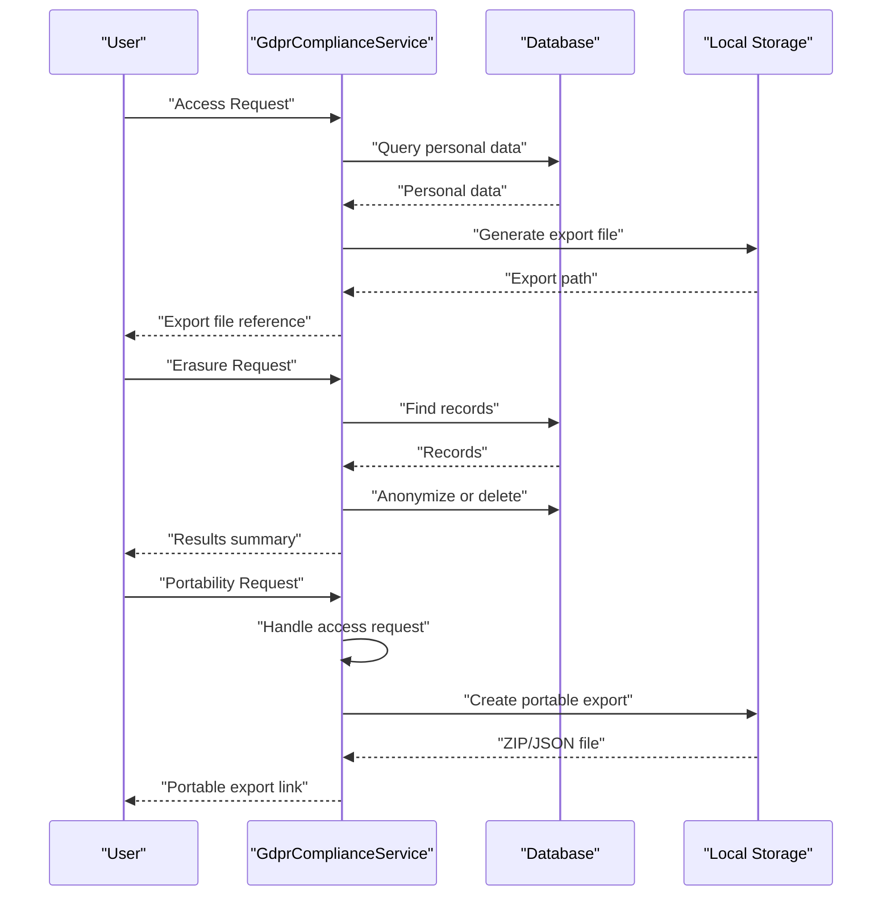
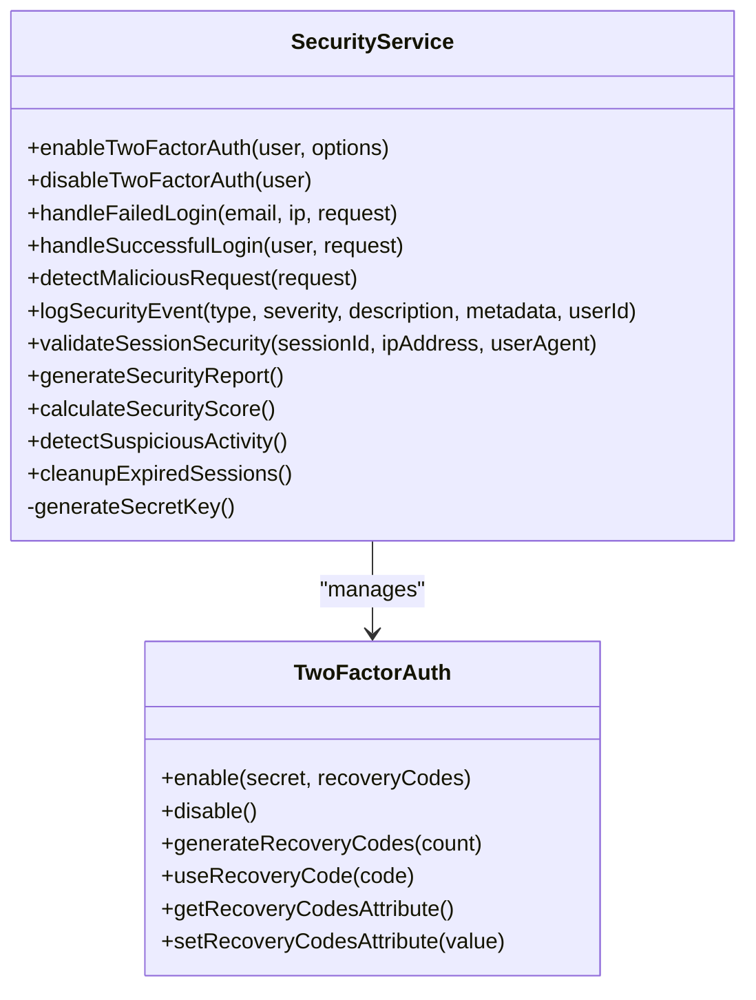
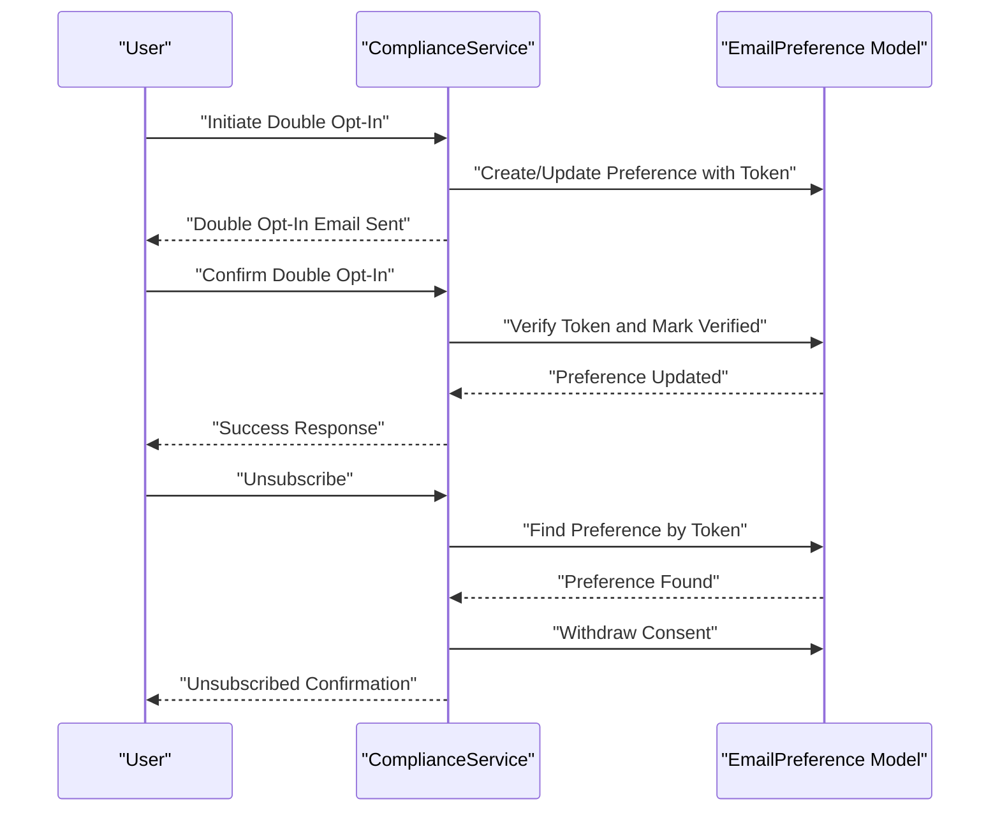
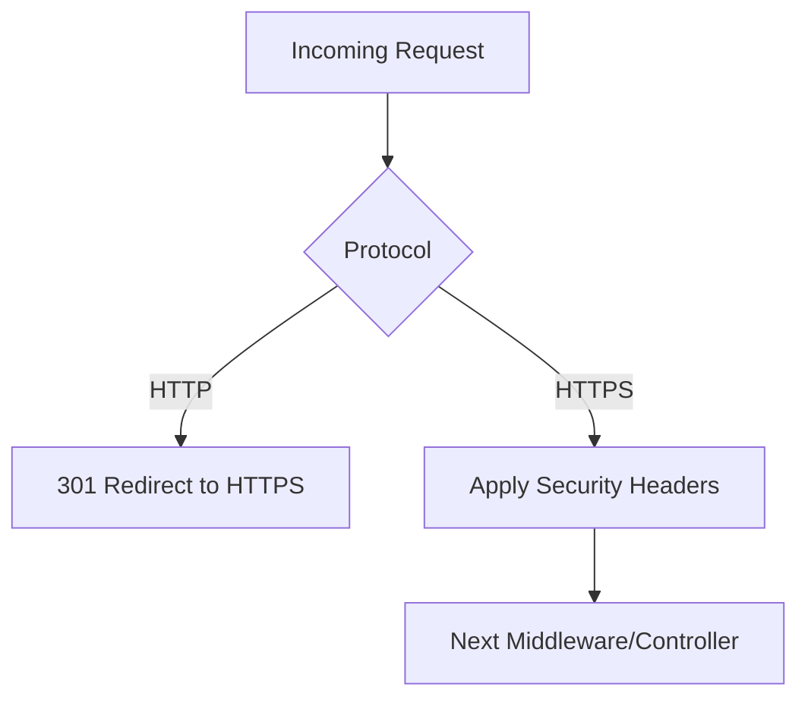
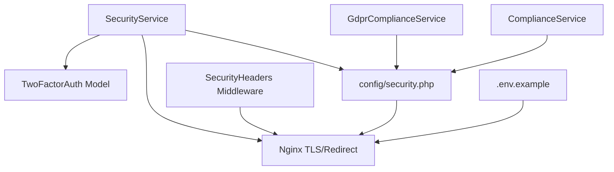

# Data Protection & Encryption

<cite>
**Referenced Files in This Document**
- [GdprComplianceService.php](file://app/Services/GdprComplianceService.php)
- [SecurityService.php](file://app/Services/SecurityService.php)
- [ComplianceService.php](file://app/Services/ComplianceService.php)
- [SecurityHeaders.php](file://app/Http/Middleware/SecurityHeaders.php)
- [security.php](file://config/security.php)
- [.env.example](file://.env.example)
- [deployment-plan.md](file://deployment-plan.md)
- [technical-specification.md](file://technical-specification.md)
- [task-12-security-audit-system-recap.md](file://docs/task-12-security-audit-system-recap.md)
- [security-audit-implementation.md](file://docs/security-audit-implementation.md)
- [default.conf](file://infrastructure/production/config/nginx/conf.d/default.conf)
- [generate_key.php](file://generate_key.php)
- [TwoFactorAuth.php](file://app/Models/TwoFactorAuth.php)
- [homepage.ts](file://resources/js/Types/homepage.ts)
- [TrustIndicators.vue](file://resources/js/components/homepage/TrustIndicators.vue)
</cite>

## Table of Contents
1. [Introduction](#introduction)
2. [Project Structure](#project-structure)
3. [Core Components](#core-components)
4. [Architecture Overview](#architecture-overview)
5. [Detailed Component Analysis](#detailed-component-analysis)
6. [Dependency Analysis](#dependency-analysis)
7. [Performance Considerations](#performance-considerations)
8. [Troubleshooting Guide](#troubleshooting-guide)
9. [Conclusion](#conclusion)
10. [Appendices](#appendices)

## Introduction
This document provides comprehensive coverage of data protection and encryption mechanisms implemented in the platform. It details data-at-rest encryption, field-level encryption for sensitive data, secure data transmission protocols, GDPR compliance features (including right to erasure and data portability), encryption key management and rotation, secure key storage, data masking and anonymization, privacy-preserving handling, and operational procedures for data retention and secure deletion. It also outlines HTTPS enforcement and compliance with data protection regulations.

## Project Structure
The data protection and encryption features span backend services, middleware, configuration, infrastructure, and frontend presentation layers. Key areas include:
- Backend services for GDPR compliance, security auditing, and email compliance
- Middleware for enforcing security headers and HTTPS
- Infrastructure configuration for TLS and redirects
- Configuration for rate limits, session security, and monitoring
- Frontend components that communicate compliance and security principles

**Diagram sources**
- [SecurityHeaders.php:1-59](file://app/Http/Middleware/SecurityHeaders.php#L1-L59)
- [default.conf:1-137](file://infrastructure/production/config/nginx/conf.d/default.conf#L1-L137)
- [SecurityService.php:1-526](file://app/Services/SecurityService.php#L1-L526)
- [GdprComplianceService.php:1-437](file://app/Services/GdprComplianceService.php#L1-L437)
- [ComplianceService.php:1-349](file://app/Services/ComplianceService.php#L1-L349)
- [security.php:1-76](file://config/security.php#L1-L76)
- [.env.example:1-140](file://.env.example#L1-L140)
- [TrustIndicators.vue:194-316](file://resources/js/components/homepage/TrustIndicators.vue#L194-L316)
- [homepage.ts:817-886](file://resources/js/Types/homepage.ts#L817-L886)

**Section sources**
- [SecurityHeaders.php:1-59](file://app/Http/Middleware/SecurityHeaders.php#L1-L59)
- [default.conf:1-137](file://infrastructure/production/config/nginx/conf.d/default.conf#L1-L137)
- [SecurityService.php:1-526](file://app/Services/SecurityService.php#L1-L526)
- [GdprComplianceService.php:1-437](file://app/Services/GdprComplianceService.php#L1-L437)
- [ComplianceService.php:1-349](file://app/Services/ComplianceService.php#L1-L349)
- [security.php:1-76](file://config/security.php#L1-L76)
- [.env.example:1-140](file://.env.example#L1-L140)
- [TrustIndicators.vue:194-316](file://resources/js/components/homepage/TrustIndicators.vue#L194-L316)
- [homepage.ts:817-886](file://resources/js/Types/homepage.ts#L817-L886)

## Core Components
- Data Protection Service (conceptual): Implements encryption for sensitive fields and sanitizes output to prevent leakage of secrets.
- GDPR Compliance Service: Handles consent recording, access requests, erasure requests (right to be forgotten), portability requests, and data retention/cleanup.
- Security Service: Provides two-factor authentication, rate limiting, suspicious activity detection, session security validation, and security event logging.
- Compliance Service: Manages email preferences, double opt-in, unsubscribe links, and compliance reporting aligned with GDPR and CAN-SPAM.
- Security Headers Middleware: Enforces HTTPS via HSTS, CSP, X-Frame-Options, X-Content-Type-Options, and other hardening headers.
- Infrastructure TLS: Nginx configuration enforces HTTPS redirection and TLS parameters.
- Configuration: Centralized security settings for rate limits, session timeouts, monitoring, and backup retention.
- Frontend Trust Indicators: Communicates transparency, purpose limitation, and data security principles, including encryption and MFA.

**Section sources**
- [technical-specification.md:1105-1158](file://technical-specification.md#L1105-L1158)
- [GdprComplianceService.php:1-437](file://app/Services/GdprComplianceService.php#L1-L437)
- [SecurityService.php:1-526](file://app/Services/SecurityService.php#L1-L526)
- [ComplianceService.php:1-349](file://app/Services/ComplianceService.php#L1-L349)
- [SecurityHeaders.php:1-59](file://app/Http/Middleware/SecurityHeaders.php#L1-L59)
- [default.conf:1-137](file://infrastructure/production/config/nginx/conf.d/default.conf#L1-L137)
- [security.php:1-76](file://config/security.php#L1-L76)
- [TrustIndicators.vue:194-316](file://resources/js/components/homepage/TrustIndicators.vue#L194-L316)

## Architecture Overview
The platform enforces end-to-end data protection through layered mechanisms:
- Transport security via enforced HTTPS and security headers
- Data-at-rest encryption for sensitive fields
- Field-level encryption for secrets and sensitive arrays
- Access control and audit logging
- GDPR-aligned data lifecycle management (consent, access, erasure, portability)
- Secure key management and rotation procedures

**Diagram sources**
- [default.conf:1-137](file://infrastructure/production/config/nginx/conf.d/default.conf#L1-L137)
- [SecurityHeaders.php:1-59](file://app/Http/Middleware/SecurityHeaders.php#L1-L59)
- [SecurityService.php:1-526](file://app/Services/SecurityService.php#L1-L526)
- [GdprComplianceService.php:1-437](file://app/Services/GdprComplianceService.php#L1-L437)
- [ComplianceService.php:1-349](file://app/Services/ComplianceService.php#L1-L349)

## Detailed Component Analysis

### Data Protection Service (Conceptual)
Implements encryption for sensitive fields and sanitizes output to avoid leaking secrets.

- Encrypt sensitive fields during write operations
- Decrypt sensitive fields during read operations
- Sanitize output to remove sensitive keys before rendering

**Diagram sources**
- [technical-specification.md:1105-1158](file://technical-specification.md#L1105-L1158)

**Section sources**
- [technical-specification.md:1105-1158](file://technical-specification.md#L1105-L1158)

### GDPR Compliance Service
Handles data subject rights and data lifecycle management.

- Consent recording with legal basis and data processing purposes
- Access requests with export generation
- Erasure requests with anonymization fallback
- Portability requests with structured export
- Retention checks and automated cleanup

**Diagram sources**
- [GdprComplianceService.php:68-232](file://app/Services/GdprComplianceService.php#L68-L232)

**Section sources**
- [GdprComplianceService.php:1-437](file://app/Services/GdprComplianceService.php#L1-L437)

### Security Service
Provides robust authentication, access control, and threat detection.

- Two-factor authentication with secret generation and recovery codes
- Rate limiting and suspicious activity detection
- Session security validation and cleanup
- Security event logging and scoring

**Diagram sources**
- [SecurityService.php:1-526](file://app/Services/SecurityService.php#L1-L526)
- [TwoFactorAuth.php:61-115](file://app/Models/TwoFactorAuth.php#L61-L115)

**Section sources**
- [SecurityService.php:1-526](file://app/Services/SecurityService.php#L1-L526)
- [TwoFactorAuth.php:61-115](file://app/Models/TwoFactorAuth.php#L61-L115)

### Compliance Service (Email Preferences)
Manages consent, double opt-in, and unsubscribe mechanisms aligned with GDPR and CAN-SPAM.

- Generate unsubscribe links with signed URLs
- Process unsubscribe requests and withdraw consent
- Create/update email preferences with audit trails
- Validate compliance and generate reports

**Diagram sources**
- [ComplianceService.php:28-86](file://app/Services/ComplianceService.php#L28-L86)
- [ComplianceService.php:132-183](file://app/Services/ComplianceService.php#L132-L183)

**Section sources**
- [ComplianceService.php:1-349](file://app/Services/ComplianceService.php#L1-L349)

### Security Headers Middleware and HTTPS Enforcement
Enforces transport security and hardens responses.

- HTTP Strict Transport Security (HSTS)
- Content Security Policy (CSP)
- X-Frame-Options, X-Content-Type-Options, X-XSS-Protection
- Referrer-Policy and additional protections

Infrastructure enforces HTTPS:
- HTTP to HTTPS redirect
- TLS certificate and chain configuration
- Security headers inclusion via Nginx

**Diagram sources**
- [SecurityHeaders.php:1-59](file://app/Http/Middleware/SecurityHeaders.php#L1-L59)
- [default.conf:15-18](file://infrastructure/production/config/nginx/conf.d/default.conf#L15-L18)

**Section sources**
- [SecurityHeaders.php:1-59](file://app/Http/Middleware/SecurityHeaders.php#L1-L59)
- [default.conf:1-137](file://infrastructure/production/config/nginx/conf.d/default.conf#L1-L137)

### Configuration and Environment
Centralized security configuration and environment variables.

- Rate limits for authenticated and unauthenticated requests
- Session timeout and suspicious session tracking
- Two-factor authentication requirements and recovery codes
- Backup retention and compression settings
- Security monitoring toggles

Environment variables include placeholders for app keys and various integrations.

**Section sources**
- [security.php:1-76](file://config/security.php#L1-L76)
- [.env.example:1-140](file://.env.example#L1-L140)

### Frontend Trust Indicators and Compliance Communication
Communicates transparency, purpose limitation, and data security principles, including encryption and multi-factor authentication.

**Section sources**
- [TrustIndicators.vue:194-316](file://resources/js/components/homepage/TrustIndicators.vue#L194-L316)
- [homepage.ts:817-886](file://resources/js/Types/homepage.ts#L817-L886)

## Dependency Analysis
The following diagram shows dependencies among core data protection components:

**Diagram sources**
- [SecurityService.php:1-526](file://app/Services/SecurityService.php#L1-L526)
- [GdprComplianceService.php:1-437](file://app/Services/GdprComplianceService.php#L1-L437)
- [ComplianceService.php:1-349](file://app/Services/ComplianceService.php#L1-L349)
- [TwoFactorAuth.php:61-115](file://app/Models/TwoFactorAuth.php#L61-L115)
- [SecurityHeaders.php:1-59](file://app/Http/Middleware/SecurityHeaders.php#L1-L59)
- [default.conf:1-137](file://infrastructure/production/config/nginx/conf.d/default.conf#L1-L137)
- [security.php:1-76](file://config/security.php#L1-L76)
- [.env.example:1-140](file://.env.example#L1-L140)

**Section sources**
- [SecurityService.php:1-526](file://app/Services/SecurityService.php#L1-L526)
- [GdprComplianceService.php:1-437](file://app/Services/GdprComplianceService.php#L1-L437)
- [ComplianceService.php:1-349](file://app/Services/ComplianceService.php#L1-L349)
- [TwoFactorAuth.php:61-115](file://app/Models/TwoFactorAuth.php#L61-L115)
- [SecurityHeaders.php:1-59](file://app/Http/Middleware/SecurityHeaders.php#L1-L59)
- [default.conf:1-137](file://infrastructure/production/config/nginx/conf.d/default.conf#L1-L137)
- [security.php:1-76](file://config/security.php#L1-L76)
- [.env.example:1-140](file://.env.example#L1-L140)

## Performance Considerations
- Encryption overhead: Field-level encryption adds CPU cost; batch operations and caching can mitigate impact.
- Rate limiting: Prevents abuse but requires careful tuning to balance security and user experience.
- Session validation: Periodic cleanup reduces database bloat; ensure scheduled jobs are tuned to workload.
- Logging: Comprehensive audit logging improves visibility but increases I/O; consider asynchronous logging and retention policies.

## Troubleshooting Guide
Common issues and resolutions:
- HTTPS not enforced: Verify Nginx redirect rules and TLS certificate paths; ensure security headers middleware is applied.
- 2FA failures: Confirm secret generation fallback and recovery codes storage; check model attribute encryption/decryption.
- GDPR export failures: Validate local storage disk permissions and file naming conventions; confirm JSON encoding and export paths.
- Email unsubscribe errors: Ensure signed URL tokens are fresh and match stored preferences; verify consent withdrawal logic.
- Security events not logged: Check logging configuration and middleware application order; confirm event creation and metadata.

**Section sources**
- [SecurityHeaders.php:1-59](file://app/Http/Middleware/SecurityHeaders.php#L1-L59)
- [default.conf:1-137](file://infrastructure/production/config/nginx/conf.d/default.conf#L1-L137)
- [SecurityService.php:1-526](file://app/Services/SecurityService.php#L1-L526)
- [GdprComplianceService.php:1-437](file://app/Services/GdprComplianceService.php#L1-L437)
- [ComplianceService.php:1-349](file://app/Services/ComplianceService.php#L1-L349)

## Conclusion
The platform implements a comprehensive data protection and encryption strategy across transport, storage, and processing layers. It aligns with GDPR requirements through consent management, access and erasure mechanisms, and data portability. Security headers and infrastructure hardening enforce HTTPS and resilient transport. Centralized configuration and services provide scalable and maintainable security controls, with room for further enhancements such as centralized key management and automated key rotation.

## Appendices

### Implementation Examples Index
- Encrypted database fields: See field-level encryption in the conceptual Data Protection Service.
- Secure file storage: Local disk exports for GDPR access and portability requests.
- HTTPS enforcement: Nginx redirect and TLS configuration; SecurityHeaders middleware.

**Section sources**
- [technical-specification.md:1105-1158](file://technical-specification.md#L1105-L1158)
- [GdprComplianceService.php:102-103](file://app/Services/GdprComplianceService.php#L102-L103)
- [GdprComplianceService.php:212-213](file://app/Services/GdprComplianceService.php#L212-L213)
- [default.conf:15-18](file://infrastructure/production/config/nginx/conf.d/default.conf#L15-L18)
- [SecurityHeaders.php:20-33](file://app/Http/Middleware/SecurityHeaders.php#L20-L33)

### Key Management and Rotation Procedures
- Provisioning: Generate strong symmetric keys using a cryptographically secure random generator.
- Storage: Store keys in a secrets manager (e.g., Vault) with least-privilege access and audit logging.
- Rotation: Implement key rotation schedules; re-wrap ciphertext with new keys; maintain backward compatibility during transition.
- Disposal: Securely delete old keys using overwrite and shredding techniques.

**Section sources**
- [deployment-plan.md:763-800](file://deployment-plan.md#L763-L800)
- [generate_key.php:1-2](file://generate_key.php#L1-L2)

### Data Masking and Anonymization
- Pseudonymization: Replace identifiers with artificial identifiers.
- Anonymization: Permanently alter data so it cannot be attributed to an individual without disproportionate effort.
- GDPR anonymization: Update records to remove or replace personal data attributes.

**Section sources**
- [GdprComplianceService.php:311-329](file://app/Services/GdprComplianceService.php#L311-L329)
- [GdprComplianceService.php:334-342](file://app/Services/GdprComplianceService.php#L334-L342)

### Data Retention and Secure Deletion
- Retention policies: Define retention periods per data category; apply automated cleanup for expired data.
- Secure deletion: Overwrite and truncate files; invalidate caches; purge logs and audit trails.

**Section sources**
- [GdprComplianceService.php:390-409](file://app/Services/GdprComplianceService.php#L390-L409)
- [GdprComplianceService.php:414-436](file://app/Services/GdprComplianceService.php#L414-L436)

### Compliance Highlights
- Transparency and purpose limitation: Clearly communicate data usage and processing purposes.
- Data security: AES-256 encryption, multi-factor authentication, and regular audits.
- GDPR alignment: Consent management, data portability, right to erasure, and automated compliance checks.

**Section sources**
- [TrustIndicators.vue:194-316](file://resources/js/components/homepage/TrustIndicators.vue#L194-L316)
- [task-12-security-audit-system-recap.md:387-393](file://docs/task-12-security-audit-system-recap.md#L387-L393)
- [security-audit-implementation.md:155-203](file://docs/security-audit-implementation.md#L155-L203)