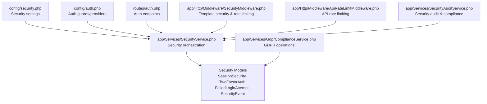
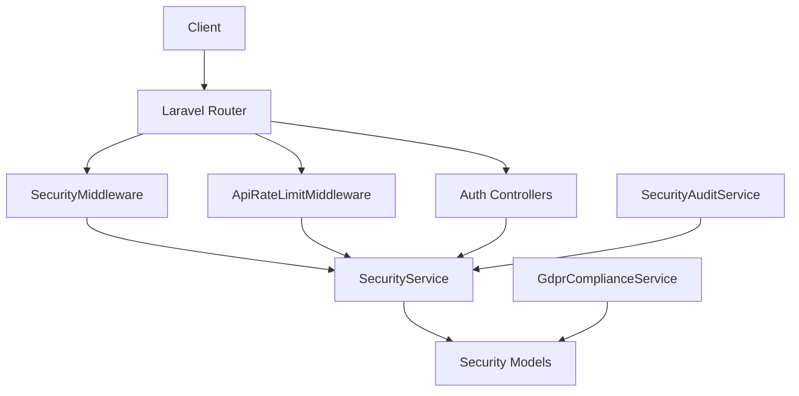
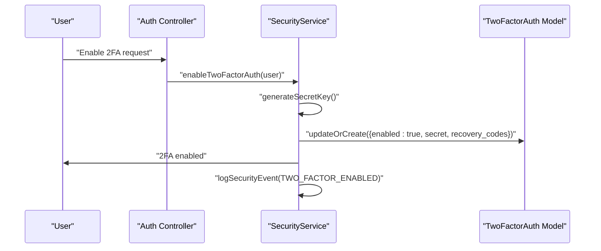
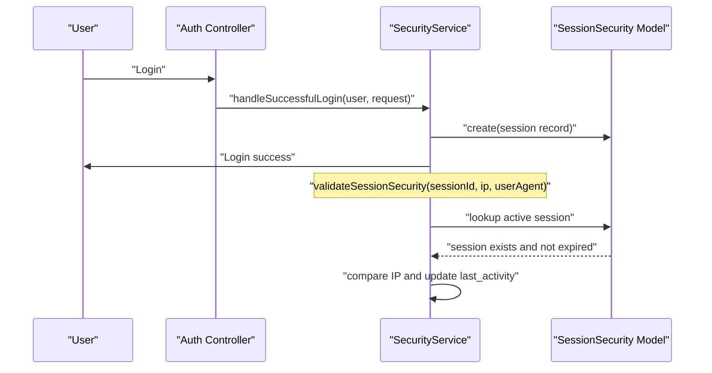
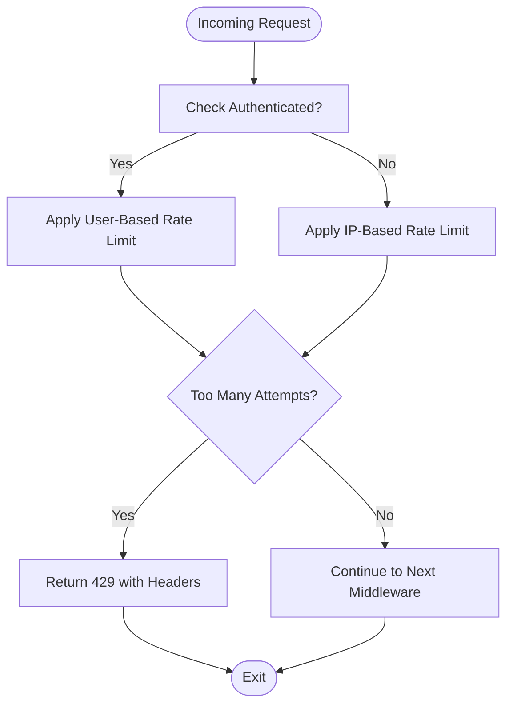
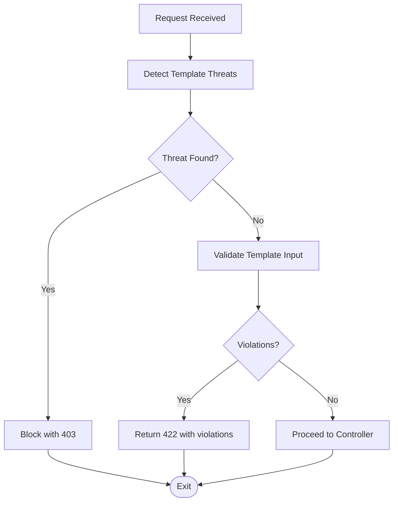
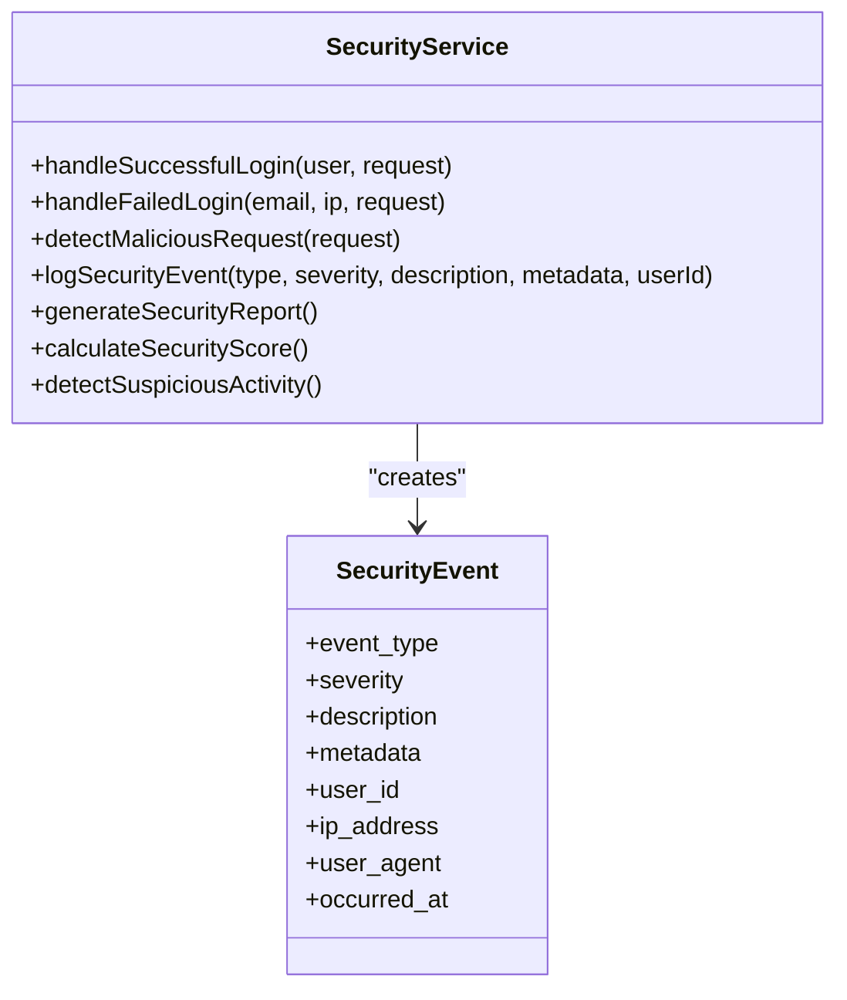
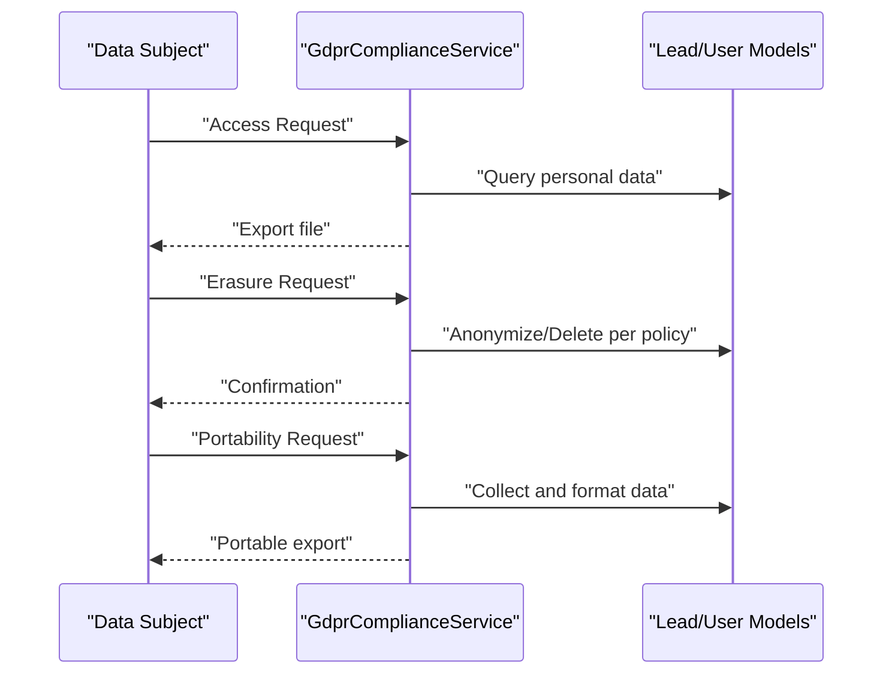
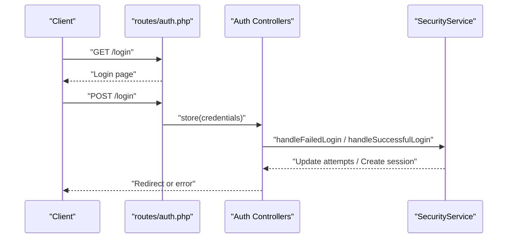
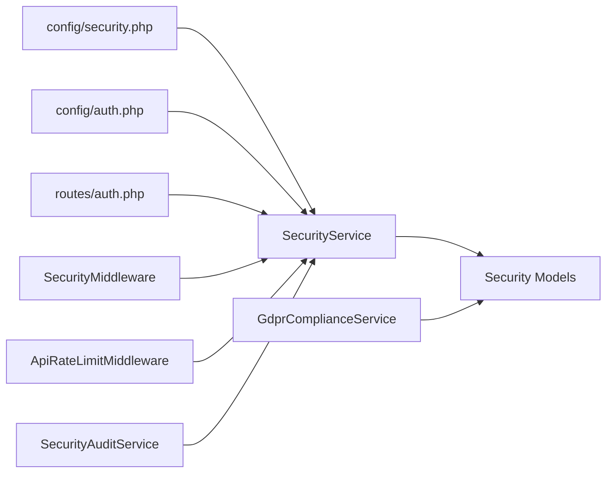

# Security Implementation

<cite>
**Referenced Files in This Document**
- [config/security.php](file://config/security.php)
- [app/Services/SecurityService.php](file://app/Services/SecurityService.php)
- [app/Services/SecurityAuditService.php](file://app/Services/SecurityAuditService.php)
- [app/Http/Middleware/SecurityMiddleware.php](file://app/Http/Middleware/SecurityMiddleware.php)
- [app/Http/Middleware/ApiRateLimitMiddleware.php](file://app/Http/Middleware/ApiRateLimitMiddleware.php)
- [config/auth.php](file://config/auth.php)
- [routes/auth.php](file://routes/auth.php)
- [app/Services/GdprComplianceService.php](file://app/Services/GdprComplianceService.php)
- [app/Models/SessionSecurity.php](file://app/Models/SessionSecurity.php)
- [app/Models/TwoFactorAuth.php](file://app/Models/TwoFactorAuth.php)
- [app/Models/FailedLoginAttempt.php](file://app/Models/FailedLoginAttempt.php)
- [app/Models/SecurityEvent.php](file://app/Models/SecurityEvent.php)
- [scripts/debugging/disable_security_middleware.php](file://scripts/debugging/disable_security_middleware.php)
</cite>

## Table of Contents
1. [Introduction](#introduction)
2. [Project Structure](#project-structure)
3. [Core Components](#core-components)
4. [Architecture Overview](#architecture-overview)
5. [Detailed Component Analysis](#detailed-component-analysis)
6. [Dependency Analysis](#dependency-analysis)
7. [Performance Considerations](#performance-considerations)
8. [Troubleshooting Guide](#troubleshooting-guide)
9. [Conclusion](#conclusion)
10. [Appendices](#appendices)

## Introduction
This document presents a comprehensive view of the multi-layer security architecture implemented in the alumni management system. It covers authentication and session management, rate limiting, input validation and sanitization, audit logging, data protection, and GDPR compliance features. Practical configuration examples and best practices are included to guide secure deployment and operation.

## Project Structure
Security-related capabilities are distributed across configuration, services, middleware, routes, and models:

- Configuration: Centralized security settings for login attempts, rate limits, session timeouts, two-factor authentication, backup retention, and monitoring.
- Services: Core security logic including two-factor authentication, failed login tracking, malicious request detection, session validation, and security reporting.
- Middleware: Request-time enforcement for rate limiting, template security validation, tenant isolation, and response hardening.
- Routes and Auth: Authentication endpoints and policies enforced by middleware.
- Models: Persistence for security-relevant entities such as session security, two-factor auth, failed login attempts, and security events.
- GDPR Service: Data subject rights handling, consent management, anonymization, and retention compliance.

**Diagram sources**
- [config/security.php:1-76](file://config/security.php#L1-L76)
- [config/auth.php:1-116](file://config/auth.php#L1-L116)
- [routes/auth.php:1-62](file://routes/auth.php#L1-L62)
- [app/Services/SecurityService.php:1-526](file://app/Services/SecurityService.php#L1-L526)
- [app/Services/SecurityAuditService.php:1-347](file://app/Services/SecurityAuditService.php#L1-L347)
- [app/Services/GdprComplianceService.php:1-437](file://app/Services/GdprComplianceService.php#L1-L437)
- [app/Http/Middleware/SecurityMiddleware.php:1-532](file://app/Http/Middleware/SecurityMiddleware.php#L1-L532)
- [app/Http/Middleware/ApiRateLimitMiddleware.php:1-125](file://app/Http/Middleware/ApiRateLimitMiddleware.php#L1-L125)
- [app/Models/SessionSecurity.php](file://app/Models/SessionSecurity.php)
- [app/Models/TwoFactorAuth.php](file://app/Models/TwoFactorAuth.php)
- [app/Models/FailedLoginAttempt.php](file://app/Models/FailedLoginAttempt.php)
- [app/Models/SecurityEvent.php](file://app/Models/SecurityEvent.php)

**Section sources**
- [config/security.php:1-76](file://config/security.php#L1-L76)
- [config/auth.php:1-116](file://config/auth.php#L1-L116)
- [routes/auth.php:1-62](file://routes/auth.php#L1-L62)
- [app/Services/SecurityService.php:1-526](file://app/Services/SecurityService.php#L1-L526)
- [app/Services/SecurityAuditService.php:1-347](file://app/Services/SecurityAuditService.php#L1-L347)
- [app/Services/GdprComplianceService.php:1-437](file://app/Services/GdprComplianceService.php#L1-L437)
- [app/Http/Middleware/SecurityMiddleware.php:1-532](file://app/Http/Middleware/SecurityMiddleware.php#L1-L532)
- [app/Http/Middleware/ApiRateLimitMiddleware.php:1-125](file://app/Http/Middleware/ApiRateLimitMiddleware.php#L1-L125)

## Core Components
- SecurityService: Implements two-factor authentication lifecycle, failed login handling, malicious request detection, session validation, rate limit violation detection, and security event logging.
- SecurityMiddleware: Enforces rate limits for template operations, detects template threats, validates tenant isolation, performs input validation/sanitization, adds security headers, and updates usage metrics.
- ApiRateLimitMiddleware: Provides configurable rate limiting for API endpoints with standardized headers and responses.
- SecurityAuditService: Generates security audit reports, monitors suspicious activity, and evaluates compliance posture.
- GdprComplianceService: Manages consent recording, access requests, erasure/anonymization, portability exports, and retention cleanup aligned with GDPR requirements.
- Security Models: Persist security-relevant state and events for auditing and enforcement.

**Section sources**
- [app/Services/SecurityService.php:29-95](file://app/Services/SecurityService.php#L29-L95)
- [app/Services/SecurityService.php:100-145](file://app/Services/SecurityService.php#L100-L145)
- [app/Services/SecurityService.php:202-244](file://app/Services/SecurityService.php#L202-L244)
- [app/Services/SecurityService.php:324-354](file://app/Services/SecurityService.php#L324-L354)
- [app/Services/SecurityService.php:293-305](file://app/Services/SecurityService.php#L293-L305)
- [app/Services/SecurityService.php:249-270](file://app/Services/SecurityService.php#L249-L270)
- [app/Http/Middleware/SecurityMiddleware.php:33-105](file://app/Http/Middleware/SecurityMiddleware.php#L33-L105)
- [app/Http/Middleware/SecurityMiddleware.php:182-209](file://app/Http/Middleware/SecurityMiddleware.php#L182-L209)
- [app/Http/Middleware/SecurityMiddleware.php:214-241](file://app/Http/Middleware/SecurityMiddleware.php#L214-L241)
- [app/Http/Middleware/SecurityMiddleware.php:283-318](file://app/Http/Middleware/SecurityMiddleware.php#L283-L318)
- [app/Http/Middleware/ApiRateLimitMiddleware.php:17-34](file://app/Http/Middleware/ApiRateLimitMiddleware.php#L17-L34)
- [app/Services/SecurityAuditService.php:12-25](file://app/Services/SecurityAuditService.php#L12-L25)
- [app/Services/SecurityAuditService.php:108-117](file://app/Services/SecurityAuditService.php#L108-L117)
- [app/Services/GdprComplianceService.php:16-63](file://app/Services/GdprComplianceService.php#L16-L63)
- [app/Services/GdprComplianceService.php:68-131](file://app/Services/GdprComplianceService.php#L68-L131)
- [app/Services/GdprComplianceService.php:136-195](file://app/Services/GdprComplianceService.php#L136-L195)
- [app/Services/GdprComplianceService.php:199-232](file://app/Services/GdprComplianceService.php#L199-L232)
- [app/Services/GdprComplianceService.php:237-283](file://app/Services/GdprComplianceService.php#L237-L283)
- [app/Services/GdprComplianceService.php:390-409](file://app/Services/GdprComplianceService.php#L390-L409)
- [app/Services/GdprComplianceService.php:414-436](file://app/Services/GdprComplianceService.php#L414-L436)

## Architecture Overview
The security architecture integrates configuration-driven policies with runtime enforcement through middleware and services. Authentication endpoints are protected by route-level middleware, while specialized middleware secures template operations. SecurityService centralizes detection and logging, and SecurityAuditService provides compliance insights.

**Diagram sources**
- [routes/auth.php:13-61](file://routes/auth.php#L13-L61)
- [app/Http/Middleware/SecurityMiddleware.php:33-105](file://app/Http/Middleware/SecurityMiddleware.php#L33-L105)
- [app/Http/Middleware/ApiRateLimitMiddleware.php:17-34](file://app/Http/Middleware/ApiRateLimitMiddleware.php#L17-L34)
- [app/Services/SecurityService.php:177-197](file://app/Services/SecurityService.php#L177-L197)
- [app/Services/SecurityAuditService.php:12-25](file://app/Services/SecurityAuditService.php#L12-L25)
- [app/Services/GdprComplianceService.php:68-131](file://app/Services/GdprComplianceService.php#L68-L131)

## Detailed Component Analysis

### Multi-Factor Authentication (2FA)
- Lifecycle: Enable and disable 2FA for users, generate recovery codes, and track enabling/disabling events.
- Policy: Certain roles require 2FA; sensitive actions enforce 2FA presence.
- Secret Generation: Fallback implementation for secret key generation when external packages are unavailable.

**Diagram sources**
- [app/Services/SecurityService.php:29-65](file://app/Services/SecurityService.php#L29-L65)
- [app/Services/SecurityService.php:513-524](file://app/Services/SecurityService.php#L513-L524)
- [app/Models/TwoFactorAuth.php](file://app/Models/TwoFactorAuth.php)

**Section sources**
- [config/security.php:33-37](file://config/security.php#L33-L37)
- [app/Services/SecurityService.php:29-95](file://app/Services/SecurityService.php#L29-L95)
- [app/Services/SecurityService.php:150-172](file://app/Services/SecurityService.php#L150-L172)

### Session Management and Session Security Validation
- Session Tracking: On successful login, a session record is created with IP, user agent, and expiration.
- IP Consistency: Validates session IP against current request IP and logs suspicious mismatches.
- Cleanup: Periodic cleanup of expired sessions with security event logging.

**Diagram sources**
- [app/Services/SecurityService.php:177-197](file://app/Services/SecurityService.php#L177-L197)
- [app/Services/SecurityService.php:324-354](file://app/Services/SecurityService.php#L324-L354)
- [app/Models/SessionSecurity.php](file://app/Models/SessionSecurity.php)

**Section sources**
- [app/Services/SecurityService.php:177-197](file://app/Services/SecurityService.php#L177-L197)
- [app/Services/SecurityService.php:324-354](file://app/Services/SecurityService.php#L324-L354)
- [config/security.php:25](file://config/security.php#L25)

### Rate Limiting and Brute Force Protection
- Global Rate Limits: Configurable authenticated and unauthenticated limits.
- Per-User/API Limits: Middleware-based enforcement with standardized headers and retry-after responses.
- Login Attempt Tracking: Failed login attempts increment per email/IP with temporary lockouts.

**Diagram sources**
- [config/security.php:17-18](file://config/security.php#L17-L18)
- [app/Http/Middleware/ApiRateLimitMiddleware.php:17-34](file://app/Http/Middleware/ApiRateLimitMiddleware.php#L17-L34)
- [app/Services/SecurityService.php:100-145](file://app/Services/SecurityService.php#L100-L145)

**Section sources**
- [config/security.php:9-18](file://config/security.php#L9-L18)
- [app/Http/Middleware/ApiRateLimitMiddleware.php:17-34](file://app/Http/Middleware/ApiRateLimitMiddleware.php#L17-L34)
- [app/Services/SecurityService.php:100-145](file://app/Services/SecurityService.php#L100-L145)

### Input Sanitization, XSS Protection, and SQL Injection Prevention
- Template Security Middleware: Detects suspicious patterns in request content, validates file uploads, enforces content-type restrictions, and applies structural validation for template data.
- XSS Mitigations: Adds security headers to responses and restricts risky content types and attributes.
- SQL Injection Detection: Scans inputs and headers for common SQL injection patterns and logs events.

**Diagram sources**
- [app/Http/Middleware/SecurityMiddleware.php:182-209](file://app/Http/Middleware/SecurityMiddleware.php#L182-L209)
- [app/Http/Middleware/SecurityMiddleware.php:283-318](file://app/Http/Middleware/SecurityMiddleware.php#L283-L318)
- [app/Services/SecurityService.php:202-244](file://app/Services/SecurityService.php#L202-L244)

**Section sources**
- [app/Http/Middleware/SecurityMiddleware.php:182-209](file://app/Http/Middleware/SecurityMiddleware.php#L182-L209)
- [app/Http/Middleware/SecurityMiddleware.php:283-318](file://app/Http/Middleware/SecurityMiddleware.php#L283-L318)
- [app/Services/SecurityService.php:202-244](file://app/Services/SecurityService.php#L202-L244)

### Audit Logging and Security Monitoring
- Comprehensive Event Logging: SecurityService logs events with severity, metadata, user agent, IP, and timestamps.
- Security Reports: Aggregates events, failed logins, active sessions, and calculates a security score.
- Suspicious Activity Detection: Monitors high-frequency events and multiple failed login attempts from single IPs.

**Diagram sources**
- [app/Services/SecurityService.php:177-197](file://app/Services/SecurityService.php#L177-L197)
- [app/Services/SecurityService.php:100-145](file://app/Services/SecurityService.php#L100-L145)
- [app/Services/SecurityService.php:249-270](file://app/Services/SecurityService.php#L249-L270)
- [app/Services/SecurityService.php:359-387](file://app/Services/SecurityService.php#L359-L387)
- [app/Services/SecurityService.php:392-422](file://app/Services/SecurityService.php#L392-L422)
- [app/Services/SecurityService.php:427-464](file://app/Services/SecurityService.php#L427-L464)
- [app/Models/SecurityEvent.php](file://app/Models/SecurityEvent.php)

**Section sources**
- [app/Services/SecurityService.php:249-270](file://app/Services/SecurityService.php#L249-L270)
- [app/Services/SecurityService.php:359-387](file://app/Services/SecurityService.php#L359-L387)
- [app/Services/SecurityService.php:427-464](file://app/Services/SecurityService.php#L427-L464)

### GDPR Compliance Features and Privacy Controls
- Consent Recording: Captures GDPR and marketing consent with legal basis, processing purposes, and retention period.
- Data Subject Rights: Processes access requests, erasure/anonymization requests, and portability exports.
- Retention Management: Identifies and anonymizes expired data according to retention periods.
- Compliance Reporting: Evaluates compliance posture across authentication, authorization, data privacy, and infrastructure.

**Diagram sources**
- [app/Services/GdprComplianceService.php:68-131](file://app/Services/GdprComplianceService.php#L68-L131)
- [app/Services/GdprComplianceService.php:136-195](file://app/Services/GdprComplianceService.php#L136-L195)
- [app/Services/GdprComplianceService.php:199-232](file://app/Services/GdprComplianceService.php#L199-L232)
- [app/Services/GdprComplianceService.php:390-409](file://app/Services/GdprComplianceService.php#L390-L409)
- [app/Services/GdprComplianceService.php:414-436](file://app/Services/GdprComplianceService.php#L414-L436)

**Section sources**
- [app/Services/GdprComplianceService.php:16-63](file://app/Services/GdprComplianceService.php#L16-L63)
- [app/Services/GdprComplianceService.php:68-131](file://app/Services/GdprComplianceService.php#L68-L131)
- [app/Services/GdprComplianceService.php:136-195](file://app/Services/GdprComplianceService.php#L136-L195)
- [app/Services/GdprComplianceService.php:199-232](file://app/Services/GdprComplianceService.php#L199-L232)
- [app/Services/GdprComplianceService.php:390-409](file://app/Services/GdprComplianceService.php#L390-L409)
- [app/Services/GdprComplianceService.php:414-436](file://app/Services/GdprComplianceService.php#L414-L436)

### Authentication and Authorization Flow
- Guards and Providers: Session-based guard with Eloquent provider configured.
- Auth Routes: Registration, login, password reset, email verification, and logout endpoints.
- Password Confirmation Timeout: Configurable timeout for password confirmation prompts.

**Diagram sources**
- [routes/auth.php:24-40](file://routes/auth.php#L24-L40)
- [config/auth.php:38-43](file://config/auth.php#L38-L43)
- [config/auth.php:62-72](file://config/auth.php#L62-L72)
- [config/auth.php:93-100](file://config/auth.php#L93-L100)
- [config/auth.php:113](file://config/auth.php#L113)
- [app/Services/SecurityService.php:100-145](file://app/Services/SecurityService.php#L100-L145)
- [app/Services/SecurityService.php:177-197](file://app/Services/SecurityService.php#L177-L197)

**Section sources**
- [config/auth.php:38-43](file://config/auth.php#L38-L43)
- [config/auth.php:62-72](file://config/auth.php#L62-L72)
- [config/auth.php:93-100](file://config/auth.php#L93-L100)
- [config/auth.php:113](file://config/auth.php#L113)
- [routes/auth.php:24-40](file://routes/auth.php#L24-L40)
- [app/Services/SecurityService.php:100-145](file://app/Services/SecurityService.php#L100-L145)
- [app/Services/SecurityService.php:177-197](file://app/Services/SecurityService.php#L177-L197)

## Dependency Analysis
- Configuration drives service behavior (login thresholds, rate limits, session timeouts, 2FA requirements).
- Middleware depends on SecurityService for detection and logging, and on TemplateSecurityValidator for structural validation.
- Services persist state via models for auditability and enforcement.
- Routes depend on middleware for access control and rate limiting.

**Diagram sources**
- [config/security.php:1-76](file://config/security.php#L1-L76)
- [config/auth.php:1-116](file://config/auth.php#L1-L116)
- [routes/auth.php:1-62](file://routes/auth.php#L1-L62)
- [app/Services/SecurityService.php:1-526](file://app/Services/SecurityService.php#L1-L526)
- [app/Http/Middleware/SecurityMiddleware.php:1-532](file://app/Http/Middleware/SecurityMiddleware.php#L1-L532)
- [app/Http/Middleware/ApiRateLimitMiddleware.php:1-125](file://app/Http/Middleware/ApiRateLimitMiddleware.php#L1-L125)
- [app/Services/SecurityAuditService.php:1-347](file://app/Services/SecurityAuditService.php#L1-L347)
- [app/Services/GdprComplianceService.php:1-437](file://app/Services/GdprComplianceService.php#L1-L437)

**Section sources**
- [config/security.php:1-76](file://config/security.php#L1-L76)
- [app/Services/SecurityService.php:1-526](file://app/Services/SecurityService.php#L1-L526)
- [app/Http/Middleware/SecurityMiddleware.php:1-532](file://app/Http/Middleware/SecurityMiddleware.php#L1-L532)
- [app/Http/Middleware/ApiRateLimitMiddleware.php:1-125](file://app/Http/Middleware/ApiRateLimitMiddleware.php#L1-L125)
- [app/Services/SecurityAuditService.php:1-347](file://app/Services/SecurityAuditService.php#L1-L347)
- [app/Services/GdprComplianceService.php:1-437](file://app/Services/GdprComplianceService.php#L1-L437)

## Performance Considerations
- Cache-Based Rate Limiting: Uses cache keys to track attempts efficiently.
- Minimal Regex Overhead: Pattern matching for threats and SQL injection is scoped to relevant inputs.
- Session Cleanup: Automated removal of expired sessions reduces database load.
- Security Headers: Applied once per response to avoid repeated computation.

[No sources needed since this section provides general guidance]

## Troubleshooting Guide
- Disabling Security Middleware: A script exists to temporarily bypass security middleware for debugging purposes.
- Common Issues:
  - Excessive 429 Responses: Review rate limiter configuration and user quotas.
  - Blocked Template Operations: Validate input structure and file types; ensure content-type headers are correct.
  - Session IP Mismatch: Indicates session hijacking risk; investigate user agent changes and geographic anomalies.
  - GDPR Access/Erasure Failures: Verify storage disk permissions and data availability.

**Section sources**
- [scripts/debugging/disable_security_middleware.php:1-200](file://scripts/debugging/disable_security_middleware.php#L1-L200)
- [app/Http/Middleware/ApiRateLimitMiddleware.php:103-123](file://app/Http/Middleware/ApiRateLimitMiddleware.php#L103-L123)
- [app/Http/Middleware/SecurityMiddleware.php:50-61](file://app/Http/Middleware/SecurityMiddleware.php#L50-L61)
- [app/Services/SecurityService.php:335-354](file://app/Services/SecurityService.php#L335-L354)

## Conclusion
The system implements a robust, layered security model combining strong authentication (including 2FA), strict input validation and sanitization, comprehensive audit logging, GDPR-aligned privacy controls, and resilient rate limiting. The modular design allows for incremental enhancements and operational flexibility while maintaining a high baseline of security.

[No sources needed since this section summarizes without analyzing specific files]

## Appendices

### Security Configuration Examples
- Login Security: Adjust maximum login attempts and lockout duration via environment variables.
- Rate Limiting: Configure authenticated and unauthenticated limits for balanced user experience and abuse prevention.
- Session Security: Set session timeout and enable suspicious session tracking.
- 2FA Requirements: Define roles requiring 2FA and configure recovery code counts.
- Monitoring: Enable data access logging, malicious request detection, and critical event alerts.

**Section sources**
- [config/security.php:9-18](file://config/security.php#L9-L18)
- [config/security.php:25](file://config/security.php#L25)
- [config/security.php:33-37](file://config/security.php#L33-L37)
- [config/security.php:55-59](file://config/security.php#L55-L59)

### Best Practices
- Enforce 2FA for privileged roles and sensitive operations.
- Apply rate limiting consistently across public and authenticated endpoints.
- Harden responses with security headers and sanitize all user-supplied content.
- Regularly review security reports and suspicious activity logs.
- Automate GDPR data lifecycle management (consent, access, erasure, portability).

[No sources needed since this section provides general guidance]