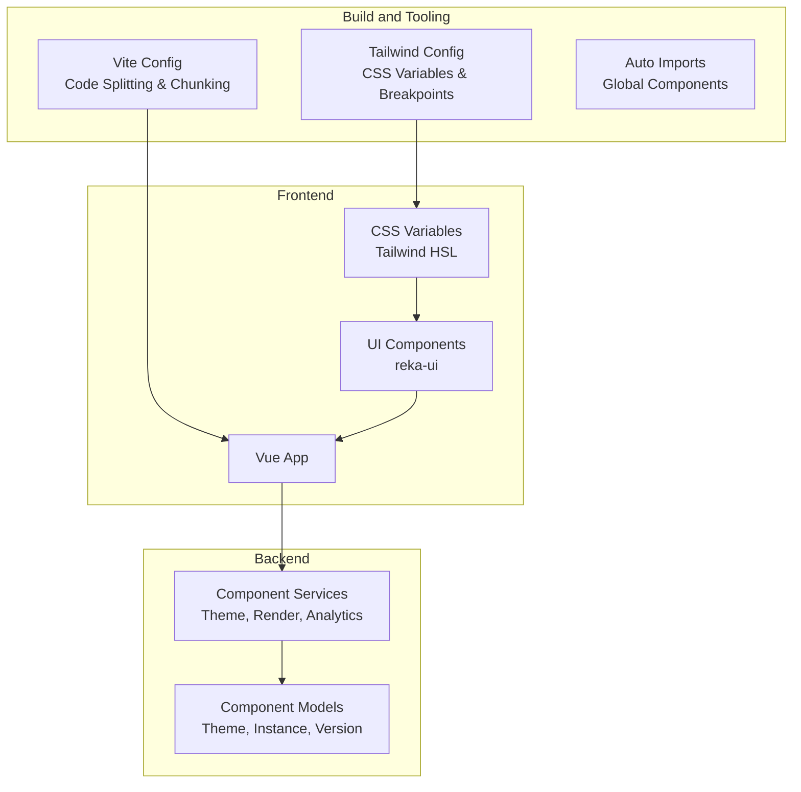
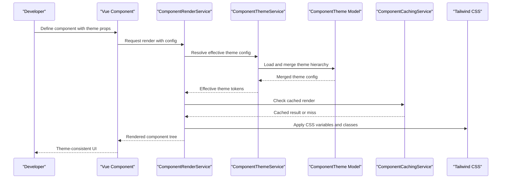
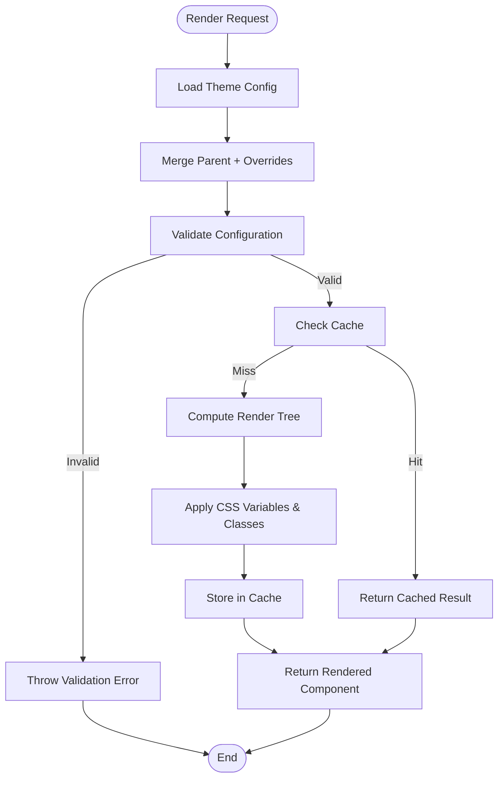
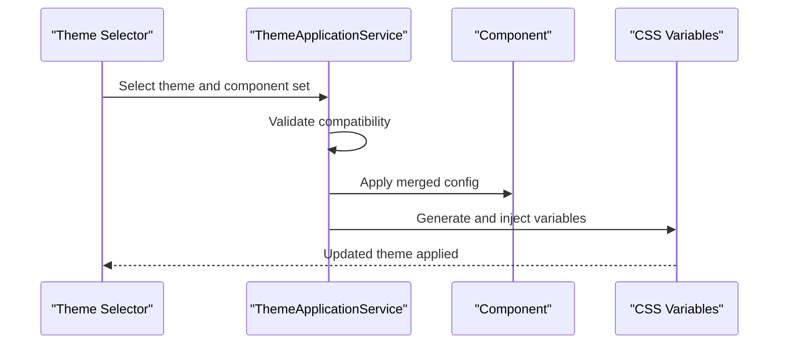
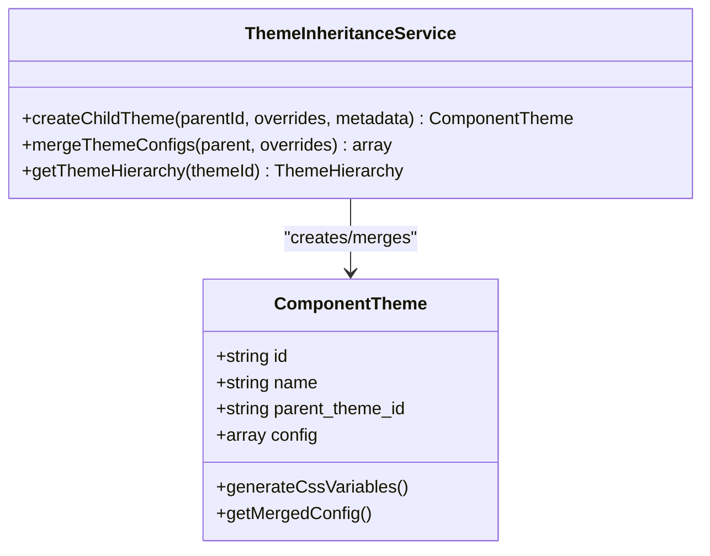
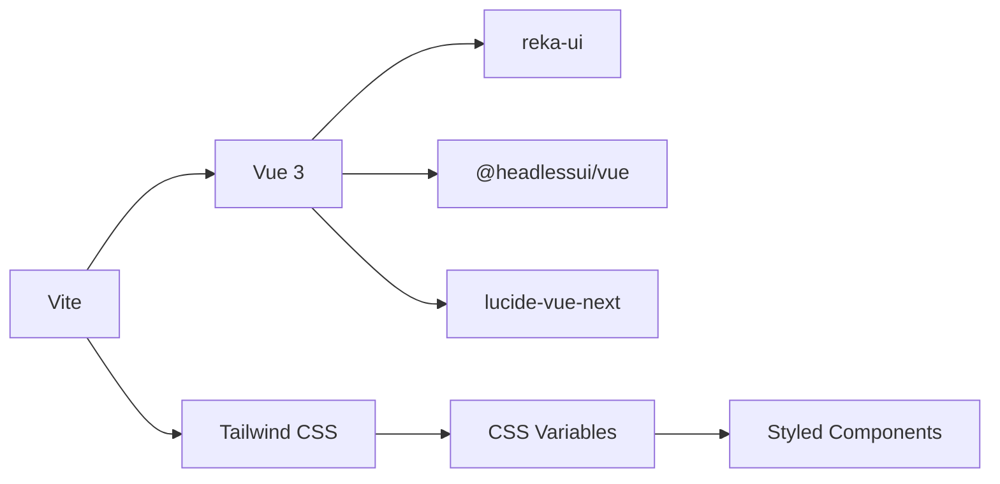

# Component Library and Theming

<cite>
**Referenced Files in This Document**
- [package.json](file://package.json)
- [vite.config.ts](file://vite.config.ts)
- [tailwind.config.js](file://tailwind.config.js)
- [components.d.ts](file://components.d.ts)
- [app/Services/ComponentThemeService.php](file://app/Services/ComponentThemeService.php)
- [app/Services/ComponentRenderService.php](file://app/Services/ComponentRenderService.php)
- [app/Services/ComponentService.php](file://app/Services/ComponentService.php)
- [app/Services/ComponentAnalyticsService.php](file://app/Services/ComponentAnalyticsService.php)
- [app/Services/ComponentCachingService.php](file://app/Services/ComponentCachingService.php)
- [app/Services/ComponentPerformanceAnalysisService.php](file://app/Services/ComponentPerformanceAnalysisService.php)
- [app/Models/Component.php](file://app/Models/Component.php)
- [app/Models/ComponentTheme.php](file://app/Models/ComponentTheme.php)
- [app/Models/ComponentInstance.php](file://app/Models/ComponentInstance.php)
- [app/Models/ComponentCollection.php](file://app/Models/ComponentCollection.php)
- [app/Models/ComponentVersion.php](file://app/Models/ComponentVersion.php)
- [docs/component-library/theme-integration.md](file://docs/component-library/theme-integration.md)
- [docs/component-library/troubleshooting-guide.md](file://docs/component-library/troubleshooting-guide.md)
- [tests/Unit/ComponentThemeModelTest.php](file://tests/Unit/ComponentThemeModelTest.php)
</cite>

## Table of Contents
1. [Introduction](#introduction)
2. [Project Structure](#project-structure)
3. [Core Components](#core-components)
4. [Architecture Overview](#architecture-overview)
5. [Detailed Component Analysis](#detailed-component-analysis)
6. [Dependency Analysis](#dependency-analysis)
7. [Performance Considerations](#performance-considerations)
8. [Troubleshooting Guide](#troubleshooting-guide)
9. [Conclusion](#conclusion)
10. [Appendices](#appendices)

## Introduction
This document describes the component library and theming system used to build reusable UI components with consistent theming and customization. It explains the component-based architecture, theme management, rendering pipeline, theme switching, responsive design, configuration validation, slots, events, registration, inheritance, and performance optimization strategies. The goal is to help developers implement, customize, and maintain components efficiently across the application.

## Project Structure
The component library integrates Vue-based UI components with Laravel services and Tailwind CSS for styling. Build tooling via Vite enables code splitting, chunking, and asset optimization. The theming system is backed by Laravel models and services that manage theme configuration, inheritance, and CSS variable generation.

**Diagram sources**
- [vite.config.ts:1-163](file://vite.config.ts#L1-L163)
- [tailwind.config.js:1-106](file://tailwind.config.js#L1-L106)
- [components.d.ts:1-15](file://components.d.ts#L1-L15)
- [app/Services/ComponentThemeService.php:281-311](file://app/Services/ComponentThemeService.php#L281-L311)
- [app/Models/ComponentTheme.php](file://app/Models/ComponentTheme.php)

**Section sources**
- [vite.config.ts:1-163](file://vite.config.ts#L1-L163)
- [tailwind.config.js:1-106](file://tailwind.config.js#L1-L106)
- [components.d.ts:1-15](file://components.d.ts#L1-L15)

## Core Components
- Component library: Built with reka-ui and other Vue UI packages, integrated via Vite and auto-imports.
- Theme system: Managed by Laravel models and services, supporting theme inheritance, configuration merging, and CSS variable generation.
- Rendering pipeline: Component rendering orchestrated by dedicated services with caching and analytics hooks.
- Styling: Tailwind CSS with CSS variables mapped to theme tokens for dynamic theming.

Key implementation references:
- Component library dependencies and build configuration: [package.json:48-81](file://package.json#L48-L81), [vite.config.ts:1-163](file://vite.config.ts#L1-L163)
- Theme model and service: [app/Models/ComponentTheme.php](file://app/Models/ComponentTheme.php), [app/Services/ComponentThemeService.php:281-311](file://app/Services/ComponentThemeService.php#L281-L311)
- Component rendering and analytics: [app/Services/ComponentRenderService.php](file://app/Services/ComponentRenderService.php), [app/Services/ComponentAnalyticsService.php](file://app/Services/ComponentAnalyticsService.php)
- Component caching and performance: [app/Services/ComponentCachingService.php](file://app/Services/ComponentCachingService.php), [app/Services/ComponentPerformanceAnalysisService.php](file://app/Services/ComponentPerformanceAnalysisService.php)

**Section sources**
- [package.json:48-81](file://package.json#L48-L81)
- [vite.config.ts:1-163](file://vite.config.ts#L1-L163)
- [app/Services/ComponentThemeService.php:281-311](file://app/Services/ComponentThemeService.php#L281-L311)
- [app/Services/ComponentRenderService.php](file://app/Services/ComponentRenderService.php)
- [app/Services/ComponentAnalyticsService.php](file://app/Services/ComponentAnalyticsService.php)
- [app/Services/ComponentCachingService.php](file://app/Services/ComponentCachingService.php)
- [app/Services/ComponentPerformanceAnalysisService.php](file://app/Services/ComponentPerformanceAnalysisService.php)

## Architecture Overview
The system separates concerns across build tooling, frontend component rendering, and backend theme management. Components consume theme tokens via Tailwind CSS variables, while services handle configuration merging, inheritance, and runtime rendering decisions.

**Diagram sources**
- [app/Services/ComponentRenderService.php](file://app/Services/ComponentRenderService.php)
- [app/Services/ComponentThemeService.php:281-311](file://app/Services/ComponentThemeService.php#L281-L311)
- [app/Models/ComponentTheme.php](file://app/Models/ComponentTheme.php)
- [app/Services/ComponentCachingService.php](file://app/Services/ComponentCachingService.php)
- [tailwind.config.js:1-106](file://tailwind.config.js#L1-L106)

## Detailed Component Analysis

### Component Rendering Pipeline
The rendering pipeline orchestrates theme resolution, caching, and UI generation:
- Theme resolution merges parent-child themes and validates configuration.
- Caching avoids redundant computations for identical configurations.
- Tailwind CSS applies theme tokens via CSS variables and utility classes.

**Diagram sources**
- [app/Services/ComponentThemeService.php:281-311](file://app/Services/ComponentThemeService.php#L281-L311)
- [app/Services/ComponentCachingService.php](file://app/Services/ComponentCachingService.php)
- [tailwind.config.js:1-106](file://tailwind.config.js#L1-L106)

**Section sources**
- [app/Services/ComponentThemeService.php:281-311](file://app/Services/ComponentThemeService.php#L281-L311)
- [app/Services/ComponentCachingService.php](file://app/Services/ComponentCachingService.php)
- [tailwind.config.js:1-106](file://tailwind.config.js#L1-L106)

### Theme Switching Mechanisms
Theme switching is achieved by applying CSS variables at the root level and updating component configuration. The system supports:
- Theme inheritance: Child themes override specific tokens while inheriting others.
- Compatibility checks: Ensures selected components support the target theme.
- Dynamic updates: Runtime application of theme tokens via Tailwind variables.

**Diagram sources**
- [docs/component-library/theme-integration.md:443-814](file://docs/component-library/theme-integration.md#L443-L814)

**Section sources**
- [docs/component-library/theme-integration.md:443-814](file://docs/component-library/theme-integration.md#L443-L814)

### Responsive Design Implementation
Responsive breakpoints and safe areas are configured in Tailwind to ensure consistent layouts across devices. Additional touch-friendly minimum sizes improve usability on mobile.

Key references:
- Breakpoints and safe areas: [tailwind.config.js:16-101](file://tailwind.config.js#L16-L101)

**Section sources**
- [tailwind.config.js:16-101](file://tailwind.config.js#L16-L101)

### Component Configuration System
The configuration system supports:
- Props validation: Ensures component props conform to expected shapes.
- Slot management: Provides named and fallback slots for flexible composition.
- Event handling: Emits structured events for parent components to react to user actions.
- Registration: Auto-imports and global component registration streamline usage.

References:
- Auto-imported components: [components.d.ts:8-14](file://components.d.ts#L8-L14)
- Build aliases and plugin configuration: [vite.config.ts:110-162](file://vite.config.ts#L110-L162)

**Section sources**
- [components.d.ts:8-14](file://components.d.ts#L8-L14)
- [vite.config.ts:110-162](file://vite.config.ts#L110-L162)

### Theme Inheritance and Merging
Theme inheritance allows creating child themes that override specific tokens while preserving parent values. The system merges configurations recursively and validates the result.

**Diagram sources**
- [docs/component-library/theme-integration.md:704-814](file://docs/component-library/theme-integration.md#L704-L814)
- [app/Models/ComponentTheme.php](file://app/Models/ComponentTheme.php)

**Section sources**
- [docs/component-library/theme-integration.md:704-814](file://docs/component-library/theme-integration.md#L704-L814)
- [app/Models/ComponentTheme.php](file://app/Models/ComponentTheme.php)

### Component Registration and Usage Patterns
- Registration: Components are auto-imported and globally registered for convenient usage.
- Usage patterns: Pass theme props to components, leverage slots for content projection, and listen to emitted events for interactivity.

References:
- Auto-import declarations: [components.d.ts:8-14](file://components.d.ts#L8-L14)
- Build configuration for aliases and plugins: [vite.config.ts:110-162](file://vite.config.ts#L110-L162)

**Section sources**
- [components.d.ts:8-14](file://components.d.ts#L8-L14)
- [vite.config.ts:110-162](file://vite.config.ts#L110-L162)

## Dependency Analysis
The component library relies on Vue UI packages and build tooling. Theme tokens are consumed via Tailwind CSS variables, ensuring consistent styling across components.

**Diagram sources**
- [package.json:48-81](file://package.json#L48-L81)
- [vite.config.ts:1-163](file://vite.config.ts#L1-163)
- [tailwind.config.js:1-106](file://tailwind.config.js#L1-L106)

**Section sources**
- [package.json:48-81](file://package.json#L48-L81)
- [vite.config.ts:1-163](file://vite.config.ts#L1-L163)
- [tailwind.config.js:1-106](file://tailwind.config.js#L1-L106)

## Performance Considerations
- Code splitting and chunking: Vite groups heavy dependencies into separate chunks to optimize load times.
- Asset optimization: Separate naming strategies for JS, CSS, and assets improve caching.
- Dependency optimization: Pre-bundling selected dependencies reduces cold-start latency.
- Component caching: Caching rendered component trees reduces repeated computation.
- CSS variable usage: Centralized theming via CSS variables minimizes style recalculation overhead.

Practical tips:
- Keep theme configs minimal and focused.
- Prefer CSS variables for colors and spacing to enable fast runtime switching.
- Use lazy loading for large components and route-level code splitting.

**Section sources**
- [vite.config.ts:25-108](file://vite.config.ts#L25-L108)
- [app/Services/ComponentCachingService.php](file://app/Services/ComponentCachingService.php)
- [tailwind.config.js:19-63](file://tailwind.config.js#L19-L63)

## Troubleshooting Guide
Common issues and resolutions:
- Theme not applied: Verify theme props are passed to components and CSS variables are generated.
- Hardcoded colors: Replace hardcoded values with theme tokens or CSS variables.
- CSS variable generation: Ensure variables are generated and injected at runtime.

Diagnostic steps and fixes are documented in the troubleshooting guide.

**Section sources**
- [docs/component-library/troubleshooting-guide.md:296-365](file://docs/component-library/troubleshooting-guide.md#L296-L365)

## Conclusion
The component library and theming system provide a scalable, maintainable foundation for building consistent UIs. By leveraging theme inheritance, CSS variables, and a robust rendering pipeline, teams can deliver customizable experiences efficiently. The included performance strategies and troubleshooting guidance help ensure smooth operation across environments.

## Appendices

### Theme Customization Workflow
- Define or select a base theme.
- Create a child theme with targeted overrides.
- Apply the theme to components and verify compatibility.
- Inject CSS variables and confirm visual consistency.

References:
- Theme application and inheritance: [docs/component-library/theme-integration.md:443-814](file://docs/component-library/theme-integration.md#L443-L814)
- Theme model capabilities: [tests/Unit/ComponentThemeModelTest.php:269-285](file://tests/Unit/ComponentThemeModelTest.php#L269-L285)

**Section sources**
- [docs/component-library/theme-integration.md:443-814](file://docs/component-library/theme-integration.md#L443-L814)
- [tests/Unit/ComponentThemeModelTest.php:269-285](file://tests/Unit/ComponentThemeModelTest.php#L269-L285)