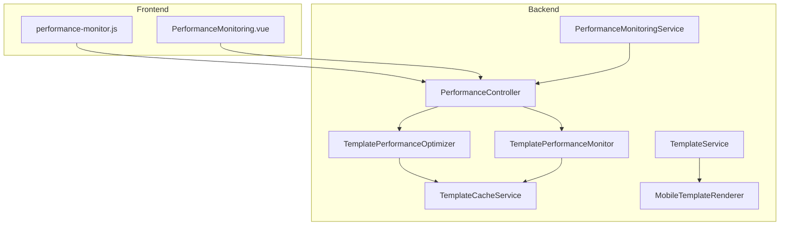
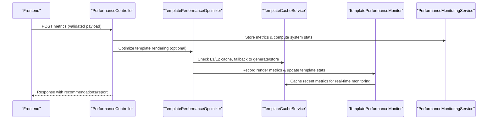
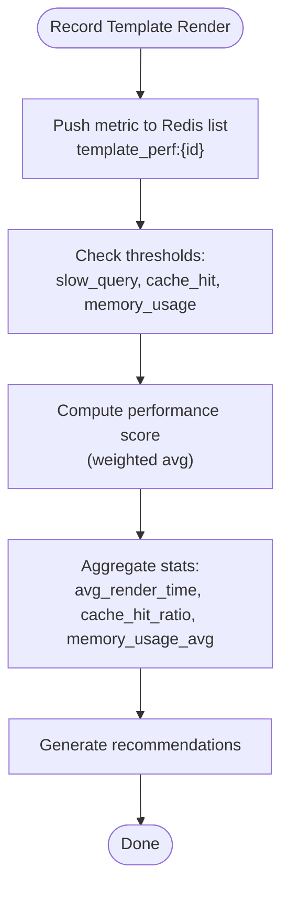
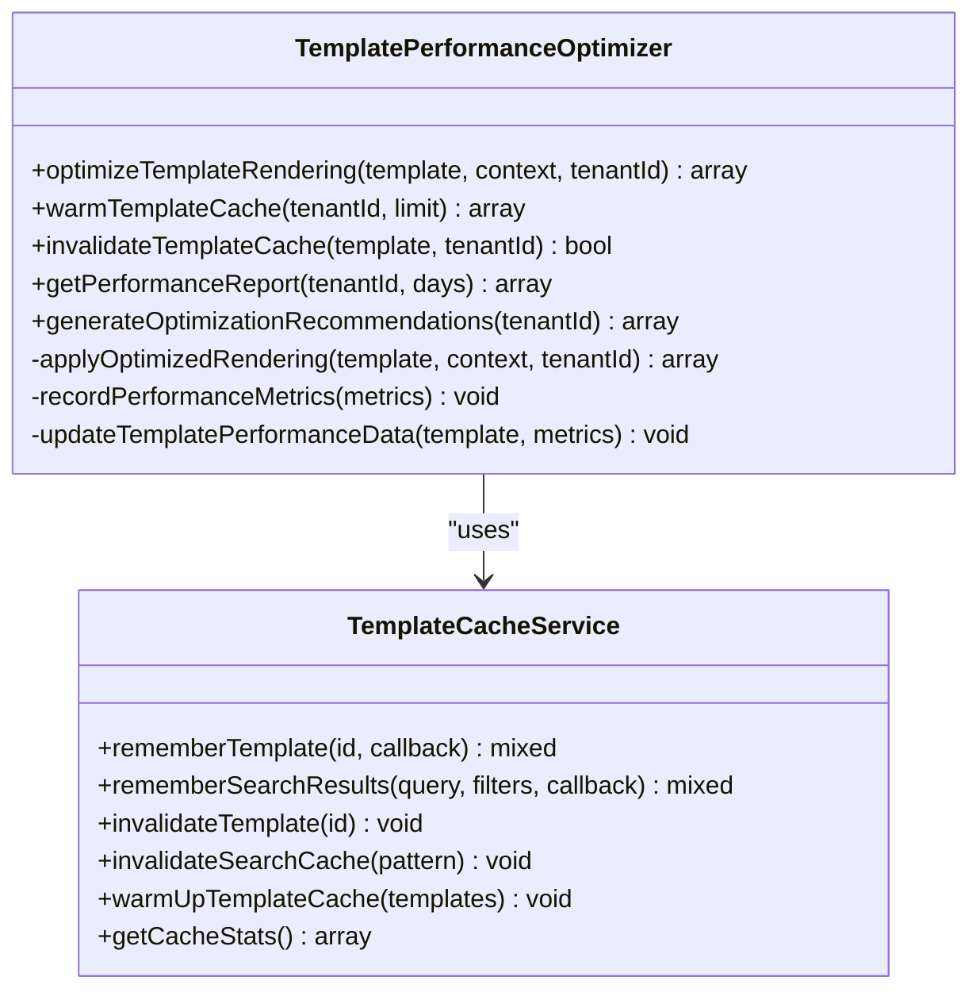
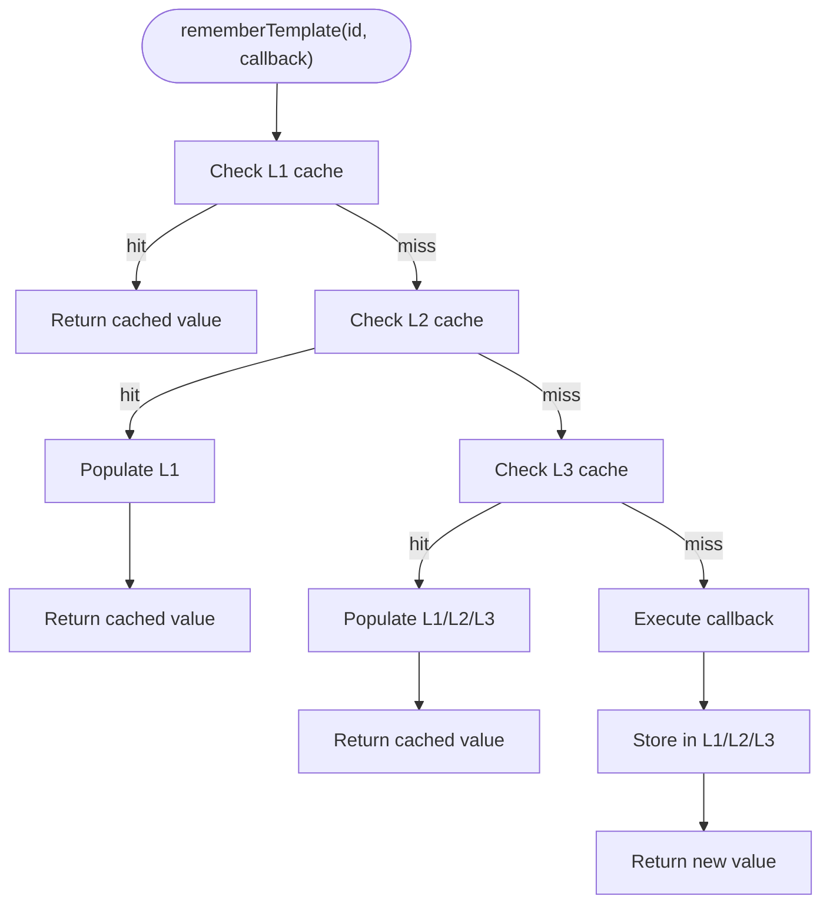
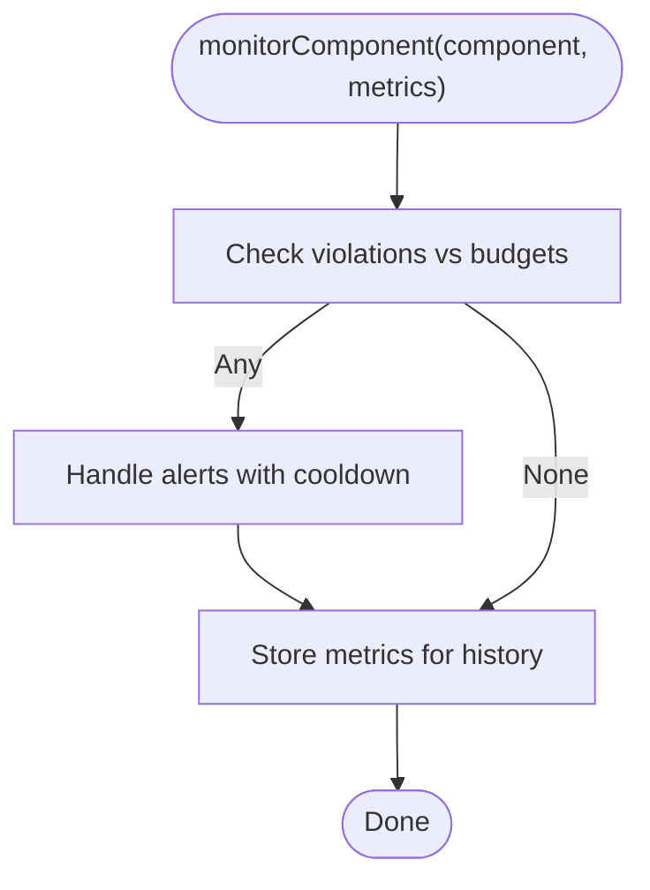
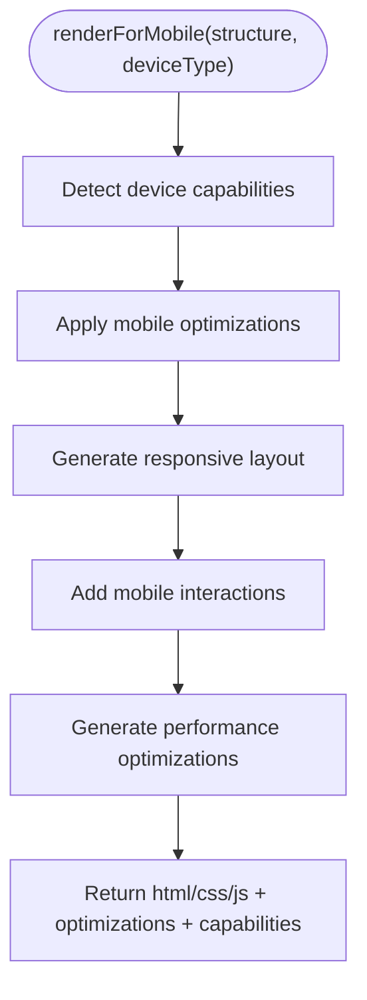
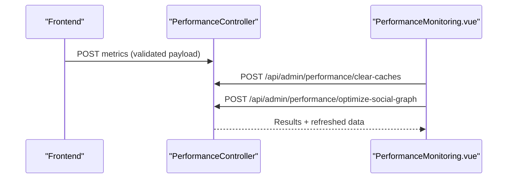
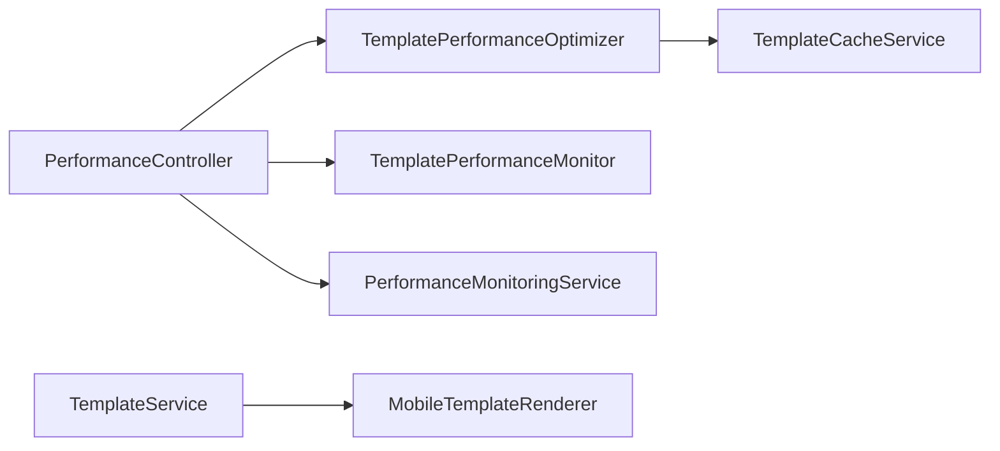

# Performance Monitoring and Optimization

<cite>
**Referenced Files in This Document**
- [TemplatePerformanceMonitor.php](file://app/Services/TemplatePerformanceMonitor.php)
- [TemplatePerformanceOptimizer.php](file://app/Services/TemplatePerformanceOptimizer.php)
- [TemplateCacheService.php](file://app/Services/TemplateCacheService.php)
- [MobileTemplateRenderer.php](file://app/Services/MobileTemplateRenderer.php)
- [PerformanceMonitoringService.php](file://app/Services/PerformanceMonitoringService.php)
- [PerformanceController.php](file://app/Http/Controllers/Api/PerformanceController.php)
- [PerformanceMonitoring.vue](file://resources/js/components/admin/PerformanceMonitoring.vue)
- [performance-monitor.js](file://resources/js/utils/performance-monitor.js)
- [TemplateService.php](file://app/Services/TemplateService.php)
</cite>

## Table of Contents
1. [Introduction](#introduction)
2. [Project Structure](#project-structure)
3. [Core Components](#core-components)
4. [Architecture Overview](#architecture-overview)
5. [Detailed Component Analysis](#detailed-component-analysis)
6. [Dependency Analysis](#dependency-analysis)
7. [Performance Considerations](#performance-considerations)
8. [Troubleshooting Guide](#troubleshooting-guide)
9. [Conclusion](#conclusion)
10. [Appendices](#appendices)

## Introduction
This document explains the template performance monitoring and optimization system, covering caching strategies (template, search result, and performance metrics), real-time performance tracking, conversion rate analysis, usage statistics collection, and mobile template rendering optimizations. It also provides practical tuning scenarios, dashboard usage, cache invalidation strategies, and recommendations for continuous improvement.

## Project Structure
The performance system spans backend services, frontend utilities, and admin dashboards:
- Backend services manage multi-level caching, template optimization, and performance monitoring/alerting.
- Frontend utilities capture client-side metrics and report them to the backend.
- Admin dashboard components allow cache clearing, optimization actions, and viewing performance insights.

**Diagram sources**
- [PerformanceController.php:33-51](file://app/Http/Controllers/Api/PerformanceController.php#L33-L51)
- [TemplatePerformanceOptimizer.php:63-97](file://app/Services/TemplatePerformanceOptimizer.php#L63-L97)
- [TemplatePerformanceMonitor.php:38-56](file://app/Services/TemplatePerformanceMonitor.php#L38-L56)
- [TemplateCacheService.php:39-81](file://app/Services/TemplateCacheService.php#L39-L81)
- [PerformanceMonitoringService.php:47-57](file://app/Services/PerformanceMonitoringService.php#L47-L57)
- [MobileTemplateRenderer.php:40-66](file://app/Services/MobileTemplateRenderer.php#L40-L66)
- [TemplateService.php:509-518](file://app/Services/TemplateService.php#L509-L518)

**Section sources**
- [PerformanceController.php:33-51](file://app/Http/Controllers/Api/PerformanceController.php#L33-L51)
- [TemplatePerformanceOptimizer.php:63-97](file://app/Services/TemplatePerformanceOptimizer.php#L63-L97)
- [TemplatePerformanceMonitor.php:38-56](file://app/Services/TemplatePerformanceMonitor.php#L38-L56)
- [TemplateCacheService.php:39-81](file://app/Services/TemplateCacheService.php#L39-L81)
- [PerformanceMonitoringService.php:47-57](file://app/Services/PerformanceMonitoringService.php#L47-L57)
- [MobileTemplateRenderer.php:40-66](file://app/Services/MobileTemplateRenderer.php#L40-L66)
- [TemplateService.php:509-518](file://app/Services/TemplateService.php#L509-L518)

## Core Components
- TemplatePerformanceMonitor: Records per-template metrics, computes performance scores, detects threshold breaches, and supports cache warming and optimization.
- TemplatePerformanceOptimizer: Implements multi-level caching, pre-warming, cache invalidation, and generates optimization recommendations.
- TemplateCacheService: Manages multi-layer template caching (memory, Redis, archive) and search result caching with intelligent keying and invalidation.
- PerformanceMonitoringService: Enforces performance budgets, collects system metrics, and emits alerts with cooldowns.
- MobileTemplateRenderer: Generates mobile-optimized HTML/CSS/JS with device capability detection and responsive configurations.
- Frontend Performance Utilities: Capture client metrics and report them to backend endpoints.
- Admin Dashboard: Provides cache clearing and optimization actions.

**Section sources**
- [TemplatePerformanceMonitor.php:15-121](file://app/Services/TemplatePerformanceMonitor.php#L15-L121)
- [TemplatePerformanceOptimizer.php:19-97](file://app/Services/TemplatePerformanceOptimizer.php#L19-L97)
- [TemplateCacheService.php:16-153](file://app/Services/TemplateCacheService.php#L16-L153)
- [PerformanceMonitoringService.php:18-82](file://app/Services/PerformanceMonitoringService.php#L18-L82)
- [MobileTemplateRenderer.php:14-104](file://app/Services/MobileTemplateRenderer.php#L14-L104)
- [performance-monitor.js:472-501](file://resources/js/utils/performance-monitor.js#L472-L501)
- [PerformanceMonitoring.vue:382-419](file://resources/js/components/admin/PerformanceMonitoring.vue#L382-L419)

## Architecture Overview
The system integrates frontend telemetry, backend optimization, and monitoring with a layered caching strategy and mobile-specific rendering.

**Diagram sources**
- [PerformanceController.php:33-51](file://app/Http/Controllers/Api/PerformanceController.php#L33-L51)
- [TemplatePerformanceOptimizer.php:63-97](file://app/Services/TemplatePerformanceOptimizer.php#L63-L97)
- [TemplateCacheService.php:39-81](file://app/Services/TemplateCacheService.php#L39-L81)
- [TemplatePerformanceMonitor.php:38-56](file://app/Services/TemplatePerformanceMonitor.php#L38-L56)
- [PerformanceMonitoringService.php:47-57](file://app/Services/PerformanceMonitoringService.php#L47-L57)

## Detailed Component Analysis

### Template Performance Monitoring
- Metrics recording: Stores per-template render time, cache hit flag, memory usage, and timestamps in Redis lists keyed by template.
- Statistics aggregation: Computes averages, cache hit ratios, and a composite performance score with weighted factors.
- Threshold checks: Flags slow render times, cache misses, and high memory usage with warnings and potential alerts.
- Cache optimization: Warms popular templates and cleans old cache entries; adjusts TTLs based on usage patterns.

**Diagram sources**
- [TemplatePerformanceMonitor.php:38-102](file://app/Services/TemplatePerformanceMonitor.php#L38-L102)
- [TemplatePerformanceMonitor.php:167-187](file://app/Services/TemplatePerformanceMonitor.php#L167-L187)
- [TemplatePerformanceMonitor.php:197-205](file://app/Services/TemplatePerformanceMonitor.php#L197-L205)

**Section sources**
- [TemplatePerformanceMonitor.php:38-102](file://app/Services/TemplatePerformanceMonitor.php#L38-L102)
- [TemplatePerformanceMonitor.php:128-157](file://app/Services/TemplatePerformanceMonitor.php#L128-L157)
- [TemplatePerformanceMonitor.php:167-187](file://app/Services/TemplatePerformanceMonitor.php#L167-L187)
- [TemplatePerformanceMonitor.php:197-205](file://app/Services/TemplatePerformanceMonitor.php#L197-L205)

### Template Performance Optimization
- Multi-level caching: L1 (memory), L2 (Redis), L3 (archive) with tenant-scoped keys and durations.
- Rendering optimization: Attempts cache hits, falls back to generating optimized content, and caches across layers.
- Metrics and scoring: Tracks render time, memory peak, cache hits, and updates template performance data.
- Recommendations: Analyzes template and system performance to suggest improvements.

**Diagram sources**
- [TemplatePerformanceOptimizer.php:63-97](file://app/Services/TemplatePerformanceOptimizer.php#L63-L97)
- [TemplatePerformanceOptimizer.php:305-354](file://app/Services/TemplatePerformanceOptimizer.php#L305-L354)
- [TemplateCacheService.php:39-81](file://app/Services/TemplateCacheService.php#L39-L81)

**Section sources**
- [TemplatePerformanceOptimizer.php:63-97](file://app/Services/TemplatePerformanceOptimizer.php#L63-L97)
- [TemplatePerformanceOptimizer.php:106-147](file://app/Services/TemplatePerformanceOptimizer.php#L106-L147)
- [TemplatePerformanceOptimizer.php:156-197](file://app/Services/TemplatePerformanceOptimizer.php#L156-L197)
- [TemplatePerformanceOptimizer.php:206-239](file://app/Services/TemplatePerformanceOptimizer.php#L206-L239)
- [TemplatePerformanceOptimizer.php:247-300](file://app/Services/TemplatePerformanceOptimizer.php#L247-L300)
- [TemplateCacheService.php:39-81](file://app/Services/TemplateCacheService.php#L39-L81)
- [TemplateCacheService.php:144-153](file://app/Services/TemplateCacheService.php#L144-L153)
- [TemplateCacheService.php:160-223](file://app/Services/TemplateCacheService.php#L160-L223)

### Template Cache Service
- Multi-layer caching: L1 (array), L2 (Redis), L3 (archive), metadata, optimization, and popular templates stores with distinct TTLs.
- Intelligent keying: Uses hashed keys for search results and template identifiers for cache isolation.
- Invalidation: Supports granular invalidation for templates, metadata, optimization data, popular lists, and search cache patterns.

**Diagram sources**
- [TemplateCacheService.php:39-81](file://app/Services/TemplateCacheService.php#L39-L81)

**Section sources**
- [TemplateCacheService.php:16-31](file://app/Services/TemplateCacheService.php#L16-L31)
- [TemplateCacheService.php:39-81](file://app/Services/TemplateCacheService.php#L39-L81)
- [TemplateCacheService.php:144-153](file://app/Services/TemplateCacheService.php#L144-L153)
- [TemplateCacheService.php:160-223](file://app/Services/TemplateCacheService.php#L160-L223)
- [TemplateCacheService.php:246-264](file://app/Services/TemplateCacheService.php#L246-L264)

### Performance Monitoring and Alerting
- Budget enforcement: Defines warning/critical thresholds for response time, memory usage, component render time, and database query time.
- Alerts: Emits warnings and critical alerts with cooldowns to prevent spam; stores alerts for dashboard retrieval.
- System metrics: Collects memory usage, peak memory, response time, and CPU load; persists for trend analysis.
- Reports and recommendations: Aggregates component performance histories, system metrics, and alerts; calculates budget compliance and suggests optimizations.

**Diagram sources**
- [PerformanceMonitoringService.php:47-57](file://app/Services/PerformanceMonitoringService.php#L47-L57)
- [PerformanceMonitoringService.php:87-113](file://app/Services/PerformanceMonitoringService.php#L87-L113)
- [PerformanceMonitoringService.php:118-138](file://app/Services/PerformanceMonitoringService.php#L118-L138)
- [PerformanceMonitoringService.php:188-202](file://app/Services/PerformanceMonitoringService.php#L188-L202)

**Section sources**
- [PerformanceMonitoringService.php:23-40](file://app/Services/PerformanceMonitoringService.php#L23-L40)
- [PerformanceMonitoringService.php:47-57](file://app/Services/PerformanceMonitoringService.php#L47-L57)
- [PerformanceMonitoringService.php:87-113](file://app/Services/PerformanceMonitoringService.php#L87-L113)
- [PerformanceMonitoringService.php:118-138](file://app/Services/PerformanceMonitoringService.php#L118-L138)
- [PerformanceMonitoringService.php:188-202](file://app/Services/PerformanceMonitoringService.php#L188-L202)
- [PerformanceMonitoringService.php:257-273](file://app/Services/PerformanceMonitoringService.php#L257-L273)
- [PerformanceMonitoringService.php:290-328](file://app/Services/PerformanceMonitoringService.php#L290-L328)
- [PerformanceMonitoringService.php:373-404](file://app/Services/PerformanceMonitoringService.php#L373-L404)
- [PerformanceMonitoringService.php:409-431](file://app/Services/PerformanceMonitoringService.php#L409-L431)

### Mobile Template Rendering Optimization
- Device detection: Determines viewport width, DPI, accelerometer, and connection type for adaptive layouts.
- Mobile optimizations: Applies lazy loading, font preloading, critical CSS inlining, touch-friendly sizing, and reduced animations.
- Responsive configuration: Generates breakpoints, CSS grid/flex layouts, and mobile-first styles.
- Interactions: Adds touch event handlers, gesture support, and accessibility features.

**Diagram sources**
- [MobileTemplateRenderer.php:40-66](file://app/Services/MobileTemplateRenderer.php#L40-L66)
- [MobileTemplateRenderer.php:74-104](file://app/Services/MobileTemplateRenderer.php#L74-L104)
- [MobileTemplateRenderer.php:113-134](file://app/Services/MobileTemplateRenderer.php#L113-L134)
- [MobileTemplateRenderer.php:230-254](file://app/Services/MobileTemplateRenderer.php#L230-L254)
- [MobileTemplateRenderer.php:262-283](file://app/Services/MobileTemplateRenderer.php#L262-L283)
- [MobileTemplateRenderer.php:291-303](file://app/Services/MobileTemplateRenderer.php#L291-L303)

**Section sources**
- [MobileTemplateRenderer.php:16-31](file://app/Services/MobileTemplateRenderer.php#L16-L31)
- [MobileTemplateRenderer.php:40-66](file://app/Services/MobileTemplateRenderer.php#L40-L66)
- [MobileTemplateRenderer.php:74-104](file://app/Services/MobileTemplateRenderer.php#L74-L104)
- [MobileTemplateRenderer.php:113-134](file://app/Services/MobileTemplateRenderer.php#L113-L134)
- [MobileTemplateRenderer.php:230-254](file://app/Services/MobileTemplateRenderer.php#L230-L254)
- [MobileTemplateRenderer.php:262-283](file://app/Services/MobileTemplateRenderer.php#L262-L283)
- [MobileTemplateRenderer.php:291-303](file://app/Services/MobileTemplateRenderer.php#L291-L303)

### Frontend Performance Telemetry and Admin Dashboard
- Frontend metrics: Captures async operation timings and reports metrics to backend endpoints with session info.
- Admin actions: Clears caches, optimizes social graph, and refreshes performance data via admin endpoints.

**Diagram sources**
- [performance-monitor.js:472-501](file://resources/js/utils/performance-monitor.js#L472-L501)
- [PerformanceMonitoring.vue:382-419](file://resources/js/components/admin/PerformanceMonitoring.vue#L382-L419)
- [PerformanceController.php:33-51](file://app/Http/Controllers/Api/PerformanceController.php#L33-L51)

**Section sources**
- [performance-monitor.js:472-501](file://resources/js/utils/performance-monitor.js#L472-L501)
- [PerformanceMonitoring.vue:382-419](file://resources/js/components/admin/PerformanceMonitoring.vue#L382-L419)
- [PerformanceController.php:33-51](file://app/Http/Controllers/Api/PerformanceController.php#L33-L51)

## Dependency Analysis
- TemplatePerformanceOptimizer depends on TemplateCacheService for multi-level caching and on TemplatePerformanceMonitor for metrics recording.
- TemplateService delegates mobile rendering to MobileTemplateRenderer and uses TemplateCacheService for previews.
- PerformanceController orchestrates frontend metrics ingestion and delegates optimization/reporting to TemplatePerformanceOptimizer and TemplatePerformanceMonitor.
- PerformanceMonitoringService provides system-wide metrics and alerting independent of template rendering.

**Diagram sources**
- [PerformanceController.php:26-29](file://app/Http/Controllers/Api/PerformanceController.php#L26-L29)
- [TemplatePerformanceOptimizer.php:25-28](file://app/Services/TemplatePerformanceOptimizer.php#L25-L28)
- [TemplateService.php](file://app/Services/TemplateService.php#L517)

**Section sources**
- [PerformanceController.php:26-29](file://app/Http/Controllers/Api/PerformanceController.php#L26-L29)
- [TemplatePerformanceOptimizer.php:25-28](file://app/Services/TemplatePerformanceOptimizer.php#L25-L28)
- [TemplateService.php](file://app/Services/TemplateService.php#L517)

## Performance Considerations
- Multi-level caching reduces latency by serving from memory first, then Redis, then archive storage.
- Cache warming improves hit rates for popular templates; invalidation ensures freshness after updates.
- Device-aware rendering minimizes bandwidth and improves UX on mobile networks.
- Budget-based alerting prevents regressions and maintains SLAs.
- Trend analysis and recommendations enable proactive optimization.

[No sources needed since this section provides general guidance]

## Troubleshooting Guide
- Slow render times: Review recommendations from TemplatePerformanceOptimizer and TemplatePerformanceMonitor; consider cache warming and structure optimizations.
- Cache misses: Verify cache keys, TTLs, and invalidation flows; ensure Redis connectivity.
- High memory usage: Investigate component render times and system metrics; adjust budgets and investigate hotspots.
- Mobile rendering issues: Confirm device capability detection and responsive configuration; validate touch interactions and CSS.

**Section sources**
- [TemplatePerformanceMonitor.php:167-187](file://app/Services/TemplatePerformanceMonitor.php#L167-L187)
- [TemplatePerformanceOptimizer.php:156-197](file://app/Services/TemplatePerformanceOptimizer.php#L156-L197)
- [TemplateCacheService.php:210-223](file://app/Services/TemplateCacheService.php#L210-L223)
- [PerformanceMonitoringService.php:67-78](file://app/Services/PerformanceMonitoringService.php#L67-L78)
- [MobileTemplateRenderer.php:74-104](file://app/Services/MobileTemplateRenderer.php#L74-L104)

## Conclusion
The system combines robust caching, real-time monitoring, and mobile-specific optimizations to deliver fast, reliable template rendering. By leveraging multi-level cache layers, performance budgets, and actionable recommendations, teams can continuously improve performance and maintain strong user experiences across devices.

[No sources needed since this section summarizes without analyzing specific files]

## Appendices

### Practical Tuning Scenarios
- Scenario A: Popular template underperforming
  - Action: Warm cache for top N templates; review recommendations; adjust TTLs.
  - Reference: [TemplatePerformanceOptimizer.php:106-147](file://app/Services/TemplatePerformanceOptimizer.php#L106-L147), [TemplatePerformanceMonitor.php:128-157](file://app/Services/TemplatePerformanceMonitor.php#L128-L157)
- Scenario B: Mobile page sluggish
  - Action: Enable lazy loading and critical CSS; validate device capabilities; test responsive breakpoints.
  - Reference: [MobileTemplateRenderer.php:291-303](file://app/Services/MobileTemplateRenderer.php#L291-L303), [MobileTemplateRenderer.php:230-254](file://app/Services/MobileTemplateRenderer.php#L230-L254)
- Scenario C: Dashboard shows frequent alerts
  - Action: Increase budgets temporarily, investigate root causes, and re-run recommendations.
  - Reference: [PerformanceMonitoringService.php:278-285](file://app/Services/PerformanceMonitoringService.php#L278-L285), [PerformanceMonitoringService.php:373-404](file://app/Services/PerformanceMonitoringService.php#L373-L404)

### Monitoring Dashboard Usage
- Clear caches and optimize social graph via admin actions.
- Observe real-time metrics and recommendations returned by PerformanceController.
- Reference: [PerformanceMonitoring.vue:382-419](file://resources/js/components/admin/PerformanceMonitoring.vue#L382-L419), [PerformanceController.php:33-51](file://app/Http/Controllers/Api/PerformanceController.php#L33-L51)

### Implementation Details
- Cache invalidation strategies:
  - Template updates: Invalidate L1/L2/L3, metadata, optimization, and related landing pages.
  - Search cache: Invalidate by pattern using Redis keys.
  - Reference: [TemplatePerformanceOptimizer.php:156-197](file://app/Services/TemplatePerformanceOptimizer.php#L156-L197), [TemplateCacheService.php:210-223](file://app/Services/TemplateCacheService.php#L210-L223)
- Performance metric calculation:
  - Composite score based on render time, cache hit ratio, and memory usage.
  - Reference: [TemplatePerformanceMonitor.php:197-205](file://app/Services/TemplatePerformanceMonitor.php#L197-L205)
- Real-time performance tracking:
  - Frontend telemetry reports metrics; backend stores and aggregates for dashboards.
  - Reference: [performance-monitor.js:472-501](file://resources/js/utils/performance-monitor.js#L472-L501), [PerformanceController.php:33-51](file://app/Http/Controllers/Api/PerformanceController.php#L33-L51)